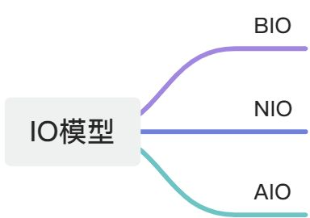
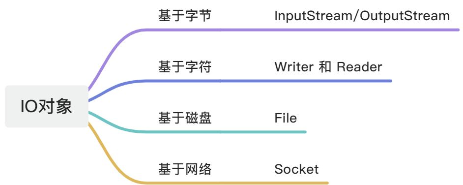
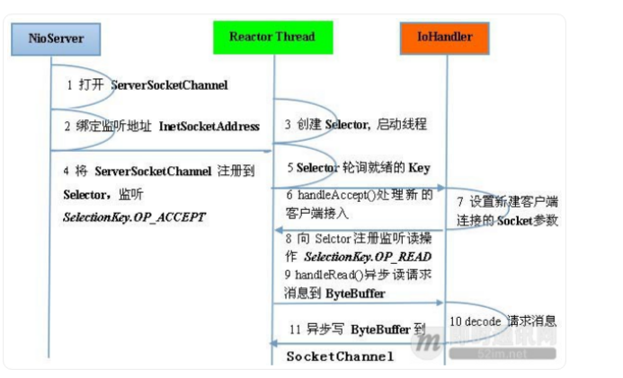
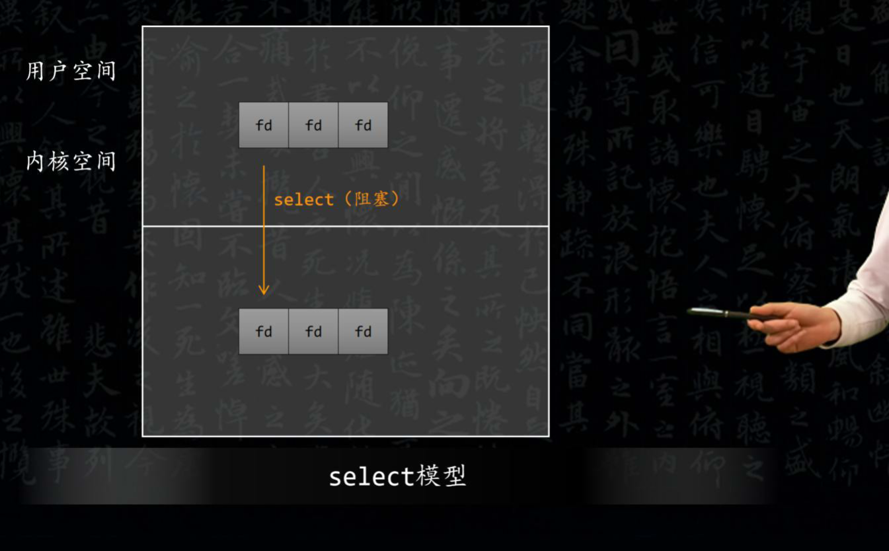
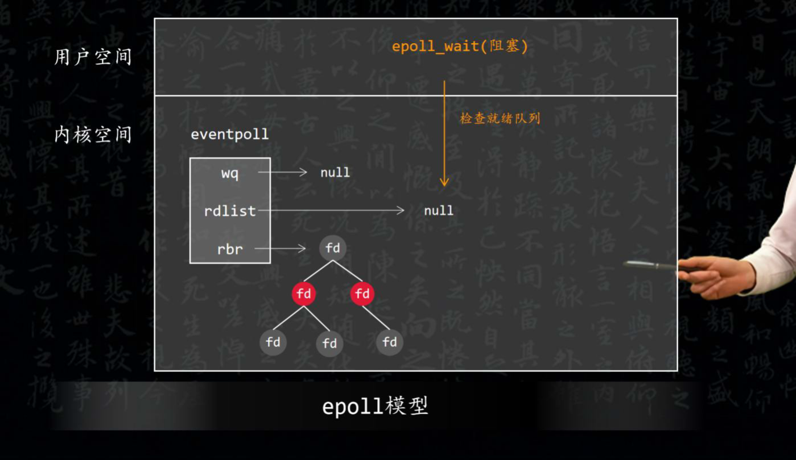
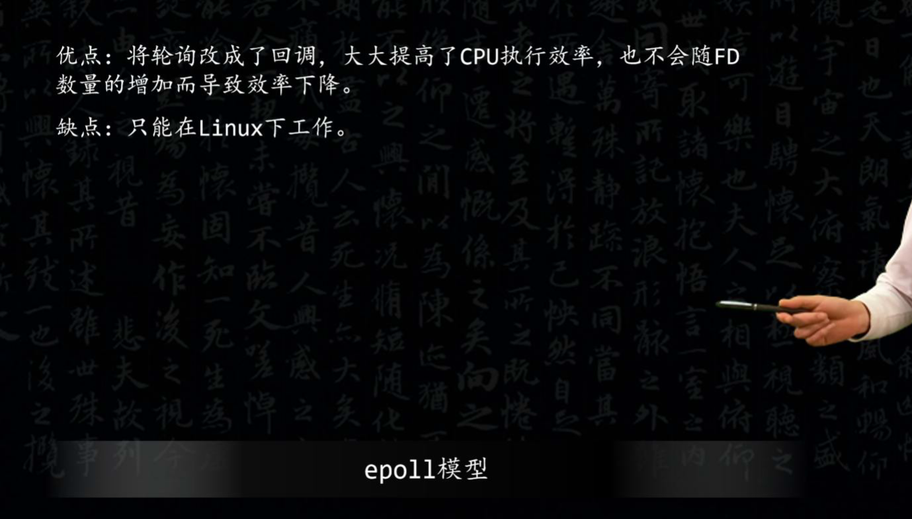

# IO/NIO

## 参考
> [BIO，NIO，AIO区别_Meiko丶的博客-CSDN博客_bio,nio,aio](https://blog.csdn.net/u010365819/article/details/119042870)
>

### Reader和InputStream区别
Reader用于读入16位字符，也就是 Unicode 编码的字符;

而 InputStream 用于读入 ASCII 字符和二进制数据。

### 说一说对 java IO 的理解
+ 按照使用的 IO 模型，大致可以分为三类: 
    - BIO：JDK1.4 之前的阻塞 IO
    - NIO：JDK1.4 及以后的版本,非阻塞 IO
    - AIO：JDK1.7 之后，又叫 NIO.2,异步 IO

+ IO 总的来说分为两个阶段，第一阶段是等待数据到达**内核缓冲区**，第二阶段是将数据从内核缓冲区复制到**用户缓冲区**。 
    - 阻塞 IO 是<u>两个阶段都保持阻塞状态</u>。
    - 非阻塞 IO <u>第一个阶段不阻塞</u>，但是需要轮询来查看第一阶段是否完成，完成以后再进行第二阶段，第二阶段也是需要阻塞的。
    - IO 复用使用 select/poll，<u>阻塞在这两个系统调用</u>上，而不是真正的 IO 操作上，这种方式的优势是可以同时监听多个文件描述符。检查文件描述符是否就绪的工作是由 select/poll 系统调用来负责的。Java 的 NIO 组合使用了 **IO 复用** + **非阻塞 IO **两种 IO 模型。不过 Linux 版的 JDK 底层使用的系统调用是 epoll，它使用的模型与信号驱动式 IO 模型类似，当 IO 就绪时会收到消息，不需要自己去做轮询工作。所以，epoll 效率相比 select/poll 会好上很多。但是 epoll 的缺点是可移植性较差，是 Linux 平台专有的系统调用，select/poll 就比较通用了。
    - 信号驱动式 IO 在第一阶段完成后发送信号，该阶段不阻塞，不轮询，然后阻塞进行第二阶段。
    - 异步 IO 在两个阶段都完成以后才发送信号，数据是直接可用的。
+ 按照 IO 的对象，可以分为 4 类。分别是： 
    - 基于字节操作的 I/O 接口：InputStream 和 OutputStream
    - 基于字符操作的 I/O 接口：Writer 和 Reader
    - 基于磁盘操作的 I/O 接口：File
    - 基于网络操作的 I/O 接口：Socket

### NIO
非阻塞IO。

三个特点： 

1. Channels 和 Buffers，通过 Channels 访问 Buffers， 一个Channel 代表一个文件描述符
2. Non-blocking IO，非阻塞 IO
3. Selectors，单线程，监控 Multiple Channels

### select、epoll 的区别？底层的数据结构是什么？
select和epoll都是用于实现多路复用的机制，但它们在底层的数据结构和实现方式上有所不同。

select底层的数据结构是fd_set，它是一个文件描述符集合，用于监视文件描述符的状态。当有文件描述符就绪时，select会将这些就绪的文件描述符放入一个队列中，并按照它们的顺序依次处理。select会轮询这个队列，直到队列为空。当有文件描述符变为阻塞状态时，select会从队列中取出一个文件描述符进行处理，并将处理过的文件描述符放回队列中。

epoll底层的数据结构是epoll_set，它也是一个文件描述符集合，但与fd_set不同的是，epoll_set用于监视文件描述符的事件。当有事件发生时，epoll会将与事件相关的文件描述符放入一个队列中，并按照它们的顺序依次处理。epoll会轮询这个队列，直到队列为空。当有文件描述符变为就绪状态时，epoll会从队列中取出一个文件描述符进行处理，并将处理过的文件描述符放回队列中。

总之，select和epoll都是用于实现多路复用的机制，但它们的底层数据结构和实现方式不同。select用于监视文件描述符的状态，而epoll用于监视文件描述符的事件。

> [Select和Epoll底层实现的区别_低调的JVM的博客-CSDN博客](https://blog.csdn.net/qq_27529917/article/details/82945450)
>
> [epoll和select的区别_菜-农的博客-CSDN博客_epoll和select的区别](https://blog.csdn.net/qq_34022469/article/details/52804563)
>

### 同步IO 和异步IO 的区别？
+ 同步IO，是一种用户空间和内核空间的IO发起方式。同步是指用户空间的线程是主动发起IO请求的一方，内核空间是被动接受方。异步IO则反过来，是指系统内核是主动发起IO请求的一方，用户空间的线程是被动接受方。
+ 异步IO，指的是用户空间与内核空间的调用方式反过来。用户空间的线程变成被动接受者，而内核空间成了主动调用者。这有点类似于Java中比较典型的[回调](https://so.csdn.net/so/search?q=%E5%9B%9E%E8%B0%83&spm=1001.2101.3001.7020)模式，用户空间的线程向内核空间注册了各种IO事件的回调函数，由内核去主动调用。

> [同步IO和异步IO的区别_414丶小哥的博客-CSDN博客_同步io和异步io的区别](https://blog.csdn.net/u010838785/article/details/104455192)
>

### BIO、NIO和AIO的区别？
+ BIO：**一个连接一个线程**，客户端有连接请求时服务器端就需要启动一个线程进行处理。线程开销大。
+ IO：将请求连接放入线程池，一对多，但线程还是很宝贵的资源。 
+ NIO：**一个请求一个线程**，但客户端发送的连接请求都会注册到**多路复用器**上，多路复用器轮询到连接有I/O请求时才启动一个线程进行处理。 
+ AIO：**一个有效请求一个线程**，<u>客户端的 I/O 请求都是由 OS 先完成了再通知服务器应用</u>去启动线程进行处理。

+ BIO 是面向**流**的，NIO 是面向**缓冲区**的；
+ BIO 的各种流是**阻塞**的，而 NIO 是**非阻塞**的；
+ BIO的 Stream 是**单向**的，而 NIO 的 channel 是**双向**的。

NIO 的特点：事件驱动模型、单线程处理多任务、非阻塞I/O，I/O 读写不再阻塞，而是返回0、基于 block 的传输比基于流的传输更高效、更高级的 IO 函数zero-copy、IO 多路复用大大提高了Java 网络应用的可伸缩性和实用性。

基于Reactor 线程模型。

在Reactor 模式中，事件分发器等待某个事件或者可应用或个操作的状态发生，事件分发器就把这个事件传给事先注册的事件处理函数或者回调函数，由后者来做实际的读写操 作。如在Reactor 中实现读：注册读就绪事件和相应的事件处理器、事件分发器等待事件、事件到来，激活分发器，分发器调用事件对应的处理器、事件处理器完成实际的读操作，处理读到的数据，注册新的事件，然后返还控制权。

### NIO 的组成？
+ Buffer：与Channel 进行交互，数据是从Channel 读入缓冲区，从缓冲区写入Channel 中的。
+ flip 方法：反转此缓冲区，将positIOn 给limit，然后将positIOn 置为0，其实就是切换读写模式
+ clear 方法：清除此缓冲区，将positIOn 置为0，把capacity 的值给limit。rewind 方法：重绕此缓冲区，将positIOn 置为0。

DirectByteBuffer 可减少一次系统空间到用户空间的拷贝。但 Buffer 创建和销毁的成本更高，不可控，通常会用内存池来提高性能。直接缓冲区主要分配给那些易受基础系统的本机 I/O	操作影响的大型、持久的缓冲区。如果数据量比较小的中小应用情况下，可以考虑使用 heapBuffer，由 JVM 进行管理。

Channel：表示IO 源与目标打开的连接，是双向的，但不能直接访问数据，只能与Buffer进行交互。通过源码可知，FileChannel 的read 方法和write 方法都导致数据复制了两次！

Selector 可使一个单独的线程管理多个 Channel，open 方法可创建 Selector，register 方法向多路复用器器注册通道，可以监听的事件类型：读、写、连接、accept。注册事件后会产生一个 SelectIOnKey：它表示 SelectableChannel 和 Selector	之间的注册关系，wakeup 方法：使尚未返回的第一个选择操作立即返回，唤醒的原因是：注册了新的 channel 或者事件；channel 关闭，取消注册；优先级更高的事件触发（如定时器事件），希望及时处理。

Selector 在Linux 的实现类是EPollSelectorImpl，委托给EPollArrayWrapper 实现，其中三个native 方法是对 epoll 的封装，而 EPollSelectorImpl.	implRegister 方法，通过调用 epoll_ctl向 epoll 实例中注册事件，还将注册的文件描述符(fd)与 SelectIOnKey 的对应关系添加到fdToKey 中，这个 map 维护了文件描述符与 SelectIOnKey 的映射。

fdToKey 有时会变得非常大，因为注册到Selector 上的Channel 非常多（百万连接）；过期或失效的Channel 没有及时关闭。fdToKey 总是串行读取的，而读取是在select 方法中进行的，该方法是非线程安全的。

Pipe：两个线程之间的单向数据连接，数据会被写到sink 通道，从source 通道读取

NIO 的服务端建立过程：

+ Selector.open()：打开一个Selector；
+ ServerSocketChannel.open()：创建服务端的Channel；
+ bind()：绑定到某个端口上。并配置非阻塞模式；
+ register()：注册Channel 和关注的事件到Selector 上；
+ select()轮询拿到已经就绪的事件

### BIO、NIO和AIO
+ **BIO：** **同步并阻塞**，服务器实现模式为一个连接一个线程，即客户端有连接请求时服务器端就需要启动一个线程进行处理（**一客户端一线程**）。该模型最大的问题就是缺乏弹性伸缩能力，当客户端并发访问量增加后，服务端的线程数与客户端并发访问数呈1:1的关系，系统性能将急剧下降，随着**并发访问量的继续增加**，系统会发生**线程堆栈溢出、创建新线程失败**等问题，并最终导致宕机或僵死。
+ **NIO：****异步非阻塞**，服务器实现模式为**一个请求一个线程**，客户端发送的连接请求都会注册到多路复用器上，多路复用器轮询到连接有**I/O请求时才启动一个线程**进行处理。
+ **AIO：**JDK1.7升级了NIO库，升级后的NIO库被称为NIO2.0，正式引入了**异步通道**的概念。NIO2.0的**异步套接字**通道是真正的异步非阻塞I/O，此即AIO。其服务器实现模式为**一个有效请求一个线程**，客户端的I/O请求都是由OS先完成了再通知服务器应用去启动线程进行处理。

### BIO和NIO的区别是什么？分别适合于什么场景？
BIO和NIO都是用于实现高效的输入输出的I/O机制，但它们之间有以下区别：

1. 线程模型：BIO使用单线程模型，每个连接都有一个独立的线程进行监听和处理。当有多个客户端连接到服务器时，线程数会增加，但是每个连接的处理速度都比较快。NIO使用多线程模型，每个连接都有一个专门的线程进行监听和处理，当有多个客户端连接到服务器时，可以利用线程池来管理线程，提高I/O处理的效率。
2. 适用场景：BIO适用于连接数目较少，但是每次发送的数据量较大的场景，例如网络游戏等。在这种场景下，每个连接都需要独立的线程进行处理，所以可以充分利用服务器的资源，提高处理速度。而在NIO中，当连接数目较多时，可以使用多个线程来同时监听和处理多个连接，从而充分利用服务器的资源，提高处理速度。
3. 实现难度：BIO的实现相对简单，但是当连接数目增多时，会导致性能下降和资源浪费。NIO的实现相对复杂，需要使用一些特殊的技术，例如非阻塞I/O和事件驱动等，但是在高并发和大量连接的情况下，可以比BIO更好地提高效率。

综上所述，BIO适合于连接数目较少、每次发送数据量较大的场景，而NIO适合于连接数目较多、每次发送数据量较小的场景。在实际应用中，可以根据具体的场景选择合适的I/O机制。

### NIO说一下你的理解
我来简单解释一下 NIO：

1. NIO是不带阻塞的 I/O：传统的 I/O 是带有阻塞机制的，当一个线程写入或读取一个共享资源时，会唤醒一个阻塞线程，该线程会等待资源被释放，才能继续执行。这种阻塞机制会导致线程阻塞在等待状态，降低了系统的吞吐量和响应速度。而 NIO 是不带阻塞的，它会将所有的读写操作放到一个队列中，当队列满了或者队列为空时，会自动阻塞或唤醒一个线程进行处理，从而避免了线程阻塞的问题。
2. NIO提供了更高的并发性：由于 NIO 不带阻塞机制，当多个客户端连接到服务器时，可以同时进行读写操作，提高了系统的并发性。
3. NIO可以支持更多的数据类型：相比传统的 I/O，NIO可以支持更多的数据类型，例如 char、short、int、long、float 和 double 等。这样可以更好地支持复杂的数据处理和计算。
4. NIO提供了更好的延迟性能：由于 NIO使用了事件驱动的机制，可以更好地控制读写操作的顺序，从而减少了延迟。
5. NIO适用于大规模的分布式系统：由于 NIO 提供了非阻塞的机制，可以更好地支持大规模的分布式系统，从而提高系统的性能和可靠性。

总之，NIO相比传统的 I/O 有更好的并发性、更高的数据类型支持、更好的延迟性能和适用于大规模分布式系统的优点。

### NIO是否了解？阻塞之后通知机制是怎样的？
NIO（New I/O）是一种用于实现高效输入输出的I/O机制，它通过提供非阻塞式的通信方式来解决阻塞问题。与传统的阻塞式I/O机制不同，NIO不会阻塞线程，使得多个线程可以同时进行读写操作，提高了系统的吞吐量和响应速度。

在NIO中，每个连接都由一个独立的线程进行监听和处理，当有多个客户端连接到服务器时，可以利用线程池来管理线程，提高I/O处理的效率。当有读写请求到达时，NIO会将请求放到一个队列中，并按照队列的顺序依次处理。当队列为空时，会自动阻塞或唤醒一个线程进行处理，从而避免了线程阻塞的问题。

与传统的阻塞式I/O机制相比，NIO具有更好的并发性和延迟性能。由于不带阻塞机制，当多个客户端连接到服务器时，可以同时进行读写操作，提高了系统的并发性。同时，NIO可以控制读写操作的顺序，减少了延迟。

在NIO中，当线程进行读写数据时，会触发事件，例如读取数据、写入数据、接收数据等。事件由事件驱动，可以更好地控制事件的顺序，从而减少了延迟。同时，NIO提供了非阻塞式的通信方式，避免了传统阻塞式I/O机制中线程阻塞等待的问题。

总之，NIO是一种高效、并发性好、延迟性能优秀的I/O机制，适用于大规模的分布式系统。

### Java中的NIO，BIO，AIO分别是什么？
+ 同步阻塞IO（JAVA BIO）：

    同步并阻塞，服务器实现模式为一个连接一个线程，即客户端有连接请求时服务器端就需要启动一个线程进行处理，如果这个连接不做任何事情会造成不必要的线程开销，当然可以通过线程池机制改善。

同步非阻塞IO(Java NIO) ： 同步非阻塞，服务器实现模式为一个请求一个线程，即客户端发送的连接请求都会注册到多路复用器上，多路复用器轮询到连接有I/O请求时才启动一个线程进行处理。用户进程也需要时不时的询问IO操作是否就绪，这就要求用户进程不停的去询问。

+ 异步阻塞IO（Java NIO）： 

   此种方式下是指应用发起一个IO操作以后，不等待内核IO操作的完成，等内核完成IO操作以后会通知应用程序，这其实就是同步和异步最关键的区别，同步必须等待或者主动的去询问IO是否完成，那么为什么说是阻塞的呢？因为此时是通过select系统调用来完成的，而select函数本身的实现方式是阻塞的，而采用select函数有个好处就是它可以同时监听多个文件句柄（如果从UNP的角度看，select属于同步操作。因为select之后，进程还需要读写数据），从而提高系统的并发性！ 

+ （Java AIO(NIO.2)）异步非阻塞IO: 

   在此种模式下，用户进程只需要发起一个IO操作然后立即返回，等IO操作真正的完成以后，应用程序会得到IO操作完成的通知，此时用户进程只需要对数据进行处理就好了，不需要进行实际的IO读写操作，因为真正的IO读取或者写入操作已经由内核完成了。    

### IO和NIO本质不同在实际项目使用场景及如何使用
主要考察NIO使用场景

### Java中的NIO，BIO，AIO分别是什么？
+ BIO
    - 同步并阻塞，服务器实现模式为一个连接一个线程，即客户端有连接请求时服务器端就需要启动一个线程进行处理，如果这个连接不做任何事情会造成不必要的线程开销，当然可以通过线程池机制改善。
    - BIO方式适用于连接数目比较小且固定的架构，这种方式对服务器资源要求比较高，并发局限于应用中， JDK1.4以前的唯一选择，但程序直观简单易理解。
+ NIO
    - 同步非阻塞，服务器实现模式为一个请求一个线程，即客户端发送的连接请求都会注册到多路复用器上，多路复用器轮询到连接有I/O请求时才启动一个线程进行处理。
    - NIO方式适用于连接数目多且连接比较短（轻操作）的架构，比如聊天服务器，并发局限于应用中，编程比较复杂，JDK1.4开始支持。
+ AIO
    - 异步非阻塞，服务器实现模式为一个有效请求一个线程，客户端的I/O请求都是由OS先完成了再通知服务器应用去启动线程进行处理.
    - AIO方式使用于连接数目多且连接比较长（重操作）的架构，比如相册服务器，充分调用OS参与并发操作，编程比较复杂，JDK7开始支持。

### 使用传统的 Socket 开发挺简单的，我为什么要切换到 NIO 进行编程呢？
1. 线程模型存在致命缺陷：一连接一线程的模型导致服务端无法承受大量客户端的并发连接；
2. 性能差：频繁的线程上下文切换导致 CPU 利用效率不高；
3. 可靠性差：由于所有的 IO 操作都是同步的，所以业务线程只要进行 IO 操作，也会存在被同步阻塞的风险，这会导致系统的可靠性差，依赖外部组件的处理能力和网络的情况。
4. 采用非阻塞 IO（NIO）之后，同步阻塞 IO 的三个缺陷都将迎刃而解：
5. NIO 采用 Reactor 模式，一个 Reactor 线程聚合一个多路复用器 Selector，它可以同时注册、监听和轮询成百上千个 Channel，一个 IO 线程可以同时并发处理N个客户端连接，线程模型优化为1：N（N < 进程可用的最大句柄数）或者 M : N (M通常为 CPU 核数 + 1， N < 进程可用的最大句柄数)；
6. 由于 IO 线程总数有限，不会存在频繁的 IO 线程之间上下文切换和竞争，CPU 利用率高；
7. 所有的 IO 操作都是异步的，即使业务线程直接进行 IO 操作，也不会被同步阻塞，系统不再依赖外部的网络环境和外部应用程序的处理性能。

由于切换到 NIO 编程之后可以为系统带来巨大的可靠性、性能提升，所以，目前采用 NIO 进行通信已经逐渐成为主流。

### 原生的 NIO 在JDK 1.7 版本存在epoll bug
它会导致Selector 空轮询，最终导致CPU 100%。官方声称在JDK 1.6 版本的update18 修复了该问题，但是直到JDK 1.7 版本该问题仍旧存在，只不过该BUG 发生概率降低了一些而已，它并没有得到根本性解决。

### IO模型有哪些？
IO模型是指计算机系统中进行输入输出操作的一种模型。在计算机系统中，IO模型是指处理输入输出请求和数据的一种机制。输入输出是计算机系统的基本操作，它们涉及到数据的读取、写入和处理等。在不同的IO模型中，数据的读取和写入方式不同，处理速度也不同。以下是五种常见的IO模型：

1. 阻塞IO模型：当有输入输出请求时，程序会被阻塞，直到有空闲的设备可用。这种模型适用于需要等待某些事件发生才能继续进行的操作。
2. 非阻塞IO模型：当有输入输出请求时，程序不会被阻塞，而是立即响应请求。这种模型适用于不需要等待某些事件发生就可以继续进行的操作。
3. I/O复用模型：将I/O操作与其他操作合并在一起，例如读写文件或执行计算操作。这种模型适用于需要执行多个I/O操作的情况，但请求的数量不是很大的情况下。
4. 信号驱动IO模型：程序在读取或写入数据时会产生一个信号，该信号被IO设备检测到，并根据信号的状态进行相应的处理。这种模型适用于对实时性要求较高的场景。
5. 异步IO模型：程序在读取或写入数据时不会阻塞，而是异步地进行。这种模型适用于对实时性要求较低的场景，但需要支持高并发的读写操作。

这些IO模型在不同的场景中有不同的应用，开发者需要根据具体的需求选择合适的IO模型。

### 讲讲你理解的NIO，他和BIO，AIO的区别是啥
我来简单解释一下 NIO：

1. NIO是不带阻塞的 I/O：传统的 I/O 是带有阻塞机制的，当一个线程写入或读取一个共享资源时，会唤醒一个阻塞线程，该线程会等待资源被释放，才能继续执行。这种阻塞机制会导致线程阻塞在等待状态，降低了系统的吞吐量和响应速度。而 NIO 是不带阻塞的，它会将所有的读写操作放到一个队列中，当队列满了或者队列为空时，会自动阻塞或唤醒一个线程进行处理，从而避免了线程阻塞的问题。
2. NIO提供了更高的并发性：由于 NIO不带阻塞机制，当多个客户端连接到服务器时，可以同时进行读写操作，提高了系统的并发性。
3. NIO可以支持更多的数据类型：相比传统的 I/O，NIO可以支持更多的数据类型，例如 char、short、int、long、float 和 double 等。这样可以更好地支持复杂的数据处理和计算。
4. NIO提供了更好的延迟性能：由于 NIO使用了事件驱动的机制，可以更好地控制读写操作的顺序，从而减少了延迟。
5. NIO适用于大规模的分布式系统：由于 NIO提供了非阻塞的机制，可以更好地支持大规模的分布式系统，从而提高系统的性能和可靠性。

总之，NIO相比传统的 I/O 有更好的并发性、更高的数据类型支持、更好的延迟性能和适用于大规模分布式系统的优点

### 谈谈reactor模型
Reactor模型是一种事件驱动的编程模型，其中事件是由I/O事件触发的。该模型包含三个基本角色：Reactor、Acceptor和Handler。

Reactor负责将I/O事件分派给对应的Handler，Acceptor则处理客户端新连接和请求，并分派请求到处理器链中。当客户端连接到服务器时，Reactor会将其注册为一个新的连接，并触发connect事件。当有读写事件发生时，Acceptor会将其注册为一个事件，并将事件传递给Handler进行处理。

这种模型适用于处理器链中业务处理组件能快速完成的场景。在这种模型中，Reactor线程负责多路分离套接字，并将请求分派给对应的Handler进行处理。这样可以避免线程阻塞，提高系统的吞吐量和响应速度。

### Java IO与NIO
NIO是为了弥补IO操作的不足而诞生的，NIO的一些新特性有：非阻塞I/O，选择器，缓冲以及管道。管道（Channel），缓冲（Buffer） ，选择器（ Selector）是其主要特征

IO是面向流的，NIO是面向块（缓冲区）的。

IO是阻塞的，NIO是非阻塞的。

多连接，少数据可以用NIO

少连接，大数据可以用IO

### epoll 和 poll 的区别，及其应用场景 
select 和 epoll 都是 I/O 多路复用的方式，但是 select 是通过不断轮询监听 socket 实 

现，epoll 是当 socket 有变化时通过回掉的方式主动告知用户进程实现 

> [select&epoll&poll - Reup - 博客园](https://www.cnblogs.com/hsmwlyl/p/10652503.html)
>

### BIO 与 NIO 的区别
1. BIO同步阻塞IO：在此种⽅式下，⽤户进程在发起⼀个IO操作以后，必须等待IO操作的完成，只有当真正完成了IO操作以后，⽤户进程才能运⾏。JAVA传统的IO模型属于此种⽅式！ 
2. NIO同步⾮阻塞式I/O；java NIO采⽤了双向通道进⾏数据传输，在通道上我们可以注册我们感兴趣的事件：连接事件、读写事件；NIO主要有三⼤核⼼部分：Channel(通道)，Buffer(缓冲区), Selector。
3. 传统IO基于字节流和字符流进⾏操作，⽽ NIO基于Channel和 Buffer(缓冲区)进⾏操作，数据总是从通道读取到缓冲区中，或者从缓冲区写⼊到通道中。Selector(选择区)⽤于监听多个通道的事件 （⽐如：连接打开，数据到达）。因此，单个线程可以监听多个数据通道。 
1. BIO （Blocking I/O）：同步阻塞I/O模式，数据的读取写⼊必须阻塞在⼀个线程内等待其完成。  
这⾥使⽤那个经典的烧开⽔例⼦，这⾥假设⼀个烧开⽔的场景，有⼀排⽔壶在烧开⽔，BIO的⼯作模式就是， 叫⼀个线程停留在⼀个⽔壶那，直到这个⽔壶烧开，才去处理下⼀个⽔壶。但是实际上线程在等待⽔壶烧开的时间段什么都没有做。 
2. NIO （New I/O）：同时⽀持阻塞与⾮阻塞模式，但这⾥我们以其同步⾮阻塞I/O模式来说明，那么什么叫做同步⾮阻塞？  
如果还拿烧开⽔来说，NIO的做法是叫⼀个线程不断的轮询每个⽔壶的状态，看看是否有⽔壶的状态发⽣了改变，从⽽进⾏下⼀步的操作。 
3. AIO （ Asynchronous I/O）：异步⾮阻塞I/O模型。异步⾮阻塞与同步⾮阻塞的区别在哪⾥？异步⾮阻塞⽆需⼀个线程去轮询所有IO操作的状态改变，在相应的状态改变后，系统会通知对应的线程来处理。  
对应到烧开⽔中就是，为每个⽔壶上⾯装了⼀个开关，⽔烧开之后，⽔壶会⾃动通知我⽔烧开了。 

### select与poll的区别
1. IO多路复⽤： 
    1. 概念：IO多路复⽤是指内核⼀旦发现进程指定的⼀个或者多个IO条件准备读取，它就通知该进程。 
    2. 优势：与多进程和多线程技术相⽐，I/O多路复⽤技术的最⼤优势是系统开销⼩，系统不必创建进程/线程，也不必维护这些进程/线程，从⽽⼤⼤减⼩了系统的开销。 
    3. 系统：⽬前⽀持I/O多路复⽤的系统调⽤有 select，pselect，poll，epoll。 
2. select：select⽬前⼏乎在所有的平台上⽀持，其良好跨平台⽀持也是它的⼀个优点。select的⼀个缺点在于<u>单个进程能够监视的</u>**<u>⽂件描述符</u>**<u>的</u>**<u>数量</u>**<u>存在最⼤限制</u>，在Linux上⼀般为1024，可以通过修改宏定义甚⾄重新编译内核的⽅式提升这⼀限制，但是这样也会造成效率的降低。 
3. poll：它没有最⼤连接数的限制，原因是它是基于链表来存储的，但是同样有⼀个缺点： 
    1. ⼤量的fd的数组被整体复制于⽤户态和内核地址空间之间，⽽不管这样的复制是不是有意义。
    2. poll还有⼀个特点是“⽔平触发”，如果报告了fd后，没有被处理，那么下次poll时会再次报告该fd。 

> epoll跟select都能提供多路I/O复⽤的解决⽅案。在现在的Linux内核⾥有都能够⽀持，其中epoll是Linux所特有，⽽select则应该是POSIX所规定，⼀般操作系统均有实现。
>

### BIO、NIO、AIO的区别？
+ **同步阻塞IO **: 用户进程发起一个IO操作以后，必须等待IO操作的真正完成后，才能继续运行。
+ **同步非阻塞IO**: 客户端与服务器通过**Channel**连接，采用**多路复用器**轮询注册的Channel 。提高吞吐量和可靠性。用户进程发起一个IO操作以后，可做其它事情，但<u>用户进程需要轮询IO操作是否完成</u>，这样造成不必要的CPU资源浪费。
+ **异步非阻塞IO**: 非阻塞异步通信模式，NIO的升级版，采用**异步通道**实现异步通信，其**read**和**write**方法均是异步方法。用户进程发起一个IO操作，然后立即返回，等IO操作真正的完成以后，应用程序会得到** IO操作完成的通知**。类似Future模式。

### 字节流/字符流
字节流： 它处理单元为1个字节（byte），操作**字节**和**字节数组**，存储的是二进制文件，如果是音频文件、图片、歌曲，就用字节流好点（1byte = 8位）；

字符流： 它处理的单元为2个字节的**Unicode字符**，分别操作**字符**、**字符数组**或**字符串**，字符流是由Java虚拟机将字节转化为2个字节的Unicode字符为单位的字符而成的，如果是关系到中文（文本）的，用字符流好点（1Unicode = 2字节 = 16位）；

> [字节流和字符流详解_你这家伙的博客-CSDN博客_字节流和字符流](https://blog.csdn.net/wkh18891843165/article/details/115310276)
>

### 98.谈谈你对IO 多路复用机制的理解
一位工作5 年的小伙伴面试时被问到IO 相关的问题，说，谈谈你对IO 多路复用机制的理解。当时他说只是听过多路复用，具体细节没有了解过。今天，我给大家分享一下我的理解。

#### 1 IO 多路复用

IO 多路复用是一种同步的 IO 模型。利用 IO 多路复用模型，可以实现一个线程监视多个文件句柄；一旦某个文件句柄就绪，就能够通知到对应应用程序进行相应的读写操作；没有文件句柄就绪时就会阻塞应用程序，从而释放出 CPU 资源。

IO 可以理解为，在操作系统中，数据在内核态和用户态之间的读、写操作，大部分情况下是指网络 IO；

多路大部分情况下是指多个 TCP 连接，也就是多个 Socket 或者多个Channel；

复用是指复用一个或多个线程资源。IO 多路复用意思就是说，一个或多个线程处理多个TCP 连接。尽可能地减少系统开销，无需创建和维护过多的进程/线程。

实现 IO 多路复用的模型有三种，分别是 Select、poll 和epoll。下面详细介绍一下三种多路复用模型的基本原理和优缺点：

#### 2 select 模型

select 模型，它的基本原理是，采用轮询和遍历的方式。也就是说，在客户端操作服务器时，会创建三种文件描述符，简称 FD。分别是 writefds（写描述符）、readfds（读描述符）和exceptfds（异常描述符）。

而 select 会阻塞监视这三种文件描述符，等有数据、可读、可写、出异常或超时都会返回；

返回后通过遍历 fdset，也就是文件描述符的集合，来找到就绪的FD，然后，触发相应的 IO 操作。

它的优点是跨平台支持性好，几乎在所有的平台上支持。

它的缺点也很明显，由于 select 是采用轮询的方式进行全盘扫描，因此，随着 FD 数量增多而导致性能下降。

因此，每次调用 select()方法，都需要把 FD 集合从用户态拷贝到内核态，并进行遍历。而操作系统对单个进程打开的 FD 数量是有限制的，一般默认是 1024个。虽然，可以通过操作系统的宏定义 FD_SETSIZE 修改最大 FD 数量限制，但是，在 IO 吞吐量巨大的情况下，效率提升仍然有限。

#### 3 poll 模型

poll 模型的原理与 select 模型基本一致，也是采用轮询加遍历，唯一的区别就是poll 采用链表的方式来存储FD。

所以，它的优点点是没有最大 FD 的数量限制。

它的缺点和 select 一样，也是采用轮询方式全盘扫描，同样也会随着 FD 数量增多而导致性能下降。

#### 4 epoll 模型
由于select 和poll 都会因为吞吐量增加而导致性能下降，因此，才出现了epoll模型。

epoll 模型是采用时间通知机制来触发相关的 IO 操作。它没有 FD 个数限制，而且从用户态拷贝到内核态只需要一次。它主要通过系统底层的函数来注册、激活 FD，从而触发相关的IO 操作，这样大大提高了性能。主要是通过调用以下三个系统函数：

1、epoll_create()函数，在系统启动时，会在 Linux 内核里面申请一个B+树结构的文件系统，然后，返回 epoll 对象，也是一个 FD。

2、epoll_ctl()函数，每新建一个连接的时候，会同步更新epoll 对象中的 FD，并且绑定一个callback 回调函数。

3、epoll_wait()函数，轮询所有的 callback 集合，并触发对应的IO 操作

所以，epoll 模型最大的优点是将轮询改成了回调，大大提高了CPU 执行效率，也不会随 FD 数量的增加而导致效率下降。当然，它也没有 FD 数量限制，也就是说，它能支持的 FD 上限是操作系统的最大文件句柄数。一般而言，1G 内存大概支持10 万个句柄。分布式系统中常用的组件如Redis、Nginx 都是优先采用epoll模型。

它的缺点是只能在 Linux 下工作。

5 综合对比下表是三种多路复用模型的综合对比，有兴趣的小伙伴可以截图保存一下，或者到我的个人煮叶简介中获取。

好了，以上就是我对IO 多路复用机制的理解。

> 更新: 2023-05-14 22:55:54  
> 原文: <https://www.yuque.com/joyo/interview/gltps8>