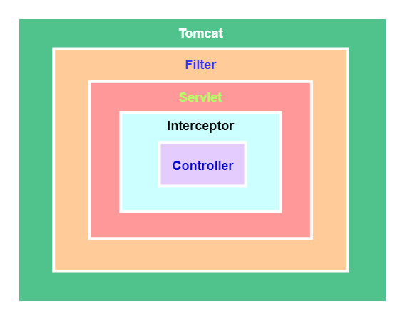

# Java Web

### Servlet 是单例吗？
Servlet 本身只是一个Java，**并不是单例结构**，所以 Servlet 是不是单例最终取决于运行它的 Web 容器。

+ 注解加载时默认是单例的。
+ 如果一个 Servlet 没有被部署在分布式的环境中，一般 web.xml 中声明的一个 Servlet 只对应一个实例。
+ <u>如果在 web.xml 中声明了几次，即使同一个 Servlet ，如果声明多次，也会生成多个实例。</u>


**<font style="color:rgb(79, 79, 79);">单实例</font>****多线程**

Servlet 容器默认是采用 **单实例多线程 **的方式处理多个请求的：

1. 当web服务器启动的时候（或客户端发送请求到服务器时），Servlet就被加载并实例化(只存在一个Servlet实例)；
2. 容器初始化 Servlet 主要就是读取配置文件（例如 tomcat 可以通过 Servlet.xml 的设置线程池中线程数目）初始化每个参数值等等。
3. 当请求到达时，Servlet 容器通过调度线程（Dispatcher Thread）调度它管理下线程池中等待执行的线程（Worker Thread）给请求者；
4. 线程执行 Servlet 的 service 方法；
5. 请求结束，放回线程池，等待被调用；

注意：避免使用实例变量（成员变量），因为如果存在成员变量，可能发生多线程同时访问该资源时，都来操作它，造成数据的不一致，因此产生线程安全问题。


**单实例有状态**

只能说 web 容器对 Servlet 实例化了一次。Servlet 只是一个普通的类，它也有自已的构造函数，可以用 new 的方式创建出多个 Servlet 的实例。Servlet 能够正常地处理 web 请求，需要交给 web 服务器（或者叫Servlet/jsp容器）来进行管理，比如说 tomcat。tomcat 通过配置文件获取映射信息，然后只会在第一次生成 Servlet 的实例并将其缓存起来，下次再次请求，同样是获取的这个实例。所以，不要把数据用成员属性进行保存，**不要让Servlet有状态**。  


> [Servlet是单例还是多例_梁云亮的博客-CSDN博客_servlet是单例还是多例](https://blog.csdn.net/lianghecai52171314/article/details/124431439)
>
> [servlet是否单例模式？ servlet是否线程安全？_java叶新东老师的博客-CSDN博客_servlet是单例,线程不安全](https://blog.csdn.net/qq_27184497/article/details/115321042)
>
> [servlet是单例的吗？_百度知道](https://zhidao.baidu.com/question/717172800984070005.html)
>
> [Servlet是单例的吗？ - 不想下火车的人 - 博客园](https://www.cnblogs.com/wuxun1997/p/10769115.html)
>

### 多线程下 Servlet 怎么保证数据安全的？
一般是单例，我们用的都是 Servlet 的 service，一般不包含实例变量，只有共享代码，所以一般是安全的。

如果有实例变量的话可以使用 **synchronized** 关键字进行加锁。

当 Servlet 实现 SingleThreadModel 接口后，Tomcat 会为该 Servlet建一个对象池，这是[享元模式](https://www.yuque.com/joyo/java/duy501)。

> 享元模式：避免大量拥有相同内容的小类的开销（如耗费内存），使大家共享一个类（元类）
>
> [23种设计模式整理（很全）.pdf](https://www.yuque.com/joyo/files/29812147)
>

### Servlet 的生命周期？ 
+ `init` 一般在 web 容器初始化，或第一次调用 Servlet 时。
+ `service` 提供服务
+ `destroy` 终结
+ 回收

### Servlet/filter作用、原理、配置
+ **Servlet**

Servlet（Server Applet）是Java Servlet的简称，称为小服务程序或服务连接器，用Java编写的服务器端程序，具有独立于平台和协议的特性，主要功能在于交互式地浏览和生成数据，生成动态Web内容。

狭义的Servlet是指Java语言实现的一个接口，广义的Servlet是指任何实现了这个Servlet接口的类，一般情况下，人们将Servlet理解为后者。Servlet运行于支持Java的应用服务器中。从原理上讲，Servlet可以响应任何类型的请求，但绝大多数情况下Servlet只用来扩展基于HTTP协议的Web服务器。

+ **Filter**

Servlet中的过滤器Filter是实现了javax.Servlet.Filter接口的服务器端程序，主要的用途是**过滤字符编码**、做一些**业务逻辑判断**等。其工作原理是，只要你在web.xml文件配置好要拦截的客户端请求，它都会帮你拦截到请求，此时你就可以对请求或响应(Request、Response)统一设置编码，简化操作；同时还可进行逻辑判断，如用户是否已经登录、有没有权限访问该页面等等工作。它是随你的web应用启动而启动的，只初始化一次，以后就可以拦截相关请求，只有当你的web应用停止或重新部署的时候才销毁。

```java
package com.hello.web.listener;

import java.io.IOException;

import javax.servlet.*;
import javax.servlet.http.HttpServletRequest;
import javax.servlet.http.HttpServletResponse;

// 主要目的：过滤字符编码；其次，做一些应用逻辑判断等.
// Filter跟web应用一起启动
// 当web应用重新启动或销毁时，Filter也被销毁
public class MyCharsetFilter implements Filter {
    private FilterConfig config = null;

    public void destroy() {
        System.out.println("MyCharsetFilter准备销毁...");
    }

    public void doFilter(ServletRequest arg0, ServletResponse arg1,FilterChain chain) throws IOException, ServletException {
        // 强制类型转换
        HttpServletRequest request = (HttpServletRequest) arg0;
        HttpServletResponse response = (HttpServletResponse) arg1;
        // 获取web.xm设置的编码集，设置到Request、Response中
        request.setCharacterEncoding(config.getInitParameter("charset"));
        response.setContentType(config.getInitParameter("contentType"));
        response.setCharacterEncoding(config.getInitParameter("charset"));
        // 将请求转发到目的地
        chain.doFilter(request, response);
    }

    public void init(FilterConfig arg0) throws ServletException {
        this.config = arg0;
        System.out.println("MyCharsetFilter初始化...");
    }
}
```

```xml
<filter>
  <filter-name>filter</filter-name>
  <filter-class>dc.gz.filters.MyCharsetFilter</filter-class>
  <init-param>
    <param-name>charset</param-name>
    <param-value>UTF-8</param-value>
  </init-param>
  <init-param>
    <param-name>contentType</param-name>
    <param-value>text/html;charset=UTF-8</param-value>
  </init-param>
</filter>
<filter-mapping>
  <filter-name>filter</filter-name>
  <!-- * 代表截获所有的请求  或指定请求，如/test.do  /xxx.do -->
  <url-pattern>/*</url-pattern>
</filter-mapping>
```

---

<font style="color:rgb(77, 77, 77);">spring中web.xml所包含的配置和作用：</font>

```xml
<?xml version="1.0" encoding="UTF-8"?>  
<web-app version="3.0" xmlns="http://java.sun.com/xml/ns/javaee"  
         xmlns:xsi="http://www.w3.org/2001/XMLSchema-instance"  
         xsi:schemaLocation="http://java.sun.com/xml/ns/javaee http://java.sun.com/xml/ns/javaee/web-app_3_0.xsd">  
 
    <!-- 在Spring框架中是如何解决从页面传来的字符串的编码问题的呢？
    下面我们来看看Spring框架给我们提供过滤器CharacterEncodingFilter  
     这个过滤器就是针对于每次浏览器请求进行过滤的，然后再其之上添加了父类没有的功能即处理字符编码。  
      其中encoding用来设置编码格式，forceEncoding用来设置是否理会
 request.getCharacterEncoding()方法，设置为true则强制覆盖之前的编码格式。-->  
    <filter>  
        <filter-name>characterEncodingFilter</filter-name>  
        <filter-class>org.springframework.web.filter.CharacterEncodingFilter</filter-class>  
        <init-param>  
            <param-name>encoding</param-name>  
            <param-value>UTF-8</param-value>  
        </init-param>  
        <init-param>  
            <param-name>forceEncoding</param-name>  
            <param-value>true</param-value>  
        </init-param>  
    </filter>  
    <filter-mapping>  
        <filter-name>characterEncodingFilter</filter-name>  
        <url-pattern>/*</url-pattern>  
    </filter-mapping>  
    <!-- 项目中使用Spring 时，applicationContext.xml配置文件中并没有BeanFactory，要想在业
务层中的class 文件中直接引用Spring容器管理的bean可通过以下方式-->  
    <!--1、在web.xml配置监听器ContextLoaderListener-->  
    <!--ContextLoaderListener的作用就是启动Web容器时，自动装配ApplicationContext的配置信息。因为
它实现了ServletContextListener这个接口，在web.xml配置这个监听器，启动容器时，就会默认执行它实现的方法。
使用servletContextListener接口，开发者能够在为客户端请求提供服务之前向servletContext中添任何对象，
这个对象在servletcontxxt启动的时候被初始化，然后在ervletContext的整个运行期间都是可见的。
    在ContextLoaderListener中关联了ContextLoader这个类，所以整个加载配置过程由ContextLoader来完成。  
    它的API说明  
    第一段说明ContextLoader可以由 ContextLoaderListener和ContextLoaderServlet生成。  
    如果查看ContextLoaderServlet的API，可以看到它也关联了ContextLoader这个类而且它实现了HttpServlet这个接口  
    第二段，ContextLoader创建的是 XmlWebApplicationContext这样一个类，它实现的接口是
    WebApplicationContext->ConfigurableWebApplicationContext->ApplicationContext->  
    BeanFactory，这样一来spring中的所有bean都由这个类来创建  
    IUploaddatafileManager uploadmanager = (IUploaddatafileManager) ContextLoaderListener
  	  .getCurrentWebApplicationContext().getBean("uploadManager");
     -->  
    <listener>  
        <listener-class>org.springframework.web.context.ContextLoaderListener</listener-class>  
    </listener>  
    <!--2、部署applicationContext的xml文件-->  
    <!--如果在web.xml中不写任何参数配置信息，默认的路径是"/WEB-INF/applicationContext.xml，  
    在WEB-INF目录下创建的xml文件的名称必须是applicationContext.xml。  
    如果是要自定义文件名可以在web.xml里加入contextConfigLocation这个context参数：  
    在<param-value> </param-value>里指定相应的xml文件名，如果有多个xml文件，可以写在一起并以“,”号分隔。  
    也可以这样applicationContext-*.xml采用通配符，比如这那个目录下有applicationContext-ibatis-base.xml，  
    applicationContext-action.xml，applicationContext-ibatis-dao.xml等文件，都会一同被载入。  
    在ContextLoaderListener中关联了ContextLoader这个类，所以整个加载配置过程由ContextLoader来完成。-->  
    <context-param>  
        <param-name>contextConfigLocation</param-name>  
        <param-value>classpath:spring/applicationContext.xml</param-value>  
    </context-param>  
    <!--如果你的DispatcherServlet拦截"/"，为了实现REST风格，拦截了所有的请求，那么同时对*.js,*.jpg等静态文件的访问也就被拦截了。-->  
    <!--方案一：激活Tomcat的defaultServlet来处理静态文件-->  
    <!--要写在DispatcherServlet的前面， 让 defaultServlet先拦截请求，这样请求就不会进入Spring了，我想性能是最好的吧。-->  
    <servlet-mapping>  
        <servlet-name>default</servlet-name>  
        <url-pattern>*.css</url-pattern>  
    </servlet-mapping>  
    <servlet-mapping>  
        <servlet-name>default</servlet-name>  
        <url-pattern>*.swf</url-pattern>  
    </servlet-mapping>  
    <servlet-mapping>  
        <servlet-name>default</servlet-name>  
        <url-pattern>*.gif</url-pattern>  
    </servlet-mapping>  
    <servlet-mapping>  
        <servlet-name>default</servlet-name>  
        <url-pattern>*.jpg</url-pattern>  
    </servlet-mapping>  
    <servlet-mapping>  
        <servlet-name>default</servlet-name>  
        <url-pattern>*.png</url-pattern>  
    </servlet-mapping>  
    <servlet-mapping>  
        <servlet-name>default</servlet-name>  
        <url-pattern>*.js</url-pattern>  
    </servlet-mapping>  
    <servlet-mapping>  
        <servlet-name>default</servlet-name>  
        <url-pattern>*.html</url-pattern>  
    </servlet-mapping>  
    <servlet-mapping>  
        <servlet-name>default</servlet-name>  
        <url-pattern>*.xml</url-pattern>  
    </servlet-mapping>  
    <servlet-mapping>  
        <servlet-name>default</servlet-name>  
        <url-pattern>*.json</url-pattern>  
    </servlet-mapping>  
    <servlet-mapping>  
        <servlet-name>default</servlet-name>  
        <url-pattern>*.map</url-pattern>  
    </servlet-mapping>  
    <!--使用Spring MVC,配置DispatcherServlet是第一步。DispatcherServlet是一个Servlet,,所以可以配置多个DispatcherServlet-->  
    <!--DispatcherServlet是前置控制器，配置在web.xml文件中的。拦截匹配的请求，Servlet拦截匹配规则要自已定义，把拦截下来的请求，依据某某规则分发到目标Controller(我们写的Action)来处理。-->  
    <servlet>  
        <servlet-name>DispatcherServlet</servlet-name><!--在DispatcherServlet的初始化过程中，框架会在web应用的 WEB-INF文件夹下寻找名为[servlet-name]-servlet.xml 的配置文件，生成文件中定义的bean。-->  
        <servlet-class>org.springframework.web.servlet.DispatcherServlet</servlet-class>  
        <!--指明了配置文件的文件名，不使用默认配置文件名，而使用dispatcher-servlet.xml配置文件。-->  
        <init-param>  
            <param-name>contextConfigLocation</param-name>  
            <!--其中<param-value>**.xml</param-value> 这里可以使用多种写法-->  
            <!--1、不写,使用默认值:/WEB-INF/<servlet-name>-servlet.xml-->  
            <!--2、<param-value>/WEB-INF/classes/dispatcher-servlet.xml</param-value>-->  
            <!--3、<param-value>classpath*:dispatcher-servlet.xml</param-value>-->  
            <!--4、多个值用逗号分隔-->  
            <param-value>classpath:spring/dispatcher-servlet.xml</param-value>  
        </init-param>  
        <load-on-startup>1</load-on-startup><!--是启动顺序，让这个Servlet随Servletp容器一起启动。-->  
    </servlet>  
    <servlet-mapping>  
        <!--这个Servlet的名字是dispatcher，可以有多个DispatcherServlet，是通过名字来区分的。每一个DispatcherServlet有自己的WebApplicationContext上下文对象。同时保存的ServletContext中和Request对象中.-->  
        <!--ApplicationContext是Spring的核心，Context我们通常解释为上下文环境，我想用“容器”来表述它更容易理解一些，ApplicationContext则是“应用的容器”了:P，Spring把Bean放在这个容器中，在需要的时候，用getBean方法取出-->  
        <servlet-name>DispatcherServlet</servlet-name>  
        <!--Servlet拦截匹配规则可以自已定义，当映射为@RequestMapping("/user/add")时，为例,拦截哪种URL合适？-->  
        <!--1、拦截*.do、*.htm， 例如：/user/add.do,这是最传统的方式，最简单也最实用。不会导致静态文件（jpg,js,css）被拦截。-->  
        <!--2、拦截/，例如：/user/add,可以实现现在很流行的REST风格。很多互联网类型的应用很喜欢这种风格的URL。弊端：会导致静态文件（jpg,js,css）被拦截后不能正常显示。 -->  
        <url-pattern>/</url-pattern> <!--会拦截URL中带“/”的请求。-->  
    </servlet-mapping>  
    <welcome-file-list><!--指定欢迎页面-->  
        <welcome-file>login.html</welcome-file>  
    </welcome-file-list>  
    <error-page> <!--当系统出现404错误，跳转到页面nopage.html-->  
        <error-code>404</error-code>  
        <location>/nopage.html</location>  
    </error-page>  
    <error-page> <!--当系统出现java.lang.NullPointerException，跳转到页面error.html-->  
        <exception-type>java.lang.NullPointerException</exception-type>  
        <location>/error.html</location>  
    </error-page>  
    <session-config><!--会话超时配置，单位分钟-->  
        <session-timeout>360</session-timeout>  
    </session-config>  
</web-app>
```

****

> [web.xml中的配置，servlet，filter，listener的作用和原理_深山猿的博客-CSDN博客](https://blog.csdn.net/h2604396739/article/details/84899251)
>

### Servlet的生命周期
Servlet接口定义了5个方法，其中前三个方法与Servlet生命周期相关：

```java
// 初始化
void init(ServletConfig config) throws ServletException;
// 服务
void service(ServletRequest req, ServletResponse resp) throws ServletException, java.io.IOException;
// 销毁
void destory();

// 获得servlet信息
java.lang.String getServletInfo();
// 获取servlet配置
ServletConfig getServletConfig();
```

生命周期：

+ Web容器加载Servlet并将其实例化后，Servlet生命周期开始，容器运行其init()方法进行Servlet的初始化；
+ 请求到达时调用Servlet的service()方法，service()方法会根据需要调用与请求对应的doGet或doPost等方法；
+ 当服务器关闭或项目被卸载时服务器会将Servlet实例销毁，此时会调用Servlet的destroy()方法。

### Jsp和Servlet的区别
+ Servlet是**一个特殊的Java程序**，它运行于服务器的JVM中，能够依靠服务器的支持向浏览器提供显示内容。**JSP本质上是 Servlet的一种简易形式**，JSP会被服务器处理成一个类似于Servlet的Java程序，可以简化页面内容的生成。
+ Servlet和JSP最主要的不同点在于，Servlet的应用逻辑是在Java文件中，并且完全从表示层中的HTML分离开来。而JSP的情况是Java和 HTML可以组合成一个扩展名为.jsp的文件。有人说，Servlet就是在Java中写HTML，而JSP就是在HTML中写Java代码，当然这个说法是很片面且不够准确的。**JSP侧重于视图**，**Servlet更侧重于控制逻辑**，在MVC架构模式中，JSP适合充当视图（view）而Servlet适合充当控制器。

### 保存会话状态有哪些方式？区别如何？
由于HTTP协议本身是无状态的，服务器为了区分不同的用户，就需要对用户会话进行跟踪。简单的说就是为用户进行登记，为用户分配唯一的ID，下一次用户在请求中包含此ID，服务器据此判断到底是哪一个用户。

① URL重写：在URL中添加用户会话的信息作为请求的参数，或者将唯一的会话ID添加到URL结尾以标识一个会话。

② 设置表单隐藏域：将和会话跟踪相关的字段添加到隐式表单域中，这些信息不会在浏览器中显示但是提交表单时会提交给服务器。

①和②这两种方式很难处理跨越多个页面的信息传递，因为如果每次都要修改URL或在页面中添加隐式表单域来存储用户会话相关信息，事情将变得非常麻烦。

**补充：**HTML5中可以使用**Web Storage**技术通过JavaScript来保存数据，例如可以使用**localStorage**和 **sessionStorage**来保存用户会话的信息，也能够实现会话跟踪。

### Cookie 和 Session 的区别
+ Session 在服务器端，Cookie 在客户端（浏览器）
+ Session 的运行依赖 Session id，而 Session id 是存在 Cookie 中的，也就是说，如果浏览器禁用了 Cookie ，同时 Session也会失效（但是可以通过其它方式实现，比如在 url 中传递 Session_id）
+ Session 可以放在文件、数据库或内存中。
+ 用户验证这种场合一般会用 Session
+ Cookie不是很安全，别人可以分析存放在本地的Cookie并进行Cookie欺骗，考虑到安全应当使用Session。
+ Session会在一定时间内保存在服务器上。当访问增多，会比较占用你服务器的性能考虑到减轻服务器性能方面，应当使用 Cookie。
+ 单个Cookie保存的数据不能超过4K，很多浏览器都限制一个站点最多保存20个Cookie。

### Socket 编程通常出现的异常有哪些，什么情况下会出现？
+ java.net.BindException: Address already in use: JVM_Bind  
端口占用
+ java.net.SocketException: Connection refused: connect  
连接拒绝
+ java.net.SocketException: Socket is closed  
sokcet 被关闭
+ java.net.SocketException: （Connection reset或者Connect reset by peer:Socket write error）  
连接异常断开后，读和写操作引发的异常。
+ java.net.SocketException:Broken pipe  
该异常在客户端和服务器均有可能发送。
+ java.net.SocketTimeoutException  
socket超时
+ java.net.SocketException: Too many open files  
操作系统中打开的文件的最大句柄数受限所致，常常发生在很多个并发用户访问服务器的时候。
+ Processing of multipart/form-data request failed. Unexpected EOF read on the socket  
服务器读数据的过程中读到了异常的文件结束标识（end of file），可能是客户端上传过程主动取消上传，或者网络不稳定导致数据流中断。

> [socket异常分析_融极的博客-CSDN博客_socket连接错误及原因](https://blog.csdn.net/tianzhonghaoqing/article/details/120161221)
>

### 过滤器和拦截器的区别
+ Filter 的使用

首先，要使用 Filter，必须实现`javax.servlet.Filter`接口：

```java
public interface Filter {
    //web应用加载进容器，Filter对象创建之后，执行init方法初始化，用于加载资源，只执行一次。 
    public default void init(FilterConfig filterConfig) throws ServletException {}
    //每次请求或响应被拦截时执行，可执行多次。
    public void doFilter(ServletRequest request, ServletResponse response,
                         FilterChain chain) throws IOException, ServletException;
    //web应用移除容器，服务器被正常关闭，则执行destroy方法，用于释放资源，只执行一次。
    public default void destroy() {}
}
```

    - init 和 destroy 是 default 方法，实现类可以不用实现。
    - doFilter 必须实现，也就是说，作为一个过滤器，doFilter 必须要定义。
    - doFlilter 方法中传进来的 FilterChain 对象用来调用下一个过滤器。
+ 拦截器的使用

```java
public interface HandlerInterceptor {
    //拦截handler的执行 --> 在HanlerMapping决定适合的handler之后，[在HandlerAdater调用handler之前执行。]
    default boolean preHandle(HttpServletRequest request, HttpServletResponse response, Object handler)
        throws Exception {
        return true;
    }
    //拦截handler的执行 --> [在HandlerAdapter调用handler之后]，在DispatcherServlet渲染视图之前执行
    default void postHandle(HttpServletRequest request, HttpServletResponse response, Object handler,
                            @Nullable ModelAndView modelAndView) throws Exception {
    }
    //视图渲染后调用，且只有preHandle结果为true，才会调用
    default void afterCompletion(HttpServletRequest request, HttpServletResponse response, Object handler,
                                 @Nullable Exception ex) throws Exception {
    }
}
```

```java
//DispatcherServlet
if (!mappedHandler.applyPreHandle(processedRequest, response)) {
    return; //遍历所有的interceptors，调用preHandle方法，只有返回true，才能进行下去
}
// 这里也就是处理Contrller
mv = ha.handle(processedRequest, response, mappedHandler.getHandler());
//视图渲染
applyDefaultViewName(processedRequest, mv);
//视图渲染之后调用
mappedHandler.applyPostHandle(processedRequest, response, mv);
```

+ 过滤器与拦截器的区别
    - 实现原理不同
        * 过滤器的实现基于**回调函数**
        * 拦截器基于Java的**反射机制**【动态代理】实现。
    - 使用范围不同
        * 过滤器是 Servlet 的规范，需要实现`javax.servlet.Filter`接口，Filter 使用需要依赖于 Tomcat 等容器。
        * 拦截器是 Spring 组件，定义在`org.springframework.web.servlet`包下，由Spring容器管理【有更加丰富的生命周期处理方法，细粒度，且能够使用Spring中的资源】，不依赖 Tomcat 等容器。
    - 触发时机不同

这一段在HandlerInterceptor类的注释上可以发现，两者的触发时机是不同的：

Interceptor 很像 Filter，但是 <u>Interceptor 只对 Handler 前后进行处理</u>。然而，Filter 运行交换请求对象和响应对象。

Filter 使用 xml 配置，Interceptor 属于应用上下文


        * 过滤器：对请求在进入后 Servlet 之前或之后进行处理。
        * 拦截器：对请求在 Handler【Controller】前后进行处理。



    - 执行顺序不同

同时配置了过滤器和拦截器的情形：

```plain
MyFilter1 前
MyFilter2 前
MyInterceptor1 在Controller前执行
MyInterceptor2 在Controller前执行
controller方法执行...
MyInterceptor2 Controller之后,视图渲染之前
MyInterceptor1 Controller之后,视图渲染之前
MyInterceptor2 视图渲染完成之后执行
MyInterceptor1 视图渲染完成之后执行
MyFilter2 后
MyFilter1 后
```

        * 过滤器的顺序

每一次都将 **chain 对象**传入，达到最后接口回调的效果

        * 拦截器的顺序

preHandle1 -> preHande2 -> 【Controller】 -> postHandle2 -> postHandle1 -> afterCompletion2 -> afterComplention1。preHandle 按照注册顺序，后两个与注册顺序相反。

            + 一个拦截器的 preHandle 为 false，则之后的所有拦截器都不会执行。
            + 一个拦截器的 preHandle 为 true，则这个拦截器的 triggerAfterCompletion 一定会执行。
            + 只有所有的拦截器 preHandler 都为 true，也就是正常执行，postHandle 才会执行。
    - 控制执行顺序方式不同

两者默认都是使用**注册顺序**，如果想要认为控制执行的顺序，方式略有不同：

        * 过滤器
            + 如果想要强制改变，可以使用`@Order`注解。
        * 拦截器
            + 如果使用`order()`方法

```java
@Order(2)
@Component
public class MyFilter1 implements Filter {}
```

```java
@Component
public class WebAdapter implements WebMvcConfigurer {
    @Autowired
    MyInterceptor1 myInterceptor1;
    @Autowired
    MyInterceptor2 myInterceptor2;
    @Override
    public void addInterceptors(InterceptorRegistry registry) {
        registry.addInterceptor(myInterceptor1).addPathPatterns("/**").order(2);
        registry.addInterceptor(myInterceptor2).addPathPatterns("/**").order(1);
    }
}
```

+ 总结
    - **原理实现**上：过滤器基于**回调**实现，而拦截器基于**动态代理**。
    - **控制粒度**上：过滤器和拦截器都能够实现对请求的拦截功能，但是在拦截的粒度上有较大的差异，拦截器对访问控制的粒度更细。
    - **使用场景**上：拦截器往往用于**权限检查**、**日志记录**等，过滤器主要用于<u>过滤请求中无效参数，安全校验</u>。
    - **依赖容器**上：过滤器依赖于 **Servlet 容器**，局限于 web，而拦截器依赖于 Spring 框架，能够使用 Spring 框架的资源，不仅限于 web。
    - **触发时机**上：过滤器在 **Servlet 前后**执行，拦截器在 **Handler 前后**执行，现在大多数 web 应用基于 Spring，拦截器更细。

> 转载自：[过滤器和拦截器的区别](https://www.yuque.com/fcant/notes/kzimkp)
>


> 更新: 2022-12-26 15:49:11  
> 原文: <https://www.yuque.com/joyo/interview/vkwhmv>