# 反射/动态代理

### <font style="color:#CF1322;">java反射的作用与原理</font>
<font style="color:rgb(51,51,51);">J</font>AVA反射机制是在**运行状态**中，对于任意一个类，都能够知道这个**类的所有属性和方法**。对于任意一个对象，都能够调用它的任意一个方法和属性。这种**动态获取的信息**以及**动态调用对象的方法的功能**称为java语言的**<font style="color:#389E0D;">反射机制</font>**。

在JAVA中，只有给定**类的名字**，就可以通过反射机制来获取**类的所有信息**，可以**动态地创建对象和编译**。JAVA语言编译之后会生成一个.class文件，反射就是通过**字节码文件**找到某一个类，以及类中的方法和属性等。

> [Java基础之—反射（非常重要）_敬业小码哥的博客-CSDN博客_java反射](https://blog.csdn.net/sinat_38259539/article/details/71799078)
>

### <font style="color:#E8323C;">反射</font>
+ 反射就是<u>把java类中的成员映射成一个个的Java对象</u>
+ 可以**获取类的相关信息**，可以**进行设置**，可以**代理**
+ <font style="color:rgb(0,0,0);">spring 的</font><u><font style="color:rgb(0,0,0);"> ioc/di 也是反射</font></u><font style="color:rgb(0,0,0);"></font>
+ <font style="color:rgb(0,0,0);">javaBean和jsp之间调用也是反射</font>
+ <font style="color:rgb(0,0,0);">struts的 FormBean 和页面之间也是通过反射调用</font>
+ <font style="color:rgb(0,0,0);">JDBC 的 classForName()也是反射</font>
+ <font style="color:rgb(0,0,0);">hibernate的 find(Class clazz) 也是反射</font>

### <font style="color:#CF1322;">谈谈的 Java 反射的理解</font>
+ 通过反射，我们可以**<u>获取类的运行时内部结构</u>**。

### <font style="color:#CF1322;">怎么通过反射访问某各类的私有属性？</font>
+ 反射 API 中有个方法 `getDeclaredFields()`

### 反射是否可以调用私有方法？
可以，需要设置调用Method对象的`setAccessible(true)`方法。

### 反射<font style="color:rgb(0, 0, 0);background-color:rgb(250, 250, 250);">在框架中的运用</font>
+ JDK动态代理；
+ Spring xml装配bean；
+ JDBC加载驱动Class.forName("com.mysql.jdbc.Driver");

### <font style="color:rgb(51,51,51);">Java实现反射的三种方法</font>
1. <font style="color:rgb(51,51,51);">通过</font>**<font style="color:rgb(51,51,51);">new对象</font>**<font style="color:rgb(51,51,51);">实现反射机制 </font>
2. <font style="color:rgb(51,51,51);">通过</font>**<font style="color:rgb(51,51,51);">路径</font>**<font style="color:rgb(51,51,51);">实现反射机制 </font>
3. <font style="color:rgb(51,51,51);">通过</font>**<font style="color:rgb(51,51,51);">类名</font>**<font style="color:rgb(51,51,51);">实现反射机制</font>

```java
public class Student {
    private int id;
    String name;
    protected boolean sex;
    public float score;
}
```

```java
public class Get {
    //获取反射机制三种方式
    public static void main(String[] args) throws ClassNotFoundException {
        
        //方式一(通过建立对象)
        Student stu = new Student();
        Class classobj1 = stu.getClass();
        System.out.println(classobj1.getName());
        
        //方式二（所在通过路径-相对路径）
        Class classobj2 = Class.forName("fanshe.Student");
        System.out.println(classobj2.getName());
        
        //方式三（通过类名）
        Class classobj3 = Student.class;
        System.out.println(classobj3.getName());
    }
}
```

### Java反射机制
Java 反射机制是在**运行状态**中，对于任意一个类，都能够获得这个类的**所有属性和方法**，对于任意一个对象都能够调用它的任意一个属性和方法。<u>这种在运行时动态的获取信息以及动态调用对象的方法的功能称为 Java 的</u>**<u>反射机制</u>**<u>。</u>

**Class 类**与** java.lang.reflect 类库**一起对反射的概念进行了支持，该类库包含了**Field**、**Method**和**Constructor** 类 (每个类<u>都实现了 Member 接口</u>)。这些类型的对象时由 JVM 在**运行时**创建的，用以表示未知类里对应的成员。

这样你就可以使用 Constructor 创建新的对象，用 get() 和 set() 方法读取和修改与 Field 对象关联的字段，用`invoke()`方法调用与 Method 对象关联的方法。另外，还可以调用 `getFields()`、`getMethods()` 和 `getConstructors()`等很便利的方法，以返回表示字段，方法，以及构造器的对象的数组。这样匿名对象的信息就能在运行时被完全确定下来，而在编译时不需要知道任何事情。

```java
import java.lang.reflect.Constructor;
public class ReflectTest {
    public static void main(String[] args) throws Exception {
        Class clazz = null;
        clazz = Class.forName("com.jas.reflect.Fruit");
        Constructor<Fruit> constructor1 = clazz.getConstructor();
        Constructor<Fruit> constructor2 = clazz.getConstructor(String.class);
        Fruit fruit1 = constructor1.newInstance();
        Fruit fruit2 = constructor2.newInstance("Apple");
    }
}
class Fruit{
    public Fruit(){
        System.out.println("无参构造器 Run...........");
    }
    public Fruit(String type){
        System.out.println("有参构造器 Run..........." + type);
    }
}
```

```plain
运行结果： 
无参构造器 Run……….. 
有参构造器 Run………..Apple
```

### 反射中 Class.forName 和 ClassLoader 区别
+ `Class.forName()`除了<u>将类的.class文件加载到jvm中</u>之外，还<u>会对类进行解释，执行类中的static块</u>。  
而`ClassLoader`只干一件事情，就是<u>将.class文件加载到jvm中</u>，**不会执行static中的内容**，<u>只有在newInstance才会去执行static块。</u>
+ `Class.forName`得到的class是**<u>已经初始化完成</u>**的，`Classloder.loaderClass`得到的class是<u>还没有</u>**<u>链接</u>**的。

> [class.forname和classloader区别_L13763338360的博客-CSDN博客_class.forname和classloader区别](https://blog.csdn.net/L13763338360/article/details/106014430/)
>
> [ClassLoader和Class.forname的区别_加班狗的微博的博客-CSDN博客_class.forname和classloader区别](https://blog.csdn.net/zhangdx001/article/details/106946544)
>

### <font style="color:rgb(0,0,0);">说说你对 Java 反射的理解 </font>
<font style="color:rgb(0,0,0);">在运行状态中，对任意一个类，都能知道这个类的所有属性和方法，对任意一个对象，都能调用它的任意一个方法和属性。这种能动态获取信息及动态调用对象方法的功能称为 java 语言的反射机制。 </font>

<font style="color:rgb(0,0,0);">反射的作用：开发过程中，经常会遇到某个类的某个成员变量、方法或属性是私有的，或只对系统应用开放，这里就可以利用 java 的反射机制通过反射来获取所需的私有成员或是方法。</font>

<font style="color:rgb(0,0,0);">1) </font><font style="color:rgb(0,0,0);">获取类的 </font><font style="color:rgb(0,0,0);">Class </font><font style="color:rgb(0,0,0);">对象实例 </font>

```java
Class clz = Class.forName("com.zhenai.api.Apple"); 
```

<font style="color:rgb(0,0,0);">2) 根据 Class 对象实例获取 Constructor 对象 </font>

```java
Constructor appConstructor = clz.getConstructor(); 
```

<font style="color:rgb(0,0,0);">3) 使用 Constructor 对象的 newInstance 方法获取反射类对象 </font>

```java
Object appleObj = appConstructor.newInstance(); 
```

<font style="color:rgb(0,0,0);">4) </font><font style="color:rgb(0,0,0);">获取方法的 </font><font style="color:rgb(0,0,0);">Method </font><font style="color:rgb(0,0,0);">对象 </font>

```java
Method setPriceMethod = clz.getMethod("setPrice", int.class);
```

5) <font style="color:rgb(0,0,0);">利用 invoke 方法调用方法</font>

```java
setPriceMethod.invoke(appleObj, 14); 
```

<font style="color:rgb(0,0,0);">6) 通过 </font>**<font style="color:rgb(0,0,0);">getFields() </font>**<font style="color:rgb(0,0,0);">可以获取 Class 类的属性，但</font><u><font style="color:rgb(0,0,0);">无法获取私有属性</font></u><font style="color:rgb(0,0,0);">，而 </font>**<font style="color:rgb(0,0,0);">getDeclaredFields()</font>**<font style="color:rgb(0,0,0);">可以获取到包括</font><u><font style="color:rgb(0,0,0);">私有属性在内的所有属性</font></u><font style="color:rgb(0,0,0);">。</font><u><font style="color:rgb(0,0,0);">带有 Declared 修饰的方法可以反射到私有的方法，没有 Declared 修饰的只能用来反射公有的方法</font></u><font style="color:rgb(0,0,0);">，其他如 Annotation、Field、Constructor 也是如此。</font>

### 什么是反射？
**<font style="color:rgb(51,51,51);">动态获取的信息</font>**<font style="color:rgb(51,51,51);">以及</font>**<font style="color:rgb(51,51,51);">动态调用对象的方法</font>**<font style="color:rgb(51,51,51);">的功能称为Java语言的反射机制。</font>

<font style="color:rgb(51,51,51);">在运行状态中，对于任意一个类，能够知道这个类的所有属性和方法。对于任意一个对象，能够调用它</font><font style="color:rgb(51,51,51);">的任意一个方法和属性。</font>

### 反射有哪些应用场景呢？
1. <font style="color:rgb(51,51,51);">JDBC连接数据库时使用</font><font style="color:rgb(245,0,88);">Class.forName() </font><font style="color:rgb(51,51,51);">通过反射加载数据库的驱动程序</font>
2. <font style="color:rgb(51,51,51);">Eclispe、IDEA等开发工具利用反射动态解析对象的类型与结构，动态提示对象的属性和方法</font>
3. <font style="color:rgb(51,51,51);">Web服务器中利用反射调用了Sevlet的 </font><font style="color:rgb(245,0,88);">service </font><font style="color:rgb(51,51,51);">方法</font>
4. **<font style="color:rgb(51,51,51);">JDK动态代理</font>**<font style="color:rgb(51,51,51);">底层依赖反射实现</font>

### 描述动态代理的几种实现方式，分别说出相应的优缺点
+ **<font style="color:rgb(18, 18, 18);">动态代理实现的集中实现方式</font>**
    - <font style="color:rgb(18, 18, 18);">JDK原生动态代理</font>
    - <font style="color:rgb(18, 18, 18);">CGLIB动态代理</font>
+ **<font style="color:rgb(18, 18, 18);">动态代理的本质</font>**
1. <font style="color:rgb(18, 18, 18);">首先了解一下动态代理类对应的class文件是什么时候生成的？</font>

<font style="color:rgb(18, 18, 18);">首先通过一张图了解一下Java源文件实例对象的一个简单的流程：</font>


2. <font style="color:rgb(18, 18, 18);">动态代理的本质  
</font><font style="color:rgb(18, 18, 18);">简述：通过一定的技术，省略源文件的编写，</font><u><font style="color:rgb(18, 18, 18);">直接在</font></u>**<u><font style="color:rgb(18, 18, 18);">运行期间</font></u>**<u><font style="color:rgb(18, 18, 18);">，生成相应的Java字节码文件</font></u><font style="color:rgb(18, 18, 18);">；</font>

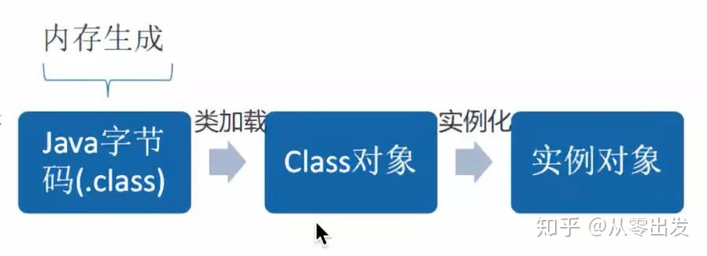

+ **<font style="color:rgb(18, 18, 18);">JDK原生动态代理</font>**
1. <font style="color:rgb(18, 18, 18);">JDK原生动态代理中两个重要的小伙伴</font>
    1. **<font style="color:rgb(18, 18, 18);">Proxy</font>**<font style="color:rgb(18, 18, 18);">：Proxy是</font>**<font style="color:rgb(18, 18, 18);">所有动态代理的父类</font>**<font style="color:rgb(18, 18, 18);">；它提供了一个</font><u><font style="color:rgb(18, 18, 18);">创建</font></u>**<u><font style="color:rgb(18, 18, 18);">代理的Class对象</font></u>**<u><font style="color:rgb(18, 18, 18);">的静态方法</font></u><font style="color:rgb(18, 18, 18);">，用来配置生成</font>**<font style="color:rgb(18, 18, 18);">代理类Class文件的方法与参数</font>**<font style="color:rgb(18, 18, 18);">。这个方法是</font>`<font style="color:rgb(18, 18, 18);">Proxy.newProxyInstance(类加载器，类实现的接口，InvocationHandler实现类)</font>`<font style="color:rgb(18, 18, 18);">，返回值是Object类型，通过接口类型强转换，即可使用代理类；</font>
    2. **<font style="color:rgb(18, 18, 18);">InvacationHandler</font>**<font style="color:rgb(18, 18, 18);">：</font><u><font style="color:rgb(18, 18, 18);">每个动态代理实例都有一个关联的InvocationHandler</font></u><font style="color:rgb(18, 18, 18);">；</font><u><font style="color:rgb(18, 18, 18);">被代理类的代理方法被调用时，方法将被转发到InvocationalHandler的</font></u>**<u><font style="color:rgb(18, 18, 18);">invoke</font></u>**<u><font style="color:rgb(18, 18, 18);">方法执行。</font></u><font style="color:rgb(18, 18, 18);"></font>
    3. <font style="color:rgb(18, 18, 18);">小结：Proxy就是用来生成代理类的，InvocationalHandler使用来对被代理方法进行</font>**<font style="color:rgb(18, 18, 18);">扩展</font>**<font style="color:rgb(18, 18, 18);">的。</font>
2. <font style="color:rgb(18, 18, 18);">原理图下：  
</font>

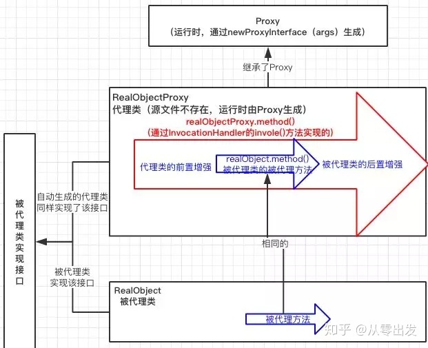

3. <font style="color:rgb(18, 18, 18);">实战演练</font>
    1. <font style="color:rgb(18, 18, 18);">实体类</font>


    2. <font style="color:rgb(18, 18, 18);">被代理类实现接口</font>


    3. <font style="color:rgb(18, 18, 18);">被代理类</font>

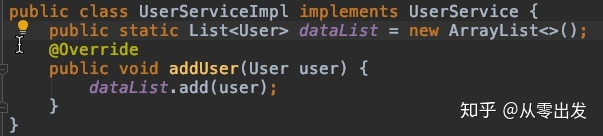

    4. <font style="color:rgb(18, 18, 18);">JDK动态代理实现类</font>


    5. <font style="color:rgb(18, 18, 18);">测试类</font>

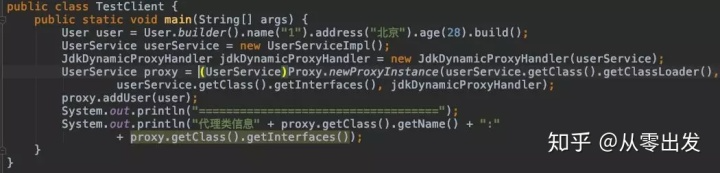

    6. <font style="color:rgb(18, 18, 18);">测试结果</font>

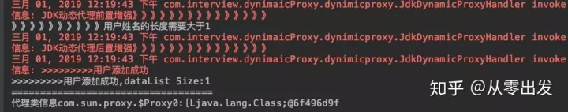

4. <font style="color:rgb(18, 18, 18);">总结：两个个要素</font>
    1. <font style="color:rgb(18, 18, 18);">被代理类必须实现一个接口；</font>
    2. <font style="color:rgb(18, 18, 18);">InvocationalHandler只是用来做业务增强的，并不能真正的实现业务，也就是内部还是需要调用被代理类的业务方法去实现业务，不能对业务内部进行修改。</font>
+ **<font style="color:rgb(18, 18, 18);">CGLB动态代理</font>**

<font style="color:rgb(18, 18, 18);">CGLB全称是Code Generation Library，是一个基于</font>**<font style="color:rgb(18, 18, 18);">ASM</font>**<font style="color:rgb(18, 18, 18);">（</font>ASM Java 字节码操纵框架<font style="color:rgb(18, 18, 18);">）的字节码生成库，允许我们在运行时对字节码文件进行修改和动态生成。</font>

1. <font style="color:rgb(18, 18, 18);">CGLB的两个小伙伴</font>
    1. **<font style="color:rgb(18, 18, 18);">Enchancer</font>**<font style="color:rgb(18, 18, 18);">：来</font><u><font style="color:rgb(18, 18, 18);">指定要代理的目标对象</font></u><font style="color:rgb(18, 18, 18);">；</font>**<font style="color:rgb(18, 18, 18);">实际处理逻辑的对象</font>**<font style="color:rgb(18, 18, 18);">；最终通过</font>**<font style="color:rgb(18, 18, 18);">create()</font>**<font style="color:rgb(18, 18, 18);">方法得到代理对象，对这个对象的</font>**<font style="color:rgb(18, 18, 18);">非final()方法</font>**<font style="color:rgb(18, 18, 18);">的调用都会转发给代理对象；</font>
    2. **<font style="color:rgb(18, 18, 18);">MethodInterceptor</font>**<font style="color:rgb(18, 18, 18);">：动态代理的方法调用都会转发到</font>**<font style="color:rgb(18, 18, 18);">intercept()</font>**<font style="color:rgb(18, 18, 18);">上进行增强；</font>
2. <font style="color:rgb(18, 18, 18);">原理图</font>

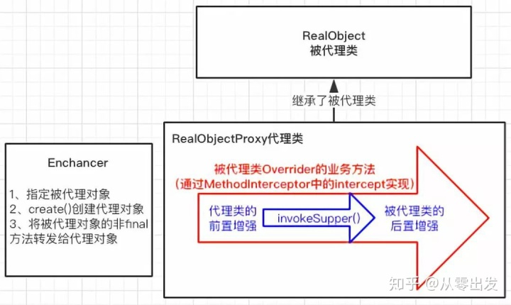

3. <font style="color:rgb(18, 18, 18);">实战演练</font>
    1. <font style="color:rgb(18, 18, 18);">添加依赖</font>


    2. <font style="color:rgb(18, 18, 18);">被代理类</font>


    3. <font style="color:rgb(18, 18, 18);">CGLB动态代理实现类</font>


    4. <font style="color:rgb(18, 18, 18);">测试类  
</font>

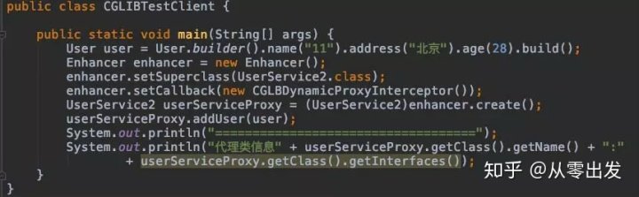

    5. <font style="color:rgb(18, 18, 18);">测试结果</font>


4. <font style="color:rgb(18, 18, 18);">总结：</font>
    1. <font style="color:rgb(18, 18, 18);">CGLB动态代理实现方式降低了被代理对象的要求</font>
    2. <font style="color:rgb(18, 18, 18);">CGLB动态代理对于</font><u><font style="color:rgb(18, 18, 18);">被代理对象的final方法无法进行增强</font></u>
+ **<font style="color:rgb(18, 18, 18);">两种动态代理的优缺点对照表</font>**

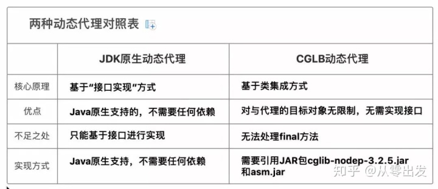

> [动态代理的几种实现方式及优缺点](https://zhuanlan.zhihu.com/p/149775781)
>
> [动态代理的几种实现方式及优缺点_静幽水1的博客-CSDN博客_动态代理的方式](https://blog.csdn.net/jingyoushui/article/details/104299347)
>

### <font style="color:rgb(0,0,0);">静态代理和动态代理的区别，什么场景使用？ </font>
<font style="color:rgb(0,0,0);">代理是一种常用的设计模式，目的是：</font><u><font style="color:rgb(0,0,0);">为其他对象提供一个代理以控制对某个对象的访问，将两个类的关系解耦</font></u><font style="color:rgb(0,0,0);">。</font><u><font style="color:rgb(0,0,0);">代理类和委托类都要实现相同的接口</font></u><font style="color:rgb(0,0,0);">，因为代理真正调用的是</font>**<font style="color:rgb(0,0,0);">委托类的方法</font>**<font style="color:rgb(0,0,0);">。 </font>

+ **<font style="color:rgb(0,0,0);">区别</font>**<font style="color:rgb(0,0,0);">： </font>
1. **<font style="color:rgb(0,0,0);">静态代理</font>**<font style="color:rgb(0,0,0);">：由程序员创建或是由特定工具生成，在代码</font>**<font style="color:rgb(0,0,0);">编译时就确定</font>**<font style="color:rgb(0,0,0);">了被代理的类是哪一个是静态代理。静态代理通常</font>**<font style="color:rgb(0,0,0);">只代理一个类</font>**<font style="color:rgb(0,0,0);">。</font>
2. **<font style="color:rgb(0,0,0);">动态代理</font>**<font style="color:rgb(0,0,0);">：在代码</font>**<font style="color:rgb(0,0,0);">运行期间</font>**<font style="color:rgb(0,0,0);">，运用</font>**<font style="color:rgb(0,0,0);">反射机制</font>**<font style="color:rgb(0,0,0);">动态创建生成。动态代理代理的是一个接口下的</font>**<font style="color:rgb(0,0,0);">多个实现类</font>**<font style="color:rgb(0,0,0);">。</font>

**<font style="color:rgb(0,0,0);">动态代理类实现步骤</font>**<font style="color:rgb(0,0,0);">：</font>

1. <font style="color:rgb(0,0,0);">实现 InvocationHandler 接口创建自己的调用处理器；</font>
2. <font style="color:rgb(0,0,0);">给 Proxy 类提供ClassLoader 和代理接口类型数组创建动态代理类；</font>
3. <font style="color:rgb(0,0,0);">利用反射机制得到动态代理类的构造函数；</font>
4. <font style="color:rgb(0,0,0);">利用动态代理类的构造函数创建动态代理类对象； </font>

**<font style="color:rgb(0,0,0);">使用场景</font>**<font style="color:rgb(0,0,0);">：</font>

1. <font style="color:rgb(0,0,0);">Retrofit 中直接调用接口的方法；</font>
2. <font style="color:rgb(0,0,0);">Spring 的 AOP 机制。</font>

### 为什么CGlib方式可以对未实现接口的类实现代理。
JDK实现动态代理需要**实现类**<u>通过</u>**<u>接口</u>**<u>定义业务方法</u>，对于没有接口的类，如何实现动态代理呢，这就需要CGLib了。

CGLib采用了非常底层的**字节码技术**，其原理是<u>通过字节码技术为一个类创建</u>**<u>子类</u>**，并<u>在</u>**<u>子类</u>**<u>中采用方法拦截的技术拦截</u>**<u>所有父类方法</u>**<u>的调用</u>，顺势织入横切逻辑。

JDK动态代理与CGLib动态代理均是实现Spring AOP的基础。

JDK动态代理的原理是根据定义好的规则，<u>用传入的接口创建一个新类</u>，这就是为什么采用动态代理时只能用接口引用指向代理，而不能用传入的类引用执行动态类。

CGLib是通过创建一个类的子类，用asm库<u>动态修改子类的代码</u>来实现的，所以可以用传入的类引用执行代理类。

CGLib创建的动态代理对象性能比JDK创建的动态代理对象的**性能高**不少，但是，CGLib在创建代理对象时所<u>花费的时间却比JDK</u>**<u>多</u>**得多。所以，对于**单例**的对象，因为无需频繁创建对象，**用CGLib合适**。反之，使用JDK方式要更为合适一些。同时，由于CGLib由于是采用动态创建子类的方法，<u>对于</u>**<u>final方法</u>**<u>，无法进行代理</u>。

> [CGLib方式对接口实现代理 - 仗剑走天涯| - 博客园](https://www.cnblogs.com/chenliangcl/p/7239709.html)
>

### 怎么利用反射获取类中的对象？ 
1. 方式一：如果我们有一个实例变量，可以通过该实例变量提供的getClass()方法获取：

       String s = “Hello”;

       Class cls = s.getClass();

2. 方式二：如果知道一个class的完整类名，可以通过静态方法Class.forName()获取：

       Class cls = Class.forName(“java.lang.String”);

3. 方式三：直接通过一个class的静态变量class获取：

       Class cls = String.class;

> [【反射】反射获取类对象的三种方式_鱼与宇的博客-CSDN博客_反射获取对象的三种方式](https://blog.csdn.net/weixin_45210565/article/details/116283226)
>

### <font style="color:#CF1322;">动态代理的原理 </font>
动态代理基于**反射**实现，调用者通过**代理对象**来访问方法的时候，代理对象可以做相应的处理，然后通过反射调用被代理对象的方法。

### <font style="color:#CF1322;">JDK动态代理与CGlib动态代理区别</font>
+ **JDK动态代理  
**利用反射机制生成一个实现代理接口的匿名类，在调用具体方法前调用InvokeHandler来处理。
+ **CGlib动态代理  
**利用ASM（开源的Java字节码编辑库，操作字节码）开源包，将代理对象类的class文件加载进来，通过修改其字节码生成子类来处理。
+ 区别
    - JDK代理只能对实现接口的类生成代理；
    - CGlib是针对类实现代理，对指定的类生成一个子类，并覆盖其中的方法，这种通过继承类的实现方式，不能代理final修饰的类。

> [动态代理的两种方式以及区别_编码小农的博客-CSDN博客_动态代理两种方式的区别](https://blog.csdn.net/weixin_36759405/article/details/82770422)
>
> [9动态代理是如何实现的？JDK Proxy 和 CGLib 有什么区别？_哔哩哔哩_bilibili](https://www.bilibili.com/video/BV12b4y1B7h2/?zw)
>
> [JDK动态代理原理解析_wen-pan的博客-CSDN博客_jdk动态代理实现原理](https://blog.csdn.net/Hellowenpan/article/details/123482681)
>

### 动态代理与cglib实现的区别
+ JDK动态代理只能对实现了接口的类生成代理，而不能针对类.
+ CGLIB是针对类实现代理，主要是对指定的类生成一个子类，覆盖其中的方法因为是继承，所以该类或方法最好不要声明成 final。
+ JDK代理是不需要以来第三方的库，只要JDK环境就可以进行代理
+ CGLib 必须依赖于CGLib的类库，但是它需要类来实现任何接口代理的是指定的类生成一个子类，覆盖其中的方法，是一种继承。

### 动态代理是如何实现的？


常用实现方式是反射

是一种行为方式，而反射或ASM只是它的一种实现手段而已

+ 反射机制
    - 指程序在运行期间可以访问、检测和修改其本身状态或行为的一种能力
    - 使用反射我们可以调用任意一个类对象以及类对象中包含的属性及方法

> [9动态代理是如何实现的？JDK Proxy 和 CGLib 有什么区别？_哔哩哔哩_bilibili](https://www.bilibili.com/video/BV12b4y1B7h2/?zw&vd_source=1ff9a2c4f611f17f5b87eab05ff01a5e)
>

### JDKProxy和CGLib有什么区别？
+ JDKProxy是Java语言自带的功能，无需通过加载第三方类实现
+ Java对JDKProxy提供了稳定的支持，并且会持续的升级和更新JDKProxy

> 例如Java8版本中的JDKProxy性能相比于之前版本提升了很多
>

+ JDKProxy是通过拦截器加反射的方式实现的
+ JDKProxy只能代理继承接口的类
+ JDKProxy实现和调用起来比较简单
+ CGLib是第三方提供的工具，基于ASM实现的，性能比较高
+ CGLib无需通过接口来实现，它是通过实现子类的方式来完成调用的

### Lombok是通过反射实现的吗？
+ Lombok的实现和反射没有任何关系
+ 反射是程序在运行期的一种自省（introspect）能力
+ Lombok的实现是在编译期就完成了
+ 在JDK6的JSR-269提案通过了一组被称为“**插入式注解处理器**”的标准API，可以提前至**编译期**对代码中的特定注解进行处理， 从而影响到编译器的工作过程。
+ 在Javac 解析成**抽象语法树**(AST)之后，Lombok 根据自己的注解处理器，动态的修改 AST，增加新的节点(所谓代码)，最终通过分析和生成字节码。

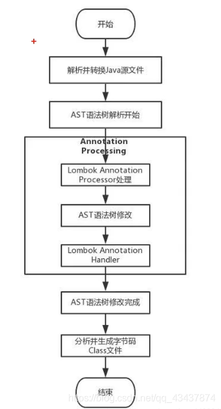

> [Lombok底层实现原理](https://www.jianshu.com/p/900ed1ef9b86)  
[二、Lombok实现原理_云烟成雨TD的博客-CSDN博客](https://blog.csdn.net/qq_43437874/article/details/117292238)
>

### 动态代理的使用场景有哪些？
1. Retrofit 中直接调用接口的方法；
2. Spring 的 AOP 机制。

> Retrofit：<font style="color:rgb(51, 51, 51);">A type-safe HTTP client for Android and the JVM. </font>
>

### Spring中的动态代理是通过什么方式实现的？
+ JDK Proxy
+ CGLib

> [Spring学习(五)：动态代理的两种实现方式（全网最容易懂）_P@ssW0rd的博客-CSDN博客](https://blog.csdn.net/qq_40205337/article/details/111410861)
>

### 32.什么是代理，为什么要用动态代理？
一说到代理，大家可能都会联想到 JDK Proxy、Cglib、AOP等等，这些都算是动态代理。另外，我花了 1 个多星期把往期的面试题解析配套文档准备好了，想获取的小伙伴可以在我的煮叶简介中找到。

为什么我们需要动态代理呢？ 在解答这个问题之前，先跟大家聊清楚什么是静态代理。

#### 1、从静态代理到动态代理
静态代理呢是代理模式的一种实现形态。代理模式的官方原文是这样的:

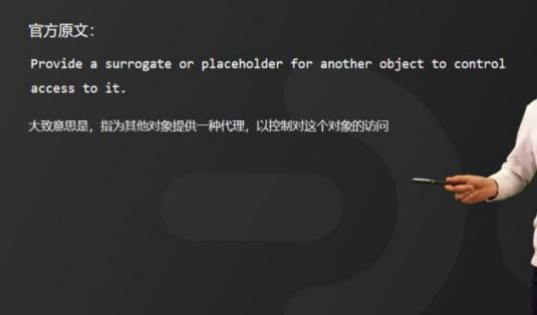

大致意思是，为其他对象提供一种代理项或占位符，以控制对这个对象的访问。什么意思呢？ 代理模式最核心的思想是创建一个代理对象作为在客户端和目标对象之间中介。

主要目的是保护目标对象和增强目标对象。


那什么是静态代理？ 就相当于是这个代理对象需要手动来创建，而且一个代理对象只能服务于一种类型的对象，那么，当有 n 个业务的目标对象时，就需要 n 个静态代理，这样就不利于业务的扩展。

举一个例子，有个程序员张三，平时加班比较多，加上公司的异性同事又少，也不太善于和身边的人沟通，自己又缺少人脉和资源，所以一直没有找对象。这个时候张三的父亲张老三就着急了，利用自己的人脉，经常给张三安排相亲。那张老三就是张三的代理相亲对象。

那么，问题来了。一般情况下，张老三是不会给李四去安排相亲的，因为张老三是不会关心李四有没有对象这个事情的，只有李老四才会关心李四有没有对象。这个时候，就出现一个新的职业 -- 媒婆。媒婆会关心张三、李四、王五、赵六是否有对象，媒婆就成了所有有相亲需求的代理对象，这种一个代理对象就可以服务于所有相关的业务对象，就相当于动态代理对象。

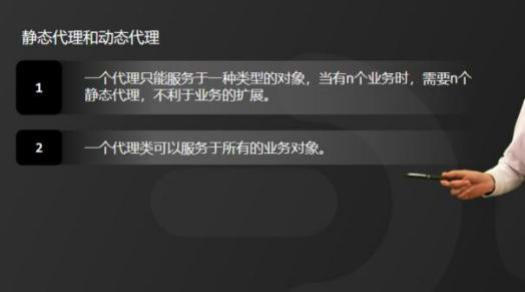

那为什么需要动态代理呢？ 我总结为以下两个原因：

1、可以减少代理对象的个数，降低程序复杂度。

2、易于复杂业务的动态扩展。

#### 2、动态代理实现原理
那在 Java 中动态代理的实现原理是怎样的呢？ 以

JDK Proxy 为例，我归纳为以下 5 个步骤：

第 1 步： 拿到目标对象的引用，并且通过反射获取目标对象的所有接口

第 2 步： 重新生成一个新的代理类，实现目标类所有的接口方法；

第 3 步： 把增强的逻辑代码加入到新生成的代理类源代码中。

第 4 步： 动态编译代理类的源代码并生成.字节码，也就是 class 文件。

第 5 步： 加载并执行新生成的代理对象。


目前，主流动态代理API 有两种，分别是JDK Proxy和 CGLib，CGLib 的实现原理我就不详细赘述了，如果想详细了解的小伙伴可以在评论区回复 666 ，我可以单独再拍一期视频详细介绍。好了，最后，还是给大家介绍一下 CBLib 和 JDK Proxy的区别。

#### 3、JDK Proxy 和 CBLib对比
关于 JDK Proxy 和 CBLib 的区别我归纳为以下 3 点：

第 1 点： JDK Proxy 是实现目标对象的接口，而 GGLib 是继承目标对象

第 2 点： JDK Proxy 和 CGLib 都是在运行期生成字节码。

第 3 点： JJDK Proxy 是通过反射调用目标对象的方法，而CGLib 是采用 FastClass 机制来调用


> 更新: 2022-12-19 23:29:48  
> 原文: <https://www.yuque.com/joyo/interview/ipitqr>