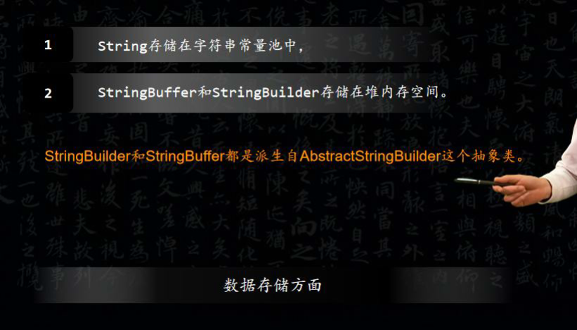

# 字符串/编码

### String 和 StringBuilder、StringBuffer 的区别?
Java 平台提供了两种类型的字符串：String和StringBuffer / StringBuilder，它们可以储存和操作字符串。其中String是只读字符串，也就意味着String引用的字符串内容是不能被改变的。而StringBuffer和StringBuilder类表示的字符串对象可以直接进行修改。StringBuilder是JDK 1.5中引入的，它和StringBuffer的方法完全相同，区别在于它是在单线程环境下使用的，因为它的所有方面都没有被synchronized修饰，因此它的效率也比StringBuffer略高。

补充1：有一个面试题问：有没有哪种情况用+做字符串连接比调用 StringBuffer / StringBuilder 对象的 append 方法性能更好？如果连接后得到的字符串在静态存储区中是早已存在的，那么用+做字符串连接是优于 StringBuffer / StringBuilder的append方法的。

补充2：下面也是一个面试题，问程序的输出，看看自己能不能说出正确答案。

### 是否可以继承String 类?
String 类是final类，不可以被继承。

补充：继承String本身就是一个错误的行为，对String类型最好的重用方式是关联（HAS-A）而不是继承（IS-A）。

### String、StringBuffer、StringBuilder 区别
<font style="color:rgb(51,51,51);">都是字符串类，String 类中使用字符数组保存字符串，因有 final 修饰符，String 对象是不可变的，每次对 String 操作都会生成新的 String 对象，这样效率低，且浪费内存空间。但线程安全。 </font>

<font style="color:rgb(51,51,51);">StringBuilder 和 StringBuffer 也是使用字符数组保存字符，但这两种对象都是可变的，即对字符串进行 append 操作，不会产生新的对象。它们的区别是：StringBuffer 对方法加了同步锁，是线程安全的，StringBuilder 非线程安全。 </font>

### String 为什么要设计成不可变的？ 
<font style="color:rgb(0,0,0);">1）字符串常量池需要 String 不可变。因为 String 设计成不可变，当创建一个 String 对象时，若此字符串值已经存在于常量池中，则不会创建一个新的对象，而是引用已经存在的对象。如果字符串变量允许必变，会导致各种逻辑错误，如改变一个对象会影响到另一个独立对象。 </font>

<font style="color:rgb(0,0,0);">2）String 对象可以缓存 hashCode。字符串的不可变性保证了 hash 码的唯一性，因此可以缓存 String 的 hashCode，这样不用每次去重新计算哈希码。在进行字符串比较时，可以直接比较 hashCode，提高了比较性能。</font>

<font style="color:rgb(0,0,0);">3）安全性。String 被许多 java 类用来当作参数，如 url 地址，文件 path 路径，反射机制所需的 Strign 参数等，若 String 可变，将会引起各种安全隐患。</font>

### 对Java 中 String 的了解 
1. <font style="color:rgb(0,0,0);">String 类是 final 型，固 String 类不能被继承，它的成员方法也都默认为 final 方法。String 对象一旦创建就固定不变了，对 String 对象的任何改变都不影响到原对象，相关的任何改变操作都会生成新的 String 对象。 </font>
2. <font style="color:rgb(0,0,0);">String 类是通过 char 数组来保存字符串的，String 对 equals 方法进行了重定，比较的是值相等。 </font>

```java
String a = "test"; 
String b = "test"; 
String c = new String("test"); 
```

<font style="color:rgb(0,0,0);">a、b 和字面上的 test 都是指向 JVM 字符串常量池中的"test"对象，他们指向同一个对象。而new 关键字一定会产生一个对象 test，该对象存储在堆中。所以 new String("test")产生了两个对象，保存在栈中的 c 和保存在堆中的 test。而在 java 中根本就不存在两个完全一模一样的字符串对象，故在堆中的 test 应该是引用字符串常量池中的 test。 </font>

<font style="color:rgb(0,0,0);">例：</font>

```java
String str1 = "abc"; //栈中开辟一块空间存放引用 str1，str1 指向池中 String 常量"abc" 
String str2 = "def"; //栈中开辟一块空间存放引用 str2，str2 指向池中 String 常量"def" 
String str3 = str1 + str2;//栈中开辟一块空间存放引用 str3 
//str1+str2 通过 StringBuilder 的最后一步 toString()方法返回一个新的 String 对象"abcdef" 
//会在堆中开辟一块空间存放此对象，引用str3指向堆中的(str1+str2)所返回的新String对象。 
System.out.println(str3 == "abcdef");//返回 false 
/*
因为 str3 指向堆中的"abcdef"对象，而"abcdef"是字符池中的对象，所以结果为 false。JVM 
对 String str="abc"对象放在常量池是在编译时做的，而 String str3=str1+str2 是在运行时才知 
道的，new 对象也是在运行时才做的。 
*/
```

### String类是final的，它的所有成员变量也都是final的,为什么是final的？
<font style="color:rgb(51,51,51);">1. </font>**<font style="color:rgb(51,51,51);">线程安全</font>**<font style="color:rgb(51,51,51);">。</font>

<font style="color:rgb(51,51,51);">同一个字符串实例可以被多个线程共享，因为字符串不可变，本身就是线程安全的。</font>

<font style="color:rgb(51,51,51);">2. </font>**<font style="color:rgb(51,51,51);">支持hash映射和缓存。</font>**

<font style="color:rgb(51,51,51);">因为String的hash值经常会使用到，比如作为 Map 的键，不可变的特性使得 hash 值也不会变，不需要重新计算。</font>

<font style="color:rgb(51,51,51);">3. </font>**<font style="color:rgb(51,51,51);">字符串常量池优化</font>**<font style="color:rgb(51,51,51);">。</font>

<font style="color:rgb(51,51,51);">String对象创建之后，会缓存到字符串常量池中，下次需要创建同样的对象时，可以直接返回缓存的引用。</font>

### String, StringBuffer 和 StringBuilder区别	
1. **<font style="color:rgb(51,51,51);">可变性</font>**
    - <font style="color:rgb(51,51,51);">String 不可变</font>
    - <font style="color:rgb(51,51,51);">StringBuffer 和StringBuilder 可变</font>
2. **<font style="color:rgb(51,51,51);">线程安全</font>**
    - <font style="color:rgb(51,51,51);">String 不可变，因此是线程安全的</font>
    - <font style="color:rgb(51,51,51);">StringBuilder 不是线程安全的</font>
    - <font style="color:rgb(51,51,51);">StringBuffer 是线程安全的，内部使用synchronized 进行同步</font>

### String 类的常用方法有哪些？	
1. <font style="color:rgb(51,51,51);">indexOf()：返回指定字符的索引。</font>
2. <font style="color:rgb(51,51,51);">charAt()：返回指定索引处的字符。</font>
3. <font style="color:rgb(51,51,51);">replace()：字符串替换。</font>
4. <font style="color:rgb(51,51,51);">trim()：去除字符串两端空白。</font>
5. <font style="color:rgb(51,51,51);">split()：分割字符串，返回一个分割后的字符串数组。</font>
6. <font style="color:rgb(51,51,51);">getBytes()：返回字符串的byte 类型数组。</font>
7. <font style="color:rgb(51,51,51);">length()：返回字符串长度。</font>
8. <font style="color:rgb(51,51,51);">toLowerCase()：将字符串转成小写字母。</font>
9. <font style="color:rgb(51,51,51);">toUpperCase()：将字符串转成大写字符。</font>
10. <font style="color:rgb(51,51,51);">substring()：截取字符串。</font>
11. <font style="color:rgb(51,51,51);">equals()：字符串比较。</font>

### new String("dabin")会创建几个对象？	
<font style="color:rgb(51,51,51);">使用这种方式会创建两个字符串对象（前提是字符串常量池中没有 "dabin" 这个字符串对象）。</font>

<font style="color:rgb(51,51,51);">"dabin"  属于字符串字面量，因此编译时期会在字符串常量池中创建一个字符串对象，指向这个</font>

<font style="color:rgb(51,51,51);">"dabin" 字符串字面量；</font>

<font style="color:rgb(51,51,51);">使用 new 的方式会在堆中创建一个字符串对象。</font>

### String 为什么不可变？	
<font style="color:rgb(51,51,51);">先看下Java8 String类的源码：</font>

```java
public final class String
	implements java.io.Serializable, Comparable<String>, CharSequence {
    /** The value is used for character storage. */ 
    private final char value[];

    /** Cache the hash code for the string */ 
    private int hash; // Default to 0
}
```

### String类能被继承吗？为什么？
不能，final修饰的类

### String、StringBuffer和StringBuilder 区别（⼩⽶、乐视、百度） 
<font style="color:rgb(153,153,153);">String：适⽤于少量的字符串操作的情况 </font>

<font style="color:rgb(153,153,153);">StringBuilder：适⽤于单线程下在字符缓冲区进⾏⼤量操作的情况（⾮线程安全） </font>

<font style="color:rgb(153,153,153);">StringBuffer：适⽤多线程下在字符缓冲区进⾏⼤量操作的情况（线程安全） </font>

<font style="color:rgb(153,153,153);">在⼤部分情况下 StringBuilder > StringBuffer </font>

> [Java中的String，StringBuilder，StringBuffer三者的区别 - 酥风 - 博客园](https://www.cnblogs.com/su-feng/p/6659064.html) 
>

### String有重写Object的hashcode和toString吗？如果重写equals不重写hashcode会出现什么问题？
+ String有重写Object的hashcode和toString吗？

String重写了Object类的hashcode和toString方法。

+ 当equals方法被重写时，通常有必要重写hashCode方法，以维护hashCode方法的常规协定，该协定声明相对等的两个对象必须有相同的hashCode
    - object1.euqal(object2)时为true，object1.hashCode() == object2.hashCode() 为true
    - object1.hashCode() ==  object2.hashCode() 为false时，object1.euqal(object2)必定为false
    - object1.hashCode() ==  object2.hashCode() 为true时，但object1.euqal(object2)不一定为true
+ 重写equals不重写hashcode会出现什么问题

在存储散列集合时(如Set类)，如果`原对象.equals(新对象)`，但没有对hashCode重写，即两个对象拥有不同的 hashCode，则在集合中将会存储两个值相同的对象，从而导致混淆。因此在重写equals方法时，必须重写hashCode方法。

### String、StringBuffer、StringBuilder以及对String不变性的理解
+ **String、StringBuffer、StringBuilder**
    - 都是 final 类, 都不允许被继承;
    - String 长度是不可变的, StringBuffer、StringBuilder 长度是可变的;
    - StringBuffer 是线程安全的, StringBuilder 不是线程安全的，但它们两个中的所有方法都是相同的，StringBuffer在 StringBuilder的方法之上添加了synchronized修饰，保证线程安全。
    - StringBuilder比StringBuffer拥有更好的性能。
    - 如果一个String类型的字符串，在编译时就可以确定是一个字符串常量，则编译完成之后，字符串会自动拼接成一个常量。此时String的速度比StringBuffer和StringBuilder的性能好的多。
+ **String不变性的理解**
    - String  类是被final进行修饰的，不能被继承。
    - 在用+号链接字符串的时候会创建新的字符串。
    - String s = new String("Hello world"); 可能创建两个对象也可能创建一个对象。如果静态区中有“Hello world”字符串常量对象的话，则仅仅在堆中创建一个对象。如果静态区中没有“Hello world”对象，则堆上和静态区中都需要创建对象。
    - 在java 中, 通过使用 "+" 符号来串联字符串的时候，实际上底层会转成通过 StringBuilder 实例的 append() 方法来实现。

### String StringBuffer 和StringBuilder 的区别是什么？String 为什么是不可变的？
+ ** ****<font style="color:rgb(36,41,46);">可变性</font>**

<font style="color:rgb(36,41,46);">简单的来说：String 类中使用final 关键字和字符数组保存字符串，private final char value[]，所以String 对象是不可变的。而StringBuilder 与StringBuffer 都继承自AbstractStringBuilder 类，在AbstractStringBuilder 中也是使用字符数组保存字符串char[]value 但是没有用final 关键字修饰，所以这两种对象都是可变的。</font>

<font style="color:rgb(36,41,46);">StringBuilder 与StringBuffer 的构造方法都是调用父类构造方法也就是AbstractStringBuilder 实现的，大家可以自行查阅源码。</font>

<font style="color:rgb(36,41,46);">AbstractStringBuilder.java</font>

```java
abstract class AbstractStringBuilder implements Appendable, CharSequence { 
    char[] value;
    int count; AbstractStringBuilder() {
    }
    AbstractStringBuilder(int capacity) { 
        value = new char[capacity];
    }
```

+ **<font style="color:rgb(36,41,46);">线程安全性</font>**

<font style="color:rgb(36,41,46);">String 中的对象是不可变的，也就可以理解为常量，线程安全。AbstractStringBuilder 是StringBuilder 与StringBuffer 的公共父类，定义了一些字符串的基本操作，如expandCapacity、append、insert、indexOf 等公共方法。StringBuffer 对方法加了同步锁或者对调用的方法加了同步锁，所以是线程安全的。StringBuilder 并没有对方法进行加同步锁，所以是非线程安全的。</font>

+ **<font style="color:rgb(36,41,46);">性能</font>**

<font style="color:rgb(36,41,46);">每次对String 类型进行改变的时候，都会生成一个新的String 对象，然后将指针指向新的String 对象。StringBuffer 每次都会对StringBuffer 对象本身进行操作，而不是生成新的对象并改变对象引用。相同情况下使用StringBuilder 相比使用StringBuffer 仅能获得10%~15% 左右的性能提升，但却要冒多线程不安全的风险。</font>

**<font style="color:rgb(36,41,46);">对于三者使用的总结：</font>**

<font style="color:rgb(36,41,46);">1. 操作少量的数据：String</font>

<font style="color:rgb(36,41,46);">2. 单线程操作字符串缓冲区下操作大量数据：StringBuilder</font>

<font style="color:rgb(36,41,46);">3. 多线程操作字符串缓冲区下操作大量数据：StringBuffer</font>

### StringBuffer的实现方式，容量如何扩充 
StringBuffer是通过char[]来实现的。

默认长度是16，在进行串的append的时，StringBuffer会检测剩余容量，适时会重新扩充，而扩容的同时，会创建一个新的数组,并将原来的数组内容复制到新的数组里面。

### String、StringBuffer和StringBuilder的区别
**String 字符串常量  
****StringBuffer 字符串变量（线程安全）  
****StringBuilder 字符串变量（非线程安全）**  
简要的说， String 类型和 StringBuffer 类型的主要性能区别其实在于 String 是不可变的对象, 因此在每次对 String 类型进行改变的时候其实都等同于生成了一个新的 String 对象，然后将指针指向新的 String 对象，所以经常改变内容的字符串最好不要用 String ，因为每次生成对象都会对系统性能产生影响，特别当内存中无引用对象多了以后， JVM 的 GC 就会开始工作，那速度是一定会相当慢的。  
 而如果是使用 StringBuffer 类则结果就不一样了，每次结果都会对 StringBuffer 对象本身进行操作，而不是生成新的对象，再改变对象引用。所以在一般情况下我们推荐使用 StringBuffer ，特别是字符串对象经常改变的情况下。而在某些特别情况下， String 对象的字符串拼接其实是被 JVM 解释成了 StringBuffer 对象的拼接，所以这些时候 String 对象的速度并不会比 StringBuffer 对象慢，而特别是以下的字符串对象生成中， String 效率是远要比 StringBuffer 快的：  
 String S1 = “This is only a” + “ simple” + “ test”;  
 StringBuffer Sb = new StringBuilder(“This is only a”).append(“ simple”).append(“ test”);  
 你会很惊讶的发现，生成 String S1 对象的速度简直太快了，而这个时候 StringBuffer 居然速度上根本一点都不占优势。其实这是 JVM 的一个把戏，在 JVM 眼里，这个  
 String S1 = “This is only a” + “ simple” + “test”; 其实就是：  
 String S1 = “This is only a simple test”; 所以当然不需要太多的时间了。但大家这里要注意的是，如果你的字符串是来自另外的 String 对象的话，速度就没那么快了，譬如：  
String S2 = “This is only a”;  
String S3 = “ simple”;  
String S4 = “ test”;  
String S1 = S2 +S3 + S4;  
这时候 JVM 会规规矩矩的按照原来的方式去做  
<font style="color:rgb(255,0,0);">在大部分情况下 StringBuffer > String</font>  
**StringBuffer**  
Java.lang.StringBuffer线程安全的可变字符序列。一个类似于 String 的字符串缓冲区，但不能修改。虽然在任意时间点上它都包含某种特定的字符序列，但通过某些方法调用可以改变该序列的长度和内容。  
可将字符串缓冲区安全地用于多个线程。可以在必要时对这些方法进行同步，因此任意特定实例上的所有操作就好像是以串行顺序发生的，该顺序与所涉及的每个线程进行的方法调用顺序一致。  
StringBuffer 上的主要操作是 append 和 insert 方法，可重载这些方法，以接受任意类型的数据。每个方法都能有效地将给定的数据转换成字符串，然后将该字符串的字符追加或插入到字符串缓冲区中。append 方法始终将这些字符添加到缓冲区的末端；而 insert 方法则在指定的点添加字符。  
例如，如果 z 引用一个当前内容是“start”的字符串缓冲区对象，则此方法调用 z.append("le") 会使字符串缓冲区包含“startle”，而 z.insert(4, "le") 将更改字符串缓冲区，使之包含“starlet”。  
<font style="color:rgb(255,0,0);">在大部分情况下 StringBuilder > StringBuffer</font>

**java.lang.StringBuilde**  
java.lang.StringBuilder一个可变的字符序列是5.0新增的。此类提供一个与 StringBuffer 兼容的 API，但不保证同步。该类被设计用作 StringBuffer 的一个简易替换，用在字符串缓冲区被单个线程使用的时候（这种情况很普遍）。如果可能，建议优先采用该类，因为在大多数实现中，它比 StringBuffer 要快。两者的方法基本相同。

### String 和StringBuffer的区别
简单地说，就是一个变量和常量的关系。StringBuffer对象的内容可以修改；而String对象一旦产生后就不可以被修改，重新赋值其实是两个对象。  
StringBuffer的内部实现方式和String不同，StringBuffer在进行字符串处理时，不生成新的对象，在内存使用上要优于String类。所以在实际使用时，如果经常需要对一个字符串进行修改，例如插入、删除等操作，使用StringBuffer要更加适合一些。  
String:在String类中没有用来改变已有字符串中的某个字符的方法，由于不能改变一个[Java](http://lib.csdn.net/base/java)字符串中的某个单独字符，所以在JDK文档中称String类的对象是不可改变的。然而，不可改变的字符串具有一个很大的优点:编译器可以把字符串设为共享的。   
StringBuffer:StringBuffer类属于一种辅助类，可预先分配指定长度的内存块建立一个字符串缓冲区。这样使用StringBuffer类的append方法追加字符 比 String使用 + 操作符添加字符 到 一个已经存在的字符串后面有效率得多。因为使用 + 操作符每一次将字符添加到一个字符串中去时，字符串对象都需要寻找一个新的内存空间来容纳更大的字符串，这无凝是一个非常消耗时间的操作。添加多个字符也就意味着要一次又一次的对字符串重新分配内存。使用StringBuffer类就避免了这个问题。  
StringBuffer是线程安全的，在多线程程序中也可以很方便的进行使用，但是程序的执行效率相对来说就要稍微慢一些。  
StringBuffer的常用方法  
StringBuffer类中的方法要偏重于对字符串的变化例如追加、插入和删除等，这个也是StringBuffer和String类的主要区别。

### String 是否可以继承， “+” 怎样实现? 
+ `String` 是 `final` 类，不可继承。
+ `+` 是通过 `StringBuilder`（或 `StringBuffer`） 类，和 `append` 方法实现

### String为啥不可变，在内存中的具体形态？ 
+ String是final修饰的类；
+ `String` 使用 `final char value[]` 来存放字符序列。  
而在java9之后，String底层采用byte数组和编码标识来识别。

> [Java9 String底层数组的变化_清风不灭的博客-CSDN博客](https://blog.csdn.net/weixin_40391011/article/details/104073793)
>

### String、StringBuffer和StringBuilder区别
+ 线程是否安全
    - StringBuffer：线程安全
    - StringBuilder：非线程安全
    - String字符串常量：线程安全
+ 对象是否可变
    - StringBuffer：可变
    - StringBuilder：可变
    - String字符串常量：不可变，每次操作都会创建新的对象，原来的对象会被GC回收
+ 应用场景
    - StringBuffer：多线程，有大量字符串拼接
    - StringBuilder：单线程，有大量字符串拼接
    - String字符串常量 多线程，有少量或无字符串拼

### String、StringBuffer与StringBuilder的区别
String 是final修饰的，字符串常量，**<font style="color:rgb(255,0,0);">String对象一旦创建之后该对象是不可更改的</font>**

StringBuffer 字符串变量，**<font style="color:rgb(255,0,0);">对象可变</font>**，线程安全，适合多线程下字符缓冲区大量操作

StringBuider 字符串变量，**<font style="color:rgb(255,0,0);">对象可变</font>**，线程不安全，适用单线程下载字符缓冲区进行大量操作的情况，都是继承<font style="color:rgb(0,0,0);">AbstractStringBuilder </font>super.容量为16

### <font style="color:rgb(51,51,51);">常见编码⽅式</font>
+ <font style="color:rgb(77, 77, 77);">ASCII码</font>
+ <font style="color:rgb(77, 77, 77);">ISO-8859-1</font>
+ GBK
+ UTF-16
+ UTF-8

> [Java中常用编码格式及I/O操作中的编码_axinawang的博客-CSDN博客_java 编码格式](https://blog.csdn.net/daqi1983/article/details/124510986)
>

### utf-8 编码中的中⽂占⼏个字节？数字⼏个字节 ?
⼀个utf8数字占1个字节，⼀个utf8英⽂字母占1个字节，少数是汉字每个占⽤3个字节，多数占⽤4个字节。

### utf-8 编码中的中文占几个字节？
<font style="color:rgb(0,0,0);">utf-8 是一种变长编码技术，utf-8 编码中的中文占用的字节不确定，可能 2 个、3 个、4 个。</font>

### 怎样将GB2312编码的字符串转换为ISO-8859-1编码的字符串？
代码如下所示:

String s1 = "你好";

String s2 = newString(s1.getBytes("GB2312"), "ISO-8859-1");

### 如何实现字符串的反转及替换？
方法很多，可以自己写实现也可以使用String或StringBuffer / StringBuilder中的方法。有一道很常见的面试题是用递归实现字符串反转，代码如下所示：


### `String s=new String(“xyz”);`创建了几个字符串对象？
两个对象，一个是静态存储区的"xyz",一个是用new创建在堆上的对象。

### 字符串操作。
+ <font style="color:rgb(34,34,34);background-color:rgb(255,255,255);">(1)字符串的连接</font>

<font style="background-color:rgb(255,255,255);">public String concat(String str) </font>

<font style="background-color:rgb(255,255,255);">该方法的参数为一个String类对象,作用是将参数中的字符串str连接到原来字符串的后面. </font>

+ <font style="color:rgb(34,34,34);background-color:rgb(255,255,255);">(2)求字符串的长度</font>

<font style="background-color:rgb(255,255,255);">public int length()</font>

<font style="background-color:rgb(255,255,255);">返回字串的长度,这里的长度指的是字符串中Unicode字符的数目.</font>

+ <font style="color:rgb(34,34,34);background-color:rgb(255,255,255);">(3)求字符串中某一位置的字符</font>

<font style="background-color:rgb(255,255,255);">public char charAt(int index)</font>

<font style="background-color:rgb(255,255,255);">该方法在一个特定的位置索引一个字符串,以得到字符串中指定位置的字符.值得注意的是,在字符串中第一个字符的索引是0,第二个字符的索引是1,依次类推,最后一个字符的索引是length()-1. </font>

+ <font style="color:rgb(34,34,34);background-color:rgb(255,255,255);">(4)字符串的比较</font>

<font style="background-color:rgb(255,255,255);">比较字符串可以利用String类提供的下列方法:</font>

<font style="background-color:rgb(255,255,255);">1)public int compareTo(String anotherString)</font>

<font style="background-color:rgb(255,255,255);">该方法比较两个字符串,和Character类提供的compareTo方法相似,Character类提供的compareTo方法比较的是两个字符类数据,而这里比较的是字符串数据.</font>

<font style="background-color:rgb(255,255,255);">其比较过程实际上是两个字符串中相同位置上的字符按Unicode中排列顺序逐个比较的结果.如果在整个比较过程中,没有发现任何不同的地方,则表明两个字符串是完全相等的,compareTo方法返回0;如果在比较过程中,发现了不同的地方,则比较过程会停下来,这时一定是两个字符串在某个位置上不相同,如果当前字符串在这个位置上的字符大于参数中的这个位置上的字符,compareTo方法返回一个大于0的整数,否则返回一个小于0的整数. </font>

<font style="background-color:rgb(255,255,255);">2)public boolean equals(Object anObject)</font>

<font style="background-color:rgb(255,255,255);">该方法比较两个字符串,和Character类提供的equals方法相似,因为它们都是重载Object类的方法.该方法比较当前字符串和参数字符串,在两个字符串相等的时候返回true,否则返回false.</font>

<font style="background-color:rgb(255,255,255);">3)public boolean equalsIgnoreCase(String anotherString)</font>

<font style="background-color:rgb(255,255,255);">该方法和equals方法相似,不同的地方在于,equalsIgnoreCase方法将忽略字母大小写的区别.</font>

+ <font style="color:rgb(34,34,34);background-color:rgb(255,255,255);">(5)从字符串中提取子串</font>

<font style="background-color:rgb(255,255,255);">利用String类提供的substring方法可以从一个大的字符串中提取一个子串,该方法有两种常用的形式:</font>

<font style="background-color:rgb(255,255,255);">1)public String substring(int beginIndex)</font>

<font style="background-color:rgb(255,255,255);">该方法从beginIndex位置起,从当前字符串中取出剩余的字符作为一个新的字符串返回.</font>

<font style="background-color:rgb(255,255,255);">2)public String substring(int beginIndex, int endIndex)</font>

<font style="background-color:rgb(255,255,255);">该方法从当前字符串中取出一个子串,该子串从beginIndex位置起至endIndex-1为结束.子串返的长度为endIndex-beginIndex. </font>

+ <font style="color:rgb(34,34,34);background-color:rgb(255,255,255);">(6)判断字符串的前缀和后缀</font>

<font style="background-color:rgb(255,255,255);">判断字符串的前缀是否为指定的字符串利用String类提供的下列方法:</font>

<font style="background-color:rgb(255,255,255);">1)public boolean startsWith(String prefix)</font>

<font style="background-color:rgb(255,255,255);">该方法用于判断当前字符串的前缀是否和参数中指定的字符串prefix一致,如果是,返回true,否则返回false.</font>

<font style="background-color:rgb(255,255,255);">2)public boolean startsWith(String prefix, int toffset)</font>

<font style="background-color:rgb(255,255,255);">该方法用于判断当前字符串从toffset位置开始的子串的前缀是否和参数中指定的字符串prefix一致,如果是,返回true,否则返回false.</font>

<font style="background-color:rgb(255,255,255);">判断字符串的后缀是否为指定的字符串利用String类提供的方法:</font>

<font style="background-color:rgb(255,255,255);">public boolean endsWith(String suffix)</font>

<font style="background-color:rgb(255,255,255);">该方法用于判断当前字符串的后缀是否和参数中指定的字符串suffix一致,如果是,返回true,否则返回false.</font>

+ <font style="color:rgb(34,34,34);background-color:rgb(255,255,255);">(7)字符串中单个字符的查找</font>

<font style="background-color:rgb(255,255,255);">字符串中单个字符的查找可以利用String类提供的下列方法:</font>

<font style="background-color:rgb(255,255,255);">1)public int indexOf(int ch)</font>

<font style="background-color:rgb(255,255,255);">该方法用于查找当前字符串中某一个特定字符ch出现的位置.该方法从头向后查找,如果在字符串中找到字符ch,则返回字符ch在字符串中第一次出现的位置;如果在整个字符串中没有找到字符ch,则返回-1. </font>

<font style="background-color:rgb(255,255,255);">2)public int indexOf(int ch, int fromIndex)</font>

<font style="background-color:rgb(255,255,255);">该方法和第一种方法类似,不同的地方在于,该方法从fromIndex位置向后查找,返回的仍然是字符ch在字符串第一次出现的位置. </font>

<font style="background-color:rgb(255,255,255);">3)public int lastIndexOf(int ch)</font>

<font style="background-color:rgb(255,255,255);">该方法和第一种方法类似,不同的地方在于,该方法从字符串的末尾位置向前查找,返回的仍然是字符ch在字符串第一次出现的位置.</font>

<font style="background-color:rgb(255,255,255);">4)public int lastIndexOf(int ch, int fromIndex)</font>

<font style="background-color:rgb(255,255,255);">该方法和第二种方法类似,不同的地方在于,该方法从fromIndex位置向前查找,返回的仍然是字符ch在字符串第一次出现的位置.</font>

+ <font style="color:rgb(34,34,34);background-color:rgb(255,255,255);">(8)字符串中子串的查找</font>

<font style="background-color:rgb(255,255,255);">字符串中子串的查找与字符串中单个字符的查找十分相似,可以利用String类提供的下列方法:</font>

<font style="background-color:rgb(255,255,255);">1)public int indexOf(String str)</font>

<font style="background-color:rgb(255,255,255);">2)public int indexOf(String str, int fromIndex)</font>

<font style="background-color:rgb(255,255,255);">3)public int lastIndexOf(String str)</font>

<font style="background-color:rgb(255,255,255);">4)public int lastIndexOf(String str, int fromIndex) </font>

+ <font style="color:rgb(34,34,34);background-color:rgb(255,255,255);">(9)字符串中字符大小写的转换</font>

<font style="background-color:rgb(255,255,255);">字符串中字符大小写的转换,可以利用String类提供的下列方法:</font>

<font style="background-color:rgb(255,255,255);">1)public String toLowerCase()</font>

<font style="background-color:rgb(255,255,255);">该方法将字符串中所有字符转换成小写,并返回转换后的新串.</font>

<font style="background-color:rgb(255,255,255);">2)public String toUpperCase()</font>

<font style="background-color:rgb(255,255,255);">该方法将字符串中所有字符转换成大写,并返回转换后的新串. </font>

+ <font style="color:rgb(34,34,34);background-color:rgb(255,255,255);">(10)字符串中多余空格的去除</font>

<font style="background-color:rgb(255,255,255);">public String trim()</font>

<font style="background-color:rgb(255,255,255);">该方法只是去掉开头和结尾的空格,并返回得到的新字符串.值得注意的是,在原来字符串中间的空格并不去掉. </font>

+ <font style="color:rgb(34,34,34);background-color:rgb(255,255,255);">(11)字符串中字符的替换</font>

<font style="background-color:rgb(255,255,255);">1)public String replace(char oldChar,char newChar)</font>

<font style="background-color:rgb(255,255,255);">该方法用字符newChar替换当前字符串中所有的字符oldChar,并返回一个新的字符串.</font>

<font style="background-color:rgb(255,255,255);">2)public String replaceFirst(String regex, String replacement)</font>

<font style="background-color:rgb(255,255,255);">该方法用字符串replacement的内容替换当前字符串中遇到的第一个和字符串regex相一致的子串,并将产生的新字符串返回. </font>

<font style="background-color:rgb(255,255,255);">3)public String replaceAll(String regex, String replacement)</font>

<font style="background-color:rgb(255,255,255);">该方法用字符串replacement的内容替换当前字符串中遇到的所有和字符串regex相一致的子串,并将产生的新字符串返回. </font>

### 创建StringBuffer类对象
<font style="background-color:rgb(255,255,255);">StringBuffer类对象表示的是字符串变量,每一个StringBuffer类对象都是可以扩充和修改的字符串变量.以下是常用的StringBuffer类构造函数:</font>

<font style="background-color:rgb(255,255,255);">(1)public StringBuffer()</font>

<font style="background-color:rgb(255,255,255);">(2)public StringBuffer(int length) </font>

<font style="background-color:rgb(255,255,255);">(3)public StringBuffer(String str)  </font>

<font style="background-color:rgb(255,255,255);"></font>

### 101.String、StringBuffer和StringBuilder的区别
可能是因为毕业季，最近有非常多的应届生来咨询我面试相关的问题。这不，今天有一位应届生找到我，说面试被问到这样一道面试题：请谈谈String、StringBuffer和StringBuilder 的区别。其实呢，这是一道老生常谈的题，光背八股文还是非常简单的。

既然，大家有这方面的需求，今天我还是给大家分享一下我的理解。

关于String、StringBuffer、StringBuilder的区别，我从以下四个方面来理解：

#### 1、值可变性方面


String内部的value值是final修饰的，所以它是不可变类。因此，每次修改String的值，都会产生一个新的对象。

而StringBuffer和StringBuilder是可变类，它们在字符串变更的时候，不会产生新的对象。

#### 2、线程安全方面


String是不可变类，所以它是线程安全的。

StringBuffer是线程安全的，因为它每个操作方法都加了synchronized同步关键字。

而StringBuilder不是线程安全的。如果在多线程环境下对字符串进行操作，建议使用StringBuffer，单线程情况下，才建议使用StringBuilder。

#### 3、性能方面


String的性能是最低的，因为它不可变，意味着在做字符串拼接和修改的时候，需要反复地重新创建新的对象和分配内存。

其次是StringBuffer，它要比String性能高，因为它的可变性使得字符串可以直接被修改。

性能最高的是StringBuilder，因为 StringBuffer加了同步锁，而StringBuilder是无阻塞的。

#### 4、数据存储方面


String存储在字符串常量池中，而StringBuffer和StringBuilder存储在堆内存空间。

最后再补充一下， StringBuilder 和StringBuffer都是派生自AbstractStringBuilder这个抽象类。

以上就是我对String、StringBuffer和StringBuilder的理解。


> 更新: 2022-12-16 00:35:38  
> 原文: <https://www.yuque.com/joyo/interview/ut2q72>