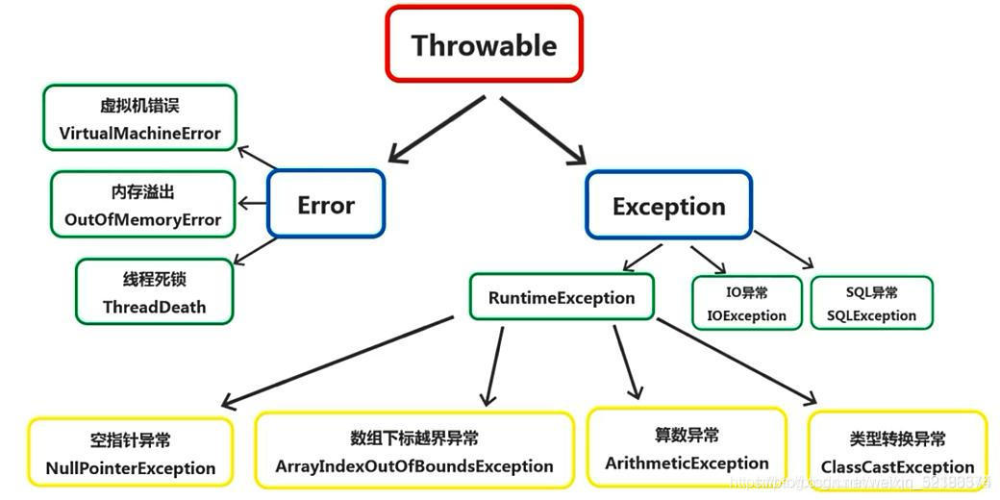
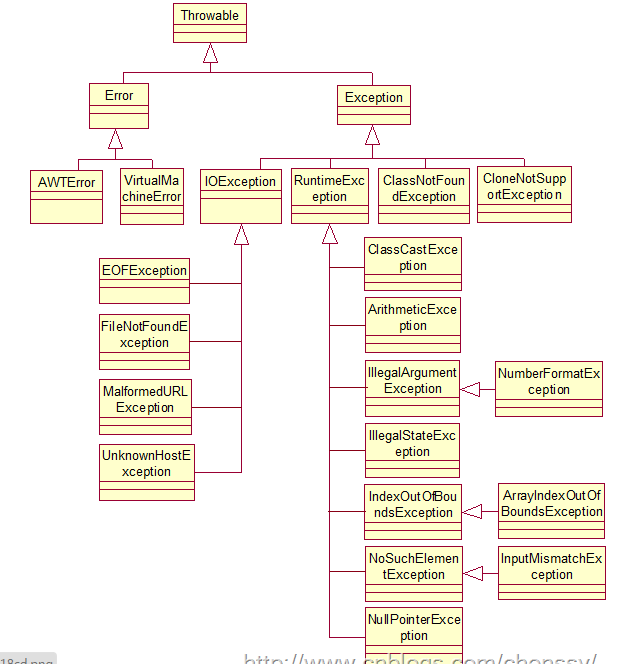
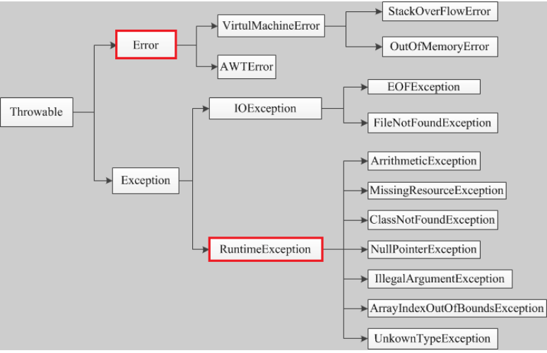
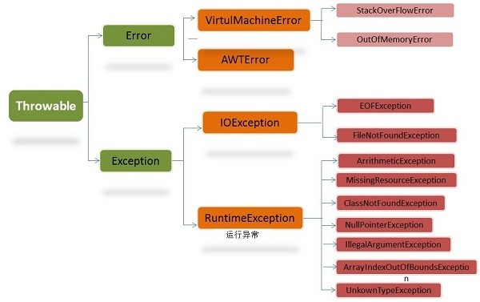

# 异常/断言

### 参考
> [https://zhuanlan.zhihu.com/p/358304606](https://zhuanlan.zhihu.com/p/358304606)
>

### try{}catch{}finally{}，try里有return，finally还执行么
如果finally没有return 相同返回值变量，则返回try里面的return，否则finally 的return 值会影响 try里面return结果。

finally还是会执行的，除非中途遇到jvm退出。

### Excption与Error包结构
+ Excption和Error都是Throwable的子类；
+ Exception指出了合理的应用程序想要捕获的条件；
+ Error 它用于指示合理的应用程序不应该试图捕获的严重问题，大多数这样的错误都是异常条件。

### OOM你遇到过哪些情况
+ Java Heap 溢出
+ 虚拟机栈和本地方法栈溢出
+ 运行时常量池溢出
+ 方法区溢出

### SOF你遇到过哪些情况
StackOverflowError 的定义：当应用程序递归太深而发生堆栈溢出时，抛出该错误。

### Java 中异常怎么处理，什么时候抛出，什么时候捕获 
+ 一般原则是**提早抛出，延迟捕获**
+ 出现异常时，若当前无法处理则抛出，否则捕获异常，尝试恢复。

### Java 中异常机制
+ Java 中所有异常都是 `Throwable` 的子类，他的直接子类有两个，一个是 `Error`, 一个是 `Exception`。 
    - `Error` 一般表示 JVM 出现了严重问题，比如说**栈溢出**或 **OOM**,
    - `Exception` 中异常分为两类， 
        * 一类是 `RuntimeException` 表示运行期间出现的错误，比较常见的是**空指针异常**和**数组下标越界**，出现这种异常一般是程序出现了逻辑错误，也就是代码有 Bug。
        * 另一类是编译时异常（除了 `RuntimeException` 以外的异常），常见的一般有 `IOException`等， 出现这种错误程序编译会不通过。
+ 还有一种分类方式是 `checked exception` 和 `uncheck exception`。`unchecked exception` 包括 `Error` 和 `RuntimeExcetion`，`checked exception` 指之前所说的编译时异常。

### 遇到过哪些异常？
+ 算数异常类：ArithmeticExecption
+ 空指针异常类型：NullPointerException
+ 类型强制转换类型：ClassCastException
+ 数组负下标异常：NegativeArrayException
+ 数组下标越界异常：ArrayIndexOutOfBoundsException
+ 违背安全原则异常：SecturityException
+ 已结束异常：EOFException
+ 未找到异常：FileNotFoundException
+ 字符串转换为数字异常：NumberFormatException
+ 操作数据库异常：SQLException
+ 输入输出异常：IOException
+ 方法未找到异常：NoSuchMethodException
+ 下标越界异常：IndexOutOfBoundsExecption
+ 系统异常：SystemException
+ 创建一个大小为负数的数组错误异常：NegativeArraySizeException
+ 数据格式异常：NumberFormatException
+ 安全异常：SecurityException
+ 不支持的操作异常：UnsupportedOperationException

> [常见的几种异常类型Exception_Aura__的博客-CSDN博客](https://blog.csdn.net/niceworkgogogo/article/details/71746208)
>

### Exception和Error有什么区别？

Error 和 Exception 都是**Throwable的子类**，在java中只有Throwable类型的实例才可以被**抛出**或者**捕获**，它是异常处理机制的**基本类型**。

1. Exception 和 Error体现了java平台设计者对不同异常情况的分类，Exception是程序正常运行中，**可以预料**的意外情况，**可以被捕获**进行相应的处理.
2. Error 是指正常情况下，**不大可能出现**的情况，绝大部分的 Error 都会导致程序处于**非正常**的，**不可恢复**的状态，不需要捕获，常见的 OutOfMemoryError 是Error的子类。
3. Exception 分为**可检查异常(checked)** 和** 不可检查异常(unchecked)。**可检查异常在源代码里<u>必须显式的进行捕获处理</u>，这是编译期检查的一部分。<u>不可检查异常是包括</u>**<u>运行时异常（RuntimeException 与其子类）</u>**<u>和错误（Error）</u>, 比如NullPointerException、ArrayIndexOutOfBoundsException之类，通常是可以编码避免的逻辑错误，具体根据需要来判断是否需要捕获，并不会在编译期强制要求。

> [Error 和 Exception 的区别?_任重而道远丶的博客-CSDN博客_error和exception的区别](https://blog.csdn.net/weixin_52188374/article/details/117521327)
>

### 可查异常、不可查异常、运行时异常、非运行异常之间的关系
+ 异常包括两大类：Exception 和 Error
    - Exception 指程序中可恢复的、不严重的程序运行问题
    - Error 指程序中不可恢复、较严重的程序运行问题
+ 可查异常 指程序中可以捕获的、可以容忍的程序运行问题，编译期强制要求捕获或抛出
    - 除了运行时异常（RuntimeException 及其子类），其余的异常（Exception类及其子类）都是可查异常
+ 不可检查异常 指程序中可以捕获，在编码逻辑严谨的前提下可以避免的运行问题，不强制要求捕获或抛出
    - 不可检查异常包括运行时异常（RuntimeException）和错误（Error）
+ 运行时异常是不可检查异常，这些错误一般都是由程序逻辑引起的
+ 非运行时异常，除了运行时异常其余的都是非运行时异常，编译器强制要求捕获或抛出

> [Java运行时异常和非运行时异常](https://zhuanlan.zhihu.com/p/358304606)
>

### Java中的异常处理关键字是什么？
1. **throw**：有时我们显式地想要创建一个异常对象，然后抛出它来停止程序的正常处理。throw关键字用于向运行时抛出异常来处理它。
2. **throws**：当我们在一个方法中抛出任何选中的异常而不处理它时，我们需要在方法签名中使用throws关键字来让调用程序知道该方法可能抛出的异常。调用者方法可以处理这些异常，或者使用throws关键字将它们传播到调用者方法。我们可以在throws子句中提供多个异常，它也可以与main（）方法一起使用。
3. **try-catch**：我们在代码中使用try-catch块来处理异常。try是块的开始，catch在try块的末尾处理异常。我们可以用try来创建多个catch块，也可以嵌套try catch块。catch块需要类型为Exception的参数。
4. **finally**：finally块是可选的，只能与try-catch块一起使用。由于异常会停止执行过程，因此我们可能会打开一些资源，而这些资源不会关闭，因此我们可以使用finally块。<u>无论是否发生异常，finally块始终执行。</u>

> [Error 和 Exception 的区别?_任重而道远丶的博客-CSDN博客_error和exception的区别](https://blog.csdn.net/weixin_52188374/article/details/117521327)
>

### 常见的检查异常和非检查异常?
+ 非检查异常:
    - **ArrayIndexOutOfBoundsException** //用非法索引访问数组时抛出的异常。如果索引为负或大于等于数组大小，则该索引为非法索引
    - **ArithmeticException** //当出现异常的运算条件时，抛出此异常。（ 例如，一个整数“除以零”时，抛出此类的一个实例）
    - **IllegaArguementException** //抛出的异常表明向方法传递了一个不合法或不正确的参数
    - **NullPointerException** //空指针异常（调用 null 对象的实例方法等）
    - **ClassCastException** //类转换异常
    - **ArrayStoreException** //数据存储异常，操作数组时类型不一致
    - NoSuchFieldException //反射异常，没有对应的字段
    - ClassNotFoundException //类没有找到异常
    - IllegalAccessException //安全权限异常，可能是反射时调用了private方法
    - ClassCastException //类型转换异常
    - IndexOutOfBoundsException //数组越界异常
    - ArrayStoreException //数组存储异常
    - NumberFormatException //数字格式化异常
    - ArithmeticException //数学运算异常
+ 检查异常
    - **ClassNotFoundException **// 找不到具有指定名称的类的定义
    - **DataFormatException** //数据格式异常
    - **IOException** //输入输出异常
    - **SQLException** //提供有关数据库访问错误或其他错误的信息的异常
    - **FileNotFoundException** //当试图打开指定路径名表示的文件失败时，抛出此异常
    - **EOFException** //当输入过程中意外到达文件或流的末尾时，抛出此异常

> [Error 和 Exception 的区别?_任重而道远丶的博客-CSDN博客_error和exception的区别](https://blog.csdn.net/weixin_52188374/article/details/117521327)
>

### Error、Exception 和 RuntimeException 的区别，作用又是什么？
基本问题。

+ Error 表示<u>恢复不是不可能但很困难</u>的情况下的一种**严重问题**。比如说内存溢出，不可能指望程序能处理这样的情况。
+ Exception 表示一种设计或实现问题。也就是说，如果程序运行正常，从不会发生的情况。
+ RuntimeException 继承自 Exception，表示是运行时异常，是非检查

> [运行时异常与一般异常有何异同?_清晨的第一抹阳光a的博客-CSDN博客](https://blog.csdn.net/qq_39354297/article/details/100723456)
>

### java异常大致分类并举出相应异常类及在实际项目各层是如何处理异常的？
红色区域的异常类表示是程序需要显示捕捉或者抛出的

+ **Throwable**

是java异常的顶级类，所有异常都继承于这个类。

Error,Exception是异常类的两个大分类。

+ **Error**

Error是非程序异常，即程序不能捕获的异常，一般是编译或者系统性的错误，如OutOfMemorry内存溢出异常等。

+ **Exception**

Exception是程序异常类，由程序内部产生。Exception又分为运行时异常，非运行时异常类。

+ **运行时异常**

运行时异常的特点是java编译器不会检查它，也就是说，当程序中可能出现这类异常时，会编译通过，但是在运行时会出现错误。

如NullPointException，ArrayIndexoutOfBuoundsException等。

+ **非运行时异常**

程序必须进行处理的异常，编译不通过，必须捕获或者抛出。如IOException,ClassNotFoundException等。

> [【java异常有哪些分类？】_业余码手的博客-CSDN博客_java异常有哪几种](https://blog.csdn.net/qq_40041868/article/details/123471481)
>

### 常见异常分为哪两种(Exception，Error)，常见异常的基类以及常见的异常
+ **常见异常分为哪两种**

****Throwable是java语言中所有错误和异常的超类（万物即可抛）。它有两个子类：Error、Exception。

    - Error：Error为错误，是程序无法处理的，如OutOfMemoryError、ThreadDeath等，出现这种情况你唯一能做的就是听之任之，交由JVM来处理，不过JVM在大多数情况下会选择终止线程。
    - Exception：Exception是程序可以处理的异常。它又分为两种CheckedException（受捡异常），一种是 UncheckedException（不受检异常）。
        * CheckException发生在编译阶段，必须要使用try…catch（或者throws）否则编译不通过。
        * UncheckedException发生在运行期，具有不确定性，主要是由于程序的逻辑问题所引起的，难以排查，我们一般都需要纵观全局才能够发现这类的异常错误，所以在程序设计中我们需要认真考虑，好好写代码，尽量处理异常，即使产生了异常，也能尽量保证程序朝着有利方向发展。
+ **常见异常的基类**
    - IOException
    - RuntimeException
+ **常见的异常**

### Error和Exception的区别
[异常分类以及处理机制](#C4ljq)

### CheckedException，RuntimeException的区别
+ CheckedException，检查型异常
    - 需要在编译阶段捕捉或抛出异常
    - 一般是由不可预估的问题导致的
+ RuntimeException，运行时异常
    - 在运行阶段可能发生的异常，不强制要求捕捉或抛出
    - 一般是由编码不严谨导致的

### 请列出5个运行时异常
1. 数组索引越界异常: ArrayIndexOutOfBoundsException。
2. 空指针异常 : NullPointerException。
3. 类型转换异常：ClassCastException。
4. 迭代器遍历没有此元素异常：NoSuchElementException。
5. 数学操作异常：ArithmeticException。
6. 数字转换异常： NumberFormatException。

### 运行时异常与一般异常有何异同？
异常表示程序运行过程中可能出现的**非正常状态**，运行时异常表示虚拟机的通常操作中可能遇到的异常，是一种常见运行错误。

java 编译器要求方法必须声明抛出可能发生的非运行时异常，但是并不要求必须声明抛出未被捕获的运行时异常。

Throwable 是所有 Java 程序中错误处理的父类，有两种子资类：Error 和 Exception。

+ Error：表示由JVM 所侦测到的无法预期的错误，由于这是属于JVM 层次的严重错误，导致JVM 无法继续执行，因此，这是不可捕捉到的，无法采取任何恢复的操作，顶多只能显示错误信息。
+ Exception：表示可恢复的例外，这是可捕捉到的。

Java 提供了两类主要的异常:runtime exception 和checked exception。 

+ checked 异常也就是我们经常遇到的IO 异常，以及SQL 异常都是这种异常。对于这种异常，JAVA 编译器强制要求我们必需对出现的这些异常进行 catch。所以，面对这种异常不管我们是否愿意，只能自己去写一大堆catch 块去处理可能的异常。
+ 但是另外一种异常：runtime exception，也称运行时异常，我们可以不处理。当出现这样的异常时，总是由虚拟机接管。比如：我们从来没有人去处理过NullPointerException 异常，它就是运行时异常，并且这种异常还是最常见的异常之一。

出现运行时异常后，系统会把异常一直往上层抛，一直遇到处理代码。如果没有处理块，到最上层，如果是多线程就由Thread.run()抛出，如果是单线程就被main()抛出。抛出之后，如果是线程，这个线程也就退出了。如果是主程序抛出的异常，那么这整个程序也就退出了。运行时异常是Exception 的子 类，也有一般异常的特点，是可以被Catch 块处理的。只不过往往我们不对他处理罢了。也就是说，你如果不对运行时异常进行处理，那么出现运行时异常之后，要么是线程中止，要么是主程序终止。

如果不想终止，则必须扑捉所有的运行时异常，决不让这个处理线程退出。队列里面出现异常数据了，正常的处理应该是把异常数据舍弃，然后记录日 志。不应该由于异常数据而影响下面对正常数据的处理。在这个场景这样处理可能是一个比较好的应用，但并不代表在所有的场景你都应该如此。如果在其它场景，遇到了一些错误，如果退出程序比较好，这时你就可以不太理会运行时异常，或者是通过对异常的处理显式的控制程序退出。

异常处理的目标之一就是<u>为了把程序从异常中恢复出来</u>。

### Error和Exception的区别？ 
**Error**：JVM 无法解决的严重问题，如栈溢出StackOverflowError 、内存溢出OOM 等。程序无法处理的错误。

**Exceptio****n**：其它因编程错误或偶然的外在因素导致的一般性问题。可以在代码中进行处理。如：空指针异常、数组下标越界等。

### 运行时异常和非运行时异常（checked）的区别？
unchecked exception 包括RuntimeException 和Error 类，其他所有异常称为检查（checked）异常。

1. RuntimeException 由程序错误导致，应该修正程序避免这类异常发生。
2. Checked Exception 由具体的环境（读取的文件不存在或文件为空或sql异常）导致的异常。必须进行处理，不然编译不通过，可以catch或者throws。

### throw和throws的区别？
+ **throw**：用于抛出一个具体的异常对象
+ **throws**：用在方法签名中，用于声明该方法可能抛出的异常。子类方法抛出的异常范围更加小，或者根本不抛异常。

### Java 的异常体系 
Java 中 Throwable 是所有异常和错误的超类，两个直接子类是 Error（错误）和 Exception（异常）：

1. Error 是程序无法处理的错误，由 JVM 产生和抛出，如 OOM、ThreadDeath 等。这些异常发生时，JVM 一般会选择终止程序。 
2. Exception 是程序本身可以处理的异常，又分为运行时异常(RuntimeException，也叫 CheckedEception) 和非运行时异常(不检查异常 UncheckedException)。运行时异常有NullPointerException、IndexOutOfBoundsException 等，这些异常一般是由程序逻辑错误引起的，应尽可能避免。非运行时异常有 IOException、SQLException、FileNotFoundException 以及由用户自定义的 Exception 异常等。 

### 异常分类以及处理机制

Java标准库内建了一些通用的异常，这些类以Throwable为顶层父类。

Throwable又派生出Error类和Exception类。

+ 错误：Error类以及他的子类的实例，代表了JVM本身的错误。错误不能被程序员通过代码处理，Error很少出现。因此，程序员应该关注Exception为父类的分支下的各种异常类。
+ 异常：Exception以及他的子类，代表程序运行时发送的各种不期望发生的事件。可以被Java异常处理机制使用，是异常处理的核心。

总体上我们<u>根据Javac 对异常的处理要求</u>，将异常类分为二类。

+ 非检查异常（ unckecked exception ）： Error 和 RuntimeException 以及他们的子类。javac 在编译时，不会提示和发现这样的异常，不要求在程序处理这些异常。所以如果愿意，我们可以编写代码处理（使用try…catch…finally ）这样的异常，也可以不处理。对于这些异常，我们应该修正代码，而不是去通过异常处理器处理 。这样的异常发生的原因多半是代码写的有问题。如除0错误ArithmeticException ，错误的强制类型转换错误ClassCastException ，数组索引越界ArrayIndexOutOfBoundsException ，使用了空对象NullPointerException 等等。
+ 检查异常（ checked exception ）：除了Error 和 RuntimeException 的其它异常。javac 强制要求程序员为这样的异常做预备处理工作（使用try…catch…finally 或者throws ）。在方法中要么用try-catch 语句捕获它并处理，要么用throws子句声明抛出它，否则编译不会通过。这样的异常一般是由程序的运行环境导致的。因为程序可能被运行在各种未知的环境下，而程序员无法干预用户如何使用他编写的程序，于是程序员就应该为这样的异常时刻准备着。如SQLException , IOException , ClassNotFoundException 等。

需要明确的是：检查和非检查是对于javac 来说的，这样就很好理解和区分了。

### Error 和Exception 有什么区别?
Error 表示系统级的错误和程序不必处理的异常，是恢复不是不可能但很困难的情况下的一种严重问题；比如内存溢出，不可能指望程序能处理这样的情况；Exception 表示需要捕捉或者需要程序进行处理的异常，是一种设计或实现问题；也就是说，它表示如果程序运行正常，从不会发生的情况。

> 补充：2005年摩托罗拉的面试中曾经问过这么一个问题“If a process reports a stack overflow run-time error, what’s the most possible cause?”，给了四个选项a. lack of memory; b. write on an invalid memory space; c. recursive function calling; d. array index out of boundary. Java程序在运行时也可能会遭遇StackOverflowError，这是一个错误无法恢复，只能重新修改代码了，这个面试题的答案是c。如果写了不能迅速收敛的递归，则很有可能引发栈溢出的错误，如下所示：
>
> 
>
> 因此，用递归编写程序时一定要牢记两点：
>
> 1. 递归公式；
> 2. 收敛条件（什么时候就不再递归而是回溯了）。
>

### try{}里有一个return语句，那么紧跟在这个try后的finally{}里的code会不会被执行，什么时候被执行，在return前还是后?
会执行，在方法返回调用者前执行。Java允许在finally中改变返回值的做法是不好的，因为如果存在finally代码块，try中的return语句不会立马返回调用者，而是记录下返回值待finally代码块执行完毕之后再向调用者返回其值，然后如果在finally中修改了返回值，这会对程序造成很大的困扰，C#中就从语法上规定不能做这样的事。

### Java 语言如何进行异常处理？
Java 通过面向对象的方法进行异常处理，把各种不同的异常进行分类，并提供了良好的接口。在Java 中，每个异常都是一个对象，它是Throwable 类或其子类的实例。当一个方法出现异常后便抛出一个异常对象，该对象中包含有异常信息，调用这个对象的方法可以捕获到这个异常并进行处理。

### 关键字：throws、throw、try、catch、finally分别如何使用？
Java 的异常处理是通过5 个关键词来实现的：try、catch、throw、throws和finally。一般情况下是用try来执行一段程序，如果出现异常，系统会抛出（throw）一个异常，这时候你可以通过它的类型来捕捉（catch）它，或最后（finally）由缺省处理器来处理；try用来指定一块预防所有“异常”的程序；catch 子句紧跟在try块后面，用来指定你想要捕捉的“异常”的类型；throw 语句用来明确地抛出一个“异常”；throws用来标明一个成员函数可能抛出的各种“异常”；finally 为确保一段代码不管发生什么“异常”都被执行一段代码；可以在一个成员函数调用的外面写一个try语句，在这个成员函数内部写另一个try语句保护其他代码。每当遇到一个try 语句，“异常”的框架就放到栈上面，直到所有的try语句都完成。如果下一级的try语句没有对某种“异常”进行处理，栈就会展开，直到遇到有处理这种“异常”的try 语句。

### 什么时候用assert？
assertion(断言)在软件开发中是一种常用的**调试方式**，很多开发语言中都支持这种机制。一般来说，assertion用于保证程序最基本、关键的正确性。assertion检查通常在开发和测试时开启。<u>为了提高性能，在软件发布后， assertion检查通常是关闭的。</u>在实现中，断言是一个包含布尔表达式的语句，在执行这个语句时假定该表达式为true；如果表达式计算为false，那么系统会报告一个**AssertionError**。

断言用于调试目的：

`assert(a > 0); // throws an AssertionError if a <= 0`

断言可以有两种形式：

`assert Expression1;`

`assert Expression1 : Expression2 ;`

Expression1 应该总是产生一个布尔值。

Expression2 可以是得出一个值的任意表达式；这个值用于生成显示更多调试信息的字符串消息。

<u>断言在默认情况下是禁用的，要在编译时启用断言，需使用 </u>**<u>source 1.4 </u>**<u>标记：</u>

`javac -source 1.4 Test.java`

要在运行时启用断言，可使用`-enableassertions` 或者`-ea`标记。

要在运行时选择禁用断言，可使用 `-da` 或者 `-disableassertions` 标记。

要在系统类中启用断言，可使用`-esa `或者`-dsa` 标记。还可以在包的基础上启用或者禁用断言。可以在预计正常情况下不会到达的任何位置上放置断言。断言可以用于验证传递给私有方法的参数。

不过，<u>断言不应该用于验证传递给公有方法的参数，因为不管是否启用了断言，公有方法都必须检查其参数。</u>不过，既可以在公有方法中，也可以在**非公有方法**中利用断言测试**后置条件**。

另外，断言不应该以任何方式改变程序的状态。

### 运行时异常与受检异常有何异同？
异常表示程序运行过程中可能出现的非正常状态，运行时异常表示虚拟机的通常操作中可能遇到的异常，是一种常见运行错误，只要程序设计得没有问题通常就不会发生。

受检异常跟程序运行的上下文环境有关，即使程序设计无误，仍然可能因使用的问题而引发。Java编译器要求方法必须声明抛出可能发生的受检异常，但是并不要求必须声明抛出未被捕获的运行时异常。

异常和继承一样，是面向对象程序设计中经常被滥用的东西，神作《Effective Java》中对异常的使用给出了以下指导原则：

+ 不要将异常处理用于正常的控制流（设计良好的API不应该强迫它的调用者为了正常的控制流而使用异常）
+ 对可以恢复的情况使用受检异常，对编程错误使用运行时异常
+ 避免不必要的使用受检异常（可以通过一些状态检测手段来避免异常的发生）
+ 优先使用标准的异常
+ 每个方法抛出的异常都要有文档
+ 保持异常的原子性
+ 不要在catch中忽略掉捕获到的异常

### 列出一些你常见的运行时异常？
+ ArithmeticException（算术异常）
+ ClassCastException （类转换异常）
+ IllegalArgumentException （非法参数异常）
+ IndexOutOfBoundsException （下表越界异常）
+ NullPointerException （空指针异常）
+ SecurityException （安全异常）

### Java 中的异常处理
+ **Java 异常类层次结构图**

在Java 中，所有的异常都有一个共同的祖先java.lang 包中的**Throwable类**。

Throwable类有两个重要的子类：**Exception（异常）**和**Error（错误）**，二者都是Java 异常处理的重要子类，各自都包含大量子类。

**Error（错误）:是程序无法处理的错误**，表示运行应用程序中较严重问题。大多数错误与代码编写者执行的操作无关，而表示代码运行时JVM（Java 虚拟机）出现的问题。例如，Java 虚拟机运行错误（Virtual MachineError），当JVM 不再有继续执行操作所需的内存资源时，将出现OutOfMemoryError。这些异常发生时，Java 虚拟机（JVM）一般会选择线程终止。

这些错误表示故障发生于虚拟机自身、或者发生在虚拟机试图执行应用时，如Java 虚拟机运行错误（Virtual MachineError）、类定义错误（NoClassDefFoundError）等。这些错误是不可查的，因为它们在应用程序的控制和处理能力之外，而且绝大多数是程序运行时不允许出现的状况。对于设计合理的应用程序来说，即使确实发生了错误，本质上也不应该试图去处理它所引起的异常状况。在Java 中，错误通过Error 的子类描述。

**Exception****（异常）****:****是程序本身可以处理的异常**。Exception 类有一个重要的子类**RuntimeException**。RuntimeException 异常由Java 虚拟机抛出。

**NullPointerException**（要访问的变量没有引用任何对象时，抛出该异常）、**ArithmeticException**（算术运算异常，一个整数除以0 时，抛出该异常）和**ArrayIndexOutOfBoundsException **（下标越界异常）。

**注意：异常和错误的区别：异常能被程序本身可以处理，错误是无法处理。**

+ **Throwable 类常用方法**
    - **public string getMessage()**:返回异常发生时的详细信息
    - **public string toString()**:返回异常发生时的简要描述
    - **public string getLocalizedMessage()**:返回异常对象的本地化信息。使用Throwable 的子类覆盖这个方法，可以声称本地化信息。如果子类没有覆盖该方法，则该方法返回的信息与getMessage()返回的结果相同
    - **public void printStackTrace()**:在控制台上打印Throwable 对象封装的异常信息
+ **异常处理总结**
    - try 块：用于捕获异常。其后可接零个或多个catch 块，如果没有catch块，则必须跟一个finally 块。
    - catch 块：用于处理try 捕获到的异常。
    - finally 块：无论是否捕获或处理异常，finally 块里的语句都会被执行。  
<u>当在try 块或catch 块中遇到return 语句时，finally 语句块将在方法返回之前被执行。  
</u>**在以下4 种特殊情况下，finally 块不会被执行：  
**1. 在finally 语句块中发生了异常。  
2. 在前面的代码中用了System.exit()退出程序。  
3. 程序所在的线程死亡。  
4. 关闭CPU。

> 更新: 2023-07-22 06:50:45  
> 原文: <https://www.yuque.com/joyo/interview/errzxk>