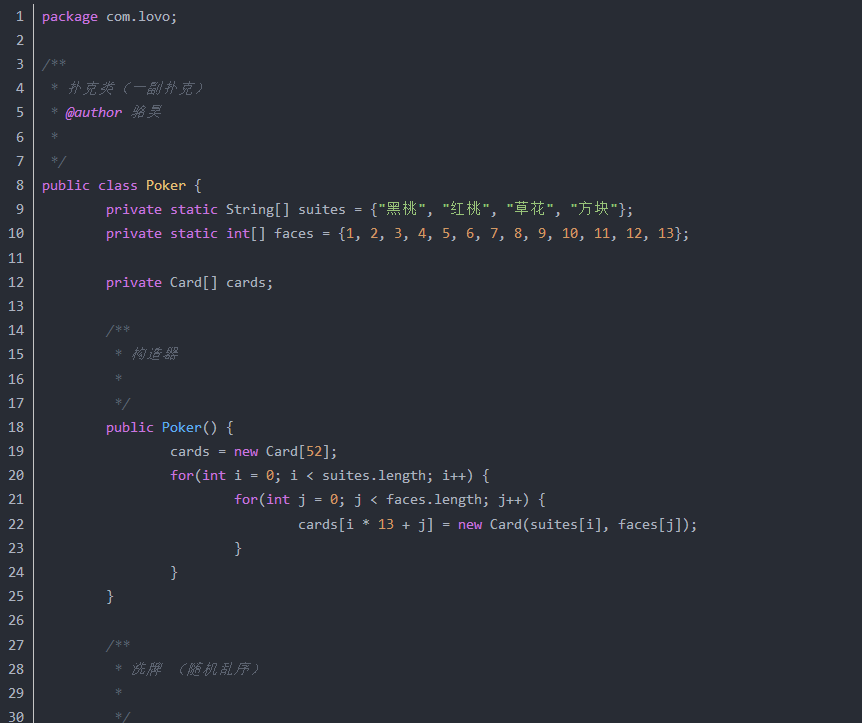
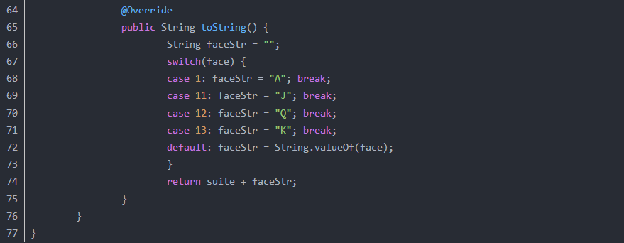
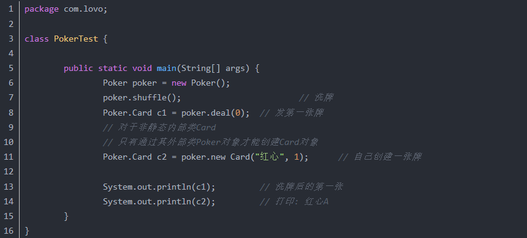

# 抽象类/内部类/接口

### 抽象类 和 接口 的异同？
+ 抽象类：含有 abstract 修饰符的 class 就算 抽象类；它既可以有抽象方法，也可以有 普通方法，构造方法，静态方法，但是不能有抽象构造方法 和 抽象静态方法。且如果其子类没有实现其所有的 抽象方法，那么该 子类 也必须是 抽象类；
+ 接口：他可以看成是 抽象类的 一个特例，使用 interface 修饰符；  
内部结构：  
    jdk7：接口只有常量和抽象方法，无构造器  
    jdk8：接口增加了 默认方法 和 静态方法，无构造器  
    jdk9：接口允许 以 private 修饰的方法，无构造器
+ 共同点：  
    不能实例化；  
    多态方式的一种使用；
+ 不同点：  
    抽象类是单继承的，而接口可以多继承（实现）；

### Anonymous Inner Class(匿名内部类)是否可以继承其它类？是否可以实现接口？
可以继承其他类或实现其他接口，在Swing编程中常用此方式来实现事件监听和回调。

### 内部类可以引用它的包含类（外部类）的成员吗？有没有什么限制？
一个内部类对象可以访问创建它的外部类对象的成员，包括私有成员。

### 接口是否可继承（extends）接口? 
接口可以继承接口。

### 抽象类是否可实现（implements）接口? 
抽象类可以实现(implements)接口。

### 抽象类是否可继承具体类（concrete class）?
抽象类可继承具体类，但前提是具体类必须有明确的构造函数。

### 抽象类（abstract class）和接口（interface）有什么异同?
抽象类和接口都不能够实例化，但可以定义抽象类和接口类型的引用。一个类如果继承了某个抽象类或者实现了某个接口都需要对其中的抽象方法全部进行实现，否则该类仍然需要被声明为抽象类。接口比抽象类更加抽象，因为抽象类中可以定义构造器，可以有抽象方法和具体方法，而接口中不能定义构造器而且其中的方法全部都是抽象方法。抽象类中的成员可以是private、默认、protected、public的，而接口中的成员全都是public的。抽象类中可以定义成员变量，而接口中定义的成员变量实际上都是常量。有抽象方法的类必须被声明为抽象类，而抽象类未必要有抽象方法。

### 抽象的（abstract）方法是否可同时是静态的（static）？  
是否可同时是本地方法（native）？  
是否可同时被synchronized修饰?
都不能。抽象方法需要子类重写，而静态的方法是无法被重写的，因此二者是矛盾的。本地方法是由本地代码（如C代码）实现的方法，而抽象方法是没有实现的，也是矛盾的。synchronized和方法的实现细节有关，抽象方法不涉及实现细节，因此也是相互矛盾的。

### 静态嵌套类(Static Nested Class)和内部类（Inner Class）的不同？
Static Nested Class是被声明为静态（static）的内部类，它可以不依赖于外部类实例被实例化。而通常的内部类需要在外部类实例化后才能实例化，其语法看起来挺诡异的，如下所示。








### <font style="color:#CF1322;">接口的意义</font>
<font style="color:rgb(51,51,51);">1）有利于代码的规范，对于大型项目，对一些接口进行定义，可以给开发人员一个清晰的指示，防止开发人员随意命名和代码混乱，影响开发效率。 </font>

<font style="color:rgb(51,51,51);">2）有利于代码维护和扩展，当前类不能满足要求时，不需要重新设计类，只需要重新写了个类实现对应的方法。 </font>

<font style="color:rgb(51,51,51);">3）解耦作用，全局变量的定义，当发生需求变化时，只需改变接口中的值即可。 </font>

<font style="color:rgb(51,51,51);">4）直接看接口，就可以清楚知道具体实现类间的关系，代码交给别人看，别人也能立马明白。</font>

### <font style="color:rgb(51,51,51);">什么是内部类？内部类的作用</font>
<font style="color:rgb(51,51,51);">内部类指在类的内部再定义另一个类。 </font>

<font style="color:rgb(51,51,51);">内部类的作用：</font>

<font style="color:rgb(51,51,51);">1）实现多重继承，因为 java 中类的继承只能单继承，使用内部类可达到多重继承。</font>

<font style="color:rgb(51,51,51);">2）内部类可以很好的实现隐藏，一般非内部类，不允许有 private 或 protected 权限的，但内部类可以。</font>

<font style="color:rgb(51,51,51);">3）减少了类文件编译后产生的字节码文件大小。内部类在编译完后也会产生.class 文件，但文件名称是：</font>`<font style="color:rgb(51,51,51);">外部类名称$内部类名称.class</font>`<font style="color:rgb(51,51,51);">。</font>

<font style="color:rgb(51,51,51);">分为以下几种： </font>

<font style="color:rgb(51,51,51);">1）成员内部类，作为外部类的一个成员存在，与外部类的属性、方法并列，成员内部类持有外部类的引用，成员内部类不能定义 static 变量和方法。</font>

<font style="color:rgb(51,51,51);">应用场合：每一个外部类都需要一个内部类实例，内部类离不开外部类存在。 </font>

<font style="color:rgb(51,51,51);">2）静态内部类，内部类以 static 声明，其他类可通过</font>`<font style="color:rgb(51,51,51);">外部类.内部类</font>`<font style="color:rgb(51,51,51);">来访问。</font>

<font style="color:rgb(51,51,51);">特点：不会持有外部类的引用，可以访问外部类的静态变量，若要访问成员变量须通过外部类的实例访问。 </font>

<font style="color:rgb(51,51,51);">应用场合：内部类不需要外部类的实例，仅为外部类提供或逻辑上属于外部类，逻辑上可单独存在。</font>

<font style="color:rgb(51,51,51);">设计的意义：加强了类的封装性（静态内部类是外部类的子行为或子属性，两者保持着一定关系），提高了代码的可读性（相关联的代码放在一起）。 </font>

<font style="color:rgb(51,51,51);">3）匿名内部类，在整个操作中只使用一次，没有名字，使用 new 创建，没有具体位置。 </font>

<font style="color:rgb(51,51,51);">4）局部内部类，在方法内或是代码块中定义类， </font>

### <font style="color:#CF1322;">抽象类和接口区别 </font>
**<font style="color:rgb(51,51,51);">抽象类</font>**

+ <font style="color:rgb(51,51,51);">在类前面须用 </font>**<font style="color:rgb(51,51,51);">abstract</font>**<font style="color:rgb(51,51,51);"> 关键字修饰。</font>
+ <font style="color:rgb(51,51,51);">一般至少包含一个抽象方法，</font><u><font style="color:rgb(51,51,51);">抽象方法指只有声明，用关键字 abstract 修饰，没有具体的实现的方法</font></u><font style="color:rgb(51,51,51);">。</font>
+ <font style="color:rgb(51,51,51);">因抽象类中含有无具体实现的方法，故</font><u><font style="color:rgb(51,51,51);">不能用抽象类创建对象</font></u><font style="color:rgb(51,51,51);">。当然如果只是用 abstract 修饰类而无具体实现，也是抽象类。</font>
+ <font style="color:rgb(51,51,51);">抽象类也可以有成员变量和普通的成员方法。</font>
+ <font style="color:rgb(51,51,51);">抽象方法必须为 public 或 protected（若为 private，不能被子类继承，子类无法实现该方法）。</font>
+ <font style="color:rgb(51,51,51);">若一个类继承一个抽象类，则必须实现父类中所有的抽象方法，</font><u><font style="color:rgb(51,51,51);">若子类没有实现父类的抽象方法，则也应该定义为抽象类</font></u><font style="color:rgb(51,51,51);">。 </font>

**<font style="color:rgb(51,51,51);">接口</font>**

+ <font style="color:rgb(51,51,51);">用关键字 </font>**<font style="color:rgb(51,51,51);">interface</font>**<font style="color:rgb(51,51,51);"> 修饰。</font>
+ <font style="color:rgb(51,51,51);">接口也可以含有变量和方法，接口中的变量会被隐式指定为</font>`<font style="color:rgb(51,51,51);">public static final</font>`<font style="color:rgb(51,51,51);"> 变量，方法会被隐式的指定为 </font>`<font style="color:rgb(51,51,51);">public abstract</font>`<font style="color:rgb(51,51,51);">。</font>
+ <font style="color:rgb(51,51,51);">接口中的所有方法均不能有具体的实现，即接口中的方法都必须为抽象方法。</font>
+ <font style="color:rgb(51,51,51);">若一个非抽象类实现某个接口，必须实现该接口中所有的方法。 </font>

**<font style="color:rgb(51,51,51);">区别</font>**

<font style="color:rgb(51,51,51);">1）抽象类可以提供成员方法实现的细节，而接口只能存在抽象方法； </font>

<font style="color:rgb(51,51,51);">2）抽象类的成员变量可以是各种类型，而接口中成员变量只能是 public static final 类型； </font>

<font style="color:rgb(51,51,51);">3）接口中不能含有静态方法及静态代码块，而抽象类可以有静态方法和静态代码块； </font>

<font style="color:rgb(51,51,51);">4）一个类只能继承一个抽象类，用 extends 来继承，却可以实现多个接口，用 implements 来实现接口。 </font>

### <font style="color:#CF1322;">抽象类的意义 </font>
<font style="color:rgb(51,51,51);">抽象类是用来提供子类的通用性，用来创建继承层级里子类的模板，减少代码编写，有利于代码规范化。</font>

### <font style="color:#CF1322;">抽象类与接口的应用场景</font>
<font style="color:rgb(51,51,51);">抽象类的应用场景：</font>

<font style="color:rgb(51,51,51);">1）规范了一组公共的方法，与状态无关，可以共享的，无需子类分别实现；而另一些方法却需要各个子类根据自己特定状态来实现特定功能； </font>

<font style="color:rgb(51,51,51);">2）定义一组接口，但不强迫每个实现类都必须实现所有的方法，可用抽象类定义一组方法体可以是空方法体，由子类选择自己感兴趣的方法来覆盖； </font>

### <font style="color:#CF1322;">抽象类是否可以没有方法和属性？ </font>
<font style="color:rgb(51,51,51);">可以</font>

### 接口与抽象类区别？
<font style="color:rgb(51,51,51);">1</font><font style="color:rgb(51,51,51);">、</font>**<font style="color:rgb(51,51,51);">语法层面</font>**<font style="color:rgb(51,51,51);">上的区</font><font style="color:rgb(51,51,51);">别</font>

<font style="color:rgb(51,51,51);">抽象类可以有方法实现，而接口的方法中只能是抽象方法</font><font style="color:rgb(51,51,51);">；</font>

<font style="color:rgb(51,51,51);">抽象类中的成员变量可以是各种类型的，接口中的成员变量只能是</font><font style="color:rgb(51,51,51);">public</font><font style="color:rgb(51,51,51);"> </font><font style="color:rgb(51,51,51);">static</font><font style="color:rgb(51,51,51);"> </font><font style="color:rgb(51,51,51);">final</font><font style="color:rgb(51,51,51);">类型；</font><font style="color:rgb(51,51,51);">接口中不能含有静态代码块以及静态方法，而抽象类可以有静态代码块和静态方法；</font>

<font style="color:rgb(51,51,51);">一个类只能继承一个抽象类，而一个类却可以实现多个接口</font><font style="color:rgb(51,51,51);">。</font>

<font style="color:rgb(51,51,51);">2</font><font style="color:rgb(51,51,51);">、</font>**<font style="color:rgb(51,51,51);">设计层面</font>**<font style="color:rgb(51,51,51);">上的区</font><font style="color:rgb(51,51,51);">别</font>

<font style="color:rgb(51,51,51);">抽象层次不同。抽象类是对整个类整体进行抽象，包括属性、行为，但是接口只是对类行为进行抽</font><font style="color:rgb(51,51,51);">象。继承抽象类是一种</font><font style="color:rgb(51,51,51);">"</font><font style="color:rgb(51,51,51);">是不是</font><font style="color:rgb(51,51,51);">"</font><font style="color:rgb(51,51,51);">的关系，而接口实现则是</font><font style="color:rgb(51,51,51);"> </font><font style="color:rgb(51,51,51);">"</font><font style="color:rgb(51,51,51);">有没有</font><font style="color:rgb(51,51,51);">"</font><font style="color:rgb(51,51,51);">的关系。如果一个类继承了某个抽象类，则子类必定是抽象类的种类，而接口实现则是具备不具备的关系，比如鸟是否能飞。</font>

<font style="color:rgb(51,51,51);">继承抽象类的是具有相似特点的类，而实现接口的却可以不同的类</font><font style="color:rgb(51,51,51);">。</font>

<font style="color:rgb(51,51,51);">门和警报的例子：</font>

```java
class AlarmDoor extends Door implements Alarm {
//code
}

class BMWCar extends Car implements Alarm {
//code
}
```

### 接口与抽象类
1） 接口和抽象类都用于抽象，接口是抽象类的抽象。

2） 接口中只有方法声明，没有实现（无方法体）；在接口中声明的方法具有 public 和abstract 属性，一个类可以实现多个接口（即多继承），接口以‘，’分隔；接口中的方法必须全部实现。

3）抽象类可以有部分方法实现，抽象类必须通过继承才能使用。

### 内部类（Inner Class）
1）内部类是嵌套在另一个类中的类。

2） 内部类用于名称隐藏和程序代码的组织，另外内部类拥有直接访问其外部类所有成员（包括private 的）的权限（无需任何关键字修饰）。

3） 内部类不可以在其他类或main 方法里实例化，必须使用如下方法（非静态内部类）

`外部类.内部类 对象名=new 外部类().new 内部类();`

静态内部类调用方式：

`外部类.内部类 对象名=new 外部类.内部类();`

4） 非静态内部类不可以声明静态成员；静态内部类的非静态成员可以访问其外部类的静态成员，声明为静态的成员不可以访问外部的非静态成员。

### <font style="color:rgb(51,51,51);">抽象类接口区别（360） </font>
> [接口和抽象类有什么区别 - 雍家培 - 博客园](https://www.cnblogs.com/yongjiapei/p/5494894.html)
>

### <font style="color:rgb(51,51,51);">接</font>口的意义（百度） 
1、重要性：在Java语⾔中， abstract class 和interface 是⽀持抽象类定义的两种机制。正是由于这两种机制的存在，才赋予了Java强⼤的 ⾯向对象能⼒。 

2、简单、规范性：如果⼀个项⽬⽐较庞⼤，那么就需要⼀个能理清所有业务的架构师来定义⼀些主要的接 

⼜，这些接口不仅告诉开发⼈员你需要实现那些业务，⽽且也将命名规范限制住了（防⽌⼀些开发⼈员随便命名导致别的程序员⽆法看明⽩）。 

3、维护、拓展性：⽐如你要做⼀个画板程序，其中⾥⾯有⼀个⾯板类，主要负责绘画功能，然后你就这样定义了这个类。可是在不久将来，你突然发现这个类满⾜不了你了，然后你又要重新设计这个类，更糟糕是你可能要放弃这个类，那么其他地⽅可能有引⽤他，这样修改起来很⿇烦。 

如果你⼀开始定义⼀个接口，把绘制功能放在接口⾥，然后定义类时实现这个接口，然后你只要⽤这个接口去引⽤实现它的类就⾏了，以后要换的话只不过是引⽤另⼀个类⽽已，这样就达到维护、拓展的⽅便性。 

4、安全、严密性：接口是实现软件松耦合的重要⼿段，它描叙了系统对外的所有服务，⽽不涉及任何具体 

的实现细节。这样就⽐较安全、严密⼀些（⼀般软件服务商考虑的⽐较多）。 

### 抽象类的意义（乐视）
抽象类往往⽤来表征对问题领域进⾏分析、设计中得出的抽象概念，是对⼀系列看上去不同，但是本质上相同的具体概念的抽象。具体分析如下： 

1.因为抽象类不能实例化对象，所以必须要有⼦类来实现它之后才能使⽤。这样就可以把⼀些具有相同属性和⽅法的组件进⾏抽象，这样更有利于代码和程序的维护。 

2.当又有⼀个具有相似的组件产⽣时，只需要实现该抽象类就可以获得该抽象类的那些属性和⽅法。 

### 内部类的作⽤(百度，乐视) 
定义：放在⼀个类的内部的类我们就叫内部类。 

作⽤： 

1. 内部类可以很好的实现隐藏，⼀般的⾮内部类，是不允许有 private 与protected权限的，但内部类可以；
2. 内部类拥有外围类的所有元素的访问权限；
3. 可是实现多重继承；
4. 可以避免修改接口⽽实现同⼀个类中两种同名⽅法的调⽤。

### 匿名内部类是什么？如何访问在其外面定义的变量？
+ **匿名内部类是什么？**
    - 匿名内部类是没有访问修饰符的。
    - 所以当所在方法的形参需要被匿名内部类使用，那么这个形参就必须为final
    - 匿名内部类是没有构造方法的。因为它连名字都没有何来构造方法。
+ **如何访问在其外面定义的变量？**

所以当所在方法的形参需要被匿名内部类使用，那么这个形参就必须为final

### <font style="color:rgb(36,41,46);">接口和抽象类的区别是什么</font>
<font style="color:rgb(36,41,46);">1. 接口的方法默认是public，所有方法在接口中不能有实现(Java 8 开始接口方法可以有默认实现），抽象类可以有非抽象的方法；</font>

<font style="color:rgb(36,41,46);">2. 接口中的实例变量默认是final 类型的，而抽象类中则不一定；</font>

<font style="color:rgb(36,41,46);">3. 一个类可以实现多个接口，但最多只能实现一个抽象类；</font>

<font style="color:rgb(36,41,46);">4. 一个类实现接口的话要实现接口的所有方法，而抽象类不一定；</font>

<font style="color:rgb(36,41,46);">5. 接口不能用new 实例化，但可以声明，但是必须引用一个实现该接口的对象从设计层面来说，抽象是对类的抽象，是一种模板设计，接口是行为的抽象，是一种行为的规范。</font>

### <font style="color:#CF1322;">抽象类和接口有什么区别</font>
+ 接口是公开的，里面不能有私有的方法或变量，而抽象类是可以有私有方法或私有变量的；
+ 实现接口的一定要实现接口里定义的所有方法，而实现抽象类可以有选择地重写需要用到的方法，一般的应用里，最顶级的是接口，然后是抽象类实现接口，最后才到具体类实现；
+ 接口可以实现多重继承，而一个类只能继承一个超类，但可以通过继承多个接口实现多重继承

### <font style="color:#CF1322;">Static class与non static class的区别</font>
+ 内部静态类**不需要**有指向外部类的**引用，**但非静态内部类**需要**持有对外部类的**引用；**
+ 内部静态类只能访问外部类的静态成员，非静态内部类能够**<font style="color:rgb(0,128,0);">访问外部类的静态和非静态成员</font>**；
+ 内部静态类可以脱离外部类实体被创建，非静态内部类不能脱离外部类实体被创建。

> 根据Oracle官方的说法：
>
> Nested classes are divided into two categories: static and non-static. Nested classes that are declared static are called **static nested classes**. Non-static nested classes are **called inner classes**.
>
> 从字面上看，一个被称为静态嵌套类，一个被称为内部类。
>
> 什么是嵌套？嵌套就是我跟你没关系，自己可以完全独立存在，但是我就想借你的壳用一下，来隐藏一下我自己（真TM猥琐）。
>
> 什么是内部？内部就是我是你的一部分，我了解你，我知道你的全部，没有你就没有我。（所以内部类对象是以外部类对象存在为前提的）
>
> [https://www.cnblogs.com/feicheninfo/p/9667341.html](https://www.cnblogs.com/feicheninfo/p/9667341.html)
>

### <font style="color:#CF1322;">Interface与abstract类的区别</font>
1. 抽象类可以有**构造方法**，接口中不能有构造方法；
2. 抽象类中可以有**普通成员变量**，接口中没有普通成员变量；
3. 抽象类中可以包含**非抽象的普通方法**，接口中的所有方法必须都是抽象的，不能有非抽象的普通方法；
4. 抽象类中的抽象方法的访问类型可以是public，protected和default（默认类型，虽然eclipse下不报错，但应该也不行），但接口中的抽象方法只能是public类型的，并且默认即为public abstract类型；
5. 抽象类中可以包含**静态方法**，接口中不能包含静态方法；
6. 抽象类和接口中都可以包含**静态成员变量**，抽象类中的静态成员变量的访问类型可以任意，但接口中定义的变量只能是public static final类型，并且默认即为public static final类型。
7. 一个类可以实现多个接口，但只能继承一个抽象类。


> 更新: 2023-07-22 06:32:58  
> 原文: <https://www.yuque.com/joyo/interview/lwz1g3>