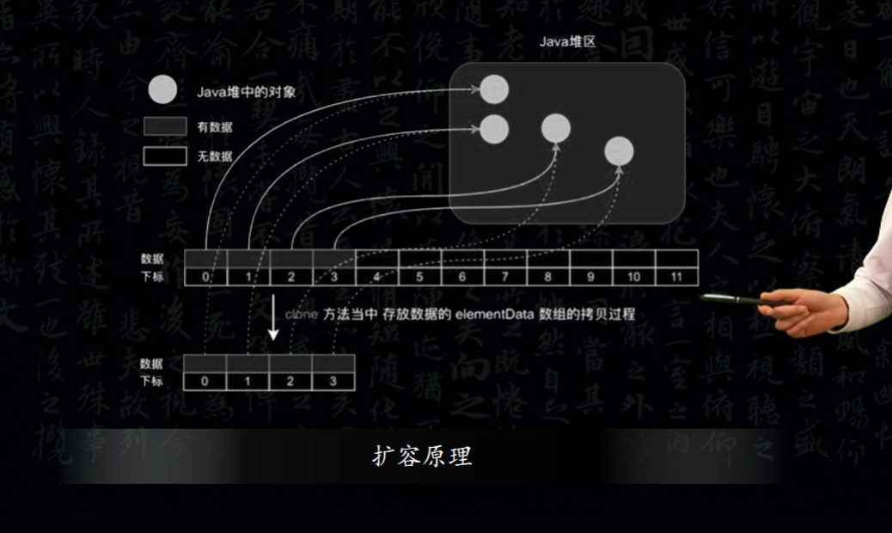
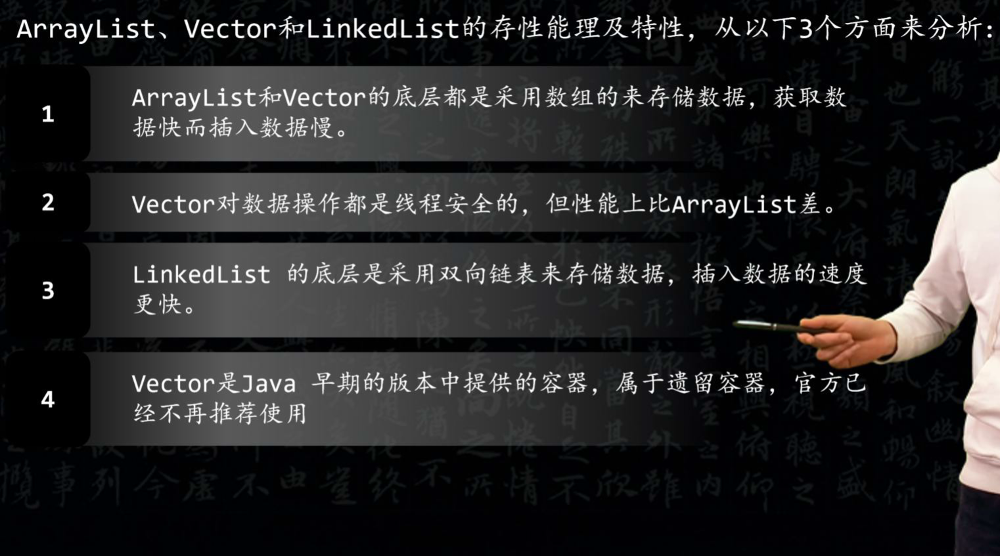
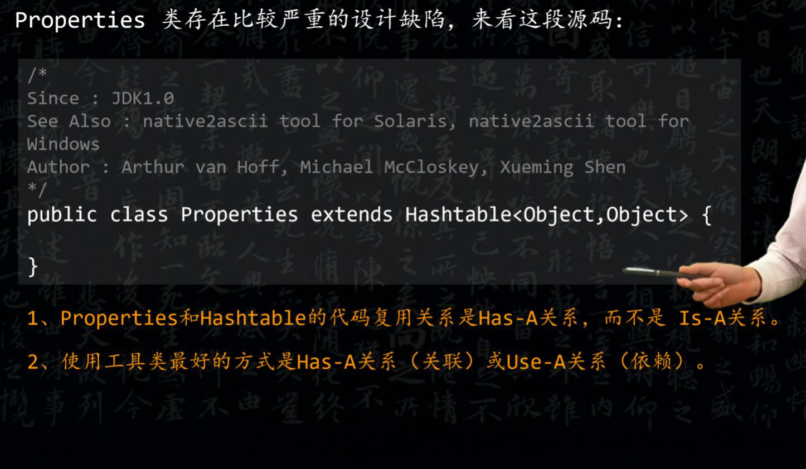
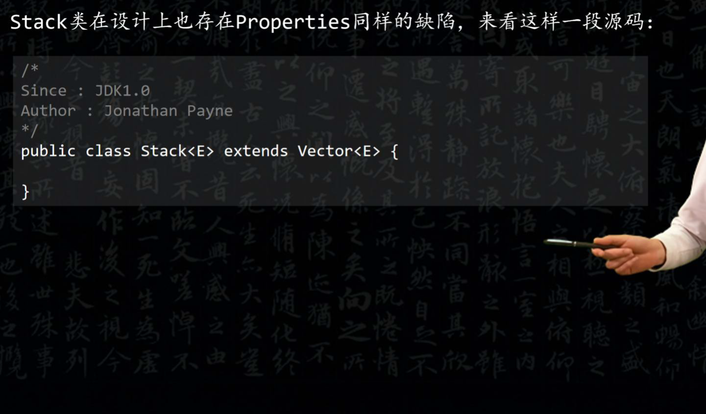

# List

### ArrayList 了解吗？	
ArrayList 的底层是**动态数组**，它的容量能**动态增长**。在添加大量元素前，应用可以使用 ensureCapacity 操作增加 ArrayList 实例的容量。

ArrayList **继承了 AbstractList** ，并实现了 List 接口。

### ArrayList 的扩容机制？ 
ArrayList 扩容的本质就是**<u>计算出新的扩容数组的 size 后再实例化</u>**，最后**将原有数组内容复制到新数组中**去。 

**默认情况下，新的容量会是原容量的 1.5 倍**。

以JDK1.8为例说明:

```java
public boolean add(E e) {
    //判断是否可以容纳e，若能，则直接添加在末尾；
    //若不能，则进行扩容，然后再把e添加在末尾
    ensureCapacityInternal(size + 1); // Increments modCount!!
    //将e添加到数组末尾 
    elementData[size++] = e;
    return true;
}

// 每次在add()一个元素时，arraylist都需要对这个list的容量进行一个判断。
// 通过 ensureCapacityInternal()方法确保当前ArrayList维护的数组具有存储新元素的能力，
// 经过处理之后将元素存储在数组elementData的尾部

private void ensureCapacityInternal(int minCapacity) { 
    ensureExplicitCapacity(calculateCapacity(elementData, minCapacity));
}

private static int calculateCapacity(Object[] elementData, int minCapacity) {
    //如果传入的是个空数组则最小容量取默认容量与minCapacity之间的最大值 
    if (elementData == DEFAULTCAPACITY_EMPTY_ELEMENTDATA) {
        return Math.max(DEFAULT_CAPACITY, minCapacity);
    }
    return minCapacity;
}

private void ensureExplicitCapacity(int minCapacity) { 
    modCount++;
    // 若ArrayList已有的存储能力满足最低存储要求，则返回add直接添加元素；
    // 如果最低要求的存储能力>ArrayList已有的存储能力，这就表示ArrayList的存储能力不足，
    // 因此需要调用 grow()方法进行扩容
    if (minCapacity - elementData.length > 0) 
        grow(minCapacity);
}

private void grow(int minCapacity) {
    // 获取elementData数组的内存空间长度
    int oldCapacity = elementData.length;
    // 扩容至原来的1.5倍
    int newCapacity = oldCapacity + (oldCapacity >> 1);
    // 校验容量是否够
    if (newCapacity - minCapacity < 0) newCapacity = minCapacity;
    // 若预设值大于默认的最大值，检查是否溢出
    if (newCapacity - MAX_ARRAY_SIZE > 0) newCapacity = hugeCapacity(minCapacity);
    // 调用Arrays.copyOf方法将elementData数组指向新的内存空间
    // 并将elementData的数据复制到新的内存空间
    elementData = Arrays.copyOf(elementData, newCapacity);
}
```

### 怎么在遍历 ArrayList 时移除一个元素？
foreach 删除会导致**快速失败**问题，可以**使用迭代器**的`remove()`方法。

```java
Iterator itr = list.iterator(); 
while(itr.hasNext()) {
    if(itr.next().equals("jay") { 
        itr.remove();
    }
}
```

### ArrayList 和 Vector 的区别
1. ArrayList 在内存不够时**默认是扩展 50% + 1 个**，**Vector 是默认扩展 1 倍**。
2. Vector 属于**线程安全**级别的，但是大多数情况下不使用 Vector，因为操作 Vector 效率比较低。

### ArrayList 与 LinkedList 的区别
1. ArrayList 基于**动态数组**实现；LinkedList 基于**链表**实现。
2. 对于随机 index 访问的 get 和 set 方法，ArrayList 的速度要优于 LinkedList。因为 ArrayList 直接通过数组下标直接找到元素；LinkedList 要移动指针遍历每个元素直到找到为止。
3. 新增和删除元素，LinkedList 的速度要优于 ArrayList。因为 ArrayList 在新增和删除元素时，可能扩容和复制数组；LinkedList 除了实例化对象需要时间外，只需要修改指针即可。

### List 和 Set 的区别 
List、 Set 都是继承自 Collection 接口；

+ List 特点：元素有放入顺序，元素可重复；
+ Set 特点：元素无放入顺序，元素不可重复，重复元素会覆盖掉，（元素虽然无放入顺序，但是<u>元素在 set 中的位置是由该元素的 </u>**<u>HashCode</u>**<u> 决定的</u>，其位置其实是固定的，**加入 Set 的 Object 必须定义 equals () 方法；**
+ List 支持 for 循环，也就是通过**下标**来遍历，也可以用**迭代器**，但是 set 只能用迭代器，因为他无序，无法用下标来取得想要的值。）
+ Set：**检索元素效率低下**，删除和插入效率高，<u>插入和删除不会引起元素位置改变</u>。 
+ List：和数组类似，List可以动态增长，查找元素效率高，**插入删除元素效率低**，因为会引起其他元素位置改变 

### ArrayList、LinkedList、Vector 的区别
+ ArrayList：线程不安全，数组，适合查找，**可自动扩容 50%**，  
三个构造器：无参，容量，Collection 接口；  
`transient Object[] elementData;`不会被序列化。
+ LinkedList：线程不安全，链表，适合插入、删除
+ Vector：线程安全，数组，适合查找，**可自动扩容 100%**

### **ArrayList 与 LinkedList 区别**
+ **ArrayList：**
    - **优点：ArrayList 是实现了基于****动态数组****的数据结构。因为地址连续，一旦数据存储好了，查询操作效率会比较高（**<u>在内存里是连着放的</u>**）。**
    - **缺点：因为地址连续， ArrayList **<u>要移动数据</u>**，所以**<u>插入和删除操作效率比较低</u>**。**
+ **LinkedList****：**
    - **优点：LinkedList 基于****链表****的数据结构，地址是任意的，所以在**<u>开辟内存空间的时候不需要等一个连续的地址</u>**。**<u>对于新增和删除操作 add 和 remove，LinedList 比较占优势。</u>**LinkedList 适用于要****头尾操作****或****插入指定位置****的场景**
    - **缺点：因为 LinkedList 要移动指针，所以**<u>查询操作性能比较低</u>**。**
+ **适用场景分析：**
    - **当需要对数据进行多次访问的情况下选用 ArrayList；**
    - **当需要对数据进行多次增加删除修改时采用 LinkedList。**

### **ArrayList 与 Vector 区别**
```plain
// 构造一个具有指定初始容量的空列表。
public ArrayList(int initialCapacity){//...}
// 构造一个初始容量为10的空列表。    
public ArrayList(){//...}
// 构造一个包含指定 collection 的元素的列表
public ArrayList(Collection<?  extends E> c){//...}

// Vector有四个构造方法：
// 使用指定的初始容量和等于零的容量增量构造一个空向量。
public Vector(){//...}
// 构造一个空向量，使其内部数据数组的大小，其标准容量增量为零。
public Vector(int initialCapacity){//...}
// 构造一个包含指定 collection 中的元素的向量
public Vector(Collection<? extends E> c){//...}
// 使用指定的初始容量和容量增量构造一个空的向量
public Vector(int initialCapacity,int capacityIncrement){//...}
```

**ArrayList 和 Vector 都是用****数组****实现的，主要有这么三个区别：**

+ **Vector 是****多线程安全****的，线程安全就是说多线程访问同一代码，不会产生不确定的结果。而 ArrayList 不是，这个可以从源码中看出，Vector 类中的方法很多有**** synchronized ****进行修饰，这样就导致了 **<u>Vector 在效率上无法与 ArrayList 相比</u>**；**
+ **两个都是采用的****线性连续空间****存储元素，但是当空间不足的时候，两个类的**<u>扩容方式不同</u>**。**
+ <u>Vector 可以设置增长因子</u>**，而 ArrayList 不可以。**

**Vector 是一种老的动态数组，是线程同步的，效率很低，一般不赞成使用。**

**适用场景分析：**

**Vector 是线程同步的，所以它也是线程安全的，而 ArrayList 是线程异步的，是不安全的。**<u>如果不考虑到线程的安全因素，一般用ArrayList效率比较高</u>**。**

### 数组和 ArrayList 的区别 
1. 数组可以包含**基本类型**和**对象类型**，ArrayList 只能包含对象类型
2. 数组**大小固定**，ArrayList 大小可以动态变化
3. ArrayList 提供了**更多的特性**（`addAll`、`removeAll`）。

### ArrayList 如何实现排序
+ `Collections.sort(List<T> list)`;
+ `Collections.sort(List<T> list, Comparator<? super T> c)`;
+ lambda 表达式：`list.stream().sort(Comparator)`

### List 能怎样方便的排序？
+ Collections.sort(comparator)
+ Collections.sort(list, comparator)

> [List集合快捷排序_a-shu的博客-CSDN博客_list快速排序](https://blog.csdn.net/zsgCXB/article/details/122642652)
>

### ArrayList 和 LinkedList 区分及实现原理
1. ArrayList 是实现了基于**动态数组**的数据结构，⽽LinkedList是基于**链表**的数据结构； 
2. 对于随机访问 get 和 set，ArrayList 要优于 LinkedList，因为 <u>LinkedList 要移动指针</u>； 
3. 对于添加和删除操作 add 和 remove，⼀般⼤家都会说 LinkedList 要⽐ ArrayList 快，因为 <u>ArrayList 要移动数据</u>。 

### Vector、ArrayList 和 LinkedList 的区别？
1. Vector、ArrayList 都是以**类似数组**的形式存储在内存中，LinkedList则以**链表**的形式进行存储。
2. Vector 线程同步，ArrayList、LinkedList 线程不同步。
3. LinkedList 适合指定位置插入、删除操作，不适合查找；ArrayList、Vector适合查找，不适合指定位置的插入、删除操作。
4. ArrayList 在元素填满容器时会自动扩充容器大小的 **50%**，而 Vector 则是**100%**，因此 ArrayList 更节省。

### 阐述ArrayList、Vector、LinkedList的存储性能和特性
ArrayList 和Vector都是使用**数组**方式存储数据，此数组元素数大于实际存储的数据以便增加和插入元素，它们都允许直接按序号索引元素。但是，插入元素要涉及数组元素移动等内存操作，所以索引数据快而插入数据慢。Vector中的方法由于添加了synchronized修饰，因此Vector是线程安全的容器，但性能上较ArrayList差，因此已经是Java中的遗留容器。

总结：ArrayList是线程不安全的，Vector是线程安全的，故在性能上ArrayList比Vector要好。

LinkedList使用**双向链表**实现存储（将内存中零散的内存单元通过附加的引用关联起来，形成一个可以按序号索引的线性结构，这种链式存储方式与数组的连续存储方式相比，内存的利用率更高），按序号索引数据需要进行前向或后向遍历，但是插入数据时只需要记录本项的前后项即可，所以**插入速度较快**。

总结：LinkedList是双向链表结构，在插入操作时不需要遍历所有数据，速度较快，其他操作时和ArrayList性能相同。

但是由于ArrayList和LinkedListed都是非线程安全的，如果遇到多个线程操作同一个容器的场景，则可以通过工具类Collections中的synchronizedList方法将其转换成线程安全的容器后再使用。

> [列举java的集合和继承关系 - 爱码网](https://www.likecs.com/show-203866881.html)
>

### ArrayList和LinkedList有什么区别？
> [linkedlist和arraylist的区别是什么-常见问题-PHP中文网](https://www.php.cn/faq/415621.html)
>
> [ArrayList与LinkList对比_Coder阿呆的博客-CSDN博客_linklist和arraylist](https://blog.csdn.net/weixin_41657730/article/details/82462156)
>

### LinkedList 与 ArrayList 区别适用场景
+ LinkedList：写多读少；
+ ArrayList：读多写少。

> ### [ArrayList和LinkedList区别及使用场景_Forget_Sky的博客-CSDN博客_arraylist linkedlist](https://blog.csdn.net/u012216131/article/details/82500925)

### ArrayList 是如何扩容的？
+ ArrayList在调用无参构造方法时创建的是一个长度为0的空数组，当调用add()方法添加元素时，ArrayList才会触发扩容机制。
+ 新容量 = 旧容量 * 1.5，所以才有ArrayList每次扩容为旧容量的1.5倍的说法。
+ addAll()方法总是选择**扩容一次后的容量**与**旧容量加上添加的元素个数的容量**中取一个**最大值**作为新的容量

> [ArrayList的扩容机制_·wangweijun的博客-CSDN博客_arraylist 扩容机制](https://blog.csdn.net/qq_42453117/article/details/122099920)
>

### 95.请你谈一谈 ArrayList自动扩容机制的实现原理
一位3 年工作经验的小伙伴面试时被问到，说请你谈一谈ArrayList 自动扩容机制的实现原理。这个问题对于稍微看过一点源码的小伙伴来说，其实非常简单。下面我给大家分享一下我对这个问题的理解。

#### 1 存储容器


ArrayList 是一个数组结构的存储容器，默认情况下，数组的长度是10。当然，我们也可以在构建 ArrayList 对象的时候，直接指定初始长度。那么，随着程序的运行，不断地往 ArrayList 中添加数据，当添加的数据达到 10 个的时候，ArrayList就没有足够的容量来存储后面添加的数据。那么，这个时候，ArrayList 会触发自动扩容机制。

#### 2 扩容原理


扩容的流程其实也很简单，首先创建一个新的数组，这个数组的长度是原来数组长度的 1.5 倍。然后，使用 Arrays.copyOf()方法把原数组中的数据拷贝到新数组中。扩容完成之后，再把当前要添加的数据加入到新的数组中，从而完成动态扩容的过程。

好了，以上就是我对这个问题的理解。作为一个业务程序员，虽然工作的性质是让家去写CRUD，不需要过多的去关注技术的底层实现原理。但是，在未来的职业晋升过程中，对技术的理解程度非常重要。

### 105.谈谈ArrayList、Vector和LinkedList 的存储性能及特性
又有一位工作2 年的小伙伴面试的时候，被问到一个集合相关的问题。说请你谈谈ArrayList、Vector和LinkedList 的存储性能及特性。

今天呢，我给大家分享一下我对这个问题的理解。

#### 1、存储性能及特性
关于ArrayList、Vector 和LinkedList 的存性能理及特性，我从以下3 个方面来分析：


1）首先，ArrayList 和 Vector 的底层都是采用数组的来存储数据，而且都是根据索引来取数据，这样设计使得获取数据快而插入数据慢。另外，每次扩容都要移动数组中的元素，存储数据量较大的时候会影响读写性能。


2）其次，由于Vector 中的方法都使用了 synchronized 修饰，因此 ，Vector 中对数据操作都是线程安全的，但性能上比ArrayList 差。


3）然后，LinkedList 的底层是采用双向链表来存储数据的，也就是说将内存中零散的内存单元通过附加的引用关联起来，形成一个可以按序号索引的线性结构，这种链式存储方式与数组的连续存储方式相比，内存的利用率更高。LinkedList获取数据需要根据索引序号，向前或者向后遍历，但是插入数据时只需要记录本项的前后项即可，所以，LinkedList插入数据的速度更快。



4）最后，再补充一点，Vector是Java 早期的版本中提供的容器， 属于遗留容器，官方已经不再推荐使用。但是由于 ArrayList 和 LinkedListed 都是非线程安全的，在多线程环境下，可以使用工具类Collections 的 synchronizedList() 方法，将容器转换成线程安全的容器再使用。这其实也是装饰器模式的一种应用。

#### 2、关于遗留容器
关于Java 中的遗留容器，我最后再补充一下。除Vector 之外，还有Hashtable、Dictionary、BitSet、Stack、Properties 都是遗留容器，这些容器中，Properties 类存在比较严重的设计缺陷。来看这段源码：

```java
/*
Since : JDK1.0
See Also : native2ascii tool for Solaris, native2ascii tool for
Windows
Author : Arthur van Hoff, Michael McCloskey, Xueming Shen
*/
public class Properties extends Hashtable<Object,Object> {

}
```

Properties是一个键和值都是字符串的特殊的键值对映射，在设计上应该是关联一个Hashtable，并将它的两个泛型参数设置为 String 类型，但是 Java API 中的Properties 是直接继承了 Hashtable，这很明显是对继承的滥用。主要体现在以下两个方面：



1）首先，根据合成复用原则，这里Properties 和Hashtable的代码复用关系应该是 Has-A 关系，而不是 Is-A 关系。

2）另一方面，这两个容器都属于工具类，继承工具类本身就是一个错误的做法，使用工具类最好的方式是 Has-A 关系（关联）或Use-A 关系（依赖）。

既然都讲到这里了，最后再扩展一下Stack 类在设计上也存在Properties同样的缺陷。来看这样一段源码：



```java
/*
Since : JDK1.0
Author : Jonathan Payne
*/
public class Stack<E> extends Vector<E> {

}
```

在JDK的util包中，我们发现Stack类也是继承了 Vector，这个设计也是不太合理的。

好了，以上就是我对ArrayList、Vector和LinkedList的理解。

### Vector是一个线程安全类吗？
很显然你可以将集合类分成两组，线程安全和非线程安全的。Vector 是用同步方法来实现线程安全的, 而和它相似的ArrayList不是线程安全的。


> 更新: 2023-07-14 01:27:32  
> 原文: <https://www.yuque.com/joyo/interview/cl5pdslk000fhbc4>