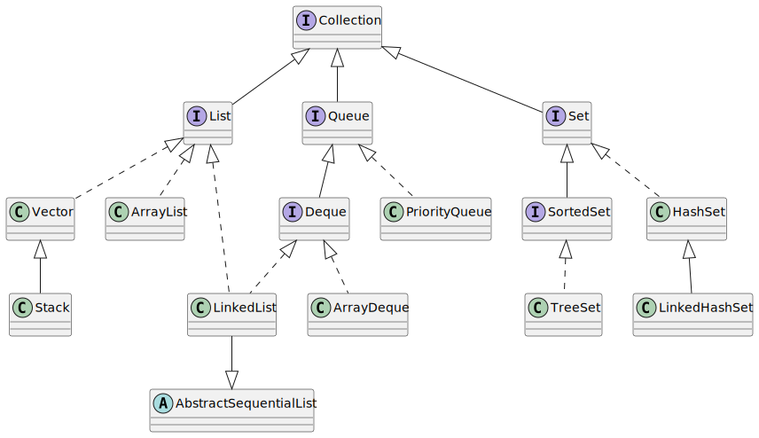
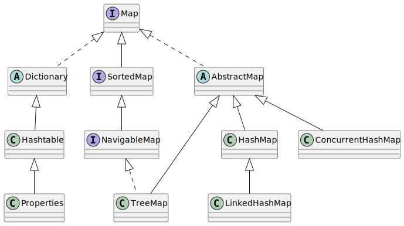

# 集合

**参考**

> [揭秘 HashMap 实现原理（Java 8） - Single_Yam - 博客园](https://www.cnblogs.com/yangming1996/p/7997468.html)
>
> [疫苗：Java HashMap的死循环 | 酷 壳 - CoolShell](https://coolshell.cn/articles/9606.html)
>
> [真正搞懂hashCode和hash算法_负债程序猿的博客-CSDN博客_hashcode和hash值](https://blog.csdn.net/qq_33709582/article/details/113337405)
>
> [Java集合类及其数据结构归纳](https://www.yuque.com/joyo/java/xunipx)
>

### 常见的集合有哪些？
Java集合类主要由两个接口 **Collection **和 **Map **派生出来的，Collection 有三个子接口：List、Set、Queue。

Java集合框架图如下：

**Collection：**



****

**Map：**



+ List 代表了有序可重复集合，可直接根据元素的索引来访问；
+ Set 代表无序不可重复集合，只能根据元素本身来访问；
+ Queue 是队列集合;
+ Map 代表的是存储 key-value 对的集合，可根据元素的 key 来访问 value。

集合体系中常用的实现类有 ArrayList、LinkedList、HashSet、TreeSet、HashMap、TreeMap 等实现类。

### List 、Set 和 Map 的区别
+ List  以索引来存取元素，有序的，元素是**允许重复**的，可以插入多个 null；
+ Set 不能存放重复元素，无序的，只允许一个 null；
+ Map 保存键值对映射；
+ List 底层实现有**数组**、**链表**两种方式；
+ Set、Map 容器有基于**哈希**存储和**红黑树**两种方式实现；
+ Set 基于 Map 实现，Set 里的元素值就是 Map的键。

> [Set，Map的底层实现_雄关漫道_的博客-CSDN博客_set底层是map](https://blog.csdn.net/weixin_43868322/article/details/115920238)
>

### 哪些集合类是线程安全的？哪些不安全？ 
线性安全的集合类： 

+ Vector：比ArrayList多了同步机制。 
+ Hashtable。 
+ ConcurrentHashMap：是一种高效并且线程安全的集合。 
+ Stack：栈，也是线程安全的，继承于Vector。 

线性不安全的集合类： 

+ HashMap 
+ ArrayList 
+ LinkedList 
+ HashSet 
+ TreeSet 
+ TreeMap

### Map、Set、List、Queue、Stack 的特点与用法
+ **Map  
**键值对集合，k-v 键值对存储。Hashtable 和 HashMap 是 Map 的实现类   
    - **Hashtable** 是线程安全的，不能存储 null 值   
    - **HashMap** 不是线程安全的，可以存储 null 值  
    - **TreeMap **可以保证顺序，HashMap 不保证顺序，即为无序的。

> TreeMap 实现了 SortedMap，SortedMap 继承了 Map
>

+ **Set**  
集合，无序，不重复

> LinkedHashSet 是有序的
>

+ **List**  
数组集合，ArrayList ， Vector ， LinkedList 是 List 的实现类
    - **ArrayList** 是线程不安全的， Vector 是线程安全的，这两个类底层都是由**数组**实现的
    - **LinkedList** 是线程不安全的，底层是由**链表**实现的   
+ **Queue**  
队列，提供了几个基本方法，add(E e)、offer(E e)、poll()、peek() 等。已知实现类有 **LinkedList**、**PriorityQueue **等。

> 1. add  
如果可以在不违反容量限制的情况下，立即将指定元素插入此队列，成功时返回true，如果当前没有可用空间，则引发IllegalStateException。
> 2. offer  
如果可以在不违反容量限制的情况下，立即将指定元素插入此队列。
> 3. poll  
检索并删除此队列的头，如果此队列为空，则返回null。
> 4. peek  
检索但不删除此队列的头，如果此队列为空，则返回null。
>

+ **Stack**  
栈，继承自 Vector，实现一个**后进先出**的栈。提供了几个基本方法，push(E item)、pop()、peak()、empty()、search(Object o) 等。

> 1. push  
将一个项目**推到**这个堆栈的**顶部**。这与以下效果完全相同:  
addElement(item)
> 2. pop()  
**删除**此堆栈**顶部**的对象，并将该对象作为此函数的值返回。
> 3. peek()  
**查看**此堆栈**顶部**的对象，而不将其从堆栈中删除。
> 4. empty()  
测试此堆栈是否为空。
> 5. search(Object o)  
返回对象在此堆栈上的基于 1 的位置。如果对象 o 在此堆栈中作为项目出现，则此方法返回到发生的堆栈顶部最接近堆栈顶部的距离；堆栈上最上面的项目被认为在距离 1 处。equal 方法用于将 o 与该堆栈中的项目进行比较。
>

### Collection 包结构，与 Collections 的区别
Collection 是个 java.util 下的**接口**，它是各种集合结构的父接口。

Collections 是个 java.util 下的**工具类**，它包含有各种有关集合操作的静态方法。

### List 和 Map 区别
List 是对象集合，允许对象重复。

Map 是键值对的集合，不允许 key 重复，可以有一个null值作为key。

### 用过哪些集合类？能分别说下他们的应用场景吗？[🔗](#WJJWZ)
+ Collection
    - List
        * ArrayLIst：单线程、读多写少
        * LinkedList：单线程、读少写多
    - Set
        * HashSet：单线程、去重
        * TreeSet：单线程、去重、顺序读写
+ Map
    - HashMap：单线程
    - TreeMap：单线程、顺序读写
    - Hashtable：线程安全
    - CurrentHashMap：高并发读写

### 列举几个 Java Collection 类库中的常用类，试简述其类结构、对应算法
+ ArrayList：数组；基于下标
+ LinkedList：链表；<font style="color:rgb(51, 51, 51);">插入数据有三种方式：头部插入，尾部插入，中间插入</font>
+ HashSet：基于 HashMap 的 key 实现；Hash 算法
+ TreeSet：基于 <font style="color:rgb(77, 77, 77);">TreeMap 实现；</font>红黑树

> [列举几个Java中Collection类库中的常用类（集合相关一）_一生所Ai的博客-CSDN博客](https://blog.csdn.net/qq_40180411/article/details/81414585)
>
> [看动画学算法之:linkedList - flydean - 博客园](https://www.cnblogs.com/flydean/p/algorithm-linked-list.html)
>
> [TreeSet详解_一头狒狒的博客-CSDN博客_treeset](https://blog.csdn.net/ch98000/article/details/126605554)
>

### List、Set、Map是否都继承自Collection接口？
List 和 Set 继承自 Collection 接口；

Map 接口是一组成对的**键－值**对象，Map 中不能有重复的 key，拥有自己的内部排列机制。

### 简介常用集合类，以及对应算法
+ ArrayList 数组
+ LinkedList 链表
+ HashMap 和 Hashtable 散列表

### List、Map、Set的区别
1. List、Set都是继承自Collection接口，Map则不是
2. List特点：元素有放入顺序，元素可重复；  
Set特点：元素无放入顺序，元素不可重复，重复元素会覆盖掉。  
注意：元素虽然无放入顺序，但是元素在set中的位置是有该元素的HashCode决定的，其位置其实是固定的，加入Set 的Object必须定义equals()方法 ，另外list支持for循环，也就是通过下标来遍历，也可以用迭代器，但是set只能用迭代，因为他无序，无法用下标来取得想要的值。
3. Set和List对比：   
Set：检索元素效率低下，删除和插入效率高，插入和删除不会引起元素位置改变。  
List：和数组类似，List可以动态增长，查找元素效率高，插入删除元素效率低，因为会引起其他元素位置改变。 
4. Map适合储存键值对的数据
5. 线程安全集合类与非线程安全集合类：  
LinkedList、ArrayList、HashSet是非线程安全的，Vector是线程安全的；  
HashMap是非线程安全的，HashTable是线程安全的；  
StringBuilder是非线程安全的，StringBuffer是线程安全的。

> [List、Set、Map有什么异同_Mr’刘的博客-CSDN博客_list、set、map的区别](https://blog.csdn.net/weixin_56473495/article/details/125482057)
>

### Java容器类之间的区别（乐视、美团） 
> [Java容器集合类的区别用法 - sunliming - 博客园](https://www.cnblogs.com/sunliming/archive/2011/04/05/2005957.html)
>

### 列举常见集合框架类型
1. List、Set、Map。由这三个接口实现出ArrayList、LinkedList、HashSet、 TreeSet、HashMap、TreeMap 等常用集合框架。  
List 类型可按某种特定顺序维护元素；  
ArrayList 允许快速随机访问，但如果添加或删除位于中间的元素时效率很低；  
LikedList 提供最佳循序访问及快速的中间位置添加删除元素，并有 addFirst、addLast、getFirst、 getLast、removeFirst、 removeLast 方法。
2. Vector 属于重量级组件不推荐使用。
3. Map 类型维护键/值对，Hashtable 与HashMap 相近但效率略低于 HashMap、高于TreeMap，TreeMap 优点是可以排序。
4. Set 类型可装入唯一值，HashSet 效率高于 TreeSet 但 TreeSet 可以维护内部元素的排序状态。

### Arrays.sort 和 Collections.sort 实现原理 和区别
首先说下Collection和Collections区别。

java.util.Collection 是一个**集合接口**。它提供了对集合对象进行基本操作的通用接口方法。

java.util.Collections 是针对集合类的一个**帮助类**，他提供一系列静态方法实现对各种集合的**搜索**、**排序**、**线程安全**等操作。 然后还有**混排（Shuffling）**、**反转（Reverse）**、**替换所有的元素（fill）**、**拷贝（copy）**、**返回Collections中最小元素（min）**、**返回Collections中最大元素（max**）、**返回指定源列表中最后一次出现指定目标列表的起始位置（ lastIndexOfSubList ）**、**返回指定源列表中第一次出现指定目标列表的起始位置（ IndexOfSubList ）**、**根据指定的距离循环移动指定列表中的元素（Rotate）**;

事实上<u>Collections.sort方法底层就是调用的Array.sort方法</u>。

```java
public static void sort(Object[] a) {
    if (LegacyMergeSort.userRequested)
        legacyMergeSort(a);
    else
        ComparableTimSort.sort(a, 0, a.length, null, 0, 0);
}

//void java.util.ComparableTimSort.sort()
static void sort(Object[] a, int lo, int hi, Object[] work, int workBase, int workLen) {
    assert a != null && lo >= 0 && lo <= hi && hi <= a.length;
    int nRemaining = hi - lo;
    if (nRemaining < 2)
        return; // Arrays of size 0 and 1 are always sorted
    // If array is small, do a "mini-TimSort" with no merges
    if (nRemaining < MIN_MERGE) {
        int initRunLen = countRunAndMakeAscending(a, lo, hi);
        binarySort(a, lo, hi, lo + initRunLen);
        return;
    }
}
```

+ legacyMergeSort (a)：归并排序 ；
+ ComparableTimSort.sort() ： Timsort 排序，Timsort 排序是结合了**合并排序（merge sort）**和**插入排序（insertion sort）**而得出的排序算法。

> Timsort的核心过程
>
> TimSort 算法为了减少对升序部分的回溯和对降序部分的性能倒退，将输入按其升序和降序特点进行了分
>
> 区。排序的输入的单位不是一个个单独的数字，而是一个个的块-分区。其中每一个分区叫一个run。针对这些 run 序列，每次拿一个 run 出来按规则进行合并。每次合并会将两个 run合并成一个 run。合并的结果保存到栈中。合并直到消耗掉所有的 run，这时将栈上剩余的 run合并到只剩一个 run 为止。这时这个仅剩的run 便是排好序的结果。
>

综上述过程，Timsort算法的过程包括

（1）如何数组长度小于某个值，直接用**二分插入排序算法**

（2）找到各个run，并入栈

（3）按规则合并run

### Comparable 接口和 Comparator 接口实现比较 
+ Comparable 是直接在"被比较"的**类内部**来实现的，<u>被比较的类需要实现Comparable接口</u>的compareTo方法。
+ Comparator则是在被比较的**类外部**实现的，<u>被比较的类</u>**<u>作为参数</u>**需要在实现了Comparator接口的compare方法中比较。

### 迭代器 Iterator 是什么？
Iterator 模式用同一种逻辑来遍历集合。它可以<u>把访问逻辑从不同类型的集合类中抽象出来</u>，不需要了解集合内部实现便可以遍历集合元素，统一使用 Iterator 提供的接口去遍历。它的特点是**更加安全**，因为它可以保证，<u>在当前遍历的集合元素被更改的时候，就会抛出 ConcurrentModificationException 异常</u>。

```java
public interface Collection<E> extends Iterable<E> { 
    Iterator<E> iterator();
}
```

主要有三个方法：`hasNext()`、`next()`和`remove()`。 

### * Iterator 和 ListIterator 有什么区别？ 
+ ListIterator 是 Iterator 的**增强版**。 
+ ListIterator 遍历**可以是逆向的**，因为有`previous()`和`hasPrevious()`方法，而 Iterator 不可以。 
+ ListIterator 有`add()`方法，**可以向 List 添加对象**，而 Iterator 却不能。 
+ ListIterator **可以定位当前的索引位置**，因为有`nextIndex()`和`previousIndex()`方法，而 Iterator 不可以。 
+ ListIterator **可以实现对象的修改**，`set()`方法可以实现。<u>Iierator 仅能遍历，不能修改。</u>
+ ListIterator **只能用于遍历 List 及其子类**，Iterator 可用来遍历所有集合。 

> Iierator 可以边遍历边删除对象，不能修改对象，但是可以修改对象属性。
>
> [java迭代器（Iterator）的理解](https://www.cnblogs.com/wangxiaopei/p/8551239.html)
>

### 为什么使用迭代器？
迭代器**适用性强**，因为如果用<u>for循环遍历，</u>**<u>需要事先知道集合的数据结构</u>**，而且当换了一种集合的话代码不可重用要修改，不符合开闭原则，而Iterator是用同一种逻辑来遍历集合。

其次使用Iterator<u>可以在不了解集合内部数据结构的情况下直接遍历</u>，这样可以使得集合内部的的数据不暴露。


> 更新: 2023-12-01 22:50:25  
> 原文: <https://www.yuque.com/joyo/interview/dulli8>