# Spring

###  Spring系列 — 工厂
---

#### 第一章 引言


##### 1. EJB存在的问题


##### 2. 什么是Spring


```markdown
Spring是一个轻量级的JavaEE解决方案，整合众多优秀的设计模式
```


+  轻量级  

```markdown
1. 对于运行环境是没有额外要求的
   开源 tomcat resion jetty 
   收费 weblogic  websphere 
2. 代码移植性高
   不需要实现额外接口
```

+  JavaEE的解决方案 

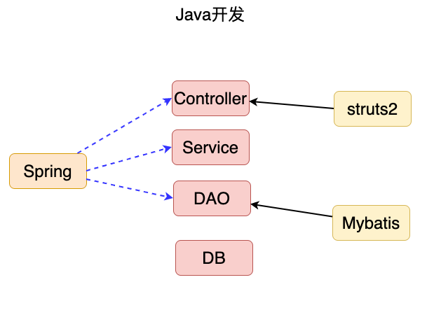

+ 整合设计模式


```markdown
1. 工厂
2. 代理
3. 模板
4. 策略
```


##### 3. 设计模式


```markdown
1. 广义概念
面向对象设计中，解决特定问题的经典代码
2. 狭义概念
GOF4人帮定义的23种设计模式：工厂、适配器、装饰器、门面、代理、模板...
```


##### 4. 工厂设计模式


###### 4.1 什么是工厂设计模式


```markdown
1. 概念：通过工厂类，创建对象
        User user = new User();
        UserDAO userDAO = new UserDAOImpl();
2. 好处：解耦合
   耦合：指定是代码间的强关联关系，一方的改变会影响到另一方
   问题：不利于代码维护
   简单：把接口的实现类，硬编码在程序中
        UserService userService = new UserServiceImpl();
```


###### 4.2 简单工厂的设计


```java
package com.baizhiedu.basic;

import java.io.IOException;
import java.io.InputStream;
import java.util.Properties;

public class BeanFactory {
    private static Properties env = new Properties();

    static{
        try {
            //第一步 获得IO输入流
            InputStream inputStream = BeanFactory.class.getResourceAsStream("/applicationContext.properties");
            //第二步 文件内容 封装 Properties集合中 key = userService value = com.baizhixx.UserServiceImpl
            env.load(inputStream);

            inputStream.close();
        } catch (IOException e) {
            e.printStackTrace();
        }

    }


    /*
        对象的创建方式：
           1. 直接调用构造方法 创建对象  UserService userService = new UserServiceImpl();
           2. 通过反射的形式 创建对象 解耦合
               Class clazz = Class.forName("com.baizhiedu.basic.UserServiceImpl");
               UserService userService = (UserService)clazz.newInstance();
     */
    public static UserService getUserService() {

        UserService userService = null;
        try {
                                         //com.baizhiedu.basic.UserServiceImpl
            Class clazz = Class.forName(env.getProperty("userService"));
            userService = (UserService) clazz.newInstance();
        } catch (ClassNotFoundException e) {
            e.printStackTrace();
        } catch (InstantiationException e) {
            e.printStackTrace();
        } catch (IllegalAccessException e) {
            e.printStackTrace();
        }

        return userService;

    }


    public static UserDAO getUserDAO(){

        UserDAO userDAO = null;
        try {
            Class clazz = Class.forName(env.getProperty("userDAO"));
            userDAO = (UserDAO) clazz.newInstance();
        } catch (ClassNotFoundException e) {
            e.printStackTrace();
        } catch (InstantiationException e) {
            e.printStackTrace();
        } catch (IllegalAccessException e) {
            e.printStackTrace();
        }

        return userDAO;

    }
}
```


###### 4.3 通用工厂的设计


+  问题   


```markdown
简单工厂会存在大量的代码冗余
```

+  通用工厂的代码  

```java
创建一切想要的对象
public class BeanFactory{
  
    public static Object getBean(String key){
         Object ret = null;
         try {
             Class clazz = Class.forName(env.getProperty(key));
             ret = clazz.newInstance();
         } catch (Exception e) {
            e.printStackTrace();
         }
         return ret;
     }

}
```

###### 4.4 通用工厂的使用方式
```markdown
1. 定义类型 (类)
2. 通过配置文件的配置告知工厂(applicationContext.properties)
   key = value
3. 通过工厂获得类的对象
   Object ret = BeanFactory.getBean("key")
```


##### 5.总结


```markdown
Spring本质：工厂 ApplicationContext (applicationContext.xml)
```


#### 第二章、第一个Spring程序


##### 1. 软件版本


```markdown
1. JDK1.8+
2. Maven3.5+
3. IDEA2018+
4. SpringFramework 5.1.4 
   官方网站 www.spring.io
```


##### 2. 环境搭建


+  Spring的jar包  

```markdown
#设置pom 依赖
<!-- https://mvnrepository.com/artifact/org.springframework/spring-context -->
<dependency>
  <groupId>org.springframework</groupId>
  <artifactId>spring-context</artifactId>
  <version>5.1.4.RELEASE</version>
</dependency>
```

+  Spring的配置文件   


```markdown
1. 配置文件的放置位置：任意位置 没有硬性要求
2. 配置文件的命名   ：没有硬性要求  建议：applicationContext.xml

思考：日后应用Spring框架时，需要进行配置文件路径的设置。
```


##### 3. Spring的核心API


+  ApplicationContext  

```markdown
作用：Spring提供的ApplicationContext这个工厂，用于对象的创建
好处：解耦合
```

    -  ApplicationContext接口类型   
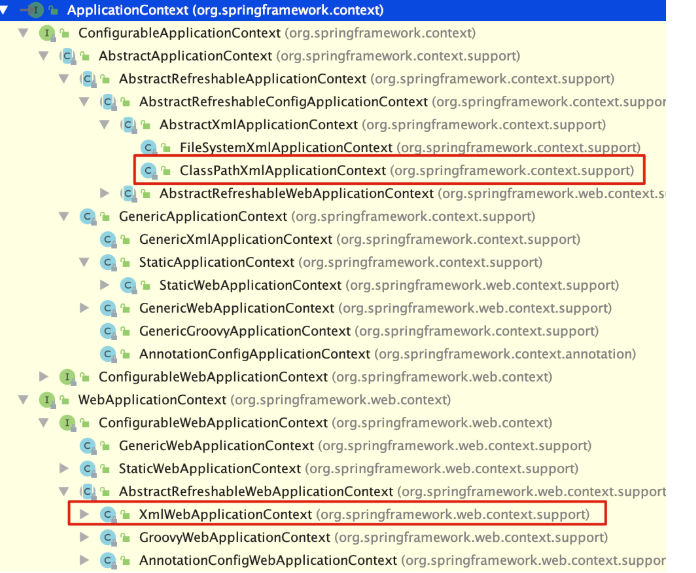

```markdown
接口：屏蔽实现的差异
非web环境 ： ClassPathXmlApplicationContext (main junit)
web环境  ：  XmlWebApplicationContext
```

    -  重量级资源 

```markdown
ApplicationContext工厂的对象占用大量内存。
不会频繁的创建对象 ： 一个应用只会创建一个工厂对象。
ApplicationContext工厂：一定是线程安全的(多线程并发访问)
```


##### 4. 程序开发


```markdown
1. 创建类型
2. 配置文件的配置 applicationContext.xml
   <bean id="person" class="com.baizhiedu.basic.Person"/>
3. 通过工厂类，获得对象
   ApplicationContext
          |- ClassPathXmlApplicationContext 
   ApplicationContext ctx = new ClassPathXmlApplicationContext("/applicationContext.xml");
   Person person = (Person)ctx.getBean("person");
```


##### 5. 细节分析


+  名词解释  

```markdown
Spring工厂创建的对象，叫做bean或者组件(componet)
```

+  Spring工厂的相关的方法  

```java
//通过这种方式获得对象，就不需要强制类型转换
Person person = ctx.getBean("person", Person.class);
System.out.println("person = " + person);
        

//当前Spring的配置文件中 只能有一个<bean class是Person类型
Person person = ctx.getBean(Person.class);
System.out.println("person = " + person);
        

//获取的是 Spring工厂配置文件中所有bean标签的id值  person person1
String[] beanDefinitionNames = ctx.getBeanDefinitionNames();
for (String beanDefinitionName : beanDefinitionNames) {
  System.out.println("beanDefinitionName = " + beanDefinitionName);
}
        

//根据类型获得Spring配置文件中对应的id值
String[] beanNamesForType = ctx.getBeanNamesForType(Person.class);
for (String id : beanNamesForType) {
  System.out.println("id = " + id);
}
        

//用于判断是否存在指定id值得bean
if (ctx.containsBeanDefinition("a")) {
  System.out.println("true = " + true);
}else{
  System.out.println("false = " + false);
}
      

//用于判断是否存在指定id值得bean
if (ctx.containsBean("person")) {
  System.out.println("true = " + true);
}else{
  System.out.println("false = " + false);
}
```

+  配置文件中需要注意的细节  

```markdown
1. 只配置class属性
<bean  class="com.baizhiedu.basic.Person"/>
a) 上述这种配置 有没有id值 com.baizhiedu.basic.Person#0
b) 应用场景： 如果这个bean只需要使用一次，那么就可以省略id值
            如果这个bean会使用多次，或者被其他bean引用则需要设置id值


2. name属性
作用：用于在Spring的配置文件中，为bean对象定义别名(小名)
相同：
   1. ctx.getBean("id|name")-->object
   2. <bean id="" class=""
      等效
      <bean name="" class=""
区别：
   1. 别名可以定义多个,但是id属性只能有一个值
   2. XML的id属性的值，命名要求：必须以字母开头，字母 数字 下划线 连字符 不能以特殊字符开头 /person
         name属性的值，命名没有要求 /person
      name属性会应用在特殊命名的场景下：/person (spring+struts1)
      
      XML发展到了今天：ID属性的限制，不存在 /person
   3. 代码
         //用于判断是否存在指定id值得bean,不能判断name值
        if (ctx.containsBeanDefinition("person")) {
            System.out.println("true = " + true);
        }else{
            System.out.println("false = " + false);
        }


        //用于判断是否存在指定id值得bean,也可以判断name值
        if (ctx.containsBean("p")) {
            System.out.println("true = " + true);
        }else{
            System.out.println("false = " + false);
        }
```


##### 6. Spring工厂的底层实现原理(简易版)


**Spring工厂是可以调用对象私有的构造方法创建对象**

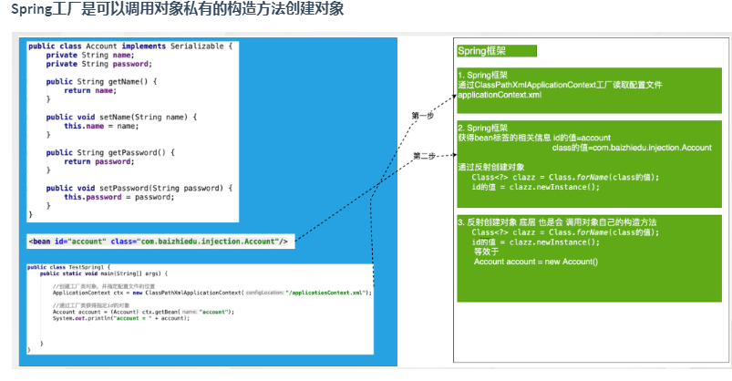

##### 7. 思考


```markdown
问题：未来在开发过程中，是不是所有的对象，都会交给Spring工厂来创建呢？
回答：理论上 是的，但是有特例 ：实体对象(entity)是不会交给Spring创建，它是由持久层框架进行创建。
```


#### 第三章、Spring5.x与日志框架的整合


```plain
Spring与日志框架进行整合，日志框架就可以在控制台中，输出Spring框架运行过程中的一些重要的信息。
好处：便于了解Spring框架的运行过程，利于程序的调试
```


+  Spring如何整合日志框架  

```markdown
默认
  Spring1.2.3早期都是于commons-logging.jar
  Spring5.x默认整合的日志框架 logback log4j2

Spring5.x整合log4j 
  1. 引入log4j jar包
  2. 引入log4.properties配置文件
```

    -  pom  

```xml
<dependency>
  <groupId>org.slf4j</groupId>
  <artifactId>slf4j-log4j12</artifactId>
  <version>1.7.25</version>
</dependency>

<dependency>
  <groupId>log4j</groupId>
  <artifactId>log4j</artifactId>
  <version>1.2.17</version>
</dependency>
```

    -  log4j.properties  

```markdown
# resources文件夹根目录下
### 配置根
log4j.rootLogger = debug,console

### 日志输出到控制台显示
log4j.appender.console=org.apache.log4j.ConsoleAppender
log4j.appender.console.Target=System.out
log4j.appender.console.layout=org.apache.log4j.PatternLayout
log4j.appender.console.layout.ConversionPattern=%d{yyyy-MM-dd HH:mm:ss} %-5p %c{1}:%L - %m%n
```


#### 第四章、注入(Injection)


##### 1. 什么是注入


```markdown
通过Spring工厂及配置文件，为所创建对象的成员变量赋值
```


###### 1.1 为什么需要注入


**通过编码的方式，为成员变量进行赋值，存在耦合**


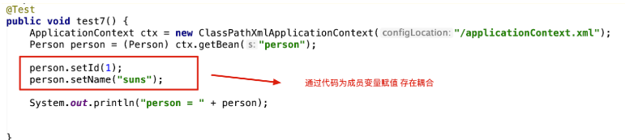


###### 1.2 如何进行注入[开发步骤]


+  类的成员变量提供set get方法 
+  配置spring的配置文件  

```xml
 <bean id="person" class="com.baizhiedu.basic.Person">
   <property name="id">
     <value>10</value>
   </property>
   <property name="name">
     <value>xiaojr</value>
   </property>
</bean>
```


###### 1.3 注入好处


```markdown
解耦合
```


##### 2. Spring注入的原理分析(简易版)


**Spring通过底层调用对象属性对应的set方法，完成成员变量的赋值，这种方式我们也称之为set注入**

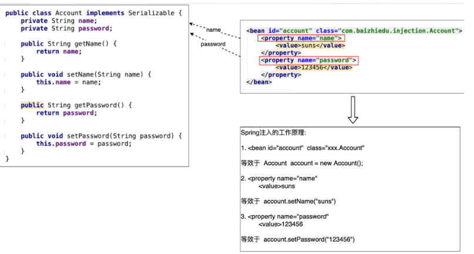


#### 第五章、Set注入详解


```markdown
针对于不同类型的成员变量，在<property>标签，需要嵌套其他标签

<property>
    xxxxx
</property>
```


##### 1. JDK内置类型


###### 1.1 String+8种基本类型


```markdown
<value>suns</value>
```


###### 1.2 数组


```markdown
<list>
  <value>suns@zparkhr.com.cn</value>
  <value>liucy@zparkhr.com.cn</value>
  <value>chenyn@zparkhr.com.cn</value>
</list>
```


###### 1.3 Set集合


```xml
<set>
   <value>11111</value>
   <value>112222</value>
</set>

<set>
   <ref bean
   <set 
</set>
```


###### 1.4 List集合


```xml
<list>
   <value>11111</value>
   <value>2222</value>
</list>

<list>
   <ref bean
   <set 
</list>
```


###### 1.5 Map集合


```xml
注意： map -- entry  -- key有特定的标签  <key></key>
                       值根据对应类型选择对应类型的标签
<map>
  <entry>
    <key><value>suns</value></key>
    <value>3434334343</value>
  </entry>
  <entry>
    <key><value>chenyn</value></key>
    <ref bean
  </entry>
</map>
```


###### 1.6 Properites


```markdown
Properties类型 特殊的Map key=String value=String
```


```xml
<props>
  <prop key="key1">value1</prop>
  <prop key="key2">value2</prop>
</props>
```


###### 1.7 复杂的JDK类型 (Date)


```markdown
需要程序员自定义类型转换器，处理。
```


##### 2. 用户自定义类型


###### 2.1 第一种方式


+  为成员变量提供set get方法 
+  配置文件中进行注入(赋值)  

```xml
<bean id="userService" class="xxxx.UserServiceImpl">
   <property name="userDAO">
       <bean class="xxx.UserDAOImpl"/>
  </property>
</bean>
```


###### 2.2 第二种方式


+  第一种赋值方式存在的问题  

```markdown
1. 配置文件代码冗余
2. 被注入的对象(UserDAO),多次创建，浪费（JVM)内存资源
```

+  为成员变量提供set get方法 
+  配置文件中进行配置       

```xml
<bean id="userDAO" class="xxx.UserDAOImpl"/>

<bean id="userService" class="xxx.UserServiceImpl">
   <property name="userDAO">
        <ref bean="userDAO"/>
  </property>
</bean>

#Spring4.x 废除了 <ref local=""/> 基本等效 <ref bean=""/>
```

##### 3. Set注入的简化写法
###### 3.1 基于属性简化
```xml
JDK类型注入 
<property name="name">
   <value>suns</value>
</property>

<property name="name" value="suns"/>
注意：value属性 只能简化 8种基本类型+String 注入标签

用户自定义类型
<property name="userDAO">
   <ref bean="userDAO"/>
</property>

<property name="userDAO" ref="userDAO"/>
```

###### 3.2 基于p命名空间简化
```xml
JDK类型注入 
<bean id="person" class="xxxx.Person">
  <property name="name">
     <value>suns</value>
  </property>
</bean>

<bean id="person" class="xxx.Person" p:name="suns"/>
注意：value属性 只能简化 8种基本类型+String 注入标签

用户自定义类型
<bean id="userService" class="xx.UserServiceImpl">
  <property name="userDAO"> 
    <ref bean="userDAO"/>
   </property>
</bean>

<bean id="userService" class="xxx.UserServiceImpl" p:userDAO-ref="userDAO"/>
```


#### 第六章、构造注入


```markdown
注入：通过Spring的配置文件，为成员变量赋值
Set注入：Spring调用Set方法 通过配置文件 为成员变量赋值
构造注入：Spring调用构造方法 通过配置文件 为成员变量赋值
```


##### 1. 开发步骤


+  提供有参构造方法  

```java
public class Customer implements Serializable {
    private String name;
    private int age;

    public Customer(String name, int age) {
        this.name = name;
        this.age = age;
    }
}
```

+  Spring的配置文件  

```xml
<bean id="customer" class="com.baizhiedu.basic.constructer.Customer">
  <constructor-arg>
    <value>suns</value>
  </constructor-arg>
  <constructor-arg>
    <value>102</value>
  </constructor-arg>
</bean>
```


##### 2. 构造方法重载


###### 2.1 参数个数不同时


```markdown
通过控制<constructor-arg>标签的数量进行区分
```


###### 2.1 构造参数个数相同时


```markdown
通过在标签引入 type属性 进行类型的区分 <constructor-arg type="">
```


##### 3. 注入的总结


```markdown
未来的实战中，应用set注入还是构造注入？
答案：set注入更多 
       1. 构造注入麻烦 (重载)
       2. Spring框架底层 大量应用了 set注入
```


#### 第七章、反转控制 与 依赖注入


##### 1. 反转(转移)控制(IOC Inverse of Control)


```markdown
控制：对于成员变量赋值的控制权
反转控制：把对于成员变量赋值的控制权，从代码中反转(转移)到Spring工厂和配置文件中完成
   好处：解耦合
底层实现：工厂设计模式
```


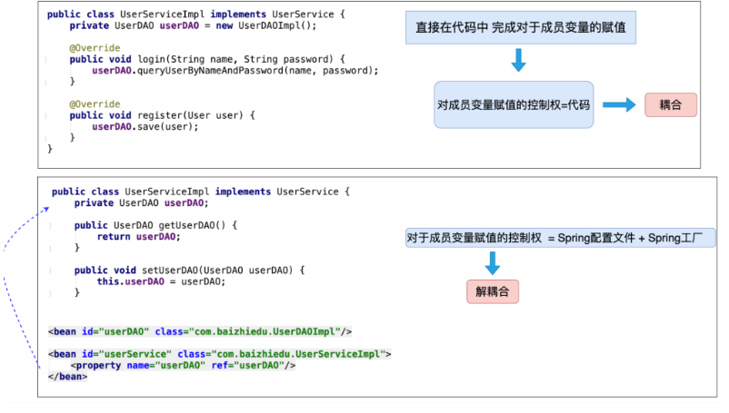


##### 2. 依赖注入 (Dependency Injection  DI)


```markdown
注入：通过Spring的工厂及配置文件，为对象（bean，组件）的成员变量赋值

依赖注入：当一个类需要另一个类时，就意味着依赖，一旦出现依赖，就可以把另一个类作为本类的成员变量，最终通过Spring配置文件进行注入(赋值)。
   好处：解耦合
```


#### 第八章、Spring工厂创建复杂对象


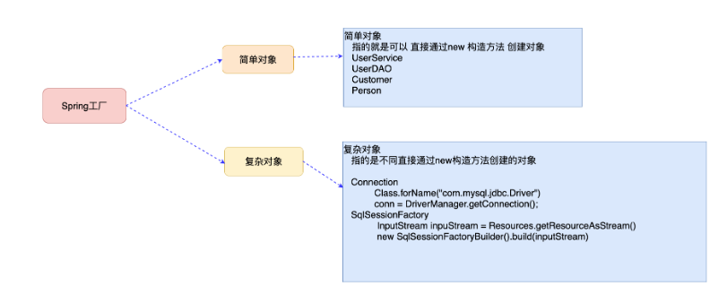


##### 1. 什么是复杂对象


```markdown
复杂对象：指的就是不能直接通过new构造方法创建的对象
  Connection
  SqlSessionFactory
```


##### 2. Spring工厂创建复杂对象的3种方式


###### 2.1 FactoryBean接口


+  开发步骤 
    -  实现FactoryBean接口  
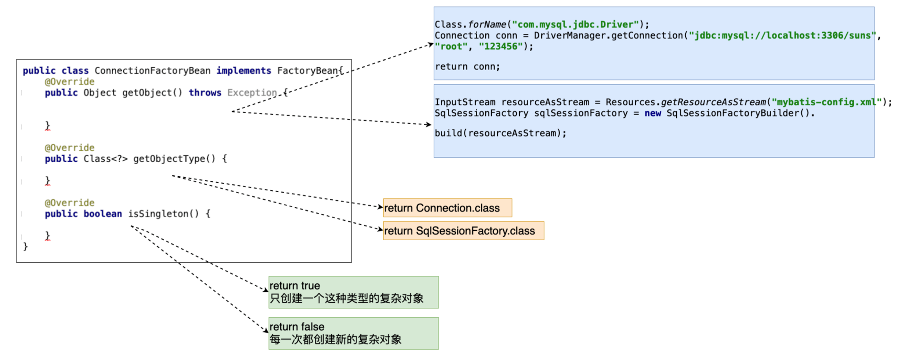
    -  Spring配置文件的配置  

```xml
# 如果Class中指定的类型 是FactoryBean接口的实现类，那么通过id值获得的是这个类所创建的复杂对象  Connection
<bean id="conn" class="com.baizhiedu.factorybean.ConnectionFactoryBean"/>
```

+  细节 
    -  如果就想获得FactoryBean类型的对象   ctx.getBean("&conn")  
获得就是ConnectionFactoryBean对象 
    -  isSingleton方法  
返回  true 只会创建一个复杂对象  
返回 false 每一次都会创建新的对象  
问题：根据这个对象的特点 ，决定是返回true (SqlSessionFactory) 还是 false  (Connection) 
    -  mysql高版本连接创建时，需要制定SSL证书，解决问题的方式  

```markdown
url = "jdbc:mysql://localhost:3306/suns?useSSL=false"
```

    -  依赖注入的体会(DI)  

```markdown
把ConnectionFactoryBean中依赖的4个字符串信息 ，进行配置文件的注入 
好处：解耦合
<bean id="conn" class="com.baizhiedu.factorybean.ConnectionFactoryBean">
  <property name="driverClassName" value="com.mysql.jdbc.Driver"/>
  <property name="url" value="jdbc:mysql://localhost:3306/suns?useSSL=false"/>
  <property name="username" value="root"/>
  <property name="password" value="123456"/>
</bean>
```

+  FactoryBean的实现原理[简易版]   


```xml
接口回调
1. 为什么Spring规定FactoryBean接口 实现 并且 getObject()?
2. ctx.getBean("conn") 获得是复杂对象 Connection 而没有 获得 ConnectionFactoryBean(&)

Spring内部运行流程
1. 通过conn获得 ConnectionFactoryBean类的对象 ，进而通过instanceof 判断出是FactoryBean接口的实现类
2. Spring按照规定 getObject() ---> Connection
3. 返回Connection
```

+  FactoryBean总结  

```markdown
Spring中用于创建复杂对象的一种方式，也是Spring原生提供的，后续讲解Spring整合其他框架，大量应用FactoryBean
```


###### 2.2 实例工厂


```markdown
1. 避免Spring框架的侵入 
2. 整合遗留系统
```


+ 开发步骤


```xml
 <bean id="connFactory" class="com.baizhiedu.factorybean.ConnectionFactory"></bean>

 <bean id="conn"  factory-bean="connFactory" factory-method="getConnection"/>
```


###### 2.3 静态工厂


+  开发步骤  

```xml
<bean id="conn" class="com.baizhiedu.factorybean.StaticConnectionFactory" factory-method="getConnection"/>
```


##### 3. Spring工厂创建对象的总结


#### 第九章、控制Spring工厂创建对象的次数


##### 1. 如何控制简单对象的创建次数


```xml
<bean id="account" scope="singleton|prototype" class="xxxx.Account"/>
sigleton:只会创建一次简单对象 默认值
prototype:每一次都会创建新的对象
```


##### 2. 如何控制复杂对象的创建次数


```markdown
FactoryBean{
   isSingleton(){
      return true  只会创建一次
      return false 每一次都会创建新的
   }

}
如没有isSingleton方法 还是通过scope属性 进行对象创建次数的控制
```


##### 3. 为什么要控制对象的创建次数？


```markdown
好处：节省不别要的内存浪费
```


+  什么样的对象只创建一次？  

```markdown
1. SqlSessionFactory
2. DAO
3. Service
```

+  什么样的对象 每一次都要创建新的？  

```markdown
1. Connection
2. SqlSession | Session
3. Struts2 Action
```


###  Spring系列— 工厂高级特性
---

#### 第十章、对象的生命周期


##### 1. 什么是对象的生命周期


```markdown
指的是一个对象创建、存活、消亡的一个完整过程
```


##### 2. 为什么要学习对象的生命周期


```markdown
由Spring负责对象的创建、存活、销毁，了解生命周期，有利于我们使用好Spring为我们创建的对象
```


##### 3. 生命周期的3个阶段


+  创建阶段  

```markdown
Spring工厂何时创建对象
```

    -  scope="singleton"  

```markdown
Spring工厂创建的同时，对象的创建

注意：设置scope=singleton 这种情况下 也需要在获取对象的同时，创建对象 
<bean lazy-init="true"/>
```

    -  scope="prototype"  

```markdown
Spring工厂会在获取对象的同时，创建对象
ctx.getBean("")
```

+  初始化阶段  

```markdown
Spring工厂在创建完对象后，调用对象的初始化方法，完成对应的初始化操作

1. 初始化方法提供：程序员根据需求，提供初始化方法，最终完成初始化操作
2. 初始化方法调用：Spring工厂进行调用
```

    -  InitializingBean接口  

```java
//程序员根据需求，实现的方法，完成初始化操作
public void afterProperitesSet(){
  
}
```

    -  对象中提供一个普通的方法  

```java
public void myInit(){
  
}

<bean id="product" class="xxx.Product" init-method="myInit"/>
```

    -  细节分析 
        1.  如果一个对象即实现InitializingBean 同时又提供的 普通的初始化方法  顺序  

```markdown
1. InitializingBean 
2. 普通初始化方法
```

        2.  注入一定发生在初始化操作的前面 
        3.  什么叫做初始化操作  

```markdown
资源的初始化：数据库 IO 网络 .....
```

+  销毁阶段  

```markdown
Spring销毁对象前，会调用对象的销毁方法，完成销毁操作

1. Spring什么时候销毁所创建的对象？
   ctx.close();
2. 销毁方法：程序员根据自己的需求，定义销毁方法，完成销毁操作
      调用：Spring工厂完成调用
```

    -  DisposableBean  

```java
public void destroy()throws Exception{
  
}
```

    -  定义一个普通的销毁方法  

```java
public void myDestroy()throws Exception{

}
<bean id="" class="" init-method="" destroy-method="myDestroy"/>
```

    -  细节分析 
        1.  销毁方法的操作只适用于 scope="singleton" 
        2.  什么叫做销毁操作  

```markdown
主要指的就是 资源的释放操作  io.close() connection.close();
```


#### 第十一章、配置文件参数化


```markdown
把Spring配置文件中需要经常修改的字符串信息，转移到一个更小的配置文件中

1. Spring的配置文件中存在需要经常修改的字符串？
   存在 以数据库连接相关的参数 代表
2. 经常变化字符串，在Spring的配置文件中，直接修改
   不利于项目维护(修改)
3. 转移到一个小的配置文件(.properties)
   利于维护(修改)
   
配置文件参数化：利于Spring配置文件的维护(修改)
```


##### 1. 配置文件参数的开发步骤


+  提供一个小的配置文件(.properities)  

```properties
名字：随便
放置位置：随便

jdbc.driverClassName = com.mysql.jdbc.Driver
jdbc.url = jdbc:mysql://localhost:3306/suns?useSSL=false
jdbc.username = root
jdbc.password = 123456
```

+  Spring的配置文件与小配置文件进行整合  

```xml
applicationContext.xml
<context:property-placeholder location="classpath:/db.properties"/>
```

+  在Spring配置文件中通过${key}获取小配置文件中对应的值  


#### 第十二章、自定义类型转换器


##### 1. 类型转换器


```markdown
作用：Spring通过类型转换器把配置文件中字符串类型的数据，转换成了对象中成员变量对应类型的数据，进而完成了注入
```


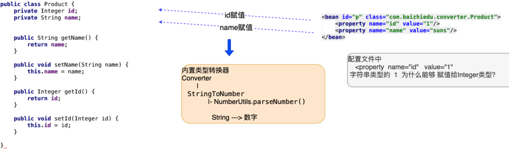


##### 2. 自定义类型转换器


```markdown
原因：当Spring内部没有提供特定类型转换器时，而程序员在应用的过程中还需要使用，那么就需要程序员自己定义类型转换器
```


+  类 implements Converter接口  

```java
public class MyDateConverter implements Converter<String, Date> {
   /*
       convert方法作用：String --->  Date
                      SimpleDateFormat sdf = new SimpleDateFormat();
                      sdf.parset(String) ---> Date
       param:source 代表的是配置文件中 日期字符串 <value>2020-10-11</value>

       return : 当把转换好的Date作为convert方法的返回值后，Spring自动的为birthday属性进行注入（赋值）

     */

  @Override
  public Date convert(String source) {

    Date date = null;
    try {
      SimpleDateFormat sdf = new SimpleDateFormat("yyyy-MM-dd");
      date = sdf.parse(source);
    } catch (ParseException e) {
      e.printStackTrace();
    }
    return date;
  }
}
```

+  在Spring的配置文件中进行配置 
    -  MyDateConverter对象创建出来  

```xml
<bean id="myDateConverter" class="xxxx.MyDateConverter"/>
```

    -  类型转换器的注册  

```xml
目的：告知Spring框架，我们所创建的MyDateConverter是一个类型转换器
<!--用于注册类型转换器-->
<bean id="conversionService" class="org.springframework.context.support.ConversionServiceFactoryBean">
  <property name="converters">
    <set>
      <ref bean="myDateConverter"/>
    </set>
  </property>
</bean>
```


##### 3. 细节


+  MyDateConverter中的日期的格式，通过依赖注入的方式，由配置文件完成赋值。   

```java

public class MyDateConverter implements Converter<String, Date> {
    private String pattern;

    public String getPattern() {
        return pattern;
    }

    public void setPattern(String pattern) {
        this.pattern = pattern;
    }

    /*
       convert方法作用：String --->  Date
                      SimpleDateFormat sdf = new SimpleDateFormat();
                      sdf.parset(String) ---> Date
       param:source 代表的是配置文件中 日期字符串 <value>2020-10-11</value>

       return : 当把转换好的Date作为convert方法的返回值后，Spring自动的为birthday属性进行注入（赋值）

     */

    @Override
    public Date convert(String source) {

        Date date = null;
        try {
            SimpleDateFormat sdf = new SimpleDateFormat(pattern);
            date = sdf.parse(source);
        } catch (ParseException e) {
            e.printStackTrace();
        }
        return date;
    }
}
```

```xml
<!--Spring创建MyDateConverter类型对象-->
<bean id="myDateConverter" class="com.baizhiedu.converter.MyDateConverter">
  <property name="pattern" value="yyyy-MM-dd"/>
</bean>
```

+  ConversionSeviceFactoryBean 定义 id属性 值必须 conversionService 
+  Spring框架内置日期类型的转换器  

```markdown
日期格式：2020/05/01 (不支持 ：2020-05-01)
```


#### 第十三章、后置处理Bean


```markdown
BeanPostProcessor作用：对Spring工厂所创建的对象，进行再加工。

AOP底层实现：

注意：BeanPostProcessor接口
          xxxx(){
             
          
          }
```


+ 后置处理Bean的运行原理分析  
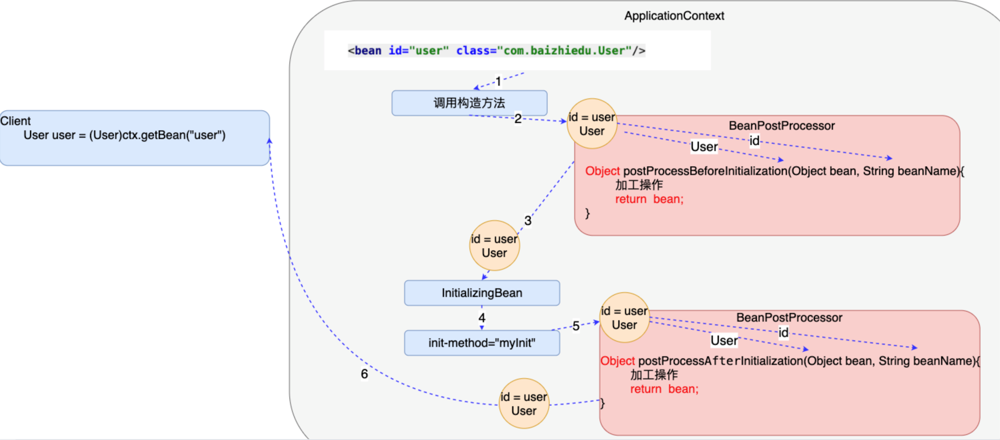


```markdown
程序员实现BeanPostProcessor规定接口中的方法：

Object postProcessBeforeInitiallization(Object bean String beanName)
作用：Spring创建完对象，并进行注入后，可以运行Before方法进行加工
获得Spring创建好的对象 ：通过方法的参数
最终通过返回值交给Spring框架 

Object postProcessAfterInitiallization(Object bean String beanName)
作用：Spring执行完对象的初始化操作后，可以运行After方法进行加工
获得Spring创建好的对象 ：通过方法的参数
最终通过返回值交给Spring框架 

实战中：
很少处理Spring的初始化操作：没有必要区分Before After。只需要实现其中的一个After方法即可
注意：
    postProcessBeforeInitiallization
    return bean对象
```


+  BeanPostProcessor的开发步骤 
    1.  类 实现 BeanPostProcessor接口  

```java
public class MyBeanPostProcessor implements BeanPostProcessor {

    @Override
    public Object postProcessBeforeInitialization(Object bean, String beanName) throws BeansException {
        return bean;
    }

    @Override
    public Object postProcessAfterInitialization(Object bean, String beanName) throws BeansException {

        Categroy categroy = (Categroy) bean;
        categroy.setName("xiaowb");


        return categroy;
    }
}
```

    2.  Spring的配置文件中进行配置  

```xml
<bean id="myBeanPostProcessor" class="xxx.MyBeanPostProcessor"/>
```

    3.  BeanPostProcessor细节  

```markdown
BeanPostProcessor会对Spring工厂中所有创建的对象进行加工。
```


###  Spring系列课程 — AOP编程
---

#### 第一章、静态代理设计模式


##### 1. 为什么需要代理设计模式


###### 1.1 问题


+  在JavaEE分层开发开发中，那个层次对于我们来讲最重要  

```markdown
DAO ---> Service --> Controller 

JavaEE分层开发中，最为重要的是Service层
```

+  Service层中包含了哪些代码？  

```markdown
Service层中 = 核心功能(几十行 上百代码) + 额外功能(附加功能)
1. 核心功能
   业务运算
   DAO调用
2. 额外功能 
   1. 不属于业务
   2. 可有可无
   3. 代码量很小 
   
   事务、日志、性能...
```

+  额外功能书写在Service层中好不好？  

```markdown
Service层的调用者的角度（Controller):需要在Service层书写额外功能。
                         软件设计者：Service层不需要额外功能
```

+  现实生活中的解决方式  
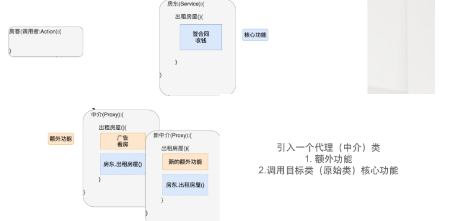


##### 2. 代理设计模式


###### 1.1 概念


```markdown
通过代理类，为原始类（目标）增加额外的功能
好处：利于原始类(目标)的维护
```


###### 1.2名词解释


```markdown
1. 目标类 原始类 
   指的是 业务类 (核心功能 --> 业务运算 DAO调用)
2. 目标方法，原始方法
   目标类(原始类)中的方法 就是目标方法(原始方法)
3. 额外功能 (附加功能)
   日志，事务，性能
```


###### 1.3 代理开发的核心要素


```markdown
代理类 = 目标类(原始类) + 额外功能 + 原始类(目标类)实现相同的接口

房东 ---> public interface UserService{
               m1
               m2
          }
          UserServiceImpl implements UserService{
               m1 ---> 业务运算 DAO调用
               m2 
          }
          UserServiceProxy implements UserService
               m1
               m2
```


###### 1.4 编码
**静态代理**：为每一个原始类，手工编写一个代理类 (.java .class)


###### 1.5 静态代理存在的问题


```markdown
1. 静态类文件数量过多，不利于项目管理
   UserServiceImpl  UserServiceProxy
   OrderServiceImpl OrderServiceProxy
2. 额外功能维护性差
   代理类中 额外功能修改复杂(麻烦)
```


#### 第二章、Spring的动态代理开发


##### 1. Spring动态代理的概念


```markdown
概念：通过代理类为原始类(目标类)增加额外功能
好处：利于原始类(目标类)的维护
```


##### 2. 搭建开发环境


```xml
<dependency>
  <groupId>org.springframework</groupId>
  <artifactId>spring-aop</artifactId>
  <version>5.1.14.RELEASE</version>
</dependency>

<dependency>
  <groupId>org.aspectj</groupId>
  <artifactId>aspectjrt</artifactId>
  <version>1.8.8</version>
</dependency>

<dependency>
  <groupId>org.aspectj</groupId>
  <artifactId>aspectjweaver</artifactId>
  <version>1.8.3</version>
</dependency>
```


##### 3. Spring动态代理的开发步骤


1.  创建原始对象(目标对象)   

```java
public class UserServiceImpl implements UserService {
    @Override
    public void register(User user) {
        System.out.println("UserServiceImpl.register 业务运算 + DAO ");
    }

    @Override
    public boolean login(String name, String password) {
        System.out.println("UserServiceImpl.login");
        return true;
    }
}
```

```xml
<bean id="userService" class="com.baizhiedu.proxy.UserServiceImpl"/>
```

2.  额外功能  
MethodBeforeAdvice接口    

```xml
额外的功能书写在接口的实现中，运行在原始方法执行之前运行额外功能。
```

```java
public class Before implements MethodBeforeAdvice {
    /*
      作用：需要把运行在原始方法执行之前运行的额外功能，书写在before方法中
     */
    @Override
    public void before(Method method, Object[] args, Object target) throws Throwable {
        System.out.println("-----method before advice log------");
    }
}
```

```xml
<bean id="before" class="com.baizhiedu.dynamic.Before"/>
```

3.  定义切入点   

```xml
切入点：额外功能加入的位置

目的：由程序员根据自己的需要，决定额外功能加入给那个原始方法
register
login

简单的测试：所有方法都做为切入点，都加入额外的功能。
```

```xml
<aop:config>
   <aop:pointcut id="pc" expression="execution(* *(..))"/>
</aop:config>
```

4.  组装 (2 3整合)  

```xml
表达的含义：所有的方法 都加入 before的额外功能
<aop:advisor advice-ref="before" pointcut-ref="pc"/>
```

5.  调用  

```java
目的：获得Spring工厂创建的动态代理对象，并进行调用
ApplicationContext ctx = new ClassPathXmlApplicationContext("/applicationContext.xml");
注意：
   1. Spring的工厂通过原始对象的id值获得的是代理对象
   2. 获得代理对象后，可以通过声明接口类型，进行对象的存储
   
UserService userService=(UserService)ctx.getBean("userService");

userService.login("")
userService.register()
```


##### 4. 动态代理细节分析


1.  Spring创建的动态代理类在哪里？   
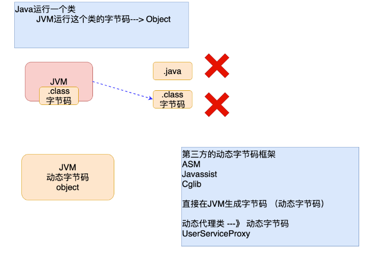

```markdown
Spring框架在运行时，通过动态字节码技术，在JVM创建的，运行在JVM内部，等程序结束后，会和JVM一起消失

什么叫动态字节码技术:通过第三个动态字节码框架，在JVM中创建对应类的字节码，进而创建对象，当虚拟机结束，动态字节码跟着消失。

结论：动态代理不需要定义类文件，都是JVM运行过程中动态创建的，所以不会造成静态代理，类文件数量过多，影响项目管理的问题。
```

    2.  动态代理编程简化代理的开发  

```markdown
在额外功能不改变的前提下，创建其他目标类（原始类）的代理对象时，只需要指定原始(目标)对象即可。
```

    3.  动态代理额外功能的维护性大大增强 


#### 第三章、Spring动态代理详解


##### 1. 额外功能的详解


+  MethodBeforeAdvice分析  

```java
1. MethodBeforeAdvice接口作用：额外功能运行在原始方法执行之前，进行额外功能操作。

public class Before1 implements MethodBeforeAdvice {
    /*
      作用：需要把运行在原始方法执行之前运行的额外功能，书写在before方法中

      Method: 额外功能所增加给的那个原始方法
              login方法

              register方法

              showOrder方法

      Object[]: 额外功能所增加给的那个原始方法的参数。String name,String password
                                               User

       Object: 额外功能所增加给的那个原始对象  UserServiceImpl
                                          OrderServiceImpl
     */
    @Override
    public void before(Method method, Object[] args, Object target) throws Throwable {
        System.out.println("-----new method before advice log------");
    }
}

2. before方法的3个参数在实战中，该如何使用。
   before方法的参数，在实战中，会根据需要进行使用，不一定都会用到，也有可能都不用。

   Servlet{
       service(HttpRequest request,HttpResponse response){
            request.getParameter("name") -->
            
            response.getWriter() ---> 
       
       }
   
   }
```

+  MethodInterceptor(方法拦截器)    
额外功能运行在原始方法执行之后   
额外功能运行在原始方法执行之前，之后     
额外功能运行在原始方法抛出异常的时候   
MethodInterceptor影响原始方法的返回值  

```markdown
methodinterceptor接口：额外功能可以根据需要运行在原始方法执行 前、后、前后。

环绕通知
```

```java
public class Arround implements MethodInterceptor {
    /*
         invoke方法的作用:额外功能书写在invoke
                        额外功能  原始方法之前
                                 原始方法之后
                                 原始方法执行之前 之后
         确定：原始方法怎么运行

         参数：MethodInvocation （Method):额外功能所增加给的那个原始方法
                    login
                    register
              invocation.proceed() ---> login运行
                                        register运行

          返回值：Object: 原始方法的返回值

         Date convert(String name)
     */


    @Override
    public Object invoke(MethodInvocation invocation) throws Throwable {
          System.out.println("-----额外功能 log----");
          Object ret = invocation.proceed();

          return ret;
    }
}
```

```java
@Override
public Object invoke(MethodInvocation invocation) throws Throwable {
  Object ret = invocation.proceed();
  System.out.println("-----额外功能运行在原始方法执行之后----");

  return ret;
}
```

```java
什么样的额外功能 运行在原始方法执行之前，之后都要添加？
事务

@Override
public Object invoke(MethodInvocation invocation) throws Throwable {
  System.out.println("-----额外功能运行在原始方法执行之前----");
  Object ret = invocation.proceed();
  System.out.println("-----额外功能运行在原始方法执行之后----");

  return ret;
}
```

```java
@Override
public Object invoke(MethodInvocation invocation) throws Throwable {

  Object ret = null;
  try {
    ret = invocation.proceed();
  } catch (Throwable throwable) {

    System.out.println("-----原始方法抛出异常 执行的额外功能 ---- ");
    throwable.printStackTrace();
  }


  return ret;
}
```

```markdown

```


原始方法的返回值，直接作为invoke方法的返回值返回，MethodInterceptor不会影响原始方法的返回值


MethodInterceptor影响原始方法的返回值  
Invoke方法的返回值，不要直接返回原始方法的运行结果即可。


[@Override ](/Override )   
public Object invoke(MethodInvocation invocation) throws Throwable {  
System.out.println("------log-----");  
Object ret = invocation.proceed();  
return false;  
}


```plain

##### 2. 切入点详解

~~~xml
切入点决定额外功能加入位置(方法)

<aop:pointcut id="pc" expression="execution(* *(..))"/>
exection(* *(..)) ---> 匹配了所有方法    a  b  c 

1. execution()  切入点函数
2. * *(..)      切入点表达式
```


###### 2.1 切入点表达式


1.  方法切入点表达式  
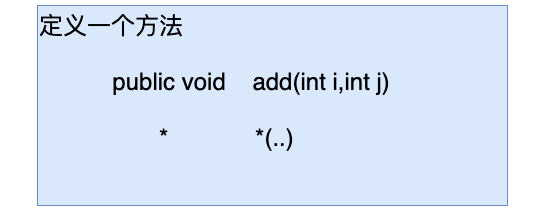

```markdown
*  *(..)  --> 所有方法

* ---> 修饰符 返回值
* ---> 方法名
()---> 参数表
..---> 对于参数没有要求 (参数有没有，参数有几个都行，参数是什么类型的都行)
```

    -  定义login方法作为切入点  

```markdown
* login(..)

# 定义register作为切入点
* register(..)
```

    -  定义login方法且login方法有两个字符串类型的参数 作为切入点  

```markdown
* login(String,String)

#注意：非java.lang包中的类型，必须要写全限定名
* register(com.baizhiedu.proxy.User)

# ..可以和具体的参数类型连用
* login(String,..)  --> login(String),login(String,String),login(String,com.baizhiedu.proxy.User)
```

    -  精准方法切入点限定  

```markdown
修饰符 返回值         包.类.方法(参数)

    *               com.baizhiedu.proxy.UserServiceImpl.login(..)
    *               com.baizhiedu.proxy.UserServiceImpl.login(String,String)
```

2.  类切入点  

```markdown
指定特定类作为切入点(额外功能加入的位置)，自然这个类中的所有方法，都会加上对应的额外功能
```

    -  语法1  

```markdown
#类中的所有方法加入了额外功能 
* com.baizhiedu.proxy.UserServiceImpl.*(..)
```

    -  语法2  

```markdown
#忽略包
1. 类只存在一级包  com.UserServiceImpl
* *.UserServiceImpl.*(..)

2. 类存在多级包    com.baizhiedu.proxy.UserServiceImpl
* *..UserServiceImpl.*(..)
```

3.  包切入点表达式 实战  

```markdown
指定包作为额外功能加入的位置，自然包中的所有类及其方法都会加入额外的功能
```

    -  语法1  

```markdown
#切入点包中的所有类，必须在proxy中，不能在proxy包的子包中
* com.baizhiedu.proxy.*.*(..)
```

    -  语法2  

```markdown
#切入点当前包及其子包都生效 
* com.baizhiedu.proxy..*.*(..)
```


###### 2.2 切入点函数


```markdown
切入点函数：用于执行切入点表达式
```


1.  execution  

```markdown
最为重要的切入点函数，功能最全。
执行 方法切入点表达式 类切入点表达式 包切入点表达式 

弊端：execution执行切入点表达式 ，书写麻烦
     execution(* com.baizhiedu.proxy..*.*(..))
     
注意：其他的切入点函数 简化是execution书写复杂度，功能上完全一致
```

2.  args  

```markdown
作用：主要用于函数(方法) 参数的匹配

切入点：方法参数必须得是2个字符串类型的参数

execution(* *(String,String))

args(String,String)
```

3.  within  

```markdown
作用：主要用于进行类、包切入点表达式的匹配

切入点：UserServiceImpl这个类

execution(* *..UserServiceImpl.*(..))

within(*..UserServiceImpl)

execution(* com.baizhiedu.proxy..*.*(..))

within(com.baizhiedu.proxy..*)
```


4.[@annotation ](/annotation ) 


```xml
作用：为具有特殊注解的方法加入额外功能

<aop:pointcut id="" expression="@annotation(com.baizhiedu.Log)"/>
```


5.  切入点函数的逻辑运算  

```markdown
指的是 整合多个切入点函数一起配合工作，进而完成更为复杂的需求
```

    -  and与操作  

```markdown
案例：login 同时 参数 2个字符串 

1. execution(* login(String,String))

2. execution(* login(..)) and args(String,String)

注意：与操作不同用于同种类型的切入点函数 

案例：register方法 和 login方法作为切入点 

execution(* login(..)) or  execution(* register(..))
```

    -  or或操作  

```markdown
案例：register方法 和 login方法作为切入点 

execution(* login(..)) or  execution(* register(..))
```


#### 第四章、AOP编程


##### 1. AOP概念


```markdown
AOP (Aspect Oriented Programing)   面向切面编程 = Spring动态代理开发
以切面为基本单位的程序开发，通过切面间的彼此协同，相互调用，完成程序的构建
切面 = 切入点 + 额外功能

OOP (Object Oritened Programing)   面向对象编程 Java
以对象为基本单位的程序开发，通过对象间的彼此协同，相互调用，完成程序的构建

POP (Producer Oriented Programing) 面向过程(方法、函数)编程 C 
以过程为基本单位的程序开发，通过过程间的彼此协同，相互调用，完成程序的构建
```


```markdown
AOP的概念：
     本质就是Spring得动态代理开发，通过代理类为原始类增加额外功能。
     好处：利于原始类的维护

注意：AOP编程不可能取代OOP，OOP编程有意补充。
```


##### 2. AOP编程的开发步骤


```markdown
1. 原始对象
2. 额外功能 (MethodInterceptor)
3. 切入点
4. 组装切面 (额外功能+切入点)
```


##### 3. 切面的名词解释


```markdown
切面 = 切入点 + 额外功能 

几何学
   面 = 点 + 相同的性质
```


#### 第五章、AOP的底层实现原理


##### 1. 核心问题


```markdown
1. AOP如何创建动态代理类(动态字节码技术)
2. Spring工厂如何加工创建代理对象
   通过原始对象的id值，获得的是代理对象
```


##### 2. 动态代理类的创建


###### 2.1 JDK的动态代理


+ Proxy.newProxyInstance方法参数详解  
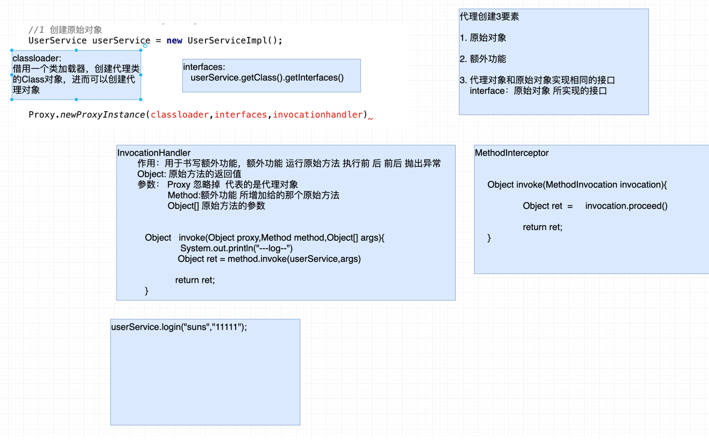


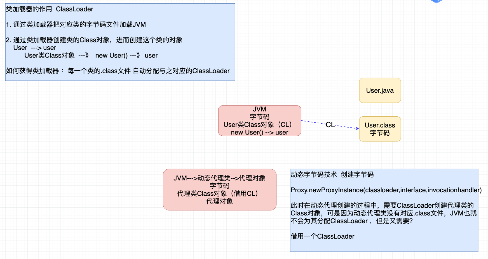


+  编码  

```java
public class TestJDKProxy {

    /*
        1. 借用类加载器  TestJDKProxy
                       UserServiceImpl
        2. JDK8.x前

            final UserService userService = new UserServiceImpl();
     */
    public static void main(String[] args) {
        //1 创建原始对象
        UserService userService = new UserServiceImpl();

        //2 JDK创建动态代理
        /*

         */

        InvocationHandler handler = new InvocationHandler(){
            @Override
            public Object invoke(Object proxy, Method method, Object[] args) throws Throwable {
                System.out.println("------proxy  log --------");
                //原始方法运行
                Object ret = method.invoke(userService, args);
                return ret;
            }
        };

        UserService userServiceProxy = (UserService)Proxy.newProxyInstance(UserServiceImpl.class.getClassLoader(),userService.getClass().getInterfaces(),handler);

        userServiceProxy.login("suns", "123456");
        userServiceProxy.register(new User());
    }
}
```


###### 2.2 CGlib的动态代理


```markdown
CGlib创建动态代理的原理：父子继承关系创建代理对象，原始类作为父类，代理类作为子类，这样既可以保证2者方法一致，同时在代理类中提供新的实现(额外功能+原始方法)
```


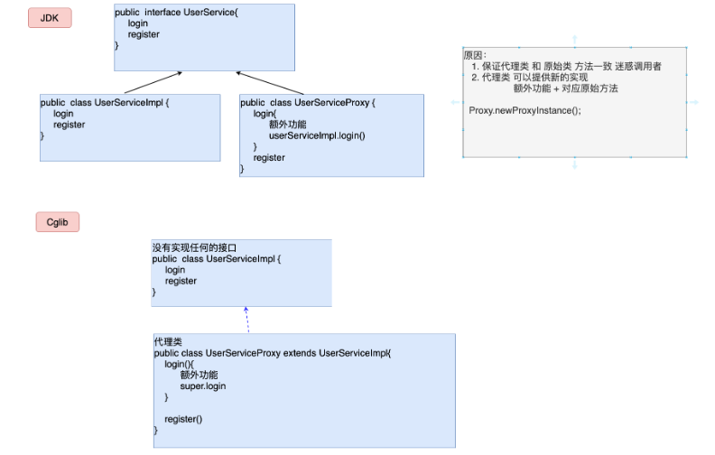


+  CGlib编码  

```java
package com.baizhiedu.cglib;

import com.baizhiedu.proxy.User;
import org.springframework.cglib.proxy.Enhancer;
import org.springframework.cglib.proxy.MethodInterceptor;
import org.springframework.cglib.proxy.MethodProxy;

import java.lang.reflect.Method;

public class TestCglib {
    public static void main(String[] args) {
        //1 创建原始对象
        UserService userService = new UserService();

        /*
          2 通过cglib方式创建动态代理对象
            Proxy.newProxyInstance(classloader,interface,invocationhandler)

            Enhancer.setClassLoader()
            Enhancer.setSuperClass()
            Enhancer.setCallback();  ---> MethodInterceptor(cglib)
            Enhancer.create() ---> 代理
         */

        Enhancer enhancer = new Enhancer();

        enhancer.setClassLoader(TestCglib.class.getClassLoader());
        enhancer.setSuperclass(userService.getClass());


        MethodInterceptor interceptor = new MethodInterceptor() {
            //等同于 InvocationHandler --- invoke
            @Override
            public Object intercept(Object o, Method method, Object[] args, MethodProxy methodProxy) throws Throwable {
                System.out.println("---cglib log----");
                Object ret = method.invoke(userService, args);

                return ret;
            }
        };

        enhancer.setCallback(interceptor);

        UserService userServiceProxy = (UserService) enhancer.create();

        userServiceProxy.login("suns", "123345");
        userServiceProxy.register(new User());
    }
}
```

+  总结  

```markdown
1. JDK动态代理   Proxy.newProxyInstance()  通过接口创建代理的实现类 
2. Cglib动态代理 Enhancer                  通过继承父类创建的代理类
```


##### 3. Spring工厂如何加工原始对象


+  思路分析  
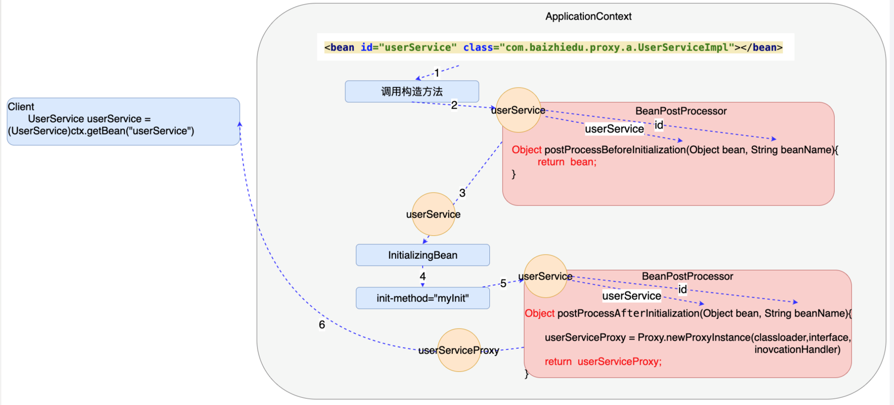
+  编码   

```java
public class ProxyBeanPostProcessor implements BeanPostProcessor {
    @Override
    public Object postProcessBeforeInitialization(Object bean, String beanName) throws BeansException {
        return bean;
    }

    @Override
    /*
         Proxy.newProxyInstance();
     */
    public Object postProcessAfterInitialization(Object bean, String beanName) throws BeansException {

        InvocationHandler handler = new InvocationHandler() {
            @Override
            public Object invoke(Object proxy, Method method, Object[] args) throws Throwable {
                System.out.println("----- new Log-----");
                Object ret = method.invoke(bean, args);

                return ret;
            }
        };
      return Proxy.newProxyInstance(ProxyBeanPostProcessor.class.getClassLoader(),bean.getClass().getInterfaces(),handler);
    }
}
```

```xml
<bean id="userService" class="com.baizhiedu.factory.UserServiceImpl"/>


<!--1. 实现BeanPostProcessor 进行加工
        2. 配置文件中对BeanPostProcessor进行配置
    -->

<bean id="proxyBeanPostProcessor" class="com.baizhiedu.factory.ProxyBeanPostProcessor"/>
```


#### 第六章、基于注解的AOP编程


##### 1. 基于注解的AOP编程的开发步骤


1.  原始对象 
2.  额外功能 
3.  切入点 
4.  组装切面   

```java
# 通过切面类 定义了 额外功能 @Around
           定义了 切入点   @Around("execution(* login(..))")
           @Aspect 切面类 
           
package com.baizhiedu.aspect;

import org.aspectj.lang.ProceedingJoinPoint;
import org.aspectj.lang.annotation.Around;
import org.aspectj.lang.annotation.Aspect;


/*
       1. 额外功能
                 public class MyArround implements MethodInterceptor{

                      public Object invoke(MethodInvocation invocation){

                              Object ret = invocation.proceed();

                              return ret;

                      }

                 }

       2. 切入点
             <aop:config
                 <aop:pointcut id=""  expression="execution(* login(..))"/>
 */
@Aspect
public class MyAspect {

    @Around("execution(* login(..))")
    public Object arround(ProceedingJoinPoint joinPoint) throws Throwable {

        System.out.println("----aspect log ------");

        Object ret = joinPoint.proceed();


        return ret;
    }
}
```

```xml
 <bean id="userService" class="com.baizhiedu.aspect.UserServiceImpl"/>

    <!--
       切面
         1. 额外功能
         2. 切入点
         3. 组装切面


    -->
<bean id="arround" class="com.baizhiedu.aspect.MyAspect"/>

<!--告知Spring基于注解进行AOP编程-->
<aop:aspectj-autoproxy />
```


##### 2. 细节


1.  切入点复用  

```java
切入点复用：在切面类中定义一个函数 上面@Pointcut注解 通过这种方式，定义切入点表达式，后续更加有利于切入点复用。

@Aspect
public class MyAspect {
    @Pointcut("execution(* login(..))")
    public void myPointcut(){}

    @Around(value="myPointcut()")
    public Object arround(ProceedingJoinPoint joinPoint) throws Throwable {

        System.out.println("----aspect log ------");

        Object ret = joinPoint.proceed();


        return ret;
    }


    @Around(value="myPointcut()")
    public Object arround1(ProceedingJoinPoint joinPoint) throws Throwable {

        System.out.println("----aspect tx ------");

        Object ret = joinPoint.proceed();


        return ret;
    }

}
```

2.  动态代理的创建方式 


```markdown
AOP底层实现  2种代理创建方式
1.  JDK  通过实现接口 做新的实现类方式 创建代理对象
2.  Cglib通过继承父类 做新的子类      创建代理对象

默认情况 AOP编程 底层应用JDK动态代理创建方式 
如果切换Cglib
     1. 基于注解AOP开发
        <aop:aspectj-autoproxy proxy-target-class="true" />
     2. 传统的AOP开发
        <aop:config proxy-target-class="true">
        </aop>
```


#### 第七章、AOP开发中的一个坑


```java
坑：在同一个业务类中，进行业务方法间的相互调用，只有最外层的方法,才是加入了额外功能(内部的方法，通过普通的方式调用，都调用的是原始方法)。如果想让内层的方法也调用代理对象的方法，就要AppicationContextAware获得工厂，进而获得代理对象。
public class UserServiceImpl implements UserService, ApplicationContextAware {
    private ApplicationContext ctx;


    @Override
    public void setApplicationContext(ApplicationContext applicationContext) throws BeansException {
              this.ctx = applicationContext;
    }

    @Log
    @Override
    public void register(User user) {
        System.out.println("UserServiceImpl.register 业务运算 + DAO ");
        //throw new RuntimeException("测试异常");

        //调用的是原始对象的login方法 ---> 核心功能
        /*
            设计目的：代理对象的login方法 --->  额外功能+核心功能
            ApplicationContext ctx = new ClassPathXmlApplicationContext("/applicationContext2.xml");
            UserService userService = (UserService) ctx.getBean("userService");
            userService.login();

            Spring工厂重量级资源 一个应用中 应该只创建一个工厂
         */

        UserService userService = (UserService) ctx.getBean("userService");
        userService.login("suns", "123456");
    }

    @Override
    public boolean login(String name, String password) {
        System.out.println("UserServiceImpl.login");
        return true;
    }
}
```


#### 第八章、AOP阶段知识总结	


### Spring系列--- 注解编程
---

#### 第一章、注解基础概念


##### 1. 什么是注解编程


```java
指的是在类或者方法上加入特定的注解（@XXX),完成特定功能的开发。
  
	@Component
public class XXX{}
```


##### 2. 为什么要讲解注解编程


```markdown
1. 注解开发方便
     代码简洁 开发速度大大提高
2. Spring开发潮流
     Spring2.x引入注解  Spring3.x完善注解 SpringBoot普及 推广注解编程
```


##### 3. 注解的作用


+  替换XML这种配置形式，简化配置  

+  替换接口，实现调用双方的契约性   


```markdown
通过注解的方式，在功能调用者和功能提供者之间达成约定，进而进行功能的调用。因为注解应用更为方便灵活，所以在现在的开发中，更推荐通过注解的形式，完成
```


##### 4. Spring注解的发展历程


```markdown
1. Spring2.x开始支持注解编程 @Component @Service @Scope..
     目的：提供的这些注解只是为了在某些情况下简化XML的配置,作为XML开发的有益补充。
2. Spring3.x @Configuration @Bean..
     目的：彻底替换XML，基于纯注解编程
3. Spring4.x SpringBoot 
     提倡使用注解常见开发
```


##### 5. Spring注解开发的一个问题


```markdown
Spring基于注解进行配置后，还能否解耦合呢？

在Spring框架应用注解时，如果对注解配置的内容不满意，可以通过Spring配置文件进行覆盖的。
```


#### 第二章、Spring的基础注解（Spring2.x）


```xml
这个阶段的注解，仅仅是简化XML的配置，并不能完全替代XML
```


##### 1. 对象创建相关注解


+  搭建开发环境  

```xml
<context:component-scan base-package="com.baizhiedu"/>

作用：让Spring框架在设置包及其子包中扫描对应的注解，使其生效。
```

+  对象创建相关注解 
    -  [@Component ](/Component )    


```markdown
作用：替换原有spring配置文件中的<bean标签 
注意：
    id属性 component注解 提供了默认的设置方式  首单词首字母小写
    class属性 通过反射获得class内容
```

    -  [@Component ](/Component ) 细节  
        *  如何显示指定工厂创建对象的id值  

```java
@Component("u")
```

        *  Spring配置文件覆盖注解配置内容  

```xml
applicationContext.xml

<bean id="u" class="com.baizhiedu.bean.User"/>

id值 class的值 要和 注解中的设置保持一值
```

    -  @Component的衍生注解  

```markdown
@Repository  --->  XXXDAO
  @Repository
  public class UserDAO{
  
  }
@Service
  @Service
  public class UserService{
  
  }
@Controller 
  @Controller 
  public class RegAction{
  
  }
注意：本质上这些衍生注解就是@Component 
     作用 <bean  
     细节 @Service("s")

目的：更加准确的表达一个类型的作用

注意：Spring整合Mybatis开发过程中 不使用@Repository @Component
```

+  @Scope注解  

```markdown
作用：控制简单对象创建次数
注意：不添加@Scope Spring提供默认值 singleton
<bean id="" class="" scope="singleton|prototype"/>
```

+  @Lazy注解  

```markdown
作用：延迟创建单实例对象
注意：一旦使用了@Lazy注解后，Spring会在使用这个对象时候，进行这个对象的创建
<bean id="" class="" lazy="false"/>
```

+  生命周期方法相关注解  

```markdown
1. 初始化相关方法 @PostConstruct
   InitializingBean
   <bean init-method=""/>
2. 销毁方法 @PreDestroy
   DisposableBean
   <bean destory-method=""/>
注意：1. 上述的2个注解并不是Spring提供的，JSR(JavaEE规范)520
     2. 再一次的验证，通过注解实现了接口的契约性
```


##### 2. 注入相关注解


+  用户自定义类型 [@Autowired ](/Autowired )   


```markdown
@Autowired细节
1. Autowired注解基于类型进行注入 [推荐]
   基于类型的注入：注入对象的类型，必须与目标成员变量类型相同或者是其子类（实现类）

2. Autowired Qualifier 基于名字进行注入 [了解]
   基于名字的注入：注入对象的id值，必须与Qualifier注解中设置的名字相同

3. Autowired注解放置位置 
    a) 放置在对应成员变量的set方法上 
    b) 直接把这个注解放置在成员变量之上，Spring通过反射直接对成员变量进行注入（赋值）[推荐]

4. JavaEE规范中类似功能的注解
    JSR250 @Resouce(name="userDAOImpl") 基于名字进行注入
           @Autowired()
           @Qualifier("userDAOImpl")
           注意：如果在应用Resource注解时，名字没有配对成功，那么他会继续按照类型进行注入。
    JSR330 @Inject 作用 @Autowired完全一致 基于类型进行注入 ---》 EJB3.0
          <dependency>
            <groupId>javax.inject</groupId>
            <artifactId>javax.inject</artifactId>
            <version>1</version>
          </dependency>
```

+  JDK类型  

```markdown
@Value注解完成
1. 设置xxx.properties 
   id = 10
   name = suns
2. Spring的工厂读取这个配置文件 
   <context:property-placeholder location=""/>
3. 代码 
   属性 @Value("${key}")
```

    -  [@PropertySource ](/PropertySource )   

```markdown
1. 作用：用于替换Spring配置文件中的<context:property-placeholder location=""/>标签
2. 开发步骤 
    1. 设置xxx.properties 
       id = 10
       name = suns
    2. 应用@PropertySource
    3. 代码
       属性 @Value()
```

    -  @Value注解使用细节 
        *  @Value注解不能应用在静态成员变量上  

```markdown
如果应用，赋值（注入）失败
```

        *  @Value注解+Properties这种方式，不能注入集合类型  

```markdown
Spring提供新的配置形式 YAML YML (SpringBoot)
```


##### 3. 注解扫描详解


```markdown
<context:component-scan base-package="com.baizhiedu"/>
当前包 及其 子包
```


###### 1. 排除方式


```markdown
<context:component-scan base-package="com.baizhiedu">
   <context:exclude-filter type="" expression=""/>
   type:assignable:排除特定的类型 不进行扫描
        annotation:排除特定的注解 不进行扫描
        aspectj:切入点表达式
                包切入点： com.baizhiedu.bean..*
                类切入点： *..User
        regex:正则表达式 
        custom：自定义排除策略框架底层开发
</context:component-scan>

排除策略可以叠加使用 
<context:component-scan base-package="com.baizhiedu">
  <context:exclude-filter type="assignable" expression="com.baizhiedu.bean.User"/>

  <context:exclude-filter type="aspectj" expression="com.baizhiedu.injection..*"/>
</context:component-scan>
```


###### 2. 包含方式


```xml
<context:component-scan base-package="com.baizhiedu" use-default-filters="false">
   <context:include-filter type="" expression=""/>
</context:component-scan>

1. use-default-filters="false"
   作用：让Spring默认的注解扫描方式 失效。
2. <context:include-filter type="" expression=""/>
   作用：指定扫描那些注解 
   type:assignable:排除特定的类型 不进行扫描
        annotation:排除特定的注解 不进行扫描
        aspectj:切入点表达式
                包切入点： com.baizhiedu.bean..*
                类切入点： *..User
        regex:正则表达式 
        custom：自定义排除策略框架底层开发

包含的方式支持叠加
 <context:component-scan base-package="com.baizhiedu" use-default-filters="false">
        <context:include-filter type="annotation" expression="org.springframework.stereotype.Repository"/>
        <context:include-filter type="annotation" expression="org.springframework.stereotype.Service"/>
 </context:component-scan>
```


##### 4. 对于注解开发的思考


+  配置互通  

```markdown
Spring注解配置 配置文件的配置 互通

@Repository
public class UserDAOImpl{


}

public class UserServiceImpl{
   private UserDAO userDAO;
   set get
}

<bean id="userService" class="com.baizhiedu.UserServiceImpl">
   <property name="userDAO" ref="userDAOImpl"/>
</bean>
```

+  什么情况下使用注解 什么情况下使用配置文件  

```markdown
@Component 替换 <bean 

基础注解（@Component @Autowired @Value) 程序员开发类型的配置

1. 在程序员开发的类型上 可以加入对应注解 进行对象的创建 
   User  UserService  UserDAO  UserAction 

2. 应用其他非程序员开发的类型时，还是需要使用<bean 进行配置的
   SqlSessionFactoryBean  MapperScannerConfigure
```


##### 5.  SSM整合开发（半注解开发）


+  搭建开发环境 
    - 引入相关jar 【SSM POM】
    - 引入相关配置文件 
        * applicationContext.xml
        * struts.xml
        * log4.properties
        * XXXMapper.xml
    - 初始化配置 
        * Web.xml Spring  (ContextLoaderListener)
        * Web.xml Struts Filter
+  编码  

```markdown
<context:component-scan base-package=""/>
```

    -  DAO (Spring+Mybatis)  

```markdown
1. 配置文件的配置
   1. DataSource
   2. SqlSessionFactory ----> SqlSessionFactoryBean
      1. dataSource
      2. typeAliasesPackage
      3. mapperLocations 
   3. MapperScannerConfigur ---> DAO接口实现类
2. 编码
   1. entity 
   2. table
   3. DAO接口
   4. 实现Mapper文件
```

    -  Service  

```markdown
1. 原始对象 ---》 注入DAO
   @Service ---> @Autowired

2. 额外功能 ---》 DataSourceTransactionManager ---> dataSource
3. 切入点 + 事务属性
   @Transactional(propagation,readOnly...)
4. 组装切面
   <tx:annotation-driven
```

    -  Controller (Spring+Struts2)  

```markdown
1. @Controller
   @Scope("prototype")
   public class RegAction implements Action{
      @Autowired
      private UserService userServiceImpl;
   
   }
2. struts.xml
    <action class="spring配置文件中action对应的id值"/>
```


#### 第三章、Spring的高级注解（Spring3.x 及以上)


##### 1. 配置Bean


```java
Spring在3.x提供的新的注解，用于替换XML配置文件。
  
  @Configuration
public class AppConfig{
  
}
```


1.  配置Bean在应用的过程中 替换了XML具体什么内容呢？  

2.  AnnotationConfigApplicationContext  

```markdown
1. 创建工厂代码
   ApplicationContext ctx = new AnnotationConfigApplicationContext();
2. 指定配置文件 
   1. 指定配置bean的Class
       ApplicationContext ctx = new AnnotationConfigApplicationContext(AppConfig.class);
   2. 指定配置bean所在的路径 
       ApplicationContext ctx = new AnnotationConfigApplicationContext("com.baizhiedu");
```


+  配置Bean开发的细节分析 
    -  基于注解开发使用日志  

```markdown
不能集成Log4j
集成logback
```

        *  引入相关jar  

```xml
 <dependency>
      <groupId>org.slf4j</groupId>
      <artifactId>slf4j-api</artifactId>
      <version>1.7.25</version>
    </dependency>

    <dependency>
      <groupId>org.slf4j</groupId>
      <artifactId>jcl-over-slf4j</artifactId>
      <version>1.7.25</version>
    </dependency>

    <dependency>
      <groupId>ch.qos.logback</groupId>
      <artifactId>logback-classic</artifactId>
      <version>1.2.3</version>
    </dependency>

    <dependency>
      <groupId>ch.qos.logback</groupId>
      <artifactId>logback-core</artifactId>
      <version>1.2.3</version>
    </dependency>

    <dependency>
      <groupId>org.logback-extensions</groupId>
      <artifactId>logback-ext-spring</artifactId>
      <version>0.1.4</version>
    </dependency>
```

        *  引入logback配置文件 (logback.xml)  

```xml
<?xml version="1.0" encoding="UTF-8"?>
<configuration>
    <!-- 控制台输出 -->
    <appender name="STDOUT" class="ch.qos.logback.core.ConsoleAppender">
        <encoder>
            <!--格式化输出：%d表示日期，%thread表示线程名，%-5level：级别从左显示5个字符宽度%msg：日志消息，%n是换行符-->
            <pattern>%d{yyyy-MM-dd HH:mm:ss.SSS} [%thread] %-5level %logger{50} - %msg%n</pattern>
        </encoder>
    </appender>

    <root level="DEBUG">
        <appender-ref ref="STDOUT" />
    </root>

</configuration>
```

    -  @Configuration注解的本质  

```markdown
本质：也是@Component注解的衍生注解

可以应用<context:component-scan进行扫描
```


##### 2. @Bean注解


```markdown
@Bean注解在配置bean中进行使用，等同于XML配置文件中的<bean标签
```


###### 1. @Bean注解的基本使用


+  对象的创建  


```markdown
1. 简单对象
   直接能够通过new方式创建的对象 
   User  UserService   UserDAO 
2. 复杂对象
   不能通过new的方式直接创建的对象
   Connection SqlSessionFactory
```

    -  @Bean注解创建复杂对象的注意事项  

```java
遗留系统整合 
@Bean
public Connection conn1() {
  Connection conn = null;
  try {
    ConnectionFactoryBean factoryBean = new ConnectionFactoryBean();
    conn = factoryBean.getObject();
  } catch (Exception e) {
    e.printStackTrace();
  }
  return conn;
}
```

+  自定义id值  

```markdown
@Bean("id")
```

+  控制对象创建次数  

```java
@Bean
@Scope("singleton|prototype") 默认值 singleton
```


###### 2. @Bean注解的注入


+  用户自定义类型  

```java
@Bean
public UserDAO userDAO() {
  return new UserDAOImpl();
}

@Bean
public UserService userService(UserDAO userDAO) {
  UserServiceImpl userService = new UserServiceImpl();
  userService.setUserDAO(userDAO);
  return userService;
}

//简化写法
@Bean
public UserService userService() {
  UserServiceImpl userService = new UserServiceImpl();
  userService.setUserDAO(userDAO());
  return userService;
}
```

+  JDK类型的注入  

```java
@Bean
public Customer customer() {
  Customer customer = new Customer();
  customer.setId(1);
  customer.setName("xiaohei");

  return customer;
}
```

    -  JDK类型注入的细节分析  

```java
如果直接在代码中进行set方法的调用，会存在耦合的问题 

@Configuration
@PropertySource("classpath:/init.properties")
public class AppConfig1 {

    @Value("${id}")
    private Integer id;
    @Value("${name}")
    private String name;
 
    @Bean
    public Customer customer() {
        Customer customer = new Customer();
        customer.setId(id);
        customer.setName(name);

        return customer;
    }
}
```


##### 3. @ComponentScan注解


```markdown
@ComponentScan注解在配置bean中进行使用，等同于XML配置文件中的<context:component-scan>标签

目的：进行相关注解的扫描 （@Component @Value ...@Autowired)
```


###### 1. 基本使用


```java
@Configuration
@ComponentScan(basePackages = "com.baizhiedu.scan")
public class AppConfig2 {

}

<context:component-scan base-package=""/>
```


###### 2. 排除、包含的使用


+  排除  

```xml
<context:component-scan base-package="com.baizhiedu">
  <context:exclude-filter type="assignable" expression="com.baizhiedu.bean.User"/>
</context:component-scan>

@ComponentScan(basePackages = "com.baizhiedu.scan",
               excludeFilters = {@ComponentScan.Filter(type= FilterType.ANNOTATION,value={Service.class}),
                                 @ComponentScan.Filter(type= FilterType.ASPECTJ,pattern = "*..User1")})

type = FilterType.ANNOTATION          value
                 .ASSIGNABLE_TYPE     value
                 .ASPECTJ             pattern   
                 .REGEX               pattern
                 .CUSTOM              value
```

+  包含  

```xml
<context:component-scan base-package="com.baizhiedu" use-default-filters="false">
   <context:include-filter type="" expression=""/>
</context:component-scan>

@ComponentScan(basePackages = "com.baizhiedu.scan",
               useDefaultFilters = false,
               includeFilters = {@ComponentScan.Filter(type= FilterType.ANNOTATION,value={Service.class})})

type = FilterType.ANNOTATION          value
                 .ASSIGNABLE_TYPE     value
                 .ASPECTJ             pattern   
                 .REGEX               pattern
                 .CUSTOM              value
```


##### 4. Spring工厂创建对象的多种配置方式


###### 1. 多种配置方式的应用场景


###### 2. 配置优先级


```markdown
@Component及其衍生注解 < @Bean < 配置文件bean标签
优先级高的配置 覆盖优先级低配置 

@Component
public class User{

}

@Bean
public User user(){
  return new User();
}

<bean id="user" class="xxx.User"/>

配置覆盖：id值 保持一致
```


+  解决基于注解进行配置的耦合问题  

```java
@Configuration
//@ImportResource("applicationContext.xml")
public class AppConfig4 {

    @Bean
    public UserDAO userDAO() {
        return new UserDAOImpl();
    }
}

@Configuration
@ImportResource("applicationContext.xml")
public class AppConfig5{
  
}

applicationContext.xml
<bean id="userDAO" class="com.baizhiedu.injection.UserDAOImplNew"/>
```


##### 5. 整合多个配置信息


+ 为什么会有多个配置信息


```markdown
拆分多个配置bean的开发，是一种模块化开发的形式，也体现了面向对象各司其职的设计思想
```


+ 多配置信息整合的方式 
    - 多个配置Bean的整合
    - 配置Bean与@Component相关注解的整合
    - 配置Bean与SpringXML配置文件的整合
+ 整合多种配置需要关注那些要点 
    - 如何使多配置的信息 汇总成一个整体
    - 如何实现跨配置的注入


###### 1. 多个配置Bean的整合


+  多配置的信息汇总 
    -  base-package进行多个配置Bean的整合  

    -  [@Import ](/Import )    


```markdown
1. 可以创建对象
2. 多配置bean的整合
```

    -  在工厂创建时，指定多个配置Bean的Class对象 【了解】  

```java
ApplicationContext ctx = new AnnotationConfigApplicationContext(AppConfig1.class,AppConfig2.class);
```

+  跨配置进行注入  

```java
在应用配置Bean的过程中，不管使用哪种方式进行配置信息的汇总，其操作方式都是通过成员变量加入@Autowired注解完成。
@Configuration
@Import(AppConfig2.class)
public class AppConfig1 {

    @Autowired
    private UserDAO userDAO;

    @Bean
    public UserService userService() {
        UserServiceImpl userService = new UserServiceImpl();
        userService.setUserDAO(userDAO);
        return userService;
    }
}

@Configuration
public class AppConfig2 {

    @Bean
    public UserDAO userDAO() {
        return new UserDAOImpl();
    }
}
```


###### 2. 配置Bean与@Component相关注解的整合


```java
@Component(@Repository)
public class UserDAOImpl implements UserDAO{
  
}

@Configuration
@ComponentScan("")
public class AppConfig3 {
   
    @Autowired
    private UserDAO userDAO;

    @Bean
    public UserService userService() {
        UserServiceImpl userService = new UserServiceImpl();
        userService.setUserDAO(userDAO);
        return userService;
    }
}

ApplicationContext ctx = new AnnotationConfigApplicationContext(AppConfig3.class);
```


###### 3. 配置Bean与配置文件整合


```java
1. 遗留系统的整合 2. 配置覆盖
  
public class UserDAOImpl implements UserDAO{
  
}
<bean id="userDAO" class="com.baizhiedu.injection.UserDAOImpl"/>

@Configuration
@ImportResource("applicationContext.xml")
public class AppConfig4 {
  
    @Autowired
    private UserDAO userDAO;

    @Bean
    public UserService userService() {
        UserServiceImpl userService = new UserServiceImpl();
        userService.setUserDAO(userDAO);
        return userService;
    }
}

ApplicationContext ctx = new AnnotationConfigApplicationContext(AppConfig4.class);
```


##### 6. 配置Bean底层实现原理


```markdown
Spring在配置Bean中加入了@Configuration注解后，底层就会通过Cglib的代理方式，来进行对象相关的配置、处理
```


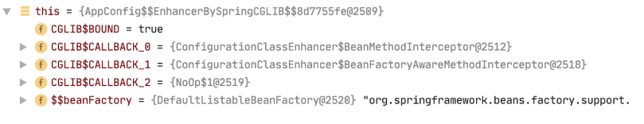


##### 7. 四维一体的开发思想


###### 1. 什么是四维一体


```markdown
Spring开发一个功能的4种形式，虽然开发方式不同，但是最终效果是一样的。
1. 基于schema
2. 基于特定功能注解
3. 基于原始<bean
4. 基于@Bean注解
```


###### 2. 四维一体的开发案例


```java
1. <context:property-placehoder
2. @PropertySource  【推荐】
3. <bean id="" class="PropertySourcePlaceholderConfigure"/>
4. @Bean            【推荐】
```


##### 8. 纯注解版AOP编程


###### 1. 搭建环境


```markdown
1. 应用配置Bean 
2. 注解扫描
```


###### 2. 开发步骤


```java
1. 原始对象
   @Service(@Component)
   public class UserServiceImpl implements UserService{
     
   }
2. 创建切面类 （额外功能 切入点 组装切面）
    @Aspect
    @Component
    public class MyAspect {

        @Around("execution(* login(..))")
        public Object arround(ProceedingJoinPoint joinPoint) throws Throwable {

            System.out.println("----aspect log ------");

            Object ret = joinPoint.proceed();


            return ret;
        }
    }
3. Spring的配置文件中
   <aop:aspectj-autoproxy />
   @EnableAspectjAutoProxy ---> 配置Bean
```


###### 3. 注解AOP细节分析


```java
1. 代理创建方式的切换 JDK Cglib 
   <aop:aspectj-autoproxy proxy-target-class=true|false />
   @EnableAspectjAutoProxy(proxyTargetClass)
2. SpringBoot AOP的开发方式
     @EnableAspectjAutoProxy 已经设置好了 
     
    1. 原始对象
     @Service(@Component)
     public class UserServiceImpl implements UserService{

     }
    2. 创建切面类 （额外功能 切入点 组装切面）
      @Aspect
      @Component
      public class MyAspect {

        @Around("execution(* login(..))")
        public Object arround(ProceedingJoinPoint joinPoint) throws Throwable {

          System.out.println("----aspect log ------");

          Object ret = joinPoint.proceed();


          return ret;
        }
      }
    Spring AOP 代理默认实现 JDK  SpringBOOT AOP 代理默认实现 Cglib
```


###### 4. 自定义注解实现AOP
```java
package com.bh.aop.anno;

import java.lang.annotation.*;

/**
 * @author ：HB
 * @date ：Created in 2022/1/9 19:59
 * @description：
 */
@Retention(RetentionPolicy.RUNTIME)
@Target({ElementType.METHOD})
@Documented
public @interface AopAnnotation {
    //操作内容
    String operation() default "";
}

```


```java
package com.bh.aop.aspects;

import com.bh.aop.anno.AopAnnotation;
import org.aspectj.lang.ProceedingJoinPoint;
import org.aspectj.lang.Signature;
import org.aspectj.lang.annotation.*;
import org.springframework.stereotype.Component;

import java.util.Arrays;

@Aspect
@Component
public class LogUtilsAnno {


	@Around("@annotation(annotation)")
	public Object logUtil(ProceedingJoinPoint joinPoint, AopAnnotation annotation) {
		Object result = null;
		Signature methodSignature = joinPoint.getSignature();
		try {
			Object[] args = joinPoint.getArgs();
			System.out.println("【" + methodSignature.getName() + "】方法开始执行，用的参数列表【" + Arrays.asList(args) + "】");
			result = joinPoint.proceed();
			System.out.println("【" + methodSignature.getName() + "】方法正常执行完成，计算结果是：" + result);
		} catch (Throwable throwable) {
			System.out.println("【"+methodSignature.getName()+"】方法执行出现异常了，异常信息是："+throwable.getCause()+"；这个异常已经通知测试小组进行排查");
			throwable.printStackTrace();
		}
		System.out.println("【"+methodSignature.getName()+"】方法最终结束了");
		return result;
	}


}

```

```java
public interface Calculator {
	
	public int add(int i,int j);
	public int sub(int i,int j);
	public int mul(int i,int j);
	public int div(int i,int j);

}

```

```java
package com.bh.aop.impl;


import com.bh.aop.anno.AopAnnotation;
import com.bh.aop.interfaces.Calculator;
import org.springframework.stereotype.Component;

@Component
public class MyMathCalculator implements Calculator {

	@Override
	@AopAnnotation
	public int add(int i, int j) {
		int result = i + j;
		return result;
	}

	@Override
	@AopAnnotation(operation = "减法")
	public int sub(int i, int j) {
		int result = i - j;
		return result;
	}

	@Override
	@AopAnnotation
	public int mul(int i, int j) {
		//方法的兼容性；
		int result = i * j;
		return result;
	}

	@Override
	@AopAnnotation
	public int div(int i, int j) {
		int result = i / j;
		return result;
	}

}

```


##### 9. 纯注解版Spring+MyBatis整合


+  基础配置 （配置Bean）  

```xml
1. 连接池
  <!--连接池-->
  <bean id="dataSource" class="com.alibaba.druid.pool.DruidDataSource">
    <property name="driverClassName" value="com.mysql.jdbc.Driver"></property>
    <property name="url" value="jdbc:mysql://localhost:3306/suns?useSSL=false"></property>
    <property name="username" value="root"></property>
    <property name="password" value="123456"></property>
  </bean>
   
   @Bean
   public DataSource dataSource(){
      DruidDataSource dataSource = new DruidDataSource();
      dataSource.setDriverClassName("");
      dataSource.setUrl();
      ...
      return dataSource;
   }

2. SqlSessionFactoryBean
    <!--创建SqlSessionFactory SqlSessionFactoryBean-->
    <bean id="sqlSessionFactoryBean" class="org.mybatis.spring.SqlSessionFactoryBean">
      <property name="dataSource" ref="dataSource"></property>
      <property name="typeAliasesPackage" value="com.baizhiedu.entity"></property>
      <property name="mapperLocations">
        <list>
          <value>classpath:com.baizhiedu.mapper/*Mapper.xml</value>
        </list>
      </property>
    </bean>

    @Bean
    public SqlSessionFactoryBean sqlSessionFactoryBean(DataSource dataSource){
         SqlSessionFactoryBean sqlSessionFactoryBean = new SqlSessionFactoryBean();
         sqlSessionFactoryBean.setDataSource(dataSource);
         sqlSessionFactoryBean.setTypeAliasesPackage("");
         ...
         return sqlSessionFactoryBean;
    }

3. MapperScannerConfigure 
   <!--创建DAO对象 MapperScannerConfigure-->
  <bean id="scanner" class="org.mybatis.spring.mapper.MapperScannerConfigurer">
    <property name="sqlSessionFactoryBeanName" value="sqlSessionFactoryBean"></property>
    <property name="basePackage" value="com.baizhiedu.dao"></property>
  </bean>
  
  @MapperScan(basePackages={"com.baizhiedu.dao"}) ---> 配置bean完成
```

+  编码      

```markdown
1. 实体
2. 表
3. DAO接口
4. Mapper文件
```

###### 1. MapperLocations编码时通配的写法
```java
//设置Mapper文件的路径
sqlSessionFactoryBean.setMapperLocations(Resource..);
Resource resouce = new ClassPathResouce("UserDAOMapper.xml")
  
sqlSessionFactoryBean.setMapperLocations(new ClassPathResource("UserDAOMapper.xml"));

<property name="mapperLocations">
   <list>
     <value>classpath:com.baizhiedu.mapper/*Mapper.xml</value>
   </list>
</property>
一组Mapper文件 

ResourcePatternResolver resolver = new PathMatchingResourcePatternResolver();
Resource[] resources = resolver.getResources("com.baizhi.mapper/*Mapper.xml");
sqlSessionFactoryBean.setMapperLocations(resources)
```

###### 2. 配置Bean数据耦合的问题
```java
mybatis.driverClassName = com.mysql.jdbc.Driver
mybatis.url = jdbc:mysql://localhost:3306/suns?useSSL=false
mybatis.username = root
mybatis.password = 123456
mybatis.typeAliasesPackages = com.baizhiedu.mybatis
mybatis.mapperLocations = com.baizhiedu.mapper/*Mapper.xml

@Component
@PropertySource("classpath:mybatis.properties")
public class MybatisProperties {
    @Value("${mybatis.driverClassName}")
    private String driverClassName;
    @Value("${mybatis.url}")
    private String url;
    @Value("${mybatis.username}")
    private String username;
    @Value("${mybatis.password}")
    private String password;
    @Value("${mybatis.typeAliasesPackages}")
    private String typeAliasesPackages;
    @Value("${mybatis.mapperLocations}")
    private String mapperLocations;
}

public class MyBatisAutoConfiguration {

    @Autowired
    private MybatisProperties mybatisProperties;

    @Bean
    public DataSource dataSource() {
        DruidDataSource dataSource = new DruidDataSource();
        dataSource.setDriverClassName(mybatisProperties.getDriverClassName());
        dataSource.setUrl(mybatisProperties.getUrl());
        dataSource.setUsername(mybatisProperties.getUsername());
        dataSource.setPassword(mybatisProperties.getPassword());
        return dataSource;
    }

    @Bean
    public SqlSessionFactoryBean sqlSessionFactoryBean(DataSource dataSource) {
        SqlSessionFactoryBean sqlSessionFactoryBean = new SqlSessionFactoryBean();
        sqlSessionFactoryBean.setDataSource(dataSource);
        sqlSessionFactoryBean.setTypeAliasesPackage(mybatisProperties.getTypeAliasesPackages());
        //sqlSessionFactoryBean.setMapperLocations(new ClassPathResource("UserDAOMapper.xml"));

        try {
            ResourcePatternResolver resolver = new PathMatchingResourcePatternResolver();
            Resource[] resources = resolver.getResources(mybatisProperties.getMapperLocations());
            sqlSessionFactoryBean.setMapperLocations(resources);
        } catch (IOException e) {
            e.printStackTrace();
        }

        return sqlSessionFactoryBean;
    }
}
```


##### 10. 纯注解版事务编程


```xml
1. 原始对象 XXXService
   <bean id="userService" class="com.baizhiedu.service.UserServiceImpl">
     <property name="userDAO" ref="userDAO"/>
   </bean>

   @Service
   public class UserServiceImpl implements UserService{
         @Autowired
         private UserDAO userDAO;
   }

2. 额外功能
   <!--DataSourceTransactionManager-->
    <bean id="dataSourceTransactionManager" class="org.springframework.jdbc.datasource.DataSourceTransactionManager">
      <property name="dataSource" ref="dataSource"/>
    </bean>
    
    @Bean
    public DataSourceTransactionManager dataSourceTransactionManager(DataSource dataSource){
          DataSourceTransactionManager dstm = new DataSourceTransactionManager();
          dstm.setDataSource(dataSource);
          return dstm 
    }

3. 事务属性
    @Transactional
    @Service
    public class UserServiceImpl implements UserService {
        @Autowired
        private UserDAO userDAO;

4. 基于Schema的事务配置 
   <tx:annotation-driven transaction-manager="dataSourceTransactionManager"/>
   @EnableTransactionManager ---> 配置Bean
```


```markdown
1. ApplicationContext ctx = new AnnotationConfigApplicationContext("com.baizhiedu.mybatis");
   SpringBoot 实现思想
2. 注解版MVC整合，SpringMVC中进行详细讲解
   SpringMyBatis --->DAO  事务基于注解 --> Service   Controller 
   org.springframework.web.context.ContextLoaderListener ---> XML工厂 无法提供 new AnnotationConfigApplicationContext
```


##### 11. Spring框架中YML的使用


###### 1. 什么是YML


```markdown
YML(YAML)是一种新形式的配置文件，比XML更简单，比Properties更强大。

YAML is a nice human-readable format for configuration, and it has some useful hierarchical properties. It's more or less a superset of JSON, so it has a lot of similar features.
```


###### 2. Properties进行配置问题


```markdown
1. Properties表达过于繁琐,无法表达数据的内在联系. 
2. Properties无法表达对象 集合类型
```


###### 3. YML语法简介


```yaml
1. 定义yml文件 
   xxx.yml xxx.yaml
2. 语法
   1. 基本语法
      name: suns
      password: 123456
   2. 对象概念 
      account: 
         id: 1
         password: 123456
   3. 定义集合 
      service: 
         - 11111
         - 22222
```


###### 4. Spring与YML集成思路的分析


```markdown
1. 准备yml配置文件 
   init.yml
   name: suns
   password: 123456
2. 读取yml 转换成 Properties
   YamlPropertiesFactoryBean.setResources( yml配置文件的路径 ) new ClassPathResource();
   YamlPropertiesFactoryBean.getObject() ---> Properties 
3. 应用PropertySourcesPlaceholderConfigurer
   PropertySourcesPlaceholderConfigurer.setProperties();
4. 类中 @Value注解 注入
```


###### 5. Spring与YML集成编码


+  环境搭建  

```xml
<dependency>
  <groupId>org.yaml</groupId>
  <artifactId>snakeyaml</artifactId>
  <version>1.23</version>
</dependency>
最低版本 1.18
```

+  编码  

```java
1. 准备yml配置文件
2. 配置Bean中操作 完成YAML读取 与 PropertySourcePlaceholderConfigure的创建 
    @Bean
    public PropertySourcesPlaceholderConfigurer configurer() {
        YamlPropertiesFactoryBean yamlPropertiesFactoryBean = new YamlPropertiesFactoryBean();
        yamlPropertiesFactoryBean.setResources(new ClassPathResource("init.yml"));
        Properties properties = yamlPropertiesFactoryBean.getObject();

        PropertySourcesPlaceholderConfigurer configurer = new PropertySourcesPlaceholderConfigurer();
        configurer.setProperties(properties);
        return configurer;
    }
3. 类 加入 @Value注解
```


###### 6. Spring与YML集成的问题


```markdown
1. 集合处理的问题
   SpringEL表达式解决
   @Value("#{'${list}'.split(',')}")
2. 对象类型的YAML进行配置时 过于繁琐 
   @Value("${account.name}")
   
SpringBoot  @ConfigurationProperties
```


##### @Conditional注解
```java
package com.bh.anno;

import org.springframework.context.annotation.Bean;
import org.springframework.context.annotation.Conditional;
import org.springframework.context.annotation.Configuration;

import java.time.Period;

/**
 * @author ：HB
 * @date ：Created in 2022/1/4 21:05
 * @description：
 */
@Configuration
//类中组件统一设置。满足当前条件，这个类中配置的所有bean注册才能生效；
//@Conditional({WindowsCondition.class})
public class ConditionBeanConfig {

    /**
     * @Conditional({Condition}) ： 按照一定的条件进行判断，满足条件给容器中注册bean
     *
     * 如果系统是windows，给容器中注册("bill")
     * 如果是linux系统，给容器中注册("linux")
     */
    @Bean("bill")
    @Conditional({WindowsCondition.class})
    public Person person01(){
        return new Person("bill","Windows");
    }

    @Bean("linux")
    @Conditional({LinuxCondition.class})
    public Person person02(){
        return new Person("linux","linux");
    }
}

```

```java
package com.bh.anno;

import org.springframework.beans.factory.config.ConfigurableListableBeanFactory;
import org.springframework.beans.factory.support.BeanDefinitionRegistry;
import org.springframework.context.annotation.Condition;
import org.springframework.context.annotation.ConditionContext;
import org.springframework.core.env.Environment;
import org.springframework.core.type.AnnotatedTypeMetadata;

//判断是否linux系统
public class LinuxCondition implements Condition {

	/**
	 * ConditionContext：判断条件能使用的上下文（环境）
	 * AnnotatedTypeMetadata：注释信息
	 */
	@Override
	public boolean matches(ConditionContext context, AnnotatedTypeMetadata metadata) {
		// TODO是否linux系统
		//1、能获取到ioc使用的beanfactory
		ConfigurableListableBeanFactory beanFactory = context.getBeanFactory();
		//2、获取类加载器
		ClassLoader classLoader = context.getClassLoader();
		//3、获取当前环境信息
		Environment environment = context.getEnvironment();
		//4、获取到bean定义的注册类
		BeanDefinitionRegistry registry = context.getRegistry();

		String property = environment.getProperty("os.name");

		//可以判断容器中的bean注册情况，也可以给容器中注册bean
		boolean definition = registry.containsBeanDefinition("person");
		if(property.contains("linux")){
			return true;
		}

		return false;
	}

}

```

```java
package com.bh.anno;

import org.springframework.context.annotation.Condition;
import org.springframework.context.annotation.ConditionContext;
import org.springframework.core.env.Environment;
import org.springframework.core.type.AnnotatedTypeMetadata;

//判断是否windows系统
public class WindowsCondition implements Condition {

	@Override
	public boolean matches(ConditionContext context, AnnotatedTypeMetadata metadata) {
		Environment environment = context.getEnvironment();
		String property = environment.getProperty("os.name");
		if(property.contains("Windows")){
			return true;
		}
		return false;
	}

}

```

```java
package com.bh.anno;

import lombok.AllArgsConstructor;
import lombok.Data;

/**
 * @author ：HB
 * @date ：Created in 2022/1/4 21:03
 * @description：
 */
@Data
@AllArgsConstructor
public class Person {
    private String name;
    //他们创造的操作系统
    private String system;
}

```

Test:

```java
package com.bh;

import com.bh.anno.ConditionBeanConfig;
import com.bh.anno.Person;
import org.junit.jupiter.api.Test;
import org.springframework.context.annotation.AnnotationConfigApplicationContext;

import java.util.Map;
class SbApplicationTests {
    @Test
    public void test01(){
        AnnotationConfigApplicationContext applicationContext = new AnnotationConfigApplicationContext(ConditionBeanConfig.class);
        String[] beanNamesForType = applicationContext.getBeanNamesForType(Person.class);
        for (String s : beanNamesForType) {
            System.out.println("s = " + s);
        }
        Map<String, Person> beansOfType = applicationContext.getBeansOfType(Person.class);
        System.out.println("beansOfType = " + beansOfType);
    }

}

```


###### @ConditionalOnBean : 给定的在bean存在时,则实例化当前Bean
```java
String[] beanNameForTypes =applicationContext.getBeanNamesForType(xxx.class);
//查看容器中有没有这个xxx组件
System.out.pritln(beanNameForTypes.length);

```

###### @ConditionalOnMissingBean: 当给定的在bean不存在时,则实例化当前Bean


###### @ConditionalOnClass: 当给定的类名在类路径上存在，则实例化当前Bean


###### @ConditionalOnMissingClass :当给定的类名在类路径上不存在，则实例化当前Bean
```java
@Configuration
public class MyConditionBeanConfig {
    @Bean
    public Demo Demo() {
        return new Demo();
    }
 
    @Bean
    @ConditionalOnBean(Demo.class)//有Bean就加载
    public ClassAA classAA() {
        return new ClassAA();
    }
 
    @Bean
    @ConditionalOnMissingBean(Demo.class)//没有Bean就加载
    public ClassBB ClassBB() {
        return new ClassBB();
    }
 
    @Bean
    @ConditionalOnClass(Demo.class) //有class就加载
    public ClassC classC() {
        return new ClassC();
    }
 
    @Bean
    @ConditionalOnMissingClass("com.xzh.customer.technical.boot.MyConditionBeanConfig") //没有class就加载
    public ClassD classD() {
        return new ClassD();
    }
 
    @Bean
    @ConditionalOnMissingClass("com.xzh.customer.technical.boot.MyConditionBeanConfig.NoThisBean.class")
    public ClassE classE() {
        return new ClassE();
    }
 
    private static class Demo {
 
    }
 
    public static class ClassAA {
 
    }
 
    public static class ClassBB {
 
    }
 
    public static class ClassC {
 
    }
 
    public static class ClassD {
 
    }
 
    public static class ClassE {
 
    }
}
```


```java
@SpringBootTest(classes = CustomerApplication.class)
@RunWith(SpringRunner.class)
@WebAppConfiguration
@Slf4j
public class ConditionTest {
    @Autowired(required = false)
    private MyConditionBeanConfig.ClassAA classA;
    @Autowired(required = false)
    private MyConditionBeanConfig.ClassBB classB;
    @Autowired(required = false)
    private MyConditionBeanConfig.ClassC classC;
    @Autowired(required = false)
    private MyConditionBeanConfig.ClassD classD;
    @Autowired(required = false)
    private MyConditionBeanConfig.ClassE classE;
 
    @Test
    public void test() {
        log.info("classA: {}", classA);
        log.info("classB: {}", classB);
        log.info("classC: {}", classC);
        log.info("classD: {}", classD);
        log.info("classE: {}", classE);
    }
}
```


测试


将MyConditionBeanConfig中Demo类的@Bean注解注释掉：

```java
    //@Bean
    public Demo Demo() {
        return new Demo();
    }

```

测试结果：

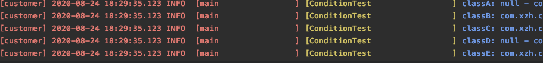

##### @Import注解:给容器中注册组
```java
	/**
	 * 给容器中注册组件；
	 * 1）、包扫描+组件标注注解（@Controller/@Service/@Repository/@Component）[自己写的类]
	 * 2）、@Bean[导入的第三方包里面的组件]
	 * 3）、@Import[快速给容器中导入一个组件]
	 * 		1）、@Import(要导入到容器中的组件)；容器中就会自动注册这个组件，id默认是全类名
	 * 		2）、ImportSelector:返回需要导入的组件的全类名数组；
	 * 		3）、ImportBeanDefinitionRegistrar:手动注册bean到容器中
	 * 4）、使用Spring提供的 FactoryBean（工厂Bean）;
	 * 		1）、默认获取到的是工厂bean调用getObject创建的对象
	 * 		2）、要获取工厂Bean本身，我们需要给id前面加一个&
	 * 			&colorFactoryBean
	 */
```


```java
package com.bh.anno.imports;

import lombok.AllArgsConstructor;
import lombok.Data;
import lombok.NoArgsConstructor;

/**
 * @author ：HB
 * @date ：Created in 2022/1/4 21:36
 * @description：
 */
@AllArgsConstructor
@NoArgsConstructor
@Data
public class Color {
    //颜色
    private String name;
}

```

```java
/**
 * @author ：HB
 * @date ：Created in 2022/1/4 21:05
 * @description：
 */
@Configuration
@Import(Color.class)
//导入一个Color组件
public class ConditionBeanConfig {
}
```

Test:


```java
public void test01(){
        AnnotationConfigApplicationContext applicationContext = new AnnotationConfigApplicationContext(ConditionBeanConfig.class);
        String[] beanDefinitionNames = applicationContext.getBeanDefinitionNames();
        for (String beanDefinitionName : beanDefinitionNames) {
            System.out.println("beanDefinitionName = " + beanDefinitionName);
        }
    }
```


###### @import 中的属性 importselector
```java
package com.bh.anno.bean;

/**
 * @author ：HB
 * @date ：Created in 2022/1/5 8:37
 * @description：
 */
public class Yellow {
}
package com.bh.anno.bean;

/**
 * @author ：HB
 * @date ：Created in 2022/1/5 8:36
 * @description：
 */
public class Blue {
}

package com.bh.anno.imports;

import org.springframework.context.annotation.ImportSelector;
import org.springframework.core.type.AnnotationMetadata;

//自定义逻辑返回需要导入的组件
public class MyImportSelector implements ImportSelector {

	//返回值，就是到导入到容器中的组件全类名
	//AnnotationMetadata:当前标注@Import注解的类的所有注解信息
	@Override
	public String[] selectImports(AnnotationMetadata importingClassMetadata) {
		// TODO Auto-generated method stub
		//importingClassMetadata
		//方法不要返回null值
		return new String[]{"com.bh.anno.bean.Blue","com.bh.anno.bean.Yellow"};
	}

}


package com.bh.anno;

import com.bh.anno.bean.Color;
import com.bh.anno.imports.MyImportSelector;
import org.springframework.context.annotation.Bean;
import org.springframework.context.annotation.Conditional;
import org.springframework.context.annotation.Configuration;
import org.springframework.context.annotation.Import;

/**
 * @author ：HB
 * @date ：Created in 2022/1/4 21:05
 * @description：
 */
@Configuration
@Import({MyImportSelector.class})
public class ConditionBeanConfig {
    
}

//Test

public void test01(){
        AnnotationConfigApplicationContext applicationContext = new AnnotationConfigApplicationContext(ConditionBeanConfig.class);
        String[] beanDefinitionNames = applicationContext.getBeanDefinitionNames();
        for (String beanDefinitionName : beanDefinitionNames) {
            System.out.println("beanDefinitionName = " + beanDefinitionName);
        }
    }

```


###### ImportBeanDefinitionRegistrar
```java
package com.bh.anno.config;

import com.bh.anno.bean.RainBow;
import org.springframework.beans.factory.support.BeanDefinitionRegistry;
import org.springframework.beans.factory.support.RootBeanDefinition;
import org.springframework.context.annotation.ImportBeanDefinitionRegistrar;
import org.springframework.core.type.AnnotationMetadata;


public class MyImportBeanDefinitionRegistrar implements ImportBeanDefinitionRegistrar {

	/**
	 * AnnotationMetadata：当前类的注解信息
	 * BeanDefinitionRegistry:BeanDefinition注册类；
	 * 		把所有需要添加到容器中的bean；调用
	 * 		BeanDefinitionRegistry.registerBeanDefinition手工注册进来
	 */
	@Override
	public void registerBeanDefinitions(AnnotationMetadata importingClassMetadata, BeanDefinitionRegistry registry) {
		
		boolean definition = registry.containsBeanDefinition("com.bh.anno.bean.Red");
		boolean definition2 = registry.containsBeanDefinition("com.bh.anno.bean.Blue");
		if(definition && definition2){
			//指定Bean定义信息；（Bean的类型，Bean。。。）
			RootBeanDefinition beanDefinition = new RootBeanDefinition(RainBow.class);
			//注册一个Bean，指定bean名
			registry.registerBeanDefinition("rainBow", beanDefinition);
		}
	}

}


package com.bh.anno;

import com.bh.anno.bean.Color;
import com.bh.anno.bean.Red;
import com.bh.anno.config.MyImportBeanDefinitionRegistrar;
import com.bh.anno.imports.MyImportSelector;
import org.springframework.context.annotation.Bean;
import org.springframework.context.annotation.Conditional;
import org.springframework.context.annotation.Configuration;
import org.springframework.context.annotation.Import;

/**
 * @author ：HB
 * @date ：Created in 2022/1/4 21:05
 * @description：
 */
@Configuration
@Import({Red.class, Color.class, MyImportSelector.class, MyImportBeanDefinitionRegistrar.class})
public class ConditionBeanConfig {
}

//Test

public void test01(){
        AnnotationConfigApplicationContext applicationContext = new AnnotationConfigApplicationContext(ConditionBeanConfig.class);
        String[] beanDefinitionNames = applicationContext.getBeanDefinitionNames();
        for (String beanDefinitionName : beanDefinitionNames) {
            System.out.println("beanDefinitionName = " + beanDefinitionName);
        }
    }

```

###### FactoryBean
```java
package com.bh.anno.bean;

import org.springframework.beans.factory.FactoryBean;

//创建一个Spring定义的FactoryBean
public class ColorFactoryBean implements FactoryBean<Color> {

	//返回一个Color对象，这个对象会添加到容器中
	@Override
	public Color getObject() throws Exception {
		// TODO Auto-generated method stub
		System.out.println("ColorFactoryBean...getObject...");
		return new Color();
	}

	@Override
	public Class<?> getObjectType() {
		// TODO Auto-generated method stub
		return Color.class;
	}

	//是单例？
	//true：这个bean是单实例，在容器中保存一份
	//false：多实例，每次获取都会创建一个新的bean；
	@Override
	public boolean isSingleton() {
		// TODO Auto-generated method stub
		return false;
	}

}


package com.bh.anno;

import com.bh.anno.bean.Color;
import com.bh.anno.bean.ColorFactoryBean;
import com.bh.anno.bean.Red;
import com.bh.anno.config.MyImportBeanDefinitionRegistrar;
import com.bh.anno.imports.MyImportSelector;
import org.springframework.context.annotation.Bean;
import org.springframework.context.annotation.Conditional;
import org.springframework.context.annotation.Configuration;
import org.springframework.context.annotation.Import;

/**
 * @author ：HB
 * @date ：Created in 2022/1/4 21:05
 * @description：
 */
@Configuration
//类中组件统一设置。满足当前条件，这个类中配置的所有bean注册才能生效；
//@Conditional({WindowsCondition.class})
@Import({Red.class, Color.class, MyImportSelector.class, MyImportBeanDefinitionRegistrar.class})
public class ConditionBeanConfig {

    
    @Bean
    public ColorFactoryBean colorFactoryBean(){
        return new ColorFactoryBean();
    }
}

//Test

public void test01(){
        AnnotationConfigApplicationContext applicationContext = new AnnotationConfigApplicationContext(ConditionBeanConfig.class);
        String[] beanDefinitionNames = applicationContext.getBeanDefinitionNames();
        for (String beanDefinitionName : beanDefinitionNames) {
            System.out.println("beanDefinitionName = " + beanDefinitionName);
        }
    }

```


#### 第四章 SpringBoot中的注解
##### 1. <font style="color:rgb(64, 64, 64);">@EnableConfigurationProperties</font>
<font style="color:rgb(64, 64, 64);">@EnableConfigurationProperties注解的作用是：使 使用 @ConfigurationProperties 注解的类生效。也可以理解为开启</font>@ConfigurationProperties，或者使@ConfigurationProperties注解生效。

<font style="color:rgb(64, 64, 64);">tips: </font><font style="color:rgb(64, 64, 64);">@EnableConfigurationProperties+@Configuration + </font>@ConfigurationProperties<font style="color:rgb(64, 64, 64);">一起使用</font>

```java
import java.net.InetAddress;


import lombok.Data;
import org.springframework.boot.context.properties.ConfigurationProperties;
import org.springframework.boot.context.properties.EnableConfigurationProperties;
import org.springframework.context.annotation.Configuration;

@ConfigurationProperties("my.service")
@Configuration
@EnableConfigurationProperties
@Data
public class MyProperties {
    //默认是false
    private boolean enabled;
    //默认是null
    private InetAddress remoteAddress;
}
```

使用yaml进行修改默认值：

```yaml
my:
  service:
    enabled: true
    remote-address: 127.0.0.1
```


测试：

```java
  @RequestMapping("/testProperties")
    public String testProperties(){
        return myProperties.getRemoteAddress()+""+myProperties.isEnabled();
    }
//http://localhost:8080/testProperties
输出：/127.0.0.1true
```


##### 2. <font style="color:rgb(64, 64, 64);">@ConfigurationProperties</font>
[https://www.cnblogs.com/jimoer/p/11374229.html](https://www.cnblogs.com/jimoer/p/11374229.html)


<font style="color:rgb(0, 0, 0);">在编写项目代码时，我们要求更灵活的配置，更好的模块化整合。在 Spring Boot 项目中，为满足以上要求，我们将大量的参数配置在 application.properties 或 application.yml 文件中，通过 </font><font style="color:rgb(232, 62, 140);background-color:rgb(246, 246, 246);">@ConfigurationProperties</font><font style="color:rgb(0, 0, 0);"> 注解，我们可以方便的获取这些参数值。</font>

<font style="color:rgb(0, 0, 0);"></font>

作用是：将类的属性与yaml进行绑定。


##### 3. <font style="color:rgb(36, 41, 46);">@ConfigurationPropertiesScan</font>
<font style="color:rgb(36, 41, 46);">@ConfigurationPropertiesScan  （标注在启动类中）+</font>@ConfigurationProperties

```java
@SpringBootApplication
@ConfigurationPropertiesScan

public class SbApplication {

    public static void main(String[] args) {
        SpringApplication.run(SbApplication.class, args);
    }
```


```java
import java.net.InetAddress;


import lombok.Data;
import org.springframework.boot.context.properties.ConfigurationProperties;
import org.springframework.boot.context.properties.EnableConfigurationProperties;
import org.springframework.context.annotation.Configuration;

@ConfigurationProperties("my.service")
@Data
public class MyProperties {
    private boolean enabled;
    private InetAddress remoteAddress;
}


```

##### <font style="color:rgb(79, 79, 79);">底层注解-@ImportResource导入Spring配置文件</font>
<font style="color:rgb(77, 77, 77);">比如，公司使用bean.xml文件生成配置bean，然而你为了省事，想继续复用bean.xml，</font><font style="color:rgb(232, 62, 140);background-color:rgb(246, 246, 246);">@ImportResource</font><font style="color:rgb(77, 77, 77);">粉墨登场。</font>

<font style="color:rgb(77, 77, 77);">bean.xml：</font>

```xml
<?xml version="1.0" encoding="UTF-8"?>
<beans ...">

    <bean id="haha" class="com.lun.boot.bean.User">
        <property name="name" value="zhangsan"></property>
        <property name="age" value="18"></property>
    </bean>

    <bean id="hehe" class="com.lun.boot.bean.Pet">
        <property name="name" value="tomcat"></property>
    </bean>
</beans>

```

<font style="color:rgb(77, 77, 77);">使用方法：</font>

```xml
@ImportResource("classpath:beans.xml")
public class MyConfig {
...
}

```

<font style="color:rgb(77, 77, 77);">测试类：</font>

```xml
public static void main(String[] args) {
    //1、返回我们IOC容器
    ConfigurableApplicationContext run = SpringApplication.run(MainApplication.class, args);

	boolean haha = run.containsBean("haha");
	boolean hehe = run.containsBean("hehe");
	System.out.println("haha："+haha);//true
	System.out.println("hehe："+hehe);//true
}

```

### Spring系列 — 持久层整合
---

#### 第一章、持久层整合


##### 1.Spring框架为什么要与持久层技术进行整合


```markdown
1. JavaEE开发需要持久层进行数据库的访问操作。
2. JDBC Hibernate MyBatis进行持久开发过程存在大量的代码冗余
3. Spring基于模板设计模式对于上述的持久层技术进行了封装
```


##### 2. Spring可以与那些持久层技术进行整合？


```markdown
1. JDBC
     |-  JDBCTemplate 
2. Hibernate (JPA)
     |-  HibernateTemplate
3. MyBatis
     |-  SqlSessionFactoryBean MapperScannerConfigure
```


#### 第二章、Spring与MyBatis整合


##### 1. MyBatis开发步骤的回顾


```markdown
1. 实体
2. 实体别名  
3. 表
4. 创建DAO接口
5. 实现Mapper文件
6. 注册Mapper文件
7. MybatisAPI调用
```


##### 2. Mybatis在开发过程中存在问题


```markdown
配置繁琐  代码冗余 

1. 实体
2. 实体别名         配置繁琐 
3. 表
4. 创建DAO接口
5. 实现Mapper文件
6. 注册Mapper文件   配置繁琐 
7. MybatisAPI调用  代码冗余
```


##### 3. Spring与Mybatis整合思路分析
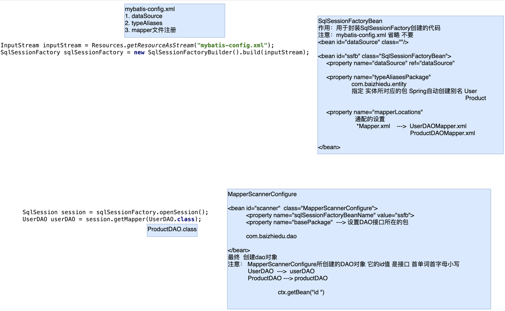


##### 4. Spring与Mybatis整合的开发步骤


+  配置文件（ApplicationContext.xml) 进行相关配置  

```xml
#配置 是需要配置一次 
<bean id="dataSource" class=""/> 

<!--创建SqlSessionFactory-->
<bean id="ssfb" class="SqlSessionFactoryBean">
    <property name="dataSource" ref=""/>
    <property name="typeAliasesPackage">
         指定 实体类所在的包  com.baizhiedu.entity  User
                                                 Product
    </property>
    <property name="mapperLocations">
          指定 配置文件(映射文件)的路径 还有通用配置 
          com.baizhiedu.mapper/*Mapper.xml 
    </property>
</bean>

<!--DAO接口的实现类
    session ---> session.getMapper() --- xxxDAO实现类对象 
    XXXDAO  ---> xXXDAO
-->
<bean id="scanner" class="MapperScannerConfigure">
    <property name="sqlSessionFactoryBeanName" value="ssfb"/>
    <property name="basePacakge">
        指定 DAO接口放置的包  com.baizhiedu.dao 
    </property>
</bean>
```

+  编码  

```markdown
# 实战经常根据需求 写的代码
1. 实体
2. 表
3. 创建DAO接口
4. 实现Mapper文件
```


##### 5. Spring与Mybatis整合编码


+  搭建开发环境(jar)  

```xml
<dependency>
  <groupId>org.springframework</groupId>
  <artifactId>spring-jdbc</artifactId>
  <version>5.1.14.RELEASE</version>
</dependency>

<dependency>
  <groupId>org.mybatis</groupId>
  <artifactId>mybatis-spring</artifactId>
  <version>2.0.2</version>
</dependency>

<dependency>
  <groupId>com.alibaba</groupId>
  <artifactId>druid</artifactId>
  <version>1.1.18</version>
</dependency>

<dependency>
  <groupId>mysql</groupId>
  <artifactId>mysql-connector-java</artifactId>
  <version>5.1.48</version>
</dependency>

<dependency>
  <groupId>org.mybatis</groupId>
  <artifactId>mybatis</artifactId>
  <version>3.4.6</version>
</dependency>
```

+  Spring配置文件的配置  

```xml
<!--连接池-->
<bean id="dataSource" class="com.alibaba.druid.pool.DruidDataSource">
  <property name="driverClassName" value="com.mysql.jdbc.Driver"></property>
  <property name="url" value="jdbc:mysql://localhost:3306/suns?useSSL=false"></property>
  <property name="username" value="root"></property>
  <property name="password" value="123456"></property>
</bean>

<!--创建SqlSessionFactory SqlSessionFactoryBean-->
<bean id="sqlSessionFactoryBean" class="org.mybatis.spring.SqlSessionFactoryBean">
  <property name="dataSource" ref="dataSource"></property>
  <property name="typeAliasesPackage" value="com.baizhiedu.entity"></property>
  <property name="mapperLocations">
    <list>
      <value>classpath:com.baizhiedu.mapper/*Mapper.xml</value>
    </list>
  </property>
</bean>

<!--创建DAO对象 MapperScannerConfigure-->

<bean id="scanner" class="org.mybatis.spring.mapper.MapperScannerConfigurer">
  <property name="sqlSessionFactoryBeanName" value="sqlSessionFactoryBean"></property>
  <property name="basePackage" value="com.baizhiedu.dao"></property>
</bean>
```

+  编码  

```markdown
1. 实体
2. 表
3. DAO接口
4. Mapper文件配置
```


##### 6. Spring与Mybatis整合细节


+  问题：Spring与Mybatis整合后，为什么DAO不提交事务，但是数据能够插入数据库中？  

```markdown
Connection --> tx
Mybatis(Connection)

本质上控制连接对象(Connection) ---> 连接池(DataSource)
1. Mybatis提供的连接池对象 ---> 创建Connection
     Connection.setAutoCommit(false) 手工的控制了事务 ， 操作完成后，手工提交
2. Druid（C3P0 DBCP）作为连接池        ---> 创建Connection
     Connection.setAutoCommit(true) true默认值 保持自动控制事务，一条sql 自动提交 
答案：因为Spring与Mybatis整合时，引入了外部连接池对象，保持自动的事务提交这个机制(Connection.setAutoCommit(true)),不需要手工进行事务的操作，也能进行事务的提交 

注意：未来实战中，还会手工控制事务(多条sql一起成功，一起失败)，后续Spring通过事务控制解决这个问题。
```


#### 第三章、Spring的事务处理


##### 1. 什么是事务？


```markdown
保证业务操作完整性的一种数据库机制

事务的4特点： A C I D
1. A 原子性
2. C 一致性
3. I 隔离性
4. D 持久性
```


##### 2. 如何控制事务


```markdown
JDBC:
    Connection.setAutoCommit(false);
    Connection.commit();
    Connection.rollback();
Mybatis：
    Mybatis自动开启事务
    
    sqlSession(Connection).commit();
    sqlSession(Connection).rollback();

结论：控制事务的底层 都是Connection对象完成的。
```


##### 3.Spring控制事务的开发


```markdown
Spring是通过AOP的方式进行事务开发
```


###### 1. 原始对象


```markdown
public class XXXUserServiceImpl{
   private xxxDAO xxxDAO
   set get

   1. 原始对象 ---》 原始方法 ---》核心功能 (业务处理+DAO调用)
   2. DAO作为Service的成员变量，依赖注入的方式进行赋值
}
```


###### 2. 额外功能


```markdown
1. org.springframework.jdbc.datasource.DataSourceTransactionManager
2. 注入DataSource 
1. MethodInterceptor
   public Object invoke(MethodInvocation invocation){
      try{
        Connection.setAutoCommit(false);
        Object ret = invocation.proceed();
        Connection.commit();
      }catch(Exception e){
        Connection.rollback();
      }
        return ret;
   }
2. @Aspect
   @Around
```


###### 3. 切入点


```plain
@Transactional 
事务的额外功能加入给那些业务方法。

1. 类上：类中所有的方法都会加入事务
2. 方法上：这个方法会加入事务
```


###### 4 组装切面


```markdown
1. 切入点
2. 额外功能

<tx:annotation-driven transaction-manager=""/>
```


##### 4. Spring控制事务的编码


+  搭建开发环境 (jar)  

```xml
<dependency>
  <groupId>org.springframework</groupId>
  <artifactId>spring-tx</artifactId>
  <version>5.1.14.RELEASE</version>
</dependency>
```

+  编码  

```xml
<bean id="userService" class="com.baizhiedu.service.UserServiceImpl">
  <property name="userDAO" ref="userDAO"/>
</bean>

<!--DataSourceTransactionManager-->
<bean id="dataSourceTransactionManager" class="org.springframework.jdbc.datasource.DataSourceTransactionManager">
  <property name="dataSource" ref="dataSource"/>
</bean>

@Transactional
public class UserServiceImpl implements UserService {
    private UserDAO userDAO;

<tx:annotation-driven transaction-manager="dataSourceTransactionManager"/>
```

+  细节  

```markdown
<tx:annotation-driven transaction-manager="dataSourceTransactionManager" proxy-target-class="true"/>
进行动态代理底层实现的切换   proxy-target-class
    默认 false JDK
        true  Cglib
```


#### 第四章、 Spring中的事务属性(Transaction Attribute)


##### 1. 什么是事务属性


```markdown
属性：描述物体特征的一系列值
     性别 身高 体重 ...
事务属性：描述事务特征的一系列值 
1. 隔离属性
2. 传播属性
3. 只读属性
4. 超时属性
5. 异常属性
```


##### 2. 如何添加事务属性


```markdown
@Transactional(isloation=,propagation=,readOnly=,timeout=,rollbackFor=,noRollbackFor=,)
```


##### 3. 事务属性详解


###### 1. 隔离属性 (ISOLATION)


+  隔离属性的概念  

```markdown
概念：他描述了事务解决并发问题的特征
1. 什么是并发
       多个事务(用户)在同一时间，访问操作了相同的数据
       
       同一时间：0.000几秒 微小前 微小后
2. 并发会产生那些问题
       1. 脏读
       2. 不可重复读
       3. 幻影读
3. 并发问题如何解决
       通过隔离属性解决，隔离属性中设置不同的值，解决并发处理过程中的问题。
```

+  事务并发产生的问题 
    -  脏读  

```markdown
一个事务，读取了另一个事务中没有提交的数据。会在本事务中产生数据不一致的问题
解决方案  @Transactional(isolation=Isolation.READ_COMMITTED)
```

    -  不可重复读  

```markdown
一个事务中，多次读取相同的数据，但是读取结果不一样。会在本事务中产生数据不一致的问题
注意：1 不是脏读 2 一个事务中
解决方案 @Transactional(isolation=Isolation.REPEATABLE_READ)
本质： 一把行锁
```

    -  幻影读  

```markdown
一个事务中，多次对整表进行查询统计，但是结果不一样，会在本事务中产生数据不一致的问题
解决方案 @Transactional(isolation=Isolation.SERIALIZABLE)
本质：表锁
```

    -  总结  

```markdown
并发安全： SERIALIZABLE>REPEATABLE_READ>READ_COMMITTED
运行效率： READ_COMMITTED>REPEATABLE_READ>SERIALIZABLE
```

+  数据库对于隔离属性的支持   

| 隔离属性的值 | MySQL | Oracle |
| --- | --- | --- |
| ISOLATION_READ_COMMITTED | ✅ | ✅ |
| IOSLATION_REPEATABLE_READ | ✅ | ❎ |
| ISOLATION_SERIALIZABLE | ✅ | ✅ |


```markdown
Oracle不支持REPEATABLE_READ值 如何解决不可重复读
采用的是多版本比对的方式 解决不可重复读的问题
```

+  默认隔离属性  

```markdown
ISOLATION_DEFAULT：会调用不同数据库所设置的默认隔离属性

MySQL : REPEATABLE_READ 
Oracle: READ_COMMITTED
```

    -  查看数据库默认隔离属性 
        *  MySQL  

```markdown
select @@tx_isolation;
```

        *  Oracle  

```markdown
SELECT s.sid, s.serial#,
   CASE BITAND(t.flag, POWER(2, 28))
      WHEN 0 THEN 'READ COMMITTED'
      ELSE 'SERIALIZABLE'
   END AS isolation_level
FROM v$transaction t 
JOIN v$session s ON t.addr = s.taddr
AND s.sid = sys_context('USERENV', 'SID');
```

+  隔离属性在实战中的建议  

```markdown
推荐使用Spring指定的ISOLATION_DEFAULT
 1. MySQL   repeatable_read
 2. Oracle  read_commited 

未来实战中，并发访问情况 很低 

如果真遇到并发问题，乐观锁 
   Hibernate(JPA)  Version 
   MyBatis         通过拦截器自定义开发
```


###### 2. 传播属性(PROPAGATION)


+  传播属性的概念  

```markdown
概念：他描述了事务解决嵌套问题的特征

什么叫做事务的嵌套：他指的是一个大的事务中，包含了若干个小的事务

问题：大事务中融入了很多小的事务，他们彼此影响，最终就会导致外部大的事务，丧失了事务的原子性
```

+  传播属性的值及其用法  

| 传播属性的值 | 外部不存在事务 | 外部存在事务 | 用法 | 备注 |
| --- | --- | --- | --- | --- |
| REQUIRED | 开启新的事务 | 融合到外部事务中 | [@Transactional(propagation ](/Transactional(propagation )<br/> = Propagation.REQUIRED)  | 增删改方法 |
| SUPPORTS | 不开启事务 | 融合到外部事务中 | [@Transactional(propagation ](/Transactional(propagation )<br/> = Propagation.SUPPORTS)  | 查询方法 |
| REQUIRES_NEW | 开启新的事务 | 挂起外部事务，创建新的事务 | [@Transactional(propagation ](/Transactional(propagation )<br/> = Propagation.REQUIRES_NEW)  | 日志记录方法中 |
| NOT_SUPPORTED | 不开启事务 | 挂起外部事务 | [@Transactional(propagation ](/Transactional(propagation )<br/> = Propagation.NOT_SUPPORTED)  | 及其不常用 |
| NEVER | 不开启事务 | 抛出异常 | [@Transactional(propagation ](/Transactional(propagation )<br/> = Propagation.NEVER)  | 及其不常用 |
| MANDATORY | 抛出异常 | 融合到外部事务中 | [@Transactional(propagation ](/Transactional(propagation )<br/> = Propagation.MANDATORY)  | 及其不常用 |


+  默认的传播属性  

```markdown
REQUIRED是传播属性的默认值
```

+  推荐传播属性的使用方式  

```markdown
增删改 方法：直接使用默认值REQUIRED 
查询   操作：显示指定传播属性的值为SUPPORTS
```


###### 3. 只读属性(readOnly)


```markdown
针对于只进行查询操作的业务方法，可以加入只读属性，提供运行效率

默认值：false
```


###### 4. 超时属性(timeout)


```markdown
指定了事务等待的最长时间

1. 为什么事务进行等待？
   当前事务访问数据时，有可能访问的数据被别的事务进行加锁的处理，那么此时本事务就必须进行等待。
2. 等待时间 秒
3. 如何应用 @Transactional(timeout=2)
4. 超时属性的默认值 -1 
   最终由对应的数据库来指定
```


###### 5. 异常属性


```markdown
Spring事务处理过程中
默认 对于RuntimeException及其子类 采用的是回滚的策略
默认 对于Exception及其子类 采用的是提交的策略

rollbackFor = {java.lang.Exception,xxx,xxx} 
noRollbackFor = {java.lang.RuntimeException,xxx,xx}

@Transactional(rollbackFor = {java.lang.Exception.class},noRollbackFor = {java.lang.RuntimeException.class})

建议：实战中使用RuntimeExceptin及其子类 使用事务异常属性的默认值
```


##### 4. 事务属性常见配置总结


```markdown
1. 隔离属性   默认值 
2. 传播属性   Required(默认值) 增删改   Supports 查询操作
3. 只读属性   readOnly false  增删改   true 查询操作
4. 超时属性   默认值 -1
5. 异常属性   默认值 

增删改操作   @Transactional
查询操作     @Transactional(propagation=Propagation.SUPPORTS,readOnly=true)
```


##### 5. 基于标签的事务配置方式(事务开发的第二种形式)


```xml
基于注解 @Transaction的事务配置回顾
<bean id="userService" class="com.baizhiedu.service.UserServiceImpl">
  <property name="userDAO" ref="userDAO"/>
</bean>

<!--DataSourceTransactionManager-->
<bean id="dataSourceTransactionManager" class="org.springframework.jdbc.datasource.DataSourceTransactionManager">
  <property name="dataSource" ref="dataSource"/>
</bean>

@Transactional(isolation=,propagation=,...)
public class UserServiceImpl implements UserService {
    private UserDAO userDAO;

<tx:annotation-driven transaction-manager="dataSourceTransactionManager"/>

基于标签的事务配置
<bean id="userService" class="com.baizhiedu.service.UserServiceImpl">
  <property name="userDAO" ref="userDAO"/>
</bean>

<!--DataSourceTransactionManager-->
<bean id="dataSourceTransactionManager" class="org.springframework.jdbc.datasource.DataSourceTransactionManager">
  <property name="dataSource" ref="dataSource"/>
</bean>

事务属性 
<tx:advice id="txAdvice" transacation-manager="dataSourceTransactionManager">
    <tx:attributes>
          <tx:method name="register" isoloation="",propagation=""></tx:method>
          <tx:method name="login" .....></tx:method>
          等效于 
          @Transactional(isolation=,propagation=,)
          public void register(){
        
          }
      
    </tx:attributes>
</tx:advice>

<aop:config>
     <aop:pointcut id="pc" expression="execution(* com.baizhiedu.service.UserServiceImpl.register(..))"></aop:pointcut>
     <aop:advisor advice-ref="txAdvice" pointcut-ref="pc"></aop:advisor>
</aop:config>
```


+  基于标签的事务配置在实战中的应用方式  

```xml
<bean id="userService" class="com.baizhiedu.service.UserServiceImpl">
  <property name="userDAO" ref="userDAO"/>
</bean>

<!--DataSourceTransactionManager-->
<bean id="dataSourceTransactionManager" class="org.springframework.jdbc.datasource.DataSourceTransactionManager">
  <property name="dataSource" ref="dataSource"/>
</bean>

编程时候 service中负责进行增删改操作的方法 都以modify开头
                       查询操作 命名无所谓 
<tx:advice id="txAdvice" transacation-manager="dataSourceTransactionManager">
    <tx:attributes>
          <tx:method name="register"></tx:method>
          <tx:method name="modify*"></tx:method>
          <tx:method name="*" propagation="SUPPORTS"  read-only="true"></tx:method>
    </tx:attributes>
</tx:advice>

应用的过程中，service放置到service包中
<aop:config>
     <aop:pointcut id="pc" expression="execution(* com.baizhiedu.service..*.*(..))"></aop:pointcut>
     <aop:advisor advice-ref="txAdvice" pointcut-ref="pc"></aop:advisor>
</aop:config>
```


###### 


###### 


###### 




##### 


> 更新: 2022-01-09 20:35:36  
> 原文: <https://www.yuque.com/u12209896/it1egr/ggkp9r>