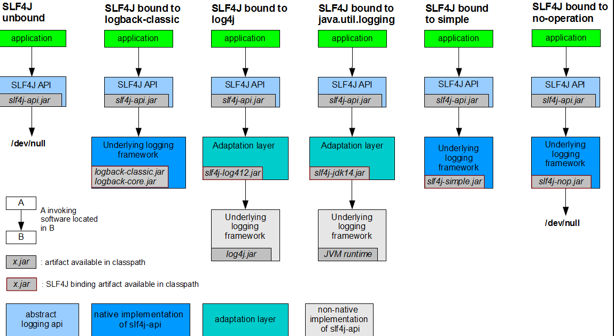
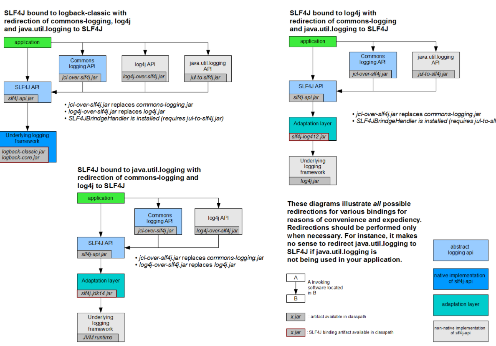
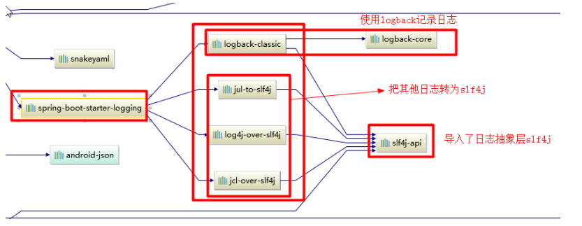

# SpringBoot

## 第1章 系统总览
## 第2章 自动化装配
自动化配置

```java
@SpringBootApplication
public class SbApplication {

    public static void main(String[] args) {
        ConfigurableApplicationContext applicationContext = springApplication.run(args);
        //查看容器里的组件
        String[] beanDefinitionNames = applicationContext.getBeanDefinitionNames();
        for (String beanDefinitionName : beanDefinitionNames) {
            System.out.println("beanDefinitionName = " + beanDefinitionName);
        }

    }

}
```

### <font style="color:rgb(79, 79, 79);">自动配置特性</font>
+ <font style="color:rgba(0, 0, 0, 0.75);">自动配好Tomcat</font>
    - <font style="color:rgba(0, 0, 0, 0.75);">引入Tomcat依赖。</font>
    - <font style="color:rgba(0, 0, 0, 0.75);">配置Tomcat</font>

```xml
<dependency>
	<groupId>org.springframework.boot</groupId>
	<artifactId>spring-boot-starter-tomcat</artifactId>
	<version>2.3.4.RELEASE</version>
	<scope>compile</scope>
</dependency>

```

+ <font style="color:rgb(77, 77, 77);">自动配好SpringMVC</font>
    - <font style="color:rgba(0, 0, 0, 0.75);">引入SpringMVC全套组件</font>
    - <font style="color:rgba(0, 0, 0, 0.75);">自动配好SpringMVC常用组件（功能）</font>
+ <font style="color:rgb(77, 77, 77);">自动配好Web常见功能，如：字符编码问题</font>
    - <font style="color:rgba(0, 0, 0, 0.75);">SpringBoot帮我们配置好了所有web开发的常见场景</font>

```xml
public static void main(String[] args) {
    //1、返回我们IOC容器
    ConfigurableApplicationContext run = SpringApplication.run(MainApplication.class, args);

    //2、查看容器里面的组件
    String[] names = run.getBeanDefinitionNames();
    for (String name : names) {
        System.out.println(name);
    }
}

```

+ <font style="color:rgba(0, 0, 0, 0.75);">默认的包结构</font>
    - <font style="color:rgba(0, 0, 0, 0.75);">主程序所在包及其下面的所有子包里面的组件都会被默认扫描进来</font>
    - <font style="color:rgba(0, 0, 0, 0.75);">无需以前的包扫描配置</font>
    - <font style="color:rgba(0, 0, 0, 0.75);">想要改变扫描路径</font>
        * <font style="color:rgba(0, 0, 0, 0.75);">@SpringBootApplication(scanBasePackages=“com.lun”)</font>
        * <font style="color:rgba(0, 0, 0, 0.75);">@ComponentScan 指定扫描路径</font>

```xml
@SpringBootApplication
等同于
@SpringBootConfiguration
@EnableAutoConfiguration
@ComponentScan("com.lun")

```

+ <font style="color:rgb(77, 77, 77);">各种配置拥有默认值</font>
    - <font style="color:rgba(0, 0, 0, 0.75);">默认配置最终都是映射到某个类上，如：</font><font style="color:rgb(199, 37, 78);background-color:rgb(249, 242, 244);">MultipartProperties</font>
    - <font style="color:rgba(0, 0, 0, 0.75);">配置文件的值最终会绑定每个类上(使用的是</font><font style="color:rgb(199, 37, 78);background-color:rgb(249, 242, 244);">@ConfigurationProperties 注解</font><font style="color:rgba(0, 0, 0, 0.75);">)，这个类会在容器中创建对象</font>
+ <font style="color:rgb(77, 77, 77);">按需加载所有自动配置项</font>
+ <font style="color:rgba(0, 0, 0, 0.75);">非常多的starter</font>
+ <font style="color:rgba(0, 0, 0, 0.75);">引入了哪些场景这个场景的自动配置才会开启（比如</font><font style="color:rgb(199, 37, 78);background-color:rgb(249, 242, 244);">web场景 引入依赖 spring-boot-starter-web</font><font style="color:rgba(0, 0, 0, 0.75);">）</font>

```xml
   <dependency>
            <groupId>org.springframework.boot</groupId>
            <artifactId>spring-boot-starter-web</artifactId>
        </dependency>
```

+ <font style="color:rgba(0, 0, 0, 0.75);">SpringBoot所有的自动配置功能都在 spring-boot-autoconfigure 包里面</font>

<font style="color:rgba(0, 0, 0, 0.75);"></font>

### <font style="color:rgb(79, 79, 79);">自动配置【源码分析】-自动包规则原理</font>
spring-boot-autoconfigure 包提供给了我们全场景的自动配置。

1. 利用getAutoConfigurationEntry(annotationMetadata);给容器中批量导入一些组件
2. 调用List<String> configurations = getCandidateConfigurations(annotationMetadata, attributes)获取到所有需要导入到容器中的配置类
3. 利用工厂加载 Map<String, List<String>> loadSpringFactories(@Nullable ClassLoader classLoader);得到所有的组件
4. 从META-INF/spring.factories位置来加载一个文件。
    1. 默认扫描我们当前系统里面所有META-INF/spring.factories位置的文件
    2. spring-boot-autoconfigure-2.3.4.RELEASE.jar包里面也有META-INF/spring.factories


```xml
# 文件里面写死了spring-boot一启动就要给容器中加载的所有配置类
# spring-boot-autoconfigure-2.3.4.RELEASE.jar/META-INF/spring.factories
# Auto Configure
org.springframework.boot.autoconfigure.EnableAutoConfiguration=\
org.springframework.boot.autoconfigure.admin.SpringApplicationAdminJmxAutoConfiguration,\
org.springframework.boot.autoconfigure.aop.AopAutoConfiguration,\
...

```

<font style="color:rgb(77, 77, 77);">虽然我们127个场景的所有自动配置启动的时候默认全部加载，但是</font><font style="color:rgb(199, 37, 78);background-color:rgb(249, 242, 244);">xxxxAutoConfiguration</font><font style="color:rgb(77, 77, 77);">按照条件装配规则（</font><font style="color:rgb(199, 37, 78);background-color:rgb(249, 242, 244);">@Conditional</font><font style="color:rgb(77, 77, 77);">），最终会按需配置。</font>

<font style="color:rgb(77, 77, 77);">如</font><font style="color:rgb(199, 37, 78);background-color:rgb(249, 242, 244);">AopAutoConfiguration</font><font style="color:rgb(77, 77, 77);">类：</font>

```java
 @ConditionalOnClass({Advice.class}):就是只有你导入了Advice这个类，AOP才生效
 
@ConditionalOnBean         //	当给定的在bean存在时,则实例化当前Bean
@ConditionalOnMissingBean  //	当给定的在bean不存在时,则实例化当前Bean
@ConditionalOnClass        //	当给定的类名在类路径上存在，则实例化当前Bean
@ConditionalOnMissingClass //	当给定的类名在类路径上不存在，则实例化当前Bean
```

```java
//
// Source code recreated from a .class file by IntelliJ IDEA
// (powered by Fernflower decompiler)
//

package org.springframework.boot.autoconfigure.aop;

import org.aspectj.weaver.Advice;
import org.springframework.aop.config.AopConfigUtils;
import org.springframework.beans.factory.config.BeanFactoryPostProcessor;
import org.springframework.beans.factory.support.BeanDefinitionRegistry;
import org.springframework.boot.autoconfigure.condition.ConditionalOnClass;
import org.springframework.boot.autoconfigure.condition.ConditionalOnMissingClass;
import org.springframework.boot.autoconfigure.condition.ConditionalOnProperty;
import org.springframework.context.annotation.Bean;
import org.springframework.context.annotation.Configuration;
import org.springframework.context.annotation.EnableAspectJAutoProxy;

@Configuration(
    proxyBeanMethods = false
)
//解读：配置文件中是否有：spring.aop.auto=true ,matchIfMissing表示默认就是true
@ConditionalOnProperty(
    prefix = "spring.aop",
    name = {"auto"},
    havingValue = "true",
    matchIfMissing = true
)
public class AopAutoConfiguration {
    public AopAutoConfiguration() {
    }

    //这个会生效
    @Configuration(
        proxyBeanMethods = false
    )
    //没有这个包org.aspectj.weaver.Advice会生效，因为我们有两种AOP的实现，一种是jdk需要实现接口，一种是aspectj。
    @ConditionalOnMissingClass({"org.aspectj.weaver.Advice"})
    @ConditionalOnProperty(
        prefix = "spring.aop",
        name = {"proxy-target-class"},
        havingValue = "true",
        matchIfMissing = true
    )
    static class ClassProxyingConfiguration {
        ClassProxyingConfiguration() {
        }

        @Bean
        static BeanFactoryPostProcessor forceAutoProxyCreatorToUseClassProxying() {
            return (beanFactory) -> {
                if (beanFactory instanceof BeanDefinitionRegistry) {
                    BeanDefinitionRegistry registry = (BeanDefinitionRegistry)beanFactory;
                    AopConfigUtils.registerAutoProxyCreatorIfNecessary(registry);
                    AopConfigUtils.forceAutoProxyCreatorToUseClassProxying(registry);
                }

            };
        }
    }

    
    //这个不会生效
    @Configuration(
        proxyBeanMethods = false
    )
    @ConditionalOnClass({Advice.class})
    static class AspectJAutoProxyingConfiguration {
        AspectJAutoProxyingConfiguration() {
        }

        @Configuration(
            proxyBeanMethods = false
        )
        @EnableAspectJAutoProxy(
            proxyTargetClass = true
        )
        @ConditionalOnProperty(
            prefix = "spring.aop",
            name = {"proxy-target-class"},
            havingValue = "true",
            matchIfMissing = true
        )
        static class CglibAutoProxyConfiguration {
            CglibAutoProxyConfiguration() {
            }
        }

        @Configuration(
            proxyBeanMethods = false
        )
        @EnableAspectJAutoProxy(
            proxyTargetClass = false
        )
        @ConditionalOnProperty(
            prefix = "spring.aop",
            name = {"proxy-target-class"},
            havingValue = "false"
        )
        static class JdkDynamicAutoProxyConfiguration {
            JdkDynamicAutoProxyConfiguration() {
            }
        }
    }
}

```

#### <font style="color:rgb(79, 79, 79);">@EnableAutoConfiguration</font>
```xml
@AutoConfigurationPackage
@Import({AutoConfigurationImportSelector.class})
public @interface EnableAutoConfiguration {
    String ENABLED_OVERRIDE_PROPERTY = "spring.boot.enableautoconfiguration";

    Class<?>[] exclude() default {};

    String[] excludeName() default {};
}
```

#### @AutoConfigurationPackage
```xml
@Import({Registrar.class}) //给容器中导入一个组件
public @interface AutoConfigurationPackage {
    String[] basePackages() default {};

    Class<?>[] basePackageClasses() default {};
}
```

利用Register给容器中导入一系列的组件

```xml
static class Registrar implements ImportBeanDefinitionRegistrar, DeterminableImports {
        Registrar() {
        }

//AnnotationMetadata 获取main方法类中的注解信息
        public void registerBeanDefinitions(AnnotationMetadata metadata, BeanDefinitionRegistry registry) {
//getPackageNames() ：将基础包获取到封装到数组中
            AutoConfigurationPackages.register(registry, (String[])(new AutoConfigurationPackages.PackageImports(metadata)).getPackageNames().toArray(new String[0]));
        }

//导入一系列组件
        public Set<Object> determineImports(AnnotationMetadata metadata) {
            return Collections.singleton(new AutoConfigurationPackages.PackageImports(metadata));
        }
    }
```

#### @Import({AutoConfigurationImportSelector.<font style="color:#cc7832;">class</font>})
> 详情可以看@Import注解 导入xxxSelector,可以去spring章节去看
>

AutoConfigurationImportSelector Class:

主要方法：getAutoConfigurationEntry（）

```java
    public String[] selectImports(AnnotationMetadata annotationMetadata) {
        if (!this.isEnabled(annotationMetadata)) {
            return NO_IMPORTS;
        } else {
            AutoConfigurationImportSelector.AutoConfigurationEntry autoConfigurationEntry = this.getAutoConfigurationEntry(annotationMetadata);
            return StringUtils.toStringArray(autoConfigurationEntry.getConfigurations());
        }
    }	
```

getAutoConfigurationEntry（）：

```java
 protected AutoConfigurationImportSelector.AutoConfigurationEntry getAutoConfigurationEntry(AnnotationMetadata annotationMetadata) {
        if (!this.isEnabled(annotationMetadata)) {
            return EMPTY_ENTRY;
        } else {
            AnnotationAttributes attributes = this.getAttributes(annotationMetadata);
            List<String> configurations = this.getCandidateConfigurations(annotationMetadata, attributes);
            configurations = this.removeDuplicates(configurations);
            Set<String> exclusions = this.getExclusions(annotationMetadata, attributes);
            this.checkExcludedClasses(configurations, exclusions);
            configurations.removeAll(exclusions);
            configurations = this.getConfigurationClassFilter().filter(configurations);
            this.fireAutoConfigurationImportEvents(configurations, exclusions);
            return new AutoConfigurationImportSelector.AutoConfigurationEntry(configurations, exclusions);
        }
    }
```

#### 修改默认配置
<font style="color:rgb(77, 77, 77);">以</font><font style="color:rgb(199, 37, 78);background-color:rgb(249, 242, 244);">DispatcherServletAutoConfiguration</font><font style="color:rgb(77, 77, 77);">的内部类</font><font style="color:rgb(199, 37, 78);background-color:rgb(249, 242, 244);">DispatcherServletConfiguration</font><font style="color:rgb(77, 77, 77);">为例子:</font>

```java
@Bean
@ConditionalOnBean(MultipartResolver.class)  //容器中有这个类型组件
@ConditionalOnMissingBean(name = DispatcherServlet.MULTIPART_RESOLVER_BEAN_NAME) //容器中没有这个名字 multipartResolver 的组件
public MultipartResolver multipartResolver(MultipartResolver resolver) {
	//给@Bean标注的方法传入了对象参数，这个参数的值就会从容器中找。
	//SpringMVC multipartResolver。防止有些用户配置的文件上传解析器不符合规范
	// Detect if the user has created a MultipartResolver but named it incorrectly
	return resolver;//给容器中加入了文件上传解析器；
}

```

SpringBoot默认会在底层配好所有的组件，但是如果用户自己配置了以用户的优先。


总结：

+ SpringBoot先加载所有的自动配置类 xxxxxAutoConfiguration
+ 每个自动配置类按照条件进行生效，默认都会绑定配置文件指定的值。（xxxxProperties里面读取，xxxProperties和配置文件进行了绑定）
+ 生效的配置类就会给容器中装配很多组件
+ 只要容器中有这些组件，相当于这些功能就有了
+ 定制化配置
    - 用户直接自己@Bean替换底层的组件
    - 用户去看这个组件是获取的配置文件什么值就去修改。

xxxxxAutoConfiguration —> 组件 —> xxxxProperties里面拿值 ----> application.properties

  


## 第3章 理解SpringApplication
## 第4章 Web MVC核心
## 第5章 Web MVC视图应用
## 第6章 Web MVC REST应用
## 第7章 Servlet
## 第8章 Reactive -->WebFlux
## 第9章 WebFlux核心
## 第10章 外部化配置


## 第11章 日志记录
### 1、日志框架


小张；开发一个大型系统；


		1、System.out.println("")；将关键数据打印在控制台；去掉？写在一个文件？


		2、框架来记录系统的一些运行时信息；日志框架 ；  zhanglogging.jar；


		3、高大上的几个功能？异步模式？自动归档？xxxx？  zhanglogging-good.jar？


		4、将以前框架卸下来？换上新的框架，重新修改之前相关的API；zhanglogging-prefect.jar；


		5、JDBC---数据库驱动；


			写了一个统一的接口层；日志门面（日志的一个抽象层）；logging-abstract.jar；


			给项目中导入具体的日志实现就行了；我们之前的日志框架都是实现的抽象层；


**市面上的日志框架；**


JUL、JCL、Jboss-logging、logback、log4j、log4j2、slf4j....

| 日志门面  （日志的抽象层） | 日志实现 |
| --- | --- |
| ~~JCL（Jakarta  Commons Logging）~~    SLF4j（Simple  Logging Facade for Java）    ~~**jboss-logging**~~ | Log4j  JUL（java.util.logging）  Log4j2  **Logback** |


左边选一个门面（抽象层）、右边来选一个实现；


日志门面：  SLF4J；


日志实现：Logback；


SpringBoot：底层是Spring框架，Spring框架默认是用JCL；‘


	**SpringBoot选用 SLF4j和logback；**


### 2、SLF4j使用


#### 1、如何在系统中使用SLF4j   [https://www.slf4j.org](https://www.slf4j.org)


以后开发的时候，日志记录方法的调用，不应该来直接调用日志的实现类，而是调用日志抽象层里面的方法；


给系统里面导入slf4j的jar和  logback的实现jar


```java
import org.slf4j.Logger;
import org.slf4j.LoggerFactory;

public class HelloWorld {
  public static void main(String[] args) {
    Logger logger = LoggerFactory.getLogger(HelloWorld.class);
    logger.info("Hello World");
  }
}
```


图示；




每一个日志的实现框架都有自己的配置文件。使用slf4j以后，**配置文件还是做成日志实现框架自己本身的配置文件；**


Adapter(适配层)


因为log4j实现的比较早，比slf4j 抽象层出现的早，根本没有想到会有slf4j抽象层，所以他引用了一个抽象层，这个抽象层既有slf4j的功能，也有log4j的功能。其实就是使用了适配器模式。这个适配层上面实现了slf4j的方法,而方法里面真正要进行日志记录的时候，又调用的是log4j的方法。


#### 2、遗留问题


a（slf4j+logback）: Spring（commons-logging）、Hibernate（jboss-logging）、MyBatis、xxxx


统一日志记录，即使是别的框架和我一起统一使用slf4j进行输出？


**如何让系统中所有的日志都统一到slf4j；**


1、将系统中其他日志框架先排除出去；


2、用中间包来替换原有的日志框架；


3、我们导入slf4j其他的实现


### 3、SpringBoot日志关系


```xml
		<dependency>
			<groupId>org.springframework.boot</groupId>
			<artifactId>spring-boot-starter</artifactId>
		</dependency>
```


SpringBoot使用它来做日志功能；


```xml
	<dependency>
			<groupId>org.springframework.boot</groupId>
			<artifactId>spring-boot-starter-logging</artifactId>
		</dependency>
```


底层依赖关系





总结：


	1）、SpringBoot底层也是使用slf4j+logback的方式进行日志记录


	2）、SpringBoot也把其他的日志都替换成了slf4j；


	3）、中间替换包？


```java
@SuppressWarnings("rawtypes")
public abstract class LogFactory {

    static String UNSUPPORTED_OPERATION_IN_JCL_OVER_SLF4J = "http://www.slf4j.org/codes.html#unsupported_operation_in_jcl_over_slf4j";

    static LogFactory logFactory = new SLF4JLogFactory();
```


```java
转换包的作用：把其他框架的日志转化为slf4j来记录
```

	4）、如果我们要引入其他框架？一定要把这个框架的默认日志依赖移除掉？


			Spring框架用的是commons-logging；


```xml
		<dependency>
			<groupId>org.springframework</groupId>
			<artifactId>spring-core</artifactId>
			<exclusions>
				<exclusion>
					<groupId>commons-logging</groupId>
					<artifactId>commons-logging</artifactId>
				</exclusion>
			</exclusions>
		</dependency>
```


**SpringBoot能自动适配所有的日志，而且底层使用slf4j+logback的方式记录日志，引入其他框架的时候，只需要把这个框架依赖的日志框架排除掉即可；**


### 4、日志使用；


#### 1、默认配置


SpringBoot默认帮我们配置好了日志；


```java
	//记录器
	Logger logger = LoggerFactory.getLogger(getClass());
	@Test
	public void contextLoads() {
		//System.out.println();

		//日志的级别；
		//由低到高   trace<debug<info<warn<error
		//可以调整输出的日志级别；日志就只会在这个级别以以后的高级别生效
		logger.trace("这是trace日志...");
		logger.debug("这是debug日志...");
		//SpringBoot默认给我们使用的是info级别的，没有指定级别的就用SpringBoot默认规定的级别；root级别
		logger.info("这是info日志...");
		logger.warn("这是warn日志...");
		logger.error("这是error日志...");


	}
```


```plain
    日志输出格式：
		%d表示日期时间，
		%thread表示线程名，
		%-5level：级别从左显示5个字符宽度
		%logger{50} 表示logger名字最长50个字符，否则按照句点分割。 
		%msg：日志消息，
		%n是换行符
    -->
    %d{yyyy-MM-dd HH:mm:ss.SSS} [%thread] %-5level %logger{50} - %msg%n
```


SpringBoot修改日志的默认配置


```properties
logging.level.com.atguigu=trace


#logging.path=
# 不指定路径在当前项目下生成springboot.log日志
# 可以指定完整的路径；
#logging.file=G:/springboot.log

# 在当前磁盘的根路径下创建spring文件夹和里面的log文件夹；使用 spring.log 作为默认文件
logging.path=/spring/log

#  在控制台输出的日志的格式
logging.pattern.console=%d{yyyy-MM-dd} [%thread] %-5level %logger{50} - %msg%n
# 指定文件中日志输出的格式
logging.pattern.file=%d{yyyy-MM-dd} === [%thread] === %-5level === %logger{50} ==== %msg%n
```

| logging.file | logging.path | Example | Description |
| --- | --- | --- | --- |
| (none) | (none) | | 只在控制台输出 |
| 指定文件名 | (none) | my.log | 输出日志到my.log文件 |
| (none) | 指定目录 | /var/log | 输出到指定目录的 spring.log 文件中 |


#### 2、指定配置


给类路径下放上每个日志框架自己的配置文件即可；SpringBoot就不使用他默认配置的了

| Logging System | Customization |
| --- | --- |
| Logback | `logback-spring.xml`<br/>, `logback-spring.groovy`<br/>, `logback.xml`<br/> or `logback.groovy` |
| Log4j2 | `log4j2-spring.xml`<br/> or `log4j2.xml` |
| JDK (Java Util Logging) | `logging.properties` |


logback.xml：直接就被日志框架识别了；


**logback-spring.xml**：日志框架就不直接加载日志的配置项，由SpringBoot解析日志配置，可以使用SpringBoot的高级Profile功能


```xml
<springProfile name="staging">
    <!-- configuration to be enabled when the "staging" profile is active -->
  	可以指定某段配置只在某个环境下生效
</springProfile>
```


如：


```xml
<appender name="stdout" class="ch.qos.logback.core.ConsoleAppender">
        <!--
        日志输出格式：
			%d表示日期时间，
			%thread表示线程名，
			%-5level：级别从左显示5个字符宽度
			%logger{50} 表示logger名字最长50个字符，否则按照句点分割。 
			%msg：日志消息，
			%n是换行符
        -->
        <layout class="ch.qos.logback.classic.PatternLayout">
            <springProfile name="dev">
                <pattern>%d{yyyy-MM-dd HH:mm:ss.SSS} ----> [%thread] ---> %-5level %logger{50} - %msg%n</pattern>
            </springProfile>
            <springProfile name="!dev">
                <pattern>%d{yyyy-MM-dd HH:mm:ss.SSS} ==== [%thread] ==== %-5level %logger{50} - %msg%n</pattern>
            </springProfile>
        </layout>
    </appender>
```


如果使用logback.xml作为日志配置文件，还要使用profile功能，会有以下错误


`no applicable action for [springProfile]`


### 5、切换日志框架


可以按照slf4j的日志适配图，进行相关的切换；


slf4j+log4j的方式；


```xml
<dependency>
  <groupId>org.springframework.boot</groupId>
  <artifactId>spring-boot-starter-web</artifactId>
  <exclusions>
    <exclusion>
      <artifactId>logback-classic</artifactId>
      <groupId>ch.qos.logback</groupId>
    </exclusion>
    <exclusion>
      <artifactId>log4j-over-slf4j</artifactId>
      <groupId>org.slf4j</groupId>
    </exclusion>
  </exclusions>
</dependency>

<dependency>
  <groupId>org.slf4j</groupId>
  <artifactId>slf4j-log4j12</artifactId>
</dependency>
```


切换为log4j2


```xml
   <dependency>
            <groupId>org.springframework.boot</groupId>
            <artifactId>spring-boot-starter-web</artifactId>
            <exclusions>
                <exclusion>
                    <artifactId>spring-boot-starter-logging</artifactId>
                    <groupId>org.springframework.boot</groupId>
                </exclusion>
            </exclusions>
        </dependency>

<dependency>
  <groupId>org.springframework.boot</groupId>
  <artifactId>spring-boot-starter-log4j2</artifactId>
</dependency>
```

## 


> 更新: 2022-01-07 00:05:30  
> 原文: <https://www.yuque.com/u12209896/it1egr/ksw4n6>