# SpringMVC

### SpringMVC系列
---

#### 第一章、SpringMVC的引言


##### 1.1 什么是SpringMVC


```markdown
1. 概念： SpringMVC是基于Spring Framework衍生而来的一个MVC框架。主要解决了原有MVC框架开发过程中,控制器（Controller)的问题。
```


+  **SpringMVC是一个MVC框架**  

```markdown
1. MVC是一个架构思想，在JavaEE开发中多用于Web开发。
2. 应用MVC架构思想开发应用，会把一个项目划分为了3个层次，M(Model) 模型层,V(View) 视图层,C(Controller) 控制层。
		View       JSP
		Model      Service+DAO
		Controller Servlet
3. MVC这种分层开发，体现了面向对象各司其职的设计思想，也更加有利于后续的项目维护（修改）。
```

+  **为什么要基于Spring Framework** 
    - 通过工厂(容器)创建对象，解耦合 (IOC DI)。
    - 通过AOP的方式，为目标类(原始类)，增加额外功能。
    - 方便与第三方框架的集成 
        * MyBatis
        * JPA
        * MQ
+  **原有MVC开发中控制器存在的问题**  

```markdown
1. 原有MVC开发中的控制器是通过哪些技术实现的？
2. 这些技术在实现控制器时，存在着哪些问题？
```

    -  **原有控制器的实现技术** 
        * Servlet [基于Java Model2模式]
        * Struts2中的Action
    -  **Servlet实现控制器存在的问题** 
        *  **控制器的核心作用**   


```markdown
1. 接受用户的请求，调用业务功能（Service)，并根据处理结果控制程序的运行流程。
```

        *  **控制器的核心代码**   
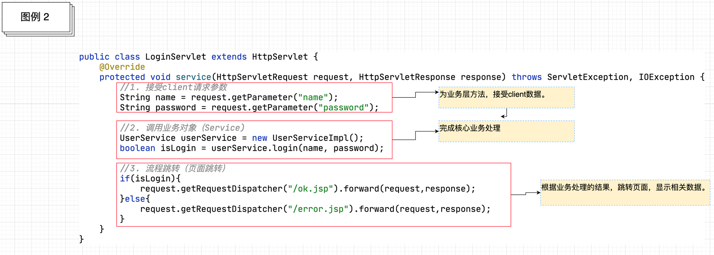

```markdown
1. 接受client请求参数
2. 调用业务对象（Service)
3. 流程跳转（页面跳转）
```

        *  **控制器存在的问题** 
            +  接受client请求参数   
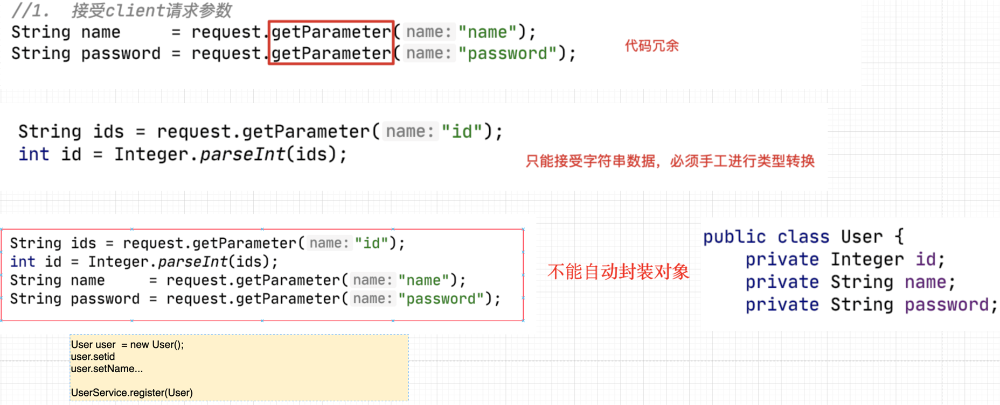	

```markdown
1. 代码冗余
2. 只能接受字符串类型的数据，需要手工进行类型转换
3. 无法自动封装对象
```

            +  调用业务对象（Service)   

```java
UserService userService = new UserServiceImpl(); //耦合代码
boolean isLogin = userService.login(name,password);
```

```markdown
1. 通过new的方式获得业务对象（service)，存在耦合
```

            +  流程跳转(页面跳转)   
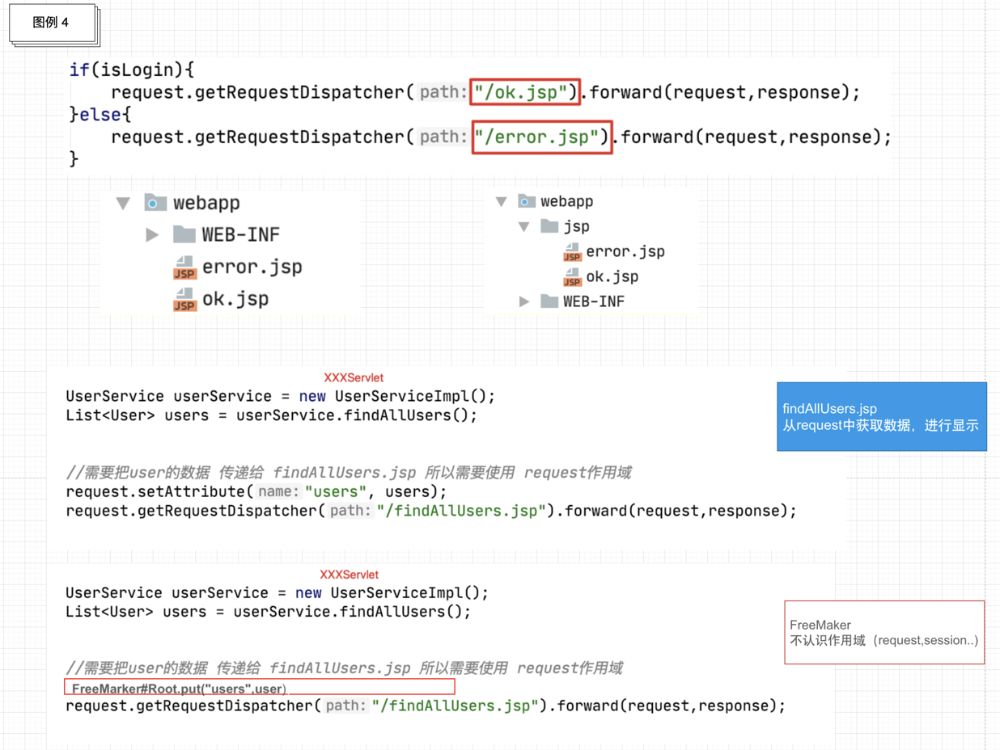

```markdown
1. 跳转路径耦合
2. 与视图层技术的耦合
```


##### 1.2  SpringMVC课程的学习要点


###### 1.2.1 SpringMVC的三种开发模式


+  **传统视图开发【基础课程讲解】**  

```markdown
1. 通过作用域（request,session)进行数据的传递。
2. 通过视图层技术进行数据的展示（JSP,FreeMarker,Thymeleaf)。
```

+  **前后端分离开发【MVC高级课程讲解】**  

```markdown
1. 多种新的请求发送方式
2. Restful的访问
3. 通过HttpMessageConverter进行数据响应
```

+  **Spring5 WebFlux开发【独立课程讲解】**  

```markdown
1. 替换传统JavaWeb开发的一种新的Web开发方式。
2. 通过NettyServer,进行Web通信。
```


###### 1.2.2 控制器开发


```markdown
1. 接受client请求参数
2. 调用业务对象
3. 流程跳转
```

### SpringMVC系列
---

#### 第二章、第一个SpringMVC程序的开发


##### 2.1 开发版本


```markdown
1. JDK1.8+
2. Maven3.6+
3. IDEA2021+
4. SpringFramework 5.1.4 
5. Tomcat8.5.29
6. MySQL5.7.18
```


##### 2.2 环境搭建


###### 2.2.1 **引入相关相关jar**


```xml
<dependency>
  <groupId>org.springframework</groupId>
  <artifactId>spring-webmvc</artifactId>
  <version>5.1.14.RELEASE</version>
</dependency>

<dependency>
  <groupId>javax.servlet</groupId>
  <artifactId>javax.servlet-api</artifactId>
  <version>3.1.0</version>
  <scope>provided</scope>
</dependency>

<dependency>
  <groupId>javax.servlet</groupId>
  <artifactId>jstl</artifactId>
  <version>1.2</version>
</dependency>

<dependency>
  <groupId>javax.servlet.jsp</groupId>
  <artifactId>javax.servlet.jsp-api</artifactId>
  <version>2.3.1</version>
  <scope>provided</scope>
</dependency>

<dependency>
  <groupId>org.springframework</groupId>
  <artifactId>spring-web</artifactId>
  <version>5.1.14.RELEASE</version>
</dependency>

<dependency>
  <groupId>org.springframework</groupId>
  <artifactId>spring-core</artifactId>
  <version>5.1.14.RELEASE</version>
</dependency>

<dependency>
  <groupId>org.springframework</groupId>
  <artifactId>spring-beans</artifactId>
  <version>5.1.14.RELEASE</version>
</dependency>

<dependency>
  <groupId>org.springframework</groupId>
  <artifactId>spring-test</artifactId>
  <version>5.1.14.RELEASE</version>
</dependency>

<dependency>
  <groupId>org.springframework</groupId>
  <artifactId>spring-tx</artifactId>
  <version>5.1.14.RELEASE</version>
</dependency>

<dependency>
  <groupId>org.springframework</groupId>
  <artifactId>spring-jdbc</artifactId>
  <version>5.1.14.RELEASE</version>
</dependency>

<dependency>
  <groupId>org.mybatis</groupId>
  <artifactId>mybatis-spring</artifactId>
  <version>2.0.2</version>
</dependency>

<dependency>
  <groupId>com.alibaba</groupId>
  <artifactId>druid</artifactId>
  <version>1.1.18</version>
</dependency>

<dependency>
  <groupId>mysql</groupId>
  <artifactId>mysql-connector-java</artifactId>
  <version>5.1.48</version>
</dependency>

<dependency>
  <groupId>org.mybatis</groupId>
  <artifactId>mybatis</artifactId>
  <version>3.4.6</version>
</dependency>

<dependency>
  <groupId>junit</groupId>
  <artifactId>junit</artifactId>
  <version>4.13</version>
  <scope>test</scope>
</dependency>

<dependency>
  <groupId>org.springframework</groupId>
  <artifactId>spring-context</artifactId>
  <version>5.1.4.RELEASE</version>
</dependency>

<dependency>
  <groupId>org.springframework</groupId>
  <artifactId>spring-aop</artifactId>
  <version>5.1.14.RELEASE</version>
</dependency>

<dependency>
  <groupId>org.aspectj</groupId>
  <artifactId>aspectjrt</artifactId>
  <version>1.8.8</version>
</dependency>

<dependency>
  <groupId>org.aspectj</groupId>
  <artifactId>aspectjweaver</artifactId>
  <version>1.8.3</version>
</dependency>

<dependency>
  <groupId>org.slf4j</groupId>
  <artifactId>slf4j-api</artifactId>
  <version>1.7.25</version>
</dependency>

<dependency>
  <groupId>org.slf4j</groupId>
  <artifactId>jcl-over-slf4j</artifactId>
  <version>1.7.25</version>
</dependency>

<dependency>
  <groupId>ch.qos.logback</groupId>
  <artifactId>logback-classic</artifactId>
  <version>1.2.3</version>
</dependency>

<dependency>
  <groupId>ch.qos.logback</groupId>
  <artifactId>logback-core</artifactId>
  <version>1.2.3</version>
</dependency>

<dependency>
  <groupId>org.logback-extensions</groupId>
  <artifactId>logback-ext-spring</artifactId>
  <version>0.1.4</version>
</dependency>

<dependency>
  <groupId>org.yaml</groupId>
  <artifactId>snakeyaml</artifactId>
  <version>1.25</version>
</dependency>
```


> **注意 SpringMVC比前面我们所学习的Spring，就多引入了一个jar包，叫做spring-webmvc.jar**
>


###### 2.2.2 配置文件


> **SpringMVC的配置文件,就是Spring的配置文件。**
>


```markdown
1. 名字可以随便命名,本次课程取名dispatcher.xml。
2. 放置路径可以根据需要，随意放置,本次课程放置在资源目录的根下。
```


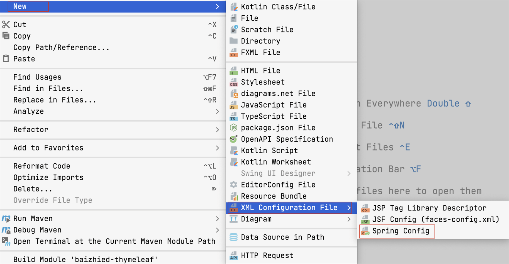


###### 2.2.3 **初始化配置**


+  **web.xml** 

```xml
<servlet>
  <servlet-name>dispatcher</servlet-name>
  <servlet-class>org.springframework.web.servlet.DispatcherServlet</servlet-class>
  <!--用于配置SpringMVC的配置文件-->
  <init-param>
    <param-name>contextConfigLocation</param-name>
    <param-value>classpath:dispatcher.xml</param-value>
  </init-param>
  <!--设置servlet在Tomcat启动时自动加载创建-->
  <load-on-startup>1</load-on-startup>
</servlet>

<servlet-mapping>
  <servlet-name>dispatcher</servlet-name>
  <url-pattern>/</url-pattern>
</servlet-mapping>
```

  
**DispatcherServlet** 

```java
1. DispatcherServlet称为前端控制器（中央控制器）
2. DispatcherServlet的核心作用：
		1. 用于创建Spring的工厂（容器）。
		   ApplicationContext ctx = new ClassPathXmlApplicationContext("dispatcher.xml");
		   因为DispatcherServlet封装的Spring工厂（容器）只能读取xml，所以无法迁移到纯注解编程
		2. 控制SpringMVC内部的运行流程。
```

  
**SpringMVC的配置文件dispacher.xml** 

```xml
<mvc:annotation-driven/>

<context:component-scan base-package="com.baizhiedu"/>
```

  
**mvc:annotation-driven** 

```xml
# <mvc:annotation-driven/> 这段配置的主要作用：引入SpringMVC的核心功能。 
# 主要引入了2个核心类型
# 1.RequestMappingHandlerMapping
# 2.RequestMappingHandlerAdapter

1. RequestMappingHandlerMapping实现了HandlerMapping接口【了解】
		它会处理@RequestMapping注解，并将其注册到请求映射表中。
2. RequestMappingHandlerAdapter实现了 HandlerAdapter接口【了解】
		它是处理请求的适配器，确定调用某个符合要求的控制器类中具体服务的方法。
```

**SpringMVC对mvc:annotation-driven的封装**  
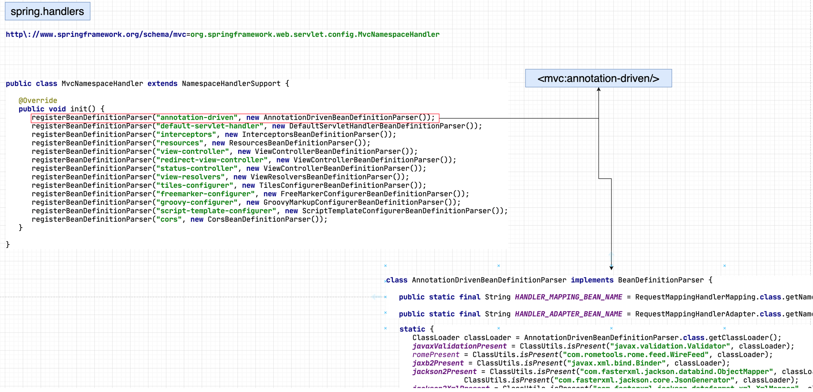  
**context:component-scan**  

```xml
<servlet>
  <servlet-name>dispatcher</servlet-name>
  <servlet-class>org.springframework.web.servlet.DispatcherServlet</servlet-class>
  <!--用于配置SpringMVC的配置文件-->
  <init-param>
    <param-name>contextConfigLocation</param-name>
    <param-value>classpath:dispatcher.xml</param-value>
  </init-param>
  <!--设置servlet在Tomcat启动时自动加载创建-->
  <load-on-startup>1</load-on-startup>
</servlet>

<servlet-mapping>
  <servlet-name>dispatcher</servlet-name>
  <url-pattern>/</url-pattern>
</servlet-mapping>
```

##### 2.3 编码开发


###### 2.3.1 思路分析
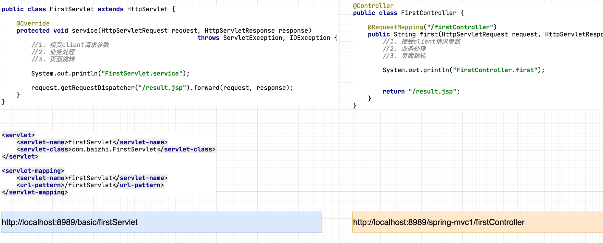


```markdown
#  基本流程
1. 开发一个类在上面加入@Controller注解
2. 提供一个控制器方法:参数是HttpServletRequest,HttpServletResponse,返回值是String的，同时加入@RequestMapping注解定义请求路径
3. 在控制方法中，完成核心开发功能，把对应JSP页面的路径，作为方法的返回值返回。
```


###### 2.3.2 编码


```java
@Controller
public class FirstController {

  @RequestMapping("/first")
  public String first(HttpServletRequest request, HttpServletResponse response) {

    System.out.println("FirstController.first");

    return "/result.jsp";
  }
}

必须要进行@Controller注解的扫描，<context:component-scan base-package="com.baizhiedu"/>
```


###### 2.3.3 一个控制器中，提供多个服务方法


+  **Servlet作为控制器，一个类中只能提供一个服务方法**   

```markdown
1. Servlet开发中，明确控制器的方法必须实现接口规定的service(HttpServletRequest,HttpServletResponse)方法，一个类中是能实现一次，所以一个类中只能有一个服务方法。
```

```java
http://localhost:8989/basic/loginServlet

public class LoginServlet extends HttpServlet {
    @Override
    protected void service(HttpServletRequest request, HttpServletResponse response) 
                                                       throws ServletException, IOException {
    
    }
}
```

+  **SpringMVC的控制器，一个类中可以提供多个对外服务的方法**   

```markdown
1. SpringMVC控制器，没有对于方法名字的限制，所以可以提供多个服务方法
```

```java
http://localhost:8989/basic/first

http://localhost:8989/basic/second

@Controller
public class FirstController {

  @RequestMapping("/first")
  public String first(HttpServletRequest request, HttpServletResponse response) {
		//第一个控制器功能
    return "/result.jsp";
  }
  
  @RequestMapping(value="/second") //在注解使用时，如果只有一个value属性的话，value属性名，可以省略。
  public String second(HttpServletRequest request, HttpServletResponse response) {
    //第二个控制器功能
    return "/result.jsp";
  }
  
}
```


###### 2.3.4 注意


```markdown
1. SpringMVC我们开发的Controller，也称之为Handler（SpringMVC内部的叫法）
```


##### 2.4 第一个程序的细节分析


###### 2.4.1 一种类型的SpringMVC控制器被创建几次


```markdown
1. 回顾:Servlet控制器被创建的次数
		一种类型的Servlet，只会被Tomcat创建一次，所以Servlet是单实例的。
		
2. Servlet是单实例并不是单例设计模式

3. SpringMVC的控制器被Spring创建的次数
		可以只创建一次，也可以创建多次，默认是只创建一次。
		控制器创建的次数，是由@Scope注解决定的。
		
4. 默认情况下SpringMVC的控制器只会被创建一次，会存在线程安全的问题。
```


###### 2.4.2 @RequestMapping注解


```java
1. 核心作用：为控制器方法提供外部访问的url路径。
  
 http://localhost:8989/basic/first

 @RequestMapping("/first")
 public String first(HttpServletRequest request, HttpServletResponse response)
```


+  **路径分割符  / 可以省略**  

```java
http://localhost:8989/spring-mvc1/first

@RequestMapping("first")
public String first(HttpServletRequest request, HttpServletResponse response) 

http://localhost:8989/spring-mvc1/first/third

@RequestMapping("first/third")
public String first(HttpServletRequest request, HttpServletResponse response) 

#注意 多级目录开头可以不写 /
```

+  **在一个控制器方法上映射多个路径**  
**应用方式**  

```java
http://localhost:8989/basic/first
http://localhost:8989/basic/third

@Controller
public class FirstController {

  @RequestMapping(value={"/first","/third"})
  public String first(HttpServletRequest request, HttpServletResponse response) {

    System.out.println("FirstController.first");

    return "/result.jsp";
  }
}
```

+  **Controller类上加入@RequestMapping注解**  
**应用方式** 

```java
http://localhost:8989/basic/user/addUser

http://localhost:8989/basic/user/deleteUser

@Controller
@RequestMapping("/user")
public class UserController {
  
    @RequestMapping("/addUser")
    public String addUser() {
        System.out.println("UserController.addUser");
        return "/index.jsp";
    }

    @RequestMapping("/deleteUser")
    public String deleteUser() {
        System.out.println("UserController.deleteUser");
        return "/index.jsp";
    }
}
```

**设计目的**  
  
**结论**  

```markdown
1. 可以更好的按照功能，进行不同模块的区分,有利于项目的管理。
```

+  **@RequestMapping限定用户的请求方式** 
    -  **请求方式** 

```java
1. 所谓请求方式指的就是Web开发中的 POST请求与GET请求
```

**回顾:Web开发中的POST请求与GET请求的区别**  
**	两种请求提交数据的区别** 

```java
1. GET请求:通过请求行(地址栏)提交数据(QueryString)，明文数据提交，不安全，提交的数据量小(不能超过2048字节)
  
		http://localhost:8989/basic/user/queryUser?name=sunshuai&password=123456

2. POST请求: 通过请求体提交数据，密文提交（不是加密，指的是一般用户不可见），相对安全，提交数据量大(理论上没有限制)
```

**	两种请求发起方式的区别**  

```java
1. GET方式
   浏览器地址栏:  http://localhost:8989/basic/firstController/first

   超级链接:     <a href="${pageContext.request.contextPath}/firstController/first">超级链接</a>

   表单:        <from action="${pageContext.request.contextPath}/firstController/first"></form>
               
   javascript: location.href=;

   ajax:       $.ajax({url:url,type:"get",...})
     
   专属工具或者库：POSTMAN、POSTWOMAN、RestfulToolKits、RestTemplate、HttpClient、OKHttp、NSMutableURLRequest

2. POST方式
   表单:       <from action="${pageContext.request.contextPath}/firstController/first" method="post"></form>

   ajax:      $.ajax({url:url,type:"post",...})
     
   专属工具或者库：POSTMAN、POSTWOMAN、RestfulToolKits、RestTemplate、HttpClient、OKHttp、NSMutableURLRequest
```

    -  **@RequestMapping限定用户的请求方式**  

```java
1. 默认情况下:@RequestMapping注解，接受所有请求方式的访问（Post,Get,....）

2. 通过@RequestMapping注解可以限定，某个控制器方法只接受特定的请求方式
		@RequestMapping(method={RequestMethod.POST})
		public String xxx(HttpServletRequest,HttpServletResponse)
		
		@RequestMapping(method={RequestMethod.GET})
		public String xxx(HttpServletRequest,HttpServletResponse)
		
3. @RequestMapping注解可以同时限定多种请求方式的访问
		@RequestMapping(method={RequestMethod.GET,RequestMethod.POST})
		public String xxx(HttpServletRequest,HttpServletResponse)

4. 当用户发起了@RequestMapping不支持的请求操作
		SpringMVC在服务器端抛出一个405错误 Method Not Allowed
```

    -  **Http协议中其他的请求方式【了解】**  

```java
1. 除常规的POST，GET请求外，Http协议还提供了其他的请求方式
		PUT、DELETE、OPTIONS...
		
2. @RequestMapping注解，默认情况下也支持其他请求方式的访问，同时也可以根据需要进行限定。
		@RequestMapping(method={RequestMethod.DELETE})
		public String xxx(HttpServletRequest,HttpServletResponse)
		
3. 除Post,Get这2种请求方式外，其他的请求方式浏览器支持的不好，可以使用专属工具或者库进行测试

4. 其他的请求方式，大多数不支持响应视图技术（JSP,Thymeleaf),只能返回简单字符串或者JSON数据。
```


###### 2.4.3 控制器方法参数


```markdown
1. SpringMVC在控制器方法参数设计的过程中，非常灵活，可以支持多种参数的设置方式，非常强大，它也把这种设计，叫做数据绑定。
```


+  **代码一**  

```java
@RequestMapping("/first")
public String first(HttpServletRequest request, HttpServletResponse response)
```

+  **代码二**  

```java
@RequestMapping("/first")
public String first(HttpServletRequest request)
```

+  **代码三**  

```java
@RequestMapping("/first")
public String first(HttpServletResponse response)
```

+  **代码四**  

```java
@RequestMapping("/first")
public String first(HttpServletRequest request, HttpServletResponse response,HttpSession session)

注意：HttpSession也可以单独使用 或者 组合使用 
     ServletContext(application) 不能应用在控制器方法中，做形参
  	 session.getServletContext();
		 request.getSession().getServletContext();
```

+  **代码五**   
**思考：**  

```java
@RequestMapping("/first")
public String first()
```

```markdown
1. 上述五种代码形式,在后续开发中，那种更加常用？
		前四种不推荐的原因是：与Servlet API 解耦合。
		第五种不推荐的原因是：单纯这种方式使用，无法接受client的请求参数
		
		后续的课程中，还会进行详细讲解
```


###### 2.4.4 视图解析器（页面跳转）


+  **目前页面跳存在的问题**   
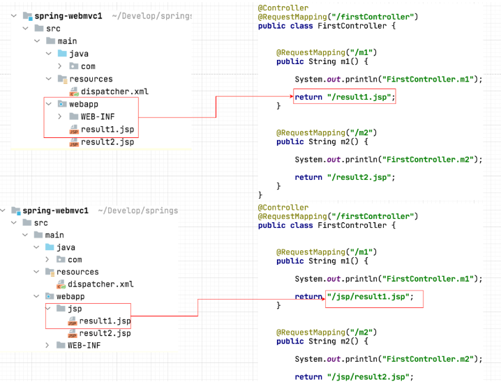

```markdown
1. 控制器中的跳转路径与实际视图路径存在耦合。
```

+  **视图解析器ViewResolver**  

```markdown
1. 通过视图解析器(ViewResolver)，就可以解决跳转路径与实际视图路径耦合的问题。
```

    -  **思路分析**  
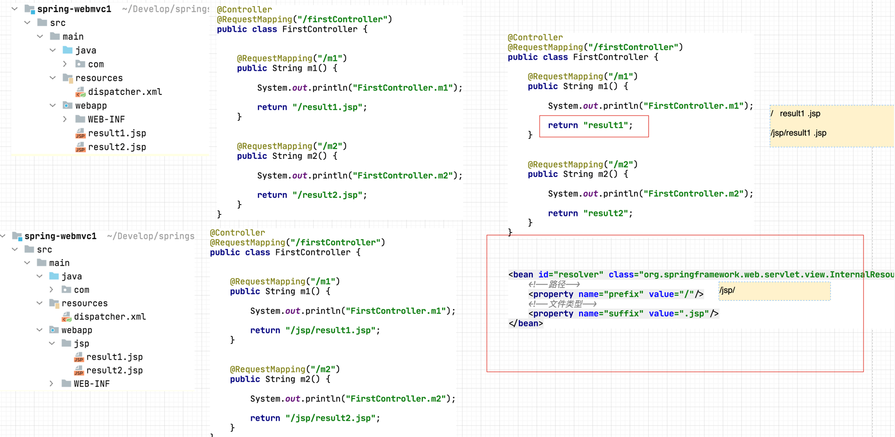
    -  **开发步骤**  
**配置文件开发**   
**注解开发**  

```java
<bean id="resolver" class="org.springframework.web.servlet.view.InternalResourceViewResolver">
     <!--路径-->
     <property name="prefix" value="/"/>
     <!--文件类型-->
     <property name="suffix" value=".jsp"/>
</bean>

@Controller
public class FirstController {

  @RequestMapping("/first")
  public String first(HttpServletRequest request, HttpServletResponse response) {

    System.out.println("FirstController.first");

    return "result"; //实际处理时 SpringMVC就会把视图解析器与控制器方法中的逻辑视图名进行拼接 / result .jsp
  }
}
```

```java
@Configuration
public class AppConfig {
    @Bean
    public ViewResolver viewResolver() {
        InternalResourceViewResolver viewResolver = new InternalResourceViewResolver();
        viewResolver.setPrefix("/");
        viewResolver.setSuffix(".jsp");
        return viewResolver;
    }
}

注意：
     1. AppConfig配置Bean应该放置到<context:component-scan/> 扫描的路径下。
     2. 结合前面所讲，目前因为DispatcherServlet封装的Spring工厂（容器）只能读取xml，所以无法进行纯注解替换。
```


###### 2.4.5 SpringMVC配置文件的默认设置【了解】


```xml
1. 如果在web.xml中没有设置SpringMVC配置文件的的路径,系统会查找默认配置文件
	 <servlet>
     <servlet-name>dispatcher</servlet-name>
     <servlet-class>org.springframework.web.servlet.DispatcherServlet</servlet-class>
     <!--
     <init-param>
       <param-name>contextConfigLocation</param-name>
       <param-value>classpath:dispatcher.xml</param-value>
     </init-param>
     -->
     <load-on-startup>1</load-on-startup>
   </servlet>
   <servlet-mapping>
     <servlet-name>dispatcher</servlet-name>
     <url-pattern>/</url-pattern>
   </servlet-mapping>

2. SpringMVC默认配置文件的名字，放置位置是
   /WEB-INF/[servlet-name]-servlet.xml
   
   根据上述配置:SpringMVC配置文件的默认名字是
   /WEB-INF/dispatcher-servlet.xml
```


###  SpringMVC系列
---

#### 第三章、SpringMVC控制器开发详解 一


##### 3.1 核心要点


>  
>
> 1. **接受客户端(client)请求参数 [讲解]**
> 2. **调用业务对象**
> 3. **页面跳转**
>
>  
>


##### 3.2 控制器接受客户端(client)请求参数详解


###### 3.2.1 回顾：Web开发中如何接受Client请求参数


###### 3.2.2 基于Servlet API接受Client请求参数


```java
 String name     = request.getParameter("name");
 String password = request.getParameter("password");


@Controller
@RequestMapping("/param")
public class ParamController {

    @RequestMapping("/param1")
    public String param1(HttpServletRequest request, HttpServletResponse response) {

        String name     = request.getParameter("name");
        String password = request.getParameter("password");

        return "param1";
    }
}

注意：这种方式虽然最为直观、简单、但是代码冗余多且与ServletAPI存在耦合，所以在SpringMVC开发中并不建议使用。
```


###### 3.2.3 基于简单变量接受Client请求参数


```markdown
1. 所谓简单变量：指的就是8种基本类型+String这些类型的变量。把这些类型的变量，作为控制器⽅法的形参，⽤于接受client提交的数据。
```


+  **思路分析**  

+  **代码**  

```java
@Controller
@RequestMapping("/param")
public class ParamController {
  
    @RequestMapping("/param2")
    public String param2(String name, String password) {

        return "param2";
    }
  
}
```

+  **细节分析** 
    -  **常见类型自动转换**   

```java
客户端请求：http://localhost:8989/springmvc1/param/param2?name=sunshuai&age=10 

HTTP协议：传递的是 name "sunshuai" age "10"

@Controller
@RequestMapping("/param")
public class ParamController {
  
    @RequestMapping("/param2")
    public String param2(String name, int age) {

      
        return "param2";
    }
  
}

SpringMVC底层针对于age接受数据时会自动调用 int age = Integer.parseInt("10");
```

```markdown
1. 常见类型泛指：8种基本类型及其包装器，String等常见类型。
2. Date日期等特殊类型，默认不支持，需要程序员自定义类型转换器【后续讲解】
```

    -  **基本类型尽量使用包装器**  

```java
客户端请求：http://localhost:8989/springmvc1/param/param2?name=sunshuai&age=10

          http://localhost:8989/springmvc1/param/param2?name=sunshuai 

@Controller
@RequestMapping("/param")
public class ParamController {
  
    @RequestMapping("/param2")
    public String param2(String name, int age) {

      
        return "param2";
    }
  
}

程序报错：原因在于age参数。age在提交数据时没有提交内容，等同于null。而参数中age使用了int类型，是基本类型，无法存储null值，所以产生了错误。
改正方式：
         1. age参数使用包装器类型，可以存储null值
       2. 为age参数设置默认值，但是需要@RequestParam注解配合使用。【后续讲解】
```


###### 3.2.4 基于POJO类型接受Client请求参数


+  **什么是POJO**  

```markdown
1. POJO全程叫做Plain Ordinary Java Object（简单的Java对象)
2. POJO类型对象的特点是：
		1. 类型中如果存在成员变量，必须提供set get方法。
		2. 提供默认无参构造
		3. 可以实现Serializable，也可以不实现
		4. 不实现容器或者框架所规定的接口
3. 用户根据业务封装的实体、DTO这些类型就是POJO。
```

+  **使用场景**

  


+  **代码**  

```java
public class User implements Serializable {
    private String name;
    private String password;
    private Integer age;
}

@RequestMapping("/param3")
public String param3(User user) {

  return "param3";
}

http://localhost:8989/springmvc1/xxController?name=suns&password=123456&age=10

<a href="/springmvc1/xxxController?name=suns&password=123456&age=10">发送请求</a>
  
姓名: <input type="text"     name="name"/>
密码: <input type="password" name="password'/>
年龄: <input type="text"     name ="age"/>
  
POJO的成员变量的名字要和请求参数的key或者表单name属性的值严格对应。
```

+  **注意1**  

```java
http://localhost:8989/springmvc1/xxxController?name=sunshuai&password=123456&age=10

@RequestMapping("/param3")
public String param3(String name,User user) {

  return "param3";
}

name形参与user对象中的name属性，都会获取对应的内容。这个特点在后续学习前端后端分离开发时，是会使用。
```

+  **注意2**  

```markdown
1. 如果SpringMVC发现控制器形参类型，是8种基本类型+String的话，他会通过形参名与请求参数的key对应，接受数据。
2. 如果SpringMVC发现控制器形参类型，不是8种基本类型+String的话，他会查找对应形参类型的属性名与请求参数的key对应，接受数据
3. 如果存在自定义类型转换器不适用于上述规律 【后续讲解】
```


###### 3.2.5 接受一组简单变量的请求参数


+  **使用场景**

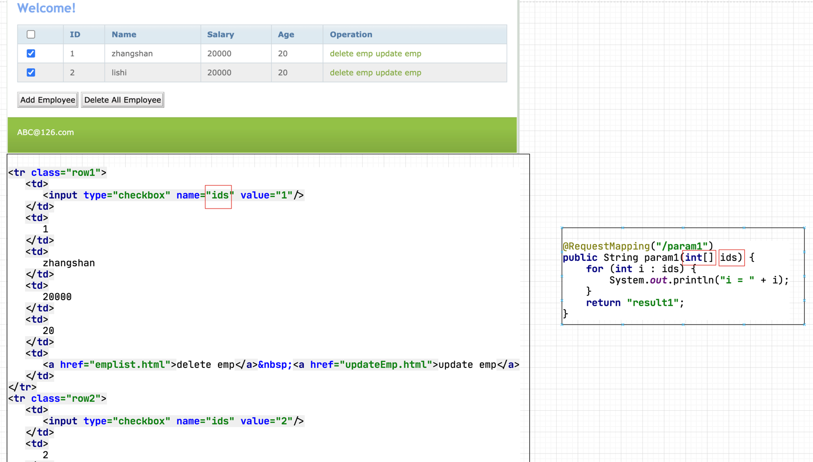

+  **代码**  

```java
@RequestMapping("/param1")
public String param1(int[] ids) {
  for (int i : ids) {
    System.out.println("i = " + i);
  }
  return "result1";
}
```

+  **细节分析**  

```java
@RequestMapping("/param1")
public String param1(List<Integer> ids) {
  for (Integer id : ids) {
    System.out.println("id = " + id);
  }
  return "result1";
}

抛出异常：SpringMVC无法提供具体的实现类，实例化形参。
  
@RequestMapping("/param1")
public String param1(ArrayList<Integer> ids) {
  for (Integer id : ids) {
    System.out.println("id = " + id);
  }
  return "result1";
}

没有异常，但是接受不到数据：SpringMVC会按照POJO的匹配方式，进行成员变量查找。
```


###### 3.2.6 接受一组POJO类型对象的请求参数


+  **使用场景**  

+  **代码**  

```java
<form action="${pageContext.request.contextPath}/param/param1" method="post">
  userName1:<input type="text" name="users[0].name"/>    <br/>
  password1:<input type="text" name="users[0].password"/><br/>
  age1      <input type="text" name="users[0].age"/>     <br/>
  <hr/>
  userName2<input type="text"  name="users[1].name"/>     <br/>
  password2<input type="text"  name="users[1].password"/> <br/>
  age2     <input type="text"  name="users[1].age"/>      <br/>
    
  <input type="submit" value="reg"/>
</form>


public class UsersDTO {
  private List<User> users = new ArrayList<>();

  public List<User> getUsers() {
    return users;
  }

  public void setUsers(List<User> users) {
    this.users = users;
  }
}
      
@RequestMapping("/param1")
public String param1(UsersDTO usersDTO) {
  
  List<User> users = usersDTO.getUsers();
  
  for (User user : users) {
    System.out.println("user = " + user);
  }
  
  return "param1";
}
```


##### 3.3 接受Client请求参数的总结
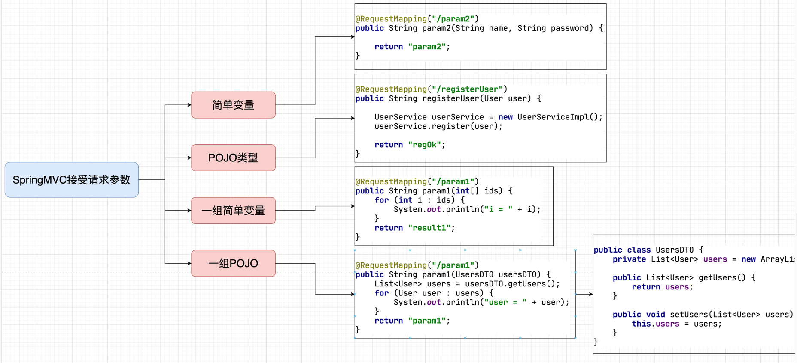


##### 3.4 @RequestParam注解


```java
1.	@RequestParam注解：用于修饰控制器方法的形参。
  
    @RequestMapping("/param1")
    public String param1(@RequestParam String name,@RequestParam String password){
  
		}
```


###### 3.4.1 @RequestParam注解详解


+  **解决请求参数与方法形参名字不一致的问题**  

```java
http://localhost:8989/springmvc1/paramContrller/param?n=sunshuai&p=123456

<a href="/springmvc1/paramController/param?n=sunshuai&p=123456">点击</a>
  
<form action="/springmvc1/paramController/param" method="post">
   username：<input type="text"    name="n"/>
   password: <input type="password" name="p"/>
</form>
     
@RequestMapping("/param1")
public String param1(@RequestParam（"n") String name,@RequestParam("p") String password){

}
```

+  **注意**  

```java
1.  @RequestParam注解简写形式：不书写value属性的内容，@RequestParam默认会把对应形参名作为value属性的值。
    @RequestMapping("/param1")
    public String param1(@RequestParam("n") String name,@RequestParam("p") String password){

    }
    @RequestMapping("/param1")
    public String param1(@RequestParam String name,@RequestParam String password){

    }
  
2. 	使用了@RequestParam注解的形参，客户端必须传递数据，不能省略。否则报错。后面的相关知识点可以解决这个问题。
  
3. 	POJO类型的形参，不能与@RequestParam注解联用。
		报400错误
  
4.	典型的应用场景
    http://localhost:8989/springmvc1/paramContrller/param1?id<=10
    @RequestMapping("/param1")
    public String param1(@RequestParam（"id<") Integer id) {

    }
    在前后端分离的开发中会涉及的到
```

+  **@RequestParam的required属性**  

```markdown
1.	在使用@RequestParam注解时，可以应用required属性。
		required = true时：@RequestParam修饰的控制器方法参数，客户端必须提交数据，否则报错，默认值
		required = false时:@RequestParam修饰的控制器方法参数，客户端可以传递数，也可以不传递。
		
2.	解决使用@RequestParam注解，客户端必须传递数据的问题。
```

+  **@RequestParam的defaultValue属性** 
    -  **客户端没有提交数据的时候，给对应的形参提供默认值**  

```java
http://localhost:8989/springmvc1/paramContrller/param1?name=sunshuai

@RequestMapping("/param1")
public String param1(@RequestParam String name, @RequestParam(defaultValue = "99999") String password) {
  System.out.println("name = " + name);
  System.out.println("password = " + password);
  return "param1";
}

注意：如果使用了defaultValue,则required属性也默认被设置成了false
```

    -  **解决控制器方法形参，使用包装器的问题**  

```java
客户端请求：http://localhost:8989/springmvc1/param/param2?name=sunshuai 

@Controller
@RequestMapping("/param")
public class ParamController {
  
    @RequestMapping("/param2")
    public String param2(String name, int age) {

      
        return "param2";
    }
  
}

解决方案1：
@Controller
@RequestMapping("/param")
public class ParamController {
  
    @RequestMapping("/param2")
    public String param2(String name, Integer age) {

      
        return "param2";
    }
  
}

解决方案2：
@Controller
@RequestMapping("/param")
public class ParamController {
  
    @RequestMapping("/param2")
    public String param2(String name, @RequestParam(defaultValue = "0") int age) {

      
        return "param2";
    }
  
}
```

    -  **defaultValue典型的使用场景**  

```java
默认值操作，一个典型的应用场景是：分页首页查询，不传页号的设计

http://localhost:8989/ems/employee/findAllEmployees
http://localhost:8989/ems/employee/findAllEmployees?pageNum=2
http://localhost:8989/ems/employee/findAllEmployees?pageNum=3

@RequestMapping("/findAllEmployees")
public String findAllEmployees(Model model, @RequestParam(value = "pageNum",defaultValue = "1") Integer pageNum)
```


##### 3.5 中文请求参数的乱码问题


###### 3.5.1 回顾JavaWeb开发中中文乱码的解决方案


+  **GET请求乱码的解决方案**  

```java
http://localhost:8989/springmvc1/paramContrller/param?name=孙帅&p=123456


TOMCAT8以前版本:

$TOMCAT_HOME/conf/server.xml

<Connector port="8080" protocol="HTTP/1.1"
           connectionTimeout="20000"
           redirectPort="8443"
           URIEncoding="UTF-8"/>

TOMCAT8版本及后续版本:

Tomcat8及其后续版本中，修改了Connector相关源码，已经默认支持UTF-8字符集。但是如果使用GBK还需要上述配置
```

+  **POST请求乱码的解决方案**  

```java
<form action="/springmvc1/paramController/param" method="post">
     username：<input type="text"     name="name"/>
     password: <input type="password" name="password"/>
</form>
       
底层解决方案：
       request.setCharaceterEncoding("UTF-8")
       
开发常用方式：
       通过过滤器解决
       
 public class EncodingFilter implements Filter {
  
    @Override
      public void doFilter(ServletRequest req,ServletResponse resp,FilterChain chain){
        HttpServletRequest request = (HttpServletRequest) req;
          request.setCharacterEncoding("UTF-8");
      }
}
```


##### 3.6 SpringMVC的类型转换器


###### 3.6.1 SpringMVC中的内置类型转换器


+  **分析**  

+  **内置类型转换器的概念**  

```markdown
1.	SpringMVC提供了内置类型转换器，把客户端提交的字符串类型的请求参数，转换成控制器方法参数需要的数据类型。

2.  SpringMVC并不是对于所有的类型，都提供了内置的类型转换器，他只是提供了常见类型的转换器
				比如：8种基本类型，常见的集合类型等
```

+  **原理分析**  
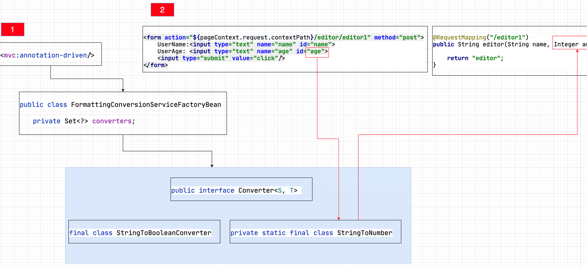

```markdown
1. 在SpringMVC启动时，会通过<mvc:annotation-driven/> 把FormattingConversionServiceFactoryBean。引入到SpringMVC体系中。FormattingConversionServiceFactoryBean存储了SpringMVC中所有的内置类型转换器。后续client提交请求参数时，如果对应控制器方法形参不是字符串类型，那么FormattingConversionServiceFactoryBean就会调用对应的类型转化器，进行类型转换，最终完成控制器方法形参的赋值。
```


###### 3.6.2 SpringMVC中自定义类型转换器


```markdown
1. SpringMVC在接受客户端提交请求参数时，如果请求参数对应的控制器方法形参，是非常规数据类型，SpringMVC默认情况下无法进行类型转换。会抛出异常，程序员可以通过自定义类型转换器解决上述问题。
		如：日期类型
```


+  **思路分析**  

+  **编码**  

```java
public class DateConverter implements Converter<String, Date> {
  @Override
  public Date convert(String source) {
    Date result = null;
    try {
      SimpleDateFormat simpleDateFormat = new SimpleDateFormat("yyyy-MM-dd");
      result = simpleDateFormat.parse(source);
    } catch (ParseException e) {
      e.printStackTrace();
    }
    return result;
  }
}

<!--配置类型转换器，让Spring进行对象的创建-->
<bean id="converter" class="com.baizhiedu.DateConverter">
</bean>

<!--进行类型转换器注册，让SpringMVC能够识别日期类型转换的类型转换器-->
<bean id="formattingConversionService" class="org.springframework.format.support.FormattingConversionServiceFactoryBean">
  <property name="converters">
    <set>
      <ref bean="converter"/>
    </set>
  </property>
</bean>

<mvc:annotation-driven conversion-service="formattingConversionService"/>
  
  
<!--上述第一步 第二步写法 还可以合二为一-->
<bean id="formattingConversionService" class="org.springframework.format.support.FormattingConversionServiceFactoryBean">
  <property name="converters">
    <set>
       <bean id="converter" class="com.baizhiedu.DateConverter"/>
    </set>
  </property>
</bean>
```


##### 3.7 接受其他请求数据


###### 3.7.1 动态参数收集


+  **分析**  

```java
http://localhost:8989/param/param2/param1?name=sunshuai
http://localhost:8989/param/param2/param1?name=xiaohei

@RequestMapping("/param10")
public String param10(String name) {

  return "param1";
}
```

+  **单值动态参数收集**  

```java
http://localhost:8989/param/param2/param1?name=sunshuai
http://localhost:8989/param/param2/param1?age=10


@RequestMapping("/param10")
public String param10(@RequestParam Map<String, String> param) {

  return "param1";
}

注意：如果需要接受动态参数，必须保证Map的形参前面加入@RequestParam注解，否则接受不到数据。
```

+  **多值动态参数收集**  

```java
http://localhost:8989/param/param10?id=1&id=2&id=3

第一种解决思路：
  
@RequestMapping("/param1")
public String param1(int[] id) {
  for (int i : ids) {
    System.out.println("i = " + i);
  }
  return "result1";
}

问题：
http://localhost:8989/param/param10?id=1&id=2&id=3
http://localhost:8989/param/param10?name=sunshuai1&name=sunshuai2&name=sunshuai3

第二种解决思路：

@RequestMapping("/param11")
public String param11(@RequestParam MultiValueMap<String, String> params) {

  System.out.println("ParamController.param11");

  return "param1";
}
```

+  **典型应用场景**  
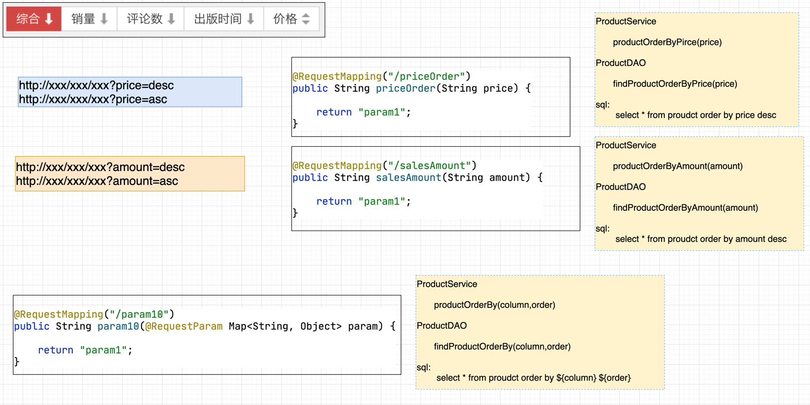


###### 3.7.2 接受cookie数据


+  **Servlet中获取的方式**  

```java
#Cookie创建的代码
Cookie cookie = new Cookie("name","value");

#核心代码
Cookie[] cookies = request.getCookies();
for (Cookie cookie : cookies) {
  if ("cookieName".equals(cookie.getName())) {
    System.out.println("cookie.getValue() = " + cookie.getValue());
  }
}
```

+  **SpringMVC中获取Cookie**  

```java
@RequestMapping("/other1")
public String other1(HttpServletRequest request) {
  Cookie[] cookies = request.getCookies();
  for (Cookie cookie : cookies) {
    if ("name".equals(cookie.getName())) {
      System.out.println("cookie.getValue() = " + cookie.getValue());
    }
  }
  return "other1";
}

# 第一种基于Servlet API获取Cookie，存在与Servlet API的耦合问题，不建议后续使用
  

@RequestMapping("/other2")
public String other2(@CookieValue("name") String cookieValue) {
  System.out.println("OtherController.other1 "+cookieValue );
  return "other2";
}
```


###### 3.7.3 接受请求头数据


+  **什么是请求头**  

```markdown
1. 	Http协议规定：客户端浏览器在发起请求时，除了提交数据外，还会通过请求头向服务器端提交一些额外的附加息。
		比如语言信息，浏览器的版本，客户端操作系统类型，是否缓存数据等信息。

2.  在后续的开发中，特殊场景下，甚至会自定义请求头携带一些特殊数据。
```

+  **获取请求头的方式** 
    -  **Servlet中的获取方式**  

```java
#核心代码
String value = request.getHeader("key");
```

    -  **SpringMVC中的获取方式**  

```java
@RequestMapping("/other3")
public String other3(HttpServletRequest request) {
  String host = request.getHeader("host");
  System.out.println("host = " + host);
  return "other3";
}

# 第一种基于Servlet API获取请求头，存在与Servlet API的耦合问题，不建议后续使用

@RequestMapping("/other4")
public String other4(@RequestHeader("host") String host) {
  System.out.println("@RequestHeader host = " + host);
  return "other4";
}
```

### SpringMVC系列
---

#### 第四章、SpringMVC控制器开发详解 二


##### 4.1 核心要点


>  
>
> 1. **接受客户端(client)请求参数 [讲解完毕]**
> 2. **调用业务对象[讲解]**
> 3. **页面跳转**
>
>  
>


##### 4.2 SpringMVC控制器调用业务对象【SSM整合】
###### 4.2.1 核心思路分析
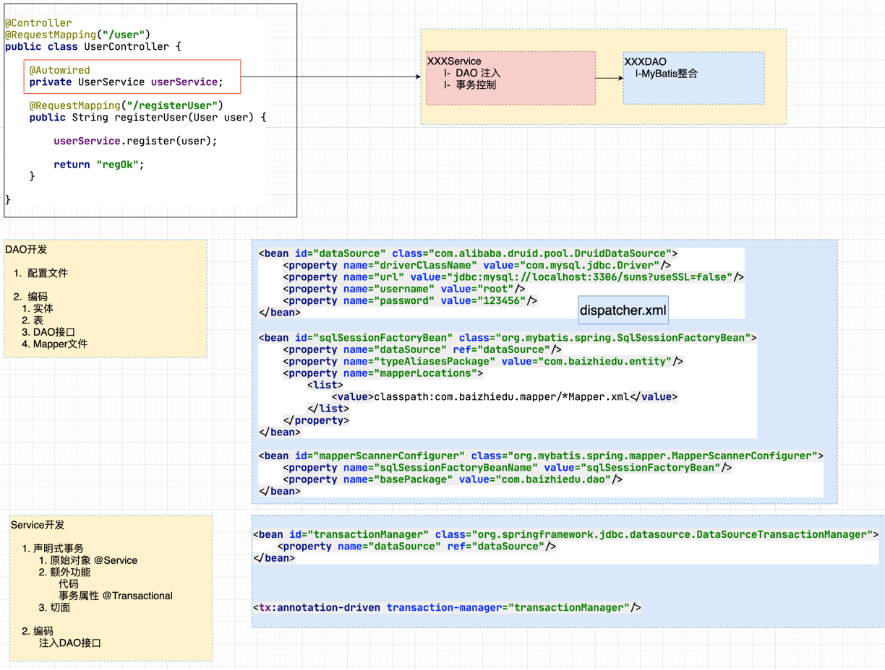


###### 4.2.2 编码


+  **dispatcher.xml**  

```xml
<context:component-scan base-package="com.baizhiedu"/>

<mvc:annotation-driven/>

<bean id="resolver" class="org.springframework.web.servlet.view.InternalResourceViewResolver">
  <!--路径-->
  <property name="prefix" value="/jsp/"/>
  <!--文件类型-->
  <property name="suffix" value=".jsp"/>
</bean>

<bean id="dataSource" class="com.alibaba.druid.pool.DruidDataSource">
  <property name="driverClassName" value="com.mysql.jdbc.Driver"/>
  <property name="url" value="jdbc:mysql://localhost:3306/suns?useSSL=false"/>
  <property name="username" value="root"/>
  <property name="password" value="123456"/>
</bean>

<bean id="sqlSessionFactoryBean" class="org.mybatis.spring.SqlSessionFactoryBean">
  <property name="dataSource" ref="dataSource"/>
  <property name="typeAliasesPackage" value="com.baizhiedu.entity"/>
  <property name="mapperLocations">
    <list>
      <value>classpath:com.baizhiedu.mapper/*Mapper.xml</value>
    </list>
  </property>
</bean>

<bean id="mapperScannerConfigurer" class="org.mybatis.spring.mapper.MapperScannerConfigurer">
  <property name="sqlSessionFactoryBeanName" value="sqlSessionFactoryBean"/>
  <property name="basePackage" value="com.baizhiedu.dao"/>
</bean>

<bean id="transactionManager" class="org.springframework.jdbc.datasource.DataSourceTransactionManager">
  <property name="dataSource" ref="dataSource"/>
</bean>

<tx:annotation-driven transaction-manager="transactionManager"/>
```

+  **DAO**  

```java
public class User{
  private Integer id;
  private String name;
  private String password;
  set get  
}

create table t_user(
    id integer primary key auto_increment,
    name varchar(12),
    password varchar(12)
);


public interface UserDAO {
    public void save(User user);
}

<mapper namespace="com.baizhiedu.dao.UserDAO">
   <insert id="save" parameterType="User">
       insert into t_user (name,password) values (#{name},#{password})
   </insert>
</mapper>
```

+  **Service**  

```java
public interface UserService {
    public void register(User user);
}

@Service
@Transactional
public class UserServiceImpl implements UserService {

    @Autowired
    private UserDAO userDAO;

    @Override
    public void register(User user) {
        userDAO.save(user);
    }
}
```

+  **Controller**  

```java
@RequestMapping("/user")
public class UserController {

    @Autowired
    private UserService userService;

    @RequestMapping("/addUser")
    public String addUser(User user) {

        userService.register(user);

        return "addUser";
    }
}
```


> 更新: 2022-01-12 22:10:04  
> 原文: <https://www.yuque.com/u12209896/it1egr/cdvr8w>