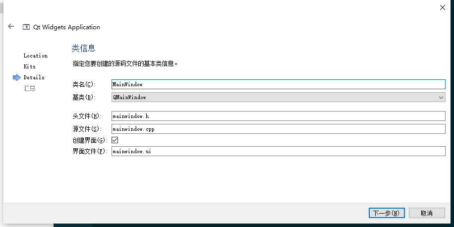
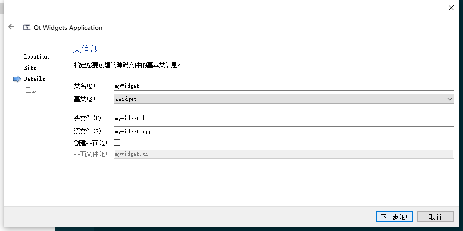

# 1 QPushButton

# 创建QT程序


QWidget 有两个子类: QMainWindow 和 QDialog . QWidget 这里会创建 .h 和 .cpp 。



# QPushButton 的使用
Header： #include<QPushButton>

qmake： QT += network

父类是 QAbstractButton ,

QAbstractButton 的父类是 QWidget，QWidget 的父类是 QObject。

```cpp
#include "mywidget.h"
#include <QApplication>

int main(int argc, char *argv[])
{
    // a 应用程序对象，在Qt中，应用程序对象有且仅有一个
    QApplication a(argc,argv);
    //窗口对象 myWidget父类 -> QWidget
    myWidget w;
    //窗口对象 默认不会显示，必须调用 show 方法显示窗口
    w.show();
    //让应用程序对象进入消息循环
    //让代码阻塞到这行
    return a.exec();
}

```

```cpp
#include "mywidget.h"
#include <QPushButton>


myWidget::myWidget(QWidget *parent)
    : QWidget(parent)
{
    //创建第一个按钮
    QPushButton * btn  = new QPushButton;
    //btn->show();//以顶层的方式弹出窗口控件
    //让btn对象依赖在 myWidget窗口中
    btn->setParent(this);
    //显示文本
    btn->setText("第一个按钮");

    //创建第二个按钮,按照控件的大小创建窗口
    QPushButton * btn2 = new QPushButton("第二个按钮",this);

    //移动btn2窗口
    btn2->move(100,100);

    //重置窗口大小
    resize(600,400);

    //设置固定窗口大小
    setFixedSize(600,400);

    //设置窗口标题
    setWindowTitle("第一个窗口");
}
```

# 按钮控件常用 API 
创建：`QPushButton *btn = new QPushButton;`

设置父亲： `setParent(this);`

设置文本： `setText("文字");`

设置位置：`move(宽，高);`

重置窗口大小：`resize(600,400);`

设置固定窗口大小：`setFixedSize(600,400);`

设置窗口标题：`setwindowTitle("第一个窗口");`


> 更新: 2023-08-03 20:23:25  
> 原文: <https://www.yuque.com/xiaoshan_wgo/codingnotes/ugdmswecvqtk0g1r>