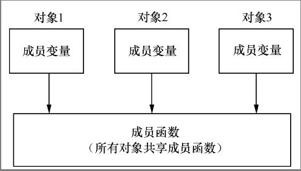
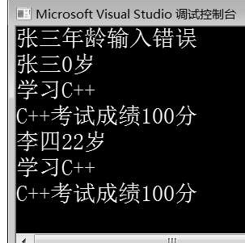
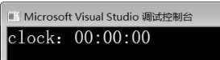
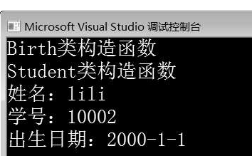
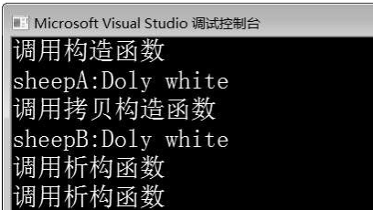
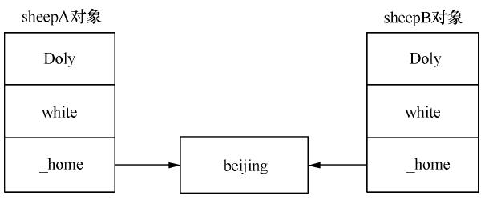

# 2 类和对象

# 1 类
类是对象的抽象，是一种自定义数据类新，它用于描述一组对象的共同属性和行为。

```cpp
class Student       //定义学生类Student 
{ 
public:        //公有权限 
 void study();      //声明表示学习的成员函数 
 void exam();         //声明表示考试的成员函数 
private:        //私有权限 
 string _name;      //声明表示姓名的成员变量 
 int _age;       //声明表示年龄的成员变量 
};
```

上述代码定义了一个简单的学生类Student，该类中有_nam e、_age两个成员变量，它们是类的私有成员；除了成员变量，该类还定义了study()和exam()两个成员函数，它们是类的公有成员。通常情况下，类的成员函数在类中声明，在类外实现。在类外实现成员函数，必须在返回值之后、函数名之前加上所属的类作用域，即“类名::”，表示函数属于哪个类。在类外实现成员函数的格式如下所示：

```cpp
返回值类型 类名::函数名称(参数列表) 
{ 
    函数体 
} 
}
```

在类外实现类Student的成员函数，示例代码如下所示:

```cpp
void Student::study()     //类外实现study()成员函数 
{ 
    cout << "学习C++" << endl; 
} 
void Student::exam()     //类外实现exam()成员函数 
{ 
    cout << "C++考试成绩100分" << endl; 
}
```

如果函数名前没有类名和作用域限定符“::”，则函数不是类的成员函数，而是一个普通的函数。

public（公有类型）：被public修饰的成员也称为公有成员。公有成员是类的外部接口，可以被所属类的成员函数、类对象、派生类对象、友元函数、友元类访问。

protected（保护类型）：被protected修饰的成员称为保护成员，其访问权限介于私有和公有之间，可以被所属类的成员函数、派生类对象、友元类和友元函数访问。

private（私有类型）：被private修饰的成员称为私有成员，只能被所属类的成员函数、友元函数、友元类访问。

# 2 对象
定义了类，就相当于定义了一个数据类型。类与int、char等数据类型的使用方法是一样的，可以定义变量，使用类定义的变量通常称为该类的对象。对象的定义格式：类名 对象名；

在上述格式中，对象的命名遵循标识符的命名规范。下面创建一个表示学生类Student的对象，示例代码：Student stu；

上述代码中，创建了类的对象stu之后，系统就要为对象分配内存空间，用于存储对象成员。每个对象都有成员变量和成员函数两部分内容。

成员变量标识对象的属性，比如创建两个Student类对象stu1和stu2，由于两个学生的姓名、性别、年龄都不同，因此在创建对象时应当为每个对象分配独立的内存空间存储成员变量的值。

成员函数描述的是对象的行为，每个对象的行为都相同，比如学生对象stu1和stu2都具有学习、考试行为。如果为每个对象的成员函数也分配不同的空间，则必然造成浪费。

因此，C++用同一块空间存放同类对象的成员函数代码，每个对象调用同一段代码。对象与成员之间的内存分配示意图如图：



为对象分配了内存空间之后，就可以向这块内存空间中存储数据了。存储数据的目的是访问数据，即访问对象的成员。对象的成员变量和成员函数的访问可以通过“。”运算符实现，其格式如下所示：

```cpp
对象名.成员变量 
对象名.成员函数
```

在上述格式中，通过“。”运算符既可以访问对象的成员变量也可以调用对象的成员函数。下面通过案例演示类的定义、对象的创建及对象的成员访问，如下所示：

```cpp
 1  #include<iostream> 
 2  using namespace std; 
 3 class Student       //定义学生类Student 
 4  { 
 5 public:        //公有类型 
 6       void study();       //声明表示学习的成员函数 
 7       void exam();           //声明表示考试的成员函数    
 8       string _name;       //声明表示姓名的成员变量 
 9       int _age;        //声明表示年龄的成员变量 
 10 }; 
 11 void Student::study()     //类外实现study()成员函数 
 12 { 
 13      cout << "学习C++" << endl; 
 14 } 
 15 void Student::exam()     //类外实现exam()成员函数 
 16 { 
 17      cout << "C++考试成绩100分" << endl; 
 18 } 
 19 int main() 
 20 { 
 21      Student stu;       //创建Student类对象stu 
 22      stu._name = "张三";     //设置对象stu的姓名 
 23      stu._age = -20;      //设置对象stu的年龄 
 24      cout << stu._name << stu._age << "岁" << endl; 
 25      stu.study();       //调用study()成员函数 
 26      stu.exam();      //调用exam()成员函数 
 27      return 0; 
 28 }
```


第3～10行代码定义了学生类Student，该类中有两个公有成员变量_nam e和_age，分别表示学生的姓名和年龄，有两个公有成员函数study()和exam()。

第11～18行代码是在类外实现类的成员函数。

第21～23行代码，在m ain()函数中创建Student类对象stu，并设置对象stu的_nam e和_age值。

第24～26行代码通过对象stu调用对象的成员函数，输出对象stu的信息。

由运行结果可知，程序成功创建了对象stu，并输出了对象stu的信息。

:::color3
类是自定义数据类型，与基本数据类型的使用方式相同，也可以使用new创建类对象。例如，例2-1定义的Student类，可以使用new创建Student类对象，示例代码如下所示：

:::

```cpp
Student* ps = new Student;      //使用new创建类对象 
//…其他功能代码 
delete ps;         //使用delete释放对象 
```

# 3 封装
C++ 中的封装是通过类实现的，通过类把具体事物抽象为一个由属性和行为结合的独立单位，类的对象会表现出具体的属性和行为。

在类的封装设计中通过权限控制方式实现类成员的访问，目的是隐藏对象的内部实现细节，只对外提供访问的接口。

在上面的例子中，第 23 行代码将对象 stu 的年龄值设置为 120，这在语法上不会有任何问题，程序可以正常运行，但在现实生活中明显不合理。

为了避免这种情况，在设计类时，要控制成员变量的访问权限，不允许外界随意访问。

通过权限控制符可以限制外界对类的成员变量的访问，将对象的状态信息隐藏在对象内部，通过类提供的函数（接口）实现对类中成员的访问。

在定义类时，将类中的成员变量设置为私有或保护属性，即使用 private 或 protected 关键字修饰成员变量。使用类提供的公有成员函数（public 修饰的成员函数），如用于获取成员变量值的 getXxx() 函数和用于设置成员变量值的 setXxx() 函数，操作成员变量的值。

下面修改，使用 private 关键字修饰类的成员变量，并提供相应的成员函数访问类的成员变量：

```cpp
 1  #include<iostream> 
 2  using namespace std; 
 3 class Student       //定义学生类Student 
 4  { 
 5 public:        //公有类型 
 6       void study();       //声明表示学习的成员函数 
 7       void exam();           //声明表示考试的成员函数 
 8       void setName(string name);   //声明设置姓名的成员函数 
 9       void setAge(int age);    //声明设置年龄的成员函数 
 10      string getName();      //声明获取姓名的成员函数 
 11      int getAge();       //声明获取年龄的成员函数 
 12private:        //私有类型 
 13      string _name;       //声明表示姓名的成员变量 
 14      int _age;        //声明表示年龄的成员变量 
 15 }; 
 16 void Student::study()     //类外实现study()成员函数 
 17 { 
 18      cout << "学习C++" << endl; 
 19 } 
 20 void Student::exam()     //类外实现exam()成员函数 
 21 { 
 22      cout << "C++考试成绩100分" << endl; 
 23 } 
 24 void Student::setName(string name)  //类外实现setName()成员函数 
 25 { 
 26      _name = name; 
 27 } 
 28 void Student::setAge(int age)   //类外实现setAge()成员函数
 29 { 
 30      if (age < 0 || age > 100) 
 31      { 
 32           cout << "_name" << "年龄输入错误" << endl; 
 33           _age = 0; 
 34      } 
 35      else 
 36           _age = age; 
 37 } 
 38 string Student::getName()    //类外实现getName()函数 
 39 { 
 40      return _name; 
 41 } 
 42 int Student::getAge()     //类外实现getAge()函数 
 43 { 
 44      return _age; 
 45 } 
 46 int main() 
 47 { 
 48      Student stu;       //创建Student类对象stu 
 49      stu.setName("张三");     //设置对象stu的姓名 
 50      stu.setAge(-20);     //设置对象stu的年龄 
 51      //调用成员函数getName()和getAge()获取对象stu的姓名、年龄，并输出 
 52      cout << stu.getName() << stu.getAge() << "岁" << endl; 
 53      stu.study();       //调用成员函数study() 
 54      stu.exam();      //调用成员函数exam() 
 55      Student stu1;       //创建Student类对象stu1 
 56      stu1.setName("李四"); 
 57      stu1.setAge(22); 
 58      cout << stu1.getName() << stu1.getAge() << "岁" << endl; 
 59      stu1.study(); 
 60      stu1.exam(); 
 61      return 0; 
 62 }
```



将 Student 中的成员变量 _name 和 _age 定义为私有成员，并定义了公有成员函数setName()、setAge()、getName() 和 getAge()，分别用于设置和获取对象的姓名和年龄。

第28～37行代码，在实现 setAge() 时，对传入的参数 age 进行了判断处理，如果 age>100 或 age<0，则输出“年龄输入错误”的信息，并将 _age 值设置为0。

第48～52行代码，创建对象stu，调用setNam e()函数和setAge()函数，分别用于设置对象 stu 的 _name 和_age；调用 getName() 函数和 getAge() 函数，分别用于获取对象 stu 的 _name 和 _age。

第56～60行代码，创建S tudent 类对象 stu1，设置其姓名和年龄，并获取对象 stu1 的姓名和年龄将其输出。

# 4 this 指针
在上面的程序中，程序创建了两个对象 stu 和 stu1，通过对象 stu 调用 getName() 函数获取的姓名是“张三”，通过对象 stu1 调用 getName() 函数获取的姓名是“李四”。在调用过程中，getName() 函数可以区分到底是对象 stu 还是对象 stu1 调用，是通过 this 指针实现的。this 指针是 C++ 实现封装的一种机制，它将对象和对象调用的非静态成员函数联系在一起，从外部看来，每个对象都拥有自己的成员函数。当创建一个对象时，编译器会初始化一个 this 指针，指向创建的对象，this 指针并不存储在对象内部，而是作为所有非静态成员函数的参数。例如，在例子中，当创建对象 stu 时，编译器会初始化一个 this 指针指向对象 stu，通过 stu 调用成员函数 setName() 与 getName() 时，编译器会将 this 指针作为两个函数的参数，编译后的函数代码可以表示为如下形式：

```cpp
void Student::setName(Student* this,string name)  
{ 
 this->_name = name; 
} 
string Student::getName(Student* this) 
{ 
 return this->_name; 
}
```

上述代码演示的过程是**隐含**的，由编译器完成。

当对象 stu 调用成员函数时，指向对象 stu 的 this 指针作为成员函数的第一个参数，在成员函数内部使用对象属性时，编译器会通过 this 指针访问对象属性。

实现类的成员函数时，如果形参与类的属性重名，可以用 this 指针解决。例如上面的代码，类的成员变量为_name 和 _age，setName() 函数和 setAge() 函数的形参为 name 和 age，可以进行区分。如果将类的成员变量改为 name 和 age，则这两个成员变量和 setName() 函数、setAge() 函数的形参重名，在赋值时无法区分（name=name，age=age），此时可以使用 this 指针进行区分，示例代码如下：

```cpp
void Student::setName(string name) 
{ 
 this->name = name; 
} 
string Student::getName() 
{ 
 return this->_name; 
} 
```

如果类的成员函数返回值为一个对象，则可以使用 return*this 返回对象本身。

# 5 构造函数
构造函数是类的特殊成员函数，用于初始化对象。

构造函数在创建对象时由编译器自动调用。

C++中的每个类至少要有一个构造函数，如果类中没有定义构造函数，系统会提供一个默认的无参构造函数，默认的无参构造函数体也为空，不具有实际的初始化意义。

因此，在C++程序中要显示定义构造函数。

## 5.1 自定义构造函数
构造函数是类的特殊成员函数，C++编译器严格规定了构造函数的接口形式，其定义格式如下所示：

```cpp
class 类名 
{ 
权限控制符： 
 构造函数名(参数列表) 
 { 
      函数体 
 } 
 ...       //其他成员 
}; 
```

关于构造函数定义格式的说明，具体如下。

（1）构造函数名必须与类名相同。

（2）构造函数名的前面不需要设置返回值类型。

（3）构造函数中无返回值，不能使用 return 返回。

（4）构造函数的成员权限控制符一般设置为 public。

:::color3
如果在类中提供了自定义构造函数，编译器便不再提供默认构造函数。自定义构造函数时，可以定义无参构造函数，也可以定义有参构造函数。

:::

### 5.1.1 自定义无参构造函数
自定义无参构造函数时，可以在函数内部直接给成员变量赋值。下面通过案例演示无参构造函数的定义与调用：

```cpp
 1  #include<iostream> 
 2  #include<iomanip> 
 3  using namespace std; 
 4 class Clock     //定义时钟类Clock 
 5  { 
 6  public: 
 7       Clock();      //声明无参构造函数 
 8       void showTime();   //声明显示时间的成员函数 
 9  private: 
 10      int _hour;     //声明表示小时的成员变量 
 11      int _min;      //声明表示分钟的成员变量 
 12      int _sec;      //声明表示秒的成员变量 
 13 }; 
 14 Clock::Clock()     //类外实现无参构造函数 
 15 { 
 16      _hour=0;      //初始化过程，将成员变量初始化为0 
 17      _min=0; 
 18      _sec=0; 
 19 } 
 20 void Clock::showTime()   //类外实现成员函数 
 21 { 
 22      cout<<setw(2)<<setfill('0')<<_hour<<":" 
 23       <<setw(2)<<setfill('0')<<_min<<":" 
 24       <<setw(2)<<setfill('0')<<_sec<<endl; 
 25 } 
 26 int main() 
 27 { 
 28      Clock clock;     //创建对象clock 
 29      cout<<"clock："; 
 30      clock.showTime();    //通过对象调用成员函数showTime()显示时间 
 31      return 0; 
 32 }
```

运行结果如图所示。

第7行代码声明了一个无参构造函数；

第14～19行代码在类外实现构造函数，在构造函数体中直接将初始值赋给成员变量；

第28～30行代码在m ain()函数中创建了对象clock，并通过对象调用showTime()成员函数显示初始化时间。

对象clock的初始化时间为00:00:00，因为创建clock对象调用的是无参构造函数，无参构造函数将时、分、秒都初始化为0。



### 5.1.2 自定义有参构造函数
如果希望在创建对象时提供有效的初始值，可以通过定义有参构造函数实现。下面修改例2-3，将无参构造函数修改为有参构造函数，以演示有参构造函数的定义与使用，如下所示：

```cpp
 1  #include<iostream> 
 2  #include<iomanip> 
 3  using namespace std; 
 4 class Clock         //定义时钟类Clock 
 5  { 
 6  public: 
 7       Clock(int hour, int min, int sec);    //声明有参构造函数 
 8       void showTime();       //用于显示时间的成员函数 
 9  private: 
 10      int _hour;         //声明表示小时的成员变量 
 11      int _min;         //声明表示分钟的成员变量 
 12     int _sec;         //声明表示秒的成员变量 
 13 }; 
 14 Clock::Clock(int hour, int min, int sec)   //类外实现有参构造函数 
 15 { 
 16      _hour=hour;        //初始化过程，将初始值直接赋值给成员变量 
 17      _min=min; 
 18      _sec=sec; 
 19 } 
 20 void Clock::showTime()       //类外实现成员函数 
 21 { 
 22      cout<<setw(2)<<setfill('0')<<_hour<<":" 
 23       <<setw(2)<<setfill('0')<<_min<<":" 
 24       <<setw(2)<<setfill('0')<<_sec<<endl; 
 25 } 
 26 int main() 
 27 { 
 28      Clock clock1(10,20,30);       //创建对象clock1，传入初始值 
 29      cout<<"clock1："; 
 30      clock1.showTime();        //通过对象调用成员函数showTime()显示时间 
 31      Clock clock2(22,16,12);       //创建对象clock2，传入初始值 
 32      cout<<"clock2："; 
 33      clock2.showTime();        //通过对象调用成员函数showTime()显示时间 
 34      return 0; 
 35 }
```


在例2-4中，第7行代码声明了有参构造函数；

第14～19行代码在类外实现有参构造函数，将参数赋值给成员变量，在创建对象时调用有参构造函数，用户可以传入初始值（参数）完成对象初始化。

第28～33行代码，创建了两个Clock对象clock1和clock2，这两个对象在创建时，传入了不同的参数，因此各个对象调用成员函数showTime()显示的初始化时间是不一样的。

需要注意的是，在实现构造函数时，除了在函数体中初始化成员变量，还可以通过“：”运算符在构造函数后面初始化成员变量，这种方式称为列表初始化，其格式如下所示：

```cpp
类::构造函数(参数列表): 成员变量1(参数1), 成员变量2(参数2),…, 成员变量n(参数n) 
{ 
    构造函数体 
} 
```

使用列表初始化实现成员变量初始化的方式如下所示：

```cpp
Clock::Clock(int hour, int min, int sec):_hour(hour),_min(min),_sec(sec)
  {
     //...
  }

```

```plain
Clock::Clock(int hour, int min, int sec)   //类外实现有参构造函数 
{ 
     _hour=hour;        //初始化过程，将初始值直接赋值给成员变量 
     _min=min; 
     _sec=sec; 
} 
```

## 5.1 重载构造函数
在 C++ 中，构造函数允许重载。例如，Clock类可以定义多个构造函数，示例代码如下所示：

```cpp
class Clock          //定义时钟类Clock 
{ 
public: 
//构造函数重载 
	Clock(); 
	Clock(int hour); 
	Clock(int hour, int min); 
	Clock(int hour, int min, int sec); 
	void showTime();        //声明显示时间的成员函数 
private: 
	int _hour;         //声明表示小时的成员变量 
	int _min;          //声明表示分钟的成员变量 
	int _sec;          //声明表示秒的成员变量 
}; 
```

定义具有默认参数的重载构造函数时，要防止调用的二义性。下面修改例子，在 Clock 类中定义重载构造函数，并且其中一个构造函数具有默认参数，在创建对象时，构造函数调用会产生二义性，如下所示：

```cpp
 1  #include<iostream> 
 2  #include<iomanip> 
 3  using namespace std; 
 4 class Clock         //定义时钟类Clock 
 5  { 
 6  public: 
 7       //声明重载构造函数 
 8       Clock(int hour, int min); 
 9       Clock(int hour, int min, int sec=0);  
 10      void showTime();       //声明显示时间的成员函数 
 11 private: 
 12      int _hour;         //声明表示小时的成员变量 
 13      int _min;         //声明表示分钟的成员变量 
 14      int _sec;         //声明表示秒的成员变量 
 15 }; 
 16 Clock::Clock(int hour, int min):_hour(hour),_min(min) 
 17 { 
 18      cout<<"调用两个参数的构造函数"<<endl; 
 19      _sec=10; 
 20 } 
 21 Clock::Clock(int hour, int min, int sec=0)    //类外实现构造函数 
 22 { 
 23      cout<<"调用三个参数的构造函数"<<endl; 
 24      _hour=hour; 
 25      _min=mi
 26      _sec=sec; 
 27 } 
 28 void Clock::showTime()       //类外实现成员函数showTime() 
 29 { 
 30      cout<<setw(2)<<setfill('0')<<_hour<<":" 
 31       <<setw(2)<<setfill('0')<<_min<<":" 
 32       <<setw(2)<<setfill('0')<<_sec<<endl; 
 33 } 
 34 int main() 
 35 { 
 36      Clock clock(8,0);        //创建对象clock，传入初始值 
 37      cout<<"clock："; 
 38      clock.showTime();        //通过对象调用成员函数显示时间 
 39      return 0; 
 40 }
```

## 5.2 含有成员对象的类的构造函数
C++ 允许将一个对象作为另一个类的成员变量，即类中的成员变量可以是其他类的对象，这样的成员变量称为类的子对象或成员对象。含有成员对象的类的定义格式如下所示：

```cpp
class B 
{ 
  A a;   //对象a作为类B的成员变量 
  ...   //其他成员 
} 
```

创建含有成员对象的对象时，先执行成员对象的构造函数，再执行类的构造函数。例如，上述格式中，类B包含一个类 A 对象作为成员变量，在创建类 B 对象时，先执行类 A 的构造函数，将类 A 对象创建出来，再执行类 B 的构造函数，创建类 B 对象。如果类 A 构造函数有参数，其参数要从类 B 的构造函数中传入，且必须以“：”运算符初始化类 A 对象。

在类中包含对象成员，能够真实地描述客观事物之间的包含关系，比如描述学生信息的类，类中的成员除了姓名、学号属性，还包含出生日期。在定义学生类的时候，可以先定义一个描述年、月、日的出生日期类，再定义学生类，将出生日期类的对象作为学生类的成员变量。

下面通过案例演示含有成员对象的类的构造函数的定义与调用，如下所示：

```cpp
 1  #include<iostream> 
 2  using namespace std; 
 3 class Birth       //定义出生日期类Birth 
 4  { 
 5  public: 
 6       Birth(int year,int month, int day); //构造函数 
 7       void show();       //声明成员函数show()显示日期 
 8  private: 
 9       int _year;  
 10      int _month; 
 11      int _day; 
 12 };
 13 //类外实现构造函数 
 14 Birth::Birth(int year, int month, int day) 
 15      :_year(year),_month(month),_day(day) 
 16 { 
 17      cout<<"Birth类构造函数"<<endl; 
 18 } 
 19 //类外实现show()函数 
 20 void Birth::show() 
 21 { 
 22      cout<<"出生日期："<<_year<<"-"<<_month<<"-"<<_day<<endl; 
 23 } 
 24 class Student       //定义学生类Student 
 25 { 
 26 public: 
 27      //构造函数 
 28      Student(string name, int id, int year, int month, int day);  
 29      void show(); 
 30 private: 
 31      string _name; 
 32      int _id; 
 33      Birth birth; 
 34 }; 
 35 //类外实现构造函数 
 36 Student::Student(string name, int id, int year, int month, int day) 
 37      :birth(year,month,day) 
 38 { 
 39      cout<<"Student类构造函数"<<endl; 
 40      _name=name; 
 41      _id=id; 
 42 } 
 43 //类外实现show()函数 
 44 void Student::show() 
 45 { 
 46      cout<<"姓名："<<_name<<endl; 
 47      cout<<"学号："<<_id<<endl; 
 48      birth.show(); 
 49 } 
 50 int main() 
 51 { 
 52      Student stu("lili",10002,2000,1,1); //创建学生对象stu 
 53      stu.show();      //显示学生信息 
 54      return 0; 
 55 }
```



在该例子中，  
第3～12行代码定义了出生日期类 Birth，该类有 3 个成员变量，分别是 _year、_month、_day，并且定义了有参数的构造函数；  
第24～34行代码定义了学生类 Student，该类有 3 个成员变量，分别是 _name、_id、birth，其中birth 是类 Birth 的对象。此外，Student 类还定义了一个构造函数。由于成员对象 birth 的构造函数有 3 个参数，这 3 个参数要从类 Student 的构造函数中获取，因此 Student 类的构造函数共有 5 个参数。  
第 36～42 行代码用于实现 Student 类的构造函数，birth 成员对象必须通过“：”运算符在 Student 构造函数后面初始化，无法在 Student 构造函数体中赋值。  
第 52～53 行代码，在 main() 函数中创建 Student 类对象 stu，并通过对象 stu 调用成员函数 show() 显示学生信息。  
由结果可知，学生对象成功创建且显示出了学生信息。创建对象 stu 时，先调用 Birth 类构造函数，之后才调用 Student 类构造函数。

# 6 析构函数
创建对象时，系统会为对象分配所需要的内存空间等资源，当程序结束或对象被释放时，系统为对象分配的资源也需要回收，以便可以重新分配给其他对象使用。在C++中，对象资源的释放通过析构函数完成。析构函数的作用是在对象被释放之前完成一些清理工作。析构函数调用完成之后，对象占用的资源也被释放。与构造函数一样，析构函数也是类的一个特殊成员函数，其定义格式如下所示：

```cpp
class 类名 
{ 
  ~析构函数名称(); 
  ...   //其他成员 
} 
```

关于析构函数的定义，有以下注意事项。

析构函数的名称与类名相同，在析构函数名称前添加“～”符号。

析构函数**<u>没有参数</u>**。

因为没有参数，所以析构函数不能重载，一个类中只有一个析构函数。  
析构函数没有返回值，不能在析构函数名称前添加任何返回值类型。

在析构函数内部，也不能通过return返回任何值。

当程序结束时，编译器会自动调用析构函数完成对象的清理工作，如果类中没有定义析构函数，编译器会提供一个默认的析构函数，但默认的析构函数只能完成栈内存对象的资源清理，无法完成堆内存对象的资源清理。

因此，在程序中往往需要自定义析构函数。

析构函数的调用情况主要有以下几种：

① 在一个函数中定义了一个对象，当函数调用结束时，对象应当被释放，对象释放之前编译器会调用析构函数释放资源。

② 对于 static 修饰的对象和全局对象，只有在程序结束时编译器才会调用析构函数。

③ 对于 new 运算符创建的对象，在调用 delete 释放时，编译器会调用析构函数释放资源。

:::info
析构函数的调用顺序与构造函数的调用顺序是相反的。  
在构造对象和析构对象时，C++ 遵循的原则是：先构造的后析构，后构造的先析构。  
例如，连续创建了两个对象 A1 和 A2，在创建时，先调用构造函数构造对象 A1，再调用构造函数构造对象 A2；在析构时，先调用析构函数析构对象 A2，再调用析构函数析构对象 A1。

:::

```cpp
 1  #define _CRT_SECURE_NO_WARNINGS 
 2  #include<iostream> 
 3  using namespace std; 
 4 class Rabbit        //定义兔子类Rabbit 
 5  { 
 6  public: 
 7       Rabbit(string name,const char* pf);  //声明构造函数 
 8       void eat(); 
 9       ~Rabbit();        //声明析构函数 
 10 private: 
 11      string _name;        //声明表示兔子名字的成员变量
 12      char* _food;        //声明表示兔子食物的成员变量 
 13 }; 
 14 Rabbit::Rabbit(string name, const char* pf) 
 15 { 
 16      cout<<"调用构造函数"<<endl; 
 17      _name=name; 
 18      _food=new char[50];      //为_food指针申请空间 
 19      memset(_food,0,50);      //初始化_food空间 
 20      strcpy(_food,pf);       //将参数pf指向的数据复制到_food中 
 21 } 
 22 void Rabbit::eat() 
 23 {          //类外实现成员函数 
 24      cout<<_name<<" is eating "<<_food<<endl; 
 25 } 
 26 Rabbit::~Rabbit()       //类外实现析构函数 
 27 { 
 28      cout<<"调用析构函数，析构"<<_name<<endl; 
 29      if(_food != NULL) 
 30           delete []_food; 
 31 } 
 32 int main() 
 33 { 
 34      Rabbit A("A","luobo"); 
 35      A.eat(); 
 36      Rabbit B("B","baicai"); 
 37      B.eat(); 
 38      return 0; 
 39 }
```


在例中，第 4～13 行代码，定义了一个兔子类 Rabbit，该类有两个成员变量，分别是 _name、_food，有一个构造函数、一个析构函数和一个普通成员函数 eat()；第 14～21 行代码在类外实现构造函数。  
在实现构造函数时，由于第二个成员变量 _food 是字符指针变量，因此在赋值时，要先使用 new 运算符为 _food 指针申请一块内存空间并初始化，再将参数 pf 指向的数据复制到 _food 指向的空间；第22～25 行代码在类外实现 eat() 函数；第 26～31 行代码在类外实现析构函数，在析构函数中，使用delete 运算符释放 _food 指向的内存空间。第 34～37 行代码，在 main() 函数中，分别创建两个对象 A 和 B，然后调用成员函数 eat() 实现吃食物的功能。在创建对象的过程中，对象 A 与对象 B 除了对象本身所占用的内存空间，还各自拥有一块 new 运算符在堆上申请的空间，对象 A 与对象 B 占用的内存空间如图所示：


程序运行结束后，编译器会调用析构函数释放对象资源，在释放时，先释放 _food 指向的内存空间，再释放对象所占用的内存空间。由图可知，程序成功调用了析构函数，并且析构的顺序是先析构对象 B，再析构对象 A。

# 7 拷贝构造函数
在程序中，经常使用已有对象完成新对象的初始化。例如，在定义变量 int a=3后，再定义新变量int b=a。在类中，需要定义拷贝构造函数才能完成这样的功能。

## 7.1 拷贝构造函数的定义
拷贝构造函数是一种特殊的构造函数，它具有构造函数的所有特性，并且使用本类对象的引用作为形参，能够通过一个已经存在的对象初始化该类的另一个对象。拷贝构造函数的定义格式如下所示：

```cpp
class 类名 
{ 
public: 
 构造函数名称(const 类名& 对象名) 
 { 
   函数体 
 } 
 ...  //其他成员 
}; 
```

在定义拷贝构造函数时，为了使引用的对象不被修改，通常使用const修饰引用的对象。下面通过案例演示拷贝构造函数的定义与调用，如例下所示：

```cpp
 1  #include<iostream> 
 2  using namespace std; 
 3 class Sheep       //定义绵羊类Sheep 
 4  { 
 5  public: 
 6       Sheep(string name,string color);   //声明有参构造函数 
 7       Sheep(const Sheep& another);    //声明拷贝构造函数 
 8       void show();       //声明普通成员函数 
 9       ~Sheep();        //声明析构函数 
 10 private: 
 11      string _name;       //声明表示绵羊名字的成员变量 
 12      string _color;      //声明表示绵羊颜色的成员变量 
 13 }; 
 14 Sheep::Sheep(string name, string color) 
 15 { 
 16      cout<<"调用构造函数"<<endl; 
 17      _name=name; 
 18      _color=color; 
 19 } 
 20 Sheep::Sheep(const Sheep& another)  //类外实现拷贝构造函数 
 21 { 
 22      cout<<"调用拷贝构造函数"<<endl; 
 23      _name=another._name; 
 24      _color=another._color; 
 25 } 
 26 void Sheep::show() 
 27 { 
 28      cout<<_name<<" "<<_color<<endl; 
 29 } 
 30 Sheep::~Sheep() 
 31 { 
 32      cout<<"调用析构函数"<<endl; 
 33 } 
 34  
 35 int main() 
 36 { 
 37      Sheep sheepA("Doly","white"); 
 38      cout<<"sheepA:"; 
 39      sheepA.show(); 
 40      Sheep sheepB(sheepA);    //使用sheepA初始化新对象sheepB 
 41      cout<<"sheepB:"; 
 42      sheepB.show();
 43      return 0; 
 44 }
```

运行结果如图所示。在例中，第 3～13 行代码定义了一个绵羊类 Sheep，该类有两个成员变量，分别是 _name、_color。

此外，该类还声明了有参构造函数、拷贝构造函数、普通成员函数show()和析构函数；

第 20～25 行代码，在类外实现拷贝构造函数，在函数体中，将形参sheepA的成员变量值赋给类的成员变量；

第 37～39 行代码，在 main() 函数，创建了 Sheep 类对象 sheepA，并输出 sheepA 的信息；

第 40 行代码创建 Sheep 类对象 sheepB，并使用对象 sheepA 初始化对象 sheepB，在这个过程中编译器会调用拷贝构造函数；

第 41～42 行代码输出对象sheepB的信息。



对象 sheepA 与对象 sheepB 的信息是相同的。

程序首先调用构造函数创建了对象 sheepA，然后调用拷贝构造函数创建了对象 sheepB。

程序运行结束之后，调用析构函数先析构对象 sheepB，然后析构对象 sheepA。

当涉及对象之间的赋值时，编译器会自动调用拷贝构造函数。

拷贝构造函数的调用情况有以下三种：

（1）使用一个对象初始化另一个对象。上述的例子就是使用一个对象初始化另一个对象。

（2）对象作为参数传递给函数。当函数的参数为对象时，编译器会调用拷贝构造函数将实参传递给形参。

（3）函数返回值为对象。当函数返回值为对象时，编译器会调用拷贝构造函数将返回值复制到临时对象中，将数据传出。

# 7.2 浅拷贝
拷贝构造函数是特殊的构造函数，如果程序没有定义拷贝构造函数，C++ 会提供一个默认的拷贝构造函数，默认拷贝构造函数只能完成简单的赋值操作，无法完成含有堆内存成员数据的拷贝。

例如，如果类中有指针类型的数据，默认的拷贝构造函数只是进行简单的指针赋值，即将新对象的指针成员指向原有对象的指针指向的内存空间，并没有为新对象的指针成员申请新空间，这种情况称为浅拷贝。

浅拷贝在析构指向堆内存空间的变量时，往往会出现多次析构而导致程序错误。

C++初学者自定义的拷贝构造函数往往实现的是浅拷贝。下面通过案例演示浅拷贝，如例所示：

```cpp
#define _CRT_SECURE_NO_WARNINGS 
#include<iostream> 
#include<string.h> 
using namespace std; 
class Sheep           //定义绵羊类Sheep 
{ 
public: 
Sheep(string name,string color,const char* home);  //声明有参构造函数 
Sheep(const Sheep& another);        //声明拷贝构造函数 
void show();          //声明普通成员函数 
~Sheep();           //声明析构函数 
private: 
string _name;          //声明表示绵羊名字的成员变量 
string _color;          //声明表示绵羊颜色的成员变量 
char* _home;          //声明表示绵羊家的成员变量 
}; 
Sheep::Sheep(string name, string color,const char* home) 
{ 
    cout<<"调用构造函数"<<endl; 
    _name=name;
    _color=color; 
    //为指针成员home分配空间，将形参home的内容复制到_home指向的空间 
    int len=strlen(home)+1; 
    _home=new char[len]; 
    memset(_home,0,len); 
    strcpy(_home,home); 
} 
Sheep::Sheep(const Sheep& another)  //类外实现拷贝构造函数 
{ 
    cout<<"调用拷贝构造函数"<<endl; 
    _name=another._name; 
    _color=another._color; 
    _home=another._home;     //浅拷贝 
} 
void Sheep::show() 
{ 
    cout<<_name<<" "<<_color<<" "<<_home<<endl; 
} 
Sheep::~Sheep() 
{ 
    cout<<"调用析构函数"<<endl; 
    if(_home!=NULL) 
        delete []_home; 
} 
int main() 
{ 
    const char *p = "beijing"; 
    Sheep sheepA("Doly","white",p); 
    cout<<"sheepA:"; 
    sheepA.show(); 
    Sheep sheepB(sheepA);    //使用sheepA初始化新对象sheepB 
    cout<<"sheepB:"; 
    sheepB.show(); 
    return 0; 
}
```

运行上述的程序，程序抛出异常，在第43行代码处触发异常断点。

这个例子对上一个例子进行了修改，在绵羊类 Sheep 中增加了一个 char 类型的指针变量成员 _hom e，用于表示绵羊对象的家。增加了 _home 成员变量之后，类 Sheep 的构造函数、拷贝构造函数、析构函数都进行了相应修改。

第 17～27 行代码实现构造函数，在构造函数内部，首先为 _home 指针申请堆内存空间，然后调用strcpy() 函数将形参 home 的内容复制到 _home 指向的空间。

第 28～34 行代码实现拷贝构造函数，在拷贝构造函数内部，对指针成员只进行了简单的赋值操作，即浅拷贝。

第 39～44 行代码实现析构函数，在析构函数内部，使用 delete 运算符释放 _home 指向的内存空间。

第 47～53 行代码，在 main() 函数中，先创建对象 sheepA，再创建对象 sheepB，并用对象 sheepA 初始化对象 sheepB。在这个过程中，使用对象 sheepA 初始化对象 sheepB 是浅拷贝过程，因为对象 sheepB 的 _home 指针指向的是对象 sheepA 的 _home 指针指向的空间。

浅拷贝过程如图所示：

由上图可知，在浅拷贝过程中，对象 sheepA 中的 _home 指针与对象 sheepB 中的 _home 指针指向同一块内存空间。当程序运行结束时，析构函数释放对象所占用资源，析构函数先析构对象 sheepB，后析构对象 sheepA。在析构 sheepB 对象时释放了 _home 指向的堆内存空间的数据，当析构sheepA 时 _home 指向的堆内存空间已经释放，再次释放内存空间的资源，程序运行异常终止，即存储“beijing”的堆内存空间被释放了两次，因此程序抛出异常，这种现象被称重析构（double free）。

## 7.3 深拷贝
所谓深拷贝，就是**<u>在拷贝构造函数中完成更深层次的复制，当类中有指针成员时，深拷贝可以为新对象的指针分配一块内存空间，将数据复制到新空间</u>**。

例如，在例中，使用对象 sheepA 初始化对象 sheepB 时，为对象 sheepB 的指针 _home 申请一块新的内存空间，将数据复制到这块新的内存空间。下面修改上述例子的拷贝构造函数，实现深拷贝过程。修改后的拷贝构造函数代码如下所示：

```cpp
Sheep::Sheep(const Sheep& another)    //类外实现拷贝构造函数 
{ 
 cout<<"调用拷贝构造函数"<<endl; 
 _name=another._name; 
 _color=another._color; 
 //完成深拷贝 
 int len = strlen(another._home)+1; 
 _home=new char[len]; 
 strcpy(_home,another._home); 
} 
```

拷贝构造函数修改之后，再次运行程序，程序不再抛出异常。在深拷贝过程中，对象 sheepB 中的_home 指针指向了独立的内存空间，是一份完整的对象拷贝。


对象 sheepA 中的 _home 指针与对象 sheepB 中的 _home 指针指向不同的内存空间，在析构时，析构各自对象所占用的资源不会再产生冲突。

# 8 关键字修饰类的成员
成员变量都是我们比较熟悉的简单类型，比如 int、char* 等，但很多时候为描述比较复杂的情况，例如，只允许类的成员函数读取成员变量的值，但不允许在成员函数内部修改成员变量的值，此时就需要使用 const 关键字修饰成员函数；或者，类中的成员变量在多个对象之间共享，此时就需要使用 static 关键字修饰成员变量。


> 更新: 2023-07-18 11:23:48  
> 原文: <https://www.yuque.com/xiaoshan_wgo/codingnotes/wr5xgv4wh3otddc2>