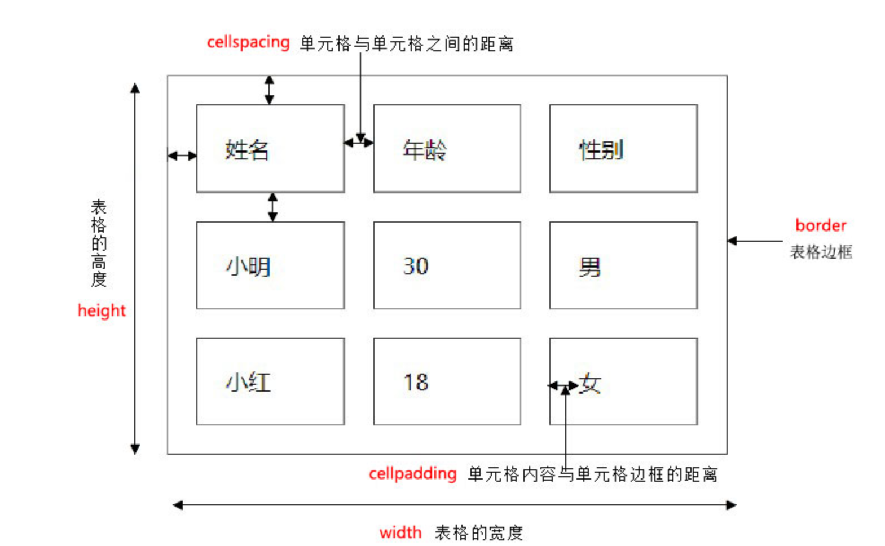
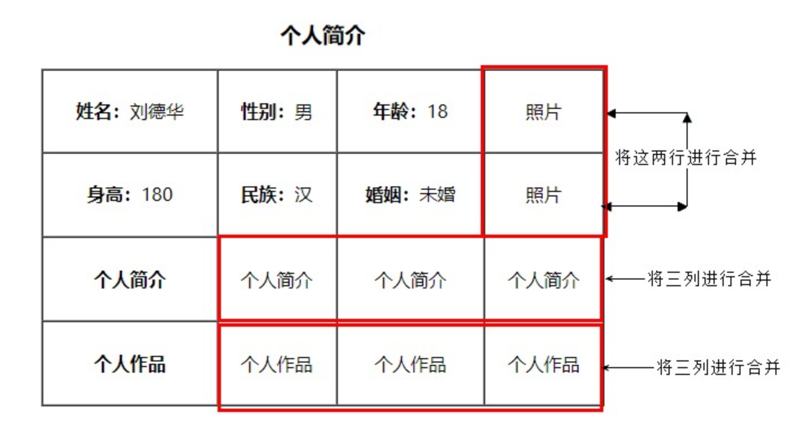
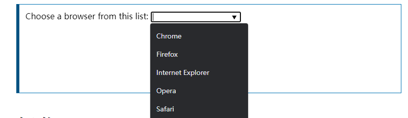
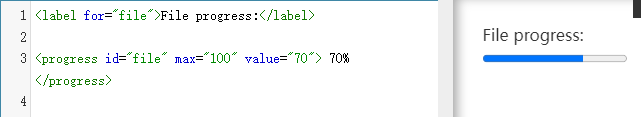
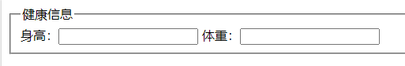

# HTML

# HTML常用标签
## 1.排版标签
| **<font style="color:#262626;">标签名</font>** | **<font style="color:#262626;">定义</font>** | **<font style="color:#262626;">说明</font>** |
| --- | --- | --- |
| <font style="color:#262626;"><h1...6></h1...6></font> | <font style="color:#262626;">标题标签</font> | <font style="color:#262626;">作为标题使用，并且依据重要性递减</font> |
| <font style="color:#262626;"><p></p></font> | <font style="color:#262626;">段落标签</font> | <font style="color:#262626;">可以把 HTML 文档分割为若干段落</font> |
| <font style="color:#E8323C;"><hr/></font> | <font style="color:#262626;">水平线标签</font> | <font style="color:#262626;"></font> |
| <font style="color:#E8323C;"><br/></font> | <font style="color:#262626;">换行标签</font> |  |
| <font style="color:#262626;"><div></div></font> | <font style="color:#262626;">div标签</font> | <font style="color:#262626;">用来布局的，但是现在一行只能放一个div</font> |
| <font style="color:#262626;"><span></span></font> | <font style="color:#262626;">span标签</font> | <font style="color:#262626;">用来布局的，一行上可以放好多个span</font> |


| **<font style="color:#262626;">标签名</font>** | **<font style="color:#262626;">说明</font>** |
| --- | --- |
| <font style="color:#262626;"><article></article></font> | 表示文档、页面、应用或网站中的独立结构，其意在成为可独立分配的或可复用的结构 |
| <font style="color:#262626;"><aside></aside></font> |  |
| <font style="color:#262626;"><footer></footer></font> |  |
| <font style="color:#262626;"><header></header></font> |  |
| <font style="color:#262626;"><main></main></font> | body 或应用的主体部分 |
| <font style="color:#262626;"><nav></nav></font> |  |
| <font style="color:#262626;"><section></section></font> | 表示一个包含在HTML文档中的独立部分 |


## 2.文本格式化标签
| **<font style="color:#262626;">标签名</font>** | **<font style="color:#262626;">样式</font>** | **<font style="color:#262626;">说明</font>** |
| --- | --- | --- |
| <font style="color:#262626;"><b></b></font><br/>**<font style="color:#262626;"><strong></strong></font>** | <font style="color:#262626;">粗体</font> | <font style="color:#262626;">推荐使用strong</font> |
| <font style="color:#262626;"><i></i></font><br/>**<font style="color:#262626;"><em></em></font>** | <font style="color:#262626;">斜体</font> | <font style="color:#262626;">推荐使用em</font> |
| <s></s><br/>**<del></del>** | <font style="color:#262626;">删除线</font> | <font style="color:#262626;">推荐使用del</font> |
| <u></u><br/>**<ins></ins>** | <font style="color:#262626;">下划线</font> | <font style="color:#262626;">推荐使用ins</font> |


> <font style="color:#333333;"> </font><font style="color:rgb(18, 18, 18);">在默认的 HTML 样式表定义中，b 和 strong 的样式一样，为 { font-weight: bolder }；而 em 的默认样式为 { font-style: italic }，与 i 相同。b 和 i 是样式上强调，strong 和 em 是语义上强调。strong>em</font>
>


| **标签名** | **样式** | **说明** |
| --- | --- | --- |
| <abbr></abbr > | 缩写 | 推荐使用strong |
| <address></address> | 联系信息 | 看起来只是斜体，但表示了语义信息 |
| <q></q><br/><blockquote</blockquote> | 短引用<br/>块引用 | 所有文本都会从常规文本中分离出来，增加外边距 |
| <cite></cite> | 引用 | 比如书籍或杂志的标题。 |
| <code></code> | 代码 | 以浏览器的默认等宽字体显示 |
| <sup></sup><br/><sub></sub> | 上标文本<br/>下标文本 |  |
| <small></small><br/><big></big> | 呈现小号字体效果 | font-size: smaller; |
| <pre></pre> | <font style="color:rgb(0, 0, 0);">预格式文本</font> | <font style="color:#333333;">保留空格和换行符，</font><font style="color:rgb(0, 0, 0);background-color:rgb(253, 252, 248);">而文本也会呈现为等宽字体</font> |
| <data></data><br/><time></time> | <font style="color:rgb(0, 0, 0);">添加语义</font><br/>添加时间 | <font style="color:rgb(27, 27, 27);">将一个指定内容和机器可读的翻译联系在一起</font><br/>让以机器可读的格式表示日期和时间 |
| <var></var> | 变量 | 样式斜体 |


```html
<data value="21053">圣女果</data>

<p>我在 <time datetime="2010-02-14">情人节</time> 有个约会。</p>

<pre>
for i = 1 to 10
     print i
</pre>
```

## 3.链接标签
<a> 标签定义超链接，用于从一张页面链接到另一张页面。

```html
<a href="跳转目标" target="目标窗口的弹出方式">文本或图像</a>
```

| 属性 | 作用 |
| --- | --- |
| href | 用于指定链接目标的url地址 |
| target | 用于指定链接页面的打开方式，**_blank**，_parent<br/>**_self**，_top |
| type | 规定被链接目标的的 MIME 类型。 |


href 属性值定义为`#`(即`href="#"`)，表示该链接暂时为一个空链接，会返回页面顶部。

	


### 锚点定位
```html
1. 使用相应的id名标注跳转目标的位置。 
  <h3 id="two">第2集</h3> 

2. 使用<a href="#id名">链接文本</a>创建链接文本
  <a href="#two">
```

### base 标签
```html
<base target="_blank" />
```

**总结： **

+ base 可以设置整体链接的打开状态   
+ base 写到  <head>  之间
+ 把所有的连接 都默认添加 target="_blank"

## 
## 4.注释标签
在HTML中还有一种特殊的标签——注释标签。如果需要在HTML文档中添加一些便于阅读和理解但又不需要显示在页面中的注释文字，就需要使用注释标签。

```html
<!-- 注释语句 --> 
<div>...</div>
```

注释内容前后各一个空格字符，注释位于要注释代码的上面，单独占一行。


## 6. 特殊字符
| **显示结果** | **描述** | **实体名称** |
| :--- | :--- | :--- |
| **<font style="color:rgb(0, 0, 0);"> </font>** | **<font style="color:rgb(0, 0, 0);">空格</font>** | **<font style="color:rgb(0, 0, 0);">&nbsp;</font>** |
| **<font style="color:rgb(0, 0, 0);"><</font>** | **<font style="color:rgb(0, 0, 0);">小于号</font>** | **<font style="color:rgb(0, 0, 0);">&lt;</font>** |
| **<font style="color:rgb(0, 0, 0);">></font>** | **<font style="color:rgb(0, 0, 0);">大于号</font>** | **<font style="color:rgb(0, 0, 0);">&gt;</font>** |
| <font style="color:rgb(0, 0, 0);">&</font> | <font style="color:rgb(0, 0, 0);">和号</font> | <font style="color:rgb(0, 0, 0);">&amp;</font> |
| <font style="color:rgb(0, 0, 0);">"</font> | <font style="color:rgb(0, 0, 0);">引号</font> | <font style="color:rgb(0, 0, 0);">&quot;</font> |
| <font style="color:rgb(0, 0, 0);">'</font> | <font style="color:rgb(0, 0, 0);">撇号 </font> | <font style="color:rgb(0, 0, 0);">&apos; (IE不支持)</font> |
| <font style="color:rgb(0, 0, 0);">￠</font> | <font style="color:rgb(0, 0, 0);">分（cent）</font> | <font style="color:rgb(0, 0, 0);">&cent;</font> |
| <font style="color:rgb(0, 0, 0);">£</font> | <font style="color:rgb(0, 0, 0);">镑（pound）</font> | <font style="color:rgb(0, 0, 0);">&pound;</font> |
| <font style="color:rgb(0, 0, 0);">¥</font> | <font style="color:rgb(0, 0, 0);">元（yen）</font> | <font style="color:rgb(0, 0, 0);">&yen;</font> |
| <font style="color:rgb(0, 0, 0);">€</font> | <font style="color:rgb(0, 0, 0);">欧元（euro）</font> | <font style="color:rgb(0, 0, 0);">&euro;</font> |
| <font style="color:rgb(0, 0, 0);">§</font> | <font style="color:rgb(0, 0, 0);">小节</font> | <font style="color:rgb(0, 0, 0);">&sect;</font> |
| <font style="color:rgb(0, 0, 0);">©</font> | <font style="color:rgb(0, 0, 0);">版权（copyright）</font> | <font style="color:rgb(0, 0, 0);">&copy;</font> |
| <font style="color:rgb(0, 0, 0);">®</font> | <font style="color:rgb(0, 0, 0);">注册商标</font> | <font style="color:rgb(0, 0, 0);">&reg;</font> |
| <font style="color:rgb(0, 0, 0);">™</font> | <font style="color:rgb(0, 0, 0);">商标</font> | <font style="color:rgb(0, 0, 0);">&trade;</font> |
| <font style="color:rgb(0, 0, 0);">×</font> | <font style="color:rgb(0, 0, 0);">乘号</font> | <font style="color:rgb(0, 0, 0);">&times;</font> |
| <font style="color:rgb(0, 0, 0);">÷</font> | <font style="color:rgb(0, 0, 0);">除号</font> | <font style="color:rgb(0, 0, 0);">&divide;</font> |


# 表格
## 1. 创建表格
```html
<table border="1">
  <tr>
    <th>Company</th>
    <th>Address</th>
  </tr>

  <tr>
    <td>Apple, Inc.</td>
    <td>1 Infinite Loop Cupertino, CA 95014</td>
  </tr>
</table>
```


**总结： **

+ 一个完整的表格有表格标签（table），行标签（tr），单元格标签（td）组成，没有列的标签
+ `<tr>`中只能嵌套`<td>` 类的单元格
+ `<td>`标签，就像一个容器，可以容纳所有的元素
+ `<th>`一般表头单元格位于表格的第一行或第一列，并且文本加粗居中，只需用表头标签<th></th>替代相应的单元格标签<td></td>即可


> <font style="color:rgb(51, 51, 51);background-color:rgb(246, 244, 240);">tr=table row; td=table data cell; th=table header cell</font>
>

<font style="color:rgb(51, 51, 51);background-color:rgb(246, 244, 240);"></font>

## 2.thead/tbody/tfoot
> <font style="color:rgb(77, 77, 77);">thead, tbody, tfoot三个标签的使用目的是把一个表格分成三个大的部分，每个部分存放不同的东西，这样这个表格就会比较有结构</font>
>

```html
<html>
<head>
<style type="text/css">
thead {color:green}
tbody {color:blue;height:50px}
tfoot {color:red}
</style>
</head>
<body>

<table border="1">
  <thead>
    <tr>
      <th>Month</th>
      <th>Savings</th>
    </tr>
  </thead>
  <tbody>
    <tr>
      <td>January</td>
      <td>$100</td>
    </tr>
    <tr>
      <td>February</td>
      <td>$80</td>
    </tr>
  </tbody>
  <tfoot>
    <tr>
      <td>Sum</td>
      <td>$180</td>
    </tr>
  </tfoot>
</table>

</body>
</html>

```


## 3. 表格属性
<font style="color:#333333;">表格有部分属性我们不常用，这里重点记住 cellspacing 、 cellpadding。</font>




## 4. 表格标题 caption
**定义和用法**

```html
<table border="1">
<caption>我的标题</caption>
<tr>
  <td>100</td>
  <td>200</td>
  <td>300</td>
</tr>
<tr>
  <td>400</td>
  <td>500</td>
  <td>600</td>
</tr>
</table>
```


**注意： **

1. caption 元素定义**表格标题**，通常这个标题会被居中且显示于表格之上。
2. caption 标签必须紧随 table 标签之后。
3. 这个标签只存在 表格里面才有意义。


## 5.合并单元格
### 5.1 合并单元格2种方式
+ 跨行合并：`rowspan="合并单元格的个数"`      
+ 跨列合并：`colspan="合并单元格的个数"`


### 5.2 合并单元格顺序
**合并的顺序我们按照   先上 后下   先左  后右 的顺序 **


### 5.3 合并单元格三步曲
1. 先确定是跨行还是跨列合并
2. 根据先上-后下-先左-后右的原则找到目标单元格，然后写上合并方式 还有要合并的单元格数量 ，比如 ：

`<td colspan="3"> </td>`

3. 删除多余的单元格 单元格      



# 列表
## 1.无序列表 ul 
```html
<ul>
  <li>列表项1</li>
  <li>列表项2</li>
  <li>列表项3</li>
  ......
</ul>
```

## 2.  有序列表 ol 
+ <font style="color:#E8323C;">reversed </font>属性产生倒序的数字列表。
+ <font style="color:#E8323C;">start </font>属性的值是一个整数，表示数字列表的起始编号。
+ <font style="color:#E8323C;">type </font>属性指定数字编号的样式
    - a：小写字母
    - A：大写字母
    - i：小写罗马数字
    - I：大写罗马数字
    - 1：整数（默认值）

```html
<ol reversed>
  <li>列表项1</li>
  <li>列表项2</li>
  <li>列表项3</li>
  ......
</ol>
```

## 3 自定义列表
<font style="color:rgb(218, 16, 57);background-color:rgb(245, 245, 245);"><dl></font><font style="color:rgb(74, 74, 74);">标签是一个块级元素，表示一组术语的列表（description list）。术语名（description term）由</font><font style="color:rgb(218, 16, 57);background-color:rgb(245, 245, 245);"><dt></font><font style="color:rgb(74, 74, 74);">标签定义，术语解释（description detail）由</font><font style="color:rgb(218, 16, 57);background-color:rgb(245, 245, 245);"><dd></font><font style="color:rgb(74, 74, 74);">标签定义。</font><font style="color:rgb(218, 16, 57);background-color:rgb(245, 245, 245);"><dl></font><font style="color:rgb(74, 74, 74);">常用来定义词汇表。</font>

```html
<dl>
  <dt>CPU</dt>
  <dd>中央处理器</dd>

  <dt>Memory</dt>
  <dd>内存</dd>

  <dt>Hard Disk</dt>
  <dd>硬盘</dd>
</dl>
```

<font style="color:rgb(218, 16, 57);background-color:rgb(245, 245, 245);"><dt></font><font style="color:rgb(74, 74, 74);">和</font><font style="color:rgb(218, 16, 57);background-color:rgb(245, 245, 245);"><dd></font><font style="color:rgb(74, 74, 74);">都是块级元素，</font><font style="color:rgb(218, 16, 57);background-color:rgb(245, 245, 245);"><dd></font><font style="color:rgb(74, 74, 74);">默认会在</font><font style="color:rgb(218, 16, 57);background-color:rgb(245, 245, 245);"><dt></font><font style="color:rgb(74, 74, 74);">下方缩进显示。上面代码的默认渲染结果如下</font>

```html
CPU
  中央处理器

Memory
  内存

Hard Disk
  硬盘
```

# 表单
## <font style="color:rgb(27, 27, 27);">form</font>
```html
<form action="https://example.com/api" method="post">
  <label for="POST-name">用户名：</label>
  <input id="POST-name" type="text" name="user">
  <input type="submit" value="提交">
</form>
```

<font style="color:rgb(218, 16, 57);background-color:rgb(245, 245, 245);"><form></font><font style="color:rgb(74, 74, 74);">有以下属性</font>

+ <font style="color:rgb(218, 16, 57);background-color:rgb(245, 245, 245);">accept-charset</font><font style="color:rgb(74, 74, 74);">：服务器接受的字符编码列表，使用空格分隔，默认与网页编码相同。</font>
+ <font style="color:rgb(218, 16, 57);background-color:rgb(245, 245, 245);">action</font><font style="color:rgb(74, 74, 74);">：服务器接收数据的 URL。</font>
+ <font style="color:rgb(218, 16, 57);background-color:rgb(245, 245, 245);">autocomplete</font><font style="color:rgb(74, 74, 74);">：如果用户没有填写某个控件，浏览器是否可以自动填写该值。它的可能取值分别为</font><font style="color:rgb(218, 16, 57);background-color:rgb(245, 245, 245);">off</font><font style="color:rgb(74, 74, 74);">（不自动填写）和</font><font style="color:rgb(218, 16, 57);background-color:rgb(245, 245, 245);">on</font><font style="color:rgb(74, 74, 74);">（自动填写）。</font>
+ <font style="color:rgb(218, 16, 57);background-color:rgb(245, 245, 245);">method</font><font style="color:rgb(74, 74, 74);">：提交数据的 HTTP 方法，可能的值有</font><font style="color:rgb(218, 16, 57);background-color:rgb(245, 245, 245);">post</font><font style="color:rgb(74, 74, 74);">（表单数据作为 HTTP 数据体发送），</font><font style="color:rgb(218, 16, 57);background-color:rgb(245, 245, 245);">get</font><font style="color:rgb(74, 74, 74);">（表单数据作为 URL 的查询字符串发送），</font><font style="color:rgb(218, 16, 57);background-color:rgb(245, 245, 245);">dialog</font><font style="color:rgb(74, 74, 74);">（表单位于</font><font style="color:rgb(218, 16, 57);background-color:rgb(245, 245, 245);"><dialog></font><font style="color:rgb(74, 74, 74);">内部使用）。</font>
+ <font style="color:rgb(218, 16, 57);background-color:rgb(245, 245, 245);">enctype</font><font style="color:rgb(74, 74, 74);">：当</font><font style="color:rgb(218, 16, 57);background-color:rgb(245, 245, 245);">method</font><font style="color:rgb(74, 74, 74);">属性等于</font><font style="color:rgb(218, 16, 57);background-color:rgb(245, 245, 245);">post</font><font style="color:rgb(74, 74, 74);">时，该属性指定提交给服务器的 MIME 类型。可能的值为</font><font style="color:rgb(218, 16, 57);background-color:rgb(245, 245, 245);">application/x-www-form-urlencoded</font><font style="color:rgb(74, 74, 74);">（默认值），</font><font style="color:rgb(218, 16, 57);background-color:rgb(245, 245, 245);">multipart/form-data</font><font style="color:rgb(74, 74, 74);">（文件上传的情况），</font><font style="color:rgb(218, 16, 57);background-color:rgb(245, 245, 245);">text/plain</font><font style="color:rgb(74, 74, 74);">。</font>
+ <font style="color:rgb(218, 16, 57);background-color:rgb(245, 245, 245);">name</font><font style="color:rgb(74, 74, 74);">：表单的名称，应该在网页中是唯一的。注意，如果一个控件没有设置</font><font style="color:rgb(218, 16, 57);background-color:rgb(245, 245, 245);">name</font><font style="color:rgb(74, 74, 74);">属性，那么这个控件的值就不会作为键值对，向服务器发送。</font>
+ <font style="color:rgb(218, 16, 57);background-color:rgb(245, 245, 245);">novalidate</font><font style="color:rgb(74, 74, 74);">：布尔属性，表单提交时是否取消验证。</font>
+ <font style="color:rgb(218, 16, 57);background-color:rgb(245, 245, 245);">target</font><font style="color:rgb(74, 74, 74);">：在哪个窗口展示服务器返回的数据，可能的值有</font><font style="color:rgb(218, 16, 57);background-color:rgb(245, 245, 245);">_self</font><font style="color:rgb(74, 74, 74);">（当前窗口），</font><font style="color:rgb(218, 16, 57);background-color:rgb(245, 245, 245);">_blank</font><font style="color:rgb(74, 74, 74);">（新建窗口），</font><font style="color:rgb(218, 16, 57);background-color:rgb(245, 245, 245);">_parent</font><font style="color:rgb(74, 74, 74);">（父窗口），</font><font style="color:rgb(218, 16, 57);background-color:rgb(245, 245, 245);">_top</font><font style="color:rgb(74, 74, 74);">（顶层窗口），</font><font style="color:rgb(218, 16, 57);background-color:rgb(245, 245, 245);"><iframe></font><font style="color:rgb(74, 74, 74);">标签的</font><font style="color:rgb(218, 16, 57);background-color:rgb(245, 245, 245);">name</font><font style="color:rgb(74, 74, 74);">属性（即表单返回结果展示在</font><font style="color:rgb(218, 16, 57);background-color:rgb(245, 245, 245);"><iframe></font><font style="color:rgb(74, 74, 74);">窗口）。</font>

### <font style="color:rgb(54, 54, 54);">enctype 属性</font>
+ <font style="color:rgb(218, 16, 57);background-color:rgb(245, 245, 245);">application/x-www-form-urlencoded</font>

<font style="color:rgb(74, 74, 74);">控件名和控件值之间用</font><font style="color:rgb(218, 16, 57);background-color:rgb(245, 245, 245);">=</font><font style="color:rgb(74, 74, 74);">分隔。控件按照出现顺序排列，控件之间用</font><font style="color:rgb(218, 16, 57);background-color:rgb(245, 245, 245);">&</font><font style="color:rgb(74, 74, 74);">分隔。</font>

<font style="color:rgb(74, 74, 74);"></font>

+ <font style="color:rgb(218, 16, 57);background-color:rgb(245, 245, 245);">multipart/form-data</font>

```html
<form action="https://example.com/api"
      enctype="multipart/form-data"
      method="post">
  用户名：<input type="text" name="submit-name"><br>
  文件：<input type="file" name="files"><br>
  <input type="submit" value="上传"> <input type="reset" value="清除">
</form>
```

<font style="color:rgb(74, 74, 74);">浏览器将这个表单发成多个数据块。最上面使用</font><font style="color:rgb(218, 16, 57);background-color:rgb(245, 245, 245);">Content-Type</font><font style="color:rgb(74, 74, 74);">字段告诉服务器，数据格式是</font><font style="color:rgb(218, 16, 57);background-color:rgb(245, 245, 245);">multipart/form-data</font><font style="color:rgb(74, 74, 74);">（即多个数据块），每个数据块的分隔标志是</font><font style="color:rgb(218, 16, 57);background-color:rgb(245, 245, 245);">--AaB03x</font><font style="color:rgb(74, 74, 74);">。</font>

```http
Content-Type: multipart/form-data; boundary=--AaB03x

--AaB03x
Content-Disposition: form-data; name="submit-name"

Larry
--AaB03x
Content-Disposition: form-data; name="files"; filename="file1.txt"
Content-Type: text/plain

... contents of file1.txt ...
--AaB03x--
```

## label
<font style="color:rgb(218, 16, 57);background-color:rgb(245, 245, 245);"><label></font><font style="color:rgb(74, 74, 74);">标签是一个行内元素，提供控件的文字说明，帮助用户理解控件的目的。</font>

```html
<label for="user">用户名：</label>
<input type="text" name="user" id="user">
```

<font style="color:rgb(218, 16, 57);background-color:rgb(245, 245, 245);"><label></font><font style="color:rgb(74, 74, 74);">的属性如下。</font>

+ <font style="color:rgb(218, 16, 57);background-color:rgb(245, 245, 245);">for</font><font style="color:rgb(74, 74, 74);">：关联控件的</font><font style="color:rgb(218, 16, 57);background-color:rgb(245, 245, 245);">id</font><font style="color:rgb(74, 74, 74);">属性。</font>
+ <font style="color:rgb(218, 16, 57);background-color:rgb(245, 245, 245);">form</font><font style="color:rgb(74, 74, 74);">：关联表单的</font><font style="color:rgb(218, 16, 57);background-color:rgb(245, 245, 245);">id</font><font style="color:rgb(74, 74, 74);">属性。设置了该属性后，</font><font style="color:rgb(218, 16, 57);background-color:rgb(245, 245, 245);"><label></font><font style="color:rgb(74, 74, 74);">可以放置在页面的任何位置，否则只能放在</font><font style="color:rgb(218, 16, 57);background-color:rgb(245, 245, 245);"><form></font><font style="color:rgb(74, 74, 74);">内部</font>

<font style="color:rgb(74, 74, 74);">控件也可以放在</font><font style="color:rgb(218, 16, 57);background-color:rgb(245, 245, 245);"><label></font><font style="color:rgb(74, 74, 74);">之中，这时不需要</font><font style="color:rgb(218, 16, 57);background-color:rgb(245, 245, 245);">for</font><font style="color:rgb(74, 74, 74);">属性和</font><font style="color:rgb(218, 16, 57);background-color:rgb(245, 245, 245);">id</font><font style="color:rgb(74, 74, 74);">属性。</font>

```html
<label>用户名：
  <input type="text" name="user">
</label>
```

## input
<font style="color:rgb(218, 16, 57);background-color:rgb(245, 245, 245);"><input></font><font style="color:rgb(74, 74, 74);">标签是一个行内元素，用来接收用户的输入。它是一个单独使用的标签，没有结束标志。</font>

<font style="color:rgb(74, 74, 74);">它有多种类型，取决于</font><font style="color:rgb(218, 16, 57);background-color:rgb(245, 245, 245);">type</font><font style="color:rgb(74, 74, 74);">属性的值，默认值是</font><font style="color:rgb(218, 16, 57);background-color:rgb(245, 245, 245);">text</font><font style="color:rgb(74, 74, 74);">，表示一个输入框。</font>

```html
<input>
<!-- 等同于 -->
<input type="text">
```

<font style="color:rgb(218, 16, 57);background-color:rgb(245, 245, 245);"><input></font><font style="color:rgb(74, 74, 74);">的属性非常多，有些属性是某个类型专用的，放在下文的“类型”部分介绍。这里介绍一些所有类型的共同属性。</font>

+ <font style="color:rgb(218, 16, 57);background-color:rgb(245, 245, 245);">autofocus</font><font style="color:rgb(74, 74, 74);">：布尔属性，是否在页面加载时自动获得焦点。</font>
+ <font style="color:rgb(218, 16, 57);background-color:rgb(245, 245, 245);">disabled</font><font style="color:rgb(74, 74, 74);">：布尔属性，是否禁用该控件。一旦设置，该控件将变灰，用户可以看到，但是无法操作。</font>
+ <font style="color:rgb(218, 16, 57);background-color:rgb(245, 245, 245);">form</font><font style="color:rgb(74, 74, 74);">：关联表单的</font><font style="color:rgb(218, 16, 57);background-color:rgb(245, 245, 245);">id</font><font style="color:rgb(74, 74, 74);">属性。设置了该属性后，控件可以放置在页面的任何位置，否则只能放在</font><font style="color:rgb(218, 16, 57);background-color:rgb(245, 245, 245);"><form></font><font style="color:rgb(74, 74, 74);">内部。</font>
+ <font style="color:rgb(218, 16, 57);background-color:rgb(245, 245, 245);">list</font><font style="color:rgb(74, 74, 74);">：关联的</font><font style="color:rgb(218, 16, 57);background-color:rgb(245, 245, 245);"><datalist></font><font style="color:rgb(74, 74, 74);">的</font><font style="color:rgb(218, 16, 57);background-color:rgb(245, 245, 245);">id</font><font style="color:rgb(74, 74, 74);">属性，设置该控件相关的数据列表，详见后文。</font>
+ <font style="color:rgb(218, 16, 57);background-color:rgb(245, 245, 245);">name</font><font style="color:rgb(74, 74, 74);">：控件的名称，主要用于向服务器提交数据时，控件键值对的键名。注意，只有设置了</font><font style="color:rgb(218, 16, 57);background-color:rgb(245, 245, 245);">name</font><font style="color:rgb(74, 74, 74);">属性的控件，才会向服务器提交，不设置就不会提交。</font>
+ <font style="color:rgb(218, 16, 57);background-color:rgb(245, 245, 245);">readonly</font><font style="color:rgb(74, 74, 74);">：布尔属性，是否为只读。</font>
+ <font style="color:rgb(218, 16, 57);background-color:rgb(245, 245, 245);">required</font><font style="color:rgb(74, 74, 74);">：布尔属性，是否为必填。</font>
+ <font style="color:rgb(218, 16, 57);background-color:rgb(245, 245, 245);">type</font><font style="color:rgb(74, 74, 74);">：控件类型，详见下文。</font>
+ <font style="color:rgb(218, 16, 57);background-color:rgb(245, 245, 245);">value</font><font style="color:rgb(74, 74, 74);">：控件的值。</font>

### <font style="color:rgb(74, 74, 74);">type类型</font>
| **值** | **描述** |
| --- | --- |
| ~~<font style="color:rgb(0, 0, 0);">button</font>~~ | <font style="color:rgb(0, 0, 0);">直接使用 <button></font> |
| **<font style="color:rgb(0, 0, 0);">checkbox</font>** | <font style="color:rgb(0, 0, 0);">定义复选框。</font> |
| **<font style="color:rgb(0, 0, 0);">file</font>** | <font style="color:rgb(0, 0, 0);">定义输入字段和 "浏览"按钮，供文件上传。</font> |
| <font style="color:rgb(0, 0, 0);">hidden</font> | <font style="color:rgb(0, 0, 0);">定义隐藏的输入字段。</font> |
| ~~<font style="color:rgb(0, 0, 0);">image</font>~~ | <font style="color:rgb(0, 0, 0);">定义图像形式的提交按钮，和submit一样</font> |
| <font style="color:rgb(0, 0, 0);">password</font> | <font style="color:rgb(0, 0, 0);">定义密码字段。</font><font style="color:rgb(0, 0, 0);background-color:rgb(253, 252, 248);">字符会被掩码（显示为星号或原点）</font> |
| <font style="color:rgb(0, 0, 0);">radio</font> | <font style="color:rgb(0, 0, 0);">定义单选按钮。</font> |
| <font style="color:rgb(0, 0, 0);">reset</font> | <font style="color:rgb(0, 0, 0);">定义重置按钮。重置按钮会清除表单中的所有数据。</font> |
| <font style="color:rgb(0, 0, 0);">submit</font> | <font style="color:rgb(0, 0, 0);">定义提交按钮。提交按钮会把表单数据发送到服务器。</font> |
| <font style="color:rgb(0, 0, 0);">text</font> | <font style="color:rgb(0, 0, 0);">定义单行的输入字段，用户可在其中输入文本。默认宽度为 20 个字符。</font> |
| .... | ... |


[https://developer.mozilla.org/zh-CN/docs/Web/HTML/Element/Input](https://developer.mozilla.org/zh-CN/docs/Web/HTML/Element/Input)

## button
<font style="color:rgb(218, 16, 57);background-color:rgb(245, 245, 245);"><button></font><font style="color:rgb(74, 74, 74);">具有以下属性。</font>

+ <font style="color:rgb(218, 16, 57);background-color:rgb(245, 245, 245);">autofocus</font><font style="color:rgb(74, 74, 74);">：布尔属性，表示网页加载时，焦点就在这个按钮。网页里面只能有一个元素，具有这个属性。</font>
+ <font style="color:rgb(218, 16, 57);background-color:rgb(245, 245, 245);">disabled</font><font style="color:rgb(74, 74, 74);">：布尔属性，表示按钮不可用，会导致按钮变灰，不可点击。</font>
+ <font style="color:rgb(218, 16, 57);background-color:rgb(245, 245, 245);">name</font><font style="color:rgb(74, 74, 74);">：按钮的名称（与</font><font style="color:rgb(218, 16, 57);background-color:rgb(245, 245, 245);">value</font><font style="color:rgb(74, 74, 74);">属性配合使用），将以</font><font style="color:rgb(218, 16, 57);background-color:rgb(245, 245, 245);">name=value</font><font style="color:rgb(74, 74, 74);">的形式，随表单一起提交到服务器。</font>
+ <font style="color:rgb(218, 16, 57);background-color:rgb(245, 245, 245);">value</font><font style="color:rgb(74, 74, 74);">：按钮的值（与</font><font style="color:rgb(218, 16, 57);background-color:rgb(245, 245, 245);">name</font><font style="color:rgb(74, 74, 74);">属性配合使用），将以</font><font style="color:rgb(218, 16, 57);background-color:rgb(245, 245, 245);">name=value</font><font style="color:rgb(74, 74, 74);">的形式，随表单一起提交到服务器。</font>
+ <font style="color:rgb(218, 16, 57);background-color:rgb(245, 245, 245);">type</font><font style="color:rgb(74, 74, 74);">：按钮的类型，可能的值有三种：</font><font style="color:rgb(218, 16, 57);background-color:rgb(245, 245, 245);">submit</font><font style="color:rgb(74, 74, 74);">（点击后将数据提交给服务器），</font><font style="color:rgb(218, 16, 57);background-color:rgb(245, 245, 245);">reset</font><font style="color:rgb(74, 74, 74);">（将所有控件的值重置为初始值），</font><font style="color:rgb(218, 16, 57);background-color:rgb(245, 245, 245);">button</font><font style="color:rgb(74, 74, 74);">（没有默认行为，由脚本指定按钮的行为）。</font>
+ <font style="color:rgb(218, 16, 57);background-color:rgb(245, 245, 245);">form</font><font style="color:rgb(74, 74, 74);">：指定按钮关联的</font><font style="color:rgb(218, 16, 57);background-color:rgb(245, 245, 245);"><form></font><font style="color:rgb(74, 74, 74);">表单，值为</font><font style="color:rgb(218, 16, 57);background-color:rgb(245, 245, 245);"><form></font><font style="color:rgb(74, 74, 74);">的</font><font style="color:rgb(218, 16, 57);background-color:rgb(245, 245, 245);">id</font><font style="color:rgb(74, 74, 74);">属性。如果省略该属性，默认关联按钮所在父表单。</font>
+ <font style="color:rgb(218, 16, 57);background-color:rgb(245, 245, 245);">formaction</font><font style="color:rgb(74, 74, 74);">：数据提交到服务器的目标 URL，会覆盖</font><font style="color:rgb(218, 16, 57);background-color:rgb(245, 245, 245);"><form></font><font style="color:rgb(74, 74, 74);">元素的</font><font style="color:rgb(218, 16, 57);background-color:rgb(245, 245, 245);">action</font><font style="color:rgb(74, 74, 74);">属性。</font>
+ <font style="color:rgb(218, 16, 57);background-color:rgb(245, 245, 245);">formenctype</font><font style="color:rgb(74, 74, 74);">：数据提交到服务器的编码方式，会覆盖</font><font style="color:rgb(218, 16, 57);background-color:rgb(245, 245, 245);"><form></font><font style="color:rgb(74, 74, 74);">元素的</font><font style="color:rgb(218, 16, 57);background-color:rgb(245, 245, 245);">enctype</font><font style="color:rgb(74, 74, 74);">属性。可能的值有三种：</font><font style="color:rgb(218, 16, 57);background-color:rgb(245, 245, 245);">application/x-www-form-urlencoded</font><font style="color:rgb(74, 74, 74);">（默认值），</font><font style="color:rgb(218, 16, 57);background-color:rgb(245, 245, 245);">multipart/form-data</font><font style="color:rgb(74, 74, 74);">（只用于文件上传），</font><font style="color:rgb(218, 16, 57);background-color:rgb(245, 245, 245);">text/plain</font><font style="color:rgb(74, 74, 74);">。</font>
+ <font style="color:rgb(218, 16, 57);background-color:rgb(245, 245, 245);">formmethod</font><font style="color:rgb(74, 74, 74);">：数据提交到服务器使用的 HTTP 方法，会覆盖</font><font style="color:rgb(218, 16, 57);background-color:rgb(245, 245, 245);"><form></font><font style="color:rgb(74, 74, 74);">元素的</font><font style="color:rgb(218, 16, 57);background-color:rgb(245, 245, 245);">method</font><font style="color:rgb(74, 74, 74);">属性，可能的值为</font><font style="color:rgb(218, 16, 57);background-color:rgb(245, 245, 245);">post</font><font style="color:rgb(74, 74, 74);">或</font><font style="color:rgb(218, 16, 57);background-color:rgb(245, 245, 245);">get</font><font style="color:rgb(74, 74, 74);">。</font>
+ <font style="color:rgb(218, 16, 57);background-color:rgb(245, 245, 245);">formnovalidate</font><font style="color:rgb(74, 74, 74);">：布尔属性，数据提交到服务器时关闭本地验证，会覆盖</font><font style="color:rgb(218, 16, 57);background-color:rgb(245, 245, 245);"><form></font><font style="color:rgb(74, 74, 74);">元素的</font><font style="color:rgb(218, 16, 57);background-color:rgb(245, 245, 245);">novalidate</font><font style="color:rgb(74, 74, 74);">属性。</font>
+ <font style="color:rgb(218, 16, 57);background-color:rgb(245, 245, 245);">formtarget</font><font style="color:rgb(74, 74, 74);">：数据提交到服务器后，展示服务器返回数据的窗口，会覆盖</font><font style="color:rgb(218, 16, 57);background-color:rgb(245, 245, 245);"><form></font><font style="color:rgb(74, 74, 74);">元素的</font><font style="color:rgb(218, 16, 57);background-color:rgb(245, 245, 245);">target</font><font style="color:rgb(74, 74, 74);">属性。可能的值有</font><font style="color:rgb(218, 16, 57);background-color:rgb(245, 245, 245);">_self</font><font style="color:rgb(74, 74, 74);">（当前窗口），</font><font style="color:rgb(218, 16, 57);background-color:rgb(245, 245, 245);">_blank</font><font style="color:rgb(74, 74, 74);">（新的空窗口）、</font><font style="color:rgb(218, 16, 57);background-color:rgb(245, 245, 245);">_parent</font><font style="color:rgb(74, 74, 74);">（父窗口）、</font><font style="color:rgb(218, 16, 57);background-color:rgb(245, 245, 245);">_top</font><font style="color:rgb(74, 74, 74);">（顶层窗口）。</font>

## select
```html
<select>
  <option value="volvo">Volvo</option>
  <option value="saab">Saab</option>
  <option value="opel">Opel</option>
  <option value="audi">Audi</option>
</select>
```

<font style="color:rgb(218, 16, 57);background-color:rgb(245, 245, 245);"><select></font><font style="color:rgb(74, 74, 74);">有如下属性。</font>

+ <font style="color:rgb(218, 16, 57);background-color:rgb(245, 245, 245);">autofocus</font><font style="color:rgb(74, 74, 74);">：布尔属性，页面加载时是否自动获得焦点。</font>
+ <font style="color:rgb(218, 16, 57);background-color:rgb(245, 245, 245);">disabled</font><font style="color:rgb(74, 74, 74);">：布尔属性，是否禁用当前控件。</font>
+ <font style="color:rgb(218, 16, 57);background-color:rgb(245, 245, 245);">form</font><font style="color:rgb(74, 74, 74);">：关联表单的</font><font style="color:rgb(218, 16, 57);background-color:rgb(245, 245, 245);">id</font><font style="color:rgb(74, 74, 74);">属性。</font>
+ <font style="color:rgb(218, 16, 57);background-color:rgb(245, 245, 245);">multiple</font><font style="color:rgb(74, 74, 74);">：布尔属性，是否可以选择多个菜单项。默认情况下，只能选择一项。一旦设置，多数浏览器会显示一个滚动列表框。用户可能需要按住</font><font style="color:rgb(218, 16, 57);background-color:rgb(245, 245, 245);">Shift</font><font style="color:rgb(74, 74, 74);">或其他功能键，选中多项。</font>
+ <font style="color:rgb(218, 16, 57);background-color:rgb(245, 245, 245);">name</font><font style="color:rgb(74, 74, 74);">：控件名。</font>
+ <font style="color:rgb(218, 16, 57);background-color:rgb(245, 245, 245);">required</font><font style="color:rgb(74, 74, 74);">：布尔属性，是否为必填控件。</font>
+ <font style="color:rgb(218, 16, 57);background-color:rgb(245, 245, 245);">size</font><font style="color:rgb(74, 74, 74);">：设置了</font><font style="color:rgb(218, 16, 57);background-color:rgb(245, 245, 245);">multiple</font><font style="color:rgb(74, 74, 74);">属性时，页面显示时一次可见的行数，其他行需要滚动查看。</font>

```html
<select>
  <optgroup label="Swedish Cars">
    <option value="volvo">Volvo</option>
    <option value="saab">Saab</option>
  </optgroup>
  <optgroup label="German Cars">
    <option value="mercedes">Mercedes</option>
    <option value="audi">Audi</option>
  </optgroup>
</select>
```

+ <font style="color:rgb(218, 16, 57);background-color:rgb(245, 245, 245);"><option></font><font style="color:rgb(74, 74, 74);">标签用在</font><font style="color:rgb(218, 16, 57);background-color:rgb(245, 245, 245);"><select></font><font style="color:rgb(74, 74, 74);">、</font><font style="color:rgb(218, 16, 57);background-color:rgb(245, 245, 245);"><optgroup></font><font style="color:rgb(74, 74, 74);">、</font><font style="color:rgb(218, 16, 57);background-color:rgb(245, 245, 245);"><datalist></font><font style="color:rgb(74, 74, 74);">里面，表示一个菜单项</font>
+ <font style="color:rgb(218, 16, 57);background-color:rgb(245, 245, 245);"><optgroup></font><font style="color:rgb(74, 74, 74);">表示菜单项的分组，通常用在</font><font style="color:rgb(218, 16, 57);background-color:rgb(245, 245, 245);"><select></font><font style="color:rgb(74, 74, 74);">内部.</font>

**<font style="color:rgb(38, 38, 38);">datalist</font>**<font style="color:rgb(38, 38, 38);">  
</font><font style="color:rgb(218, 16, 57);background-color:rgb(245, 245, 245);"><datalist></font><font style="color:rgb(74, 74, 74);">标签是一个容器标签，用于为指定控件提供一组相关数据，通常用于生成输入提示。它的内部使用</font><font style="color:rgb(218, 16, 57);background-color:rgb(245, 245, 245);"><option></font><font style="color:rgb(74, 74, 74);">，生成每个菜单项。</font><font style="color:rgb(38, 38, 38);">  
</font>



<font style="color:rgb(38, 38, 38);">  
</font><font style="color:rgb(38, 38, 38);">  
</font>**<font style="color:rgb(38, 38, 38);">textarea</font>**<font style="color:rgb(38, 38, 38);">  
</font><font style="color:rgb(74, 74, 74);">该标签有如下属性。</font><font style="color:rgb(38, 38, 38);">  
</font><font style="color:rgb(38, 38, 38);">●</font><font style="color:rgb(218, 16, 57);background-color:rgb(245, 245, 245);">autofocus</font><font style="color:rgb(74, 74, 74);">：布尔属性，是否自动获得焦点。</font><font style="color:rgb(38, 38, 38);">  
</font><font style="color:rgb(38, 38, 38);">●</font><font style="color:rgb(218, 16, 57);background-color:rgb(245, 245, 245);">cols</font><font style="color:rgb(74, 74, 74);">：文本框的宽度，单位为字符，默认值为20。</font><font style="color:rgb(38, 38, 38);">  
</font><font style="color:rgb(38, 38, 38);">●</font><font style="color:rgb(218, 16, 57);background-color:rgb(245, 245, 245);">disabled</font><font style="color:rgb(74, 74, 74);">：布尔属性，是否禁用该控件。</font><font style="color:rgb(38, 38, 38);">  
</font><font style="color:rgb(38, 38, 38);">●</font><font style="color:rgb(218, 16, 57);background-color:rgb(245, 245, 245);">form</font><font style="color:rgb(74, 74, 74);">：关联表单的</font><font style="color:rgb(218, 16, 57);background-color:rgb(245, 245, 245);">id</font><font style="color:rgb(74, 74, 74);">属性。</font><font style="color:rgb(38, 38, 38);">  
</font><font style="color:rgb(38, 38, 38);">●</font><font style="color:rgb(218, 16, 57);background-color:rgb(245, 245, 245);">maxlength</font><font style="color:rgb(74, 74, 74);">：允许输入的最大字符数。如果未指定此值，用户可以输入无限数量的字符。</font><font style="color:rgb(38, 38, 38);">  
</font><font style="color:rgb(38, 38, 38);">●</font><font style="color:rgb(218, 16, 57);background-color:rgb(245, 245, 245);">minlength</font><font style="color:rgb(74, 74, 74);">：允许输入的最小字符数。</font><font style="color:rgb(38, 38, 38);">  
</font><font style="color:rgb(38, 38, 38);">●</font><font style="color:rgb(218, 16, 57);background-color:rgb(245, 245, 245);">name</font><font style="color:rgb(74, 74, 74);">：控件的名称。</font><font style="color:rgb(38, 38, 38);">  
</font><font style="color:rgb(38, 38, 38);">●</font><font style="color:rgb(218, 16, 57);background-color:rgb(245, 245, 245);">placeholder</font><font style="color:rgb(74, 74, 74);">：输入为空时显示的提示文本。</font><font style="color:rgb(38, 38, 38);">  
</font><font style="color:rgb(38, 38, 38);">●</font><font style="color:rgb(218, 16, 57);background-color:rgb(245, 245, 245);">readonly</font><font style="color:rgb(74, 74, 74);">：布尔属性，控件是否为只读。</font><font style="color:rgb(38, 38, 38);">  
</font><font style="color:rgb(38, 38, 38);">●</font><font style="color:rgb(218, 16, 57);background-color:rgb(245, 245, 245);">required</font><font style="color:rgb(74, 74, 74);">：布尔属性，控件是否为必填。</font><font style="color:rgb(38, 38, 38);">  
</font><font style="color:rgb(38, 38, 38);">●</font><font style="color:rgb(218, 16, 57);background-color:rgb(245, 245, 245);">rows</font><font style="color:rgb(74, 74, 74);">：文本框的高度，单位为行。</font><font style="color:rgb(38, 38, 38);">  
</font><font style="color:rgb(38, 38, 38);">●</font><font style="color:rgb(218, 16, 57);background-color:rgb(245, 245, 245);">spellcheck</font><font style="color:rgb(74, 74, 74);">：是否打开浏览器的拼写检查。可能的值有</font><font style="color:rgb(218, 16, 57);background-color:rgb(245, 245, 245);">true</font><font style="color:rgb(74, 74, 74);">（打开），</font><font style="color:rgb(218, 16, 57);background-color:rgb(245, 245, 245);">default</font><font style="color:rgb(74, 74, 74);">（由父元素或网页设置决定），</font><font style="color:rgb(218, 16, 57);background-color:rgb(245, 245, 245);">false</font><font style="color:rgb(74, 74, 74);">（关闭）。</font><font style="color:rgb(38, 38, 38);">  
</font><font style="color:rgb(38, 38, 38);">●</font><font style="color:rgb(218, 16, 57);background-color:rgb(245, 245, 245);">wrap</font><font style="color:rgb(74, 74, 74);">：输入的文本是否自动换行。可能的值有</font><font style="color:rgb(218, 16, 57);background-color:rgb(245, 245, 245);">hard</font><font style="color:rgb(74, 74, 74);">（浏览器自动插入换行符</font><font style="color:rgb(218, 16, 57);background-color:rgb(245, 245, 245);">CR + LF</font><font style="color:rgb(74, 74, 74);">，使得每行不超过控件的宽度），</font><font style="color:rgb(218, 16, 57);background-color:rgb(245, 245, 245);">soft</font><font style="color:rgb(74, 74, 74);">（输入内容超过宽度时自动换行，但不会加入新的换行符，并且浏览器保证所有换行符都是</font><font style="color:rgb(218, 16, 57);background-color:rgb(245, 245, 245);">CR + LR</font><font style="color:rgb(74, 74, 74);">，这是默认值），</font><font style="color:rgb(218, 16, 57);background-color:rgb(245, 245, 245);">off</font><font style="color:rgb(74, 74, 74);">（关闭自动换行，单行长度超过宽度时，会出现水平滚动条）。</font><font style="color:rgb(38, 38, 38);">  
</font><font style="color:rgb(38, 38, 38);">  
</font>**<font style="color:rgb(38, 38, 38);">progress</font>**<font style="color:rgb(38, 38, 38);">  
</font><font style="color:rgb(38, 38, 38);">●</font><font style="color:rgb(218, 16, 57);background-color:rgb(245, 245, 245);">max</font><font style="color:rgb(74, 74, 74);">：进度条的最大值，应该是一个大于</font><font style="color:rgb(218, 16, 57);background-color:rgb(245, 245, 245);">0</font><font style="color:rgb(74, 74, 74);">的浮点数。默认值为1。</font><font style="color:rgb(38, 38, 38);">  
</font><font style="color:rgb(38, 38, 38);">●</font><font style="color:rgb(218, 16, 57);background-color:rgb(245, 245, 245);">value</font><font style="color:rgb(74, 74, 74);">：进度条的当前值。它必须是</font><font style="color:rgb(218, 16, 57);background-color:rgb(245, 245, 245);">0</font><font style="color:rgb(74, 74, 74);">和</font><font style="color:rgb(218, 16, 57);background-color:rgb(245, 245, 245);">max</font><font style="color:rgb(74, 74, 74);">属性之间的一个有效浮点数。如果省略了</font><font style="color:rgb(218, 16, 57);background-color:rgb(245, 245, 245);">max</font><font style="color:rgb(74, 74, 74);">属性，该值则必须在</font><font style="color:rgb(218, 16, 57);background-color:rgb(245, 245, 245);">0</font><font style="color:rgb(74, 74, 74);">和</font><font style="color:rgb(218, 16, 57);background-color:rgb(245, 245, 245);">1</font><font style="color:rgb(74, 74, 74);">之间。如果省略了</font><font style="color:rgb(218, 16, 57);background-color:rgb(245, 245, 245);">value</font><font style="color:rgb(74, 74, 74);">属性，则进度条会出现滚动，表明正在进行中，无法知道完成的进度。</font><font style="color:rgb(38, 38, 38);">  
</font>



<font style="color:rgb(38, 38, 38);">  
</font><font style="color:rgb(38, 38, 38);">  
</font><font style="color:rgb(38, 38, 38);">  
</font>**<font style="color:rgb(27, 27, 27);">fieldset</font>**<font style="color:rgb(38, 38, 38);">  
</font><font style="color:rgb(27, 27, 27);">对表单中的控制元素进行分组</font><font style="color:rgb(38, 38, 38);">  
</font>

<font style="color:rgb(38, 38, 38);">  
  
</font>**<font style="color:rgb(38, 38, 38);">多媒体</font>**<font style="color:rgb(38, 38, 38);">  
</font>**<font style="color:rgb(38, 38, 38);">img</font>**

| **<font style="color:rgb(38, 38, 38);">属性</font>**<font style="color:rgb(38, 38, 38);">   </font> | **<font style="color:rgb(38, 38, 38);">值</font>**<font style="color:rgb(38, 38, 38);">   </font> | **<font style="color:rgb(38, 38, 38);">说明</font>**<font style="color:rgb(38, 38, 38);">   </font> |
| --- | --- | --- |
| <font style="color:rgb(38, 38, 38);">alt</font><font style="color:rgb(38, 38, 38);">   </font> | <font style="color:rgb(0, 0, 0);">text</font><font style="color:rgb(38, 38, 38);">   </font> | <font style="color:rgb(0, 0, 0);">规定图像的替代文本。</font><font style="color:rgb(38, 38, 38);">   </font> |
| <font style="color:rgb(38, 38, 38);">src</font><font style="color:rgb(38, 38, 38);">   </font> | <font style="color:rgb(0, 0, 0);">URL</font><font style="color:rgb(38, 38, 38);">   </font> | <font style="color:rgb(0, 0, 0);">规定显示图像的 URL。</font><font style="color:rgb(38, 38, 38);">   </font> |
| <font style="color:rgb(38, 38, 38);">height</font><font style="color:rgb(38, 38, 38);">   </font> | <font style="color:rgb(0, 0, 0);">●</font><font style="color:rgb(0, 0, 0);">pixels</font><font style="color:rgb(38, 38, 38);">   </font><font style="color:rgb(0, 0, 0);">●</font><font style="color:rgb(0, 0, 0);">%</font><font style="color:rgb(38, 38, 38);">   </font> | <font style="color:rgb(0, 0, 0);">定义图像的高度。</font><font style="color:rgb(38, 38, 38);">   </font> |
| <font style="color:rgb(38, 38, 38);">width</font><font style="color:rgb(38, 38, 38);">   </font> | <font style="color:rgb(0, 0, 0);">●</font><font style="color:rgb(0, 0, 0);">pixels</font><font style="color:rgb(38, 38, 38);">   </font><font style="color:rgb(0, 0, 0);">●</font><font style="color:rgb(0, 0, 0);">%</font><font style="color:rgb(38, 38, 38);">   </font> | <font style="color:rgb(0, 0, 0);">设置图像的宽度。</font><font style="color:rgb(38, 38, 38);">   </font> |
| <font style="color:rgb(38, 38, 38);">title</font><font style="color:rgb(38, 38, 38);">   </font> | <font style="color:rgb(38, 38, 38);">text</font><font style="color:rgb(38, 38, 38);">   </font> | <font style="color:rgb(27, 27, 27);">title</font><font style="color:rgb(27, 27, 27);"> 元素的值一般作为提示条(tooltip)呈现给用户，在光标于图片上停下后显示出来。</font><font style="color:rgb(38, 38, 38);">   </font> |


**<font style="color:rgb(63, 63, 63);background-color:rgb(253, 252, 248);">figure</font>**<font style="color:rgb(38, 38, 38);">  
</font><font style="color:rgb(38, 38, 38);">HTML <figure> 元素代表一段独立的内容, 经常与说明（caption） <figcaption> 配合使用, 并且作为一个独立的引用单元。当它属于主内容流（main flow）时，它的位置独立于主体。这个标签经常是在主文中引用的图片，插图，表格，代码段等等，当这部分转移到附录中或者其他页面时不会影响到主体。  
</font>**<font style="color:rgb(38, 38, 38);">picture</font>**<font style="color:rgb(38, 38, 38);">  
</font><font style="color:rgb(218, 16, 57);background-color:rgb(245, 245, 245);"></font><font style="color:rgb(74, 74, 74);">标签的</font><font style="color:rgb(218, 16, 57);background-color:rgb(245, 245, 245);">srcset</font><font style="color:rgb(74, 74, 74);">属性和</font><font style="color:rgb(218, 16, 57);background-color:rgb(245, 245, 245);">sizes</font><font style="color:rgb(74, 74, 74);">属性分别解决了像素密度和屏幕大小的适配，但如果要同时适配不同像素密度、不同大小的屏幕，就要用到</font><font style="color:rgb(218, 16, 57);background-color:rgb(245, 245, 245);"><picture></font><font style="color:rgb(74, 74, 74);">标签。</font><font style="color:rgb(38, 38, 38);">  
</font><font style="color:rgb(218, 16, 57);background-color:rgb(245, 245, 245);"><picture></font><font style="color:rgb(74, 74, 74);">是一个容器标签，内部使用</font><font style="color:rgb(218, 16, 57);background-color:rgb(245, 245, 245);"><source></font><font style="color:rgb(74, 74, 74);">和</font><font style="color:rgb(218, 16, 57);background-color:rgb(245, 245, 245);"></font><font style="color:rgb(74, 74, 74);">，指定不同情况下加载的图像。</font><font style="color:rgb(38, 38, 38);">  
</font><font style="color:rgb(74, 74, 74);">除了响应式图像，</font><font style="color:rgb(218, 16, 57);background-color:rgb(245, 245, 245);"><picture></font><font style="color:rgb(74, 74, 74);">标签还可以用来选择不同格式的图像。比如，如果当前浏览器支持 Webp 格式，就加载这种格式的图像，否则加载 PNG 图像。</font><font style="color:rgb(38, 38, 38);">  
</font>**<font style="color:rgb(38, 38, 38);">video</font>**<font style="color:rgb(38, 38, 38);"></font>

<font style="color:rgb(218, 16, 57);background-color:rgb(245, 245, 245);"><video></font><font style="color:rgb(74, 74, 74);">有以下属性。</font><font style="color:rgb(38, 38, 38);">  
</font><font style="color:rgb(38, 38, 38);">●</font><font style="color:rgb(218, 16, 57);background-color:rgb(245, 245, 245);">src</font><font style="color:rgb(74, 74, 74);">：视频文件的网址。</font><font style="color:rgb(38, 38, 38);">  
</font><font style="color:rgb(38, 38, 38);">●</font><font style="color:rgb(218, 16, 57);background-color:rgb(245, 245, 245);">controls</font><font style="color:rgb(74, 74, 74);">：播放器是否显示控制栏。该属性是布尔属性，不用赋值，只要写上属性名，就表示打开。如果不想使用浏览器默认的播放器，而想使用自定义播放器，就不要使用该属性。</font><font style="color:rgb(38, 38, 38);">  
</font><font style="color:rgb(38, 38, 38);">●</font><font style="color:rgb(218, 16, 57);background-color:rgb(245, 245, 245);">width</font><font style="color:rgb(74, 74, 74);">：视频播放器的宽度，单位像素。</font><font style="color:rgb(38, 38, 38);">  
</font><font style="color:rgb(38, 38, 38);">●</font><font style="color:rgb(218, 16, 57);background-color:rgb(245, 245, 245);">height</font><font style="color:rgb(74, 74, 74);">：视频播放器的高度，单位像素。</font><font style="color:rgb(38, 38, 38);">  
</font><font style="color:rgb(38, 38, 38);">●</font><font style="color:rgb(218, 16, 57);background-color:rgb(245, 245, 245);">autoplay</font><font style="color:rgb(74, 74, 74);">：视频是否自动播放，该属性为布尔属性。</font><font style="color:rgb(38, 38, 38);">  
</font><font style="color:rgb(38, 38, 38);">●</font><font style="color:rgb(218, 16, 57);background-color:rgb(245, 245, 245);">loop</font><font style="color:rgb(74, 74, 74);">：视频是否循环播放，该属性为布尔属性。</font><font style="color:rgb(38, 38, 38);">  
</font><font style="color:rgb(38, 38, 38);">●</font><font style="color:rgb(218, 16, 57);background-color:rgb(245, 245, 245);">muted</font><font style="color:rgb(74, 74, 74);">：是否默认静音，该属性为布尔属性。</font><font style="color:rgb(38, 38, 38);">  
</font><font style="color:rgb(38, 38, 38);">●</font><font style="color:rgb(218, 16, 57);background-color:rgb(245, 245, 245);">poster</font><font style="color:rgb(74, 74, 74);">：视频播放器的封面图片的 URL。</font><font style="color:rgb(38, 38, 38);">  
</font><font style="color:rgb(38, 38, 38);">●</font><font style="color:rgb(218, 16, 57);background-color:rgb(245, 245, 245);">preload</font><font style="color:rgb(74, 74, 74);">：视频播放之前，是否缓冲视频文件。这个属性仅适合没有设置</font><font style="color:rgb(218, 16, 57);background-color:rgb(245, 245, 245);">autoplay</font><font style="color:rgb(74, 74, 74);">的情况。它有三个值，分别是</font><font style="color:rgb(218, 16, 57);background-color:rgb(245, 245, 245);">none</font><font style="color:rgb(74, 74, 74);">（不缓冲）、</font><font style="color:rgb(218, 16, 57);background-color:rgb(245, 245, 245);">metadata</font><font style="color:rgb(74, 74, 74);">（仅仅缓冲视频文件的元数据）、</font><font style="color:rgb(218, 16, 57);background-color:rgb(245, 245, 245);">auto</font><font style="color:rgb(74, 74, 74);">（可以缓冲整个文件）。</font><font style="color:rgb(38, 38, 38);">  
</font><font style="color:rgb(38, 38, 38);">●</font><font style="color:rgb(218, 16, 57);background-color:rgb(245, 245, 245);">playsinline</font><font style="color:rgb(74, 74, 74);">：iPhone 的 Safari 浏览器播放视频时，会自动全屏，该属性可以禁止这种行为。该属性为布尔属性。</font><font style="color:rgb(38, 38, 38);">  
</font><font style="color:rgb(38, 38, 38);">●</font><font style="color:rgb(218, 16, 57);background-color:rgb(245, 245, 245);">crossorigin</font><font style="color:rgb(74, 74, 74);">：是否采用跨域的方式加载视频。它可以取两个值，分别是</font><font style="color:rgb(218, 16, 57);background-color:rgb(245, 245, 245);">anonymous</font><font style="color:rgb(74, 74, 74);">（跨域请求时，不发送用户凭证，主要是 Cookie），</font><font style="color:rgb(218, 16, 57);background-color:rgb(245, 245, 245);">use-credentials</font><font style="color:rgb(74, 74, 74);">（跨域时发送用户凭证）。</font><font style="color:rgb(38, 38, 38);">  
</font><font style="color:rgb(38, 38, 38);">●</font><font style="color:rgb(218, 16, 57);background-color:rgb(245, 245, 245);">currentTime</font><font style="color:rgb(74, 74, 74);">：指定当前播放位置（双精度浮点数，单位为秒）。如果尚未开始播放，则会从这个属性指定的位置开始播放。</font><font style="color:rgb(38, 38, 38);">  
</font><font style="color:rgb(38, 38, 38);">●</font><font style="color:rgb(218, 16, 57);background-color:rgb(245, 245, 245);">duration</font><font style="color:rgb(74, 74, 74);">：该属性只读，指示时间轴上的持续播放时间（总长度），值为双精度浮点数（单位为秒）。如果是流媒体，没有已知的结束时间，属性值为</font><font style="color:rgb(218, 16, 57);background-color:rgb(245, 245, 245);">+Infinity</font><font style="color:rgb(74, 74, 74);">。</font><font style="color:rgb(38, 38, 38);">  
</font>**<font style="color:rgb(38, 38, 38);">track</font>**<font style="color:rgb(38, 38, 38);">  
</font><font style="color:rgb(218, 16, 57);background-color:rgb(245, 245, 245);"><track></font><font style="color:rgb(74, 74, 74);">标签用于指定视频的字幕，格式是 WebVTT （</font><font style="color:rgb(218, 16, 57);background-color:rgb(245, 245, 245);">.vtt</font><font style="color:rgb(74, 74, 74);">文件），放置在</font><font style="color:rgb(218, 16, 57);background-color:rgb(245, 245, 245);"><video></font><font style="color:rgb(74, 74, 74);">标签内部。它是一个单独使用的标签，没有结束标签。</font><font style="color:rgb(38, 38, 38);"></font>


> 更新: 2024-02-18 17:25:37  
> 原文: <https://www.yuque.com/xiaoshan_wgo/codingnotes/acs1xdmtegmnvrur>