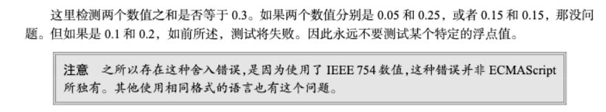

# JS 数据类型

> 重点：
>
> + 数据类型判断 typeof 
> + 数据类型转换
> + 精度丢失
> + Symbol
>

# 1 数据类型的分类
> <font style="color:rgb(33, 33, 33);">最新的 </font>**<font style="color:rgb(33, 33, 33);">ECMAScript</font>**<font style="color:rgb(33, 33, 33);"> 标准定义了8种数据类型</font>
>

+ 6 种基础数据类型：`**Undefined**`、 `**Null**`、 `**Boolean**`、 `**Number**`、 `**String**`** **和  `**Symbol**`
+ ES2020 新增一个基础类型 `**BigInt**`
+ 对象：`**Object**`

> + 保存原始值的变量是按值（by value）访问的，因为我们操作的就是存储在变量中的实际值。  
> + 在操作对象时，实际上操作的是对该对象的引用（reference）而非实际的对象本身。为此，保存引用值的变量是按引用（by reference）访问的。 
>

# 2 typeof运算符
对一个值使用`typeof`操作符会返回下列字符串之一：

+ "number" 表示值为数值；
+ "boolean" 表示值为布尔值；
+ "string" 表示值为字符串；
+ "symbol" 表示值为符号、
+ "**undefined**" 表示值未定义；
+ "object" 表示值为对象（而不是**function**）或null ；
+ "**function**" 表示值为函数；

```javascript
typeof 123 // "number"
typeof '123' // "string"
typeof false // "boolean"

v // ReferenceError: v is not defined 

typeof v // "undefined"
typeof undefined // 'undefined'

function f() {}
typeof f// "function" 注意！

typeof window // "object"
typeof {} // "object"
typeof [] // "object"
typeof null // "object" 注意！

typeof Symbol() // 'symbol'
```

# 3 基础数据类型
## 3.1 Undefined
+ <font style="color:rgb(255,80,119);">Undefined </font><font style="color:rgb(0,0,0);">类型只有一个值，就是特殊值 </font><font style="color:rgb(255,80,119);">undefined </font><font style="color:rgb(0,0,0);">。</font>
+ <font style="color:rgb(0,0,0);">当声明了变量但</font>**<font style="color:rgb(0,0,0);">没有初始化</font>**<font style="color:rgb(0,0,0);">的时候，就相当于给变量赋值了</font><font style="color:rgb(255,80,119);">undefined 。</font>
+ 没有声明的变量使用`typeof`也会返回 <font style="color:rgb(255,80,119);">undefined</font>

```javascript
let message; // 这个变量被声明了，只是值为 undefined 

console.log(typeof message); // "undefined" 
console.log(typeof age); // "undefined"

console.log(message); // "undefined" 
console.log(age); // 报错
```

## 3.2 Null
<font style="color:rgb(255,80,119);">Null </font><font style="color:rgb(0,0,0);">类型同样只有一个值，即特殊值 </font><font style="color:rgb(255,80,119);">null </font><font style="color:rgb(0,0,0);">。逻辑上讲， </font><font style="color:rgb(255,80,119);">null </font><font style="color:rgb(0,0,0);">值表示一个</font>**<font style="color:rgb(0,0,0);">空对象指针</font>**<font style="color:rgb(0,0,0);">，这也是给 </font><font style="color:rgb(255,80,119);">typeof </font><font style="color:rgb(0,0,0);">传一个 </font><font style="color:rgb(255,80,119);">null </font><font style="color:rgb(0,0,0);">会 返回 </font><font style="color:rgb(255,80,119);">"object" </font><font style="color:rgb(0,0,0);">的原因。</font>


`undefined`值是由`null`值派生而来的，因此ECMA-262将它们定义为表面上相等：

```javascript
console.log(null == undefined); // true


let car = null; 
console.log(typeof car); // "object"
```

即使`null `和`undefined`有关系，它们的用途也是完全不一样的：

+ 永远**不必**显式地将变量值设置为`undefined `。
+ 但`null`不是这样的。任何时候，只要变量要保存对象，而当时又没有那个对象可保存，就要用`null`来填充该变量。这样就可以保持`null`是**空对象指针**的语义，并进一步将其与`undefined`区分开来。

## 3.3 Boolean
Boolean （布尔值）类型是ECMAScript中使用最频繁的类型之一，有两个字面值： `true`和`false`。

> 注意，布尔值字面量 true 和 false 是区分大小写的，因此 True 和 False （及其他大小混写形式）是有效的标识符，但不是<font style="background-color:transparent;">布尔值。</font>
>

## 3.4 Number
在 JavaScript 中, Number 是一种 定义为 **64位双精度浮点型** (IEEE 754)的数字数据类型。

[https://devtool.tech/double-type](https://devtool.tech/double-type)


**进制表示**

+ 二进制：有前缀0b或0B的数值。
+ 十进制：没有前导0的数值。
+ 八进制：有前缀0o或0O的数值，或者有前导0、且只用到0-7的八个阿拉伯数字的数值。
+ 十六进制：有前缀0x或0X的数值。
+ 使用二、八和十六进制格式创建的数值在所有数学操作中都被视为十进制数值。

> 通常来说，有前导0的数值会被视为八进制，但是如果前导0后面有数字8和9，则该数值被视为十进制。
>
> 前导0表示八进制，处理时很容易造成混乱。ES5 的严格模式和 ES6，已经废除了这种表示法，但是浏览器为了兼容以前的代码，目前还继续支持这种表示法
>

### 
**整数和浮点数 **

> 因为存储浮点值使用的内存空间是存储整数值的两倍，所以ECMAScript总是想方设法把值转换为整数。在小数点后面没有数字的情况下，数值就会变成整数。类似地，如果数值本身就是整数，只是小数点后面跟着0（如1.0），那它也会被转换为整数
>

```javascript
let floatNum1 = 1.; // 小数点后面没有数字，当成整数1处理
let floatNum2 = 10.0; // 小数点后面是零，当成整数10处理
```

由于浮点数**<font style="color:#E8323C;">不是精确的值（</font>**[**乘2取余法**](https://segmentfault.com/a/1190000019386714)**<font style="color:#E8323C;">）</font>**，所以涉及小数的比较和运算要特别小心。

```javascript
0.1 + 0.2 === 0.3// false
(0.3 - 0.2) === (0.2 - 0.1)// false
```



[https://github.com/camsong/blog/issues/9](https://github.com/camsong/blog/issues/9)

[https://zhuanlan.zhihu.com/p/100353781](https://zhuanlan.zhihu.com/p/100353781)


```jsx
 4.5 => 二进制 100.1 1.001*2^2  1不需要，指数+1023

001*2^1025
```


**数值精度**

根据国际标准 IEEE 754，JavaScript 浮点数的64个二进制位，从最左边开始，是这样组成的。

+ 第1位：符号位，`0`表示正数，`1`表示负数
+ 第2位到第12位（共11位）：指数部分，正常情况下（指数部分在0到2047之间）
+ 第13位到第64位（共52位）：小数部分（即有效数字）


> 精度最多只能到 53 个二进制位，这意味着，绝对值小于  2的 53 次方的整数，即 -2<sup>53</sup>到 2<sup>53</sup>，都可以精确表示。简单来说对，JavaScript 对**<font style="color:#E8323C;">15位</font>**的十进制数都可以**精确处理**。
>


**数值范围**

根据标准，64位浮点数的指数部分的长度是11个二进制位，意味着指数部分的最大值是2047（2的11次方减1）。


也就是说，64位浮点数的指数部分的值最大为2047，分出一半表示负数，则 JavaScript 能够表示的数值范围为2<sup>1024</sup>到 2<sup>-1023</sup>（开区间），超出这个范围的数无法表示。


如果一个数大于等于2的1024次方，那么就会发生“**正向溢出**”，即 JavaScript 无法表示这么大的数，这时就会返回`Infinity`。

```javascript
Math.pow(2, 1024) // Infinity
```


如果一个数小于等于2的-1075次方（指数部分最小值-1023，再加上小数部分的52位），那么就会发生为“**负向溢出**”，即 JavaScript 无法表示这么小的数，这时会直接返回0。

```javascript
Math.pow(2, -1075) // 0
```


JavaScript 提供Number对象的`MAX_VALUE`和`MIN_VALUE`属性，返回可以表示的具体的最大值和最小值。

```javascript
Number.MAX_VALUE // 1.7976931348623157e+308
Number.MIN_VALUE // 5e-324
```

**科学计数法**

```javascript
let floatNum = 3.125e7; // 等于31250000
```

+ 两种情况，JavaScript 会自动将数值转为科学计数法表示，其他情况都采用字面形式直接表示。
    - **小数点前的数字多于21位**
    - **小数点后的零多于5个**


**±0/Infinity**

+ JavaScript 内部实际上存在2个0：一个是+0，一个是-0，区别就是64位浮点数表示法的符号位不同。它们是等价的。
+ `Infinity`有正负之分，`Infinity`表示正的无穷，`-Infinity`表示负的无穷。


`isFinite`方法返回一个布尔值，表示某个值是否为正常的数值。

```javascript
isFinite(Infinity) // false
isFinite(NaN) // false
isFinite(undefined) // false
isFinite(null) // true
isFinite(-1) // true
```

**NaN**

`NaN`是 JavaScript 的特殊值，表示“非数字”**（Not**** a Number）**，主要出现在将字符串解析成数字出错的场合。

+ `NaN`不是独立的数据类型，而是一个特殊数值，它的数据类型依然属于Number
+ `NaN`不等于任何值，包括它本身。
+ `NaN`在布尔运算时被当作`false`。
+ `NaN`与任何数（包括它自己）的运算，得到的都是`NaN`。
+ 函数`isNaN()`用来判断一个变量是否为非数字的类型，返回 true 或者 false。


## 3.5 String
<font style="color:rgb(255,80,119);">String</font><font style="color:rgb(0,0,0);">（字符串）数据类型表示零或多个16位Unicode字符序 列。字符串可以使用双引号（"）、单引号（'）或反引号（`）表示。</font>

**转义字符**

除了普通的可打印字符以外，一些有特殊功能的字符可以通过转义字符的形式放入字符串中：


| Code | Output |
| :--- | :--- |
| `\0` | 空字符 |
| `\'` | 单引号 |
| `\"` | `双引号` |
| `\\` | 反斜杠 |
| `\n` | 换行 |
| `\r` | `回车` |
| `\v` | 垂直制表符 |
| `\t` | 水平制表符 |
| `\b` | 退格 |
| `\f` | 换页 |
| `\unnnn` | 以十六进制编码nnnn 表示的Unicode字符（其中n 是十六进制数字0~F），例如<br/>\u03a3 等于希腊字符"Σ" |
| `\xnn` | 以十六进制编码nn 表示的字符（其中n 是十六进制数字0~F），例如\x41 等于"A" |


**字符串特点**

> ECMAScript中的字符串是不可变的（immutable），意思是一旦创建，它们的值就不能变了。要修改某个变量中的字符串值，必<font style="background-color:transparent;">须先销毁原始的字符串，然后将包含新值的另一个字符串保存到</font><font style="background-color:transparent;">该变量</font>
>

+ 字符串内部的单个字符无法改变和增删，这些操作不是生效。
+ `length`属性返回字符串的长度，修改该属性也不会生效。


<font style="color:#404040;">字符串可以被视为字符数组，因此可以使用数组的方括号运算符，用来返回某个位置的字符（位置编号从0开始）</font>

```javascript
var s = 'hello';
s[0] // "h"
s[4] // "o"
s[-1]//undefined
```

### 转换为字符串
**toString()**

`toString()`方法可见于数值、布尔值、对象和字符串值。（没错，字符串值也有 `toString()` 方法，该方法只是简单地返回自身的一个副本。） `null`和 `undefined`值没有`toString()` 方法。


多数情况下，`toString()`不接收任何参数。不过，在对**数值**调用这个方法时，`toString()` 可以接收一个底数参数，即以什么底数来输出数值的字符串表示。默认情况下，`toString()`返回数值的十进制字符串表示。而通过传入参

数，可以得到数值的二进制、八进制、十六进制，或者其他任何有效基数的字符串表示。

```javascript
let num = 10;
console.log(num.toString()); // "10"
console.log(num.toString(2)); // "1010"
console.log(num.toString(8)); // "12"
```

> <font style="color:rgb(51,51,51);">用加号操作符给一个值加上一个空字符串 </font><font style="color:rgb(255,80,119);">"" </font><font style="color:rgb(51,51,51);">也可以将其转换为字符串</font>
>

#### 
**String()**

如果你不确定一个值是不是 `null`或 `undefined`，可以使用`String()` 转型函数，它始终会返回表示相应类型值的字符串。`String()`函数遵循如下规则。

+ 如果值有`toString()`方法，则调用该方法（不传参数）并返回结果。
+ 如果值是 `null`，返回 "null" 。
+ 如果值是 `undefined`，返回 "undefined" 。

```javascript
let value1 = 10;
let value2 = true;
let value3 = null;
let value4;
console.log(String(value1)); // "10"
console.log(String(value2)); // "true"
console.log(String(value3)); // "null"
console.log(String(value4)); // "undefined"
```

### 
### 模板字面量（ES6）
**多行字符串**

```javascript
console.log(`string text line 1
string text line 2`);
// "string text line 1
// string text line 2"
```

**插入表达式**

```javascript
var a = 5;
var b = 10;
console.log(`Fifteen is ${a + b} and
not ${2 * a + b}.`);
// "Fifteen is 15 and
// not 20."
```

### 原始字符串
使用模板字面量也可以直接获取原始的模板字面量内容（如换行符或Unicode字符），而不是被转换后的字符表示。为此，可以使用默认的`String.raw`标签函数。

```javascript
// Unicode示例
// \u00A9是版权符号
console.log(`\u00A9`); // ©
console.log(String.raw`\u00A9`); // \u00A9
```

# 3.6 bigInt
BigInt 是一种内置对象，它提供了一种方法来表示大于 253 - 1 的整数。这原本是 Javascript中可以用 Number 表示的最大数字。BigInt 可以表示任意大的整数。

<font style="color:rgb(27, 27, 27);"></font>

可以用在一个整数字面量后面加 n 的方式定义一个 BigInt ，如：10n，或者调用函数BigInt()。

```javascript
const theBiggestInt = 9007199254740991n;

const alsoHuge = BigInt(9007199254740991);
//  9007199254740991n
```

+ 不能用于 Math 对象中的方法；不能和任何 Number 实例混合运算，两者必须转换成同一种类型。
+ BigInt 和 Number 不是严格相等的，但是宽松相等的。

**4 ****<font style="color:rgb(54, 54, 54);">包装对象</font>**  
[https://wangdoc.com/javascript/stdlib/wrapper.html](https://wangdoc.com/javascript/stdlib/wrapper.html)  
  
<font style="color:rgb(74, 74, 74);">所谓“包装对象”，指的是与数值、字符串、布尔值分别相对应的</font><font style="color:rgb(218, 16, 57);background-color:rgb(245, 245, 245);">Number</font><font style="color:rgb(74, 74, 74);">、</font><font style="color:rgb(218, 16, 57);background-color:rgb(245, 245, 245);">String</font><font style="color:rgb(74, 74, 74);">、</font><font style="color:rgb(218, 16, 57);background-color:rgb(245, 245, 245);">Boolean</font><font style="color:rgb(74, 74, 74);">三个原生对象。这三个原生对象可以把原始类型的值变成（包装成）对象。</font>

```javascript
var v1 = new Number(123);
var v2 = new String('abc');
var v3 = new Boolean(true);

typeof v1 // "object"
typeof v2 // "object"
typeof v3 // "object"

v1 === 123 // false
v2 === 'abc' // false
v3 === true // false
```

  
<font style="color:rgb(218, 16, 57);background-color:rgb(245, 245, 245);">Number</font><font style="color:rgb(74, 74, 74);">、</font><font style="color:rgb(218, 16, 57);background-color:rgb(245, 245, 245);">String</font><font style="color:rgb(74, 74, 74);">和</font><font style="color:rgb(218, 16, 57);background-color:rgb(245, 245, 245);">Boolean</font><font style="color:rgb(74, 74, 74);">这三个原生对象，如果不作为构造函数调用（即调用时不加</font><font style="color:rgb(218, 16, 57);background-color:rgb(245, 245, 245);">new</font><font style="color:rgb(74, 74, 74);">），而是作为普通函数调用，常常用于将任意类型的值转为数值、字符串和布尔值。</font>  
注意 Symbol 不能加 new。

  


> 更新: 2024-02-18 17:34:13  
> 原文: <https://www.yuque.com/xiaoshan_wgo/codingnotes/zvwu4lox1gm87axe>