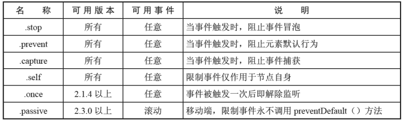
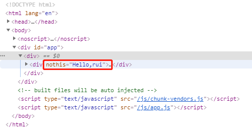

# VUE 基础

# MVVM
+ **MVC** 是后端的分层开发概念； **MVVM**是前端视图层的概念，主要关注于视图层分离，也就是说：MVVM把前端的视图层，分为了 三部分 Model, View, VM(ViewModel)。
+ M（Model）：数据层，Vue 中数据层都放在 data 里面
+ V（View）：视图，Vue中View即我们的HTML页面  
+ VM（View-Model）：控制器，将数据和视图层建立联系，VM即Vue的实例就是vm  

# Vue指令
## v-bind
+ v-bind 用来**属性绑定**
+ v-bind:href 可以缩写为 :href
+ 动态地绑定一个或多个 attribute，或一个组件 prop 到表达式。
+ 在绑定 `class` 或 `style` attribute 时，支持其它类型的值，如数组或对象。
+ 在绑定 prop 时，prop 必须在子组件中声明。可以用修饰符指定不同的绑定类型。
+ 没有参数时，可以绑定到一个包含键值对的对象。注意此时 `class` 和 `style` 绑定不支持数组和对象。

> [https://cn.vuejs.org/v2/guide/class-and-style.html](https://cn.vuejs.org/v2/guide/class-and-style.html)
>

## v-on
> [https://cn.vuejs.org/v2/guide/events.html](https://cn.vuejs.org/v2/guide/events.html)
>

+ 用来**绑定事件**的
+ 形式如：v-on:click  缩写为 @click;

### 事件修饰符


### 按键修饰符


## v-model
> [https://cn.vuejs.org/v2/guide/forms.html](https://cn.vuejs.org/v2/guide/forms.html)
>

<font style="color:#304455;">你可以用 </font>`v-model`<font style="color:#304455;"> 指令在表单 </font>`<input>`<font style="color:#304455;">、</font>`<textarea>`<font style="color:#304455;"> 及 </font>`<select>`<font style="color:#304455;"> </font>**<font style="color:#304455;">可输入元素</font>**<font style="color:#304455;">上创建</font>**<font style="color:#304455;">双向数据绑定</font>**<font style="color:#304455;">。它会根据控件类型自动选取正确的方法来更新元素。尽管有些神奇，但 </font>`v-model`<font style="color:#304455;"> 本质上不过是语法糖。它负责监听用户的输入事件以更新数据，并对一些极端场景进行一些特殊处理。</font>

`v-model` 在内部为不同的输入元素使用不同的 property 并抛出不同的事件：

+ text 和 textarea 元素使用 `value` property 和 `input` 事件；
+ checkbox 和 radio 使用 `checked` property 和 `change` 事件；
+ select 字段将 `value` 作为 prop 并将 `change` 作为事件。

```html
<input v-model="message" placeholder="edit me">
<p>Message is: {{ message }}</p>
```

**可以用修饰符丰富用户的输入行为**：

+ `[.lazy](https://cn.vuejs.org/v2/guide/forms.html#lazy)` - 在`change`时而非`input`时更新
+ `.number` - 输入字符串转为有效的数字
+ `.trim` - 输入首尾空格过滤

## v-if 
`v-if`<font style="color:#304455;"> 指令用于条件性地渲染一块内容。这块内容只会在指令的表达式返回 true值的时候被渲染。</font>

<font style="color:#304455;">搭配：</font>

`<font style="color:#000000;">v-else</font>`

`<font style="color:#000000;">v-else-if</font>`

## v-show
`v-show` 和 `v-if`的区别：

+ `v-show`本质就是标签display设置为none，控制隐藏
    - `v-show`只编译一次，后面其实就是控制css，而`v-if`不停的销毁和创建，故`v-show`性能更好一点。
+ `v-if`是动态的向DOM树内添加或者删除DOM元素
    - `v-if`切换有一个局部编译/卸载的过程，切换过程中合适地销毁和重建内部的事件监听和子组件。

## v-for
<font style="color:#333333;">用于循环的数组里面的值可以是对象，也可以是普通元素  </font>

+ **不推荐**同时使用 `v-if` 和 `v-for`
+ 当 `v-if` 与 `v-for` 一起使用时，`v-for` 具有比 `v-if` 更高的优先级。


> <font style="color:#304455;">建议尽可能在使用 </font>`v-for`<font style="color:#304455;"> 时提供 </font>`key`<font style="color:#304455;"> attribute，除非遍历输出的 DOM 内容非常简单，或者是刻意依赖默认行为以获取性能上的提升。</font>
>

```html
<div v-for="item in items" v-bind:key="item.id">
  <!-- 内容 -->
</div>
```

## 其他
### v-text
+ `v-text`指令用于将数据填充到标签中，作用于插值表达式类似，但是没有闪动问题
+ 注意：此处为单向绑定，数据对象上的值改变，插值会发生变化；但是当插值发生变化并不会影响数据对象的值

### v-html
+ <font style="color:#333333;">它与</font>`<font style="color:#333333;">v-text</font>`<font style="color:#333333;">区别在于</font>`<font style="color:#333333;">v-text</font>`<font style="color:#333333;">输出的是纯文本，浏览器不会对其再进行html解析，但</font>`<font style="color:#333333;">v-html</font>`<font style="color:#333333;">会将其当html标签解析后输出。</font>

### v-pre
+ 跳过这个元素和它的子元素的编译过程。
+ **一些静态的内容不需要编译加这个指令可以加快渲染**

### v-once
+ 只渲染元素和组件一次。随后的重新渲染，元素/组件及其所有的子节点将被视为**静态内容**并跳过。这可以用于优化更新性能。

### v-clock
+ <font style="color:#404040;">当网络较慢，网页还在加载 Vue.js ，而导致 Vue 来不及渲染，这时页面就会显示出 Vue 源代码。我们可以使用 v-cloak 指令来解决这一问题。</font>

```html
<div v-cloak>
  {{ message }}
</div>
```

```css
[v-cloak] {
  display: none;
}
```

> 在具有工程化的项目里，项目的html结构只有一个空的div元素，剩余的内容是由路由去挂载不同组件完成的，所以不需要v-cloak
>

# 数据和方法
## data
**一个组件的 **`**data**`** 选项必须是一个函数**<font style="color:#304455;">，因此每个实例可以维护一份被返回对象的独立的拷贝,让每个子组件都拥有独立的数据存储。</font>

```javascript
data() {
  return {
    count: 0
  }
}
```

## computed
+ **计算属性是基于它们的响应式依赖进行缓存的**<font style="color:#304455;">，只在相关响应式依赖发生改变时它们才会重新求值。</font>

## watch
+ <font style="color:#304455;">Vue 提供了一种更通用的方式来观察和响应 Vue 实例上的数据变动：</font>**侦听属性。**
+ `watch`更注重于处理数据变化时的业务逻辑，而`computed`更注重于衍生数据，因此，与`computed`相比，`watch`还可用于`watch`异步修改数据。

## filters
Vue.js 允许你自定义过滤器，可被用于一些常见的文本格式化。过滤器可以用在两个地方：**插值表达式和 **`**v-bind**`** 表达式** (后者从 2.1.0+ 开始支持)。

```javascript
<!-- 在双花括号中 -->
{{ message | capitalize }}
<!-- 在 `v-bind` 中 -->
<div v-bind:id="rawId | formatId"></div>
```

你可以在一个组件的选项中定义本地的过滤器：

```javascript
filters: {
  capitalize: function (value) {
    if (!value) return ''
    value = value.toString()
    return value.charAt(0).toUpperCase() + value.slice(1)
  }
}
```

# 组件
## 父子组件传值
```javascript
  <div id="app">
        <counter :count='1' @change='handle'></counter>
        <div>{{total}}</div>
    </div>

    <script >
        var counter = {
            props:['count'],
            data:function(){
                return{
                    number: this.count
                }
            },
            template:'<div @click="handleClick ">{{number}} </div>',
            methods:{
                handleClick: function () {
                    this.number++;
                    this.$emit('change',2)
                }
            }
        }
        var vm = new Vue({
            el: '#app',
            data: {
                total: 3
            },
            components:{
                counter:counter
            },
            methods: {
                handle: function(step) {
                    this.total+=step;
                }

            }
        });
    </script>
```

## 组件参数校验
```javascript
Vue.component('my-component', {
  props: {
    // 基础的类型检查 (`null` 和 `undefined` 会通过任何类型验证)
    propA: Number,
    // 多个可能的类型
    propB: [String, Number],
    // 必填的字符串
    propC: {
      type: String,
      required: true
    },
    // 带有默认值的数字
    propD: {
      type: Number,
      default: 100
    },
    // 带有默认值的对象
    propE: {
      type: Object,
      // 对象或数组默认值必须从一个工厂函数获取
      default: function () {
        return { message: 'hello' }
      }
    },
    // 自定义验证函数
    propF: {
      validator: function (value) {
        // 这个值必须匹配下列字符串中的一个
        return ['success', 'warning', 'danger'].indexOf(value) !== -1
      }
    }
  }
})
```

## [<font style="color:#000000;">非 Prop</font>](https://cn.vuejs.org/v2/guide/components-props.html#%E9%9D%9E-Prop-%E7%9A%84-Attribute)<font style="color:#000000;">特性</font>
一个非 prop 的 attribute 是指传向一个组件，但是该组件并没有相应 prop 定义的 attribute。

和props特别的主要区别是，props特性可以使用插值的形式获取父组件传递的值，而非props不能，props特性在页面渲染的时候不会显示出来，非props特性是以属性的方式显示在渲染出来的html模板中。

```javascript
//父
<template>
<div>
  <childDom :hasThis="hasThis" :noThis="noThis"> </childDom>
</div>
</template>

//子
<template>
<div>
  <p>hasThis:{{ hasThis }}</p>
</div>
</template>
<script>
export default {
name: "son-dom",
props: ["hasThis"],
};
</script>
```




## 组件绑定事件
```javascript

    <div id="app">
        <child @click='handleClick'></child>
    </div>

    <script ">
        var child = {
            template:'<div @click="handleChildClick ">child</div>',
            methods:{
                handleChildClick: function () {
                    this.$emit('click')
                }
            }
        }
        var vm = new Vue({
            el: '#app',
            data: {
                total: 3
            },
            components:{
                child:child
            },
            methods: {
                handleClick: function() {
                   alert('click');
                }

            }
        });
    </script>
```

可通过直接绑定原生事件

```javascript
<child @click.native='handleClick'></child>
```

## 非父子组件传值bus
```javascript
        Vue.prototype.bus = new Vue();

        Vue.component('child', {
            data: function() {
                return {
                    selfContent: this.content
                }
            },
            props: {
                content: String
            },
            template: '<div @click="handleClick">{{selfContent}}</div>',
            methods: {
                handleClick: function() {
                    //由于bus是vue的一个实例，所以它有$emit这个方法,change就是一个随意的名字，可以改成aaa
                    this.bus.$emit('change', this.selfContent)
                }
            },
            mounted: function() {
                var this_ = this;
                this.bus.$on("change", function(msg) {
                    this_.selfContent = msg;
                })
            }
        })
        var vm = new Vue({
            el: '#app',
            data: {},
            methods: {},

        })
```


## is特性
就是某些标签下只能使用指定的标签，否则无法被浏览器正确解析，例如ul、table、a、select这些。(例如ul一般跟着li，select一般跟着option这样)


```html
<ul>
    <component-name></component-name>
</ul>
```


所以导致，上面的代码并不能被浏览器正确的解析，最终导致组件不能生效。

如果我们想要在这些标签ul、table、a、select下使用组件，想要他正确的被解析出来，就需要使用is属性。

is属性的值是组件名，例如在ul下使用一个组件，代码可以这样写：


```html
// ul下使用组件
<ul>
    <li is="component-name"></li>
</ul>
```


## ref
尽管存在 prop 和事件，有的时候你仍可能需要在 JavaScript 里直接访问一个子组件。为了达到这个目的，你可以通过 `ref` 这个 attribute 为子组件赋予一个 ID 引用。例如：

```html
<base-input ref="usernameInput"></base-input>
```

现在在你已经定义了这个 `ref` 的组件里，你可以使用：

```javascript
this.$refs.usernameInput
```

# 插槽
<font style="color:#304455;">Vue 实现了一套内容分发的 API，这套 API 的设计灵感源自 </font>Web Components 规范草案<font style="color:#304455;">，将 </font>`<slot>`<font style="color:#304455;"> 元素作为承载分发内容的出口。</font>

## 使用插槽
```html
    <div id="app">
				//父
        <child>
            <p>body</p>
        </child>

    </div>

    <script>
        Vue.component('child', {
          //子
            template: '<div> 
              <slot></slot>  //会替换为 <p>body</p>
              </div > '

        })
        var vm = new Vue({
            el: '#app',
            data: {},
            methods: {},

        })
    </script>
```

## 具名插槽
```html
    <div id="app">

        <child>
          	<p>body</p>
            <p slot='header'>header</p>
            <p>footer</p>
        </child>

    </div>

    <script>
        Vue.component('child', {

            template: '<div> 
              <slot name = 'header'></slot>
              <slot></slot> 
              < /div > '

        })
        var vm = new Vue({
            el: '#app',
            data: {},
            methods: {},

        })
    </script>
/*
	header
	body
	footer
*/
```

## 作用域插槽
<font style="color:#666666;">这里主要解决的是父组件在向子组件插槽传递模板内容时存在访问子组件数据的问题</font>

```html
  	<div id="app">

        <child>
            <template scope='props'>
            		<h1>{{props.item}}</h1>
          	</template>
        </child>

    </div>

    <script>
        Vue.component('child', {
						data: function(){
            	return{
              	list:[1,2,3,4]
              }
            }
            template: '<div> 
              	<slot v-for="item of list" :item=item >
      					</slot>
              < /div > '

        })
        var vm = new Vue({
            el: '#app',
            data: {},
            methods: {},

        })
    </script>
```

## v-slot
在 2.6.0 中，我们为具名插槽和作用域插槽引入了一个新的统一的语法 (即 `v-slot` 指令)。它取代了 `slot` 和 `slot-scope` 这两个目前已被废弃但未被移除且仍在文档中的 attribute。    

> [https://cn.vuejs.org/v2/guide/components-slots.html](https://cn.vuejs.org/v2/guide/components-slots.html)
>


> 更新: 2024-08-23 15:08:10  
> 原文: <https://www.yuque.com/xiaoshan_wgo/codingnotes/qot763al9eq4yaga>