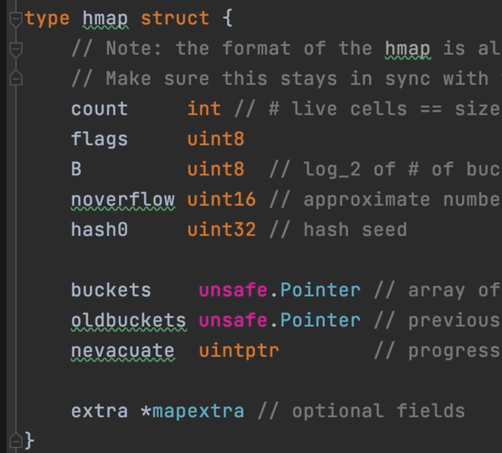
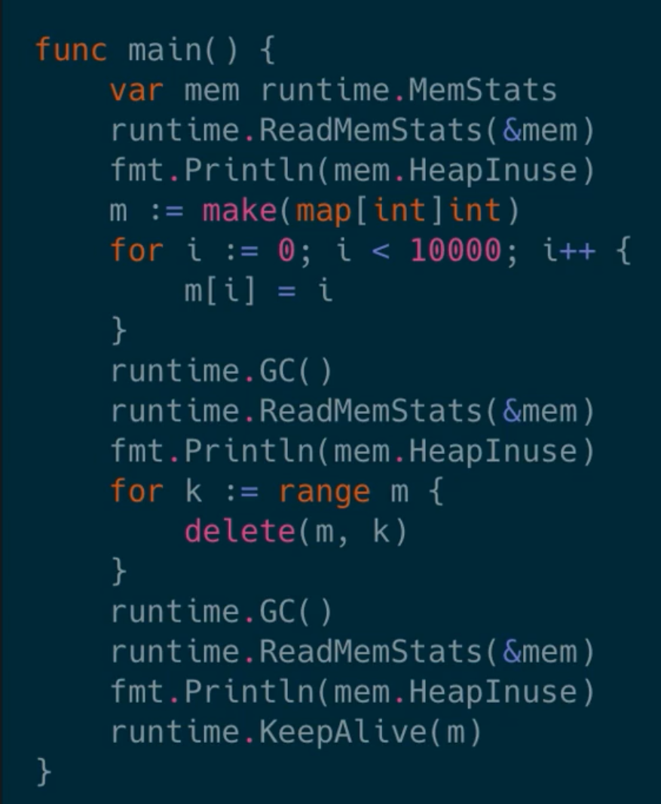

# Map 的底层结构


```go
func main(){
    m:= make(map[int]int)
    modifyMap(m)
    fmt.Println(m)
}
func modifyMap(m map[int]int){
    m[1] = 1
    m[2] = 2
}
//1 1 2 2

```

map的底层结构



使用make创建的map 创建的是指向map的指针。没有任何办法对map进行调优。


拉链法。

map实际上的值是指针，穿的参数的指针。

修改会影响整个map。

```go
m := make(map[int]int)
m[1] = 1
fmt.Println(&m[1])
//可以这么写的吗
```

根据map的结构 ，是不可以这么写的，随着map的扩容，map的key和value的地址会进行改变。。

map会发生copy。



这说明了map在删除元素之后是不会进行缩容的。


> 更新: 2022-02-12 14:00:44  
> 原文: <https://www.yuque.com/xiaoshan_wgo/codingnotes/nhgzv2>