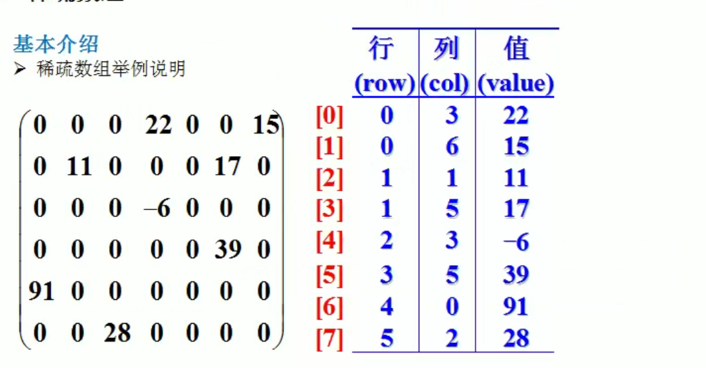
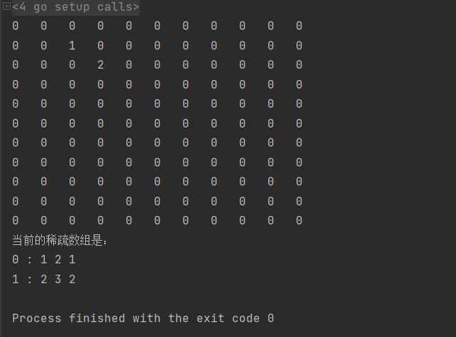

# 稀疏sparsearray数组

## 稀疏数组的引入
加入二维数组中很多数值默认值都是0，这样就记录很多没有意义的数组。

当一个数组大部分元素为0，或者为一个同一个值的数组时候，可以使用稀疏数组来保存该数组。

## 稀疏数组的介绍
当一个数组大部分元素为0，或者为一个同一个值的数组时候，可以使用稀疏数组来保存该数组。

稀疏数组的处理方法是：

（1）记录数组一共有几行几列，有多少个不同的值

（2）把具有不同值得元素的行列及值记录在一个小规模的数组中，从而缩小程序的规模



## 稀疏数组实例


（1）使用稀疏数组，来保留类似前面的二维数组（棋盘，地图）

（2）把稀疏数组存盘，并且可以重新恢复原来的二维数组

（3）整体思路分析

（4）代码实现

```go
package main

import (
	"fmt"
)

type ValNode struct {
	row int
	col int
	val int
}
func main() {
	//1.创建一个元原始的数组
	var chessMap [11][11]int
	chessMap[1][2] = 1
	chessMap[2][3] = 2
	//2.输出看看原始的数组
	for _, v := range chessMap{
		for _,v2 := range v{
			fmt.Printf("%d\t",v2)
		}
		fmt.Println()
	}

	//3.转成稀疏数组
	//思路：遍历这个二维数组，如果发现有一个元素的值不等于0，这时候就创建一个node结构体，将其放入到对应的切片中。
	//所以需要把行、列、值放入到结构体中进行存储。
	var sparseArr []ValNode
	
	//标准的一个稀疏数组应该还有一个表示记录原始的二维数组的规模（行和列有多少，默认值）
	valNode := ValNode{
		row : 11,
		col : 11,
		val : 0,
	}
	
	for i,v := range chessMap{
		for j,v2 := range v{
			if v2 != 0{
				//创建ValNode
				valNode = ValNode{
					row : i,
					col : j,
					val : v2,
				}
				sparseArr = append(sparseArr,valNode)
			}
		}
	}
	//输出稀疏数组
	fmt.Println("当前的稀疏数组是：")
	for i, valNode := range sparseArr{
		fmt.Printf("%d : %d %d %d",i,valNode.row,valNode.col,valNode.val)
	}
}

```

运行结果：



## 稀疏数组存盘并恢复成原始数组
```go
var chessMap2 [11][11]int
	//遍历文件的每一行
	for i,valNode := range sparseArr {
		if i != 0{
			chessMap2[valNode.row][valNode.col] = valNode.val
		}
	}
	
	//查看chessMap2/
	for _, v := range chessMap2{
		for _,v2 := range v{
			fmt.Printf("%d\t",v2)
		}
		fmt.Println()
	}
```

注: 由于这个行和列的初始值是11 ,第4行是防止数组越界。


> 更新: 2022-01-04 17:00:22  
> 原文: <https://www.yuque.com/xiaoshan_wgo/codingnotes/gy1wlf>