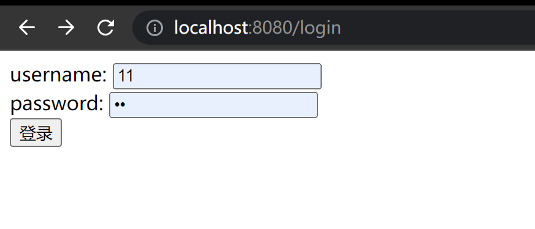

# Gin form 参数

1. 浏览器输入 URL 发送`GET`请求给 web 服务器，同时加载 html 文件
2. 接收用户的 input ，使用 `POST` 响应接收返还回来的 Form 表单

```go
package main

import (
	"github.com/gin-gonic/gin"
	"net/http"
)
//获取 form 表单提交的参数
func main() {
	r := gin.Default()
	r.LoadHTMLFiles("./login.html")
	r.GET("/login",func(c *gin.Context){
		c.HTML(http.StatusOK,"login.html",nil)
	})
	// 处理 login 的 post请求
	//一次请求对应一个响应
	r.POST("/login",func(c *gin.Context){
		username := c.PostForm("username")
		password := c.PostForm("password")
		c.JSON(http.StatusOK,gin.H{
			"Name":username,
			"password":password,
			"success":"登陆成功！",
		})
	})
	r.Run()
}
```

HTML 文件中，username 和 password 在 form 标签中被 input，"登录"的类型是 submit , submit 到 action = "/login" 路径下，submit 的方式是 post 请求。

```html
<!DOCTYPE html>
<html lang="en">
<head>
    <meta charset="UTF-8">
    <title>login</title>
</head>
<body>
<form action="/login" method="post" novalidate autocomplete="off">
    <div>
        <label for="username">username:</label>
        <input type="text" name="username" id="username">
    </div>

    <div>
        <label for="password">password:</label>
        <input type="password" name="password" id="password">
    </div>

    <input  type="submit" value="登录">
</form>
</body>
</html>
```




```go
package main

import (
    "github.com/gin-gonic/gin"
    "net/http"
)
//获取 form 表单提交的参数
func main() {
    r := gin.Default()
    r.LoadHTMLFiles("./login.html")
    r.GET("/login",func(c *gin.Context){
        c.HTML(http.StatusOK,"login.html",nil)
    })
    // 处理 login 的 post请求
    //一次请求对应一个响应
    r.POST("/login",func(c *gin.Context){
        //username := c.PostForm("username")
        //password := c.PostForm("password")
        //username := c.DefaultPostForm("username","everyone")
        
        username, ok := c.GetPostForm("username")
        if !ok{
            username = "everyone"
        }
        password := c.DefaultPostForm("password","***")
        c.JSON(http.StatusOK,gin.H{
            "Name":username,
            "password":password,
            "success":"登陆成功！",
        })
    })
    
    r.Run()
}
```

**❗****注: 一个请求对应一个方法。**


> 更新: 2022-04-27 18:37:44  
> 原文: <https://www.yuque.com/xiaoshan_wgo/codingnotes/lie36g>