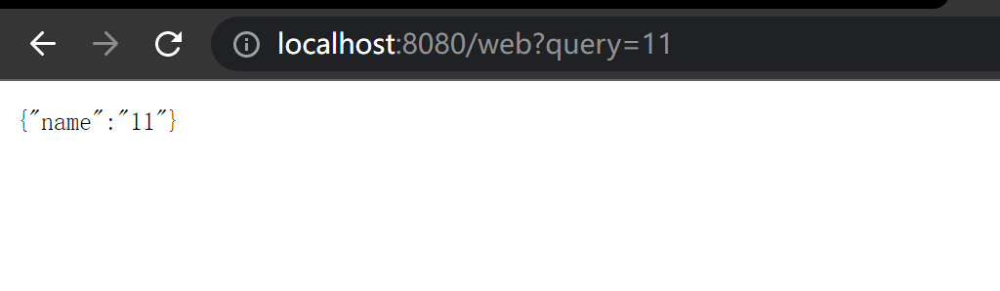
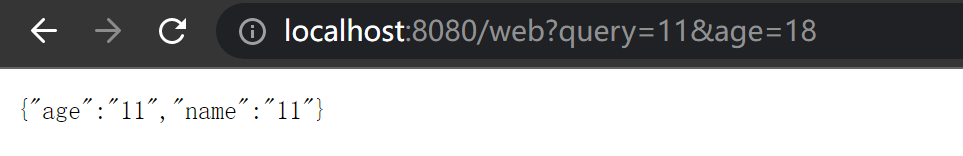

# Gin query string 参数

多用于 Get 请求里面，放在 URL 的后面。


使用`c.Query("query")`，如下：

```go
package main

import (
	"github.com/gin-gonic/gin"
	"net/http"
)

func main() {
	r := gin.Default()
	r.GET("/web",func(c *gin.Context){
		//获取浏览器那边发请求携带的 query string 参数
		name := c.Query("query") //通过 Query 获取请求中携带的querystring参数
		c.JSON(http.StatusOK, gin.H{
			"name": name,
		})
	})
	r.Run()
}
```

在浏览器里面发送`GET`请求，URL 后面加上`/web?query = 11`结果显示：


还可以使用默认值，如果找不到 query 就返回默认值。

```go
package main

import (
	"github.com/gin-gonic/gin"
	"net/http"
)

func main() {
	r := gin.Default()
	r.GET("/web",func(c *gin.Context){
		//获取浏览器那边发请求携带的 query string 参数
		//name := c.Query("query") //通过 Query 获取请求中携带的querystring参数
		name := c.DefaultQuery("query","Arusi")
		c.JSON(http.StatusOK, gin.H{
			"name": name,
		})
	})
	r.Run()
}
```


还可以使用 `GetQuery`，`GetQuery`相较于`Query`方法，它多返回了一个`bool`类型来进行判断。

```go
package main

import (
	"github.com/gin-gonic/gin"
	"net/http"
)

func main() {
	r := gin.Default()
	r.GET("/web",func(c *gin.Context){
		//获取浏览器那边发请求携带的 query string 参数
		//name := c.Query("query") //通过 Query 获取请求中携带的querystring参数
		//name := c.DefaultQuery("query","Arusi")
		name,ok := c.GetQuery("query") //多了一个 bool 类型的返回值
		if !ok {
			name = "Arusi"
		}
		c.JSON(http.StatusOK, gin.H{
			"name": name,
		})
	})
	r.Run()
}
```




 

:::danger
注: 在使用query后面可以加很多参数，且都能获取到。用 & 链接。

:::





> 更新: 2022-04-27 14:14:14  
> 原文: <https://www.yuque.com/xiaoshan_wgo/codingnotes/qb34u1>