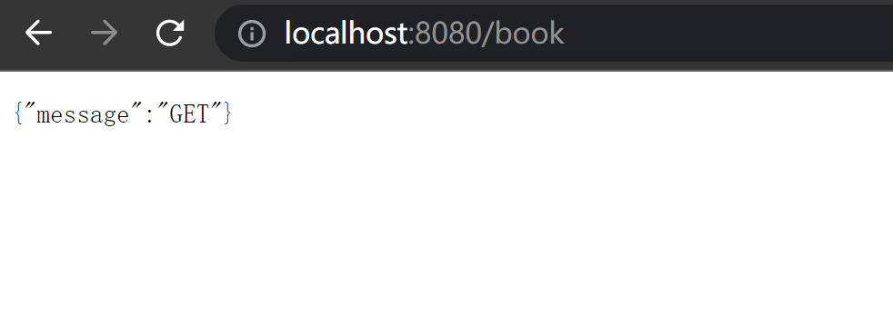
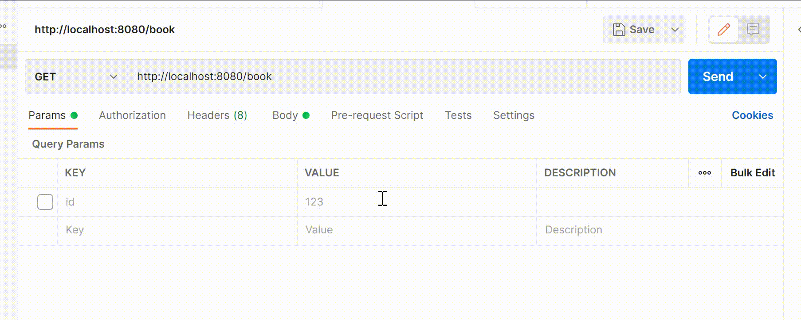
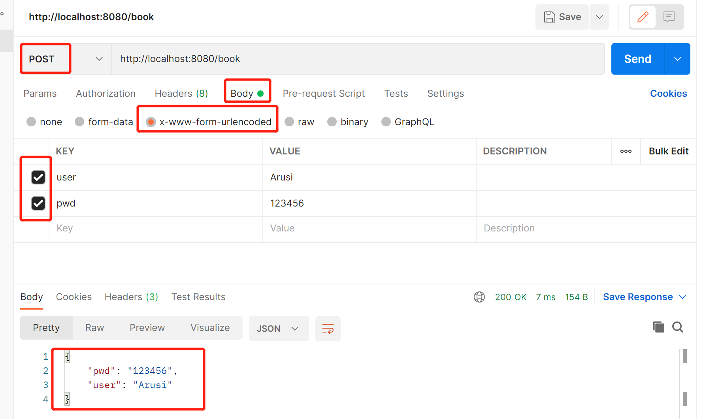

# Gin 的 GET/POST/DELETE/PUT 请求

+ `<font style="color:rgb(68, 68, 68);background-color:rgb(248, 248, 248);">GET</font>`<font style="color:rgb(68, 68, 68);">用来获取资源</font>
+ `<font style="color:rgb(68, 68, 68);background-color:rgb(248, 248, 248);">POST</font>`<font style="color:rgb(68, 68, 68);">用来新建资源</font>
+ `<font style="color:rgb(68, 68, 68);background-color:rgb(248, 248, 248);">PUT</font>`<font style="color:rgb(68, 68, 68);">用来更新资源</font>
+ `<font style="color:rgb(68, 68, 68);background-color:rgb(248, 248, 248);">DELETE</font>`<font style="color:rgb(68, 68, 68);">用来删除资源</font>

```go
func main() {
	// Disable Console Color
	// gin.DisableConsoleColor()

	// 使用默认中间件创建一个gin路由器
	// logger and recovery (crash-free) 中间件
	router := gin.Default()

	router.GET("/someGet", getting)
	router.POST("/somePost", posting)
	router.PUT("/somePut", putting)
	router.DELETE("/someDelete", deleting)
	router.PATCH("/somePatch", patching)
	router.HEAD("/someHead", head)
	router.OPTIONS("/someOptions", options)

	// 默认启动的是 8080端口，也可以自己定义启动端口
	router.Run()
	// router.Run(":3000") for a hard coded port
}
```

如下运行一个简单的 json 传给客户端。

不同的 r 方法返回不同的内容。

Gin 采用四种方法是一种 <font style="color:rgb(68, 68, 68);">RESTful</font> API 规范。

```go
func main() {
	r := gin.Default()
	r.GET("/book", func(c *gin.Context) {
		c.JSON(200, gin.H{
			"message": "GET",
		})
	})

	r.POST("/book", func(c *gin.Context) {
		c.JSON(200, gin.H{
			"message": "POST",
		})
	})

	r.PUT("/book", func(c *gin.Context) {
		c.JSON(200, gin.H{
			"message": "PUT",
		})
	})

	r.DELETE("/book", func(c *gin.Context) {
		c.JSON(200, gin.H{
			"message": "DELETE",
		})
	})
    r.Run()
}
```

默认端口：8080。

结果如下：



如图所示，可以发现，直接在浏览器地址栏输入某个地址，会发送`GET`请求。为了确定其他类型的请求，采用 postman 进行发送。

```go
package main

import (
	"github.com/gin-gonic/gin"
)
func main() {
	r := gin.Default()
	r.GET("/book/:id", func(c *gin.Context) {
		id := c.Param("id")
		user := c.DefaultQuery("user","syt") // 不传送 Arusi 的时候 默认为 Arusi
		pwd := c.Query("pwd")
		c.JSON(200, gin.H{
			"id": id,
			"user":user,
			"pwd":pwd,

		})
	})

	r.POST("/book", func(c *gin.Context) { //Post 不显示 uri 的内容
		user := c.DefaultQuery("user","Arusi")
		pwd := c.PostForm("pwd")
		c.JSON(200, gin.H{
			"user":user,
			"pwd":pwd,
		})
	})

	r.PUT("/book", func(c *gin.Context) {
		c.JSON(200, gin.H{
			"message": "PUT",
		})
	})

	r.DELETE("/book", func(c *gin.Context) {
		id := c.Param("id")
		user := c.DefaultQuery("user","syt") // 不传送 Arusi 的时候 默认为 Arusi
		pwd := c.Query("pwd")
		c.JSON(200, gin.H{
			"id": id,
			"user":user,
			"pwd":pwd,
		})
	})
	//默认8080,也可以自己定义端口
	r.Run()
}
```

`GET` 在Postmanz 中显示结果如下：



URL 的地址发生了变化。

`POST`请求的发送内容后，URL 并没有发生变化。



`PUT`和`DELETE`在`postman`下使用同理。

**总结**：POSTMAN中，params 里的参数会被放在 url 里，所以 get 请求时参数添加在 params 里。body 里的参数不会放在 url 里，所以 post 请求时参数添加在 body 里。


> 更新: 2022-06-05 22:05:36  
> 原文: <https://www.yuque.com/xiaoshan_wgo/codingnotes/vfq4c5>