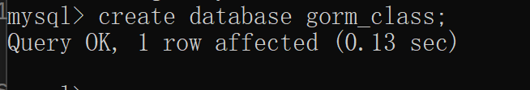
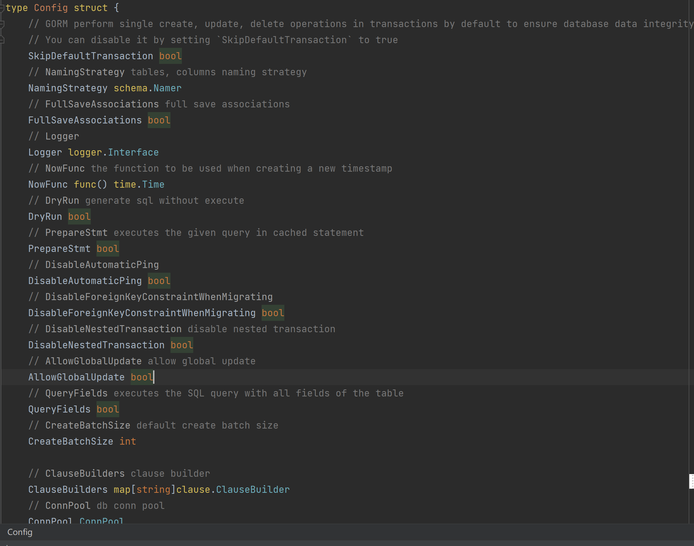
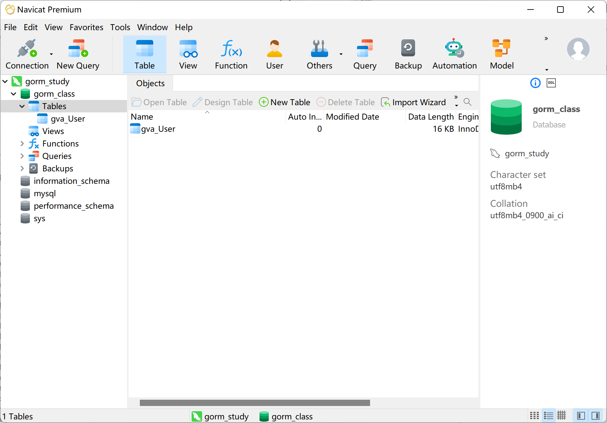
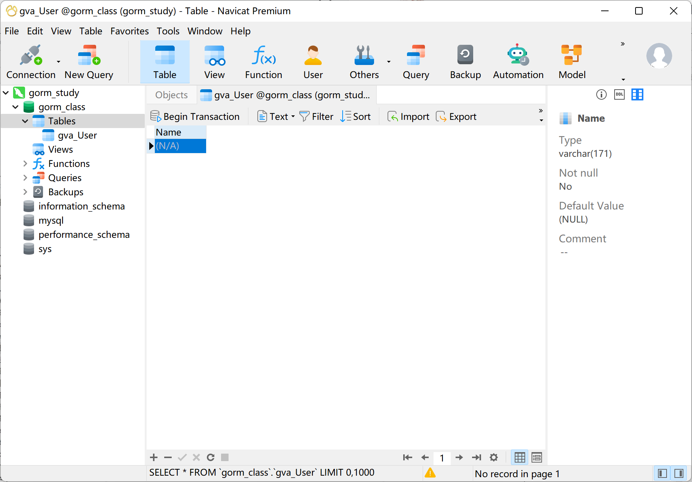

# GORM 建立连接和基础操作

# 连接数据库
首先，在MySQL 里面建立一个数据库 `gorm_class`：




```go
package main

import (
    "fmt"
    "gorm.io/driver/mysql"
    "gorm.io/gorm"
)

func main() {
    dsn := "root:root123@tcp(127.0.0.1:13306)/gorm_class?charset=utf8mb4&parseTime=True&loc=Local"
    db, err := gorm.Open(mysql.Open(dsn), &gorm.Config{})
    if err != nil{
        panic(err)
    }
    fmt.Println(db)
}

```

`dsn := "root:root123@tcp(127.0.0.1:13306)/gorm_class?charset=utf8mb4&parseTime=True&loc=Local"` 中，root 是用户名，root123 是数据库密码，建立 tcp 连接 127.0.0.1:13306 中 gorm_class 数据库。

除了设置`dsn`，还有更多有关 MySQL 的配置。

```go
db, err := gorm.Open(mysql.New(mysql.Config{
  DSN: "gorm:gorm@tcp(127.0.0.1:3306)/gorm?charset=utf8&parseTime=True&loc=Local", // DSN data source name
  DefaultStringSize: 256, // string 类型字段的默认长度
  DisableDatetimePrecision: true, // 禁用 datetime 精度，MySQL 5.6 之前的数据库不支持
  DontSupportRenameIndex: true, // 重命名索引时采用删除并新建的方式，MySQL 5.7 之前的数据库和 MariaDB 不支持重命名索引
  DontSupportRenameColumn: true, // 用 `change` 重命名列，MySQL 8 之前的数据库和 MariaDB 不支持重命名列
  SkipInitializeWithVersion: false, // 根据当前 MySQL 版本自动配置
}), &gorm.Config{})
```

除了 MySQL 的配置，还有 Gorm 的配置：[https://gorm.io/zh_CN/docs/gorm_config.html](https://gorm.io/zh_CN/docs/gorm_config.html)



设置的代码案例：

> db, err := gorm.Open(mysql.New(mysql.Config{
>
> 		DSN:dsn,
>
> 		DefaultStringSize: 171,
>
> 		}), &gorm.Config{
>
> 		SkipDefaultTransaction: false,
>
> 		NamingStrategy: schema.NamingStrategy{
>
> 			TablePrefix: "gva_",   // 表名前缀, table for `User` would be `t_users`
>
> 			SingularTable: true, // 使用单数表名，use singular table name, table for `User` would be `user` with this option enabled
>
> 			NoLowerCase: true, // skip the snake_casing of names
>
> 			NameReplacer: strings.NewReplacer("CID", "Cid"), // use name replacer to change struct/field name before convert it to db name
>
> 		},
>
> 		DisableForeignKeyConstraintWhenMigrating: true, //逻辑外键 （代码里面自动外键，外键关系，增加数据量处理速度）
>
> 	})
>

# 建表的简单操作
创建表

`M := db.Migrator()`

`M.CreateTable(&User{})`

```go
package main

import (
	"fmt"
	"gorm.io/driver/mysql"
	"gorm.io/gorm"
	"gorm.io/gorm/schema"
	"strings"
)

type User struct {
	Name string
}
type UserTwo struct {
	Name string
}

func main() {
	dsn := "root:root123@tcp(127.0.0.1:13306)/gorm_class?charset=utf8mb4&parseTime=True&loc=Local"
	db, err := gorm.Open(mysql.New(mysql.Config{
		DSN:dsn,
		DefaultStringSize: 171,
		}), &gorm.Config{
		SkipDefaultTransaction: false,
		NamingStrategy: schema.NamingStrategy{
			TablePrefix: "gva_",   // 表名前缀, table for `User` would be `t_users`
			SingularTable: true, // 使用单数表名，use singular table name, table for `User` would be `user` with this option enabled
			NoLowerCase: true, // skip the snake_casing of names
			NameReplacer: strings.NewReplacer("CID", "Cid"), // use name replacer to change struct/field name before convert it to db name
		},
		DisableForeignKeyConstraintWhenMigrating: true, //逻辑外键 （代码里面自动外键，外键关系，增加数据量处理速度）
	})

	if err != nil{
		panic(err)
	}
	fmt.Println(db)
	//创建表
	M := db.Migrator()
	M.CreateTable(&User{})
	if M.HasTable(&User{}){
		fmt.Println("创建成功！")
		M.RenameTable(&User{},&UserTwo{}) //Rename 表名称
	}
}
```





`M.HasTable(&User{})`判断是否存在这个表。

`M.RenameTale(&User{},&UserTwo{})`修改表名称。


> 更新: 2022-10-16 20:33:26  
> 原文: <https://www.yuque.com/xiaoshan_wgo/codingnotes/bem4gf>