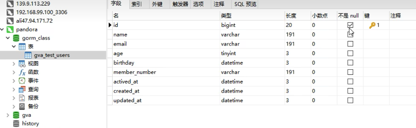

# GORM 模型创建以及关键标签

连接数据库之后，就需要创建模型。

模型是具备基本 Go 类型，指针/别名或实现 Scanner 和 Value 接口的自定义类型的常规结构。

通俗来讲，就是一个结构体，携带 gorm 规定的标签或者实现了 gorm 的接口。

模型有什么用？

是 gorm 进行各种操作的基础，一个书写良好的模型会让你对数据库的操作事半功倍。

```go
package main

import (
    "fmt"
    "gorm.io/driver/mysql"
    "gorm.io/gorm"
    "gorm.io/gorm/schema"
    "strings"
)

var GLOBAL_DB *gorm.DB

func main() {
    dsn := "root:root123@tcp(127.0.0.1:13306)/gorm_class?charset=utf8mb4&parseTime=True&loc=Local"
    db, err := gorm.Open(mysql.New(mysql.Config{
        DSN:dsn,
        DefaultStringSize: 171,
    }), &gorm.Config{
        SkipDefaultTransaction: false,
        NamingStrategy: schema.NamingStrategy{
            TablePrefix: "gva_",   // 表名前缀, table for `User` would be `t_users`
            SingularTable: true, // 使用单数表名，use singular table name, table for `User` would be `user` with this option enabled
            NoLowerCase: true, // skip the snake_casing of names
            NameReplacer: strings.NewReplacer("CID", "Cid"), // use name replacer to change struct/field name before convert it to db name
        },
        DisableForeignKeyConstraintWhenMigrating: true, //逻辑外键 （代码里面自动外键，外键关系，增加数据量处理速度）
    })
    sqlDB,_:= db.DB()
    sqlDB.SetMaxIdleconns(10） //连接池中最大的空府连按数
    sqlDB.SetMaxopenconns(100) //连接中最多容纳的链接数量
    sqlDB.SetconnMaxLifetime(time.Hour） //连接中链接的最大可复用时问
	GLOBAL_DB = db

    sqlDB
}
```

```go
package main
type TestUser struct{
    ID uint
    Name string
    Email *string
    Age uint8
    Birthday *time.Time
    MemberNumber sql.NullString
    CreatedAt time.Time
    UpdateAt time.Time
}

func TestUserCreate(){
    GLOBAL_DB.AutoMigrate(&TestUser{})
}
```



这个`CreatedAt time.Time``UpdateAt time.Time` `ID uint`是可以提出来的。

```go
package main

type TestUser struct{
	gorm.Model //嵌入结构体 替代了 创建时间 更新时间 删除时间 ID
    Name string
    Email *string
    Age uint8
    Birthday *time.Time
    MemberNumber sql.NullString

}

func TestUserCreate(){
    GLOBAL_DB.AutoMigrate(&TestUser{})
}
```

可以自定义嵌套标签。


> 更新: 2023-02-21 15:43:56  
> 原文: <https://www.yuque.com/xiaoshan_wgo/codingnotes/nyho77>