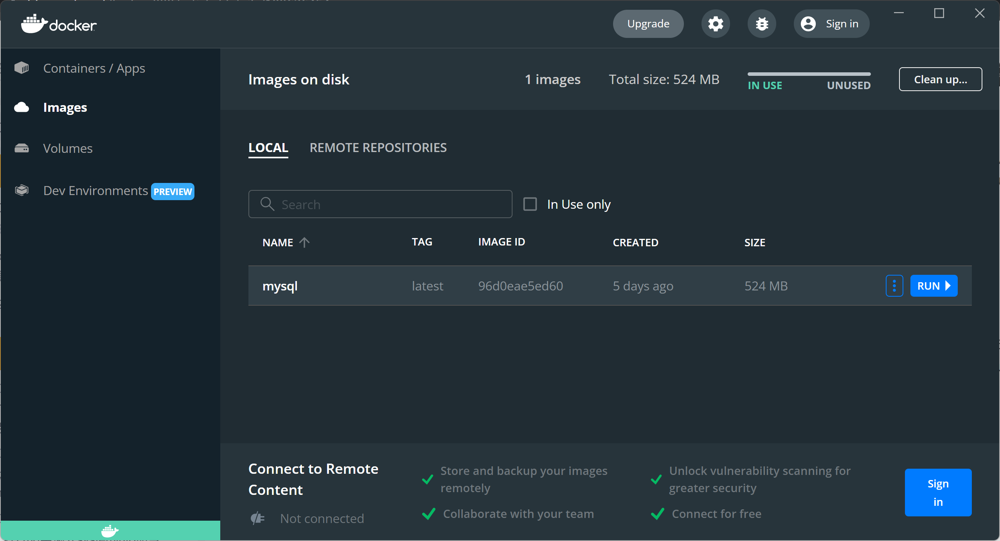
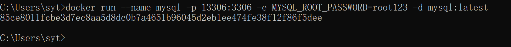
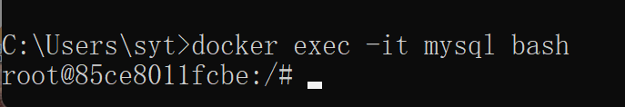
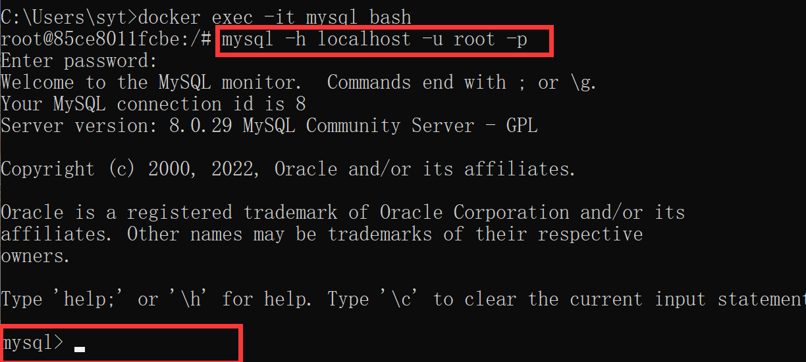
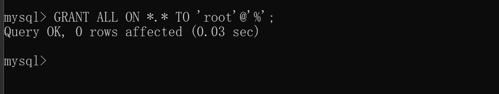
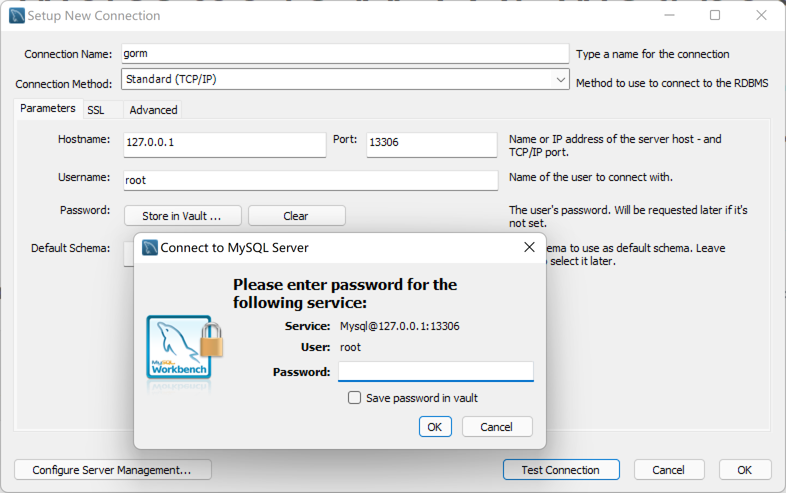
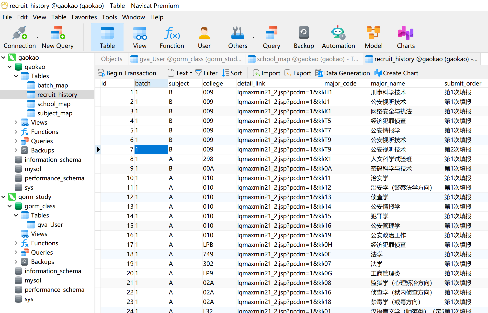

# GORM 的安装与基本使用

# GROM 的 go get
安装命令:

> go get -u gorm.io/gorm  
go get -u gorm.io/driver/sqlite
>

# Windows Docker 
# MySQL 的安装
## Docker 安装
Docker  [官网](https://hub.docker.com/) 点击注册/登录，即会跳转到该页面。


点击下载 Win 版本。

由于 Docker win 版本双击安装之后，会自动安装到 C 盘，采取以下操作，链接到 D 盘。

1. 先创建 `D:\Program Files\Docker` 目录。
2. 用**管理员**身份打开 cmd 窗口，运行如下命令：

`mklink /j "C:\Program Files\Docker"  "D:\Program Files\Docker"`

3. 用**管理员**身份运行下载好的安装包。

注意：安装包也需要用管理员进行运行安装，否则安装过程会报错“找不到目录”等问题。

## MySQL 镜像
### Docker 拉取 MySQL 镜像
在 CMD 中输入：

> docker pull mysql
>

默认拉取最新版 MySQL 。拉取成功后，会显示 `Pull complete`。




### 使用镜像
查看目前存在的 images 命令：

> docker images
>

发现没有有一个名为 mysql 的镜像，也就是刚才拉取的镜像。


现在，可以使用该镜像创建一个容器实例。步骤如下：

在本地的 13306 端口运行 MySQL 容器实例: 名为 mysql，root 用户名密码为 root123 的命令如下：

```bash
docker run --name mysql -p 13306:3306 -e MYSQL_ROOT_PASSWORD=root123 -d mysql:latest
```

该命令 --name 后面自定义容器的名字，-p 是本地端口号，3306是 MySQL 的端口号，主机的 13306 端口和 mysql 容器的 3306 端口进行映射，外部可通过主机 ip+13306 访问到 mysql 容器<font style="color:rgb(77, 77, 77);">，</font>-d 后面是 mysql：`tag`。

通过观察上图，可以发现 TAG 是 latest ，输入命令：




登录访问当前的容器：

```bash
docker exec -it mysql bash
```

成功进入 Docker：



进入 Docker 后就可以使用 MySQL 了，登陆之后使用 Linux 命令启动 MySQL。

### 使用 MySQL 
在 Docker 中，使用 MySQL 的命令如下：

```bash
mysql -h localhost -u root -p
```

<font style="color:rgb(38, 38, 38);">会提示输入密码，输入密码后: </font>



<font style="color:rgb(38, 38, 38);">就可以使用 MySQL 了。  
</font><font style="color:rgb(38, 38, 38);">参考</font>[这篇笔记](https://www.yuque.com/xiaoshan_wgo/database/dot6zr)<font style="color:rgb(38, 38, 38);">。</font>

# <font style="color:rgb(38, 38, 38);">MySQL WorkBench 等工具远程连接 MySQL</font>
授予 MySQL 远程连接的权限：



MySQL Workbench 点击 MySQL Connection 后边的 **⊕ **，Hostname 为 主机 IP，Port 里面输入曾设置过的 13306 端口号，由于是本地启动的 Docker 采用回路地址 localhost : 127.0.0.1 为 Hostname，点击连接：



为了安全起见，可以在 MySQL 命令行中使用如下的命令修改**远程连接数据库的密码**：

```bash
ALTER USER 'root'@'%' IDENTIFIED WITH mysql_native_password BY '123456';
```

该例子中，修改为了 123456。

**输入密码，连接成功！**

Navicat 连接，点击右上角的 Connection，建立新的连接：


输入连接的主机号和端口号，输入密码，连接成功：




> 更新: 2022-05-03 23:35:46  
> 原文: <https://www.yuque.com/xiaoshan_wgo/codingnotes/lk7wdh>