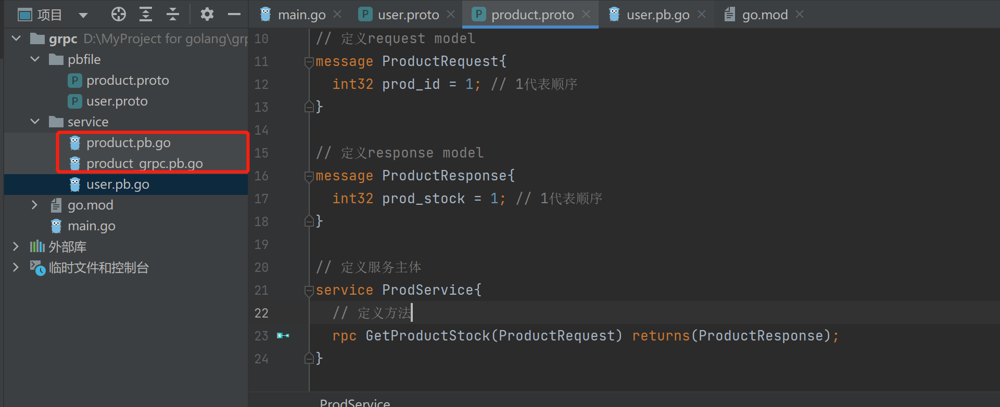

# PRC 服务实践案例

# <font style="color:rgb(51, 51, 51);"> 中间件</font>
生成 proto 文件

```go
// 这个就是protobuf的中间文件

// 指定的当前proto语法的版本，有2和3
syntax = "proto3";
option go_package="../service";

// 指定等会文件生成出来的package
package service;

// 定义request model
message ProductRequest{
    int32 prod_id = 1; // 1代表顺序
}

// 定义response model
message ProductResponse{
    int32 prod_stock = 1; // 1代表顺序
}

// 定义服务主体
service ProdService{
    // 定义方法
    rpc GetProductStock(ProductRequest) returns(ProductResponse);
}
```

生成：

```go
protoc --go_out=./service --go-grpc_out=./service pbfile\product.proto
```

<font style="color:rgb(51, 51, 51);">生成出两份文件：</font>



# <font style="color:rgb(51, 51, 51);">服务端</font>
```go
import "google.golang.org/grpc"

func main()  {
    server := grpc.NewServer()
    service.RegisterProdServiceServer(server,service.ProductService)

    listener, err := net.Listen("tcp", ":8002")
    if err != nil {
        log.Fatal("服务监听端口失败", err)
    }
    _ = server.Serve(listener)
}
```

## 启动
`server := grpc.NewServer()`：NewServer 创建一个未注册服务且尚未开始接受请求的 gRPC 服务器。

## 注册服务
`service.RegisterProdServiceServer(server,service.ProductService)`注册服务，传入两个参数。

```go
func RegisterProdServiceServer(s grpc.ServiceRegistrar, srv ProdServiceServer) {
    s.RegisterService(&ProdService_ServiceDesc, srv)
}
```

两个参数：

① `s grpc.ServiceRegistrar`：这里就传入之前未注册服务的 gRPC 服务器。grpc.ServiceRegistrar 是一个接口类型。ServiceRegistrar 包装了一个支持服务注册的方法。它使用户能够将 grpc.Server 以外的具体类型传递给 IDL 生成的代码导出的服务注册方法。

```go
type ServiceRegistrar interface {
    RegisterService(desc *ServiceDesc, impl interface{})
}
```

RegisterService 将服务及其实现注册到实现此接口的具体类型。一旦服务器开始服务，它可能不会被调用。desc 描述了服务及其方法和处理程序。 impl 是传递给方法处理程序的服务实现。

② `srv ProdServiceServer`: srv 是一个接口类型。ProdServiceServer 是 ProdService 服务的服务器 API。所有实现都必须嵌入 UnimplementedProdServiceServer 以实现前向兼容性。

```go
type ProdServiceServer interface {
	// 定义方法
	GetProductStock(context.Context, *ProductRequest) (*ProductResponse, error)
	mustEmbedUnimplementedProdServiceServer()
}
```

我们在 service 包中定义该接口的方法，来实现我们的业务逻辑：

```go
package service

import "context"

var ProductService = &productService{}

type productService struct {
}

func (p *productService) mustEmbedUnimplementedProdServiceServer() {
	//TODO implement me
	panic("implement me")
}

func (p *productService) GetProductStock(context context.Context, request *ProductRequest) (*ProductResponse, error) {
	//实现具体的业务逻辑
	//例如，查询当前的库存数
	stock := p.GetStockByID(request.GetProdId())
	return &ProductResponse{ProdStock: stock}, nil
}

func (p *productService) GetStockByID(id int32) int32 {
    //写一个假数据
	return 100
}

```

# <font style="color:rgb(51, 51, 51);">客户端</font>
<font style="color:rgb(51, 51, 51);">新建 client 目录，把上述生成的 product.pb.go copy 过来。</font>

```go
package main

import (
	"context"
	"fmt"
	"google.golang.org/grpc"
	"google.golang.org/grpc/credentials/insecure"
	"grpc_demo/service"
	"log"
)

func main() {
	// 1. 新建连接，端口是服务端开放的8002端口
	// 没有证书会报错
	conn, err := grpc.Dial(":8002", grpc.WithTransportCredentials(insecure.NewCredentials()))
	if err != nil {
		log.Fatal(err)
	}

	// 退出时关闭链接
	defer conn.Close()

	// 2. 调用Product.pb.go中的NewProdServiceClient方法
	productServiceClient := service.NewProdServiceClient(conn)

	// 3. 直接像调用本地方法一样调用GetProductStock方法
	resp, err := productServiceClient.GetProductStock(context.Background(), &service.ProductRequest{ProdId: 233})
	if err != nil {
		log.Fatal("调用gRPC方法错误: ", err)
	}

	fmt.Println("调用gRPC方法成功，ProdStock = ", resp.ProdStock)
}

```


> 更新: 2022-07-06 17:48:52  
> 原文: <https://www.yuque.com/xiaoshan_wgo/codingnotes/nxr4v6>