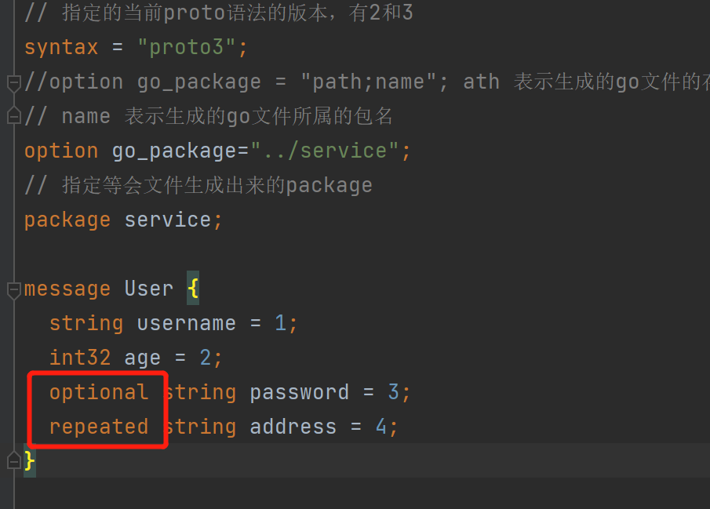
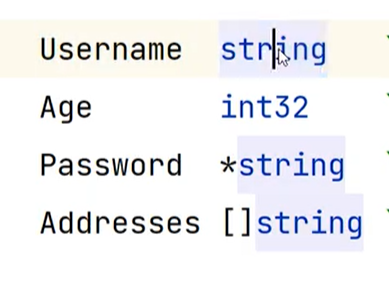

# gRPC 基础概念

## <font style="color:rgb(51, 51, 51);">1 什么是微服务</font>
### <font style="color:rgb(51, 51, 51);">1.1 单体架构</font>
<font style="color:rgb(51, 51, 51);">有一些致命缺点：</font>

1. <font style="color:rgb(51, 51, 51);">一旦某个服务宕机，会引起整个应用不可用，隔离性差</font>
2. <font style="color:rgb(51, 51, 51);">只能整体应用进行伸缩，浪费资源，可伸缩性差</font>
3. <font style="color:rgb(51, 51, 51);">代码耦合在一起，可维护性差</font>

### <font style="color:rgb(51, 51, 51);">1.2 微服务架构</font>
<font style="color:rgb(51, 51, 51);">要想解决上述的单体架构的问题，就需要将服务拆分出来，单独管理和维护。</font>

<font style="color:rgb(51, 51, 51);">通过上述的架构，解决了单体架构的弊端。</font>

<font style="color:rgb(51, 51, 51);">但同时引入了新的问题：</font>

1. <font style="color:rgb(51, 51, 51);">代码冗余</font>
2. <font style="color:rgb(51, 51, 51);">服务和服务之间存在调用关系</font>

#### <font style="color:rgb(51, 51, 51);">1.2.1 代码冗余问题</font>
> <font style="color:rgb(119, 119, 119);">服务未拆分之前，公共的功能有统一的实现，比如认证，授权，限流等，但是服务拆分之后，每一个服务可能都需要实现一遍</font>
>

<font style="color:rgb(51, 51, 51);">解决方案：</font>

<font style="color:rgb(51, 51, 51);">由于为了保持对外提供服务的一致性，引入了网关的概念，由网关根据不同的请求，将其转发到不同的服务（路由功能），由于入口的一致性，可以在网关上实现公共的一些功能，可以将公共的功能抽取出来，形成一个新的服务，比如统一认证中心。</font>

#### <font style="color:rgb(51, 51, 51);">1.2.2 服务之间调用</font>
<font style="color:rgb(51, 51, 51);">服务拆分后，服务和服务之间发生的是进程和进程之间的调用，服务器和服务器之间的调用。</font>

<font style="color:rgb(51, 51, 51);">那么就需要发起网络调用，网络调用我们能立马想起的就是http，但是在微服务架构中，http虽然便捷方便，但性能较低，这时候就需要引入RPC（远程过程调用），通过自定义协议发起TCP调用，来加快传输效率。</font>

> <font style="color:rgb(119, 119, 119);">每个服务由于可能分布在成千上百台机器上，服务和服务之间的调用，会出现一些问题，比如，如何知道应该调用哪台机器上的服务，调用方可能需要维护被调用方的地址，这个地址可能很多，增加了额外的负担，这时候就需要引入服务治理。</font>
>

<font style="color:rgb(51, 51, 51);">服务治理中有一个重要的概念</font><font style="color:rgb(51, 51, 51);background-color:rgb(243, 244, 244);">服务发现</font><font style="color:rgb(51, 51, 51);">，服务发现中有一个重要的概念叫做</font><font style="color:rgb(51, 51, 51);background-color:rgb(243, 244, 244);">注册中心</font><font style="color:rgb(51, 51, 51);">。</font>

<font style="color:rgb(51, 51, 51);">每个服务启动的时候，会将自身的服务和ip注册到注册中心，其他服务调用的时候，只需要向注册中心申请地址即可。</font>

当然，服务和服务之间调用会发生一些问题，为了避免产生连锁的雪崩反应，引入了服务容错，为了追踪一个调用所经过的服务，引入了链路追踪，等等这些就构建了一个微服务的生态。

## <font style="color:rgb(51, 51, 51);">2 引入 gRPC</font>
服务和服务之间调用需要使用 RPC，<font style="background-color:rgb(243, 244, 244);">gRPC </font>是一款语言中立、平台中立、开源的远程过程调用系统，<font style="background-color:rgb(243, 244, 244);">gRPC</font>客户端和服务端可以在多种环境中运行和交互，例如用 <font style="background-color:rgb(243, 244, 244);">java </font>写一个服务端，可以用 <font style="background-color:rgb(243, 244, 244);">go </font>语言写客户端调用。<font style="color:rgb(51, 51, 51);">数据在进行网络传输的时候，需要进行序列化，序列化协议有很多种，比如 xml, json，protobuf 等</font>

<font style="color:rgb(51, 51, 51);">gRPC默认使用 </font><font style="color:rgb(51, 51, 51);background-color:rgb(243, 244, 244);">protocol buffers</font><font style="color:rgb(51, 51, 51);">，这是 google 开源的一套成熟的结构数据序列化机制。</font>

<font style="color:rgb(51, 51, 51);">在学习 gRPC 之前，需要先了解 </font><font style="color:rgb(51, 51, 51);background-color:rgb(243, 244, 244);">protocol buffers。</font>

注：

> **<font style="color:rgb(51, 51, 51);">序列化</font>**<font style="color:rgb(51, 51, 51);">：将数据结构或对象转换成二进制串的过程。</font>
>
> **<font style="color:rgb(51, 51, 51);">反序列化</font>**<font style="color:rgb(51, 51, 51);">：将在序列化过程中所产生的二进制串转换成数据结构或对象的过程。</font>
>

### <font style="color:rgb(51, 51, 51);">2.1 RPC 和 gRPC 介绍</font>
<font style="color:rgb(51, 51, 51);">RPC（Remote Procedure Call）远程过程调用协议，一种通过网络从远程计算机上请求服务，而不需要了解底层网络技术的协议。RPC 它假定某些协议的存在，例如 TCP/UDP 等，为通信程序之间携带信息数据。在 OSI 网络七层模型中，RPC 跨越了传输层和应用层，RPC使得开发包括网络分布式多程序在内的应用程序更加容易。</font>

<font style="color:rgb(51, 51, 51);">过程是什么？ 过程就是业务处理、计算任务，更直白的说，就是程序，就是像调用本地方法一样调用远程的过程</font>

<font style="color:rgb(51, 51, 51);">RPC 采用客户端/服务端的模式，通过 request-response 消息模式实现，类似 HTTP。</font>

<font style="color:rgb(51, 51, 51);">gRPC 里客户端应用可以像调用本地对象一样直接调用另一台不同的机器上服务端应用的方法，使得您能够更容易地创建分布式应用和服务。与许多 RPC 系统类似，gRPC 也是基于以下理念：定义一个服务，指定其能够被远程调用的方法（包含参数和返回类型）。在服务端实现这个接口，并运行一个 gRPC 服务器来处理客户端调用。在客户端拥有一个存根能够像服务端一样的方法。</font>


<font style="color:rgb(51, 51, 51);">官方网站：</font>[https://grpc.io/](https://grpc.io/)

<font style="color:rgb(51, 51, 51);">底层协议：</font>

+ <font style="color:rgb(51, 51, 51);">HTTP2: </font>[https://github.com/grpc/grpc/blob/master/doc/PROTOCOL-HTTP2.md](https://github.com/grpc/grpc/blob/master/doc/PROTOCOL-HTTP2.md)
+ <font style="color:rgb(51, 51, 51);">GRPC-WEB： </font>[https://github.com/grpc/grpc/blob/master/doc/PROTOCOL-WEB.md](https://github.com/grpc/grpc/blob/master/doc/PROTOCOL-WEB.md)

### <font style="color:rgb(51, 51, 51);">2.2 HTTP2</font>


+ <font style="color:rgb(51, 51, 51);">HTTP/1 里的 header 对应 HTTP/2 里的 HEADERS frame</font>
+ <font style="color:rgb(51, 51, 51);">HTTP/1 里的 payload 对应 HTTP/2 里的 DATA frame</font>

<font style="color:rgb(51, 51, 51);">gRPC 把元数据放到 HTTP/2 Headers 里，请求参数序列化之后放到 DATA frame 里</font>

#### <font style="color:rgb(51, 51, 51);">基于 HTTP/2  协议的优点</font>
1. <font style="color:rgb(51, 51, 51);">公开标准</font>
2. <font style="color:rgb(51, 51, 51);">HTTP/2 的前身是 Google 的 </font>[SPDY](https://en.wikipedia.org/wiki/SPDY)<font style="color:rgb(51, 51, 51);"> ，有经过实践检验</font>
3. <font style="color:rgb(51, 51, 51);">HTTP/2 天然支持物联网、手机、浏览器</font>
4. <font style="color:rgb(51, 51, 51);">基于 HTTP/2 多语言客户端实现容易</font>
    1. <font style="color:rgb(51, 51, 51);">每个流行的编程语言都会有成熟的 HTTP/2 Client</font>
    2. <font style="color:rgb(51, 51, 51);">HTTP/2 Client 是经过充分测试，可靠的</font>
    3. <font style="color:rgb(51, 51, 51);">用 Client 发送 HTTP/2 请求的难度远低于用 socket 发送数据包/解析数据包</font>
5. <font style="color:rgb(51, 51, 51);">HTTP/2 支持 Stream 和流控</font>
6. <font style="color:rgb(51, 51, 51);">基于 HTTP/2  在 Gateway/Proxy 很容易支持</font>
    1. <font style="color:rgb(51, 51, 51);">nginx 和 envoy 都有支持</font>
7. <font style="color:rgb(51, 51, 51);">HTTP/2 安全性有保证</font>
    1. <font style="color:rgb(51, 51, 51);">HTTP/2 天然支持 SSL，当然 gRPC 可以跑在 clear text 协议（即不加密）上。</font>
    2. <font style="color:rgb(51, 51, 51);">很多私有协议的 rpc 可能自己包装了一层 TLS 支持，使用起来也非常复杂。开发者是否有足够的安全知识？使用者是否配置对了？运维者是否能正确理解？</font>
    3. <font style="color:rgb(51, 51, 51);">HTTP/2 在公有网络上的传输上有保证。比如这个</font>[CRIME攻击](https://en.wikipedia.org/wiki/CRIME)<font style="color:rgb(51, 51, 51);">，私有协议很难保证没有这样子的漏洞。</font>
8. <font style="color:rgb(51, 51, 51);">HTTP/2 鉴权成熟</font>
    1. <font style="color:rgb(51, 51, 51);">从 HTTP/1 发展起来的鉴权系统已经很成熟了，可以无缝用在 HTTP/2 上</font>
    2. <font style="color:rgb(51, 51, 51);">可以从前端到后端完全打通的鉴权，不需要做任何转换适配</font>

#### <font style="color:rgb(51, 51, 51);">基于 HTTP/2 协议的缺点</font>
+ <font style="color:rgb(51, 51, 51);">rpc 的元数据的传输不够高效。尽管 HPAC 可以压缩 HTTP Header，但是对于 rpc 来说，确定一个函数调用，可以简化为一个 int，只要两端去协商过一次，后面直接查表就可以了，不需要像 HPAC 那样编码解码。可以考虑专门对 gRPC 做一个优化过的 HTTP/2 解析器，减少一些通用的处理，感觉可以提升性能。</font>
+ <font style="color:rgb(51, 51, 51);">HTTP/2 里一次 gRPC 调用需要解码两次一次是 HEADERS frame，一次是 DATA frame。</font>
+ <font style="color:rgb(51, 51, 51);">HTTP/2 标准本身是只有一个 TCP 连接，但是实际在gRPC里是会有多个 TCP 连接，使用时需要注意。</font>

<font style="color:rgb(51, 51, 51);">gRPC选择基于 HTTP/2，那么它的性能肯定不会是最顶尖的。但是对于 rpc 来说中庸的 qps 可以接受，通用和兼容性才是最重要的事情。</font>

<font style="color:rgb(51, 51, 51);">官方的 benchmark：</font>

[https://grpc.io/docs/guides/benchmarking.html](https://grpc.io/docs/guides/benchmarking.html)

[https://github.com/hank-whu/rpc-benchmark](https://github.com/hank-whu/rpc-benchmark)

<font style="color:rgb(51, 51, 51);">gRPC目前是 k8s 生态里的事实标准，而 Kubernetes 又是容器编排的事实标准。gRPC 已经广泛应用于 Istio 体系，包括:</font>

+ <font style="color:rgb(51, 51, 51);">Envoy 与 Pilot (现在叫 istiod ) 间的 XDS 协议</font>
+ <font style="color:rgb(51, 51, 51);">mixer 的 handler 扩展协议</font>
+ <font style="color:rgb(51, 51, 51);">MCP (控制面的配置分发协议)</font>

<font style="color:rgb(51, 51, 51);">在 Cloud Native 的潮流下，开放互通的需求必然会产生基于 HTTP/2 的 RPC。</font>

## <font style="color:rgb(51, 51, 51);">3 protobuf</font>
<font style="color:rgb(51, 51, 51);">protobuf是谷歌开源的一种数据格式，适合高性能，对响应速度有要求的数据传输场景。因为profobuf是二进制数据格式，需要编码和解码。数据本身不具有可读性。因此只能反序列化之后得到真正可读的数据。 </font>

<font style="color:rgb(51, 51, 51);">优势：</font>

1. <font style="color:rgb(51, 51, 51);">序列化后体积相比Json和XML很小，适合网络传输</font>
2. <font style="color:rgb(51, 51, 51);">支持跨平台多语言</font>
3. <font style="color:rgb(51, 51, 51);">消息格式升级和兼容性还不错</font>
4. <font style="color:rgb(51, 51, 51);">序列化反序列化速度很快</font>

### <font style="color:rgb(51, 51, 51);">3.1 安装</font>
官方快速开始：[https://grpc.io/docs/languages/go/quickstart/](https://grpc.io/docs/languages/go/quickstart/)

+ <font style="color:rgb(51, 51, 51);">第一步：下载通用编译器地址：</font>[https://github.com/protocolbuffers/protobuf/releases](https://github.com/protocolbuffers/protobuf/releases)<font style="color:rgb(51, 51, 51);"> 根据不同的操作系统，下载不同的包，我是windows电脑，解压出来是 </font><font style="color:rgb(51, 51, 51);background-color:rgb(243, 244, 244);">protoc.exe</font>
+ <font style="color:rgb(51, 51, 51);">第二步：配置环境变量，保障在命令行可以使用 protoc 。</font>
+ <font style="color:rgb(51, 51, 51);">第三步：安装 go </font>协议编译器插件命令：

`$ go install google.golang.org/protobuf/cmd/protoc-gen-go@lastest`

`$ go install $google.golang.org/grpc/cmd/protoc-gen-go-grpc@lastest`

<font style="color:rgb(51, 51, 51);">安装后会在当前项目的 </font><font style="color:rgb(51, 51, 51);background-color:rgb(243, 244, 244);">GOPATH </font><font style="color:rgb(51, 51, 51);">目录下生成可执行文件，</font>`<font style="color:rgb(51, 51, 51);">protobuf</font>`<font style="color:rgb(51, 51, 51);">的编译器插件</font>`<font style="color:rgb(51, 51, 51);">protoc-gen-go</font>`<font style="color:rgb(51, 51, 51);">，执行 </font>`<font style="color:rgb(51, 51, 51);">protoc</font>`<font style="color:rgb(51, 51, 51);">命令会自动调用这个插件。</font>


**如何使用 protobuf 呢？**

+ <font style="color:rgb(51, 51, 51);">定义了一种源文件，扩展名为 </font>.proto<font style="color:rgb(51, 51, 51);">，使用这种源文件，可以定义存储类的内容(消息类型)</font>
+ <font style="color:rgb(51, 51, 51);">protobuf 有自己的编译器 protoc，可以将 .proto 编译成对应语言的文件，就可以进行使用了</font>

### <font style="color:rgb(51, 51, 51);">3.2 hello world</font>
假设，我们现在需要传输用户信息，其中有 username 和 age 两个字段

```go
// 指定的当前proto语法的版本，有2和3
syntax = "proto3";
//option go_package = "path;name"; ath 表示生成的 go 文件的存放地址，会自动生成目录的
// name 表示生成的 go 文件所属的包名
option go_package="../service";
// 指定等会文件生成出来的 package
package service;

message User {
  string username = 1;
  int32 age = 2;
}
```

**<font style="color:rgb(51, 51, 51);">运行 protoc 命令编译成 go 中间文件</font>**

```powershell
# 编译 user.proto 之后输出到 service 文件夹
protoc --go_out=./service --go-grpc_out=./service pbfile\user.proto
```

<font style="color:rgb(51, 51, 51);">service 目录下会出现生成的文件。</font>

**<font style="color:rgb(51, 51, 51);">测试</font>**

```go
package main

import (
	"github.com/golang/protobuf/proto"
	"grpc/service"
)

func main() {
	user := &service.User{
		Username: "syt",
		Age:      18,
	}
	//序列化
	marshal, err := proto.Marshal(user)
	if err != nil {
		panic(err)
	}

	//反序列化
	//1. 定义个新的结构体
	//2. 反序列化之前序列化过的结构体，存储到新的结构体中
	newUser := &service.User{}
	err = proto.Unmarshal(marshal, newUser)
	if err != nil {
		panic(err)
	}
	fmt.Println(newUser.String())
}

```

**运行结果：**


### <font style="color:rgb(51, 51, 51);">3.3 proto 文件介绍</font>
#### <font style="color:rgb(51, 51, 51);">3.3.1 message 介绍</font>
`<font style="color:rgb(51, 51, 51);">message</font>`<font style="color:rgb(51, 51, 51);">：</font>`<font style="color:rgb(51, 51, 51);">protobuf</font>`<font style="color:rgb(51, 51, 51);">中定义一个消息类型是通过关键字</font>`<font style="color:rgb(51, 51, 51);">message</font>`<font style="color:rgb(51, 51, 51);">字段指定的。</font>

**<font style="color:rgb(51, 51, 51);">消息</font>**<font style="color:rgb(51, 51, 51);">就是需要传输的数据格式的定义。</font>

<font style="color:rgb(51, 51, 51);">比如说：</font>`<font style="color:rgb(51, 51, 51);">user</font>`<font style="color:rgb(51, 51, 51);">这个结构体就是我们要传输的数据，那么我们就用</font>`<font style="color:rgb(51, 51, 51);">message</font>`<font style="color:rgb(51, 51, 51);">字段对其进行定义。</font>

`<font style="color:rgb(51, 51, 51);">message</font>`<font style="color:rgb(51, 51, 51);">关键字类似于 C++ 中的 class，Java 中的 class，go 中的 struct</font>

<font style="color:rgb(51, 51, 51);">例如：</font>

```go
message User {
    string username = 1;
    int32 age = 2;
}
```

<font style="color:rgb(51, 51, 51);">在消息中承载的数据分别对应于每一个字段。</font>

<font style="color:rgb(51, 51, 51);">其中每个字段都有一个名字和一种类型 。</font>

#### <font style="color:rgb(51, 51, 51);">3.3.2 字段规则</font>
+ `<font style="color:rgb(51, 51, 51);">required</font>`<font style="color:rgb(51, 51, 51);">:消息体中必填字段，不设置会导致编解码异常，proto3 忽略该关键字。（例如位置1）</font>
+ `<font style="color:rgb(51, 51, 51);">optional</font>`<font style="color:rgb(51, 51, 51);">: 消息体中可选字段。（例如位置2）</font>
+ `<font style="color:rgb(51, 51, 51);">repeated</font>`<font style="color:rgb(51, 51, 51);">: 消息体中可重复字段，重复的值的顺序会被保留（例如位置3）在go中重复的会被定义为切片。</font>

```go
message User {
  string username = 1; //必填
  int32 age = 2; //必填
  optional string password = 3;
  repeated string address = 4;
}
```





#### <font style="color:rgb(51, 51, 51);">3.3.3 字段映射</font>
| **<font style="color:rgb(51, 51, 51);">.proto Type</font>** | **<font style="color:rgb(51, 51, 51);">Notes</font>** | **<font style="color:rgb(51, 51, 51);">C++ Type</font>** | **<font style="color:rgb(51, 51, 51);">Python Type</font>** | **<font style="color:rgb(51, 51, 51);">Go Type</font>** |
| :--- | :--- | :--- | :--- | :--- |
| <font style="color:rgb(51, 51, 51);">double</font> | | <font style="color:rgb(51, 51, 51);">double</font> | <font style="color:rgb(51, 51, 51);">float</font> | <font style="color:rgb(51, 51, 51);">float64</font> |
| <font style="color:rgb(51, 51, 51);">float</font> | | <font style="color:rgb(51, 51, 51);">float</font> | <font style="color:rgb(51, 51, 51);">float</font> | <font style="color:rgb(51, 51, 51);">float32</font> |
| <font style="color:rgb(51, 51, 51);">int32</font> | <font style="color:rgb(51, 51, 51);">使用变长编码，对于负值的效率很低，如果你的域有 可能有负值，请使用sint64替代</font> | <font style="color:rgb(51, 51, 51);">int32</font> | <font style="color:rgb(51, 51, 51);">int</font> | <font style="color:rgb(51, 51, 51);">int32</font> |
| <font style="color:rgb(51, 51, 51);">uint32</font> | <font style="color:rgb(51, 51, 51);">使用变长编码</font> | <font style="color:rgb(51, 51, 51);">uint32</font> | <font style="color:rgb(51, 51, 51);">int/long</font> | <font style="color:rgb(51, 51, 51);">uint32</font> |
| <font style="color:rgb(51, 51, 51);">uint64</font> | <font style="color:rgb(51, 51, 51);">使用变长编码</font> | <font style="color:rgb(51, 51, 51);">uint64</font> | <font style="color:rgb(51, 51, 51);">int/long</font> | <font style="color:rgb(51, 51, 51);">uint64</font> |
| <font style="color:rgb(51, 51, 51);">sint32</font> | <font style="color:rgb(51, 51, 51);">使用变长编码，这些编码在负值时比int32高效的多</font> | <font style="color:rgb(51, 51, 51);">int32</font> | <font style="color:rgb(51, 51, 51);">int</font> | <font style="color:rgb(51, 51, 51);">int32</font> |
| <font style="color:rgb(51, 51, 51);">sint64</font> | <font style="color:rgb(51, 51, 51);">使用变长编码，有符号的整型值。编码时比通常的 int64高效。</font> | <font style="color:rgb(51, 51, 51);">int64</font> | <font style="color:rgb(51, 51, 51);">int/long</font> | <font style="color:rgb(51, 51, 51);">int64</font> |
| <font style="color:rgb(51, 51, 51);">fixed32</font> | <font style="color:rgb(51, 51, 51);">总是4个字节，如果数值总是比总是比228大的话，这 个类型会比uint32高效。</font> | <font style="color:rgb(51, 51, 51);">uint32</font> | <font style="color:rgb(51, 51, 51);">int</font> | <font style="color:rgb(51, 51, 51);">uint32</font> |
| <font style="color:rgb(51, 51, 51);">fixed64</font> | <font style="color:rgb(51, 51, 51);">总是8个字节，如果数值总是比总是比256大的话，这 个类型会比uint64高效。</font> | <font style="color:rgb(51, 51, 51);">uint64</font> | <font style="color:rgb(51, 51, 51);">int/long</font> | <font style="color:rgb(51, 51, 51);">uint64</font> |
| <font style="color:rgb(51, 51, 51);">sfixed32</font> | <font style="color:rgb(51, 51, 51);">总是4个字节</font> | <font style="color:rgb(51, 51, 51);">int32</font> | <font style="color:rgb(51, 51, 51);">int</font> | <font style="color:rgb(51, 51, 51);">int32</font> |
| <font style="color:rgb(51, 51, 51);">sfixed32</font> | <font style="color:rgb(51, 51, 51);">总是4个字节</font> | <font style="color:rgb(51, 51, 51);">int32</font> | <font style="color:rgb(51, 51, 51);">int</font> | <font style="color:rgb(51, 51, 51);">int32</font> |
| <font style="color:rgb(51, 51, 51);">sfixed64</font> | <font style="color:rgb(51, 51, 51);">总是8个字节</font> | <font style="color:rgb(51, 51, 51);">int64</font> | <font style="color:rgb(51, 51, 51);">int/long</font> | <font style="color:rgb(51, 51, 51);">int64</font> |
| <font style="color:rgb(51, 51, 51);">bool</font> | | <font style="color:rgb(51, 51, 51);">bool</font> | <font style="color:rgb(51, 51, 51);">bool</font> | <font style="color:rgb(51, 51, 51);">bool</font> |
| <font style="color:rgb(51, 51, 51);">string</font> | <font style="color:rgb(51, 51, 51);">一个字符串必须是UTF-8编码或者7-bit ASCII编码的文 本。</font> | <font style="color:rgb(51, 51, 51);">string</font> | <font style="color:rgb(51, 51, 51);">str/unicode</font> | <font style="color:rgb(51, 51, 51);">string</font> |
| <font style="color:rgb(51, 51, 51);">bytes</font> | <font style="color:rgb(51, 51, 51);">可能包含任意顺序的字节数据。</font> | <font style="color:rgb(51, 51, 51);">string</font> | <font style="color:rgb(51, 51, 51);">str</font> | <font style="color:rgb(51, 51, 51);">[]byte</font> |


#### <font style="color:rgb(51, 51, 51);">3.3.4 默认值</font>
<font style="color:rgb(51, 51, 51);">protobuf3 删除了 protobuf2 中用来设置默认值的 default 关键字，取而代之的是 protobuf3 为各类型定义的默认值，也就是约定的默认值，如下表所示：</font>

| **<font style="color:rgb(51, 51, 51);">类型</font>** | **<font style="color:rgb(51, 51, 51);">默认值</font>** |
| :--- | :--- |
| <font style="color:rgb(51, 51, 51);">bool</font> | <font style="color:rgb(51, 51, 51);">false</font> |
| <font style="color:rgb(51, 51, 51);">整型</font> | <font style="color:rgb(51, 51, 51);">0</font> |
| <font style="color:rgb(51, 51, 51);">string</font> | <font style="color:rgb(51, 51, 51);">空字符串""</font> |
| <font style="color:rgb(51, 51, 51);">枚举 enum</font> | <font style="color:rgb(51, 51, 51);">第一个枚举元素的值，因为 Protobuf3 强制要求第一个枚举元素的值必须是0，所以枚举的默认值就是0；</font> |
| <font style="color:rgb(51, 51, 51);">message</font> | <font style="color:rgb(51, 51, 51);">不是 null，而是 DEFAULT_INSTANCE</font> |


#### <font style="color:rgb(51, 51, 51);">3.3.5 标识号</font>
<font style="color:rgb(51, 51, 51);background-color:rgb(243, 244, 244);">标识号</font><font style="color:rgb(51, 51, 51);">：在消息体的定义中，每个字段都必须要有一个唯一的标识号，标识号是 [0,2^29-1] 范围内的一个整数。</font>

```go
message Person { 
  string name = 1;  // (位置1)
  int32 id = 2;  
  optional string email = 3;  
  repeated string phones = 4; // (位置4)
}
```

<font style="color:rgb(51, 51, 51);">一个位置一个标识，以 Person 为例，name=1, id=2,  email=3,  phones=4 的位置分别为 1-4，这就是标识号。</font>

#### <font style="color:rgb(51, 51, 51);">3.3.6 定义多个消息类型</font>
<font style="color:rgb(51, 51, 51);">一个 proto 文件中可以定义多个消息类型，例如：</font>

```go
message UserRequest {
  string username = 1;
  int32 age = 2;
  optional string password = 3;
  repeated string address = 4;
}

message UserResponse {
  string username = 1;
  int32 age = 2;
  optional string password = 3;
  repeated string address = 4;
}
```

#### <font style="color:rgb(51, 51, 51);">3.3.7 嵌套消息</font>
<font style="color:rgb(51, 51, 51);">可以在其他消息类型中定义、使用消息类型，在下面的例子中，Person 消息就定义在 PersonInfo 消息内，如 ：</font>

```go
message PersonInfo {
    message Person {
        string name = 1;
        int32 height = 2;
        repeated int32 weight = 3;
    } 
    repeated Person info = 1;
}
```

<font style="color:rgb(51, 51, 51);">如果你想在它的父消息类型的外部重用这个消息类型，你需要以 PersonInfo.Person 的形式使用它，如： </font>

```go
message PersonMessage {
    PersonInfo.Person info = 1;
}
```

<font style="color:rgb(51, 51, 51);">当然，你也可以将消息</font>**<font style="color:rgb(51, 51, 51);">嵌套</font>**<font style="color:rgb(51, 51, 51);">任意多层，如 :</font>

```go
message Grandpa { // Level 0
    message Father { // Level 1
        message son { // Level 2
            string name = 1;
            int32 age = 2;
        }
    } 
    message Uncle { // Level 1
        message Son { // Level 2
            string name = 1;
            int32 age = 2;
        }
    }
}
```

#### <font style="color:rgb(51, 51, 51);">3.3.8 定义服务(Service)</font>
<font style="color:rgb(51, 51, 51);">如果想要将消息类型用在 RPC 系统中，可以在 .proto 文件中定义一个 RPC 服务接口，protocol buffer 编译器将会根据所选择的不同语言生成服务接口代码及存根。</font>

```go
service SearchService {
    //rpc 服务的函数名 （传入参数）返回（返回参数）
    rpc Search (SearchRequest) returns (SearchResponse);
}
```

<font style="color:rgb(51, 51, 51);">上述代表表示，定义了一个 RPC 服务，该方法接收 SearchRequest 返回 SearchResponse。</font>

## 
### 


> 更新: 2022-07-06 13:59:21  
> 原文: <https://www.yuque.com/xiaoshan_wgo/codingnotes/qtgug4>