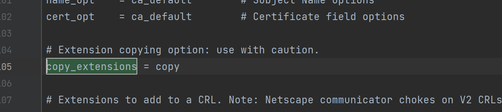
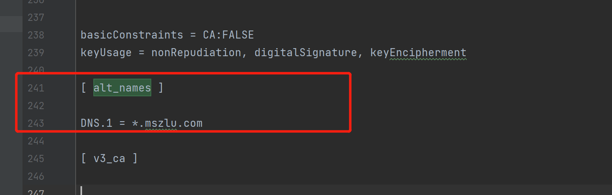

# 安全认证

> 客户端和服务端之间调用，我们可以通过加入证书的方式，实现调用的安全性
>

TLS（Transport Layer Security，安全传输层)，TLS 是建立在传输层 TCP 协议之上的协议，服务于应用层，它的前身是SSL（Secure Socket Layer，安全套接字层），它实现了将应用层的报文进行加密后再交由 TCP 进行传输的功能。

TLS 协议主要解决如下三个网络安全问题。

+ 保密(message privacy)，保密通过加密 encryption 实现，所有信息都加密传输，第三方无法嗅探；
+ 完整性(message integrity)，通过 MAC 校验机制，一旦被篡改，通信双方会立刻发现；
+ 认证(mutual authentication)，双方认证,双方都可以配备证书，防止身份被冒充；

# 生成自签证书
> 生产环境可以购买证书或者使用一些平台发放的免费证书
>

+ 安装 openssl  
Win 网站下载：[http://slproweb.com/products/Win32OpenSSL.html](http://slproweb.com/products/Win32OpenSSL.html)
+ 生成**私钥**文件 

```shell
## 需要输入密码123456
openssl genrsa -des3 -out ca.key 2048
```

+ 创建**证书（公钥）**请求 

```shell
openssl req -new -key ca.key -out ca.csr
```

+ 生成 ca.crt 

```shell
openssl x509 -req -days 365 -in ca.csr -signkey ca.key -out ca.crt
```

 从之前下载的路径中（有时候在 C 盘）找到 openssl.cnf 文件，移到目录该下：


1.  找到该文件的 copy_extensions = copy，去掉注释



2.  找到 req_extensions = v3_req，去掉注释


3.  找到`[ v3_req ]`，添加 `subjectAltName = @alt_names`


4.  添加新的标签 [ alt_names ] , 和标签字段 

```properties
[ alt_names ]

DNS.1 = *.mszlu.com
```



5.  生成证书私钥server.key 

```shell
openssl genpkey -algorithm RSA -out server.key
```


6.  通过私钥server.key生成证书请求文件server.csr

openssl x509 -req -CA ca.crt -CAkey ca.key -CAcreateserial -in server.csr -out server.crt -days 365

```shell
openssl req -new -nodes -key server.key -out server.csr -days 3650 -config ./openssl.cnf -extensions v3_req
```

7.  生成SAN证书 

openssl x509 -req -days <font style="color:rgb(209, 154, 102);">365</font> -<font style="color:rgb(198, 120, 221);">in</font> server.csr -<font style="color:rgb(198, 120, 221);">out</font> server.pem \   -CA ca.crt -<font style="color:rgb(230, 192, 123);">CAkey</font> ca.key -<font style="color:rgb(230, 192, 123);">CAcreateserial</font> \ -extfile ./openssl.cnf -extensions v3_req

```shell
openssl x509 -req -days 365 -in server.csr -out server.pem -CA ca.crt -CAkey ca.key -CAcreateserial -extfile ./openssl.cnf -extensions v3_req
```

 **key：** 服务器上的私钥文件，用于对发送给客户端数据的加密，以及对从客户端接收到数据的解密。

+ **csr：** 证书签名请求文件，用于提交给证书颁发机构（CA）对证书签名。
+ **crt：** 由证书颁发机构（CA）签名后的证书，或者是开发者自签名的证书，包含证书持有人的信息，持有人的公钥，以及签署者的签名等信息。
+ **pem：** 是基于Base64编码的证书格式，扩展名包括PEM、CRT和CER。

什么是 SAN？

SAN（Subject Alternative Name）是 SSL 标准 x509 中定义的一个扩展。使用了 SAN 字段的 SSL 证书，可以扩展此证书支持的域名，使得一个证书可以支持多个不同域名的解析。

参考链接：[https://www.csdn.net/tags/MtTaAgxsNjI4NjI4LWJsb2cO0O0O.html](https://www.csdn.net/tags/MtTaAgxsNjI4NjI4LWJsb2cO0O0O.html)

# 服务端应用证书
将`server.key`和`server.pem` copy到程序中

```go

func main()  {

	//添加证书
	file, err2 := credentials.NewServerTLSFromFile("keys/mszlu.pem", "keys/mszlu.key")
	if err2 != nil {
		log.Fatal("证书生成错误",err2)
	}
	rpcServer := grpc.NewServer(grpc.Creds(file))

	service.RegisterProdServiceServer(rpcServer,service.ProductService)

	listener ,err := net.Listen("tcp",":8002")
	if err != nil {
		log.Fatal("启动监听出错",err)
	}
	err = rpcServer.Serve(listener)
	if err != nil {
		log.Fatal("启动服务出错",err)
	}
	fmt.Println("启动grpc服务端成功")
}
```

# 客户端认证
公钥 copy 到客户端

```go

func main()  {
	file, err2 := credentials.NewClientTLSFromFile("client/keys/mszlu.pem", "*.mszlu.com")
	if err2 != nil {
		log.Fatal("证书错误",err2)
	}
	conn, err := grpc.Dial(":8002", grpc.WithTransportCredentials(file))

	if err != nil {
		log.Fatal("服务端出错，连接不上",err)
	}
	defer conn.Close()

	prodClient := service.NewProdServiceClient(conn)

	request := &service.ProductRequest{
		ProdId: 123,
	}
	stockResponse, err := prodClient.GetProductStock(context.Background(), request)
	if err != nil {
		log.Fatal("查询库存出错",err)
	}
	fmt.Println("查询成功",stockResponse.ProdStock)
}
```

上述认证方式为单向认证：


中间人攻击

# 双向认证
上面的server.pem和server.key 是服务端的 公钥和私钥。

如果双向认证，客户端也需要生成对应的公钥和私钥。

私钥：


```shell
openssl genpkey -algorithm RSA -out client.key
```


证书:


```shell
openssl req -new -nodes -key client.key -out client.csr -days 3650 -config ./openssl.cnf -extensions v3_req
```

SAN证书：

```shell
openssl x509 -req -days 365 -in client.csr -out client.pem -CA ca.crt -CAkey ca.key -CAcreateserial -extfile ./openssl.cnf -extensions v3_req
```

服务端：

```go

func main()  {

	//添加证书
	//file, err2 := credentials.NewServerTLSFromFile("keys/mszlu.pem", "keys/mszlu.key")
	//if err2 != nil {
	//	log.Fatal("证书生成错误",err2)
	//}
	// 证书认证-双向认证
	// 从证书相关文件中读取和解析信息，得到证书公钥、密钥对
	cert, err := tls.LoadX509KeyPair("keys/mszlu.pem", "keys/mszlu.key")
	if err != nil {
		log.Fatal("证书读取错误",err)
	}
	// 创建一个新的、空的 CertPool
	certPool := x509.NewCertPool()
	ca, err := ioutil.ReadFile("keys/ca.crt")
	if err != nil {
		log.Fatal("ca证书读取错误",err)
	}
	// 尝试解析所传入的 PEM 编码的证书。如果解析成功会将其加到 CertPool 中，便于后面的使用
	certPool.AppendCertsFromPEM(ca)
	// 构建基于 TLS 的 TransportCredentials 选项
	creds := credentials.NewTLS(&tls.Config{
		// 设置证书链，允许包含一个或多个
		Certificates: []tls.Certificate{cert},
		// 要求必须校验客户端的证书。可以根据实际情况选用以下参数
		ClientAuth: tls.RequireAndVerifyClientCert,
		// 设置根证书的集合，校验方式使用 ClientAuth 中设定的模式
		ClientCAs: certPool,
	})

	rpcServer := grpc.NewServer(grpc.Creds(creds))

	service.RegisterProdServiceServer(rpcServer,service.ProductService)

	listener ,err := net.Listen("tcp",":8002")
	if err != nil {
		log.Fatal("启动监听出错",err)
	}
	err = rpcServer.Serve(listener)
	if err != nil {
		log.Fatal("启动服务出错",err)
	}
	fmt.Println("启动grpc服务端成功")
}
```

客户端：

```go

func main()  {
	//file, err2 := credentials.NewClientTLSFromFile("client/keys/mszlu.pem", "*.mszlu.com")
	//if err2 != nil {
	//	log.Fatal("证书错误",err2)
	//}
	// 证书认证-双向认证
	// 从证书相关文件中读取和解析信息，得到证书公钥、密钥对
	cert, _ := tls.LoadX509KeyPair("client/keys/test.pem", "client/keys/test.key")
	// 创建一个新的、空的 CertPool
	certPool := x509.NewCertPool()
	ca, _ := ioutil.ReadFile("client/keys/ca.crt")
	// 尝试解析所传入的 PEM 编码的证书。如果解析成功会将其加到 CertPool 中，便于后面的使用
	certPool.AppendCertsFromPEM(ca)
	// 构建基于 TLS 的 TransportCredentials 选项
	creds := credentials.NewTLS(&tls.Config{
		// 设置证书链，允许包含一个或多个
		Certificates: []tls.Certificate{cert},
		// 要求必须校验客户端的证书。可以根据实际情况选用以下参数
		ServerName: "*.mszlu.com",
		RootCAs:    certPool,
	})

	conn, err := grpc.Dial(":8002", grpc.WithTransportCredentials(creds))

	if err != nil {
		log.Fatal("服务端出错，连接不上",err)
	}
	defer conn.Close()

	prodClient := service.NewProdServiceClient(conn)

	request := &service.ProductRequest{
		ProdId: 123,
	}
	stockResponse, err := prodClient.GetProductStock(context.Background(), request)
	if err != nil {
		log.Fatal("查询库存出错",err)
	}
	fmt.Println("查询成功",stockResponse.ProdStock)
}
```

# Token认证
## 服务端添加用户名密码的校验
```go

func main()  {
	var authInterceptor grpc.UnaryServerInterceptor
	authInterceptor = func(
		ctx context.Context,
		req interface{},
		info *grpc.UnaryServerInfo,
		handler grpc.UnaryHandler,
	) (resp interface{}, err error) {
		//拦截普通方法请求，验证 Token
		err = Auth(ctx)
		if err != nil {
			return
		}
		// 继续处理请求
		return handler(ctx, req)
	}
	server := grpc.NewServer(grpc.UnaryInterceptor(authInterceptor))
	service.RegisterProdServiceServer(server,service.ProductService)

	listener, err := net.Listen("tcp", ":8002")
	if err != nil {
		log.Fatal("服务监听端口失败", err)
	}
	err = server.Serve(listener)
	if err != nil {
		log.Fatal("服务、启动失败", err)
	}
	fmt.Println("启动成功")
}


func Auth(ctx context.Context) error {
	md, ok := metadata.FromIncomingContext(ctx)
	if !ok {
		return fmt.Errorf("missing credentials")
	}
	var user string
	var password string

	if val, ok := md["user"]; ok {
		user = val[0]
	}
	if val, ok := md["password"]; ok {
		password = val[0]
	}

	if user != "admin" || password != "admin" {
		return status.Errorf(codes.Unauthenticated, "token不合法")
	}
	return nil
}
```

## 客户端实现
客户端需要实现 `PerRPCCredentials` 接口。

```go
type PerRPCCredentials interface {
	// GetRequestMetadata gets the current request metadata, refreshing
	// tokens if required. This should be called by the transport layer on
	// each request, and the data should be populated in headers or other
	// context. If a status code is returned, it will be used as the status
	// for the RPC. uri is the URI of the entry point for the request.
	// When supported by the underlying implementation, ctx can be used for
	// timeout and cancellation. Additionally, RequestInfo data will be
	// available via ctx to this call.
	// TODO(zhaoq): Define the set of the qualified keys instead of leaving
	// it as an arbitrary string.
	GetRequestMetadata(ctx context.Context, uri ...string) (map[string]string, error)
	// RequireTransportSecurity indicates whether the credentials requires
	// transport security.
	RequireTransportSecurity() bool
}
```

`GetRequestMetadata` 方法返回认证需要的必要信息，`RequireTransportSecurity` 方法表示是否启用安全链接，在生产环境中，一般都是启用的，但为了测试方便，暂时这里不启用了。

实现接口：

```go
type Authentication struct {
    User     string
    Password string
}

func (a *Authentication) GetRequestMetadata(context.Context, ...string) (
    map[string]string, error,
) {
    return map[string]string{"user": a.User, "password": a.Password}, nil
}

func (a *Authentication) RequireTransportSecurity() bool {
    return false
}
```

应用：

```go
user := &auth.Authentication{
		User: "admin",
		Password: "admin",
	}
	conn, err := grpc.Dial(":8002", grpc.WithTransportCredentials(insecure.NewCredentials()),grpc.WithPerRPCCredentials(user))
```


> 更新: 2022-07-07 16:52:48  
> 原文: <https://www.yuque.com/xiaoshan_wgo/codingnotes/yolhce>