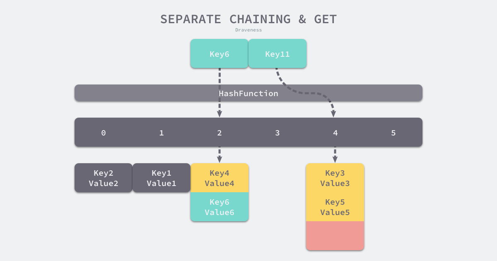

# Map 相关问题

# 1. 讲一讲 Map 的底层实现
题目来源: 小米，滴滴，腾讯，字节跳动，畅天游

### 底层结构
Map 底层是由`hmap`和`bmap`两个结构体实现的。

```go
// A header for a Go map.
type hmap struct {
    // 元素个数，调用 len(map) 时，直接返回此值
	count     int
	flags     uint8
	// buckets 的对数 log_2
	B         uint8
	// overflow 的 bucket 近似数
	noverflow uint16
	// 计算 key 的哈希的时候会传入哈希函数
	hash0     uint32
    // 指向 buckets 数组，大小为 2^B
    // 如果元素个数为0，就为 nil
	buckets    unsafe.Pointer
	// 扩容的时候，buckets 长度会是 oldbuckets 的两倍
	oldbuckets unsafe.Pointer
	// 指示扩容进度，小于此地址的 buckets 迁移完成
	nevacuate  uintptr
	extra *mapextra // optional fields
}
```

其中，`B`<font style="color:rgb(68, 68, 68);">是</font>`<font style="color:rgb(68, 68, 68);">buckets</font>`<font style="color:rgb(68, 68, 68);">数组的长度的对数，也就是说</font>`<font style="color:rgb(68, 68, 68);">buckets</font>`<font style="color:rgb(68, 68, 68);">数组的长度就是</font>`<font style="color:rgb(68, 68, 68);">2^B</font>`<font style="color:rgb(68, 68, 68);">。</font>`<font style="color:rgb(68, 68, 68);">buckets</font>`<font style="color:rgb(68, 68, 68);">里面存储了 </font>`<font style="color:rgb(68, 68, 68);">key</font>`<font style="color:rgb(68, 68, 68);"> 和 </font>`<font style="color:rgb(68, 68, 68);">value</font>`<font style="color:rgb(68, 68, 68);">。</font>`<font style="color:rgb(68, 68, 68);">buckets</font>`指向`bmap`结构体：

```go
type bmap struct {
	tophash [bucketCnt]uint8
}
```

<font style="color:rgb(68, 68, 68);">编译期间</font>`<font style="color:rgb(68, 68, 68);">bmap</font>`<font style="color:rgb(68, 68, 68);">会变成一个新的结构：</font>

```go
type bmap struct {
    topbits  [8]uint8
    keys     [8]keytype
    values   [8]valuetype
    pad      uintptr
    overflow uintptr
}
```

`<font style="color:rgb(68, 68, 68);">bmap</font>`<font style="color:rgb(68, 68, 68);">被称之为“桶”。一个桶里面会最多装 8 个 key，key 经过哈希计算后，哈希结果是“一类”的将会落入到同一个桶中。在桶内，会根据</font>`<font style="color:rgb(68, 68, 68);">key</font>`<font style="color:rgb(68, 68, 68);">计算出来的</font>`<font style="color:rgb(68, 68, 68);">hash</font>`<font style="color:rgb(68, 68, 68);">值的高 8 位来决定</font>`<font style="color:rgb(68, 68, 68);">key</font>`<font style="color:rgb(68, 68, 68);">到底落入桶内的哪个位置。注：一个桶内最多有8个位置。</font>

<font style="color:rgb(68, 68, 68);">这也是为什么</font>`<font style="color:rgb(68, 68, 68);">map</font>`<font style="color:rgb(68, 68, 68);">无法使用</font>`<font style="color:rgb(68, 68, 68);">cap()</font>`<font style="color:rgb(68, 68, 68);">来求容量的关键原因：</font>`<font style="color:rgb(68, 68, 68);">map</font>`<font style="color:rgb(68, 68, 68);">的容量是编译器进行</font>**<font style="color:rgb(68, 68, 68);">计算后</font>**<font style="color:rgb(68, 68, 68);">得出的一个结果，由于桶的存在，</font>`<font style="color:rgb(68, 68, 68);">map</font>`<font style="color:rgb(68, 68, 68);">在内存中实际存放的大小不一定同</font>`<font style="color:rgb(68, 68, 68);">make</font>`<font style="color:rgb(68, 68, 68);">出来后的</font>`<font style="color:rgb(68, 68, 68);">map</font>`<font style="color:rgb(68, 68, 68);">的大小一致。</font>


<font style="color:rgb(68, 68, 68);">有一点需要注意：当</font>`<font style="color:rgb(68, 68, 68);">map</font>`<font style="color:rgb(68, 68, 68);">的</font>`<font style="color:rgb(68, 68, 68);">key</font>`<font style="color:rgb(68, 68, 68);">和</font>`<font style="color:rgb(68, 68, 68);">value</font>`<font style="color:rgb(68, 68, 68);">都不是指针，并且</font>`<font style="color:rgb(68, 68, 68);">size</font>`<font style="color:rgb(68, 68, 68);">都小于 128 字节的情况下，会把 </font>`<font style="color:rgb(68, 68, 68);">bmap</font>`<font style="color:rgb(68, 68, 68);">标记为不含指针，这样可以避免</font>`<font style="color:rgb(68, 68, 68);">gc</font>`<font style="color:rgb(68, 68, 68);">时扫描整个</font>`<font style="color:rgb(68, 68, 68);">hmap</font>`<font style="color:rgb(68, 68, 68);">。尽管如此，但如图所示，</font>`<font style="color:rgb(68, 68, 68);">bmap</font>`<font style="color:rgb(68, 68, 68);">是有一个</font>`<font style="color:rgb(68, 68, 68);">overflow</font>`<font style="color:rgb(68, 68, 68);">的字段，该字段是指针类型，这就破坏了</font>`<font style="color:rgb(68, 68, 68);">bmap</font>`<font style="color:rgb(68, 68, 68);">不含指针的设想，这时会把</font>`<font style="color:rgb(68, 68, 68);">overflow</font>`<font style="color:rgb(68, 68, 68);">移动到</font>`<font style="color:rgb(68, 68, 68);">extra</font>`<font style="color:rgb(68, 68, 68);">字段来。</font>

```go
type mapextra struct {
	// overflow[0] contains overflow buckets for hmap.buckets.
	// overflow[1] contains overflow buckets for hmap.oldbuckets.
	overflow [2]*[]*bmap

	// nextOverflow 包含空闲的 overflow bucket，这是预分配的 bucket
	nextOverflow *bmap
}
```

### 参考文章
[https://qcrao.com/2019/05/22/dive-into-go-map/](https://qcrao.com/2019/05/22/dive-into-go-map/)

# 2. Map 哈希冲突（不局限于 Golang）是怎么解决的？
<font style="color:rgb(0, 0, 0);">在通常情况下，哈希函数输入的范围一定会远远大于输出的范围，所以在使用哈希表时一定会遇到冲突，哪怕我们使用了完美的哈希函数，当输入的键足够多也会产生冲突。然而多数的哈希函数都是不够完美的，所以仍然存在发生哈希碰撞的可能，这时就需要一些方法来解决哈希碰撞的问题，常见方法的就是开放寻址法和拉链法。（需要注意的是，这里提到的哈希碰撞不是多个键对应的哈希完全相等，可能是多个哈希的部分相等，例如：两个键对应哈希的前四个字节相同。）</font>

## <font style="color:rgb(0, 0, 0);">开放寻址法</font>
开放寻址法<font style="color:rgb(0, 0, 0);">是一种在哈希表中解决哈希碰撞的方法，这种方法的核心思想是</font>**<font style="color:rgb(0, 0, 0);">依次探测和比较数组中的元素以判断目标键值对是否存在于哈希表中</font>**<font style="color:rgb(0, 0, 0);">，如果我们使用开放寻址法来实现哈希表，那么实现哈希表底层的数据结构就是数组，不过因为数组的长度有限，向哈希表写入 (author, draven) 这个键值对时会从如下的索引开始遍历：</font>

```go
index := hash("author") % array.len 
```

<font style="color:rgb(0, 0, 0);">当我们向当前哈希表写入新的数据时，如果发生了冲突，就会将键值对写入到下一个索引不为空的位置：</font>


<font style="color:rgb(0, 0, 0);">如上图所示，当 Key3 与已经存入哈希表中的两个键值对 Key1 和 Key2 发生冲突时，Key3 会被写入 Key2 后面的空闲位置。当我们再去读取 Key3 对应的值时就会先获取键的哈希并取模，这会先帮助我们找到 Key1，找到 Key1 后发现它与 Key 3 不相等，所以会继续查找后面的元素，直到内存为空或者找到目标元素。</font>


<font style="color:rgb(0, 0, 0);">当需要查找某个键对应的值时，会从索引的位置开始线性探测数组，找到目标键值对或者空内存就意味着这一次查询操作的结束。</font>

<font style="color:rgb(0, 0, 0);">开放寻址法中对性能影响最大的是</font>**<font style="color:rgb(0, 0, 0);">装载因子</font>**<font style="color:rgb(0, 0, 0);">，它是数组中元素的数量与数组大小的比值。随着装载因子的增加，线性探测的平均用时就会逐渐增加，这会影响哈希表的读写性能。当装载率超过 70% 之后，哈希表的性能就会急剧下降，而一旦装载率达到 100%，整个哈希表就会完全失效，这时查找和插入任意元素的时间复杂度都是</font><font style="color:rgb(0, 0, 0);"> </font><font style="color:rgb(0, 0, 0);">O</font><font style="color:rgb(0, 0, 0);">(</font><font style="color:rgb(0, 0, 0);">n</font><font style="color:rgb(0, 0, 0);">)</font><font style="color:rgb(0, 0, 0);">O</font><font style="color:rgb(0, 0, 0);">(</font><font style="color:rgb(0, 0, 0);">n</font><font style="color:rgb(0, 0, 0);">)</font><font style="color:rgb(0, 0, 0);"> </font><font style="color:rgb(0, 0, 0);">的，这时需要遍历数组中的全部元素，所以在实现哈希表时一定要关注装载因子的变化。</font>

## <font style="color:rgb(0, 0, 0);">拉链法（Go 采用）</font>
<font style="color:rgb(0, 0, 0);">与开放地址法相比，拉链法是哈希表最常见的实现方法，大多数的编程语言都用拉链法实现哈希表，它的实现比较开放地址法稍微复杂一些，但是平均查找的长度也比较短，各个用于存储节点的内存都是动态申请的，可以节省比较多的存储空间。</font>

<font style="color:rgb(0, 0, 0);">实现拉链法一般会使用数组加上链表，不过一些编程语言会在拉链法的哈希中引入红黑树以优化性能，拉链法会使用链表数组作为哈希底层的数据结构，我们可以将它看成可以扩展的二维数组：</font>


<font style="color:rgb(0, 0, 0);">如上图所示，当我们需要将一个键值对 (Key6, Value6) 写入哈希表时，键值对中的键 Key6 都会先经过一个哈希函数，哈希函数返回的哈希会帮助我们选择一个桶，和开放地址法一样，选择桶的方式是直接对哈希返回的结果取模：</font>

```go
index := hash("Key6") % array.len 
```

<font style="color:rgb(0, 0, 0);">选择了 2 号桶后就可以遍历当前桶中的链表了，在遍历链表的过程中会遇到以下两种情况：</font>

1. <font style="color:rgb(0, 0, 0);">找到键相同的键值对 — 更新键对应的值；</font>
2. <font style="color:rgb(0, 0, 0);">没有找到键相同的键值对 — 在链表的末尾追加新的键值对；</font>

<font style="color:rgb(0, 0, 0);">如果要在哈希表中获取某个键对应的值，会经历如下的过程：</font>



<font style="color:rgb(0, 0, 0);">Key11 展示了一个键在哈希表中不存在的例子，当哈希表发现它命中 4 号桶时，它会依次遍历桶中的链表，然而遍历到链表的末尾也没有找到期望的键，所以哈希表中没有该键对应的值。</font>

<font style="color:rgb(0, 0, 0);">在一个性能比较好的哈希表中，每一个桶中都应该有 0~1 个元素，有时会有 2~3 个，很少会超过这个数量。计算哈希、定位桶和遍历链表三个过程是哈希表读写操作的主要开销，使用拉链法实现的哈希也有装载因子这一概念：</font>

:::info
装载因子:=元素数量÷桶数量装载因子:=元素数量÷桶数量

:::

<font style="color:rgb(0, 0, 0);">与开放地址法一样，拉链法的装载因子越大，哈希的读写性能就越差。在一般情况下使用拉链法的哈希表装载因子都不会超过 1，当哈希表的装载因子较大时会触发哈希的扩容，创建更多的桶来存储哈希中的元素，保证性能不会出现严重的下降。如果有 1000 个桶的哈希表存储了 10000 个键值对，它的性能是保存 1000 个键值对的 1/10，但是仍然比在链表中直接读写好 1000 倍。</font>

:::info
Go 语言使用拉链法来解决哈希碰撞的问题。当冲突发生的时候， 由于每个 bucket 可以存储 8 个键值对， 当第九个元素来到了这个 bucket 中时， 就会新建一个溢出 bucket 存储元素，同时已满的 bucket 的 next 指针会指向新建的 bucket。

:::

# 3. 讲一讲 map 的扩容过程
Go 语言采用一个 bucket 里装载 8 个 key，定位到某个 bucket 后，还需要再定位到具体的 key，这实际上又用了时间换空间。

当然，这样做，要有一个度，不然所有的 key 都落在了同一个 bucket 里，直接退化成了链表，各种操作的效率直接降为 O(n)，是不行的。

因此，需要有一个指标来衡量前面描述的情况，这就是装载因子。Go 源码里这样定义：


```go
//count 就是 map 的元素个数，2^B 表示 bucket 数量。
loadFactor := count / (2^B)
```

## 触发 map 扩容的时机
在向 map 插入新 key 的时候，会进行条件检测，符合下面这 2 个条件，就会触发扩容：

1. **双倍扩容**：装载因子超过阈值，源码里定义的阈值是 6.5。
2. **等量扩容**：overflow 的 bucket 数量过多：当 B 小于 15，也就是 bucket 总数 2^B 小于 2^15 时，如果 overflow 的 bucket 数量超过 2^B；当 B >= 15，也就是 bucket 总数 2^B 大于等于 2^15，如果 overflow 的 bucket 数量超过 2^15。 
    1. 为什么需要等量扩容：  
其实元素没那么多，**但是 overflow bucket 数特别多**，说明很多**bucket 都没装满**。解决办法就是开辟一个新 bucket 空间，将老 bucket 中的元素移动到新 bucket，使得同一个 **bucket 中的 key 排列地更紧密**。这样，原来，在 overflow bucket 中的 key 可以移动到 bucket 中来。结果是节省空间，提高 bucket 利用率，map 的查找和插入效率自然就会提升。


如果插入 map 的 key 哈希都一样，就会落到同一个 bucket 里，超过 8 个就会产生 overflow bucket，结果也会造成 overflow bucket 数过多。移动元素其实解决不了问题，因为这时整个哈希表已经退化成了一个链表，操作效率变成了 O(n)。


```plain
// src/runtime/hashmap.go/mapassign

// 触发扩容时机
if !h.growing() && (overLoadFactor(int64(h.count), h.B) || tooManyOverflowBuckets(h.noverflow, h.B)) {
        hashGrow(t, h)
    }

// 装载因子超过 6.5
func overLoadFactor(count int64, B uint8) bool {
    return count >= bucketCnt && float32(count) >= loadFactor*float32((uint64(1)<<B))
}

// overflow buckets 太多
func tooManyOverflowBuckets(noverflow uint16, B uint8) bool {
    if B < 16 {
        return noverflow >= uint16(1)<<B
    }
    return noverflow >= 1<<15
}
```


## 扩容过程


由于 map 扩容需要将原有的 key/value 重新搬迁到新的内存地址，如果有大量的 key/value 需要搬迁，会非常影响性能。因此 Go map 的扩容采取了一种称为“**渐进式**”地方式，原有的 key 并不会一次性搬迁完毕，**每次最多只会搬迁 2 个 bucket。**


hashGrow() 函数实际上并没有真正地“搬迁”，它只是分配好了新的 buckets，并将老的 buckets 挂到了 oldbuckets 字段上。真正搬迁 buckets 的动作在 growWork() 函数中，而调用 growWork() 函数的动作是在 mapassign 和 mapdelete 函数中。也就是插入或修改、删除 key 的时候，都会尝试进行搬迁 buckets 的工作。先检查 oldbuckets 是否搬迁完毕，具体来说就是检查 oldbuckets 是否为 nil。


```plain
//hashGrow() 函数所做的工作，再来看具体的搬迁 buckets 是如何进行
func hashGrow( t *maptype, h *hmap) {
    // B+1 相当于是原来 2 倍的空间
    bigger := uint8(1)

    // 对应条件 2
    if !overLoadFactor(int64(h.count), h.B) {
        // 进行等量的内存扩容，所以 B 不变
        bigger = 0
        h.flags |= sameSizeGrow
    }
    // 将老 buckets 挂到 buckets 上
    oldbuckets := h.buckets
    // 申请新的 buckets 空间
    newbuckets, nextOverflow := makeBucketArray(t, h.B+bigger)

    flags := h.flags &^ (iterator | oldIterator)
    if h.flags&iterator != 0 {
        flags |= oldIterator
    }
    // 提交 grow 的动作
    h.B += bigger
    h.flags = flags
    h.oldbuckets = oldbuckets
    h.buckets = newbuckets
    // 搬迁进度为 0
    h.nevacuate = 0
    // overflow buckets 数为 0
    h.noverflow = 0

    // ……
}

// h.flags 的处理：
flags := h.flags &^ (iterator | oldIterator)
if h.flags&iterator != 0 {
    flags |= oldIterator
}
```


主要是申请到了新的 buckets 空间，把相关的标志位都进行了处理：例如标志 nevacuate 被置为 0， 表示当前搬迁进度为 0。  
上面那段对 flags 一顿操作的代码的意思是：先把 h.flags 中 iterator 和 oldIterator 对应位清 0，然后如果发现 iterator 位为 1，那就把它转接到 oldIterator 位，使得 oldIterator 标志位变成 1。潜台词就是：buckets 现在挂到了 oldBuckets 名下了，对应的标志位也转接过去了。


```plain
//几个标志位如下
// 可能有迭代器使用 buckets
iterator     = 1
// 可能有迭代器使用 oldbuckets
oldIterator  = 2
// 有协程正在向 map 中写入 key
hashWriting  = 4
// 等量扩容（对应条件 2）
sameSizeGrow = 8
```


## 真正执行搬迁工作的 growWork() 函数


```plain
func growWork(t *maptype, h *hmap, bucket uintptr) {
    // 确认搬迁老的 bucket 对应正在使用的 bucket
    evacuate(t, h, bucket&h.oldbucketmask())

    // 再搬迁一个 bucket，以加快搬迁进程
    if h.growing() {
        evacuate(t, h, h.nevacuate)
    }
}
// h.growing() 函数
func (h *hmap) growing() bool {
    return h.oldbuckets != nil
}
```


如果 oldbuckets 不为空，说明还没有搬迁完毕，还得继续搬。  
bucket&h.oldbucketmask() 这行代码，如源码注释里说的，是为了确认搬迁的 bucket 是我们正在使用的 bucket。oldbucketmask() 函数返回扩容前的 map 的 bucketmask。


所谓的 bucketmask，作用就是将 key 计算出来的哈希值与 bucketmask 相与，得到的结果就是 key 应该落入的桶。比如 B = 5，那么 bucketmask 的低 5 位是 11111，其余位是 0


## 集中所有的精力在搬迁的关键函数 evacuate


```go
func evacuate(t *maptype, h *hmap, oldbucket uintptr) {
    // 定位老的 bucket 地址
    b := (*bmap)(add(h.oldbuckets, oldbucket*uintptr(t.bucketsize)))
    // 结果是 2^B，如 B = 5，结果为32
    newbit := h.noldbuckets()
    // key 的哈希函数
    alg := t.key.alg
    // 如果 b 没有被搬迁过
    if !evacuated(b) {
        var (
            // 表示bucket 移动的目标地址
            x, y   *bmap
            // 指向 x,y 中的 key/val
            xi, yi int
            // 指向 x，y 中的 key
            xk, yk unsafe.Pointer
            // 指向 x，y 中的 value
            xv, yv unsafe.Pointer
        )
        // 默认是等 size 扩容，前后 bucket 序号不变
        // 使用 x 来进行搬迁
        x = (*bmap)(add(h.buckets, oldbucket*uintptr(t.bucketsize)))
        xi = 0
        xk = add(unsafe.Pointer(x), dataOffset)
        xv = add(xk, bucketCnt*uintptr(t.keysize))、
        
        // 如果不是等 size 扩容，前后 bucket 序号有变
        // 使用 y 来进行搬迁
        if !h.sameSizeGrow() {
            // y 代表的 bucket 序号增加了 2^B
            y = (*bmap)(add(h.buckets, (oldbucket+newbit)*uintptr(t.bucketsize)))
            yi = 0
            yk = add(unsafe.Pointer(y), dataOffset)
            yv = add(yk, bucketCnt*uintptr(t.keysize))
        }
        
        // 遍历所有的 bucket，包括 overflow buckets
        // b 是老的 bucket 地址
        for ; b != nil; b = b.overflow(t) {
            k := add(unsafe.Pointer(b), dataOffset)
            v := add(k, bucketCnt*uintptr(t.keysize))
            
            // 遍历 bucket 中的所有 cell
            for i := 0; i < bucketCnt; i, k, v = i+1, add(k, uintptr(t.keysize)), add(v, uintptr(t.valuesize)) {
                // 当前 cell 的 top hash 值
                top := b.tophash[i]
                // 如果 cell 为空，即没有 key
                if top == empty {
                    // 那就标志它被"搬迁"过
                    b.tophash[i] = evacuatedEmpty
                    // 继续下个 cell
                    continue
                }
                // 正常不会出现这种情况
                // 未被搬迁的 cell 只可能是 empty 或是
                // 正常的 top hash（大于 minTopHash）
                if top < minTopHash {
                    throw("bad map state")
                }
                
                k2 := k
                // 如果 key 是指针，则解引用
                if t.indirectkey {
                    k2 = *((*unsafe.Pointer)(k2))
                }
                
                // 默认使用 X，等量扩容
                useX := true
                // 如果不是等量扩容
                if !h.sameSizeGrow() {
                    // 计算 hash 值，和 key 第一次写入时一样
                    hash := alg.hash(k2, uintptr(h.hash0))
                    
                    // 如果有协程正在遍历 map
                    if h.flags&iterator != 0 {
                        // 如果出现 相同的 key 值，算出来的 hash 值不同
                        if !t.reflexivekey && !alg.equal(k2, k2) {
                            // 只有在 float 变量的 NaN() 情况下会出现
                            if top&1 != 0 {
                                // 第 B 位置 1
                                hash |= newbit
                            } else {
                                // 第 B 位置 0
                                hash &^= newbit
                            }
                            // 取高 8 位作为 top hash 值
                            top = uint8(hash >> (sys.PtrSize*8 - 8))
                            if top < minTopHash {
                                top += minTopHash
                            }
                        }
                    }
                    
                    // 取决于新哈希值的 oldB+1 位是 0 还是 1
                    // 详细看后面的文章
                    useX = hash&newbit == 0
                }
                
                // 如果 key 搬到 X 部分
                if useX {
                    // 标志老的 cell 的 top hash 值，表示搬移到 X 部分
                    b.tophash[i] = evacuatedX
                    // 如果 xi 等于 8，说明要溢出了
                    if xi == bucketCnt {
                        // 新建一个 bucket
                        newx := h.newoverflow(t, x)
                        x = newx
                        // xi 从 0 开始计数
                        xi = 0
                        // xk 表示 key 要移动到的位置
                        xk = add(unsafe.Pointer(x), dataOffset)
                        // xv 表示 value 要移动到的位置
                        xv = add(xk, bucketCnt*uintptr(t.keysize))
                    }
                    // 设置 top hash 值
                    x.tophash[xi] = top
                    // key 是指针
                    if t.indirectkey {
                        // 将原 key（是指针）复制到新位置
                        *(*unsafe.Pointer)(xk) = k2 // copy pointer
                    } else {
                        // 将原 key（是值）复制到新位置
                        typedmemmove(t.key, xk, k) // copy value
                    }
                    // value 是指针，操作同 key
                    if t.indirectvalue {
                        *(*unsafe.Pointer)(xv) = *(*unsafe.Pointer)(v)
                    } else {
                        typedmemmove(t.elem, xv, v)
                    }
                    
                    // 定位到下一个 cell
                    xi++
                    xk = add(xk, uintptr(t.keysize))
                    xv = add(xv, uintptr(t.valuesize))
                } else { // key 搬到 Y 部分，操作同 X 部分
                    // ……
                    // 省略了这部分，操作和 X 部分相同
                }
            }
        }
        // 如果没有协程在使用老的 buckets，就把老 buckets 清除掉，帮助gc
        if h.flags&oldIterator == 0 {
            b = (*bmap)(add(h.oldbuckets, oldbucket*uintptr(t.bucketsize)))
            // 只清除bucket 的 key,value 部分，保留 top hash 部分，指示搬迁状态
            if t.bucket.kind&kindNoPointers == 0 {
                memclrHasPointers(add(unsafe.Pointer(b), dataOffset), uintptr(t.bucketsize)-dataOffset)
            } else {
                memclrNoHeapPointers(add(unsafe.Pointer(b), dataOffset), uintptr(t.bucketsize)-dataOffset)
            }
        }
    }
    
    // 更新搬迁进度
    // 如果此次搬迁的 bucket 等于当前进度
    if oldbucket == h.nevacuate {
        // 进度加 1
        h.nevacuate = oldbucket + 1
        // Experiments suggest that 1024 is overkill by at least an order of magnitude.
        // Put it in there as a safeguard anyway, to ensure O(1) behavior.
        // 尝试往后看 1024 个 bucket
        stop := h.nevacuate + 1024
        if stop > newbit {
            stop = newbit
        }
        // 寻找没有搬迁的 bucket
        for h.nevacuate != stop && bucketEvacuated(t, h, h.nevacuate) {
            h.nevacuate++
        }
        
        // 现在 h.nevacuate 之前的 bucket 都被搬迁完毕
        
        // 所有的 buckets 搬迁完毕
        if h.nevacuate == newbit {
            // 清除老的 buckets
            h.oldbuckets = nil
            // 清除老的 overflow bucket
            // 回忆一下：[0] 表示当前 overflow bucket
            // [1] 表示 old overflow bucket
            if h.extra != nil {
                h.extra.overflow[1] = nil
            }
            // 清除正在扩容的标志位
            h.flags &^= sameSizeGrow
        }
    }
}func evacuate(t *maptype, h *hmap, oldbucket uintptr) {
    // 定位老的 bucket 地址
    b := (*bmap)(add(h.oldbuckets, oldbucket*uintptr(t.bucketsize)))
    // 结果是 2^B，如 B = 5，结果为32
    newbit := h.noldbuckets()
    // key 的哈希函数
    alg := t.key.alg
    // 如果 b 没有被搬迁过
    if !evacuated(b) {
        var (
            // 表示bucket 移动的目标地址
            x, y   *bmap
            // 指向 x,y 中的 key/val
            xi, yi int
            // 指向 x，y 中的 key
            xk, yk unsafe.Pointer
            // 指向 x，y 中的 value
            xv, yv unsafe.Pointer
        )
        // 默认是等 size 扩容，前后 bucket 序号不变
        // 使用 x 来进行搬迁
        x = (*bmap)(add(h.buckets, oldbucket*uintptr(t.bucketsize)))
        xi = 0
        xk = add(unsafe.Pointer(x), dataOffset)
        xv = add(xk, bucketCnt*uintptr(t.keysize))、
        
        // 如果不是等 size 扩容，前后 bucket 序号有变
        // 使用 y 来进行搬迁
        if !h.sameSizeGrow() {
            // y 代表的 bucket 序号增加了 2^B
            y = (*bmap)(add(h.buckets, (oldbucket+newbit)*uintptr(t.bucketsize)))
            yi = 0
            yk = add(unsafe.Pointer(y), dataOffset)
            yv = add(yk, bucketCnt*uintptr(t.keysize))
        }
        
        // 遍历所有的 bucket，包括 overflow buckets
        // b 是老的 bucket 地址
        for ; b != nil; b = b.overflow(t) {
            k := add(unsafe.Pointer(b), dataOffset)
            v := add(k, bucketCnt*uintptr(t.keysize))
            
            // 遍历 bucket 中的所有 cell
            for i := 0; i < bucketCnt; i, k, v = i+1, add(k, uintptr(t.keysize)), add(v, uintptr(t.valuesize)) {
                // 当前 cell 的 top hash 值
                top := b.tophash[i]
                // 如果 cell 为空，即没有 key
                if top == empty {
                    // 那就标志它被"搬迁"过
                    b.tophash[i] = evacuatedEmpty
                    // 继续下个 cell
                    continue
                }
                // 正常不会出现这种情况
                // 未被搬迁的 cell 只可能是 empty 或是
                // 正常的 top hash（大于 minTopHash）
                if top < minTopHash {
                    throw("bad map state")
                }
                
                k2 := k
                // 如果 key 是指针，则解引用
                if t.indirectkey {
                    k2 = *((*unsafe.Pointer)(k2))
                }
                
                // 默认使用 X，等量扩容
                useX := true
                // 如果不是等量扩容
                if !h.sameSizeGrow() {
                    // 计算 hash 值，和 key 第一次写入时一样
                    hash := alg.hash(k2, uintptr(h.hash0))
                    
                    // 如果有协程正在遍历 map
                    if h.flags&iterator != 0 {
                        // 如果出现 相同的 key 值，算出来的 hash 值不同
                        if !t.reflexivekey && !alg.equal(k2, k2) {
                            // 只有在 float 变量的 NaN() 情况下会出现
                            if top&1 != 0 {
                                // 第 B 位置 1
                                hash |= newbit
                            } else {
                                // 第 B 位置 0
                                hash &^= newbit
                            }
                            // 取高 8 位作为 top hash 值
                            top = uint8(hash >> (sys.PtrSize*8 - 8))
                            if top < minTopHash {
                                top += minTopHash
                            }
                        }
                    }
                    
                    // 取决于新哈希值的 oldB+1 位是 0 还是 1
                    // 详细看后面的文章
                    useX = hash&newbit == 0
                }
                
                // 如果 key 搬到 X 部分
                if useX {
                    // 标志老的 cell 的 top hash 值，表示搬移到 X 部分
                    b.tophash[i] = evacuatedX
                    // 如果 xi 等于 8，说明要溢出了
                    if xi == bucketCnt {
                        // 新建一个 bucket
                        newx := h.newoverflow(t, x)
                        x = newx
                        // xi 从 0 开始计数
                        xi = 0
                        // xk 表示 key 要移动到的位置
                        xk = add(unsafe.Pointer(x), dataOffset)
                        // xv 表示 value 要移动到的位置
                        xv = add(xk, bucketCnt*uintptr(t.keysize))
                    }
                    // 设置 top hash 值
                    x.tophash[xi] = top
                    // key 是指针
                    if t.indirectkey {
                        // 将原 key（是指针）复制到新位置
                        *(*unsafe.Pointer)(xk) = k2 // copy pointer
                    } else {
                        // 将原 key（是值）复制到新位置
                        typedmemmove(t.key, xk, k) // copy value
                    }
                    // value 是指针，操作同 key
                    if t.indirectvalue {
                        *(*unsafe.Pointer)(xv) = *(*unsafe.Pointer)(v)
                    } else {
                        typedmemmove(t.elem, xv, v)
                    }
                    
                    // 定位到下一个 cell
                    xi++
                    xk = add(xk, uintptr(t.keysize))
                    xv = add(xv, uintptr(t.valuesize))
                } else { // key 搬到 Y 部分，操作同 X 部分
                    // ……
                    // 省略了这部分，操作和 X 部分相同
                }
            }
        }
        // 如果没有协程在使用老的 buckets，就把老 buckets 清除掉，帮助gc
        if h.flags&oldIterator == 0 {
            b = (*bmap)(add(h.oldbuckets, oldbucket*uintptr(t.bucketsize)))
            // 只清除bucket 的 key,value 部分，保留 top hash 部分，指示搬迁状态
            if t.bucket.kind&kindNoPointers == 0 {
                memclrHasPointers(add(unsafe.Pointer(b), dataOffset), uintptr(t.bucketsize)-dataOffset)
            } else {
                memclrNoHeapPointers(add(unsafe.Pointer(b), dataOffset), uintptr(t.bucketsize)-dataOffset)
            }
        }
    }
    
    // 更新搬迁进度
    // 如果此次搬迁的 bucket 等于当前进度
    if oldbucket == h.nevacuate {
        // 进度加 1
        h.nevacuate = oldbucket + 1
        // Experiments suggest that 1024 is overkill by at least an order of magnitude.
        // Put it in there as a safeguard anyway, to ensure O(1) behavior.
        // 尝试往后看 1024 个 bucket
        stop := h.nevacuate + 1024
        if stop > newbit {
            stop = newbit
        }
        // 寻找没有搬迁的 bucket
        for h.nevacuate != stop && bucketEvacuated(t, h, h.nevacuate) {
            h.nevacuate++
        }
        
        // 现在 h.nevacuate 之前的 bucket 都被搬迁完毕
        
        // 所有的 buckets 搬迁完毕
        if h.nevacuate == newbit {
            // 清除老的 buckets
            h.oldbuckets = nil
            // 清除老的 overflow bucket
            // 回忆一下：[0] 表示当前 overflow bucket
            // [1] 表示 old overflow bucket
            if h.extra != nil {
                h.extra.overflow[1] = nil
            }
            // 清除正在扩容的标志位
            h.flags &^= sameSizeGrow
        }
    }
}
```


搬迁的目的就是将老的 buckets 搬迁到新的 buckets。而通过前面的说明我们知道，应对条件 1，新的 buckets 数量是之前的一倍，应对条件 2，新的 buckets 数量和之前相等。  
对于**等量扩容**，从老的 buckets 搬迁到新的 buckets，由于 bucktes 数量不变，因此可以按序号来搬，比如原来在 0 号 bucktes，到新的地方后，仍然放在 0 号 buckets。


对于**双倍扩容**，就没这么简单了。要重新计算 key 的哈希，才能决定它到底落在哪个 bucket。例如，原来 B = 5，计算出 key 的哈希后，只用看它的低 5 位，就能决定它落在哪个 bucket。扩容后，B 变成了 6，因此需要多看一位，它的低 6 位决定 key 落在哪个 bucket。这称为 rehash。


因此，某个 key 在搬迁前后 bucket 序号可能和原来相等，也可能是相比原来加上 2^B（原来的 B 值），取决于 hash 值 第 6 bit 位是 0 还是 1。


再明确一个问题：**如果扩容后，B 增加了 1，意味着 buckets 总数是原来的 2 倍，原来 1 号的桶“裂变”到两个桶。**


例如下图，原始 B = 2，1号 bucket 中有 2 个 key 的哈希值低 3 位分别为：010，110。由于原来 B = 2，所以低 2 位 10 决定它们落在 2 号桶，现在 B 变成 3，所以 010、110


## 搬迁函数中的几个关键点
1. evacuate 函数每次只完成一个 bucket 的搬迁工作，因此要遍历完此 bucket 的所有的 cell，将有值的 cell copy 到新的地方。bucket 还会链接 overflow bucket，它们同样需要搬迁。因此会有 2 层循环，外层遍历 bucket 和 overflow bucket，内层遍历 bucket 的所有 cell。这样的循环在 map 的源码里到处都是，要理解透了。
2. X, Y part，其实就是我们说的如果是扩容到原来的 2 倍，桶的数量是原来的 2 倍，前一半桶被称为 X part，后一半桶被称为 Y part。一个 bucket 中的 key 可能会分裂落到 2 个桶，一个位于 X part，一个位于 Y part。所以在搬迁一个 cell 之前，需要知道这个 cell 中的 key 是落到哪个 Part。很简单，重新计算 cell 中 key 的 hash，并向前“多看”一位，决定落入哪个 Part。
3. 有一个特殊情况是：有一种 key，每次对它计算 hash，得到的结果都不一样。这个 key 就是 math.NaN() 的结果，它的含义是 not a number，类型是 float64。当它作为 map 的 key，在搬迁的时候，会遇到一个问题：再次计算它的哈希值和它当初插入 map 时的计算出来的哈希值不一样！ 
    1. （你可能想到了，这样带来的一个后果是，这个 key 是永远不会被 Get 操作获取的！当我使用 m[math.NaN()] 语句的时候，是查不出来结果的。这个 key 只有在遍历整个 map 的时候，才有机会现身。所以，可以向一个 map 插入任意数量的 math.NaN() 作为 key。
    2. 当搬迁碰到 math.NaN() 的 key 时，只通过 tophash 的最低位决定分配到 X part 还是 Y part（如果扩容后是原来 buckets 数量的 2 倍）。如果 tophash 的最低位是 0 ，分配到 X part；如果是 1 ，则分配到 Y part。这是通过 tophash 值与新算出来的哈希值进行运算得到的：


```go
if top&1 != 0 {
    // top hash 最低位为 1
    // 新算出来的 hash 值的 B 位置 1
    hash |= newbit
} else {
    // 新算出来的 hash 值的 B 位置 0
    hash &^= newbit
}

// hash 值的 B 位为 0，则搬迁到 x part
// 当 B = 5时，newbit = 32，二进制低 6 位为 10 0000
useX = hash&newbit == 0
```


其实这样的 key 我随便搬迁到哪个 bucket 都行，当然，还是要搬迁到上面裂变那张图中的两个 bucket 中去。但这样做是有好处的。  
确定了要搬迁到的目标 bucket 后，搬迁操作就比较好进行了。将源 key/value 值 copy 到目的地相应的位置。


设置 key 在原始 buckets 的 tophash 为 evacuatedX 或是 evacuatedY


（宏观扩容前后的变化）


扩容前，B = 2，共有 4 个 buckets，lowbits 表示 hash 值的低位。假设我们不关注其他 buckets 情况，专注在 2 号 bucket。并且假设 overflow 太多，触发了**等量扩容。**


扩容完成后，overflow bucket 消失了，key 都集中到了一个 bucket，更为紧凑了，提高了查找的效率。


假设触发了双倍扩容，那么扩容完成后，老 buckets 中的 key 分裂到了 2 个 新的 bucket。一个在 x part，一个在 y 的 part。依据是 hash 的 lowbits。新 map 中 0-3 称为 x part，4-7 称为 y part。


注意，上面的两张图忽略了其他 buckets 的搬迁情况，表示所有的 bucket 都搬迁完毕后的情形。实际上，我们知道，搬迁是一个“渐进”的过程，并不会一下子就全部搬迁完毕。所以在搬迁过程中，**oldbuckets 指针还会指向原来老的 []bmap，并且已经搬迁完毕的 key 的 tophash 值会是一个状态值，表示 key 的搬迁去向。**


# 4. map 的遍历过程是怎样的？


本来 map 的遍历过程比较简单：遍历所有的 bucket 以及它后面挂的 overflow bucket，然后挨个遍历 bucket 中的所有 cell。每个 bucket 中包含 8 个 cell，从有 key 的 cell 中取出 key 和 value，这个过程就完成了。


但是，现实并没有这么简单。**因为扩容过程不是一个原子的操作**，它每次最多只搬运 2 个 bucket，所以如果触发了扩容操作，那么在很长时间里，map 的状态都是处于一个中间态：有些 bucket 已经搬迁到新家，而有些 bucket 还待在老地方。


遍历如果发生在扩容的过程中，就会涉及到遍历新老 bucket 的过程，这是难点所在。


**map 遍历的核心在于理解 2 倍扩容时，老 bucket 会分裂到 2 个新 bucket 中去。而遍历操作，会按照新 bucket 的序号顺序进行，碰到老 bucket 未搬迁的情况时，要在老 bucket 中找到将来要搬迁到新 bucket 来的 key。**


## 迭代器


底层的函数调用关系一目了然。先是调用 mapiterinit 函数初始化迭代器，然后循环调用 **mapiternext** 函数进行 map 迭代。

**mapiterinit** 就是对 hiter 结构体里的字段进行初始化赋值操作。


```go
迭代器的结构体定义：
type hiter struct {
    // key 指针
    key         unsafe.Pointer
    // value 指针
    value       unsafe.Pointer
    // map 类型，包含如 key size 大小等
    t           *maptype
    // map header
    h           *hmap
    // 初始化时指向的 bucket
    buckets     unsafe.Pointer
    // 当前遍历到的 bmap
    bptr        *bmap
    overflow    [2]*[]*bmap
    // 起始遍历的 bucet 编号
    startBucket uintptr
    // 遍历开始时 cell 的编号（每个 bucket 中有 8 个 cell）
    offset      uint8
    // 是否从头遍历了
    wrapped     bool
    // B 的大小
    B           uint8
    // 指示当前 cell 序号
    i           uint8
    // 指向当前的 bucket
    bucket      uintptr
    // 因为扩容，需要检查的 bucket
    checkBucket uintptr
}
```


**即使是对一个写死的 map 进行遍历，每次出来的结果也是无序的**。


```go
// 生成随机数 r
r := uintptr(fastrand())
if h.B > 31-bucketCntBits {
    r += uintptr(fastrand()) << 31
}

// 从哪个 bucket 开始遍历
it.startBucket = r & (uintptr(1)<<h.B - 1)
// 从 bucket 的哪个 cell 开始遍历
it.offset = uint8(r >> h.B & (bucketCnt - 1))
```


假设 B = 2，那 uintptr(1)<<h.B - 1 结果就是 3，低 8 位为 0000 0011，将 r 与之相与，就可以得到一个 0~3 的 bucket 序号；bucketCnt - 1 等于 7，低 8 位为 0000 0111，将 r 右移 2 位后，与 7 相与，就可以得到一个 0~7 号的 cell。  
于是，在 mapiternext函数中就会从 it.startBucket 的 it.offset 号的 cell 开始遍历，取出其中的 key 和 value，直到又回到起点 bucket，完成遍历过程。


假设我们有下图所示的一个 map，起始时 B = 1，有两个 bucket，后来触发了扩容（不要深究扩容条件，只是一个设定），B 变成 2。并且， 1 号 bucket 中的内容搬迁到了新的 bucket，1 号裂变成 1 号和 3 号；0 号 bucket 暂未搬迁。老的 bucket 挂在在 _oldbuckets 指针上面，新的 bucket 则挂在 _buckets 指针上面。


（遍历查找过程）


这时，我们对此 map 进行遍历。假设经过初始化后，startBucket = 3，offset = 2。于是，遍历的起点将是 3 号 bucket 的 2 号 cell，下面这张图就是开始遍历时的状态：


**标红的表示起始位置，bucket 遍历顺序为：3 -> 0 -> 1 -> 2。**


因为 3 号 bucket 对应老的 1 号 bucket，因此先检查老 1 号 bucket 是否已经被搬迁过。判断方法就是：


```go
func evacuated(b *bmap) bool {
    h := b.tophash[0]
    return h > empty && h < minTopHash
}
```


如果 b.tophash[0] 的值在标志值范围内，即在 (0,4) 区间里，说明已经被搬迁过了。  
在本例中，老 1 号 bucket 已经被搬迁过了。所以它的 tophash[0] 值在 (0,4) 范围内，因此只用遍历新的 3 号 bucket。


依次遍历 3 号 bucket 的 cell，这时候会找到第一个非空的 key：元素 e。到这里，mapiternext 函数返回，这时我们的遍历结果仅有一个元素：


由于返回的 key 不为空，所以会继续调用 mapiternext 函数。


继续从上次遍历到的地方往后遍历，从新 3 号 overflow bucket 中找到了元素 f 和 元素 g。遍历结果集也因此壮大：


新 3 号 bucket 遍历完之后，回到了新 0 号 bucket。0 号 bucket 对应老的 0 号 bucket，经检查，老 0 号 bucket 并未搬迁，因此对新 0 号 bucket 的遍历就改为遍历老 0 号 bucket。那是不是把老 0 号 bucket 中的所有 key 都取出来呢？


并没有这么简单，回忆一下，老 0 号 bucket 在搬迁后将裂变成 2 个 bucket：新 0 号、新 2 号。而我们此时正在遍历的只是新 0 号 bucket（注意，遍历都是遍历的 *bucket 指针，也就是所谓的新 buckets）。所以，我们只会取出老 0 号 bucket 中那些在裂变之后，分配到新 0 号 bucket 中的那些 key。


因此，lowbits == 00 的将进入遍历结果集：


和之前的流程一样，继续遍历新 1 号 bucket，发现老 1 号 bucket 已经搬迁，只用遍历新 1 号 bucket 中现有的元素就可以了。结果集变成：


继续遍历新 2 号 bucket，它来自老 0 号 bucket，因此需要在老 0 号 bucket 中那些会裂?变到新 2 号 bucket 中的 key，也就是 lowbit == 10 的那些 key。


这样，遍历结果集变成：


最后，继续遍历到新 3 号 bucket 时，发现所有的 bucket 都已经遍历完毕，整个迭代过程执行完毕。


顺便说一下，如果碰到 key 是 math.NaN() 这种的，处理方式类似。核心还是要看它被分裂后具体落入哪个 bucket。只不过只用看它 top hash 的最低位。如果 top hash 的最低位是 0 ，分配到 X part；如果是 1 ，则分配到 Y part。据此决定是否取出 key，放到遍历结果集里。


# key 定位过程


key 经 过哈希计算后得到哈希值，共 64 个 bit 位（64位机），计算它到底要落在哪个桶时，只会用到最后 B 个 bit 位。如果 B = 5，那么桶的数量，也就是 buckets 数组的长度是 2^5 = 32。


用最后的 5 个 bit 位，也就是 01010，值为 10，也就是 10 号桶。这个操作实际上就是取余操作，但是取余开销太大，所以代码实现上用的位操作代替。


再用哈希值的高 8 位，找到此 key 在 bucket 中的位置，这是在寻找已有的 key。最开始桶内还没有 key，新加入的 key 会找到第一个空位，放入。


（图：key 定位过程）


假定 B = 5，所以 bucket 总数就是 2^5 = 32。首先计算出待查找 key 的哈希，使用低 5 位 00110，找到对应的 6 号 bucket，使用高 8 位 10010111，对应十进制 151，在 6 号 bucket 中寻找 tophash 值（HOB hash）为 151 的 key，找到了 2 号槽位，这样整个查找过程就结束了。


如果在 bucket 中没找到，并且 overflow 不为空，还要继续去 overflow bucket 中寻找，直到找到或是所有的 key 槽位都找遍了，包括所有的 overflow bucket。


**汇编源码：**


```go
func mapaccess1(t *maptype, h *hmap, key unsafe.Pointer) unsafe.Pointer {
    // ……
    
    // 如果 h 什么都没有，返回零值
    if h == nil || h.count == 0 {
        return unsafe.Pointer(&zeroVal[0])
    }
    
    // 写和读冲突
    if h.flags&hashWriting != 0 {
        throw("concurrent map read and map write")
    }
    
    // 不同类型 key 使用的 hash 算法在编译期确定
    alg := t.key.alg
    
    // 计算哈希值，并且加入 hash0 引入随机性
    hash := alg.hash(key, uintptr(h.hash0))
    
    // 比如 B=5，那 m 就是31，二进制是全 1
    // 求 bucket num 时，将 hash 与 m 相与，
    // 达到 bucket num 由 hash 的低 8 位决定的效果
    m := uintptr(1)<<h.B - 1
    
    // b 就是 bucket 的地址
    b := (*bmap)(add(h.buckets, (hash&m)*uintptr(t.bucketsize)))
    
    // oldbuckets 不为 nil，说明发生了扩容
    if c := h.oldbuckets; c != nil {
        // 如果不是同 size 扩容（看后面扩容的内容）
        // 对应条件 1 的解决方案
        if !h.sameSizeGrow() {
            // 新 bucket 数量是老的 2 倍
            m >>= 1
        }
        
        // 求出 key 在老的 map 中的 bucket 位置
        oldb := (*bmap)(add(c, (hash&m)*uintptr(t.bucketsize)))
        
        // 如果 oldb 没有搬迁到新的 bucket
        // 那就在老的 bucket 中寻找
        if !evacuated(oldb) {
            b = oldb
        }
    }
    
    // 计算出高 8 位的 hash
    // 相当于右移 56 位，只取高8位
    top := uint8(hash >> (sys.PtrSize*8 - 8))
    
    // 增加一个 minTopHash
    if top < minTopHash {
        top += minTopHash
    }
    for {
        // 遍历 8 个 bucket
        for i := uintptr(0); i < bucketCnt; i++ {
            // tophash 不匹配，继续
            if b.tophash[i] != top {
                continue
            }
            // tophash 匹配，定位到 key 的位置
            k := add(unsafe.Pointer(b), dataOffset+i*uintptr(t.keysize))
            // key 是指针
            if t.indirectkey {
                // 解引用
                k = *((*unsafe.Pointer)(k))
            }
            // 如果 key 相等
            if alg.equal(key, k) {
                // 定位到 value 的位置
                v := add(unsafe.Pointer(b), dataOffset+bucketCnt*uintptr(t.keysize)+i*uintptr(t.valuesize))
                // value 解引用
                if t.indirectvalue {
                    v = *((*unsafe.Pointer)(v))
                }
                return v
            }
        }
        
        // bucket 找完（还没找到），继续到 overflow bucket 里找
        b = b.overflow(t)
        // overflow bucket 也找完了，说明没有目标 key
        // 返回零值
        if b == nil {
            return unsafe.Pointer(&zeroVal[0])
        }
    }
}
```


函数返回 h[key] 的指针，如果 h 中没有此 key，那就会返回一个 key 相应类型的零值，不会返回 nil。


## **定位 key 和 value 的方法以及整个循环的写法**


```go
// key 定位公式
k := add(unsafe.Pointer(b), dataOffset+i*uintptr(t.keysize))

// value 定位公式
v := add(unsafe.Pointer(b), dataOffset+bucketCnt*uintptr(t.keysize)+i*uintptr(t.valuesize))
```


b 是 bmap 的地址，这里 bmap 还是源码里定义的结构体，只包含一个 tophash 数组，经编译器扩充之后的结构体才包含 key，value，overflow 这些字段。dataOffset 是 key 相对于 bmap 起始地址的偏移：


```go
dataOffset = unsafe.Offsetof(struct {
    b bmap
    v int64
    }{}.v)
```


因此 bucket 里 key 的起始地址就是 unsafe.Pointer(b)+dataOffset。第 i 个 key 的地址就要在此基础上跨过 i 个 key 的大小；而我们又知道，value 的地址是在所有 key 之后，因此第 i 个 value 的地址还需要加上所有 key 的偏移。理解了这些，上面 key 和 value 的定位公式就很好理解了。


```plain
整个大循环的写法，最外层是一个无限循环，通过
b = b.overflow(t)
```


遍历所有的 bucket，这相当于是一个 bucket 链表。


当定位到一个具体的 bucket 时，里层循环就是遍历这个 bucket 里所有的 cell，或者说所有的槽位，也就是 bucketCnt=8 个槽位。整个循环过程：


**minTopHash：**当一个 cell 的 tophash 值小于 minTopHash 时，标志这个 cell 的迁移状态。因为这个状态值是放在 tophash 数组里，为了和正常的哈希值区分开，会给 key 计算出来的哈希值一个增量：minTopHash。这样就能区分正常的 top hash 值和表示状态的哈希值。


### **几种状态就表征了 bucket 的情况：**


```go
// 空的 cell，也是初始时 bucket 的状态
empty          = 0
// 空的 cell，表示 cell 已经被迁移到新的 bucket
evacuatedEmpty = 1
// key,value 已经搬迁完毕，但是 key 都在新 bucket 前半部分，
// 后面扩容部分会再讲到。
evacuatedX     = 2
// 同上，key 在后半部分
evacuatedY     = 3
// tophash 的最小正常值
minTopHash     = 4
```


源码判断这个 bucket 是否已经搬迁完毕，用到的函数：


```go
func evacuated(b *bmap) bool {
    h := b.tophash[0]
    return h > empty && h < minTopHash
}
```


只取了 tophash 数组的**第一个值，判断它是否在 0-4 之间**。对比上面的常量，**当 top hash 是 evacuatedEmpty、evacuatedX、evacuatedY 这三个值之一，说明此 bucket 中的 key 全部被搬迁到了新 bucket。**


# 可以对 map 的元素取地址吗?


无法对 map 的 key 或 value 进行取址


如果通过其他 hack 的方式，例如 unsafe.Pointer 等获取到了 key 或 value 的地址，也不能长期持有，因为一旦发生扩容，key 和 value 的位置就会改变，之前保存的地址也就失效了。


# 如何比较两个 map 相等 ?


## map 深度相等的条件：


1. 都为 nil
2. 非空、长度相等，指向同一个 map 实体对象
3. 相应的 key 指向的 value “深度”相等  
**直接将使用 map1 == map2 是错误的。这种写法只能比较 map 是否为 nil。**


**因此只能是遍历map 的每个元素，比较元素是否都是深度相等。**


# map 中的 key 为什么是无序的?


map 在扩容后，会发生 key 的搬迁，原来落在同一个 bucket 中的 key，搬迁后，有些 key 就要远走高飞了（bucket 序号加上了 2^B）。而遍历的过程，就是按顺序遍历 bucket，同时按顺序遍历 bucket 中的 key。搬迁后，key 的位置发生了重大的变化，有些 key 飞上高枝，有些 key 则原地不动。这样，遍历 map 的结果就不可能按原来的顺序了。


当然，如果我就一个 hard code 的 map，我也不会向 map 进行插入删除的操作，按理说每次遍历这样的 map 都会返回一个固定顺序的 key/value 序列吧。的确是这样，但是 Go 杜绝了这种做法，因为这样会给新手程序员带来误解，以为这是一定会发生的事情，在某些情况下，可能会酿成大错。


golang 中当我们在遍历 map 时，并不是固定地从 0 号 bucket 开始遍历，**每次都是从一个随机值序号的 bucket 开始遍历，并且是从这个 bucket 的一个随机序号的 cell 开始遍历。**这样，即使你是一个写死的 map，仅仅只是遍历它，也不太可能会返回一个固定序列的 key/value 对了。


# <font style="color:rgb(0, 0, 0);">sync.map与map的区别</font>
> 题目来源：知乎
>
> 频次：1
>
> 整理人：小小
>

Go 语言原生 map 并不是线程安全的，对它进行并发读写操作的时候，需要加锁。

而 sync.map 则是一种并发安全的 map，在 Go 1.9 引入。  
sync.map 是线程安全的，读取，插入，删除也都保持着常数级的时间复杂度。  
sync.map 的零值是有效的，并且零值是一个空的 map。在第一次使用之后，不允许被拷贝。  
一般情况下解决并发读写 map 的思路是加一把大锁，或者把一个 map 分成若干个小 map，对 key 进行哈希，只操作相应的小 map。前者锁的粒度比较大，影响效率；后者实现起来比较复杂，容易出错。  
而使用 sync.map 之后，对 map 的读写，不需要加锁。并且它通过空间换时间的方式，使用 read 和 dirty 两个 map 来进行读写分离，降低锁时间来提高效率。


这道面试题涉及了，sync.map 和 map 的知识点。在答完区别后，可以对这两个结构分别进行讲解。


> 更新: 2022-09-12 14:57:21  
> 原文: <https://www.yuque.com/xiaoshan_wgo/codingnotes/lgxrzg>