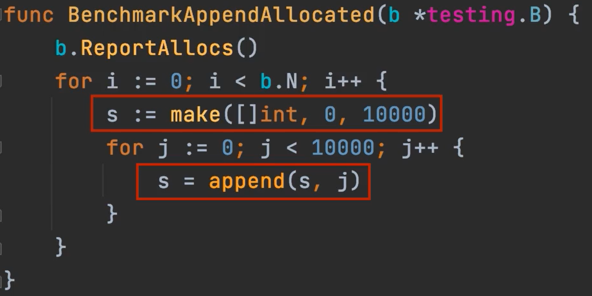

# Slice 扩容机制 副本

## Slice的长度和容量是多少？
### 问题
`var s[]int` - > 0，0

`s = append(s ,0)` -> 1, 1

`s = append(s ,1)`-> 2, 2

`s = append(s ,2)`-> 3, 4

```go
for i := 3; i < 1025 ; i++{
	s = append(s, i)
}
//len : 3+1022 = 1025
//cap :1028
```

### growslice


当cap<1024的时候，每次都是乘以2，当cap>1024的时候，每次乘以1.25。


`s = append(s,0,1,2,3) ` -> 3,3 在这种append下，go做了内存优化。

## append slice 的三种方法的对比





性能对比：3>2>1

**预先分配内存可以提高性能**

## <font style="color:rgb(51, 51, 51);">slice 扩容的逻辑</font>
<font style="color:rgb(36, 41, 46);">Go 中切片扩容的策略是这样的：</font>

+ <font style="color:rgb(36, 41, 46);">首先判断，如果新申请容量大于 2 倍的旧容量，最终容量就是新申请的容量</font>
+ <font style="color:rgb(36, 41, 46);">否则判断，如果旧切片的长度小于 1024，则最终容量就是旧容量的两倍</font>
+ <font style="color:rgb(36, 41, 46);">否则判断，如果旧切片长度大于等于 1024，则最终容量从旧容量开始循环增加原来的 1/4, 直到最终容量大于等于新申请的容量</font>
+ <font style="color:rgb(36, 41, 46);">如果最终容量计算值溢出，则最终容量就是新申请容量</font>

```go
func main(){
    var s []int
    for i := 0; i<3; i++{
        s = append(s,i)
    } 
    moditySlice(s)
    fmt.Println(s)
}
func moditySlice(s []int){
    s[0] = 1024
}
//结果是1024 1 2 
```

```go
func main(){
    var s []int
    for i := 0; i<3; i++{
        s = append(s,i)
    } 
    moditySlice(s)
    fmt.Println(s)
}
func moditySlice(s []int){
    s = append(s,1024) 
    s[0] = 1024
}
//结果是 1024 1 2 
//原因是 s 在追加的时候没有发生扩容，所以 s[0] 进行修改的时候，修改的仍然是之前的 s.
```

```go
func main(){
    var s []int
    for i := 0; i<3; i++{
        s = append(s,i)
    } //cap = 4
    moditySlice(s)
    fmt.Println(s)
}
func moditySlice(s []int){
    s = append(s,2048) 
    s = append(s,4096) //这时候发生了扩容，这里面的s就和外面的s不一样了,存储空间发生了改变
    s[0] = 1024
}
// 结果是 0 1 2
```

```go
func main(){
    var s []int
    for i := 0; i<3; i++{
        s = append(s,i)
    } //cap = 4
    moditySlice(s)
    fmt.Println(s)
}
func moditySlice(s []int){
    s[0] = 1024
    s = append(s,2048) 
    s = append(s,4096) 
}
// 结果是1024 1 2
```

**总结： 没有发生扩容，那么修改就在原来的内存中，如果发生了扩容，就修改在新的内存中。**

```go
func main(){
    var s[]int 
    b,_ := json.Marshal(s)
    fmt.Println(string(b))
}
//输出nil
```

```go
func main(){
    s := []int{}
    b,_ := json.Marshal(s)
    fmt.Println(string(b))
}
//输出 【】
```

**总结：**

**使用**`**[]Type{}**`**和**`**make[Type]**`**初始化的时候**`**slice**`**不为**`**nil**`**。**

**使用**`**var x[]Type**`**后，**`**slice**`**为**`**nil**`**。**

## <font style="color:rgb(51, 51, 51);">Bounds Check Elimination 编译优化技巧</font>


先访问一下s[3]元素，编译器就确定了，一定存在3号元素，就避免编译器重复检查了。

如果能确定访问到的slice长度，可以先执行一次让编译器去做优化。


> 更新: 2022-10-13 14:19:53  
> 原文: <https://www.yuque.com/xiaoshan_wgo/codingnotes/mfohc3>