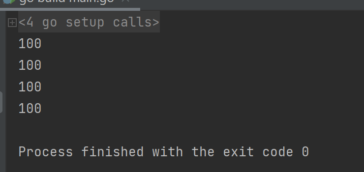
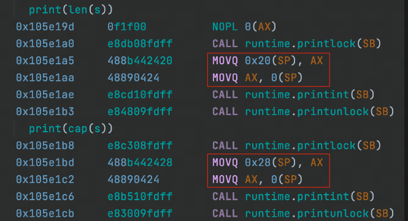

# Slice 的底层结构 副本

## Slice和Array对比
slice： 

```go
var s []int
s := make([]int,len,cap)
```

array：

```go
var a [length] int
```

对比一下切片和数组的定义方式，很明显可以看出，array在定义的过程中指定了`length`长度，而slice并没有。这说明，slice是可以动态的进行扩容和缩容。

## Slice细节
slice 的结构体定义:

```go
type slice struct{
    array unsafe.Pointer
    len int //长度
    cap int //容量
}
```

来看以下程序：

```go
package main
func printSlice(s []int){
    print(len(s))
    print(cap(s))
}
func printArray(a [100]int){
    print(len{a})
    print(cap(a))
}
func main(){
    s := make([]int,100)
    printSlice(s)
    var a[100]int
    printArray(a)
}

```

运行结果：




我们可以通过查看汇编代码的方式来该段代码的内容。

[取得Go的汇编代码的方法](https://colobu.com/2018/12/29/get-assembly-output-for-go-programs/)

## PrintSlice函数


当我们看到类似红框中的一个数字后面跟着一个括号，括号里面是一个寄存器，这里只需要知道这是去内存地址中取值了就可以，其他的就当作英语的本意看就可以了。

第一行代码，就是从内存地址中取出来一个值，挪到了新的函数栈上，并且调用了printint方法。这时候，就可以看出来，针对Slice来说，它的长度以及它的容量其实是一个变量。

## PrintArray函数


查看红框中的部分，和Slice红框中对比，他变成了0x64，0x64是汇编语言中的常量，翻译成十进制就是100。实际上这行代码的意思就是，把一个常量move到了一个函数调用栈上面。所以针对array来说，这个长度在定义了之后是不可以改变的。


## Slice和Array在函数传参上的区别


红框部分可以注意到，这两句就是指向array的porinter 放到了栈上实际上在函数传参的时候，slice传的是它底层的结构体。


duffcooy从内存中copy->值传递


如果在go里面传递数组会怎么样呢？

写了两个benchmark：


```go
func callSlice(s []int){
}
func BenchmarkCallSlice(b *testing.B){
    s := make([]int,10000)
        for i := 0;i < b.N; i++{
            callSlice(s)
        }
}
```

```go
func callArray(a [10000]int){
}
func BenchmarkCallSlice(b *testing.B){
	var a [10000]int
        for i : =0;i < b.N; i++{
            callArray(a)
        }
}
```


结论：传递数组的开销太大


面试题： [为什么go中会有数组?](https://www.mianshigee.com/question/128686pjm/)


**<font style="color:rgb(33, 37, 41);">1.</font>**<font style="color:rgb(33, 37, 41);"> 具有可比性意味着</font>**<font style="color:rgb(33, 37, 41);">您可以将数组用作地图中的键</font>**<font style="color:rgb(33, 37, 41);">，但不能</font>**<font style="color:rgb(33, 37, 41);">用作</font>**<font style="color:rgb(33, 37, 41);">切片。</font>[常见问题解答：为什么地图不允许切片作为键？](https://golang.org/doc/faq#map_keys)


**<font style="color:rgb(33, 37, 41);">2.</font>**<font style="color:rgb(33, 37, 41);"> </font>**<font style="color:rgb(33, 37, 41);">数组可以提供更高的编译时安全性。</font>**

**<font style="color:rgb(33, 37, 41);"></font>**

**<font style="color:rgb(33, 37, 41);">3.</font>**<font style="color:rgb(33, 37, 41);"> 同样， </font>**<font style="color:rgb(33, 37, 41);">传递或分配数组值也将隐式创建</font>**<font style="color:rgb(33, 37, 41);"> 整个数组 </font>**<font style="color:rgb(33, 37, 41);">的副本</font>**<font style="color:rgb(33, 37, 41);"> ，因此它将与原始值“分离”。如果您传递一个切片，它将仍然仅复制切片</font>_<font style="color:rgb(33, 37, 41);">标头</font>_<font style="color:rgb(33, 37, 41);">，但切片值（标头）将指向相同的后备数组。这可能是您想要的，也可能不是。如果要从“原始”切片“分离”切片，则必须显式复制内容，例如使用内置</font>[copy()](https://golang.org/pkg/builtin/#copy)<font style="color:rgb(33, 37, 41);">函数复制到新切片。</font>

<font style="color:rgb(33, 37, 41);"></font>

**<font style="color:rgb(33, 37, 41);">4.</font>**<font style="color:rgb(33, 37, 41);"> 同样，由于数组长度是数组类型的一部分，所以 </font>**<font style="color:rgb(33, 37, 41);">长度不同的数组是不同的类型</font>**<font style="color:rgb(33, 37, 41);">。一方面，这可能是“痛苦中的事情”（例如，编写一个带有类型参数的函数</font><font style="color:rgb(232, 62, 140);">[4]int</font><font style="color:rgb(33, 37, 41);">，您不能使用该函数来处理和处理类型数组</font><font style="color:rgb(232, 62, 140);">[5]int</font><font style="color:rgb(33, 37, 41);">），但这也可能是一个优势：可以用于</font>**<font style="color:rgb(33, 37, 41);">显式指定</font>**<font style="color:rgb(33, 37, 41);"> 所需数组 </font>**<font style="color:rgb(33, 37, 41);">的长度</font>**<font style="color:rgb(33, 37, 41);">。例如，您想编写一个使用IPv4地址的函数，可以使用type对其进行建模</font><font style="color:rgb(232, 62, 140);">[4]byte</font><font style="color:rgb(33, 37, 41);">。现在，您有了编译时的保证，即传递给您的函数的值将恰好具有4个字节，不多也不少（无论如何这都是无效的IPv4地址）。</font>

<font style="color:rgb(33, 37, 41);"></font>

**<font style="color:rgb(33, 37, 41);">5.</font>**<font style="color:rgb(33, 37, 41);"> 与之前的内容有关， </font>**<font style="color:rgb(33, 37, 41);">数组长度也可以用于记录目的</font>**<font style="color:rgb(33, 37, 41);">。类型</font><font style="color:rgb(232, 62, 140);">[4]byte</font><font style="color:rgb(33, 37, 41);">正确记录了IPv4有4个字节。一个</font><font style="color:rgb(232, 62, 140);">rgb</font><font style="color:rgb(33, 37, 41);">类型的可变</font><font style="color:rgb(232, 62, 140);">[3]byte</font><font style="color:rgb(33, 37, 41);">告诉有对每个颜色成分1个字节。在某些情况下，甚至可以将其取出并单独记录；例如在</font>[crypto/md5](https://golang.org/pkg/crypto/md5/)<font style="color:rgb(33, 37, 41);">包中：</font>[md5.Sum()](https://golang.org/pkg/crypto/md5/#Sum)<font style="color:rgb(33, 37, 41);">返回类型为的值，</font><font style="color:rgb(232, 62, 140);">[Size]byte</font><font style="color:rgb(33, 37, 41);">其中</font><font style="color:rgb(232, 62, 140);">md5.Size</font><font style="color:rgb(33, 37, 41);">一个常数为</font><font style="color:rgb(232, 62, 140);">16</font><font style="color:rgb(33, 37, 41);">：MD5校验和的长度。</font>

<font style="color:rgb(33, 37, 41);"></font>

**<font style="color:rgb(33, 37, 41);">6.</font>**<font style="color:rgb(33, 37, 41);"> 在 </font>**<font style="color:rgb(33, 37, 41);">计划结构类型的内存布局</font>**<font style="color:rgb(33, 37, 41);">时，它们也非常有用，请参阅此处的JimB答案，以及</font>[更多详细信息和实际示例](https://stackoverflow.com/a/30705048/1705598)<font style="color:rgb(33, 37, 41);">。</font>

<font style="color:rgb(33, 37, 41);"></font>

**<font style="color:rgb(33, 37, 41);">7.</font>**<font style="color:rgb(33, 37, 41);"> 同样，由于切片是标头，并且它们（几乎）总是按原样传递（没有指针）， </font>**<font style="color:rgb(33, 37, 41);">因此语言规范对切片的指针比对数组的指针更具限制性</font>**<font style="color:rgb(33, 37, 41);">。例如，规范提供了多个用于操作数组指针的简写，而在切片时会给出编译时错误（因为很少使用指向切片的指针，如果仍然需要/必须这样做，则必须明确处理。）</font>

<font style="color:rgb(33, 37, 41);">这样的例子是：</font>

+ <font style="color:rgb(33, 37, 41);">分割</font><font style="color:rgb(232, 62, 140);">p</font><font style="color:rgb(33, 37, 41);">指向array：的指针</font><font style="color:rgb(232, 62, 140);">p[low:high]</font><font style="color:rgb(33, 37, 41);">是的简写</font><font style="color:rgb(232, 62, 140);">(*p)[low:high]</font><font style="color:rgb(33, 37, 41);">。如果</font><font style="color:rgb(232, 62, 140);">p</font><font style="color:rgb(33, 37, 41);">是指向slice的指针，则为编译时错误（</font>[规范：slice表达式](https://golang.org/ref/spec#Slice_expressions)<font style="color:rgb(33, 37, 41);">）。</font>
+ <font style="color:rgb(33, 37, 41);">索引</font><font style="color:rgb(232, 62, 140);">p</font><font style="color:rgb(33, 37, 41);">数组指针：</font><font style="color:rgb(232, 62, 140);">p[i]</font><font style="color:rgb(33, 37, 41);">是的简写</font><font style="color:rgb(232, 62, 140);">(*p)[i]</font><font style="color:rgb(33, 37, 41);">。如果</font><font style="color:rgb(232, 62, 140);">p</font><font style="color:rgb(33, 37, 41);">is是指向切片的指针，则这是编译时错误（</font>[规范：Index expressions](https://golang.org/ref/spec#Index_expressions)<font style="color:rgb(33, 37, 41);">）。</font>


**<font style="color:rgb(33, 37, 41);">8.</font>**<font style="color:rgb(33, 37, 41);"> </font>**<font style="color:rgb(33, 37, 41);">访问（单个）数组元素</font>**<font style="color:rgb(33, 37, 41);"> 比访问切片元素 </font>**<font style="color:rgb(33, 37, 41);">更有效</font>**<font style="color:rgb(33, 37, 41);"> ；像分片一样，运行时必须经过隐式指针取消引用。另外， </font>_<font style="color:rgb(33, 37, 41);">“如果表达式的类型是数组或指向数组的指针，则表达式</font>__<font style="color:rgb(232, 62, 140);">len(s)</font>__<font style="color:rgb(33, 37, 41);">和</font>__<font style="color:rgb(232, 62, 140);">cap(s)</font>__<font style="color:rgb(33, 37, 41);">为常量</font>__<font style="color:rgb(232, 62, 140);">s</font>__<font style="color:rgb(33, 37, 41);">”</font>_<font style="color:rgb(33, 37, 41);">。</font>

<font style="color:rgb(33, 37, 41);"></font>

## <font style="color:rgb(33, 37, 41);">总结</font>
<font style="color:rgb(78, 89, 105);">1. Go中只有值传递，指针也是值的一种。</font>

<font style="color:rgb(78, 89, 105);">2. array因为是固定长度，其占用的内存大小编译期就可以确定，因此可以分配到栈上，其通过函数调用传递的时候，是需要复制完整的array的，而slice因为是动态数据结构，只有（pointer,len,cap）这个结构才是固定的，这些在函数传递slice中会被拷贝。 </font>

<font style="color:rgb(78, 89, 105);">3. Go语言汇编可以看到完整函数调用等完整实现细节，其写法类似AT&T风格，传递是从左到右。</font>

<font style="color:rgb(33, 37, 41);"></font>


> 更新: 2022-10-13 14:19:38  
> 原文: <https://www.yuque.com/xiaoshan_wgo/codingnotes/ita7tg>