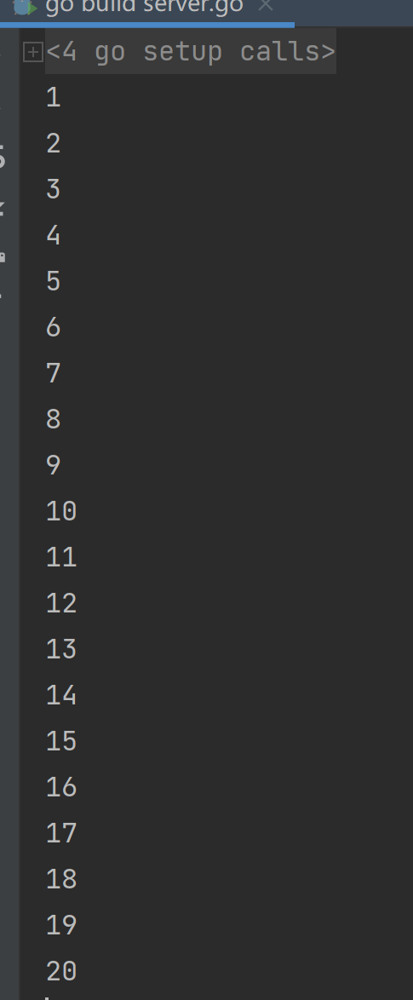

# 两个协程交替打印1到20

# 两个协程交替打印1到20
1. 两个协程交替打印 1- 20

```go
package main

import (
	"fmt"
	"sync"
	"time"
)


func main() {
	wg := &sync.WaitGroup{}
	ch1 := make(chan int)
	ch2 := make(chan int)

	wg.Add(2)
	go say(wg, ch2, ch1)
	go say1(wg, ch1, ch2)
	wg.Wait()
	time.Sleep(1 * time.Second)
}

func say(wg *sync.WaitGroup, ch2 chan int, ch1 chan int) {
	defer wg.Done()
	for i := 1; i <= 10; i++ {
		ch2 <- 2*i - 1
		fmt.Println(<-ch1)
	}
}

func say1(wg *sync.WaitGroup, ch1 chan int, ch2 chan int) {
	defer wg.Done()
	for i := 1; i <= 10; i++ {
		fmt.Println(<-ch2)
		ch1 <- 2 * i
	}
}

```





> 更新: 2022-04-17 12:58:51  
> 原文: <https://www.yuque.com/xiaoshan_wgo/codingnotes/hee8qb>