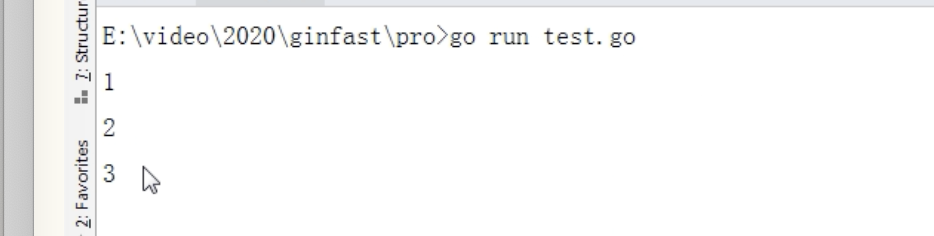
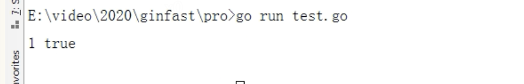
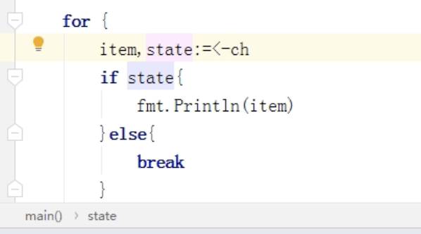

# Channel 相关问题

# 关闭一个已经关闭的 Channel 会发生什么？
题目来源：哔哩哔哩

<font style="color:rgb(18, 18, 18);">关闭已经关闭的 Channel 会发生 panic。</font>

# <font style="color:rgb(0, 0, 0);">Channel 有缓存和没缓存的区别是什么？</font>
题目来源：哔哩哔哩

无缓冲的与有缓冲 channel 有着重大差别，那就是一个是同步的 一个是非同步的。

比如：

```go
c1:=make(chan int)        //无缓冲
c2:=make(chan int,1)      //有缓冲
c1<-1
```

**无缓冲**： 不仅仅是向 c1 通道放 1，而是一直要等有别的携程 <-c1 接手了这个参数，那么 c1<-1 才会继续下去，要不然就一直阻塞着。

**有缓冲**： c2<-1 则不会阻塞，因为缓冲大小是 1 （其实是缓冲大小为 0 )，只有当放第二个值的时候，第一个还没被人拿走，这时候才会阻塞。

# 读写关闭的 Channel 是什么后果
自己简单的尝试了一下：

```go
func main(){
    ch := make(chan int,3)
    ch <- 2
    ch <- 3
    close(ch)
    for item:=range ch{
    	fmt.Println(item)
    }
}
```



是可以正常读取出来的，而且不会造成死锁。

```go
func main(){
    ch := make(chan int,3)
    ch <- 2
    ch <- 3
    close(ch)	
    item,state := <-ch
    fmt.Println(item,state)

}
```



关闭了之后读完了，也不会报错：

只不过后面读取的数继续读取的返回的state是false。

回答：如果channel 有元素还未读到，则会正确读到chan内的值，哪怕已经关闭了。写的话，就会Panic。

# Channel 的使用场景
+ **数据交流**：当作并发的 buffer 或者 queue，解决生产者 - 消费者问题。多个 goroutine 可以并发当作生产者（Producer）和消费者（Consumer）。
+ **数据传递**：一个goroutine将数据交给另一个goroutine，相当于把数据的拥有权托付出去。
+ **信号通知**：一个goroutine可以将信号(closing，closed，data ready等)传递给另一个或者另一组goroutine。
+ **任务编排**：可以让一组goroutine按照一定的顺序并发或者串行的执行，这就是编排功能。
+ **锁机制**：利用channel实现互斥机制。


> 更新: 2022-11-14 00:49:13  
> 原文: <https://www.yuque.com/xiaoshan_wgo/codingnotes/bnpux5>