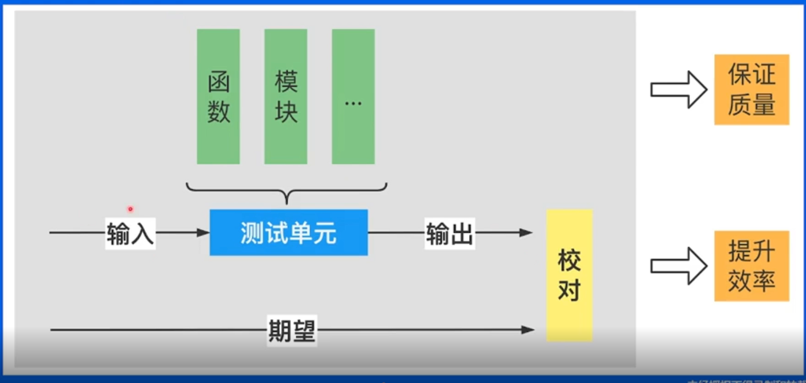

# 青训营课程笔记

# 2022/5/7 Go 基础语法
## 基础语法
## 案例练习
### 猜谜游戏 - 生成随机数
```go
package main
import (
    "fmt"
    "math/rand"
)
func main(){
    maxNum := 100
    secretNumber := rand.Intn(maxNum)
    fmt.Println("The secret number is "，secretNumber)
}
```

直接用 `rand.Intn`是随机生成一个随机数。

想要每次生成不同随机数，需要引入时间戳。

```go
package main
import (
    "fmt"
    "math/rand"
)
func main(){
    maxNum := 100
    rand.Seed(time.Now().UnixNano()) //给随机数引入时间戳
    secreNumber := rand.Intn(maxNum) 
    fmt.Println("The secret number is "，secretNumber)
}
```

在 `rand.Intn()`之前加一条语句：`rand.Seed(time.Now().UnixNano())`。

生成随机数之后，要读取用户输入。

可以采用 bufio 和 scan 的方式读取。

# 2022/6/5 工程实践
## 并发编程
### Goroutine
Go开启携程

### CSP
通过通信共享内存

### Chanel
make()关键字创建

分为有缓冲和无缓冲通道

有缓冲的可以解决生产者和消费者的不均衡的效率问题

### 并发安全
用锁来保证并发安全问题

`lock sync.Mutex`

定义个 lock ，lock.Lock()加锁，lock.Unlock()

### WaitGroup
wg.Add +1

wg.Done -1

## 依赖管理
### GoPath
### Go vendor
### Go mod
## 测试
### 单元测试


+ 所有测试文件以_test.go 结尾
+ func TestXxx(*testing.T)
+ 初始化逻放到 TestMain 中

测试覆盖率 -- cover


> 更新: 2022-06-05 15:16:12  
> 原文: <https://www.yuque.com/xiaoshan_wgo/codingnotes/ghv3dz>