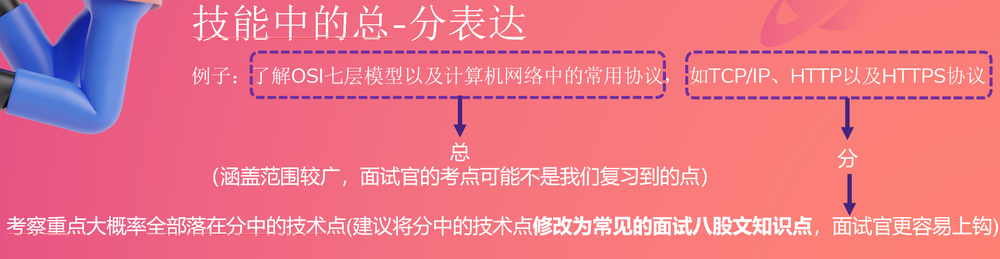
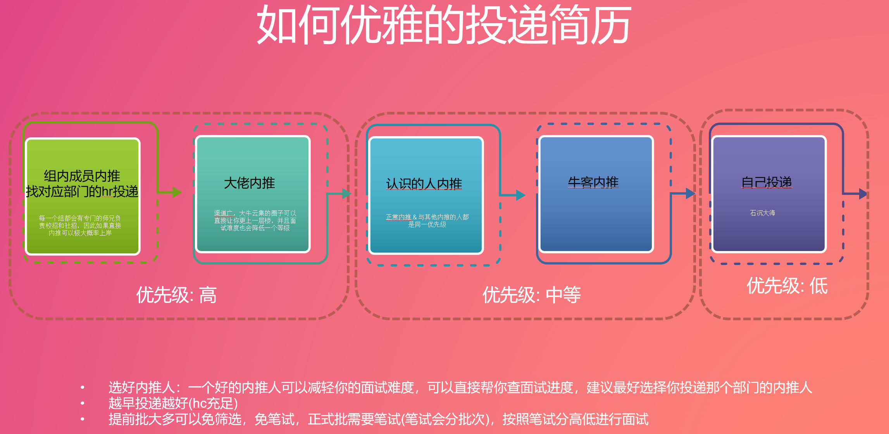
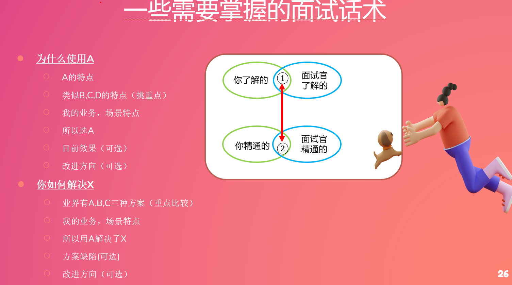
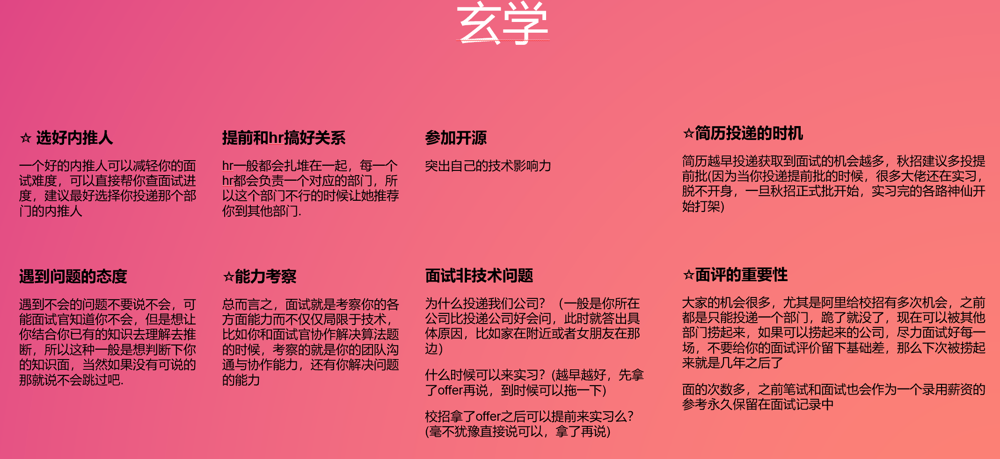
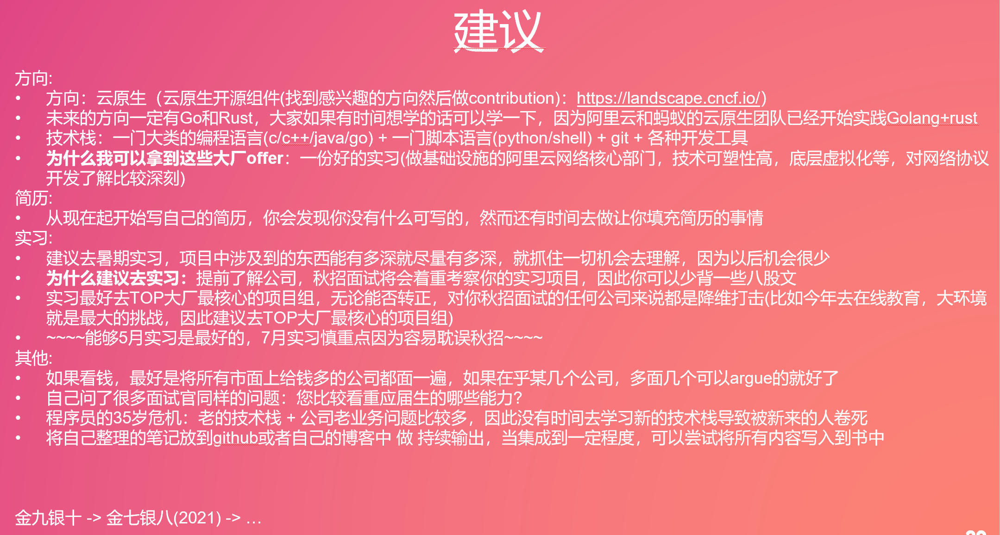
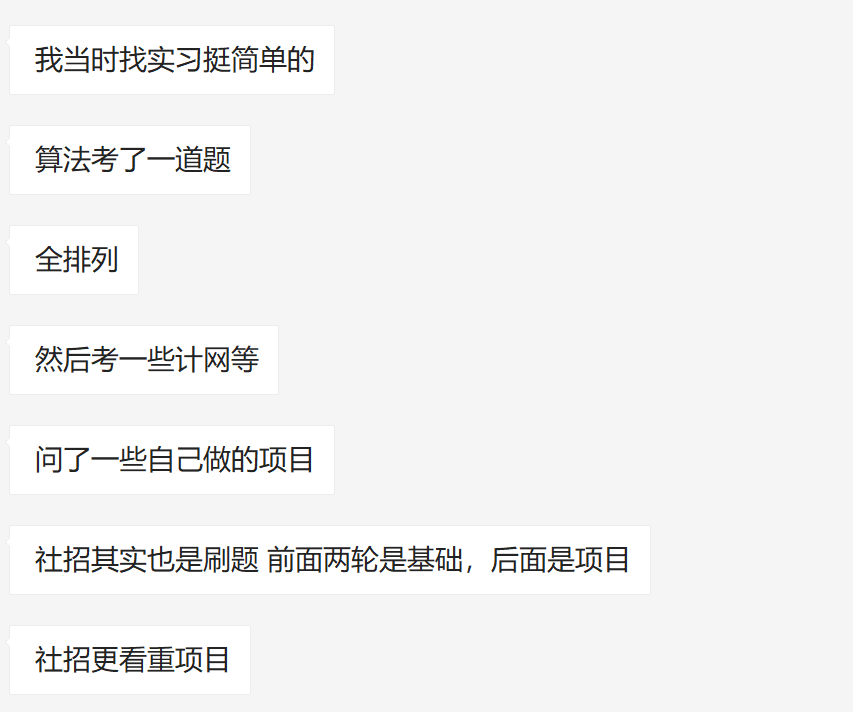

# 📖 过来人的经验贴

## 经验1 方学长22届 - 公务员

## 经验2 Sivan CCNU计算机系  - 腾讯后端

1. 自我介绍(☆提前准备好自我介绍，1-2分钟左右，背诵好，不要给自己埋坑)
2. 追着自我介绍的点问 / 挑简历上的点问 / 说一下最有挑战的项目 (有时候一上来就让你写几道算法题压压惊，这种一般是压力面，看下你在高压下的表现)  
如果是前面一到两面：着重于基础，因此会从你的技能介绍或者项目中发掘一些基础知识来问  
后面的面试：着重于项目在实践中会面临问题的发掘(大多是中间件，分布式或者架构相关) 和解决问题的能力
3. 写算法题  
一般一场面试1个小时，看一下自己还剩余多少时间，尽可能在剩余时间之内提交  
有时候算法题目的业务背景比较复杂，因此不确定的时候一定要问面试官  
确定了思路之后要和面试官解释，避免思路错误写代码浪费太长时间
4. 你还有什么要问我的么？  
最直接：您对我这场面试的表现怎么评价？(间接：您觉得我在您面试过的应届生中表现怎样)  
您最看重应届生的哪方面能力呢？  
部门的技术栈是怎样的呢？/ 部门主要负责哪一块业务呢？

[自己看的所有面经都整理到了如下的两个链接中，欢迎大家](https://github.com/AobingJava/JavaFamily)[pr](https://github.com/AobingJava/JavaFamily)[，一起贡献一份完整的八股文](https://github.com/AobingJava/JavaFamily)

[http://www.sivan.tech/AlgoBook/](https://github.com/AobingJava/JavaFamily)              [->](https://github.com/AobingJava/JavaFamily)   [https://github.com/sivanWu0222/AlgoBook](https://github.com/AobingJava/JavaFamily)

[http://www.sivan.tech/BasicCompu/#/](https://github.com/AobingJava/JavaFamily)      [->](https://github.com/AobingJava/JavaFamily)   [https://github.com/sivanWu0222/BasicCompu](https://github.com/AobingJava/JavaFamily)

**捷径:**  
刷好算法  
多看&认真看面经  
背好八股文  
写好简历  
做好自我介绍  
放松心态，轻松应付面试  
以上目前还是适用的，如果岗位比较卷的建议提前准备

[复习知识汇总：](https://github.com/AobingJava/JavaFamily)

•[https://github.com/AobingJava/JavaFamily](https://github.com/AobingJava/JavaFamily)

•[https://github.com/yangshun/tech-interview-handbook](https://github.com/yangshun/tech-interview-handbook)

•[https://github.com/](https://github.com/Snailclimb/JavaGuide)[Snailclimb/JavaGuide](https://github.com/Snailclimb/JavaGuide)

•[https://github.com/frank-lam/fullstack-tutorial](https://github.com/frank-lam/fullstack-tutorial)

•[https://github.com/CyC2018/CS-Notes](https://github.com/CyC2018/CS-Notes)

算法方面：

•[https://github.com/halfrost/LeetCode-Go](https://github.com/halfrost/LeetCode-Go)

•[https://github.com/labuladong/fucking-algorithm](https://github.com/labuladong/fucking-algorithm)

•[https://github.com/afatcoder/LeetcodeTop](https://github.com/afatcoder/LeetcodeTop)

•[https://github.com/yuanguangxin/LeetCode](https://github.com/yuanguangxin/LeetCode)

•Algorithm：多刷高频题 +[https://github.com/labuladong/fucking-algorithm](https://github.com/labuladong/fucking-algorithm)

各方向八股文：

•话术+八股文：[https://github.com/flycash/interview-baguwen](https://github.com/flycash/interview-baguwen)

•前端零基础学习：[https://learn.freecodecamp.one/](https://learn.freecodecamp.one/)+[https://www.freecodecamp.org/](https://www.freecodecamp.org/)

•[https://github.com/acm-clan/algorithm-stone](https://github.com/acm-clan/algorithm-stone)

•[https://github.com/sladesha/Reflection_Summary](https://github.com/sladesha/Reflection_Summary)

•[https://](https://github.com/guanguans/design-patterns-for-humans-cn)[github.com/guanguans/design-patterns-for-humans-cn](https://github.com/guanguans/design-patterns-for-humans-cn)

•前端面试库：[https://](https://github.com/hzfe/awesome-interview)[github.com/hzfe/awesome-interview](https://github.com/hzfe/awesome-interview)

•Resume：[https://github.com/resumejob/awesome-resume](https://github.com/resumejob/awesome-resume)

•[https://www.bilibili.com/video/BV1E7411q7rU?spm_id_from=333.999.0.0](https://www.bilibili.com/video/BV1E7411q7rU?spm_id_from=333.999.0.0)

•[https://www.bilibili.com/video/BV1C7411j74Z?spm_id_from=333.999.0.0](https://www.bilibili.com/video/BV1C7411j74Z?spm_id_from=333.999.0.0)

•[https://blog.cugxuan.cn/2021/01/06/Campus/guide-capmus-v2/](https://blog.cugxuan.cn/2021/01/06/Campus/guide-capmus-v2/)

•各行业独角兽：[https://mp.weixin.qq.com/s/fqHzgbFdJAHjWchNnhRoYA](https://mp.weixin.qq.com/s/fqHzgbFdJAHjWchNnhRoYA)

•955 公司列表：[https://github.com/formulahendry/955.WLB](https://github.com/formulahendry/955.WLB)

•微软面试流程：[https://zhuanlan.zhihu.com/p/403207317](https://zhuanlan.zhihu.com/p/403207317)

•[https://mp.weixin.qq.com/s/zRbalzF8lM5USJ99hiLpnQ](https://mp.weixin.qq.com/s/zRbalzF8lM5USJ99hiLpnQ)

## 经验3  萌一 - 蚂蚁集团CTO线金融核心算法部门

面试时候要录音回放复盘

刷面经查缺补漏

最好简历上不要有不会的盲点

你有三个问题待解决：

1. 是算法熟练度不够。那些常见高频面试题还是要很熟的，最好简单题都能百分百的手写对；
2. 面试紧张。有两个方式解决，第一个是多面，找一些小公司多面面，足够自信就不紧张了，第二个办法是对方想象成和你一起探讨技术的朋友，你们只是在一起探讨探讨技术，这样可以从心理上解决面试紧张的问题； 
3. 存在知识盲区，常见八股文的面试题要很熟才行，起码要知道 mysql redis Kafka 和一些分布式理论等。
4. 其他方面：每一次面试最好都录音，面试完都复盘，总有表达不好的地方，争取改掉，下次面试不要再犯，而且对于面试中不会的及时查漏补缺，多面几次就是面霸了。

## 简历与公司相关

好的简历是什么样的?

一句话，向面试官展示你的技术。

如何展示呢？

比如说技术能力，你写熟悉MySQL，就不如写熟悉MySQL的索引，SQL优化，innodb数据结构等更让面试官能清晰的感受到你的能力。

熟悉Redis，可以换为熟悉Redis的八种数据类型，持久化原理，哨兵模式，集群模式。

你看，这样写面试官一看这个简历，就会觉得非常满意，第一印象就会变好，他能明确的感受到你的技能水平。

那么项目经验如何写?

当然项目的基本介绍，功能还是要有，但是项目其中的技术亮点，技术难点你需要给面试官展示出来，比如说用队列解决了什么问题，用线程池解决了什么问题，项目的量级（qps，tps等），数据库读写分离，分库分表如何做的。

因为面试官其实不一定懂你的项目，他其实也不是特别关心（除非招行业技术人才），他关心的是项目中用到的技术，架构，量级，遇到问题如何解决的，业务方案，思考问题的能力。

这些也是你应该向面试官展示的。

当然如果有开源项目或者参与了开源项目，博客等软实力也可以写上去，作为加分项。

最后，简历第一页，一定要展示面试官感兴趣的内容，不要让性别，学校，照片等占用大量的篇幅（这些可能是人事关心的，但是决定是否面试是技术面试官决定的）。

---

问什么样的问题？和公司业务、简历是否有描述、面试官个人倾向有关系，  
比如一个做加密的公司，肯定会问https；简历上写熟练使用linux命令，大概率会问linux常用命令，怎么排查问题等；面试官从简历中找不到可以问的，就会问自己熟悉的方向。

所以给大家2点建议：

1.  写简历的时候，专业技能写得根据具体一些，一方面可以引导面试官提问，另外一方面因为是自己熟悉的部分，也不会太吃亏。具体简历怎么写参考群公告学习资料中的简历示例 

2.  不管面试的时候问不问，围绕go的知识体系（基础知识 + go领域知识 + 工具技能），基本的问题还是要掌握的。 

---

岗位的“人才画像”，进而根据“画像”设计岗位JD，招揽人才。

人才画像怎么来呢？

首先，从公司战略规划和业务流，推导出所要招聘的岗位。

根据该岗位要完成的工作和结果产出，设计出绩效考核的标准。（想拿到什么结果，就考核什么）。

用考核标准，来框定岗位需要的能力和技能。

根据能力、技能和价值观的需求，就得出该岗位的人才画像。

同样，作为候选人求职时，就要侧重看到对方核心的考察点在哪几个板块，考核标准是否清晰，以及这些板块在公司战略和业务流中扮演的角色和分量有多重，后面的规划发展如何。

## 迷悟 - 面试指点
Go是如何实现锁的？

HTTPs没有讲明白，

Docker和K8S不够了解。

## 码神之路 - 面试指点

## 线上面试邀约
是这样的，学校处于封校状态，没有确定实习和特殊情况导师是不允许批假外出的，所以考虑疫情情况，这次面试能否改成线上面试呢。

## 话术
:::success
首先，我想和各位强调：你在和面试官交流时需要注意，不要只说一个答案就不再说话了；也不要猜测答案去看面试官的面部反应。务必在交流的过程中把你的思路说出来，即使答案出现了偏差，面试官也会适当地提醒你需要注意什么地方。

其次，当你在和别人交流时，一定要清晰、明确地把你的想法阐述/表达出来。有些同学知道正确答案，但叙述的时候不清晰、解释不清楚，听者领悟不到你的意思，那真的太可惜了，另外这样的沟通会让双方都感到不顺畅。可以和团队里的小伙伴们来个互问互答，或是模拟一场面试，锻炼能力，这些都是能帮助大家提高沟通技巧的小Tips。

:::

## 项目如何描述
+ 项目大体介绍：可以吹这个项目牛的地方，比如我做的这个博客，可以登录注册，可以评论，可以点赞……
+ 描述自己负责的事情：我做了点赞体系/搜索体系/ES的搭建（用于引导面试官询问。）
+ 描述用到的的技术：我用了redis分布式集群，分库分表……（引导面试官询问。）

> 更新: 2022-08-31 13:25:32  
> 原文: <https://www.yuque.com/xiaoshan_wgo/codingnotes/vlqfox>