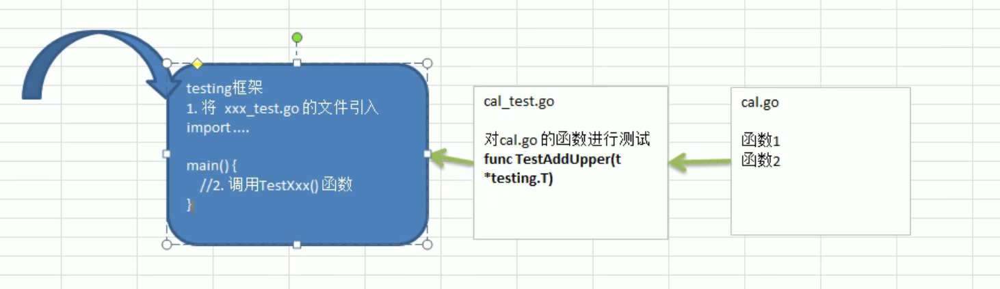

# 10 单元测试

## 需求场景
假设有一个很复杂的函数，怎样确认它的运行结果是正确的？

在工作中，我们需要去确认一个函数或者一个模块的结果是否正确，如:

```go
func addUpper(){……}
```

### 传统方法来解决
传统的方式来进行测试：

在main函数中，调用addUpper函数，看看实际的输出结果是否和预期的结果一致，如果一致，则说明函数正确，否则函数有错误，然后修改错误。

```go
func main(){
    res := addUpper(10)
    if res != 55{
        fmt.Printf("错误")
    }else{
    	fmt.Printf("正确")
    }
}
```

传统方法的缺点：

（1）不方便，我们需要在主函数中去调用这样就需要去修改主函数，如果项目正在运行就更加麻烦，可能就去停止项目。

（2）不利于管理，因为当我们测试多个函数或者多个模块时候，都需要写在main函数，不利于管理哦我们的思路。

（3）所有引出了单元测试，->testing测试框架，可以很好的解决问题。

## 单元测试
Go语言中自带有一个轻量级的测试框架testing和自带的go test命令来实现单元测试和性能测试，testing框架和其他语言的测试框架类似，可以基于这该框架写针对相应函数的**测试用例**，也可以基于该框架写相应的压力测试用例。通过单元测试，可以解决如下的问题：

（1）确保每个函数时是可运行的，并且运行结果是正确的；

（2）确保写出来的代码性能是好的；

（3）单元测试能及时的发现程序设计和实现的逻辑错误，使问题及早暴露，便于问题的定位解决，而性能测试的重点在于发现程序设计上的一些问题，让程序能够在高并发的情况下还能保持稳定。

我们先写一个简单的累加器函数：

```go
package main

func AddUpper(n int) int{
	res := 0
	for i := 0;i <= n-1;i++{
		res += i
	}
	return res
}
```

在同目录下，新建一个test.go文件

```go
package main

import (
	_ "fmt"
	"testing"
)

func main() {

}
//编写要给测试用例，去测试函数是否正确
func TestAddUpper(t *testing.T){
	res := AddUpper(10)
	if res != 55 {
		//fmt.Println("AddUpper(10)执行错误，期望值=%v 实际值=%v\n")
		t.Fatalf("AddUpper(10)执行错误，期望值=%v 实际值=%v\n", 55, res)
	}
	t.Logf("Addupper(10)执行正确")

}
```

底层原理：



## 细节说明
（1）测试用例的文件名必须以`_test.go`结尾；

（2）测试用例的函数必须以Test开头，一般来说是Test+被测试的函数名，比如`TestAddUpper`;

（3）TestAddUpper(t *testing.T)的形参类型必须是*testing.T【手册中规定的】

（4）一个测试用例文件中，可以有多个测试用例函数，比如TestAddUpper、TestSub；

（5）运行测试用例指令：`cmd>go test`如果运行正确，无日志，错误时，会输出日志

`cmd>go test -v `运行正确或是错误，都会输出日志

（6）当出现错误时，可以使用t.Fatalf来格式化输出错误信息，并退出程序；

（7）t.Logf方法可以输出相应的日志；

（8）测试用例函数，并没有放在main包中，也执行了，这就是测试用例的方便之处；

（9）PASS表示测试用例运行成功，FAIL表示测试用例运行失败。

（10）测试单个文件，一定要带上被测试的源文件 `go test -v cal_test.go cal.go`

（11）测试单个方法，`go test -v -test.run testAddUpper`


## 案例练习


考察知识点：

结构体，方法，序列化，文件，反序列化，单元测试。


```go

```


> 更新: 2021-12-18 09:30:19  
> 原文: <https://www.yuque.com/xiaoshan_wgo/codingnotes/idfz9s>