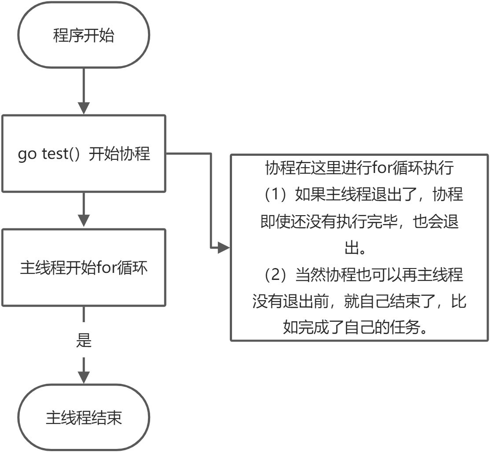
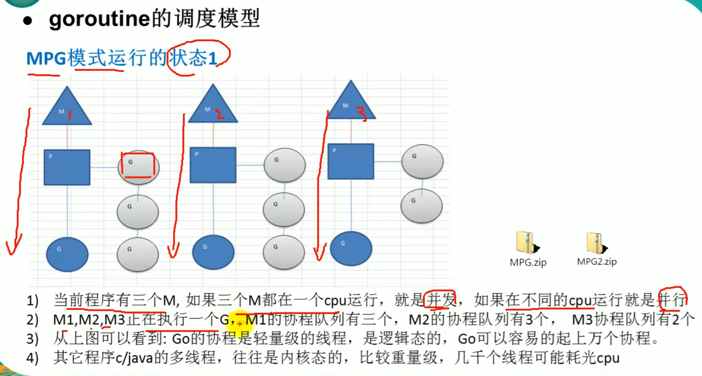
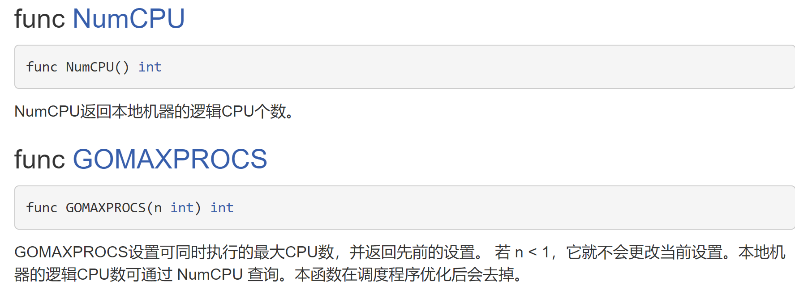

# 11 Goroutine 协程和调度模型

## 主程序和协程的执行流程
有一个程序，在主线程（进程）中开启一个goroutine，该协程每隔1秒输出"hello,world"，在主线程中也每隔1秒钟输出"hello,world"。输出10次之后退出程序。要求主线程和goroutine同时执行。

```go
func test(){
    for i := 1;i <= 10; i++{
        fmt.Println("test () hello world" + strconv.Itoa(i))
        time.Sleep(time.Second) //休息一秒
    }
}
func main(){
    go test()
    for i := 1; i<=10 ; i++{
        fmt.Println(" main() hello,golang" + strconv.Itoa(i))
        time.Sleep(time.Second)
    }
}
```

结果显示:

可以发现是主函数一次，test函数一次，交叉执行。

mian 1

test 1

main 2

test 2

main 3

test 3

...





> **主线程是一个物理线程，是直接作用在CPU上面的，是重量级的，非常耗费CPU资源，协程从主线程开始的，是轻量级的线程，处于逻辑态，对资源的消耗相对小，Golang的协程机制是重要的特点，可以轻松的开启上万个协程，其他编程语言的并发机制是一般基于线程的，开启过多的线程，那么资源的消耗会非常大，所以Golang在并发上相比于其他的语言具有巨大的优势。**
>

Go协程和Go主线程的简单案例分析:

```go
package main

import "fmt"

func main() {
	for i := 0; i<10;i++ {
		go func(i int){
			for{
				fmt.Printf("Hello from"+
					"goroutine %d\n",i)
			}
		}(i)
	}
}

```

来看这一串代码，结果什么都没显示就退出了。

原因是:

并发执行main 和 for func并发执行 还没来得及打印东西，main就退出了。

应该在main函数的末尾加上`time.Sleep(time.Millisecond)`

```go
package main

import (
	"fmt"
	"time"
)

func main() {
	for i := 0; i < 1000; i++ {
		go func(i int){
			for{
				fmt.Printf("Hello from"+
					"goroutine %d\n",i)
			}
		}(i)
	}
	time.Sleep(time.Millisecond)
}

```

总结，**协程**就是：

+ 轻量级“线程”
+ <font style="color:#E8323C;">非抢占式</font>多任务处理，由协程主动交出控制权
+ 解释器/编译器/虚拟机层面的多任务
+ 多个协程可能在一个或者多个线程上运行

## <font style="color:rgb(51,51,51);">goroutine与线程的区别</font>
**<font style="color:rgb(51,51,51);">1、使用方面： </font>**

<font style="color:rgb(51,51,51);">（1）goroutine比线程更加轻量级，可以轻松创建十万、百万，不用担心资源问题</font>

<font style="color:rgb(51,51,51);">（2）goroutine与channel搭配使用，能够更加方便的实现高并发</font>

**<font style="color:rgb(51,51,51);">2、实现方面： </font>**

<font style="color:rgb(51,51,51);">（1）从资源上讲</font>

<font style="color:rgb(51,51,51);">1. 线程栈的内存大小一般固定为2MB </font>

<font style="color:rgb(51,51,51);">2. goroutine栈内存是可变的，初始的时候一般为2KB，最大可以扩大到1GB </font>

<font style="color:rgb(51,51,51);">（2）从调度上讲</font>

<font style="color:rgb(51,51,51);">1. 线程的调度由操作系统的内核完成</font>

<font style="color:rgb(51,51,51);">2. goroutine调度由自身的调度器完成</font>

**<font style="color:rgb(51,51,51);">3、goroutine与线程的联系： </font>**

<font style="color:rgb(51,51,51);">（1）多个goroutine绑定在同一个线程上面，按照一定的调度算法执行 </font>

## <font style="color:rgb(51,51,51);">goroutine调度模型MPG</font>
**<font style="color:rgb(51,51,51);">1</font>****<font style="color:rgb(51,51,51);">、</font>****<font style="color:rgb(51,51,51);">M </font>**

<font style="color:rgb(51,51,51);">代表一个在操作系统的主线程，所有的G(goroutine)任务最终都会在M上执行</font>

**<font style="color:rgb(51,51,51);">2</font>****<font style="color:rgb(51,51,51);">、</font>****<font style="color:rgb(51,51,51);">P</font>****<font style="color:rgb(51,51,51);">（</font>****<font style="color:rgb(51,51,51);">Processor</font>****<font style="color:rgb(51,51,51);">）</font>**

<font style="color:rgb(51,51,51);">是协程的上下文环境，所谓的上下文环境指的就是当时运行过程中的操作系统的一个状态，指代了当时环境中所存在的资源条件。</font>**<font style="color:rgb(51,51,51);">P可以根据实际情况开启协程去工作</font>**<font style="color:rgb(51,51,51);">。</font>

+ <font style="color:rgb(51,51,51);">代表⼀个处理器，每个运行的M都必须绑定⼀个P。P的个数是GOMAXPOCS，最大为256，在程序启动时固定，一般不去修改。</font>
+ <font style="color:rgb(51,51,51);">GOMAXPOCS默认值是当前电脑的核心数，单核CPU就只能设置为1，如果设置>1，在GOMAXPOCS函数中也会被修改为1。</font>
+ <font style="color:rgb(51,51,51);"> M和P的个数不一定一样多，M>=P，每⼀个P都会保存本地的G任务队列，另外还有一个全局的G任务队列。G任务队列可以认为线程池中的线程队列。 </font>

**<font style="color:rgb(51,51,51);">3、G（Goroutine）</font>**

+ <font style="color:rgb(51,51,51);">代表⼀个goroutine协程对象，每次go调用的时候都会创建⼀个G对象</font>

<font style="color:rgb(51,51,51);"></font>




简单理解就是：假设有个厨子在炒菜，A先要了一百个菜，但是B和C只点了一个小炒菜。这时候当A的菜在煲汤的时候，厨子就可以先去把B和C的菜炒了，这样就能防止阻塞。

## 设置运行的CPU数


```go
package main
import "runtime"
func main(){
    cpuNum := runtime.NumCPU()
    runtime.GOMAXPROCS(cpuNum-1)//预留一个CPU
}
```

## 案例分析
```go
package main

import (
	"fmt"
	"time"
)

func main() {
	for i := 0; i < 10; i++ {
		go func(i int){ //匿名函数开启协程，把外面的参数i传进去打印
			for{
                fmt.Printf("Hello from goroutine %d\n",i)//交不出控制权，就死在了里面
			}
		}(i)
	}
	//time.Sleep(time.Millisecond)
}

```

如果没有加 `go func` 的 `go` 就会一直打印 `Hello from goroutine 0`。加了之后，就就什么都不会打印就直接退出来，`main`和`go func`并发执行，还来不及`print`，主函数的`i`到`10`就执行完了。这时候，我们需要取消`time.Sleep(time.Millisecond)`的注释，这样就能保证，每次`i++`的时候，可以`print hello`。

上面的打印是IO操作，是交出来控制权的。但是下面的这个代码并没有。

```go
package main

import (
	"fmt"
	"time"
)

func main() {
	var a [10]int
	for i := 0; i < 10;i++ {
		go func(i int){ //匿名函数开启协程
			for{
				a[i]++//交不出控制权，就死在了里面
			}
		}(i)
	}
	time.Sleep(time.Millisecond)
	fmt.Println(a)
}

```

在这种情况下运行，会占满CPU。

可以在后面加上`runtime.Gosched()`

```go
package main

import (
	"fmt"
	"runtime"
	"time"
)

func main() {
	var a [10]int
	for i := 0; i < 10;i++ {
		go func(i int){
			for{
				a[i]++
				runtime.Gosched() //手动交出控制权
			}
		}(i)//这说明了匿名函数里面的i是取自外面for循环里面的i
	}
	time.Sleep(time.Millisecond)
	fmt.Println(a)
}

```

取消`i`的传参，看看会发生什么事情。

```go
package main

import (
	"fmt"
	"runtime"
	"time"
)

func main() {
	var a [10]int
	for i := 0; i < 10;i++ {
		go func(){
			for{
				a[i]++
				runtime.Gosched() //手动交出控制权
			}
		}()
	}
	time.Sleep(time.Millisecond)
	fmt.Println(a)
}

```

<font style="color:#E8323C;">报错！</font>

`go run -race goroutine.go`

`-race`检测数据访问的冲突

可以发现


报错解释：

这个`i`和第11行的`i`形成了一个闭包，当`i=10`跳出循环的时候，`a[i]`仍用了`i=10`，这时候`a[10]`就数组越界了，所以就出错了。


> 更新: 2022-02-10 14:49:09  
> 原文: <https://www.yuque.com/xiaoshan_wgo/codingnotes/xgw26a>