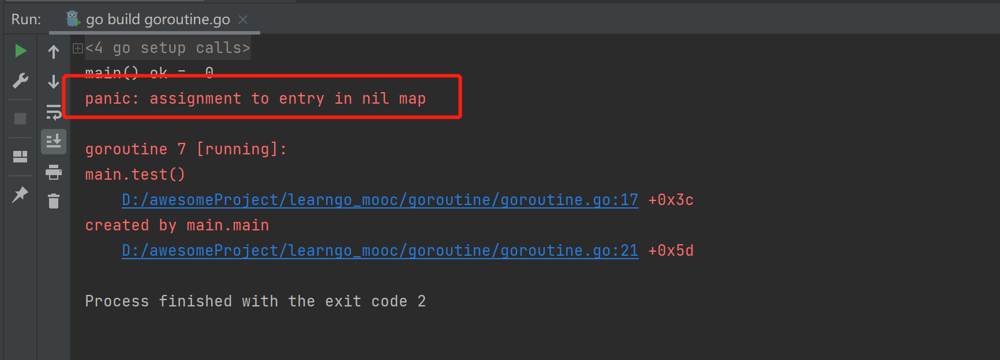

# 13 Channel-select 解决阻塞

## Channel 可以声明为只读/写
管道的默认：既可读又可写。

但在有些方法里面，需要让 Channel 只能读或者只能写。

```go
package main
func main(){
    var chan1 chan<- int //只能写
    chan1 = make(chan int, 3)
    chan1 <- 20
    fmt.Println("chan1 = ", chan1)
    
    var chan2 <- chan int
    num2 : <- chan2
    fmt.Println("num2", num2)
}
```

在函数中使用：

```go
func main(){
    var ch chan int
    ch = make(chan int, 10)
    exitChan := make(chan struct{}, 2)
    go send(ch, exitChan)
    go recv(ch, exitChan)
    
    var total = 0
    for _ = rfange exitChan{
        total++
        if total == 2 {
        	break
        }
    }
    fmt.Println("over...")
}
// send 传参 ch 定义为只能写操作
func send(ch chan<- int, exitChan chan struct{}){
    for i:= 0; i < 10; i++{
    	ch <- i
    }
    close(ch)
    var a struct{}
    exitChan <- a
}
// revc 传参 ch 定义为只能读操作
func recv(ch <-chan int, exitChan chan struct{}){
    for {
        v, ok := <-ch
        if !ok{
            break
        }
        fmt.Println(v)
    }
    var a struct{}
    exitChan <- a
}
```

## 使用select解决阻塞问题
传统的方法在遍历管道的时候，如果不关闭就会导致阻塞 `deadlock`，但是在实际的开发中，我们不好确定什么时候关闭管道，使用`select`方式来解决。

```go
func main(){
    intChan := make(chan int, 10)
    for i := 0; i< 10; i++{
        intChan<- i
    }
    stringChan := make(chan string, 5)
    for i := 0; i < 5; i++ {
        stringChan <- "hello" + fmt.Sprintf("%d", i)
    }
    //label:
    for{
        select { 
            case v: = <-intChan :
            	fmt.Printf("从intChan读取数据%d\n", v)
            case v: = <-stringChan :
            	fmt.Printf("从intChan读取数据%s\n", v)
            default :
            	fmt.Printf("取不到", v)
            //后面可以加入取不到后的业务逻辑
            	return //退出主函数，也可以用label退出 
            //	break label
        }
    }
}
```

## 解决协程中出现的panic
如果运行一个协程，但是这个协程出现了`<font style="color:#E8323C;">panic</font>`，如果我们没有捕获这个`<font style="color:#E8323C;">panic</font>`，就会造成整个程序的崩溃，这时候我们可以在goroutine中使用`<font style="color:#1890FF;">recover</font>`来捕获`<font style="color:#F5222D;">panic</font>`来进行处理，这样即使这个协程发生了问题，但是线程还是不受到影响。

来看一下使用场景，定义两个协程，其中一个协程<font style="color:#F5222D;">不小心写错了</font>，于是整个主程序就崩溃了，另外一个协程就因为这一个错误无法执行。看如下代码：

```go
// sayHello 定义一个简单且正确的协程
func sayHello(){
    for i := 0; i < 10; i++{
        time.Sleep(time.Second)
        fmt.Println("hello world")
    }
}
func test(){
    var myMap map[int]string //没有make就赋值了，报panic
    myMap[0] = "golang"
}
func main(){
    go sayHello()
    go test()
    for i := 0; i < 10; i++{
        fmt.Println("main() ok = ", i)
        time.Sleep(time.Second)
    }
}   
```

运行结果：




```go
// sayHello 定义一个简单且正确的协程
func sayHello(){
    for i := 0; i < 10; i++{
        time.Sleep(time.Second)
        fmt.Println("hello world")
    }
}
func test(){
    defer func(){
        if err := recover(); err != nil{
            fmt.Println("test() 发生错误", err)
        }
    }()
    var myMap map[int]string //没有make就赋值了，报panic
    myMap[0] = "golang"
}
func main(){
    go sayHello()
    go test()
    for i := 0; i < 10; i++{
        fmt.Println("main() ok = ", i)
        time.Sleep(time.Second)
    }
}   
```

👾 注意：如果运行时候出现`<font style="color:#F5222D;">createProcess error=5，拒绝访问</font>`<font style="color:rgb(77, 77, 77);">的错误，记得关掉360等安全软件！</font>

<font style="color:rgb(77, 77, 77);">运行结果：</font>


> 更新: 2022-02-23 15:21:40  
> 原文: <https://www.yuque.com/xiaoshan_wgo/codingnotes/tsmlqa>