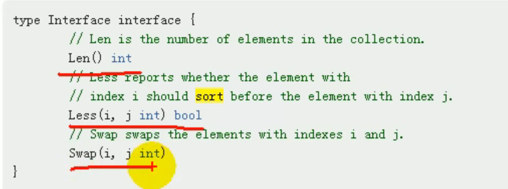
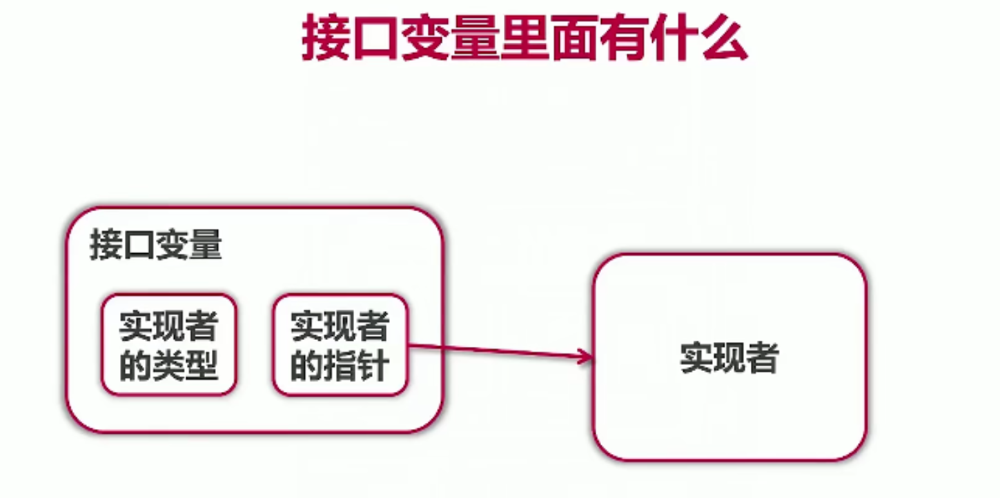
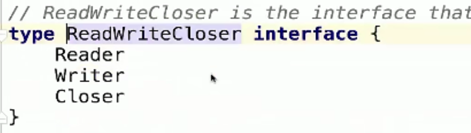

# 1 接口

## 1.接口的概念
<font style="color:rgb(0, 0, 0);">场景：有一个项目经理要管理三个程序员开发一个软件，为了控制和管理软件，项目经理可以定义一些接口，然后由程序员具体进行实现。</font>

<font style="color:rgb(0, 0, 0);">接口是一组仅包含</font><font style="color:#D46B08;">方法名、参数、返回值</font><font style="color:rgb(0, 0, 0);">的未具体实现的</font><font style="color:#D46B08;">方法</font><font style="color:rgb(0, 0, 0);">的集合。</font>

**<font style="color:rgb(0, 0, 0);">一个简单的例子：</font>**

```go
package main
type Usber interface{ //接口和它的两个没有实现的方法
    Start()
    Stop()
}
type Phone struct{
}

func (p Phone) Start(){ //程序员1写的方法
	fmt.Println("手机开始工作。。")
}
func (p Phone) Stop(){//程序员2写的方法
	fmt.Println("手机停止工作。。")
}

type Computer struct{
} 
//定义个电脑类

func (c Computer) Working(usb Usber){ //电脑的方法是调用接口
    usb.Start()
    usb.Stop()
}
func main(){
    computer := Computer{} //电脑
    phone := Phone{} //手机
    computer.Working(phone) //电脑和手机工作
}
```

**第二个例子：**

```go
   type MyInterface interface{
       Print() //接口里面未被实现的方法
   }
   
   func TestFunc(x MyInterface) {} //x是这个接口类型
   type MyStruct struct {} //MyStruct 是个结构体->类
   func (me MyStruct) Print() {} //给类绑定Print方法，也就是和接口里面的方法连接上
  
   func main() {
       var me MyStruct  //实例化对象
       TestFunc(me) //me这个对象传入TestFunc,me就变成了接口类型可以调用Print
   }

```

<font style="color:rgb(0, 0, 0);">接口定义如下：</font>

```go
type interfaceName interface { 
    // 方法列表 
    GetName() string
}
```

<font style="color:rgb(0, 0, 0);">接口的命名喜欢使用er结尾。</font>

**<font style="color:rgb(0, 0, 0);">第三个例子：</font>**

```go
package main

import (
	"fmt"
	"go_module/infra"
)

func getRetriever() retriever{ //方法
	return infra.Retriever{} 
}

//Something that can "Get"，接口
type retriever interface { 
	Get(string) string //get方法名 （string）参数 string返回值
}

func main() {
	var r retriever = getRetriever()  
    //r的类型是retriever这个接口，
    //这个接口类型可以继承上面的getRetriever方法。
	fmt.Printf("%s\n",r.Get("https://www.baidu.com"))
	//main解析字符串，并且输出字符
}

```

定义方法的包，方法名字为Get，返回字符串，空结构体Retriever可以作为方法的接收者。

```go
package infra

import (
	"io/ioutil"
	"net/http"
)

type Retriever struct {

}
func (Retriever) Get(url string) string{
	resp, err := http.Get(url)
	if err != nil{
		panic(err)
	}
	defer resp.Body.Close()
	bytes, _ := ioutil.ReadAll(resp.Body)
	return string(bytes)
}
```

当我们新定义一个testing对该代码进行测试的时候，就可以实现类似继承和多态的功能。

**第四个例子：使用接口来排序结构体切片。**

可以看到sort包中，接口里面有三个方法需要去实现。




对切片进行排序的一般方法：

```go
package main
func main(){
    //对切片进行排序
    var intSlice = []int{0,-1,10,7,90}
    sort.Ints(intSlicce)
}
```

对结构体（对象）进行排序：

```go
package main
type Person struct{
	Name string
    Age int
}
//声明一个切片里面存放多个Person结构体
type PersonSlice []Person

//实现接口的三个方法
//Len 长度
func (ps PersonSlice) Len() int{
    return len(ps)
}
//Less 升序还是降序
func (ps PersonSlice) Less(i, j int) bool{
    return ps[i].Age < ps[j].Age //年龄大的为真,升序排序
    //return ps[i].Name < ps[j].Name 
}
func (ps PersonSlice) Swap(i, j int){
    ps[i], ps[j] := ps[j], ps[i]
}
func main(){
	var persons PersonSlice
    for i := 0; i<10 ;i++{
        person := Person{
            Name : fmt.Sprintf("Person_",rand.Intn(100))随机生成1个名字
            Age : rand.Intn(100) //随机生成1个年龄
        }
        persons = append(persons,person)//添加到切片里面
    }
    sort.Sort(persons) 
    for _ , v  := range persons{
        fmt.Println(v)
    }
}
```

## 2 接口和继承的区别
继承是子类继承父类的一些属性和方法，接口可以在子类的上面添加“翅膀”，并且不破坏继承关系。

可以认为，**实现接口是对继承机制的补充。**

```go
type Monkey struct{
	Name string
}
type BirdFly interface{ //飞翔接口
    Flying()
}

func (this *Monkey) climbing{
    fmt.Println(this.Name,"爬树")
}
type LittleMonkey struct{
	Monkey//小猴子继承猴子的属性和方法
}
func (this *LittleMonkey) Flying(){ //小猴子可以飞翔
    fmt.Println(this.Name,"飞翔")
}
func main(){
    monkey := LittleMonkey{
        Monkey{
            Name: "Wukong",
        },
    }
    monkey.climbing()
    monkey.Flying()
}
```

**总结:**

+ 继承的价值在于：解决代码的复用性和可维护性。
+ 接口的价值在于：设计，设计好各种规范和方法，让其它自定义类型去实现这些方法。
+ 接口比继承更加灵活，继承是满足`is-a`的关系，而接口只需要满足`like-a`的关系。
+ 接口可以在一定程度上实现代码解耦。

## 3 Duck Typing的概念
像鸭子走路，像鸭子叫（长得像鸭子），那么就是鸭子。

"duck typing" 描述事物的外部行为而非内部结构。

go属于结构化类型系统，类似于duck typing

Python中的duck typing:

```python
def download(retriever):
	return retriever.get("www.baidu.com")
```

retriever是一个duck typing，

通常需要注释来说明接口。

C++中的duck typing：

```cpp
template <class R>
string download(const R& retriever){
    return retriever.get("www.baidu.com")
```

一般用模板来实现，缺点是编译时才知道传入的retriever有没有get（打代码的时候不知道），仍需要注释来说明接口。

java中的类似代码：

```java
<R extends Retriever>
String download(R r){
	return r.get("www.baidu.com")
}
```

传入的参数必须实现Reriever接口，java没有duck typing。

go语言的duck typing:

同时需要Readable,Appendable,这个数据可以读可以写，该怎么办？

同时具有python，C++的duck typing的灵活性

又具有java的类型检查。

## 4 接口的定义和实现


接口由<font style="color:#D46B08;">使用者</font>定义

实例练习：

```go
package main

import (
	"fmt"
	"go_module/retriever/mock"
	"go_module/retriever/mock/real"
)

type Retriever interface {
	Get(url string) string
}
func download(r Retriever) string{
	return r.Get("https://www.imooc.com")
}
func main() {
	var r Retriever
	r = mock.Retriever{Content: "this is a fake mooc"}
	r = real.Retriever{}
	fmt.Println(download(r))
}
```

```go
package real

import (
	"net/http"
	"net/http/httputil"
	"time"
)

type Retriever struct {
	UserAgent string
	TimeOut time.Duration
}

func (r Retriever) Get(url string) string {
	resp, err := http.Get(url)
	if err != nil{
		panic(err)
	}
	result, err := httputil.DumpResponse(
		resp,true)
	resp.Body.Close()
	if err != nil{
		panic(err)
	}
	return string(result)
}


```

```go
package mock

type Retriever struct {
	Content string
}

func (r Retriever) Get(url string) string {
	return r.Content
}

```

接口的实现是隐式的，只要是实现里面的方法就可以了。

## 5 接口的值类型
注：接口一般不会用到指针

```go
package main

import (
	"fmt"
	"go_module/retriever/mock"
	"go_module/retriever/mock/real"
	"time"
)

type Retriever interface {
	Get(url string) string
}
func download(r Retriever) string{
	return r.Get("https://www.baidu.com")
}
func main() {
	var r Retriever
	r = mock.Retriever{Content: "this is a fake url stage "}
	inspect(r)

	r = real.Retriever{
		UserAgent: "Mozilla/5.0",
		TimeOut: time.Minute,
	}
	inspect(r)
	//realRetriever := r.(mock.Retriever)
	//fmt.Println(realRetriever.Content)
	if mockRetriever,ok := r.(mock.Retriever); ok{
		fmt.Println(mockRetriever.Content)
	}else{
		fmt.Println("not a mock retriever")
	}
	fmt.Println(download(r))
}
func inspect(r Retriever){
	switch v := r.(type) {
	case mock.Retriever:
		fmt.Println("Contents:",v.Content)
	case *real.Retriever:
		fmt.Println("UserAgent:",v.UserAgent)
	}
}
```



+ 接口变量自带指针
+ 接口变量同样采用值传递，几乎不需要使用接口的指针
+ 指针接收者实现只能以指针方法使用，值接收者都可以


**查看接口变量**

Type Assertion

Type Switch

interface{} 可以表示任何类型，比如可以把 int 改成interface{}，这样切片内可以存储任何类型的值了。


## 6 接口的组合
例如：一个文件又能读又能写，组合两个接口。

实例练习：

```go
package main

import (
	"fmt"
	"go_module/retriever/mock"
	"go_module/retriever/mock/real"
	"time"
)

type Retriever interface {
	Get(url string) string
}

type Poster interface {
	Post(url string,
		form map[string]string) string
}
const url = "https://www.baidu.com"
func download(r Retriever) string{
	return r.Get("https://www.imooc.com")
}

func post(poster Poster){
	poster.Post("https://www.baidu.com",
		map[string]string{
		"name" :"mouse",
		"course":"golang",
	})
}
type RetrieverPoster interface {
	Retriever
	Poster
}
//接口的组合
func session(s RetrieverPoster) string{
	s.Post(url,map[string]string{
		"contents": "another faked stage",
	})
	return s.Get(url)
}

func main() {
	var r Retriever
	retriever := mock.Retriever{Content: "this is a fake mooc"}
	r = &retriever
	inspect(r)

	r = real.Retriever{
		UserAgent: "Mozilla/5.0",
		TimeOut: time.Minute,
	}
	inspect(r)
	//realRetriever := r.(mock.Retriever)
	//fmt.Println(realRetriever.Content)
	if mockRetriever, ok := r.(*mock.Retriever); ok{
		fmt.Println(mockRetriever.Content)
	}else{
		fmt.Println("not a mock retriever")
	}
	fmt.Println("Try a session")
	fmt.Println(session(&retriever))
	fmt.Println(download(r))
}
func inspect(r Retriever){
	switch v := r.(type) {
	case *mock.Retriever:
		fmt.Println("Contents:",v.Content)
	case *real.Retriever:
		fmt.Println("UserAgent:",v.UserAgent)
	}
}

```

应变成指针接收才能改变contents内容：

```go
package mock

type Retriever struct {
	Content string
}

func (r *Retriever) Post(url string, form map[string]string) string {
	r.Content = form["contents"]
	return "ok"
}

func (r *Retriever) Get(url string) string {
	return r.Content
}


```

标准库中的写法，例子：




## 


> 更新: 2022-02-17 16:20:03  
> 原文: <https://www.yuque.com/xiaoshan_wgo/codingnotes/kybspv>