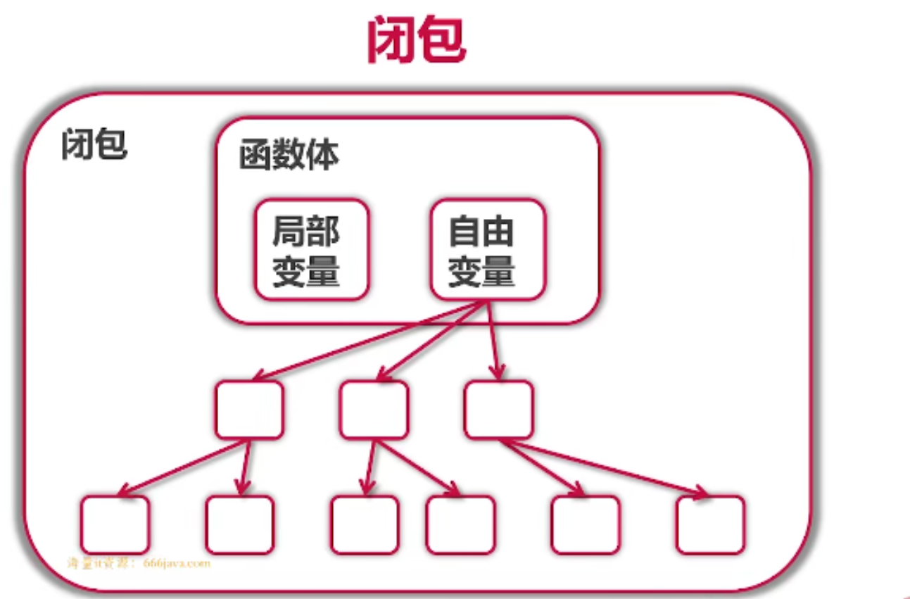

# 3 函数式编程

## 何为函数式编程？
+ 参数，变量，返回值都可以是函数——>"一等公民"
+ 高阶函数
+ 函数->闭包


**go闭包的应用：**

+ 不需要修饰如何访问自由变量；
+ 没有Lambda表达式，但是有匿名函数。


**“正统”函数式编程（数学要求高，可读性差）**

+ 不可变性： 不能由状态，只有常量和函数
+ 函数只能有一个参数

累加器（用闭包实现）代码如下：

```go
package main

import "fmt"
//累加器
func adder() func(int) int{
	sum := 0
	return func(v int) int{
		sum += v
		return sum
	}

}

func main() {
	a := adder()
	for i := 0; i < 10;i++{
		fmt.Println(a(i))
	}
}

```

闭包：

函数体有局部变量，和自由变量。



“正统”的函数式编程，实例练习：

```go
package main

import "fmt"
//累加器
func adder() func(int) int{
	sum := 0
	return func(v int) int{
		sum += v
		return sum
	}
}

type iAdder func(int) (int,iAdder)

func adder2(base int) iAdder {
	return func(v int)(int, iAdder){
		return base + v, adder2(base + v)
	}
}

func main() {
	a := adder2(0)
	for i := 0; i < 10; i++{
		var s int
		s, a = a(i)
		fmt.Printf(" 0 + 1 + ... + %d = %d\n",
			i, s)
	}
}

```

**python中的闭包：可以使用**

__closure__来查看闭包的内容

```python
def adder():
	sum = 0
    
	def f(value):
		nolocal sum
		sum += value
		return sum
return f
```

**C++中的闭包**

```cpp
auto adder(){
    auto sum = 0;
    return [=](int value) mutable{
        sum += value;
        return sum;
    };
}
```

C++11以后支持闭包


**java中的闭包**

```java
Function<Interger,Integer> adder(){
    final Holder<Integer> sum = new Holder<>(0);
    return (Integer value)->{
        sum.value += value;
        return sum.value;
    };
}
```

+ 1.8以后：使用Function接口和Lambda表达式来创建函数对象；
+ 匿名类或Lambda表达式均支持闭包。


## 函数式编程案例
### 1.斐波那契数列


用文件

```go
package main

import (
	"bufio"
	"fmt"
	"io"
	"strings"
)
// 1,1,2,3
// a,b
//   a,b
//     a,b
func fibonacci() intGen{
	a, b := 0,1
	return func() int {
		a, b = b, a+b
		return a
	}
}

type intGen func() int

func (g intGen) Read(p []byte) (n int, err error) {
	next := g() //取得下一个元素
	if next > 10000{
		return 0,io.EOF
	}//上限为10000，文件读到头
	s := fmt.Sprintf("%d\n",next)
	return strings.NewReader(s).Read(p)
}
//打印文件
func printFileContents(reader io.Reader){
	scanner := bufio.NewScanner(reader)
	for scanner.Scan(){
		fmt.Println(scanner.Text())
	}
}

func main() {
	f := fibonacci()
	printFileContents(f)
}

```

### 2.使用函数遍历二叉树
有一棵树：


tree的操作：

```go
package tree

import "fmt"

func (node * Node) Traverse(){
	node.TraverseFunc(func(node *Node) {
		node.Print()
	})
	fmt.Println()
}

func (node *Node) TraverseFunc(f func(*Node)){//定义该函数
	if node == nil{
		return
	}
	node.Left.TraverseFunc(f)
	f(node)
	node.Right.TraverseFunc(f)
}
```

主函数：

```go
package main

import (
	"fmt"
	"go_module/tree"
)
type myTreeNode struct {
	*tree.Node // Embedding 内嵌 语法糖可以直接让后面的节点省略一些代码
}
func (myNode *myTreeNode) postOrder(){
	if myNode == nil || myNode.Node == nil{
		return
	}
	left := myTreeNode{myNode.Left}
	left.postOrder()
	right := myTreeNode{myNode.Right}
	right.postOrder()
	myNode.Print()
}
func main() {
	var root tree.Node
	fmt.Println(root)
	root = tree.Node{Value: 3}
	root.Left = &tree.Node{}
	//指针也可以用. 不用->
	nodes := []tree.Node{
		{Value: 3},
		{},
		{6,nil,&root},
	}
	fmt.Println(nodes)
	root.Print()//方法，传值
	//不需要知道结构实在堆上还是栈上，是垃圾自动回收
	var pRoot *tree.Node
	pRoot.SetValue(200)
	pRoot = &root
	pRoot.SetValue(300)
	pRoot.Print()
	root.Traverse()
	//值接收者是go特有的
	nodeCount := 0
	root.TraverseFunc(func(node *tree.Node) {
		nodeCount++
	})
	fmt.Println("Node count:",nodeCount)
}
```


> 更新: 2021-11-23 00:40:07  
> 原文: <https://www.yuque.com/xiaoshan_wgo/codingnotes/nxi0co>