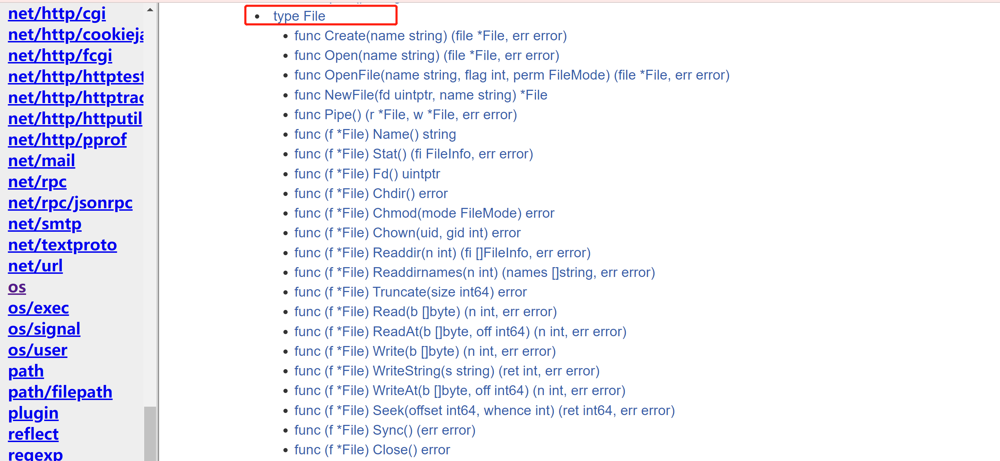
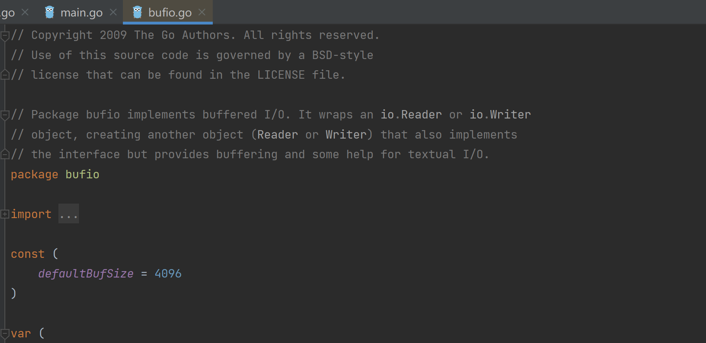

# 6 文件

## 一、文件的基本介绍
文件在程序中是以**流**的形式来操作的。

文件是数据源；**数据源**就是保存数据的地方。

流：是数据在数据源（文件）和程序（内存）之间经历的路径。 


`type File `

`os.File`封装所有文件的相关操作，File是一个结构体。



`File`是一个结构体。

```go
type File struct {
    // 内含隐藏或非导出字段
}
```

## 二. 打开文件和关闭文件
### 1.打开文件
```go
func Open(name string) (file *File, err error)
```

<font style="color:rgb(51, 51, 51);">Open方法打开一个文件用于读取。如果操作成功，返回的文件对象的方法可用于读取数据；对应的文件描述符具有O_RDONLY模式。如果出错，错误底层类型是*PathError。</font>

### 2.关闭文件：
```go
func (f *File) Close() error
```

### 3.案例练习
```go
package main

import (
	"fmt"
	"os"
)

func main() {
	//打开一个文件
	//file的叫法
	//1.file叫file对象
	//2。file叫file指针
	//3.file叫file文件句柄
	file, err := os.Open("d:/solution2.rpt")
	if err!=nil{
		fmt.Println("open file err=",err)
	}

	//输出文件，查看文件内容,看出文件就是个指针
	fmt.Printf("file=%v",file)

	//关闭文件
	if err := file.Close();err!=nil{
		fmt.Println("close file err=",err)
	}
}

```

## 三、带缓冲的Reader读文件


默认缓冲区为4096

```go
package main

import (
	"bufio"
	"fmt"
	"io"
	"os"
)

func main() {
	//打开一个文件
	//file的叫法
	//1.file叫file对象
	//2。file叫file指针
	//3.file叫file文件句柄
	file, err := os.Open("d:/solution2.rpt")
	if err!=nil{
		fmt.Println("open file err=",err)
	}
	//当函数退出时，要及时的关闭file
	defer file.Close()//要及时关闭file句柄，否贼会有内存泄露

	//创建一个*Reader，是带缓冲的
	reader := bufio.NewReader(file)
	//循环读取文件的内容
	for{
		str,err := reader.ReadString('\n')//读到一个换行就结束
		if err == io.EOF{//io.EOF表示文件的末尾
			break
		}
		//输出内容
		fmt.Print(str)
	}
	fmt.Println("文件读取结束")
}
```

## 四、一次性读取文件
```go
package main

import (
	"fmt"
	"io/ioutil"
)

func main() {
	//使用ioutil.ReaderFile一次性将文件读取到位
	file := "d:/solution2.rpt"
	content, err := ioutil.ReadFile(file)
	if err != nil{
		fmt.Printf("read file err=%v",err)
	}
	//把读取道德内容显示到终端
	fmt.Printf("%v",content)// []byte
	//这里没有显式的open文件，因此也不需要显式的Close文件
	//因为，文件的Open和Close被封装到ReadFile函数内部
}
```


> 更新: 2022-01-17 20:45:35  
> 原文: <https://www.yuque.com/xiaoshan_wgo/codingnotes/zngbgv>