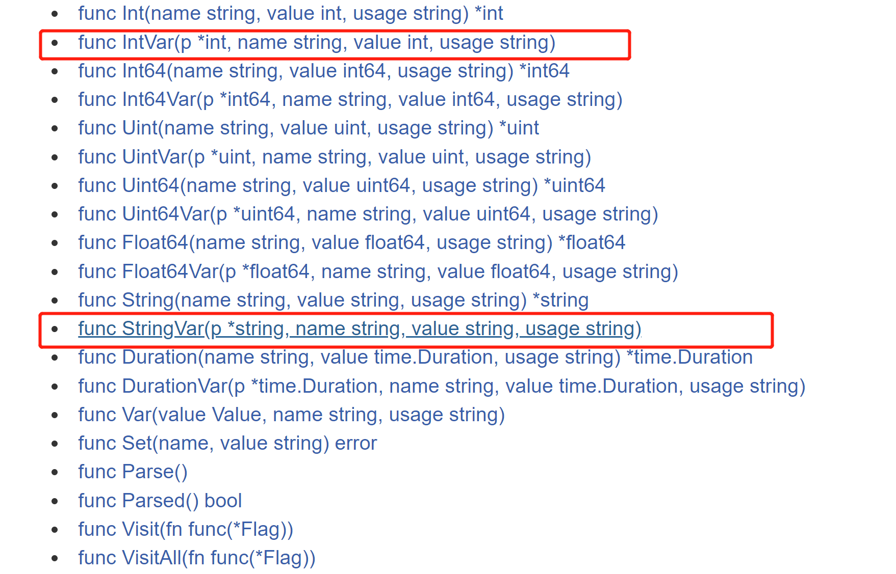

# 8 flag 包解析命令行参数

## flag包分析
6的方式式比较原生的方式，对解析参数不是特别的方便，特别是带有指定参数形式的命令行。

比如：`cmd>main.exe -f c:/aa.txt -p 200 -u root`

这样的形式命令行，go设计者给我们提供了flag包，可以方便的解析命令行参数，而且参数顺序可以随意。




红色方框内的比较常用：

```go
func IntVar(p *int, name string, value int, usage string)
```

```go
func StringVar(p *string, name string, value string, usage string)
```

## 案例练习
```go
package main

import (
	"flag"
	"fmt"
)

func main() {
	//定义几个变量，用于接收命令行的参数值
	var user string
	var pwd string
	var host string
	var port int
	//&user即使接受用户命令行中输入的-u后面的参数值
	//“u”,就是-u 指定参数
	//“”，默认值
	//“用户名，默认为空” 说明
	flag.StringVar(&user,"u","","用户名，默认为空" )
	flag.StringVar(&pwd,"pwd","","密码，默认为空")
	flag.StringVar(&host,"h","localhost","主机名，默认为localhost")
	flag.IntVar(&port,"port",3306,"端口号，默认为3306")
	//这里有个非常重要的操作，转换，必须调用该方法
	flag.Parse()

	fmt.Printf("user=%v pwd=%v host=%v port=%v," ,
		user, pwd, host, port)
}

```

## 参考文章
[https://www.cnblogs.com/fzxiaomange/p/golang-command-parse.html](https://www.cnblogs.com/fzxiaomange/p/golang-command-parse.html)


> 更新: 2021-11-20 21:22:39  
> 原文: <https://www.yuque.com/xiaoshan_wgo/codingnotes/xerxhm>