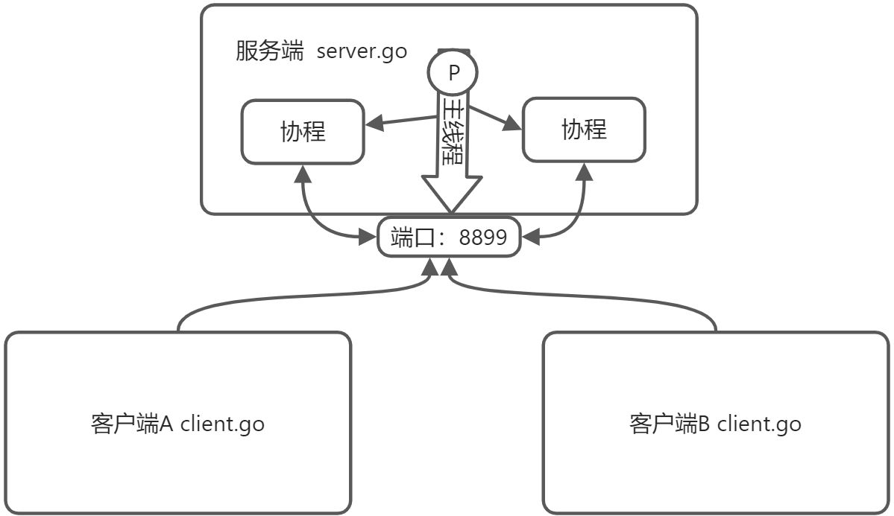
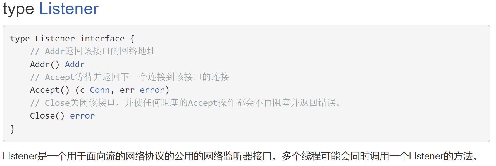
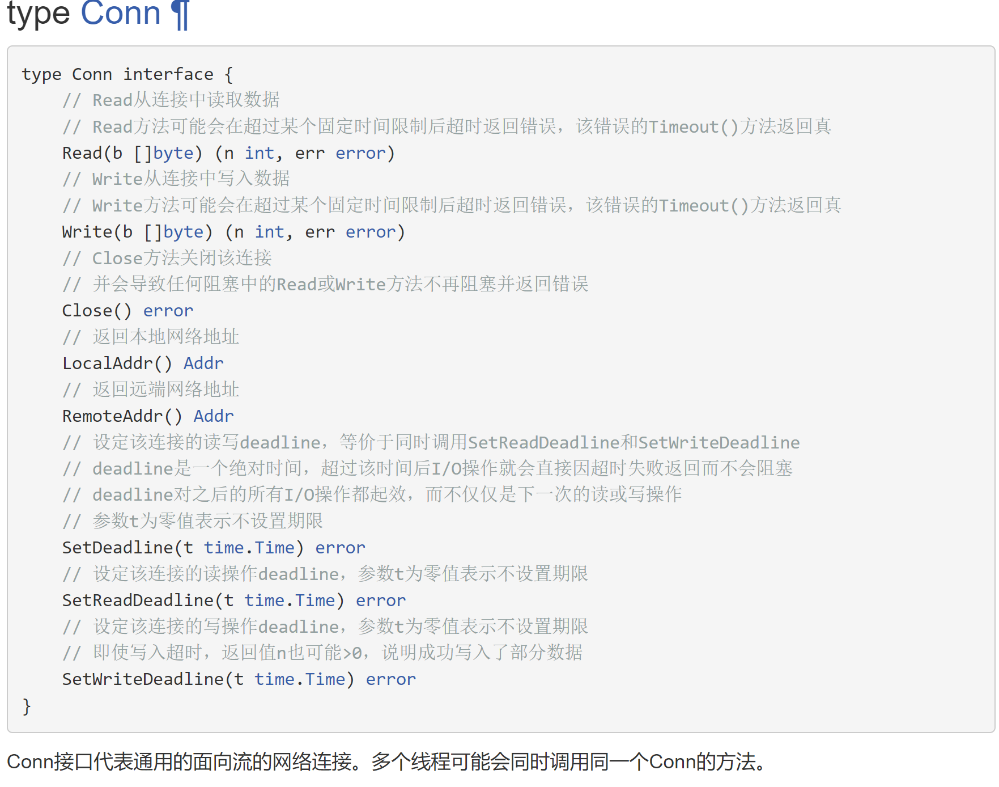
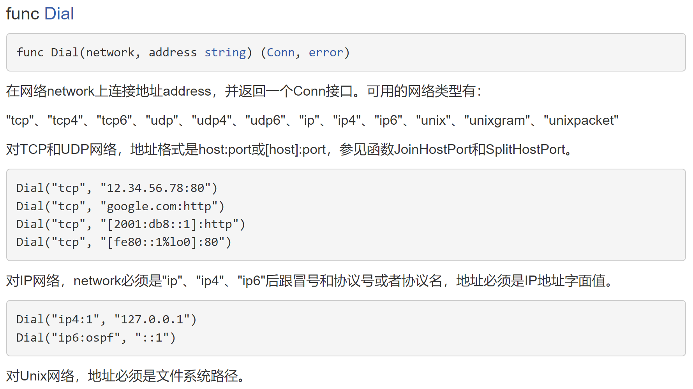
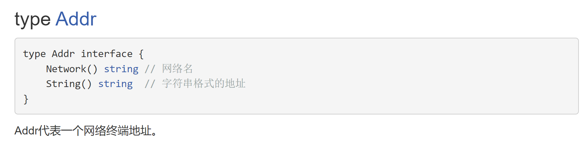

# 2 Socket - TCP 编程

`Socket`是`BSD UNIX`的进程通信机制，称作”套接字”，用于描述IP地址和端口，是一个通信链的句柄。

`Socket`可以理解为TCP/IP网络的`API`，它定义了许多函数或例程，程序员可以用它们来开发`TCP/IP`网络上的应用程序。电脑上运行的应用程序。

`Socket`是应用层与TCP/IP协议族通信的中间软件抽象层。

在设计模式中，`Socket`其实就是一个<font style="color:#1890FF;">门面模式</font>，它把复杂的TCP/IP协议族隐藏在`Socket`后面，对用户来说只需要调用`Socket`规定的相关函数，让`Socket`去组织符合指定的协议数据然后进行通信。

## Socket 服务端和客户端的处理流程
**服务端的处理流程：**

1. 监听端口
2. 接受客户端的`TCP`连接，建立客户端和服务端的连接
3. 创建`goroutine`，处理该连接的请求（通常客户端会通过连接发送请求包）

**客户端的处理流程：**

1. 建立于服务端的连接
2. 发送请求数据，接收服务端返回的结果数据
3. 关闭连接




## 案例分析
编写一个服务器端程序，在8888端口监听，可以和多个客户端创建连接，连接成功后，**客户端可以发送单行数据，服务端接收数据并显示在终端上**，先使用telnet来测试，然后编写在客户端程序来测试。










## 服务端代码
```go
package main
import(
    "fmt"
    "net"
)
func process(conn net.Conn){//接收实现conn接口的数据
    //循环地接收客户端发送的数据
    defer conn.Close()//关闭conn
    
    for{
        //创建一个新的切片
        buf := make([]byte, 1024)
        //conn.Read
        //等待客户端通过conn发送信息
        //如果客户端没有write[发送]，那么协程就一直阻塞在这里。
        fmt.Println("服务端在等待客户端%s 发送信息\n", conn.RemoteAddr().String())
        n, err := conn.Read(buf)
        if err != nil {
            fmt.Println("客户端已退出 err=", err)
            return
        }
        //显示客户端发送的内容到服务器的终端
        fmt.Print(string(buf[:n]))
}
func main(){
    fmt.Println("服务器开启监听")
    //net.Listen("tcp","0.0.0.0:8888")
    //tcp表示使用的网络协议是tcp
    //0.0.0.0:8888表示在本地监听8888端口
    listen, err := net.Listen("tcp","0.0.0.0:8888")
    if err != nil{
        fmt.Println("listen err=", err)
        return
    }
    defer listen.Close() //延时关闭listen
    //循环不停的等待客户端来连接
    for{
        fmt.Println("等待客户端来连接")
        conn, err := listen.Accept()
        if err != nil{
            fmt.Println("Accept() err =",err)
            
        }else {
            fmt.Printf("Accept() suc con=%v\n 客户端ip = %v\n", conn, conn.RemoteAdder().String())
        }
        //开启协程，为客户端服务
        go process(conn)
        
        //cmd 中 telnet+IP:端口 可以测试是否有人监听连接这个端口
    }
 }
    
```

## 客户端代码
```go
package main
import(
    "fmt"
    "net"
    "os"
)
func main(){
    conn, err := net.Dial("tcp","192.168.20.53:8888")
    if err != nil{
        fmt.Println("client dial err=", err)
        return
    }
    //功能一：客户端可以发送单行数据，然后就退出
    reader := bufio.NewReader(os.Stdin)//Stdin 代表标准输入，终端
    for{
        //从终端不停的读取用户输入，并发送给服务器
        line, err := reader.ReadString('\n')//ReadString返回字符串
        if err != nil {
            fmt.Println("readString err=",err)
        }
        //如果用户输入的是exit就退出
        line := strings.Trim(line," \r\n")
        if line == "exit"{
            fmt.Println("客户端退出")
            break
        }
        //将line发送给服务器
        _, err := conn.Write([]byte(line + "\n"))//把字符串转成切片
        if err != nil{
            fmt.Println("conn.Write err=",err)
        }
        //fmt.Printf("客户端发送了 %d 字节的数据, 并退出", n)
    }
}
    
```


> 更新: 2022-07-29 13:35:07  
> 原文: <https://www.yuque.com/xiaoshan_wgo/codingnotes/uk95h7>