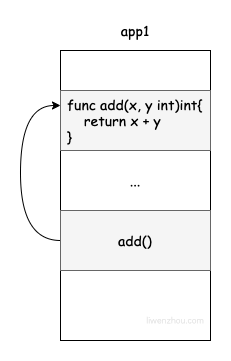
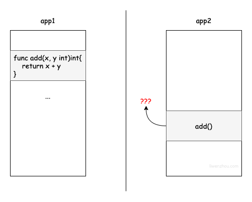

# 4 RPC 编程

# RPC 的概念
RPC（Remote Procedure Call）远程过程调用，是一种通过网络从远程计算机程序上请求服务，而不需要了解底层网络技术的协议，简单的理解是一个节点请求另一个节点提供的服务。RPC 只是一套协议，基于这套协议规范来实现的框架都可以称为 RPC 框架，比较典型的有 Dubbo、Thrift 和 gRPC。

<font style="color:rgb(0, 0, 0);"></font>

<font style="color:rgb(0, 0, 0);">RPC 是远程过程调用的方式之一，涉及调用方和被调用方两个进程的交互。因为 RPC 提供类似于本地方法调用的形式，所以对于调用方来说，调用 RPC 方法和调用本地方法并没有明显区别。发起 RPC 的进程通过参数等方式将信息传送给被调用方，然后被调用方处理结束后，再通过返回值将信息传递给调用方。这一过程对于开发人员来说是透明的，开发人员一般也无须知道双方底层是如何进行消息通信和信息传递的，这样可以让业务开发人员更专注于业务开发，而非底层细节。</font>

<font style="color:rgb(0, 0, 0);"></font>

<font style="color:rgb(0, 0, 0);">RPC 让程序之间的远程过程调用具有与本地调用类似的形式。比如说某个程序需要读取某个文件的数据，开发人员会在代码中执行 read 系统调用来获取数据。</font>

#         
<font style="color:rgb(68, 68, 68);">RPC就是为了解决类似远程、跨内存空间、的函数/方法调用的。要实现RPC就需要解决以下三个问题。</font>

1. **<font style="color:rgb(68, 68, 68);">如何确定要执行的函数？</font>**<font style="color:rgb(68, 68, 68);"> 在本地调用中，函数主体通过函数指针函数指定，然后调用 add 函数，编译器通过函数指针函数自动确定 add 函数在内存中的位置。但是在 RPC 中，调用不能通过函数指针完成，因为它们的内存地址可能完全不同。因此，调用方和被调用方都需要维护一个{ function <-> ID }映射表，以确保调用正确的函数。</font>
2. **<font style="color:rgb(68, 68, 68);">如何表达参数？</font>**<font style="color:rgb(68, 68, 68);"> 本地过程调用中传递的参数是通过堆栈内存结构实现的，但 RPC 不能直接使用内存传递参数，因此参数或返回值需要在传输期间序列化并转换成字节流，反之亦然。</font>
3. **<font style="color:rgb(68, 68, 68);">如何进行网络传输？</font>**<font style="color:rgb(68, 68, 68);"> 函数的调用方和被调用方通常是通过网络连接的，也就是说，function ID 和序列化字节流需要通过网络传输，因此，只要能够完成传输，调用方和被调用方就不受某个网络协议的限制。.例如，一些 RPC 框架使用 TCP 协议，一些使用 HTTP。</font>

# <font style="color:rgb(0, 0, 0);">RPC 过程调用</font>
例如 A+B 的调用：service 中间件。

```go
package main

type Args struct {
    X, Y int
}

// ServiceA 自定义一个结构体类型
type ServiceA struct{}

// Add 为ServiceA类型增加一个可导出的Add方法
func (s *ServiceA) Add(args *Args, reply *int) error {
    *reply = args.X + args.Y
    return nil
}
```

<font style="color:rgb(68, 68, 68);">通过下面的代码将上面定义的 ServiceA 类型注册为一个服务，其 Add 方法就支持 RPC 调用了。</font>

```go
// rpc demo/server.go

package main

import (
	"log"
	"net"
	"net/http"
	"net/rpc"
)

func main() {
	service := new(ServiceA)
	rpc.Register(service) // 注册RPC服务
	rpc.HandleHTTP()      // 基于HTTP协议
	l, e := net.Listen("tcp", ":9091")
	if e != nil {
		log.Fatal("listen error:", e)
	}
	http.Serve(l, nil)
}
```

## 服务端
```go
package main

import (
    "fmt"
    "net/rpc"
    "io"
    "net"
    "net/http"
)

//创建一个int类型对象
type Panda int 

/**
* argType是客户端发送过来的内容
* replyType是服务端返回给客户端的内容
*/
func (this *Panda)GetInfo(argType int, replyType *int) error {//GetInfo首字母大小 因为要被外部访问
    fmt.Println("打印对方发送过来的数据：",argType)
    //执行
    *replyType = argType + 123456
    return nil
}

func pandatext(w http.ResponseWriter, r *http.Request) {
    io.WriteString(w, "hello panda")
}

func main() {
    //客户端页面的请求
    http.HandleFunc("/panda", pandatext)
    //将类实例化为对象
    pd := new(Panda)
    //服务端注册一个对象，该对象就作为一个服务被暴露出去
    rpc.Register(pd)
    //连接到网络
    rpc.HandleHTTP()
    
    //监听端口
    ln,err := net.Listen("tcp", ":10086")
    if err != nil {
        fmt.Println("network error")
    }
    http.Serve(ln,nil)
    
}
```

## 客户端
```go
package main

import (
    "fmt"
    "net/rpc"
)

func main() {
    //建立网络连接
    cli, err := rpc.DialHTTP("tcp", "127.0.0.1:10086")
    if err != nil {
        fmt.Println("network failed")
    }

    var pd int 
    //客户端调用服务端GetInfo方法，并传递参数
    err = cli.Call("Panda.GetInfo", 10086, &pd)
    if err != nil {
        fmt.Println("call() failed")
    }
    fmt.Println("服务端输出的值：", pd)
}
```


> 更新: 2022-08-02 10:00:22  
> 原文: <https://www.yuque.com/xiaoshan_wgo/codingnotes/bh7wao>