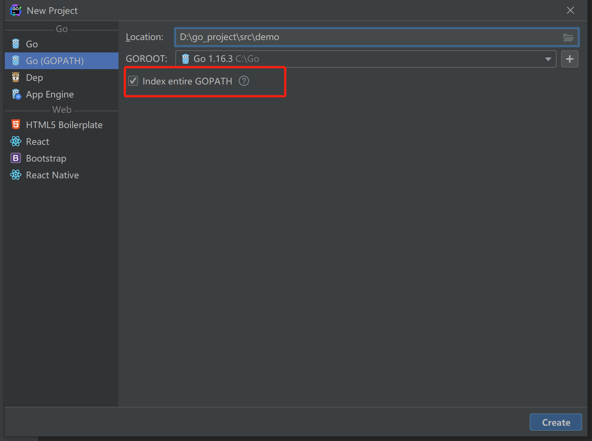

# 10 Go 语言的依赖管理

## Go语言的依赖管理
依赖指的是编一个程序不可能所有的代码都是自己写，我们需要使用大量的第三方库，我们把程序的功能建立在别人已经实现的基础设施上面。

依赖管理有三个发展阶段：GOPATH, GOVENDOR, go mod  
GOPATH不怎么好用，于是 GOVENDOR 短暂的出现了。go mod 出现在2018年，相较于前两种，go mod 可以更好的进行依赖管理。

## GOPATH
GOPATH的管理方式简单来讲，就是不来管理。

所有的包都去 GOPATH 里面找，所以这样 GOPATH 就又大又繁琐。

<font style="color:rgb(51, 51, 51);">GOPATH可以直接使用</font>`<font style="color:rgb(51, 51, 51);">go get</font>`<font style="color:rgb(51, 51, 51);">命令下载第三方的包，有以下三个文件存放相关的代码。</font>

`<font style="color:rgb(51, 51, 51);">src</font>`<font style="color:rgb(51, 51, 51);"> ：项目的源代码</font>

`<font style="color:rgb(51, 51, 51);">pkg</font>`<font style="color:rgb(51, 51, 51);"> ：编译后的生成文件</font>

`<font style="color:rgb(51, 51, 51);">bin</font>`<font style="color:rgb(51, 51, 51);"> ： 编译后的可执行文件</font>

<font style="color:rgb(51, 51, 51);">配置过程如下：</font>



<font style="color:rgb(51, 51, 51);">选中红框中的内容代表：把你在环境变量中配置的GOPATH信息加到你所创建的的项目中，而且会导致无法导入第三方包，一般来说是没必要的，如果在后面有需要可以在项目配置中重新进行设置。</font>

<font style="color:rgb(51, 51, 51);">创建这三个目录结构：</font>


设置demo的GOPATH：


1是Global GOPATH，<font style="color:rgb(51, 51, 51);">默认的是在系统环境变量中配置的GOPATH路径；</font>

<font style="color:rgb(51, 51, 51);">2是该项目的GOPATH，可以选择该项目使用的GOPATH，一开始建立项目的时候，只有Global GOPATH，最好不要使用全局环境；</font>

<font style="color:rgb(51, 51, 51);">3是是否使用系统环境的GOPATH，取消勾选；</font>

<font style="color:rgb(51, 51, 51);">4是将当前项目作为一个GOPATH。</font>

## <font style="color:rgb(51, 51, 51);">GOVENDOR</font>
> 假设有如下场景：
>
> 你的工程引用了一些外部包，且这些包仍有更新的可能，或者你们项目组另外开发一些公用包，且还在并行开发迭代中，如果你的项目代码本来运行稳定，却因为外部包的更新导致运行出现问题，你是不是很郁闷？所以为了开发时或者部署时，将外部包版本确定，在go1.6之后引入vendor目录，即你的项目工程中，多了个vendor目录，执行go build的时候，会在vendor目录下边寻找你引用的外部包，这样每次编译的时候，当外部包修改，测试通过后，将新的外部包内容替换到vendor中，不断的迭代更新，保证了外部包的稳定，也不会影响到你当前的代码了。
>
> ————————————————
>
> 原文链接：[https://blog.csdn.net/westhod/article/details/83543458](https://blog.csdn.net/westhod/article/details/83543458)
>

每个项目都有自己的vendor目录，存放在第三方库，因为有时候过于复杂，就诞生了大量的第三方依赖管理工具：glide, dep, go dep, ..

由于不好用，就被淘汰掉了。

## <font style="color:rgb(51, 51, 51);">Go mod</font>
在 goland 2021.2版本中，Go 选项现在是 Go modules 项目的默认选项。

<font style="color:rgb(51, 51, 51);">包管理模式解决了以上两种依赖管理的问题</font>

1. <font style="color:rgb(51, 51, 51);">自动下载依赖包</font>
2. <font style="color:rgb(51, 51, 51);">项目不必放在 GOPATH/src 内了</font>
3. <font style="color:rgb(51, 51, 51);">项目内会生成一个 go.mod 文件，列出包依赖</font>
4. <font style="color:rgb(51, 51, 51);">所以来的第三方包会准确的指定版本号</font>
5. <font style="color:rgb(51, 51, 51);">对于已经转移的包，可以用 replace 申明替换，不需要改代码</font>

> 参考链接： [https://juejin.cn/post/6844903808942735368](https://juejin.cn/post/6844903808942735368)
>

### 案例
在两个工程文件里面，互相调用的时候，应该如何写呢？

在同一个 gopath `D:\study\go`下，例如，`D:\study\go\hello` ，`D:\study\go\studyGoMod`这个两个工程文件。

假如在`D:\study\go\studyGoMod`中的`.go`文件想要调用`hello`工程里面的方法。

就需要在在`D:\study\go\studyGoMod`的 go.mod 中，设置如下代码：

```go
module goModStudy

go 1.17

require (
    go.com/hello v 0.0.0
)

replace(
    go.com/hello => ../hello
)
```

❗👾注意：在`hello`中，被调用的方法，不应该在在`main`包，也就是不在`package main`中。


> 更新: 2022-05-02 09:33:31  
> 原文: <https://www.yuque.com/xiaoshan_wgo/codingnotes/ysoqay>