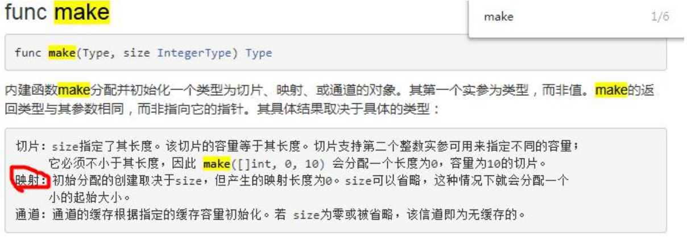

# 4 Map

## 定义/声明
<font style="color:rgb(51, 51, 51);">Map 是一种无序的键值对的集合。Map 最重要的一点是通过 key 来快速检索数据，key 类似于索引，指向数据的值。</font>

<font style="color:rgb(51, 51, 51);">Map 是一种集合，所以我们可以像迭代数组和切片那样迭代它。</font>

<font style="color:rgb(51, 51, 51);">不过，Map 是无序的，我们无法决定它的返回顺序，这是因为 Map 是使用 hash 表来实现的。</font>

```go
var a map[string]string
var a map[string]int
var a map[int]string
var a map[string]map[string]string
```

注1：声明是不会分配内存的，初始化需要make，分配内存后才能赋值和使用。

```go
a = make(map[string]string,10)
```

注2：map的key是不能重复的，如果重复了，则以最后的key-value为准

注3：map的value是可以相同的

注4：map的key-value是无需

注5：make内置函数数目



## map的三种用法
### 第一种
```go
var a map[string]string
a = make(map[string]string,10)
a["x"] = "1"
```

### 第二种
```go
a := make(map[string]string)
a["x"] = "1"
```

### 第三种
```go
a := map[string]string{
    "x":"1",
    "y":"2",
    "z":"3",
}
a["q"] = "4"
```

## 实例练习
```go
package main

import "fmt"

func main() {
	m := map[string] string{
		"name":"ccmouse",
		"course":"golang",
		"site":"imooc",
		"quality":"notbad",
	}
	//创建
	m2 := make(map[string] int)// m2 == empty map

	var m3 map[string]int //m3 == nil

	fmt.Println(m,m2,m3)
	for k,v := range m{
		fmt.Println(k,v)
	}
	fmt.Println("Getting values")
	courseName := m["course"]
	fmt.Println(courseName)
	causeName := m["cause"]//不存在的拿到空串（初始值）
	fmt.Println(causeName)
	//判断存在不存在
	if causeName1,ok := m["cause"];ok {
		fmt.Println(causeName1)
	} else {
		fmt.Println("Key does not exist")
	}
	//删除
	fmt.Println("Deleting values")
	name, ok := m["name"]
	fmt.Println(name,ok)
	delete(m,"name")
}

```


> 更新: 2022-05-16 23:14:38  
> 原文: <https://www.yuque.com/xiaoshan_wgo/codingnotes/scfyug>