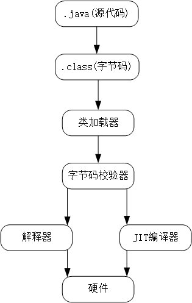

# 【1】JVM 概述

Java 程序之所以能够实现跨平台，本质就是因为它是运行在虚拟机之上的，而不同平台只需要安装对应平台的 Java 虚拟机即可运行（在JRE中包含），所有的 Java 程序都采用统一的标准，在任何平台编译出来的字节码文件 (.class) 也是同样的，最后实际上是将编译后的字节码交给 JVM 处理执行。

得益于这种统一规范，除了 Java 以外，还有多种 JVM 语言，比如 Kotlin、Groovy 等，它们的语法虽然和 Java 不一样，但是最终编译得到的字节码文件，和 Java 是同样的规范，同样可以交给 JVM 处理。

# 虚拟机
虚拟机的具体定义，我们所接触过的虚拟机有安装操作系统的虚拟机，也有我们的Java虚拟机，而它们所面向的对象不同，Java 虚拟机只是面向单一应用程序的虚拟机，但是它和我们平时接触的系统级虚拟机一样，我们也可以为其分配实际的硬件资源，比如最大内存大小等。

并且Java虚拟机并没有采用传统的PC架构，比如现在的HotSpot虚拟机，实际上采用的是`基于栈的指令集架构`，而我们的传统程序设计一般都是`基于寄存器的指令集架构`，回顾一下`计算机组成原理`中的 CPU 结构：

# 虚拟机的发展历程
随着时代的变迁，JVM 的实现多种多样，而我们还要从最初的虚拟机说起。

在 1996，Java1.0 面世时，第一款商用虚拟机 Sun Classic VM 开始了它的使命，这款虚拟机提供了一个 Java 解释器，也就是将我们的 class 文件进行读取，最后像上面一样得到一条一条的命令，JVM 再将指令依次执行。虽然这样的运行方式非常的简单易懂，但是它的效率实际上是很低的，就像在耳机里一边在放六级听力，又必须同时记在脑海里面然后等着问问题，再去选择问题的答案一样，更重要的是同样的代码每次都需要重新翻译再执行。

这个时候我们就需要更加高效的方式来运行 Java 程序，随着后面的发展，现在大多数的主流的 JVM 都包含即时**编译器**。JVM 会根据当前代码的进行判断，当虚拟机发现某个方法或代码块的运行特别频繁时，就会把这些代码认定为“热点代码”。为了提高热点代码的执行效率，在运行时，虚拟机将会把这些代码编译成与本地平台相关的机器码，并进行各种层次的优化，完成这个任务的编译器称为**即时编译器（Just In Time Compiler，JIT ）**。

在JDK1.4时，Sun Classic VM完全退出了历史舞台，取而代之的是至今都在使用的**HotSpot VM**，它是目前使用最广泛的虚拟机，拥有上面所说的热点代码探测技术、准确式内存管理（虚拟机可以知道内存中某个位置的数据具体是什么类型）等技术。

> 更新: 2025-05-14 20:22:55  
> 原文: <https://www.yuque.com/xiaoshan_wgo/codingnotes/ozz9dng2sp4cswmk>