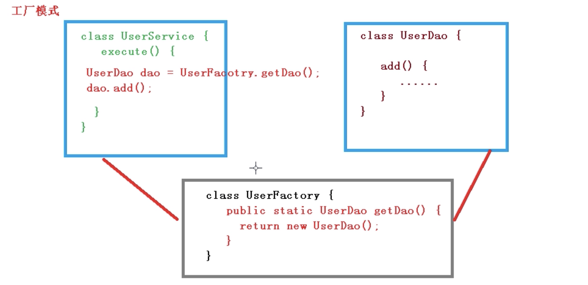
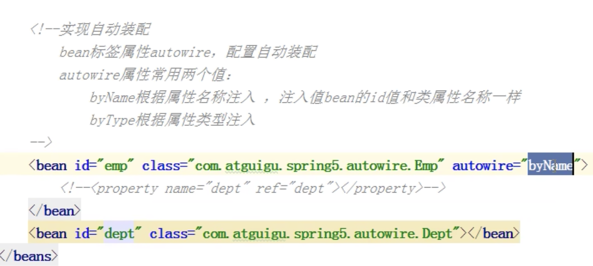

# 【1】 IOC 容器

# IOC 的概念
**IOC 控制反转**，是面向对象编程中的一种设计原则，可以用来降低计算机代码之间的耦合度。

1. 控制反转，把对象创建和对象之间的调用过程，交给 Spring 进行管理
2. 使用 IOC 目的，为了耦合度降低

将对象之间的相互依赖关系交给 IoC 容器来管理，并由 IoC 容器完成对象的注入。

这样可以很大程度上简化应用的开发，把应用从复杂的依赖关系中解放出来。 

IoC 容器就像是一个工厂一样，当我们需要创建一个对象的时候，只需要配置好配置文件/注解即可，完全不用考虑对象是如何被创建出来的。

在实际项目中一个 Service 类可能依赖了很多其他的类，假如我们需要实例化这个 Service，你可能要每次都要搞清这个 Service 所有底层类的构造函数，这可能会把人逼疯。

如果利用 IoC 的话，只需要配置好，然后在需要的地方引用就行了，这大大增加了项目的可维护性且降低了开发难度。

# IOC 的引入
**xml 解析、工厂模式、反射**

原始方法，创建对象，调用方法。

缺点是耦合度太高了。


**工厂模式**



**IOC 过程**

首先是创建xml文件来进行创建的对象的配置

然后使用工厂类对xml进行解析，

解析后通过反射来创建对象，classValue 就是 xml 里面的 com.atguigu.UserDao。

最后返回这个类


这个时候只需要修改 xml 配置文件里面的对象路径就可以了。

# IOC 接口（BeanFactory）
1. IOC 思想基于 IOC 容器完成，IOC 容器底层就是对象工厂
2. Spring 里面提供了 IOC 容器实现的两种方式（两个接口）。
    1. BeanFactory：IOC 容器最基本的实现方式，是 Spring 内部的使用的接口，不提供开发人员使用【特点是，加载配置文件的时候不会创建对象，在获取（使用）对象的时候才会创建对象。】
    2. ApplicationContext：BeanFactory 接口的子接口，提供更大更强大的功能，**一般由开发人员使用**【特点是，加载配置文件的时候就会在配置文件对象进行创建。】
3. ApplicationContext 接口有实现类
    1. FileSystemXmlApplicationContext：写文件的全路径（绝对路径）
    2. ClassPathXmlApplicationContext：写类的路径【通常使用】
4. BeanFactory 下面有个子接口 ConfigurableApplictionContext 拓展使用。

# XML Bean 管理
## 什么是 Bean 管理？
Bean 管理指的是两个操作。

Bean有两个操作：

1. Spring 创建对象
2. Spring 注入属性

Bean 管理操作有两种方式：

1. 基于 XML 配置文件方式实现
2. 基于注解方式实现

## 基于 xml 配置文件方式实现
1. **基于 XML 方式创建对象**

```java
<bean id="user" class="com.javastudy.spring5"> </bean>
```

在 spring 配置文件中，使用 bean 标签，标签里面添加对应属性，就可以实现对象创建

在 bean 标签有很多属性：

+ id 属性：唯一的标识
+ class 属性：创建的类的全路径（包类的路径）
+ name 属性：可以用特殊符号，功能类似 id 属性

创建对象时候，默认也是执行无参数构造方法完成对象创建。

2. **基于 XML 方式注入属性**

DI：依赖注入，就是注入属性（DI 是 IOC 的特殊实现）。

依赖注入，前提必须有 IOC 的环境，Spring 管理这个类的时候将类的依赖的属性注入（设置）进来。就是 spring在帮我们创建这个类的实例当中，发现这个类中有一个属性，帮我们把这个属性设置进来。

1. 第一种注入方式，使用 set 方法进行注入
2. 第二种注入方式，使用参数构造进行注入

### set 方法注入
```java
package com.javastudy.spring5;
public class Book{
    //创建属性
    private String bname;
    private String bauthor;
    //set 方法注入
    public void setBname(String bname){
        this.bname= bname;
    }
    public void setBauthor(String bauthor){
        this.bauthor= bauthor;
    }
    //有参数构造注入
    public Book(String bname){
        this.bname = bnmame;
    }
}
```

传统方式是使用 new 创建对象，然后调用 set 方法。

在 spring 配置文件配置对象创建，配置属性注入。

```xml
<?xml version="1.0" encoding="UTF-8"?>
<beans xmlns="http://www.springframework.org/schema/beans"
  xmlns:xsi="http://www.w3.org/2001/XMLSchema-instance"
  xsi:schemaLocation="http://www.springframework.org/schema/beans
  http://www.springframework.org/schema/beans/spring-beans.xsd">
  <bean id="userDao" class="com.javastudy.spring5">
  <!--使用 property 完成属性注入
    name：类里面属性名称
    value：向属性注入的值
    -->
    <property name="bname" value="活着"></property>
  </bean>
</beans>
```

```java
package com.javastudy.spring5;
import org.springframework.context.ApplicationContext;
import org.springframework.context.support.ClassPathXmlApplicationContext;
public class TestIOC{
    public static void main(String[] args){
        //1. 初始化 spring 容器，加载配置文件
        ApplicationContext applicationContext = new ClassPathXmlApplication("bean1.xml");
        //2. 加载配置文件时候，对 Bean 进行实例化 
        Book book = applicationContext.getBean("book",Book.class);
        System.out.println(book);
        book.testDemo();
    }
}
```

### 有参构造进行注入
1. 创建类，定义属性

```java
package com.javastudy.spring5;
public class Orders{
    //创建属性
	private Stirng oname;
    private String address;
    public Orders(String oname, String address){
        this.oname = oname;
        this.address = address;
    }
}
```

2. 在 spring 配置文件中进行配置

```xml
<?xml version="1.0" encoding="UTF-8"?>
<beans xmlns="http://www.springframework.org/schema/beans"
  xmlns:xsi="http://www.w3.org/2001/XMLSchema-instance"
  xsi:schemaLocation="http://www.springframework.org/schema/beans
  http://www.springframework.org/schema/beans/spring-beans.xsd">
  <bean id="userDao" class="com.javastudy.spring5">
    <!--使用 property 完成属性注入
    name：类里面属性名称
    value：向属性注入的值
    <property name="bname" value="活着"></property>
     -->
    <bean id="orders" class="com.javastudy.spring5">
      <constructor-arg name="oname" value="电脑"></constructor-arg>
      <constructor-arg name="address" value="China"></constructor-arg>
    </bean>
  </bean>
</beans>
```

3. 测试

```java
package com.javastudy.spring5.testDemo;
@Test
public void testOrders(){
    ApplicationContext context = new ClassPathXmlApplicationContext("bean1.xml");
    Orders orders = context.getBean("orders",Orders.class);
    System.out.println(orders);
    orders.testDemo();
}
```

### set 注入的写法简化 - p名称空间注入（了解）
1. 使用 p 名称空间注入，可以简化基于 xml 配置方式
    1. 添加 p 名称空间在配置文件中
    2. 进行属性注入，在 bean 标签里面进行操作

```xml
<?xml version="1.0" encoding="UTF-8"?>
<beans xmlns="http://www.springframework.org/schema/beans"
  xmlns:xsi="http://www.w3.org/2001/XMLSchema-instance"
  xmlns:p="http://www.springframework.org/schema/p"
  xsi:schemaLocation="http://www.springframework.org/schema/beans
  http://www.springframework.org/schema/beans/spring-beans.xsd">
  <bean id="book" class="com.javastudy.spring5.Book" p:bname="活着" p.bauthor="余华">
  </bean>
</beans>
```

###  XML 其它类型的注入其他类型属性
前面的类型都是String，现在看看其他的类型怎么注入。

这里有个字面量的概念，大致意思就是字面上就能看到量的变量。

+ NULL 值
+ 属性值包含特殊符号

#### Null 
```java
public class Book{
    private String bname;
    private String bauthor;
    private String address;
    public void setBname(String bname){this.bname = bname;}
    public void setBauthor(String bauthor){this.bauthor = bauthor;}
    public void setAddress(String address){this.address = address;}
}
public void testDemo(){
    System.out.println(bname+"::"+bauthor+"::"+address);
}


```

如果是正常有值进行注入的话：

```xml
<?xml version="1.0" encoding="UTF-8"?>
<beans xmlns="http://www.springframework.org/schema/beans"
  xmlns:xsi="http://www.w3.org/2001/XMLSchema-instance"
  xsi:schemaLocation="http://www.springframework.org/schema/beans
  http://www.springframework.org/schema/beans/spring-beans.xsd">
  <bean id="userDao" class="com.javastudy.spring5">
  <!--使用 property 完成属性注入
    name：类里面属性名称
    value：向属性注入的值
    -->
    <property name="bname" value="活着"></property>
    <property name="bauthor" value="余华"></property>
    <property name="address" value="北京"></property>
    
  </bean>
</beans>
```

但是如果这个地址是一个空值（NULL）那应该怎么办呢？

```xml
<?xml version="1.0" encoding="UTF-8"?>
<beans xmlns="http://www.springframework.org/schema/beans"
  xmlns:xsi="http://www.w3.org/2001/XMLSchema-instance"
  xsi:schemaLocation="http://www.springframework.org/schema/beans
  http://www.springframework.org/schema/beans/spring-beans.xsd">
  <bean id="userDao" class="com.javastudy.spring5">
  <!--使用 property 完成属性注入
    name：类里面属性名称
    value：向属性注入的值
    -->
    <property name="bname" value="活着"></property>
    <property name="bauthor" value="余华"></property>
    <property name="address">
      </null>
    </property>
    
  </bean>
</beans>
```

如上，在 property 里面写一个`</null>`标签。

#### 特殊符号
下面这种写法是错误的。<< 是特殊符号。

```xml
<property name="bname" value="<<活着>>"></property>
```

我们需要把它进行转义。

```xml
<property name="bname">
  <value><![CDATA[<活着>>]]></value>
</property>
```

### 注入属性 - 外部 Bean
什么是外部 Bean？

1. 创建两个类，service 类和 dao 类
2. 在 service 调用 dao 里面的方法

```java
package com.javastudy.spring5.service;
public class UserService{
    public void add(){
        System.out.println("service add...");
        //普通方式是在service 里面创建个对象
        UserDao dao = new UserDaoImpl();
        dao.update();
    }
}
```

```java
package com.javastudy.spring5.dao;
public interface UserDao{
    public void update();
}
```

```java
package com.javastudy.spring5.dao;
public class UserDaoImpl implements UserDao{
    @Override
    public void update(){
        System.out.println("dao update ...");
    }
}
```

3. 在 spring 的配置文件中进行配置

这个时候我们想要注入 UserDao 这个对象类型。

```java
package com.javastudy.spring5.service;
import com.javastudy.spring5.dao.UserDao;

public class UserService{
    private UserDao userDao;
    public void setUserDao(UserDao userDao){
        this.userDao = userDao;
    }
    public void add(){
        System.out.println("service add...");
        userDao.update();
    }
}
```

```xml
<?xml version="1.0" encoding="UTF-8"?>
<beans xmlns="http://www.springframework.org/schema/beans"
  xmlns:xsi="http://www.w3.org/2001/XMLSchema-instance"
  xsi:schemaLocation="http://www.springframework.org/schema/beans
  http://www.springframework.org/schema/beans/spring-beans.xsd">
  <!--1 service 和 dao 对象创建 -->
  <bean id="userService" class="com.javastudy.spring5.UserService">	
  <!--注入userDao对象
      name属性值：类里面属性名称
      ref属性，创建userDao对象bean标签id值
    -->
    <property name="userDao" ref="userDao"></property>
  </bean>
  <bean id="userDao" class="com.javastudy.spring5.UserDaoImpl">	</bean>

  
</beans>
```

第 8 行 ，要在class里面写上类的路径，但是由于 interface 没有方法的实现，所以我们放 UserDaoImpl。

  <bean id="userDao" class="com.javastudy.spring5.UserDaoImpl">	</bean>

```java
public class TestBean{
    public void testAdd(){
        //1.加载spring配置文件
        ApplicationContext context = new ClassPathXmlApplicationContext("bean2.xml");
        //2.获取配置创建的对象
        UserService userService = context.getBean("userService",UserService.class);
        userService.add();
    }
}
```

执行结果：

```shell
service add...
dao update ...
```

### 注入属性 - 内部 bean和级联赋值
#### 内部 bean
1. 一对多的关系：部门和员工，一个部门有多个员工，一个员工只有一个部门；
2. 在实体类来表示一对多关系（一个表就是一个类），员工所属的部门属性，用对象类型来表示；

```java
package com.javastudy.spring5.bean;

public class Dept{
    private String dname;
    public void setDname(String dname){
        this.dname = dname;
    }
}
```

```java
package com.javastduy.spring5.bean;
public class Emp{
    private String ename;
    private String gender;
    //员工属于某一个部门，用 Dept 对象来表示
    private Dept dept;
    public void setDept(Dept dept){
        this.dept = dept;
    }
    public void setEname(String ename){
        this.ename = ename;
    }
    public void setGender(String gender){
        this.gender = gender;
    }
}
```

这样我们就建立了两个类，这两个类之间还没有建立关系。

怎么表示多个员工？

3. 在 Spring 配置文件中进行相关配置

```xml
<?xml version="1.0" encoding="UTF-8"?>
<beans xmlns="http://www.springframework.org/schema/beans"
  xmlns:xsi="http://www.w3.org/2001/XMLSchema-instance"
  xsi:schemaLocation="http://www.springframework.org/schema/beans
  http://www.springframework.org/schema/beans/spring-beans.xsd">
  <!--内部bean -->
	<bean id="emp" class="com.javastudy.spring5.bean.Emp">
    <!--设置两个普通属性-->
    <property name="dept">
      <bean id="dept" class="com.javastudy.spring5.bean.Dept">
        <property name="dname" value="软件研发部"></property>
      </bean>
      </property>
</beans>
```

在一个 bean 里面嵌套了另外一个 bean，这就叫做内部 bean。

#### 级联赋值
修改 xml 文件

```xml
<?xml version="1.0" encoding="UTF-8"?>
<beans xmlns="http://www.springframework.org/schema/beans"
  xmlns:xsi="http://www.w3.org/2001/XMLSchema-instance"
  xsi:schemaLocation="http://www.springframework.org/schema/beans
  http://www.springframework.org/schema/beans/spring-beans.xsd">
  <!--内部bean -->
	<bean id="emp" class="com.javastudy.spring5.bean.Emp">
    <!--设置两个普通属性-->
    <property name="ename" value="lucy"></property>
    <property name="gender" value="lucy"></property>
    <!--级联赋值-->
    <property name="dept"></property>
    </bean>
      <bean id="dept" class="com.javastudy.spring5.bean.Dept">
        <property name="dname" value="软件研发部"></property>
      </bean>
</beans>
```

### 注入集合属性
1. 注入数组类型的属性
2. 注入list集合类型的属性
3. 注入Map集合类型的属性

#### 注入数组类型的属性
```java
import java.util.List;
import java.util.Map;
import java.util.Set;
public class Stu{
    //1 数组类型属性
    private String[] courses;
    //2 list集合类型属性
    private List<String> list;
    //3 map集合类型属性
    private Map<String,String> maps;
    //4 set集合类型属性
    private Map<String,String> sets;
    public void setSets(Set<String> sets){
        this.set = set;
    }
    public void setCourses(String[] courses){
        this.courses = courses;
    }
    public void setList(List<String> list){
        this.list = list;
    }
    public void setMap(Map<String,String> maps){
        this.maps = maps;
    }
}
```

```xml
<?xml version="1.0" encoding="UTF-8"?>
<beans xmlns="http://www.springframework.org/schema/beans"
  xmlns:xsi="http://www.w3.org/2001/XMLSchema-instance"
  xsi:schemaLocation="http://www.springframework.org/schema/beans
  http://www.springframework.org/schema/beans/spring-beans.xsd">

  <!--1 集合类型属性注入 -->
  <property name="courses">
    <array>
      <value>java课程</value>
      <value>数据库课程</value>
    </array>
  </property>

  <!--2 list类型属性注入 -->
  <property name="list">
    <list>
      <value>张三</value>
      <value>法外狂徒</value>
    </list>
  </property>

  <!--3 map类型属性注入 -->
  <property name="maps">
    <map>
      <entry key="JAVA" value="java"></entry>
      <entry key="PHP" value="php"></entry>
    </map>    
  </property>

  <!--4 sets类型属性注入 -->
  <property name="sets">
    <sets>
      <value>Mysql</value>
      <value>Redis</value>
    </sets>    
  </property>
</beans>
```

### XML 自动装配（少用）
自动装配就是根据指定装配规则（属性名称或者属性类型），Spring 自动将匹配的属性值进行注入。

还是使用部门和员工的例子：

```java
package com.javastudy.spring5.autowrie;
public class Emp{
    private Dept dept;
    public void setDept(Dept dept){
        this.dept = dept;
    }

    @Override
    public String toString(){
        return "Emp{"+
            "dept=" + dept +
            '}';
    }
    public void test(){
        System.out.println(dept);
    }
}
```

```java
package com.javastudy.spring5.autowrie;
public class Dept{
    private String toString{
        return "Dept{}";
    }
}
```

普通方式可以使用外部 bean 的方式进行注入。那么自动装配的 bean 是怎么实现的呢？

Bean 标签中有一个属性叫做 autowrie 可以实现自动装配。

+ byName 根据属性名称注入，注入值 bean 的 id 值和类属性名称一样
+ byType 根据属性类型注入

```xml
<bean id="emp" class="com.javastudy.spring5.autowire.Emp" autowire="byName">
</bean>
<bean id="dept " class="com.javastudy.spring5.autowire.Emp">
</bean>


```



## FactoryBean 的创建
Spring 有两种 Bean，一种是普通的 Bean，另一种是 FactoryBean。

普通 Bean：在 Spring 里面， 配置文件中定义的类型就是返回的类型。

工厂 Bean：在配置文件定义 bean 类型可以和返回类型不一样。

创建工厂 Bean 有以下两步：

+ 第一步，创建类，让这个类作为工厂 bean，实现接口 FactoryBean。
+ 第二步，实现接口里面的方法，在实现的方法中定义返回的 bean 类型。

**第一步：创建类**

```java
package	com.javastudy.spring5.factorybean;
public class MyBean{
    
}
```

把对象通过配置文件创建出来：

```xml
<?xml version="1.0" encoding="UTF-8"?>
<beans xmlns="http://www.springframework.org/schema/beans"
  xmlns:xsi="http://www.w3.org/2001/XMLSchema-instance"
  xsi:schemaLocation="http://www.springframework.org/schema/beans
  http://www.springframework.org/schema/beans/spring-beans.xsd">
  <bean id="myBean" class="com.javastudy.spring5.factorybean.MyBean"></bean>
</beans>
```

输出一下这个 Bean

```java
public void test3(){
    ApplicationContext context = new ClassPathXmlApplicationContext("bean3.xml");
    //返回类型也是 MyBean,普通 Bean
    MyBean myBean = context.getBean("myBean",MyBean.class);
    System.out.println(myBean);
}
```

**第二步：实现接口里面的方法**

想要变成 FactoryBean 需要让 MyBean 实现一个 FactoryBean 接口：

```java
package	com.javastudy.spring5.factorybean;
public class MyBean implements FactoryBean<Course>{
    //定义返回 bean
    @Override
    public Course getObject() throws Exception{
        Course course = new Course();
        course.setCname("abc");
        return course;
    }
    
}
```

这个时候这个测试的第 4 行里面应该进行修改。

```java
public void test3(){
    ApplicationContext context = new ClassPathXmlApplicationContext("bean3.xml");
    //返回类型也是 MyBean,普通 Bean
    MyBean myBean = context.getBean("myBean",Course.class);
    System.out.println(myBean);
}
```

# Bean 的作用域
什么是 Bean 的作用域？

有两个知识点需要了解：

1. 在 Spring 里面，设置创建 bean 实例是单实例还是多实例
2. 在 Spring 里面，默认情况下，bean 是单实例对象


想要设置单实例还是多实例，在 Spring 配置文件 bean 标签里面有属性（scope）用于设置单实例还是多实例。

scope 属性值有两个值：

+ 默认值，singleton，表示是单实例对象
+ prototype 表示是多实例对象

```xml
<bean id="book" class="com.javastudy.spring5.collectiontype.Book" scope="singleton">
  <property name="list" ref="bookList"></property>
</bean>
```

singleton 和 prototype 区别：

+ singleton 单实例，prototype 多实例
+ 设置 scope 值是 singleton 时候，加载 spring 配置文件时候就会创建单实例对象；设置 scope 值是 prototype 时候，不是在加载 spring 配置文件时候创建对象，在调用 getBean 方法时候创建多实例对象

# Bean 生命周期（重点）
参考文章：

[Spring Bean的生命周期（非常详细） - Chandler Qian - 博客园](https://www.cnblogs.com/zrtqsk/p/3735273.html)

生命周期就是从对象创建到对象销毁的过程。

在 Spring 的 IOC 容器中可以管理 bean 的生命周期，Spring 允许在 bean 生命周期内特定的时间点执行指定的任务。

生命周期有以下：

1. 通过构造器创建 bean 实例（无参数构造）
2. 为 bean 的属性设置值和对其他 bean 引用（调用 set 方法）
3. 调用 bean 的初始化的方法（需要进行配置初始化的方法）
4. bean 可以使用了（对象获取到了）
5. 当容器关闭时候，调用 bean 的**销毁方法**（需要进行配置销毁的方法）

**这里需要引入 Bean 后置处理器的概念：**

什么是 bean 的后置处理器？bean 后置处理器允许在调用初始化方法前后对 bean 进行额外的处理。

加入后置处理器之后生命周期变为 7 步：

1. 通过构造器创建 bean 实例（无参数构造）
2. 为 bean 的属性设置值和对其他 bean 引用（调用 set 方法）
3. **把 bean 实例传递 bean 后置处理器的方法**
4. 调用 bean 的初始化的方法（需要进行配置初始化的方法）
5. **把 bean 实例传递 bean 后置处理器的方法**
6. bean 可以使用了（对象获取到了）
7. 当容器关闭时候，调用 bean 的**销毁方法**（需要进行配置销毁的方法）

# 注解 Bean 管理
## 什么是注解
1. 注解是代码的特殊标记。格式：@注解名称（属性名称=属性值，属性名称=属性值...）
2. 使用注解，注解作用在类上面，方法上面，属性上面
3. 使用注解的目的：简化 xml 配置

## 常见注解及开发流程
@Component： 游戏中普通的注解

@Service ：业务逻辑层以及Service层

@Controller： 外部层

@Repository ：dao层即持久层

功能是一样的，都可以用来创建对象，只不过把每个对象用在不同地方，以便查看。

### 对象的创建
**第一步：**引入 AOP 的依赖


**第二步**：开启组件扫描

```xml
<?xml version="1.0" encoding="UTF-8"?>

<beans xmlns="http://www.springframework.org/schema/beans"
  xmlns:xsi="http://www.w3.org/2001/XMLSchema-instance"
  xmlns:context="http://www.springframework.org/schema/context"
  xsi:schemaLocation="http://www.springframework.org/schema/beans

  http://www.springframework.org/schema/beans/spring-beans-3.0.xsd
  http://www.springframework.org/schema/context
  http://www.springframework.org/schema/context/spring-context-3.0.xsd">

  <!--开启组件扫描
  1.如果扫描多个包，多个包使用逗号隔开
  2. 扫描包上层目录
  -->
  <context:component-scan base-package="com.javastudy"></context:component-scan>  
</beans>
```

base-package如果定义多个包，可以加全路径，分别用逗号隔开 或者 是放置上层目录。

**第三步：**创建类，在类上面添加创建对象注解。

```java
package com.javastudy.spring5.service;
import org.springframework.sterotype.Component;
//在注解里面value属性值可以省略不写
//默认值是类名称，首字母小写
@Component(value = "userService") //<bean id="userService" class=".."/>
//@Repository 也可以实现一样的效果
public class UserService{
    public void add(){
        System.out.println("service add...");
    }
}
    
```

```java
import org.springframework.context.support.ClassPathXmlApplicationContext;
public class TestSpring5Demo1{
	@Test
    public void testService(){
        ApplicationContext context = new ClassXmlApplicationContext("bean1.xml");
        UserService userService = context.getBean("userService",UserService.class);
        System.out.println(userService);
        userService.add();
    }
}
```

**第四步：**开启组件扫描细节配置。

如果引入的包中不加说明，默认会被所有包都扫描了。

所以我们可以加一些说明，过滤或者添加说明只扫描一些包。

自定义一个过滤，定义扫描的注解类。

+ use-default-filters="false" 表示现在不使用默认 filter，自己配置 filter
+  context:include-filter，设置扫描哪些内容
+  type 只扫描这种注解类
+  expression 表示扫描的为该注解类

```xml
<!--示例 1
-->
<context:component-scan base-package="com.javastudy" use-defaultfilters="false">
  <context:include-filter type="annotation"
    expression="org.springframework.stereotype.Controller"/><!--代表只扫描Controller注解的类-->
</context:component-scan>
```

不定义一个过滤，扫面的所有内容，但可设置内容不扫描。

context:exclude-filter： 设置哪些内容不进行扫描。

```xml
<!--示例 2
-->
<context:component-scan base-package="com.atguigu">
 <context:exclude-filter type="annotation"
expression="org.springframework.stereotype.Controller"/><!--表示Controller注解的类之外一切都进行扫描-->
</context:component-scan>
```

**第五步：基于注解方式实现属性注入**

1. **把 service 和 dao 对象创建，在 service 和 dao 类添加创建对象注解；**
2. **在 service 注入 dao 对象，在 service 类添加 dao 类型属性，在属性上面使用注解。（实现属性注入）**

定义两个类，一个接口实现类，一个类写函数

接口实现类：

```java
@Repository(value = "userDaoImpl1")
public class UserDaoImpl implements UserDao {
    @Override
    public void add() {
        System.out.println("dao add.....");
    }
}
```

`@Autowired`：根据属性类型自动装配

```java
@Autowired  //根据类型进行注入
private UserDao userDao;
```

`@Qualifier(value=" ")`：根据属性名称自动注入

```java
@Autowired  //根据类型进行注入
@Qualifier(value = "userDaoImpl1") //根据名称进行注入
private UserDao userDao;
```

`@Resource`：可根据属性类型或者名称注入

```java
@Resource(name = "userDaoImpl1")  //根据名称进行注入
private UserDao userDao;
```

`@Value：`注入普通类型的注入

注解不是对象类型的定义，可以是字符串等其他

```java
@Value(value = "abc")
private String name;
```

## <font style="color:rgb(0, 0, 0);">完全注解开发</font>
完全注解开发指的是，不使用 xml 配置文件。完全地使用注解开发。

主要是引用两个注解：

`@Configuration` 作为配置类的提示

`@ComponentScan` 扫描配置类的注解

创建配置类，替代 xml 配置文件。

```java
@Configuration  //作为配置类，替代xml配置文件
@ComponentScan(basePackages = {"com.atguigu"})
public class SpringConfig {

}

```

测试类和之前不一样，

之前是加载配置文件 xml，

现在是 new 一个对象，对象为注解的配置类，即加载这个配置类 AnnotationConfigApplicationContext。

```java
@Test
public void testService2() {
    //加载配置类
    ApplicationContext context
            = new AnnotationConfigApplicationContext(SpringConfig.class);
    UserService userService = context.getBean("userService", UserService.class);
    System.out.println(userService);
    userService.add();
}

```


> 更新: 2024-03-29 22:55:09  
> 原文: <https://www.yuque.com/xiaoshan_wgo/codingnotes/uwkbbnekgkzz4tgg>