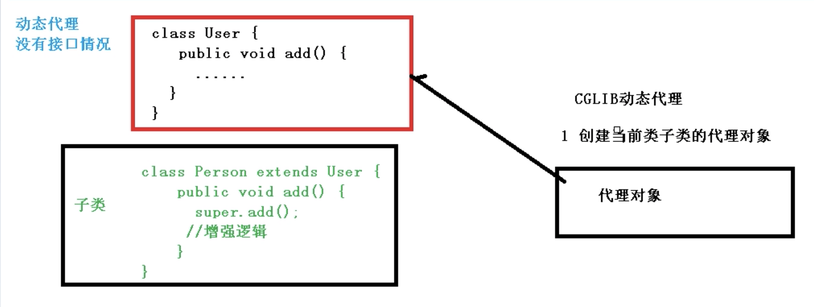

# 【2】 AOP 面向切面+动态代理思想

 IOC 为控制反转，把创建对象过程交给 spring 进行管理。

AOP 的概念为：

AOP 为面向切面，不修改源代码进行功能增强。

<u>可以对业务逻辑的各个部分进行隔离，从而使得业务逻辑各部分之间的耦合度降低，提高程序的可重用性，同时提高了开发的效率。</u>

不通过修改源代码的方式，在主干功能里面，可以添加一个新的功能。

人话：一段代码前后加上通用的代码逻辑。

# 底层原理
AOP 的底层是使用动态代理。

动态代理有两种情况：

第一种，有接口情况，使用 JDK 动态代理

第二种，没有接口的情况，使用 CGLIB 动态代理

下面对这两种情况进行解释：

## 有接口情况：JDK 动态代理
左边：是个接口和接口实现的代码。

右边：创建 UserDao 接口实现类代理对象，增强类的方法。

## 没有接口的情况，CGLIB 动态代理
创建子类的代理对象，增强类的方法。

# JDK 的动态代理
使用 JDK 动态代理，使用 Proxy 类。

java lang 包里面有个类 Proxy。

这个类有一个方法，newProxyInstance 返回指定接口的代理类的实例，该接口将方法调用分派给指定的调用处理程序。

+ newProxyInstance(ClassLoader loader, 类<?>[] interfaces, InvocationHandler h) 返回指定接口的代理类的实例，该接口将方法调用分派给指定的调用处理程序。

obj 指代理类，method 是被代理的方法，args 为该方法的参数数组。

这个抽象方法在代理类中动态实现。

主要传参数通过 method 中的一个 invoke 的方法。

+ public Object invoke(Object obj,Method method, Object[] args)

> 更新: 2024-03-12 21:26:41  
> 原文: <https://www.yuque.com/xiaoshan_wgo/codingnotes/lx7eqaa65f5lpcbw>