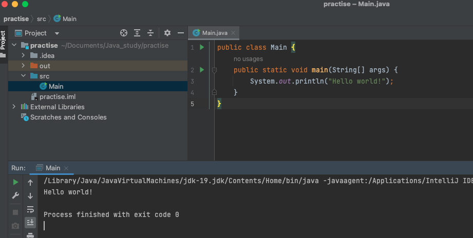
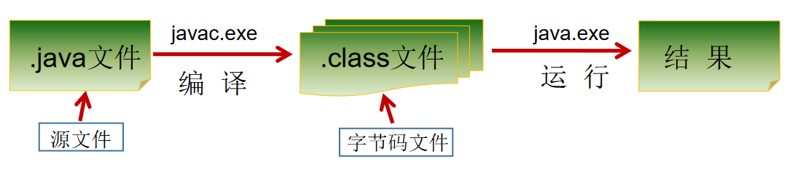

# 【1】 Hello Java

```java
public class Main {
    public static void main(String[] args) {
        System.out.println("hello world");

    }
}    
```



IDEA 省略了，Java 程序编译的过程。

java 文件编译的过程如图所示。



+ Java 源文件以“java”为扩展名。源文件的基本组成部分是类（class），如本例中的 HelloWorld 类。
+ Java 应用程序的执行入口是 main() 方法。它有固定的书写格式：
+ public static void main(String[] args) {…}
+ Java 语言**严格区分大小写。**
+ Java 方法由一条条语句构成，每个语句以“;”结束。
+ 大括号都是成对出现的，缺一不可。
+ 一个源文件中最多只能有一个 public 类。其它类的个数不限，如果源文件包含一个 public 类，则文件名必须按该类名命名。


> 更新: 2022-12-11 21:46:05  
> 原文: <https://www.yuque.com/xiaoshan_wgo/codingnotes/uwquy6xqfpwggl0z>