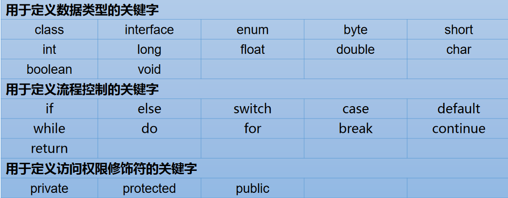
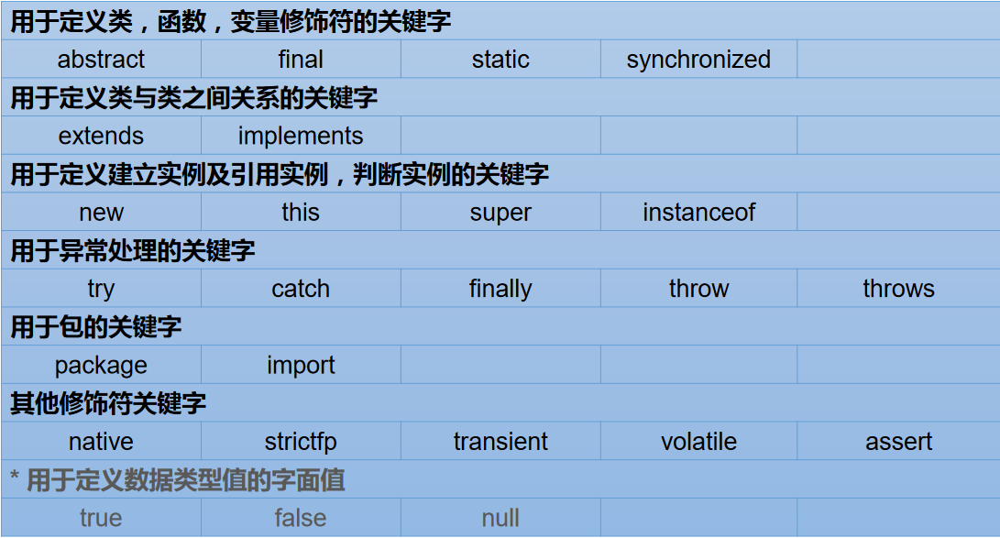
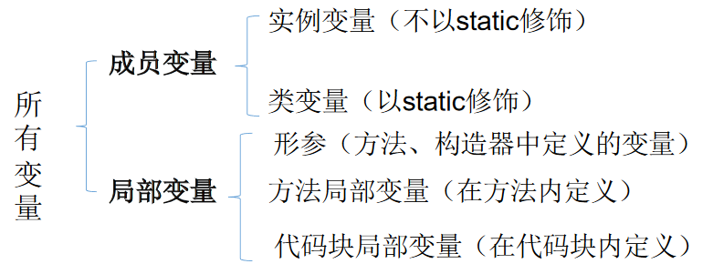
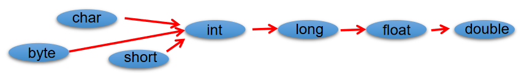
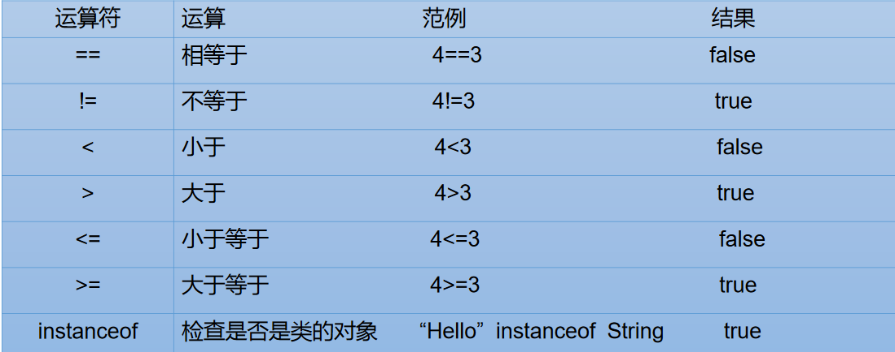
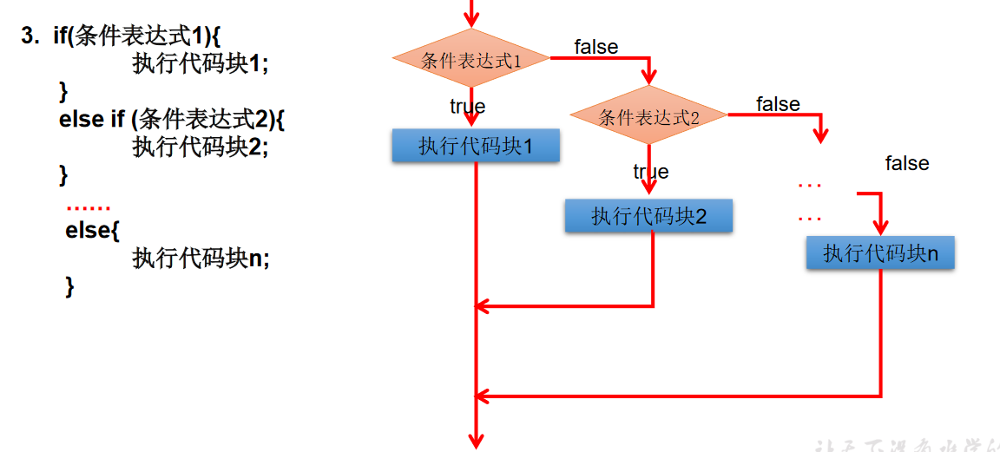

# 【3】 语法基础

# 关键字、变量、名称规范、数据类型
## 关键字
关键字均为小写





## 变量
+ 在方法体外，类体内声明的变量称为**成员变量**。
+ 在方法体内部声明的变量称为**局部变量**。



## 命名规范
### Java 中的名称命名规范
+ **<font style="color:rgba(0, 0, 0, 0.75);">包名</font>**<font style="color:rgba(0, 0, 0, 0.75);">：多单词组成时</font>**<font style="color:rgba(0, 0, 0, 0.75);">所有字母都小写</font>**<font style="color:rgba(0, 0, 0, 0.75);">：xxxyyyzzz</font>
+ **<font style="color:rgba(0, 0, 0, 0.75);">类名</font>**<font style="color:rgba(0, 0, 0, 0.75);">、</font>**<font style="color:rgba(0, 0, 0, 0.75);">接口名</font>**<font style="color:rgba(0, 0, 0, 0.75);">：多单词组成时，**</font>**<font style="color:rgba(0, 0, 0, 0.75);">所有单词的首字母大写</font>**<font style="color:rgba(0, 0, 0, 0.75);">：**XxxYyyZzz</font>
+ **<font style="color:rgba(0, 0, 0, 0.75);">变量名</font>**<font style="color:rgba(0, 0, 0, 0.75);">、方法名：多单词组成时，</font>**<font style="color:rgba(0, 0, 0, 0.75);">第一个单词首字母小写，第二个单词开始每个单词首字母大写：xxxYyyZzz（驼峰）</font>**
+ **<font style="color:rgba(0, 0, 0, 0.75);">常量名</font>**<font style="color:rgba(0, 0, 0, 0.75);">：</font>**<font style="color:rgba(0, 0, 0, 0.75);">所有字母都大写。多单词时每个单词用下划线连接：XXX_YYY_ZZZ</font>**

### 注意点
+ <font style="color:rgba(0, 0, 0, 0.75);">注意 1：在起名字时，为了提高阅读性，要尽量有意义，“见名知意”。</font>
+ <font style="color:rgba(0, 0, 0, 0.75);">注意 2：java 采用 unicode 字符集，因此标识符也可以使用汉字声明，但是不建议使用。</font>

## 数据类型


### 类型转换
+ <font style="color:rgba(0, 0, 0, 0.75);">自动类型转换：容量小的类型自动转换为容量大的数据类型。数据类型按容量大小排序为：  
</font>
+ <font style="color:rgba(0, 0, 0, 0.75);">有多种类型的数据混合运算时，系统首先自动将所有数据转换成容量最大的那种数据类型，然后再进行计算。</font>
+ **<font style="color:rgba(0, 0, 0, 0.75);">byte,short,</font>****<font style="color:rgba(0, 0, 0, 0.75);"> </font>****<font style="color:rgb(255, 112, 8);">char</font>****<font style="color:rgba(0, 0, 0, 0.75);"> </font>****<font style="color:rgba(0, 0, 0, 0.75);">(煤焦)</font>****<font style="color:rgba(0, 0, 0, 0.75);"> </font>****<font style="color:rgba(0, 0, 0, 0.75);">之间不会相互转换，他们三者在计算时首先转换为int类型</font>**<font style="color:rgba(0, 0, 0, 0.75);">。</font>
+ **<font style="color:rgba(0, 0, 0, 0.75);">boolean 类型不能与其它数据类型运算</font>**<font style="color:rgba(0, 0, 0, 0.75);">。</font>
+ **<font style="color:rgba(0, 0, 0, 0.75);">当把任何基本数据类型的值和字符串(String)进行连接运算时(+)，基本数据类型的值将自动转化为字符串(String)类型</font>**<font style="color:rgba(0, 0, 0, 0.75);">。</font>

```java
/*
基本数据类型之间的运算规则：

前提：这里讨论只是7中基本数据类型变量的运算。不包含boolean类型的。
1. 自动类型提升：
	当容量小的数据类型的变量和容量大的数据类型的变量做运算时，结果自动提升为容量大的数据类型。
	char、byte、short-->int-->long-->float-->double
	特别的：当byte、char、short三种类型的变量做运算时，结果为int类型

2. 强制类型转换：
说明：此时容量大小指的是，表示数的范围的大和小。比如：float容量要大于long的容量
*/
class VariableTest2{
	public static void main(String[] args) {
		byte b1 = 2;
		int i1 = 129;
		//编译不通过
//		byte b2 = b1 + i1;
		int i2 = b1 + i1;
		long l1 = b1 + i1;
		System.out.println(i2);
		System.out.println(l1);

		float f = b1 + i1;
		System.out.println(f);
		//***************特别的**************************
		char c1 = 'a';	//97
		int i3 = 10;
		int i4 = c1 + i3;
		System.out.println(i4);

		short s2 = 10;
		//编译错误
		//char c3 = c1 + s2;
		
		byte b2 = 10;
		//char c3 = c1 + b2;	//编译不通过
		//short s3 = b2 + s2;	//编译不通过
		//short s4 = b1 + b2;	//编译不通过
	}
}
class VariableTest4{
	public static void main(String[] args){
		//1. 编码情况
		long l = 123456;
		System.out.println(l);
		//编译失败：过大的整数
		//long l1 = 452367894586235;
		long l1 = 452367894586235L;

		//**************************
		//编译失败
		//float f1 = 12.3;
		//2. 编码情况2:
		//整型变量，默认类型为int型
		//浮点型变量，默认类型为double型
		byte b = 12;
	//	byte b1 = b + 1;	//编译失败
	//	float f1 = b + 12.3;	//编译失败
	}
}

```

### 引用数据类型的使用---字符串为例
```java
/*
String类型变量的使用
1. String属于引用数据类型
2. 声明String类型变量时，使用一对""
3. String可以和8种基本数据类型变量做运算，且运算只能是连接运算；+
4. 运算的结果任然是String类型

*/
class StringTest{
	public static void main(String[] args){

		String s1 = "Good Moon!";

		System.out.println(s1);

		String s2 = "a";
		String s3 = "";

		//char c = '';	//编译不通过，不能为空
		
		//*******************************
		int number = 1001;
		String numberStr = "学号:";
		String info = numberStr + number;	//连接运算
		boolean b1 = true;
		String info1 = info + true;
		System.out.println(info1);
	}
}

```


```java
String str1 = 4; //判断对错：no
String str2 = 3.5f + “”; //判断str2对错：yes
System.out.println(str2); //输出：”3.5”
System.out.println(3+4+“Hello!”); //输出：7Hello!
System.out.println(“Hello!”+3+4); //输出：Hello!34
System.out.println(‘a’+1+“Hello!”); //输出：98Hello!
System.out.println(“Hello”+‘a’+1); //输出：Helloa1
```

### 强制类型转换
+ 自动类型转换的逆过程，将容量大的数据类型转换为容量小的数据类型。使用时要加上强制转换符：()，但可能造成精度降低或溢出,格外要注意。
+ 通常，字符串不能直接转换为基本类型，但通过基本类型对应的包装类则可以实现把字符串转换成基本类型。
+ 如：String a = “43”; inti= Integer.parseInt(a);
+ boolean 类型不可以转换为其它的数据类型。

```java
short s = 5;
s = s-2; //判断：no
byte b = 3;
b = b + 4;//判断：no
b = (byte)(b+4);//判断：yes
char c = ‘a’;
int i = 5;
float d = .314F;
double result = c+i+d; //判断：yes
byte b = 5;
short s = 3;
short t = s + b;//判断：no
```

# 运算符





# 流程控制
## 分支语句





## 循环
### For 循环
```java
/*
For循环结构的使用
一、循环结构的四个要素
① 初始化条件
② 循环条件
③ 循环体
④ 迭代条件

二、for循环的结构
for(①;②;④){
	③
}
*/
class ForTest{
	public static void main(String[] args){
		for(int i=1;i <= 5 ;i++){
			System.out.println("Hello World!");
		}

		//练习：
		int num = 1;
		for(System.out.print('a');num <= 3;System.out.print('c'),num++){
			System.out.print('b');
		}

		//遍历100以内的偶数,获取所有偶数的和,输出偶数的个数
		int sum = 0;	//记录所有偶数的和
		int count = 0;
		for(int i = 1;i <= 100;i++){
			if(i %2 == 0){
				System.out.println(i);
				sum += i;
				count++;
			}
		}
		System.out.println("100以内的偶数的和：" + sum);
		System.out.println("个数为：" + count);
	}
}

```

### While 循环
```java
/*
While循环结构的使用
一、循环结构的四个要素
① 初始化条件
② 循环条件
③ 循环体
④ 迭代条件

二、while循环的结构
①初始化部分
while(②循环条件部分)｛
    ③循环体部分;
    ④迭代部分;
}

执行过程： ① - ② - ③ - ④ - ② -  ③ - ④ - ... - ② 

说明：
1.写while循环千万要小心不要丢了迭代条件。一旦丢了，就可能导致死循环！
2.写程序要避免死循环。
3.能用while循环的，可以用for循环，反之亦然。二者可以相互转换。
区别：for循环和while循环的初始化条件部分的作用范围不同。

算法：有限性。
*/
class WhileTest{
	public static void main(String[] args){
		//遍历100以内的所有偶数
		int i = 1;
		while(i <= 100){
			if(i % 2 == 0){
				System.out.println(i);
			}
			i++;
		}
	}
}

```

### do-while 循环
```java
class DoWhileTest{
	public static void main(String[] args){
		//遍历 100 以内的所有偶数,并计算所有偶数的和和偶数的个数
		int number = 1;
		int sum = 0;	//记录总和
		int count = 0;	//记录个数
		do{
			if(number % 2 == 0){
				System.out.println(number);
				sum += number;
				count++;
			}
			number++;
		}while(number <= 100);

		System.out.println("总和为：" + sum);
		System.out.println("个数为：" + count);
		//*********************************
		int numb = 10;
		while(numb > 10){
			System.out.println("hello:while");
			numb--;
		}

		int numb2 = 10;
		do{
			System.out.println("hello：do-while");
			numb2--;
		}while(numb2 > 10);
	}
}

```

### break 的使用
break 语句用于终止某个语句块的执行，break 语句出现在多层嵌套的语句块中时，可以通过标签指明要终止的是哪一层语句块

```java
label1:	{	......
label2:		{	......
label3:			{	......
					break label2;
					......
				}
			}
		}
```

### continue 的使用
+ <font style="color:rgba(0, 0, 0, 0.75);">continue 只能使用在循环结构中</font>
+ <font style="color:rgba(0, 0, 0, 0.75);">continue 语句用于跳过其所在循环语句块的一次执行，继续下一次循环</font>
+ **<font style="color:rgba(0, 0, 0, 0.75);">continue 语句出现在多层嵌套的循环语句体中时，可以通过标签指明要跳过的是哪一层循环</font>**

注意：

:::info
+ break只能用于switch语句和循环语句中。
+ continue 只能用于循环语句中。
+ 二者功能类似，但continue是终止本次循环，break是终止本层循环。
+ break、continue之后不能有其他的语句，因为程序永远不会执行其后的语句。
+ 标号语句必须紧接在循环的头部。标号语句不能用在非循环语句的前面。
+ 很多语言都有goto语句，goto语句可以随意将控制转移到程序中的任意一条语句上，然后执行它。但使程序容易出错。Java中的break和continue是不同于goto的。

:::

# 数组
```java
public class ArrayTest {
	public static void main(String[] args) {
		
		//1. 一维数组的声明和初始化
		int num;	//声明
		num = 10;	//初始化
		int id = 1001;	//声明 + 初始化
		
		int[] ids;	//声明
		//1.1静态初始化:数组的初始化和数组元素的赋值操作同时进行
		ids = new int[]{1001,1002,1003,1004};	
		//1.2动态初始化:数组的初始化和数组元素的赋值操作分开进行
		String[] names = new String[5]; 
		
		//错误的写法：
//		int[] arr1 = new int[];	//未赋值、未指明长度
//		int[5] arr2 = new int[5];
//		int[] arr3 = new int[3]{1,2,3};
		
		//也是正确的写法：
		int[] arr7 = {1,2,3,5,4};//类型推断
		
		/*总结：数组一旦初始化完成，其长度就确定了。
		*/
		
		//2.如何调用数组的指定位置的元素：通过角标的方式调用。
		//数组的角标(或索引)从0开始的，到数组的长度-1结束
		names[0] = "张郃";
		names[1] = "王陵";
		names[2] = "张学良";
		names[3] = "王传志";	//charAt(0)
		names[4] = "李峰";
//		names[5] = "周礼";	//如果数组超过角标会通过编译，运行失败。
		
		//3.如何获取数组的长度
		//属性：length
		System.out.println(names.length);	//5
		System.out.println(ids.length);	//4
		
		//4.如何遍历数组
//		System.out.println(names[0]);
//		System.out.println(names[1]);
//		System.out.println(names[2]);
//		System.out.println(names[3]);
//		System.out.println(names[4]);
		
		for(int i = 0;i < names.length;i++){
			System.out.println(names[i]);
		}
		
	}
}

```

```java
/*
 * 2. 从键盘读入学生成绩，找出最高分，并输出学生成绩等级。
 * 成绩>=最高分-10    等级为’A’   
 * 成绩>=最高分-20    等级为’B’
 * 成绩>=最高分-30    等级为’C’   
 * 其余等级为’D’
 * 提示：先读入学生人数，根据人数创建int数组，存放学生成绩。
 */
import java.util.Scanner;
public class Main {
    public static void main(String[] args) {
        //1.使用Scanner，读取学生的个数
        Scanner scan = new Scanner(System.in);
        System.out.print("请输入学生人数：");
        int num = scan.nextInt(); //nextInt()是读取一行整数

        //2.创建数组，存储学生成绩，动态初始化
        int[] str = new int[num];
        System.out.println("请输入" + num + "个学生成绩");

        //3.给数组中的元素赋值
        int maxnum = 0;
        for(int i = 0;i < str.length;i++){
            str[i] = scan.nextInt();
            //4.获取数组元素中的最大值：最高分
            if(maxnum < str[i]){
                maxnum = str[i];
            }
        }

        //5.根据每个学生成绩与最高分的差值，得到每个学生的等级，并输出等级和成绩
        char Grade;	//成绩等级
        for(int i = 0;i < str.length;i++){
            if(maxnum - str[i] <= 10){
                Grade = 'A';
            }else if(maxnum - str[i] <= 20){
                Grade = 'B';
            }else if(maxnum - str[i] <= 30){
                Grade = 'C';
            }else{
                Grade = 'D';
            }

            System.out.println("student " + i + "score is" + str[i] +
                    " grade is " + Grade);
        }
    }
}

```

# Java 的输入输出
[输入和输出](https://www.liaoxuefeng.com/wiki/1252599548343744/1255887264020640)


> 更新: 2022-12-15 13:30:39  
> 原文: <https://www.yuque.com/xiaoshan_wgo/codingnotes/cqze7p6a3bl52ge3>